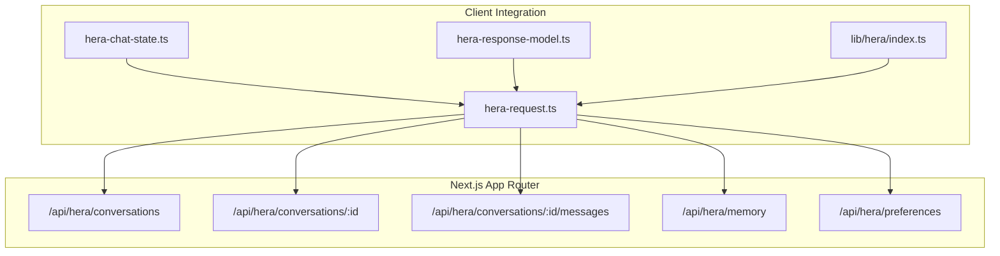
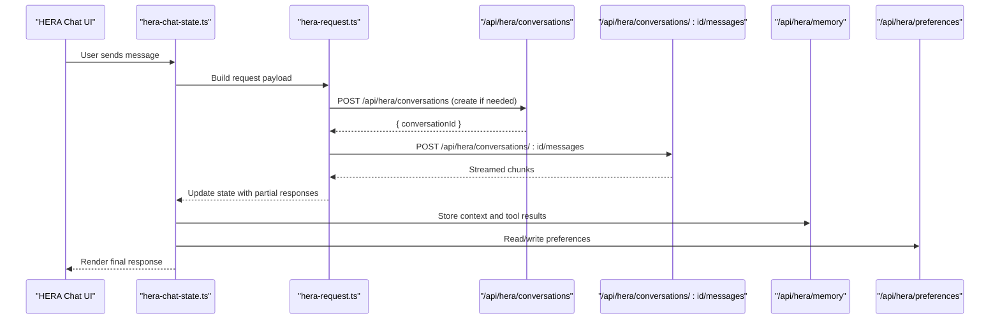
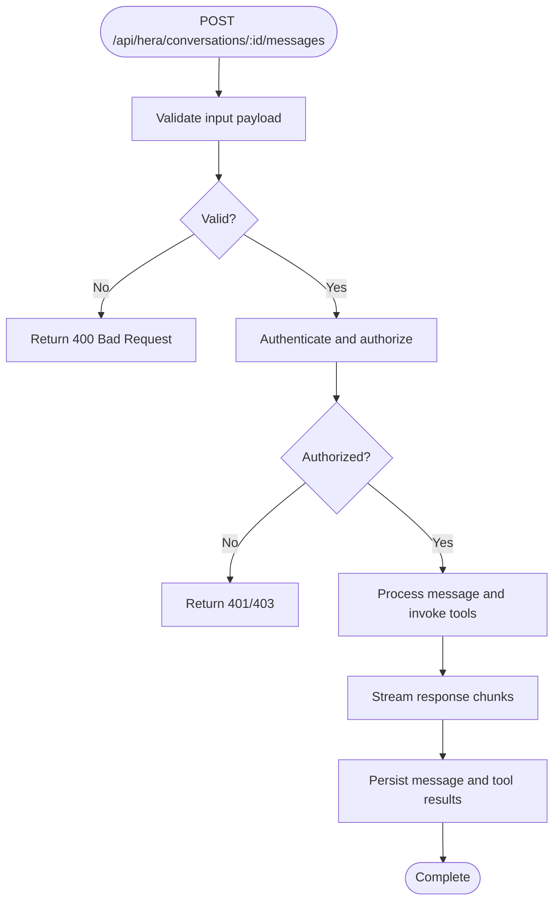
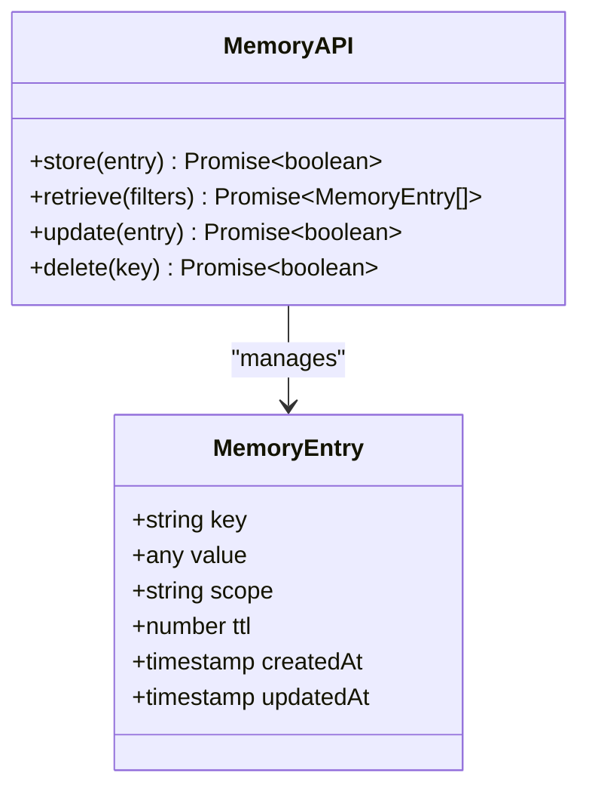
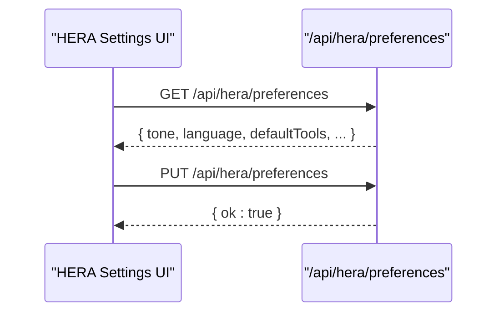
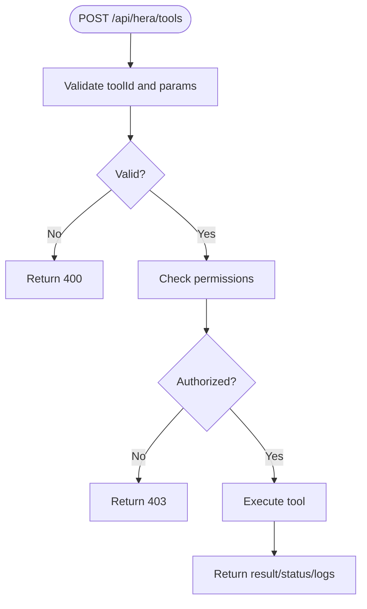
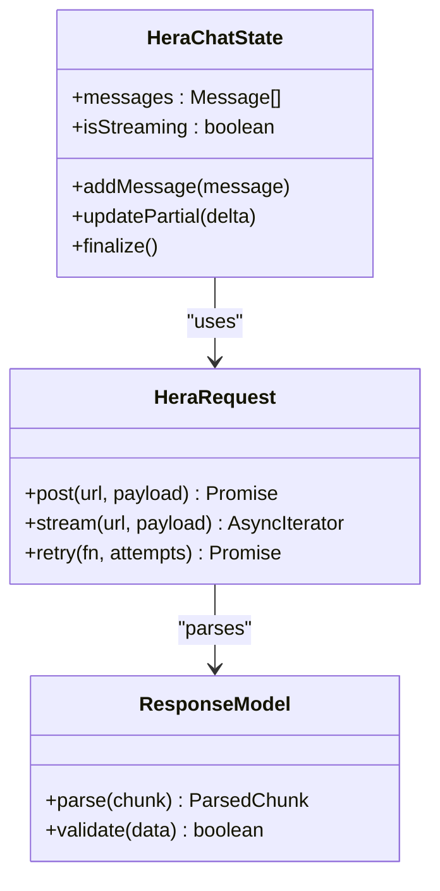
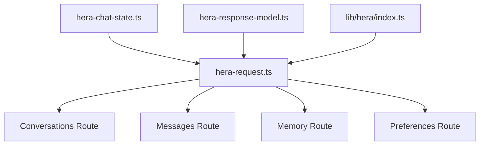

# AI Assistant APIs

<cite>
**Referenced Files in This Document**
- [apps/hr-suite/app/api/hera/conversations/route.ts](file://apps/hr-suite/app/api/hera/conversations/route.ts)
- [apps/hr-suite/app/api/hera/conversations/[conversationId]/route.ts](file://apps/hr-suite/app/api/hera/conversations/[conversationId]/route.ts)
- [apps/hr-suite/app/api/hera/conversations/[conversationId]/messages/route.ts](file://apps/hr-suite/app/api/hera/conversations/[conversationId]/messages/route.ts)
- [apps/hr-suite/app/api/hera/memory/route.ts](file://apps/hr-suite/app/api/hera/memory/route.ts)
- [apps/hr-suite/app/api/hera/preferences/route.ts](file://apps/hr-suite/app/api/hera/preferences/route.ts)
- [apps/hr-suite/components/hera/hera-chat-state.ts](file://apps/hr-suite/components/hera/hera-chat-state.ts)
- [apps/hr-suite/components/hera/hera-request.ts](file://apps/hr-suite/components/hera/hera-request.ts)
- [apps/hr-suite/components/hera/hera-response-model.ts](file://apps/hr-suite/components/hera/hera-response-model.ts)
- [apps/hr-suite/lib/hera/index.ts](file://apps/hr-suite/lib/hera/index.ts)
</cite>

## Table of Contents
1. [Introduction](#introduction)
2. [Project Structure](#project-structure)
3. [Core Components](#core-components)
4. [Architecture Overview](#architecture-overview)
5. [Detailed Component Analysis](#detailed-component-analysis)
6. [Dependency Analysis](#dependency-analysis)
7. [Performance Considerations](#performance-considerations)
8. [Troubleshooting Guide](#troubleshooting-guide)
9. [Conclusion](#conclusion)
10. [Appendices](#appendices)

## Introduction
This document provides comprehensive API documentation for LiquidHR’s AI Assistant (HERA). It covers chat conversation endpoints, memory management, preference management, and tool execution interfaces. It also includes guidance on authentication, real-time communication patterns, error handling, rate limiting, security considerations, and debugging techniques. The goal is to enable developers to integrate with HERA effectively while maintaining reliability and performance.

## Project Structure
The HERA feature spans Next.js App Router API routes under apps/hr-suite/app/api/hera and client-side components and libraries that orchestrate requests and state. Key areas include:
- Conversations API: Create, list, update, delete conversations; send messages and stream responses.
- Memory API: Store and retrieve conversation context, user preferences, and tool execution results.
- Preferences API: Manage user settings and personalize chatbot behavior.
- Client integration: React components and utilities for request lifecycle, streaming, and response modeling.

**Diagram sources**
- [apps/hr-suite/app/api/hera/conversations/route.ts](file://apps/hr-suite/app/api/hera/conversations/route.ts)
- [apps/hr-suite/app/api/hera/conversations/[conversationId]/route.ts](file://apps/hr-suite/app/api/hera/conversations/[conversationId]/route.ts)
- [apps/hr-suite/app/api/hera/conversations/[conversationId]/messages/route.ts](file://apps/hr-suite/app/api/hera/conversations/[conversationId]/messages/route.ts)
- [apps/hr-suite/app/api/hera/memory/route.ts](file://apps/hr-suite/app/api/hera/memory/route.ts)
- [apps/hr-suite/app/api/hera/preferences/route.ts](file://apps/hr-suite/app/api/hera/preferences/route.ts)
- [apps/hr-suite/components/hera/hera-chat-state.ts](file://apps/hr-suite/components/hera/hera-chat-state.ts)
- [apps/hr-suite/components/hera/hera-request.ts](file://apps/hr-suite/components/hera/hera-request.ts)
- [apps/hr-suite/components/hera/hera-response-model.ts](file://apps/hr-suite/components/hera/hera-response-model.ts)
- [apps/hr-suite/lib/hera/index.ts](file://apps/hr-suite/lib/hera/index.ts)

**Section sources**
- [apps/hr-suite/app/api/hera/conversations/route.ts](file://apps/hr-suite/app/api/hera/conversations/route.ts)
- [apps/hr-suite/app/api/hera/conversations/[conversationId]/route.ts](file://apps/hr-suite/app/api/hera/conversations/[conversationId]/route.ts)
- [apps/hr-suite/app/api/hera/conversations/[conversationId]/messages/route.ts](file://apps/hr-suite/app/api/hera/conversations/[conversationId]/messages/route.ts)
- [apps/hr-suite/app/api/hera/memory/route.ts](file://apps/hr-suite/app/api/hera/memory/route.ts)
- [apps/hr-suite/app/api/hera/preferences/route.ts](file://apps/hr-suite/app/api/hera/preferences/route.ts)
- [apps/hr-suite/components/hera/hera-chat-state.ts](file://apps/hr-suite/components/hera/hera-chat-state.ts)
- [apps/hr-suite/components/hera/hera-request.ts](file://apps/hr-suite/components/hera/hera-request.ts)
- [apps/hr-suite/components/hera/hera-response-model.ts](file://apps/hr-suite/components/hera/hera-response-model.ts)
- [apps/hr-suite/lib/hera/index.ts](file://apps/hr-suite/lib/hera/index.ts)

## Core Components
- Conversation Management: Endpoints to create, list, fetch, update, and delete conversations. Supports message sending and streaming responses for real-time interaction.
- Memory Management: Endpoints to store and retrieve contextual data such as conversation history, user preferences, and tool execution results.
- Preference Management: Endpoints to read and write user-specific settings that influence chatbot behavior and personalization.
- Tool Execution: Interfaces for invoking natural language processing, data queries, and automated HR tasks via structured tool calls.
- Client Integration: State management and request utilities for building responsive chat experiences, including streaming and error handling.

**Section sources**
- [apps/hr-suite/app/api/hera/conversations/route.ts](file://apps/hr-suite/app/api/hera/conversations/route.ts)
- [apps/hr-suite/app/api/hera/conversations/[conversationId]/route.ts](file://apps/hr-suite/app/api/hera/conversations/[conversationId]/route.ts)
- [apps/hr-suite/app/api/hera/conversations/[conversationId]/messages/route.ts](file://apps/hr-suite/app/api/hera/conversations/[conversationId]/messages/route.ts)
- [apps/hr-suite/app/api/hera/memory/route.ts](file://apps/hr-suite/app/api/hera/memory/route.ts)
- [apps/hr-suite/app/api/hera/preferences/route.ts](file://apps/hr-suite/app/api/hera/preferences/route.ts)
- [apps/hr-suite/components/hera/hera-chat-state.ts](file://apps/hr-suite/components/hera/hera-chat-state.ts)
- [apps/hr-suite/components/hera/hera-request.ts](file://apps/hr-suite/components/hera/hera-request.ts)
- [apps/hr-suite/components/hera/hera-response-model.ts](file://apps/hr-suite/components/hera/hera-response-model.ts)
- [apps/hr-suite/lib/hera/index.ts](file://apps/hr-suite/lib/hera/index.ts)

## Architecture Overview
The HERA architecture follows a layered approach:
- Frontend components manage UI state and user interactions.
- Request utilities handle HTTP/WebSocket communication, retries, and streaming.
- API routes implement business logic, authorization, and persistence.
- External tools and services are invoked through structured tool calls.

**Diagram sources**
- [apps/hr-suite/components/hera/hera-chat-state.ts](file://apps/hr-suite/components/hera/hera-chat-state.ts)
- [apps/hr-suite/components/hera/hera-request.ts](file://apps/hr-suite/components/hera/hera-request.ts)
- [apps/hr-suite/app/api/hera/conversations/route.ts](file://apps/hr-suite/app/api/hera/conversations/route.ts)
- [apps/hr-suite/app/api/hera/conversations/[conversationId]/messages/route.ts](file://apps/hr-suite/app/api/hera/conversations/[conversationId]/messages/route.ts)
- [apps/hr-suite/app/api/hera/memory/route.ts](file://apps/hr-suite/app/api/hera/memory/route.ts)
- [apps/hr-suite/app/api/hera/preferences/route.ts](file://apps/hr-suite/app/api/hera/preferences/route.ts)

## Detailed Component Analysis

### Conversations API
- Purpose: Manage chat conversations and messages.
- Endpoints:
  - POST /api/hera/conversations: Create a new conversation.
  - GET /api/hera/conversations: List conversations for the current user/context.
  - GET /api/hera/conversations/:conversationId: Fetch conversation details.
  - PATCH /api/hera/conversations/:conversationId: Update conversation metadata.
  - DELETE /api/hera/conversations/:conversationId: Delete a conversation.
  - POST /api/hera/conversations/:conversationId/messages: Send a message and receive streamed responses.
- Authentication: Requires authenticated session or token per application policy.
- Request/Response Schemas:
  - Create conversation: { title?, systemPrompt? } -> { id, createdAt, updatedAt }
  - List conversations: [] -> [{ id, title, createdAt }]
  - Fetch conversation: -> { id, title, messages[], createdAt, updatedAt }
  - Update conversation: { title? } -> { id, title, updatedAt }
  - Delete conversation: -> { success: boolean }
  - Send message: { text, toolCalls? } -> Streamed chunks { delta, type, toolCall? }
- Real-time Communication: Streaming via Server-Sent Events or WebSocket-like chunked responses.
- Error Handling: Validation errors, unauthorized access, rate limits, and internal server errors return standard JSON error objects.

**Diagram sources**
- [apps/hr-suite/app/api/hera/conversations/[conversationId]/messages/route.ts](file://apps/hr-suite/app/api/hera/conversations/[conversationId]/messages/route.ts)

**Section sources**
- [apps/hr-suite/app/api/hera/conversations/route.ts](file://apps/hr-suite/app/api/hera/conversations/route.ts)
- [apps/hr-suite/app/api/hera/conversations/[conversationId]/route.ts](file://apps/hr-suite/app/api/hera/conversations/[conversationId]/route.ts)
- [apps/hr-suite/app/api/hera/conversations/[conversationId]/messages/route.ts](file://apps/hr-suite/app/api/hera/conversations/[conversationId]/messages/route.ts)

### Memory Management API
- Purpose: Store and retrieve conversation context, user preferences, and tool execution results.
- Endpoints:
  - POST /api/hera/memory: Store memory entries.
  - GET /api/hera/memory: Retrieve memory entries by key or scope.
  - PATCH /api/hera/memory: Update existing entries.
  - DELETE /api/hera/memory: Remove specific entries.
- Authentication: Requires authenticated session scoped to tenant/user.
- Request/Response Schemas:
  - Store: { key, value, scope, ttl? } -> { ok: boolean }
  - Retrieve: { key?, scope? } -> { entries[] }
  - Update: { key, value } -> { ok: boolean }
  - Delete: { key } -> { ok: boolean }
- Use Cases:
  - Persisting conversation summaries for quick retrieval.
  - Storing tool execution outputs for auditability.
  - Managing user-level preferences for personalization.

**Diagram sources**
- [apps/hr-suite/app/api/hera/memory/route.ts](file://apps/hr-suite/app/api/hera/memory/route.ts)

**Section sources**
- [apps/hr-suite/app/api/hera/memory/route.ts](file://apps/hr-suite/app/api/hera/memory/route.ts)

### Preferences API
- Purpose: Manage user settings and personalize chatbot behavior.
- Endpoints:
  - GET /api/hera/preferences: Get current preferences.
  - PUT /api/hera/preferences: Update preferences.
- Authentication: Requires authenticated session scoped to user.
- Request/Response Schemas:
  - Get: -> { tone, language, defaultTools[], maxTokens?, temperature? }
  - Update: { tone?, language?, defaultTools?, maxTokens?, temperature? } -> { ok: boolean }
- Behavior Customization:
  - Tone and language affect response style.
  - Default tools define which capabilities are enabled by default.
  - Model parameters like temperature and maxTokens control generation behavior.

**Diagram sources**
- [apps/hr-suite/app/api/hera/preferences/route.ts](file://apps/hr-suite/app/api/hera/preferences/route.ts)

**Section sources**
- [apps/hr-suite/app/api/hera/preferences/route.ts](file://apps/hr-suite/app/api/hera/preferences/route.ts)

### Tool Execution API
- Purpose: Invoke natural language processing, data queries, and automated HR tasks.
- Endpoints:
  - POST /api/hera/tools: Execute a tool call with structured parameters.
  - GET /api/hera/tools/{toolId}: Retrieve tool metadata or status.
- Authentication: Requires authenticated session and appropriate permissions.
- Request/Response Schemas:
  - Execute: { toolId, params } -> { result, status, logs? }
  - Status: -> { status, progress?, error? }
- Patterns:
  - Structured tool calls embedded within message payloads.
  - Asynchronous execution with polling or streaming updates.
  - Audit logging for compliance and debugging.

**Diagram sources**
- [apps/hr-suite/app/api/hera/conversations/[conversationId]/messages/route.ts](file://apps/hr-suite/app/api/hera/conversations/[conversationId]/messages/route.ts)

**Section sources**
- [apps/hr-suite/app/api/hera/conversations/[conversationId]/messages/route.ts](file://apps/hr-suite/app/api/hera/conversations/[conversationId]/messages/route.ts)

### Client Integration
- hera-chat-state.ts: Manages chat state, message history, and streaming updates.
- hera-request.ts: Handles HTTP requests, retries, and streaming parsing.
- hera-response-model.ts: Defines response structures and validation.
- lib/hera/index.ts: Centralizes utility functions and configuration.

**Diagram sources**
- [apps/hr-suite/components/hera/hera-chat-state.ts](file://apps/hr-suite/components/hera/hera-chat-state.ts)
- [apps/hr-suite/components/hera/hera-request.ts](file://apps/hr-suite/components/hera/hera-request.ts)
- [apps/hr-suite/components/hera/hera-response-model.ts](file://apps/hr-suite/components/hera/hera-response-model.ts)
- [apps/hr-suite/lib/hera/index.ts](file://apps/hr-suite/lib/hera/index.ts)

**Section sources**
- [apps/hr-suite/components/hera/hera-chat-state.ts](file://apps/hr-suite/components/hera/hera-chat-state.ts)
- [apps/hr-suite/components/hera/hera-request.ts](file://apps/hr-suite/components/hera/hera-request.ts)
- [apps/hr-suite/components/hera/hera-response-model.ts](file://apps/hr-suite/components/hera/hera-response-model.ts)
- [apps/hr-suite/lib/hera/index.ts](file://apps/hr-suite/lib/hera/index.ts)

## Dependency Analysis
The HERA module depends on Next.js App Router for routing, authentication middleware for security, and external tools/services for AI capabilities. Client components rely on state management and request utilities to provide a seamless user experience.

**Diagram sources**
- [apps/hr-suite/app/api/hera/conversations/route.ts](file://apps/hr-suite/app/api/hera/conversations/route.ts)
- [apps/hr-suite/app/api/hera/conversations/[conversationId]/messages/route.ts](file://apps/hr-suite/app/api/hera/conversations/[conversationId]/messages/route.ts)
- [apps/hr-suite/app/api/hera/memory/route.ts](file://apps/hr-suite/app/api/hera/memory/route.ts)
- [apps/hr-suite/app/api/hera/preferences/route.ts](file://apps/hr-suite/app/api/hera/preferences/route.ts)
- [apps/hr-suite/components/hera/hera-chat-state.ts](file://apps/hr-suite/components/hera/hera-chat-state.ts)
- [apps/hr-suite/components/hera/hera-request.ts](file://apps/hr-suite/components/hera/hera-request.ts)
- [apps/hr-suite/components/hera/hera-response-model.ts](file://apps/hr-suite/components/hera/hera-response-model.ts)
- [apps/hr-suite/lib/hera/index.ts](file://apps/hr-suite/lib/hera/index.ts)

**Section sources**
- [apps/hr-suite/app/api/hera/conversations/route.ts](file://apps/hr-suite/app/api/hera/conversations/route.ts)
- [apps/hr-suite/app/api/hera/conversations/[conversationId]/messages/route.ts](file://apps/hr-suite/app/api/hera/conversations/[conversationId]/messages/route.ts)
- [apps/hr-suite/app/api/hera/memory/route.ts](file://apps/hr-suite/app/api/hera/memory/route.ts)
- [apps/hr-suite/app/api/hera/preferences/route.ts](file://apps/hr-suite/app/api/hera/preferences/route.ts)
- [apps/hr-suite/components/hera/hera-chat-state.ts](file://apps/hr-suite/components/hera/hera-chat-state.ts)
- [apps/hr-suite/components/hera/hera-request.ts](file://apps/hr-suite/components/hera/hera-request.ts)
- [apps/hr-suite/components/hera/hera-response-model.ts](file://apps/hr-suite/components/hera/hera-response-model.ts)
- [apps/hr-suite/lib/hera/index.ts](file://apps/hr-suite/lib/hera/index.ts)

## Performance Considerations
- Streaming Responses: Use chunked responses to reduce latency and improve perceived responsiveness.
- Caching: Cache frequent reads for preferences and memory entries where appropriate.
- Rate Limiting: Implement per-user and per-endpoint rate limits to prevent abuse.
- Concurrency: Handle concurrent message streams safely with proper locking or queueing.
- Resource Cleanup: Ensure timely deletion of temporary files and expired memory entries.

[No sources needed since this section provides general guidance]

## Troubleshooting Guide
- Common Errors:
  - 400 Bad Request: Invalid input payloads; validate schemas before sending.
  - 401 Unauthorized: Missing or invalid authentication tokens; check session validity.
  - 403 Forbidden: Insufficient permissions; verify role-based access controls.
  - 429 Too Many Requests: Rate limit exceeded; implement backoff strategies.
  - 500 Internal Server Error: Unexpected failures; inspect server logs and stack traces.
- Debugging Techniques:
  - Enable verbose logging for tool executions and memory operations.
  - Use network inspection to analyze request/response payloads and streaming chunks.
  - Add tracing IDs to correlate frontend actions with backend logs.
  - Test with minimal payloads to isolate issues.

**Section sources**
- [apps/hr-suite/components/hera/hera-request.ts](file://apps/hr-suite/components/hera/hera-request.ts)
- [apps/hr-suite/components/hera/hera-response-model.ts](file://apps/hr-suite/components/hera/hera-response-model.ts)

## Conclusion
The HERA AI Assistant provides a robust set of APIs for managing conversations, memory, preferences, and tool executions. By following the documented endpoints, authentication requirements, and best practices, developers can build reliable and personalized AI-powered features. Proper error handling, rate limiting, and debugging strategies ensure a smooth integration experience.

[No sources needed since this section summarizes without analyzing specific files]

## Appendices
- Example Interactions:
  - Create a conversation and send a message to receive a streamed response.
  - Store memory entries for future retrieval and context enrichment.
  - Update preferences to customize tone, language, and enabled tools.
- Integration Approaches:
  - Use client libraries for consistent request handling and error management.
  - Implement retry logic with exponential backoff for resilience.
  - Leverage streaming for real-time feedback during long-running operations.

[No sources needed since this section provides general guidance]