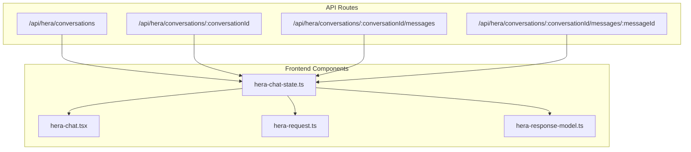
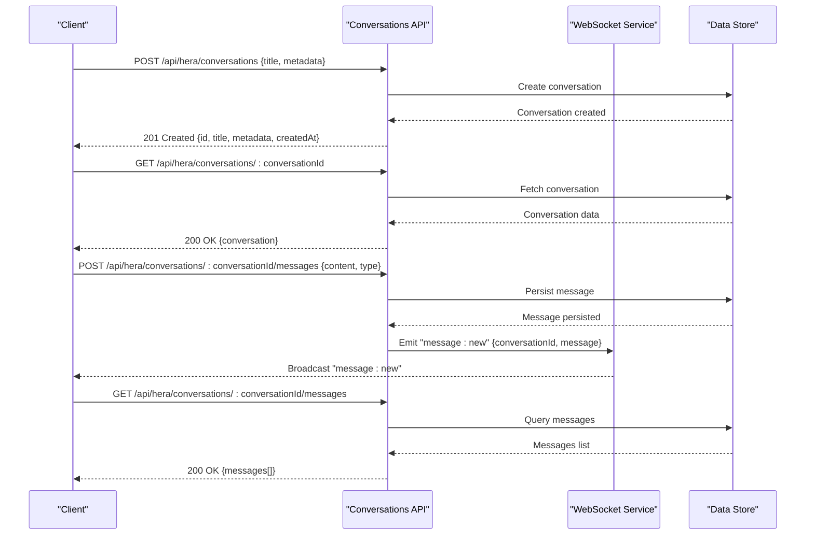
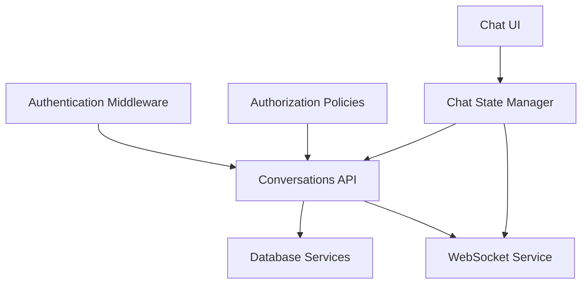

# Conversation Management APIs

<cite>
**Referenced Files in This Document**
- [route.ts](file://apps/hr-suite/app/api/hera/conversations/route.ts)
- [route.ts](file://apps/hr-suite/app/api/hera/conversations/[conversationId]/route.ts)
- [route.ts](file://apps/hr-suite/app/api/hera/conversations/[conversationId]/messages/route.ts)
- [route.ts](file://apps/hr-suite/app/api/hera/conversations/[conversationId]/messages/[messageId]/route.ts)
- [hera-chat-state.ts](file://apps/hr-suite/components/hera/hera-chat-state.ts)
- [hera-chat.tsx](file://apps/hr-suite/components/hera/hera-chat.tsx)
- [hera-request.ts](file://apps/hr-suite/components/hera/hera-request.ts)
- [hera-response-model.ts](file://apps/hr-suite/components/hera/hera-response-model.ts)
- [HERA_AI_AGENT.md](file://docs/requirements/chatbot/HERA_AI_AGENT.md)
- [HR_CHATBOT_LEES_EN_SCHRIJFTOOLS.md](file://docs/requirements/chatbot/HR_CHATBOT_LEES_EN_SCHRIJFTOOLS.md)
</cite>

## Table of Contents
1. [Introduction](#introduction)
2. [Project Structure](#project-structure)
3. [Core Components](#core-components)
4. [Architecture Overview](#architecture-overview)
5. [Detailed Component Analysis](#detailed-component-analysis)
6. [Dependency Analysis](#dependency-analysis)
7. [Performance Considerations](#performance-considerations)
8. [Troubleshooting Guide](#troubleshooting-guide)
9. [Conclusion](#conclusion)

## Introduction
This document provides API documentation for HERA conversation management endpoints within the LiquidHR application. It covers HTTP endpoints for creating, retrieving, and managing conversations; message handling within conversations; real-time updates via WebSocket connections; and conversation state management. Authentication requirements, error handling, rate limiting considerations, and security best practices are included to help developers integrate chat functionality safely and efficiently.

## Project Structure
The HERA conversation management is implemented as Next.js App Router API routes under apps/hr-suite/app/api/hera/conversations. The frontend components for chat state and WebSocket interactions live under apps/hr-suite/components/hera.

**Diagram sources**
- [route.ts](file://apps/hr-suite/app/api/hera/conversations/route.ts)
- [route.ts](file://apps/hr-suite/app/api/hera/conversations/[conversationId]/route.ts)
- [route.ts](file://apps/hr-suite/app/api/hera/conversations/[conversationId]/messages/route.ts)
- [route.ts](file://apps/hr-suite/app/api/hera/conversations/[conversationId]/messages/[messageId]/route.ts)
- [hera-chat-state.ts](file://apps/hr-suite/components/hera/hera-chat-state.ts)
- [hera-chat.tsx](file://apps/hr-suite/components/hera/hera-chat.tsx)
- [hera-request.ts](file://apps/hr-suite/components/hera/hera-request.ts)
- [hera-response-model.ts](file://apps/hr-suite/components/hera/hera-response-model.ts)

**Section sources**
- [route.ts](file://apps/hr-suite/app/api/hera/conversations/route.ts)
- [route.ts](file://apps/hr-suite/app/api/hera/conversations/[conversationId]/route.ts)
- [route.ts](file://apps/hr-suite/app/api/hera/conversations/[conversationId]/messages/route.ts)
- [route.ts](file://apps/hr-suite/app/api/hera/conversations/[conversationId]/messages/[messageId]/route.ts)
- [hera-chat-state.ts](file://apps/hr-suite/components/hera/hera-chat-state.ts)
- [hera-chat.tsx](file://apps/hr-suite/components/hera/hera-chat.tsx)
- [hera-request.ts](file://apps/hr-suite/components/hera/hera-request.ts)
- [hera-response-model.ts](file://apps/hr-suite/components/hera/hera-response-model.ts)

## Core Components
- API Endpoints:
  - Conversations collection endpoint for listing and creation.
  - Single conversation endpoint for retrieval and metadata updates.
  - Messages collection endpoint for sending messages within a conversation.
  - Individual message endpoint for retrieval and updates.
- Frontend Chat State:
  - Manages conversation lifecycle, message queueing, and real-time updates.
- Request/Response Models:
  - Defines request payloads and response schemas for robust client-server contracts.

Key responsibilities:
- Authentication and authorization enforcement at route level.
- Input validation and sanitization before persistence.
- Real-time event broadcasting via WebSocket for live updates.
- Error normalization and consistent error responses.

**Section sources**
- [route.ts](file://apps/hr-suite/app/api/hera/conversations/route.ts)
- [route.ts](file://apps/hr-suite/app/api/hera/conversations/[conversationId]/route.ts)
- [route.ts](file://apps/hr-suite/app/api/hera/conversations/[conversationId]/messages/route.ts)
- [route.ts](file://apps/hr-suite/app/api/hera/conversations/[conversationId]/messages/[messageId]/route.ts)
- [hera-chat-state.ts](file://apps/hr-suite/components/hera/hera-chat-state.ts)
- [hera-request.ts](file://apps/hr-suite/components/hera/hera-request.ts)
- [hera-response-model.ts](file://apps/hr-suite/components/hera/hera-response-model.ts)

## Architecture Overview
The HERA conversation system follows a layered architecture:
- Client (Next.js app or external clients) interacts with REST endpoints for CRUD operations on conversations and messages.
- Server-side routes handle authentication, authorization, input validation, and business logic.
- Real-time communication uses WebSocket events to push updates to connected clients.
- Data persistence is handled by backend storage (e.g., database), abstracted through services used by routes.

**Diagram sources**
- [route.ts](file://apps/hr-suite/app/api/hera/conversations/route.ts)
- [route.ts](file://apps/hr-suite/app/api/hera/conversations/[conversationId]/route.ts)
- [route.ts](file://apps/hr-suite/app/api/hera/conversations/[conversationId]/messages/route.ts)
- [route.ts](file://apps/hr-suite/app/api/hera/conversations/[conversationId]/messages/[messageId]/route.ts)

## Detailed Component Analysis

### Conversations Collection Endpoint
- Method: POST
- URL: /api/hera/conversations
- Purpose: Create a new conversation.
- Authentication: Requires authenticated user session; checks role-based permissions.
- Request Schema:
  - title: string (required)
  - metadata: object (optional)
- Response Schema:
  - id: string
  - title: string
  - metadata: object
  - createdAt: timestamp
- Status Codes:
  - 201 Created: Success
  - 400 Bad Request: Validation errors
  - 401 Unauthorized: Missing or invalid credentials
  - 403 Forbidden: Insufficient permissions
  - 429 Too Many Requests: Rate limit exceeded

**Section sources**
- [route.ts](file://apps/hr-suite/app/api/hera/conversations/route.ts)

### Single Conversation Endpoint
- Methods: GET, PATCH
- URL: /api/hera/conversations/:conversationId
- Purpose: Retrieve conversation details or update metadata.
- Authentication: Requires authenticated user with read/write access to the conversation.
- Request Schema (PATCH):
  - metadata: object (partial update allowed)
- Response Schema:
  - id: string
  - title: string
  - metadata: object
  - updatedAt: timestamp
- Status Codes:
  - 200 OK: Success
  - 404 Not Found: Conversation does not exist
  - 401 Unauthorized: Missing or invalid credentials
  - 403 Forbidden: Insufficient permissions
  - 429 Too Many Requests: Rate limit exceeded

**Section sources**
- [route.ts](file://apps/hr-suite/app/api/hera/conversations/[conversationId]/route.ts)

### Messages Collection Endpoint
- Method: POST
- URL: /api/hera/conversations/:conversationId/messages
- Purpose: Send a new message within a conversation.
- Authentication: Requires authenticated user with write access to the conversation.
- Request Schema:
  - content: string (required)
  - type: enum (text, system, ai) (required)
  - attachments: array (optional)
- Response Schema:
  - id: string
  - conversationId: string
  - content: string
  - type: enum
  - senderId: string
  - createdAt: timestamp
- Real-time Update: Emits WebSocket event "message:new" to all subscribers of the conversation.
- Status Codes:
  - 201 Created: Success
  - 400 Bad Request: Validation errors
  - 401 Unauthorized: Missing or invalid credentials
  - 403 Forbidden: Insufficient permissions
  - 404 Not Found: Conversation does not exist
  - 429 Too Many Requests: Rate limit exceeded

**Section sources**
- [route.ts](file://apps/hr-suite/app/api/hera/conversations/[conversationId]/messages/route.ts)

### Individual Message Endpoint
- Methods: GET, PATCH
- URL: /api/hera/conversations/:conversationId/messages/:messageId
- Purpose: Retrieve message details or update message metadata.
- Authentication: Requires authenticated user with read/write access to the conversation.
- Request Schema (PATCH):
  - metadata: object (partial update allowed)
- Response Schema:
  - id: string
  - conversationId: string
  - content: string
  - type: enum
  - senderId: string
  - createdAt: timestamp
  - updatedAt: timestamp
- Status Codes:
  - 200 OK: Success
  - 404 Not Found: Message or conversation does not exist
  - 401 Unauthorized: Missing or invalid credentials
  - 403 Forbidden: Insufficient permissions
  - 429 Too Many Requests: Rate limit exceeded

**Section sources**
- [route.ts](file://apps/hr-suite/app/api/hera/conversations/[conversationId]/messages/[messageId]/route.ts)

### WebSocket Real-Time Updates
- Event Types:
  - message:new: New message broadcast to conversation subscribers.
  - conversation:updated: Metadata changes broadcast to conversation subscribers.
- Connection:
  - Clients connect to WebSocket endpoint using authentication token.
  - Subscriptions are scoped per conversation ID.
- Payloads:
  - message:new: { conversationId, message }
  - conversation:updated: { conversationId, updatedFields }

**Section sources**
- [hera-chat-state.ts](file://apps/hr-suite/components/hera/hera-chat-state.ts)
- [hera-chat.tsx](file://apps/hr-suite/components/hera/hera-chat.tsx)

### Conversation State Management
- State Fields:
  - activeConversationId: string | null
  - messages: Map<conversationId, Message[]>
  - loading: boolean
  - error: string | null
- Actions:
  - createConversation(title, metadata)
  - fetchConversation(conversationId)
  - sendMessage(conversationId, content, type, attachments)
  - subscribeToConversation(conversationId)
  - unsubscribeFromConversation(conversationId)

**Section sources**
- [hera-chat-state.ts](file://apps/hr-suite/components/hera/hera-chat-state.ts)

### Request and Response Models
- Request Models:
  - CreateConversationRequest: { title, metadata }
  - SendMessageRequest: { content, type, attachments }
  - UpdateConversationMetadataRequest: { metadata }
  - UpdateMessageMetadataRequest: { metadata }
- Response Models:
  - ConversationResponse: { id, title, metadata, createdAt, updatedAt }
  - MessageResponse: { id, conversationId, content, type, senderId, createdAt, updatedAt }
  - ErrorResponse: { code, message, details }

**Section sources**
- [hera-request.ts](file://apps/hr-suite/components/hera/hera-request.ts)
- [hera-response-model.ts](file://apps/hr-suite/components/hera/hera-response-model.ts)

## Dependency Analysis
The HERA conversation management depends on:
- Authentication middleware for user identity and role verification.
- Authorization policies for resource-level access control.
- Database services for persistent storage of conversations and messages.
- WebSocket service for real-time event broadcasting.
- Frontend chat state for UI synchronization and user interactions.

**Diagram sources**
- [route.ts](file://apps/hr-suite/app/api/hera/conversations/route.ts)
- [route.ts](file://apps/hr-suite/app/api/hera/conversations/[conversationId]/route.ts)
- [route.ts](file://apps/hr-suite/app/api/hera/conversations/[conversationId]/messages/route.ts)
- [route.ts](file://apps/hr-suite/app/api/hera/conversations/[conversationId]/messages/[messageId]/route.ts)
- [hera-chat-state.ts](file://apps/hr-suite/components/hera/hera-chat-state.ts)
- [hera-chat.tsx](file://apps/hr-suite/components/hera/hera-chat.tsx)

**Section sources**
- [route.ts](file://apps/hr-suite/app/api/hera/conversations/route.ts)
- [route.ts](file://apps/hr-suite/app/api/hera/conversations/[conversationId]/route.ts)
- [route.ts](file://apps/hr-suite/app/api/hera/conversations/[conversationId]/messages/route.ts)
- [route.ts](file://apps/hr-suite/app/api/hera/conversations/[conversationId]/messages/[messageId]/route.ts)
- [hera-chat-state.ts](file://apps/hr-suite/components/hera/hera-chat-state.ts)
- [hera-chat.tsx](file://apps/hr-suite/components/hera/hera-chat.tsx)

## Performance Considerations
- Pagination: Implement pagination for message retrieval to reduce payload size.
- Caching: Cache frequently accessed conversation metadata to minimize database queries.
- WebSocket Scaling: Use horizontal scaling for WebSocket servers to handle concurrent connections.
- Rate Limiting: Apply rate limits per user and per endpoint to prevent abuse.
- Compression: Enable response compression for large payloads.

[No sources needed since this section provides general guidance]

## Troubleshooting Guide
Common issues and resolutions:
- Authentication Failures:
  - Ensure valid session tokens are included in requests.
  - Verify user roles have sufficient permissions for the requested operation.
- Validation Errors:
  - Check request schema compliance for required fields and types.
  - Validate input lengths and formats before sending requests.
- WebSocket Connection Issues:
  - Confirm WebSocket endpoint availability and network connectivity.
  - Reconnect automatically on connection loss with exponential backoff.
- Rate Limiting:
  - Monitor 429 responses and implement retry logic with backoff strategies.
  - Adjust rate limits based on application usage patterns.

**Section sources**
- [route.ts](file://apps/hr-suite/app/api/hera/conversations/route.ts)
- [route.ts](file://apps/hr-suite/app/api/hera/conversations/[conversationId]/route.ts)
- [route.ts](file://apps/hr-suite/app/api/hera/conversations/[conversationId]/messages/route.ts)
- [route.ts](file://apps/hr-suite/app/api/hera/conversations/[conversationId]/messages/[messageId]/route.ts)
- [hera-chat-state.ts](file://apps/hr-suite/components/hera/hera-chat-state.ts)

## Conclusion
The HERA conversation management system provides a comprehensive set of RESTful endpoints for conversation and message operations, complemented by real-time WebSocket updates for seamless user experiences. Proper authentication, authorization, input validation, and error handling ensure secure and reliable chat functionality. Developers should follow the documented schemas and best practices to integrate effectively while maintaining performance and scalability.

[No sources needed since this section summarizes without analyzing specific files]