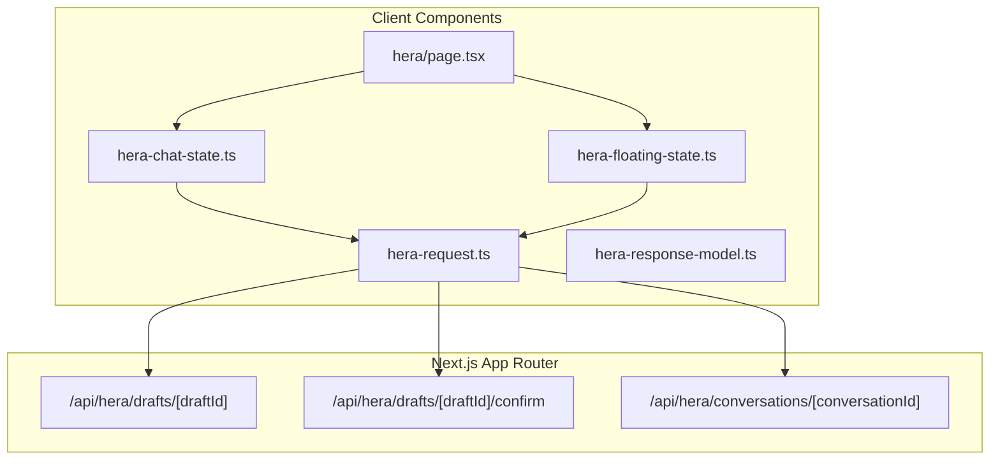
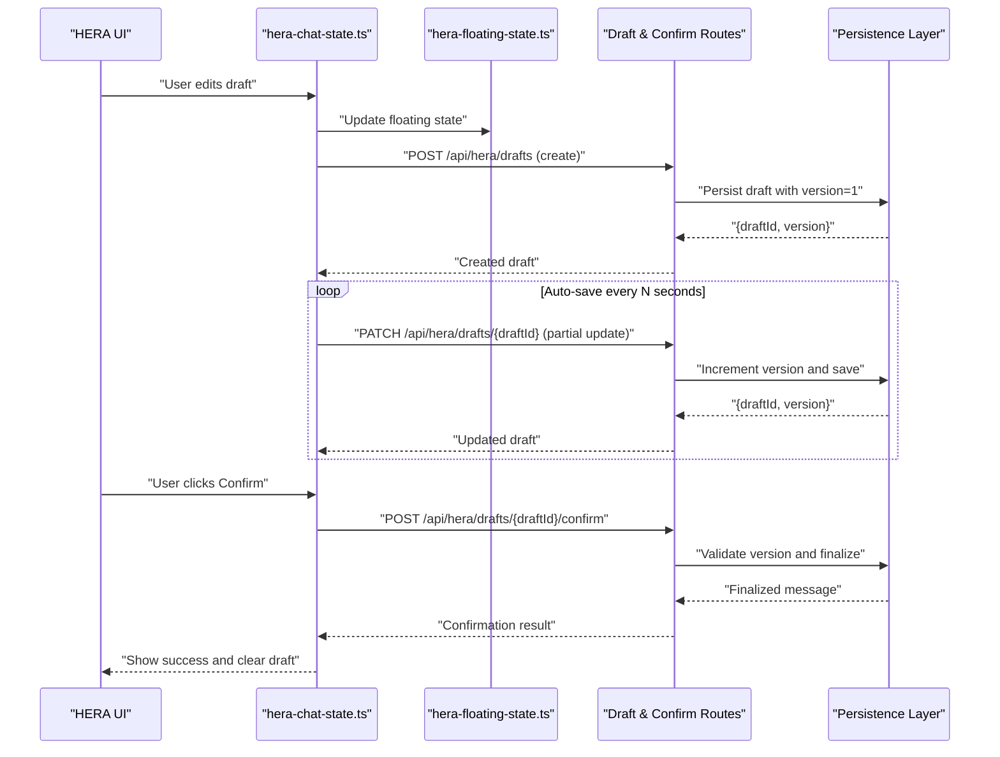
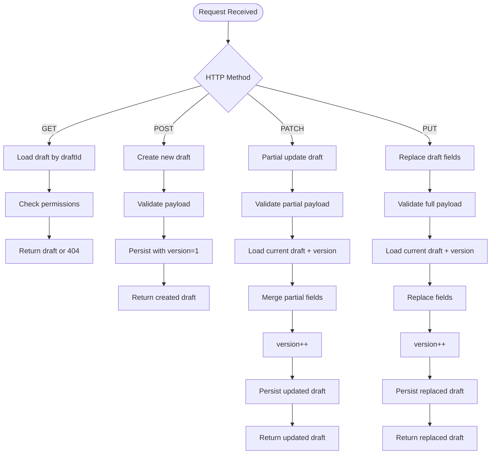
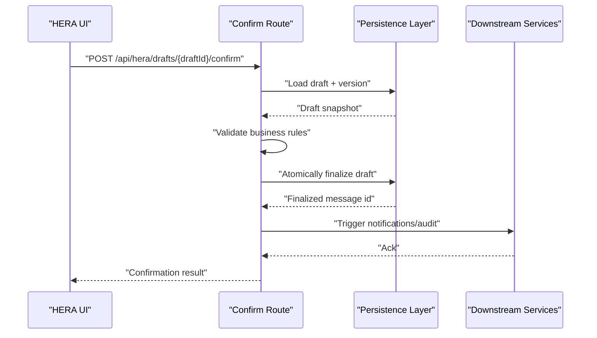
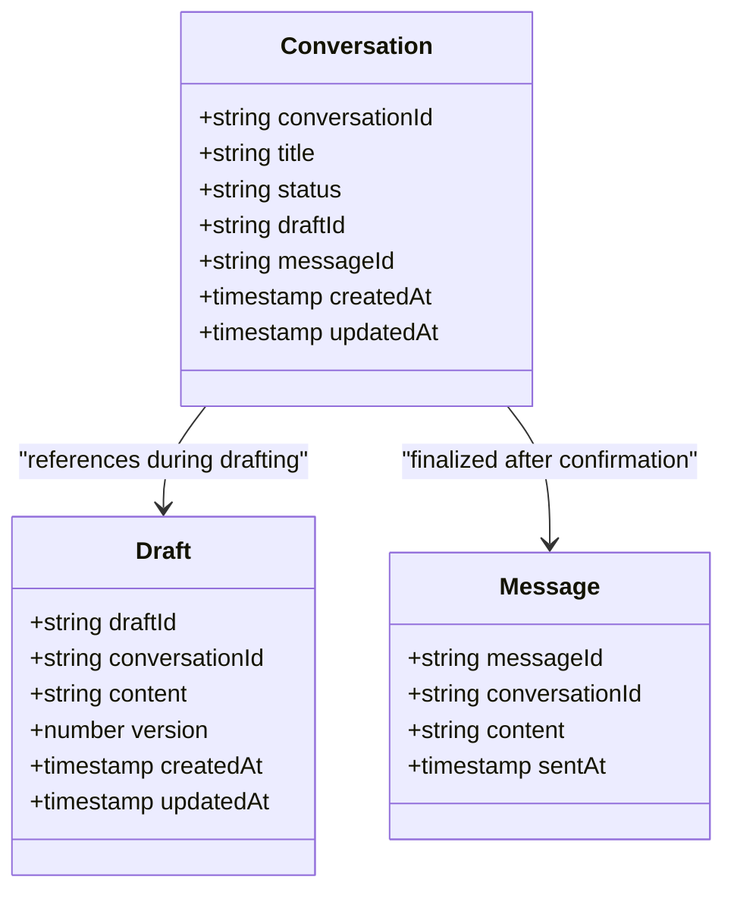
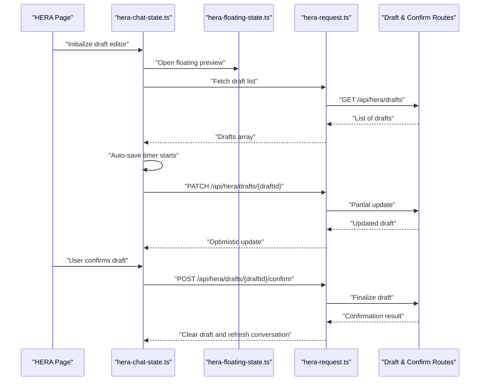
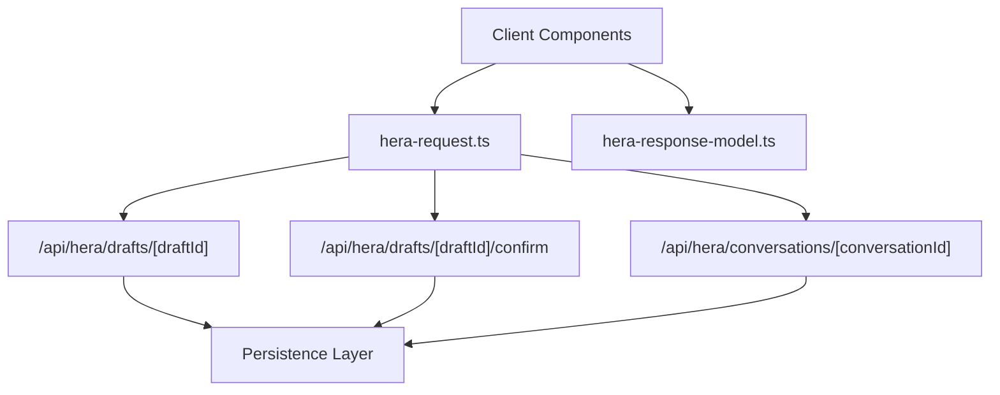

# Draft Management APIs

<cite>
**Referenced Files in This Document**
- [route.ts](file://apps/hr-suite/app/api/hera/drafts/[draftId]/route.ts)
- [route.ts](file://apps/hr-suite/app/api/hera/drafts/[draftId]/confirm/route.ts)
- [route.ts](file://apps/hr-suite/app/api/hera/conversations/[conversationId]/route.ts)
- [hera-chat-state.ts](file://apps/hr-suite/components/hera/hera-chat-state.ts)
- [hera-floating-state.ts](file://apps/hr-suite/components/hera/hera-floating-state.ts)
- [hera-request.ts](file://apps/hr-suite/components/hera/hera-request.ts)
- [hera-response-model.ts](file://apps/hr-suite/components/hera/hera-response-model.ts)
- [page.tsx](file://apps/hr-suite/app/(dashboard)/hera/page.tsx)
</cite>

## Table of Contents
1. [Introduction](#introduction)
2. [Project Structure](#project-structure)
3. [Core Components](#core-components)
4. [Architecture Overview](#architecture-overview)
5. [Detailed Component Analysis](#detailed-component-analysis)
6. [Dependency Analysis](#dependency-analysis)
7. [Performance Considerations](#performance-considerations)
8. [Troubleshooting Guide](#troubleshooting-guide)
9. [Conclusion](#conclusion)
10. [Appendices](#appendices)

## Introduction
This document provides API documentation for HERA draft management endpoints, focusing on creation, saving, retrieval, and conversion of draft messages and conversation states. It covers draft persistence, auto-save behavior, recovery mechanisms, versioning, conflict resolution, and cleanup policies for expired drafts. The goal is to enable developers to implement robust draft workflows that preserve user progress and ensure reliable transitions from drafts to final messages.

## Project Structure
The HERA draft management functionality spans Next.js App Router routes under the hera module and client-side state components:
- Server routes handle draft CRUD operations and confirmation flows.
- Client components manage chat state, floating UI state, request/response models, and orchestrate interactions with server endpoints.

**Diagram sources**
- [route.ts](file://apps/hr-suite/app/api/hera/drafts/[draftId]/route.ts)
- [route.ts](file://apps/hr-suite/app/api/hera/drafts/[draftId]/confirm/route.ts)
- [route.ts](file://apps/hr-suite/app/api/hera/conversations/[conversationId]/route.ts)
- [hera-chat-state.ts](file://apps/hr-suite/components/hera/hera-chat-state.ts)
- [hera-floating-state.ts](file://apps/hr-suite/components/hera/hera-floating-state.ts)
- [hera-request.ts](file://apps/hr-suite/components/hera/hera-request.ts)
- [hera-response-model.ts](file://apps/hr-suite/components/hera/hera-response-model.ts)
- [page.tsx](file://apps/hr-suite/app/(dashboard)/hera/page.tsx)

**Section sources**
- [route.ts](file://apps/hr-suite/app/api/hera/drafts/[draftId]/route.ts)
- [route.ts](file://apps/hr-suite/app/api/hera/drafts/[draftId]/confirm/route.ts)
- [route.ts](file://apps/hr-suite/app/api/hera/conversations/[conversationId]/route.ts)
- [hera-chat-state.ts](file://apps/hr-suite/components/hera/hera-chat-state.ts)
- [hera-floating-state.ts](file://apps/hr-suite/components/hera/hera-floating-state.ts)
- [hera-request.ts](file://apps/hr-suite/components/hera/hera-request.ts)
- [hera-response-model.ts](file://apps/hr-suite/components/hera/hera-response-model.ts)
- [page.tsx](file://apps/hr-suite/app/(dashboard)/hera/page.tsx)

## Core Components
- Draft Route Handler: Manages GET/POST/PUT/PATCH operations for a specific draft identified by draftId. Supports creating new drafts, updating partial content, retrieving existing drafts, and marking drafts as ready for confirmation.
- Confirm Route Handler: Finalizes a draft into a published message or conversation entry, handling validation, version checks, and side effects such as notifications or downstream updates.
- Conversation Route Handler: Provides retrieval and updates for conversation metadata and state associated with a draft or its finalized counterpart.
- Client State Managers: Maintain local draft state, auto-save triggers, and optimistic UI updates while coordinating with server endpoints.
- Request/Response Models: Define typed payloads and responses for draft operations, ensuring consistent data contracts between client and server.

**Section sources**
- [route.ts](file://apps/hr-suite/app/api/hera/drafts/[draftId]/route.ts)
- [route.ts](file://apps/hr-suite/app/api/hera/drafts/[draftId]/confirm/route.ts)
- [route.ts](file://apps/hr-suite/app/api/hera/conversations/[conversationId]/route.ts)
- [hera-chat-state.ts](file://apps/hr-suite/components/hera/hera-chat-state.ts)
- [hera-floating-state.ts](file://apps/hr-suite/components/hera/hera-floating-state.ts)
- [hera-request.ts](file://apps/hr-suite/components/hera/hera-request.ts)
- [hera-response-model.ts](file://apps/hr-suite/components/hera/hera-response-model.ts)

## Architecture Overview
The draft management architecture follows a layered approach:
- Client Layer: UI components and state managers orchestrate draft editing, auto-save intervals, and user actions (save, confirm).
- API Layer: Next.js route handlers expose RESTful endpoints for draft CRUD and confirmation.
- Persistence Layer: Data storage (e.g., database or cache) persists drafts with versioning and timestamps.
- Integration Layer: Downstream services may be triggered upon draft confirmation (e.g., notifications, audit logs).

**Diagram sources**
- [route.ts](file://apps/hr-suite/app/api/hera/drafts/[draftId]/route.ts)
- [route.ts](file://apps/hr-suite/app/api/hera/drafts/[draftId]/confirm/route.ts)
- [hera-chat-state.ts](file://apps/hr-suite/components/hera/hera-chat-state.ts)
- [hera-floating-state.ts](file://apps/hr-suite/components/hera/hera-floating-state.ts)

## Detailed Component Analysis

### Draft Route Handler (/api/hera/drafts/[draftId])
Responsibilities:
- Create a new draft when POST is called without an existing draftId context.
- Retrieve draft details via GET using draftId.
- Update partial fields via PATCH or PUT, incrementing version and persisting changes.
- Validate inputs, enforce tenant/user scoping, and return standardized responses.

Key behaviors:
- Auto-save integration: Client triggers periodic PATCH requests; server merges partial updates atomically.
- Versioning: Each update increments a version field to support optimistic concurrency control.
- Error handling: Returns appropriate status codes for not found, validation errors, and conflicts.

**Diagram sources**
- [route.ts](file://apps/hr-suite/app/api/hera/drafts/[draftId]/route.ts)

**Section sources**
- [route.ts](file://apps/hr-suite/app/api/hera/drafts/[draftId]/route.ts)

### Confirm Route Handler (/api/hera/drafts/[draftId]/confirm)
Responsibilities:
- Finalize a draft into a published message or conversation entry.
- Perform validation, version checks, and business rule enforcement.
- Trigger downstream side effects (e.g., notifications, audit logging).
- Clean up draft after successful confirmation or mark it as superseded.

Key behaviors:
- Conflict resolution: If version mismatch detected, returns conflict status with latest draft snapshot.
- Idempotency: Ensures repeated confirm calls do not duplicate finalization.
- Cleanup policy: Expired drafts are purged based on retention rules; confirmed drafts transition to archived state.

**Diagram sources**
- [route.ts](file://apps/hr-suite/app/api/hera/drafts/[draftId]/confirm/route.ts)

**Section sources**
- [route.ts](file://apps/hr-suite/app/api/hera/drafts/[draftId]/confirm/route.ts)

### Conversation Route Handler (/api/hera/conversations/[conversationId])
Responsibilities:
- Retrieve conversation metadata and state linked to a draft or its finalized counterpart.
- Support listing recent conversations and filtering by status (draft, published, archived).
- Provide endpoints for appending messages and managing conversation lifecycle.

Key behaviors:
- Draft linkage: Conversations can reference draftId during drafting phase and switch to messageId upon confirmation.
- State synchronization: Ensures conversation state reflects the latest draft or published message.

**Diagram sources**
- [route.ts](file://apps/hr-suite/app/api/hera/conversations/[conversationId]/route.ts)

**Section sources**
- [route.ts](file://apps/hr-suite/app/api/hera/conversations/[conversationId]/route.ts)

### Client-Side State and Request Handling
- hera-chat-state.ts: Manages local draft state, auto-save timers, and optimistic updates. Coordinates with floating state to reflect UI changes.
- hera-floating-state.ts: Handles floating panel visibility and transient draft previews.
- hera-request.ts: Encapsulates HTTP requests to draft and confirm endpoints, including retry logic and error mapping.
- hera-response-model.ts: Defines response shapes for draft operations, ensuring type safety across the client.

**Diagram sources**
- [hera-chat-state.ts](file://apps/hr-suite/components/hera/hera-chat-state.ts)
- [hera-floating-state.ts](file://apps/hr-suite/components/hera/hera-floating-state.ts)
- [hera-request.ts](file://apps/hr-suite/components/hera/hera-request.ts)
- [hera-response-model.ts](file://apps/hr-suite/components/hera/hera-response-model.ts)
- [route.ts](file://apps/hr-suite/app/api/hera/drafts/[draftId]/route.ts)
- [route.ts](file://apps/hr-suite/app/api/hera/drafts/[draftId]/confirm/route.ts)

**Section sources**
- [hera-chat-state.ts](file://apps/hr-suite/components/hera/hera-chat-state.ts)
- [hera-floating-state.ts](file://apps/hr-suite/components/hera/hera-floating-state.ts)
- [hera-request.ts](file://apps/hr-suite/components/hera/hera-request.ts)
- [hera-response-model.ts](file://apps/hr-suite/components/hera/hera-response-model.ts)

## Dependency Analysis
The draft management system exhibits clear separation of concerns:
- Client components depend on request utilities and response models.
- API routes depend on persistence layer abstractions and business rules.
- Conversation routes bridge draft and finalized message states.

**Diagram sources**
- [hera-request.ts](file://apps/hr-suite/components/hera/hera-request.ts)
- [hera-response-model.ts](file://apps/hr-suite/components/hera/hera-response-model.ts)
- [route.ts](file://apps/hr-suite/app/api/hera/drafts/[draftId]/route.ts)
- [route.ts](file://apps/hr-suite/app/api/hera/drafts/[draftId]/confirm/route.ts)
- [route.ts](file://apps/hr-suite/app/api/hera/conversations/[conversationId]/route.ts)

**Section sources**
- [hera-request.ts](file://apps/hr-suite/components/hera/hera-request.ts)
- [hera-response-model.ts](file://apps/hr-suite/components/hera/hera-response-model.ts)
- [route.ts](file://apps/hr-suite/app/api/hera/drafts/[draftId]/route.ts)
- [route.ts](file://apps/hr-suite/app/api/hera/drafts/[draftId]/confirm/route.ts)
- [route.ts](file://apps/hr-suite/app/api/hera/conversations/[conversationId]/route.ts)

## Performance Considerations
- Auto-save throttling: Implement debounced or interval-based saves to avoid excessive network requests.
- Optimistic UI updates: Apply immediate UI changes before server confirmation to improve perceived performance.
- Batch operations: Where possible, batch multiple draft updates into a single request.
- Indexing: Ensure database indexes on draftId, conversationId, and version fields for fast lookups.
- Concurrency control: Use version fields to prevent lost updates and reduce retry storms.

[No sources needed since this section provides general guidance]

## Troubleshooting Guide
Common issues and resolutions:
- Version conflicts: Occur when concurrent edits happen; resolve by refreshing draft state and merging changes.
- Auto-save failures: Check network connectivity and retry logic; log failed PATCH requests for diagnostics.
- Confirmation errors: Validate business rules and ensure draft exists and is not already confirmed.
- Cleanup policies: Monitor expired draft retention and purge jobs; verify cleanup schedules align with business requirements.

**Section sources**
- [route.ts](file://apps/hr-suite/app/api/hera/drafts/[draftId]/route.ts)
- [route.ts](file://apps/hr-suite/app/api/hera/drafts/[draftId]/confirm/route.ts)

## Conclusion
The HERA draft management APIs provide a robust foundation for creating, saving, retrieving, and finalizing drafts with strong versioning and conflict resolution. By integrating auto-save functionality and clear cleanup policies, the system ensures reliable draft persistence and smooth transitions to final messages. Developers should leverage the provided endpoints and client utilities to build responsive and resilient draft workflows.

[No sources needed since this section summarizes without analyzing specific files]

## Appendices

### API Endpoints Summary
- POST /api/hera/drafts: Create a new draft.
- GET /api/hera/drafts/{draftId}: Retrieve draft details.
- PATCH /api/hera/drafts/{draftId}: Partially update a draft.
- PUT /api/hera/drafts/{draftId}: Replace draft fields.
- POST /api/hera/drafts/{draftId}/confirm: Finalize a draft into a published message.
- GET /api/hera/conversations/{conversationId}: Retrieve conversation metadata and state.

[No sources needed since this section lists endpoints conceptually]