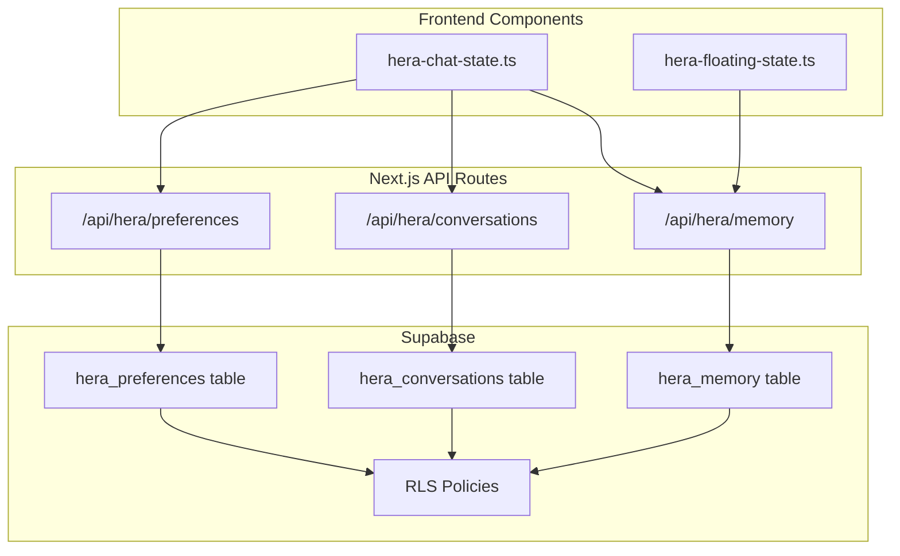
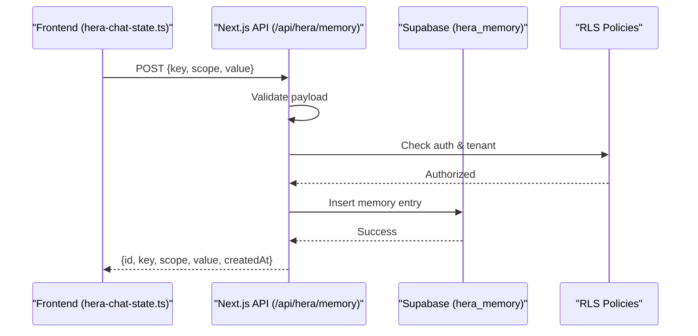
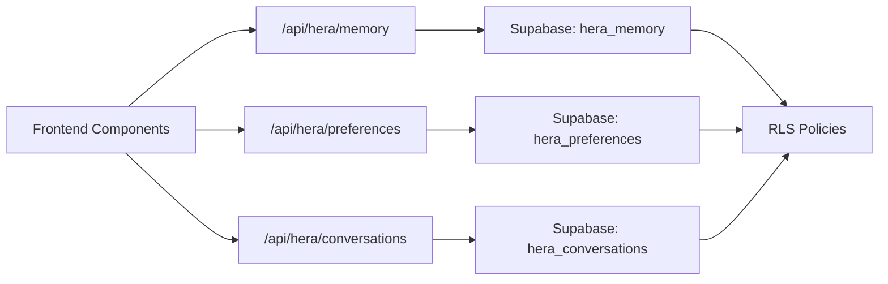

# Memory Management APIs

<cite>
**Referenced Files in This Document**
- [apps/hr-suite/app/api/hera/memory/route.ts](file://apps/hr-suite/app/api/hera/memory/route.ts)
- [apps/hr-suite/app/api/hera/memory/route.test.ts](file://apps/hr-suite/app/api/hera/memory/route.test.ts)
- [apps/hr-suite/app/api/hera/preferences/route.ts](file://apps/hr-suite/app/api/hera/preferences/route.ts)
- [apps/hr-suite/app/api/hera/preferences/route.test.ts](file://apps/hr-suite/app/api/hera/preferences/route.test.ts)
- [apps/hr-suite/app/api/hera/conversations/[conversationId]/route.ts](file://apps/hr-suite/app/api/hera/conversations/%5BconversationId%5D/route.ts)
- [apps/hr-suite/app/api/hera/conversations/route.ts](file://apps/hr-suite/app/api/hera/conversations/route.ts)
- [apps/hr-suite/components/hera/hera-chat-state.ts](file://apps/hr-suite/components/hera/hera-chat-state.ts)
- [apps/hr-suite/components/hera/hera-floating-state.ts](file://apps/hr-suite/components/hera/hera-floating-state.ts)
- [supabase/migrations/20260717100000_harden_hera_memory_and_preferences.sql](file://supabase/migrations/20260717100000_harden_hera_memory_and_preferences.sql)
- [supabase/migrations/20260717100500_index_hera_preferences.sql](file://supabase/migrations/20260717100500_index_hera_preferences.sql)
- [supabase/migrations/20260717101000_add_hera_message_metadata.sql](file://supabase/migrations/20260717101000_add_hera_message_metadata.sql)
</cite>

## Table of Contents
1. [Introduction](#introduction)
2. [Project Structure](#project-structure)
3. [Core Components](#core-components)
4. [Architecture Overview](#architecture-overview)
5. [Detailed Component Analysis](#detailed-component-analysis)
6. [Dependency Analysis](#dependency-analysis)
7. [Performance Considerations](#performance-considerations)
8. [Troubleshooting Guide](#troubleshooting-guide)
9. [Conclusion](#conclusion)

## Introduction
This document provides API documentation for HERA memory management endpoints within the LiquidHR application. It covers storage and retrieval of conversation context, user preferences, AI tool execution results, and session data. It also explains memory persistence via Supabase, data structure formats, access control mechanisms, validation rules, security policies, and performance optimization strategies. Practical examples are included for storing conversation context, retrieving user preferences, managing floating state, and clearing memory data.

## Project Structure
The HERA memory management functionality is implemented as Next.js App Router API routes under apps/hr-suite/app/api/hera. The key endpoints include:
- /api/hera/memory: general memory operations (store, retrieve, clear)
- /api/hera/preferences: user preference management
- /api/hera/conversations: conversation lifecycle and context storage

Frontend components interact with these endpoints to manage chat state and floating UI state. Database schema and policies are defined in Supabase migrations.

**Diagram sources**
- [apps/hr-suite/app/api/hera/memory/route.ts](file://apps/hr-suite/app/api/hera/memory/route.ts)
- [apps/hr-suite/app/api/hera/preferences/route.ts](file://apps/hr-suite/app/api/hera/preferences/route.ts)
- [apps/hr-suite/app/api/hera/conversations/route.ts](file://apps/hr-suite/app/api/hera/conversations/route.ts)
- [supabase/migrations/20260717100000_harden_hera_memory_and_preferences.sql](file://supabase/migrations/20260717100000_harden_hera_memory_and_preferences.sql)
- [supabase/migrations/20260717100500_index_hera_preferences.sql](file://supabase/migrations/20260717100500_index_hera_preferences.sql)
- [supabase/migrations/20260717101000_add_hera_message_metadata.sql](file://supabase/migrations/20260717101000_add_hera_message_metadata.sql)
- [apps/hr-suite/components/hera/hera-chat-state.ts](file://apps/hr-suite/components/hera/hera-chat-state.ts)
- [apps/hr-suite/components/hera/hera-floating-state.ts](file://apps/hr-suite/components/hera/hera-floating-state.ts)

**Section sources**
- [apps/hr-suite/app/api/hera/memory/route.ts](file://apps/hr-suite/app/api/hera/memory/route.ts)
- [apps/hr-suite/app/api/hera/preferences/route.ts](file://apps/hr-suite/app/api/hera/preferences/route.ts)
- [apps/hr-suite/app/api/hera/conversations/route.ts](file://apps/hr-suite/app/api/hera/conversations/route.ts)
- [apps/hr-suite/components/hera/hera-chat-state.ts](file://apps/hr-suite/components/hera/hera-chat-state.ts)
- [apps/hr-suite/components/hera/hera-floating-state.ts](file://apps/hr-suite/components/hera/hera-floating-state.ts)
- [supabase/migrations/20260717100000_harden_hera_memory_and_preferences.sql](file://supabase/migrations/20260717100000_harden_hera_memory_and_preferences.sql)
- [supabase/migrations/20260717100500_index_hera_preferences.sql](file://supabase/migrations/20260717100500_index_hera_preferences.sql)
- [supabase/migrations/20260717101000_add_hera_message_metadata.sql](file://supabase/migrations/20260717101000_add_hera_message_metadata.sql)

## Core Components
- Memory API (/api/hera/memory): Provides endpoints to store, retrieve, and clear memory entries such as AI tool execution results and session-scoped data. Supports filtering by keys or scopes and returns structured responses.
- Preferences API (/api/hera/preferences): Manages per-user preferences including theme, language, and feature toggles. Supports CRUD operations with tenant isolation.
- Conversations API (/api/hera/conversations): Handles creation, updates, and retrieval of conversation contexts. Includes message metadata and tool result attachments.

Key responsibilities:
- Validate input payloads and enforce schema constraints.
- Enforce access control via Supabase RLS policies.
- Persist data to Supabase tables with appropriate indexes.
- Return consistent error codes and messages.

**Section sources**
- [apps/hr-suite/app/api/hera/memory/route.ts](file://apps/hr-suite/app/api/hera/memory/route.ts)
- [apps/hr-suite/app/api/hera/preferences/route.ts](file://apps/hr-suite/app/api/hera/preferences/route.ts)
- [apps/hr-suite/app/api/hera/conversations/route.ts](file://apps/hr-suite/app/api/hera/conversations/route.ts)

## Architecture Overview
The HERA memory system integrates frontend components with Next.js API routes and Supabase-backed persistence. Requests flow from React components to API routes, which validate inputs, enforce authorization, and perform database operations. Responses are returned to the client for state updates.

**Diagram sources**
- [apps/hr-suite/components/hera/hera-chat-state.ts](file://apps/hr-suite/components/hera/hera-chat-state.ts)
- [apps/hr-suite/app/api/hera/memory/route.ts](file://apps/hr-suite/app/api/hera/memory/route.ts)
- [supabase/migrations/20260717100000_harden_hera_memory_and_preferences.sql](file://supabase/migrations/20260717100000_harden_hera_memory_and_preferences.sql)

## Detailed Component Analysis

### Memory API (/api/hera/memory)
Endpoints:
- POST /api/hera/memory: Store a memory entry (key, scope, value). Validates JSON body, enforces size limits, and persists to hera_memory.
- GET /api/hera/memory: Retrieve memory entries filtered by key/scope. Returns an array of entries with timestamps.
- DELETE /api/hera/memory: Clear memory entries by key/scope or all entries for a tenant/user.

Data model highlights:
- id: unique identifier
- key: string identifying the memory item
- scope: string categorizing the memory (e.g., session, conversation, tool_result)
- value: JSON-compatible payload
- created_at: timestamp

Access control:
- RLS ensures only authorized users can read/write within their tenant and scope.

Validation:
- Required fields: key, scope, value
- Value size limits enforced to prevent abuse
- Scope whitelist enforced (session, conversation, tool_result)

Example usage:
- Storing conversation context: POST with scope "conversation", key "context_v1", value containing conversation summary and tool outputs.
- Retrieving user preferences: GET with scope "preferences", key "user_prefs".
- Managing floating state: POST with scope "session", key "floating_state", value with UI state flags.
- Clearing memory: DELETE with scope "session" to reset temporary state.

**Section sources**
- [apps/hr-suite/app/api/hera/memory/route.ts](file://apps/hr-suite/app/api/hera/memory/route.ts)
- [apps/hr-suite/app/api/hera/memory/route.test.ts](file://apps/hr-suite/app/api/hera/memory/route.test.ts)
- [supabase/migrations/20260717100000_harden_hera_memory_and_preferences.sql](file://supabase/migrations/20260717100000_harden_hera_memory_and_preferences.sql)

### Preferences API (/api/hera/preferences)
Endpoints:
- GET /api/hera/preferences: Fetch current user preferences.
- PUT /api/hera/preferences: Update preferences atomically.
- PATCH /api/hera/preferences: Partial update of specific preference keys.

Data model highlights:
- user_id: foreign key to authenticated user
- tenant_id: tenant isolation
- preferences: JSON object containing settings like theme, language, dashboard layout, and feature flags.

Access control:
- RLS restricts reads/writes to the authenticated user’s tenant and identity.

Validation:
- Preference keys must match allowed schema; unknown keys rejected.
- Value types validated (string, boolean, number, array, object).

Example usage:
- Retrieve preferences: GET returns full preferences object.
- Update theme: PUT with {theme: "dark"}.
- Toggle feature flag: PATCH with {feature_x_enabled: true}.

**Section sources**
- [apps/hr-suite/app/api/hera/preferences/route.ts](file://apps/hr-suite/app/api/hera/preferences/route.ts)
- [apps/hr-suite/app/api/hera/preferences/route.test.ts](file://apps/hr-suite/app/api/hera/preferences/route.test.ts)
- [supabase/migrations/20260717100000_harden_hera_memory_and_preferences.sql](file://supabase/migrations/20260717100000_harden_hera_memory_and_preferences.sql)
- [supabase/migrations/20260717100500_index_hera_preferences.sql](file://supabase/migrations/20260717100500_index_hera_preferences.sql)

### Conversations API (/api/hera/conversations)
Endpoints:
- POST /api/hera/conversations: Create a new conversation with initial context.
- GET /api/hera/conversations: List conversations for the current user/tenant.
- GET /api/hera/conversations/[conversationId]: Retrieve conversation details and messages.
- PATCH /api/hera/conversations/[conversationId]: Update conversation metadata or append messages.
- DELETE /api/hera/conversations/[conversationId]: Archive or delete conversation.

Data model highlights:
- id: unique identifier
- user_id: owner
- tenant_id: tenant isolation
- title: optional human-readable title
- context: JSON blob summarizing conversation state
- messages: array of message objects with role, content, and metadata
- tool_results: linked memory entries keyed by conversation id

Access control:
- RLS ensures only the conversation owner or authorized roles can access.

Validation:
- Message schema enforced (role, content, timestamp).
- Tool results must reference valid memory keys.

Example usage:
- Store conversation context: POST with context containing initial prompts and tool outputs.
- Append message: PATCH with new message and optional tool_result references.
- Retrieve context: GET by conversationId returns full history and metadata.

**Section sources**
- [apps/hr-suite/app/api/hera/conversations/route.ts](file://apps/hr-suite/app/api/hera/conversations/route.ts)
- [apps/hr-suite/app/api/hera/conversations/[conversationId]/route.ts](file://apps/hr-suite/app/api/hera/conversations/%5BconversationId%5D/route.ts)
- [supabase/migrations/20260717101000_add_hera_message_metadata.sql](file://supabase/migrations/20260717101000_add_hera_message_metadata.sql)

### Frontend State Integration
- hera-chat-state.ts: Manages chat interactions, calls memory and conversations APIs, and updates local state.
- hera-floating-state.ts: Controls floating UI state using session-scoped memory entries.

Integration patterns:
- Debounced writes to avoid excessive API calls.
- Optimistic updates with rollback on failure.
- Cache invalidation on mutations.

**Section sources**
- [apps/hr-suite/components/hera/hera-chat-state.ts](file://apps/hr-suite/components/hera/hera-chat-state.ts)
- [apps/hr-suite/components/hera/hera-floating-state.ts](file://apps/hr-suite/components/hera/hera-floating-state.ts)

## Dependency Analysis
The memory system depends on:
- Next.js API routes for request handling and validation.
- Supabase for persistence and RLS-based access control.
- Frontend components for state synchronization and user interactions.

**Diagram sources**
- [apps/hr-suite/app/api/hera/memory/route.ts](file://apps/hr-suite/app/api/hera/memory/route.ts)
- [apps/hr-suite/app/api/hera/preferences/route.ts](file://apps/hr-suite/app/api/hera/preferences/route.ts)
- [apps/hr-suite/app/api/hera/conversations/route.ts](file://apps/hr-suite/app/api/hera/conversations/route.ts)
- [supabase/migrations/20260717100000_harden_hera_memory_and_preferences.sql](file://supabase/migrations/20260717100000_harden_hera_memory_and_preferences.sql)

**Section sources**
- [apps/hr-suite/app/api/hera/memory/route.ts](file://apps/hr-suite/app/api/hera/memory/route.ts)
- [apps/hr-suite/app/api/hera/preferences/route.ts](file://apps/hr-suite/app/api/hera/preferences/route.ts)
- [apps/hr-suite/app/api/hera/conversations/route.ts](file://apps/hr-suite/app/api/hera/conversations/route.ts)
- [supabase/migrations/20260717100000_harden_hera_memory_and_preferences.sql](file://supabase/migrations/20260717100000_harden_hera_memory_and_preferences.sql)

## Performance Considerations
- Indexing: Prefer indexed columns for frequent filters (user_id, tenant_id, scope, key).
- Payload size: Enforce maximum value sizes to reduce network and storage overhead.
- Batch operations: Use batched writes where possible to minimize round trips.
- Caching: Implement client-side caching for read-heavy endpoints like preferences.
- Connection pooling: Ensure Supabase client uses connection pooling for high concurrency.
- Pagination: For large conversation histories, implement cursor-based pagination.

[No sources needed since this section provides general guidance]

## Troubleshooting Guide
Common issues and resolutions:
- Validation errors: Ensure payloads conform to expected schemas; check required fields and types.
- Authorization failures: Verify RLS policies allow access for the authenticated user and tenant.
- Data inconsistencies: Confirm that memory keys and scopes are correctly referenced across conversations and tool results.
- Performance bottlenecks: Monitor query plans and add indexes for slow queries.

Debugging steps:
- Inspect API route logs for validation and authorization checks.
- Review Supabase logs for policy violations and query performance.
- Use browser dev tools to inspect network requests and responses.

**Section sources**
- [apps/hr-suite/app/api/hera/memory/route.test.ts](file://apps/hr-suite/app/api/hera/memory/route.test.ts)
- [apps/hr-suite/app/api/hera/preferences/route.test.ts](file://apps/hr-suite/app/api/hera/preferences/route.test.ts)

## Conclusion
The HERA memory management APIs provide a robust foundation for storing and retrieving conversation context, user preferences, AI tool execution results, and session data. With strong validation, access control via RLS, and optimized persistence through Supabase, the system supports scalable and secure memory operations. Following the outlined best practices ensures reliable performance and maintainability.

[No sources needed since this section summarizes without analyzing specific files]