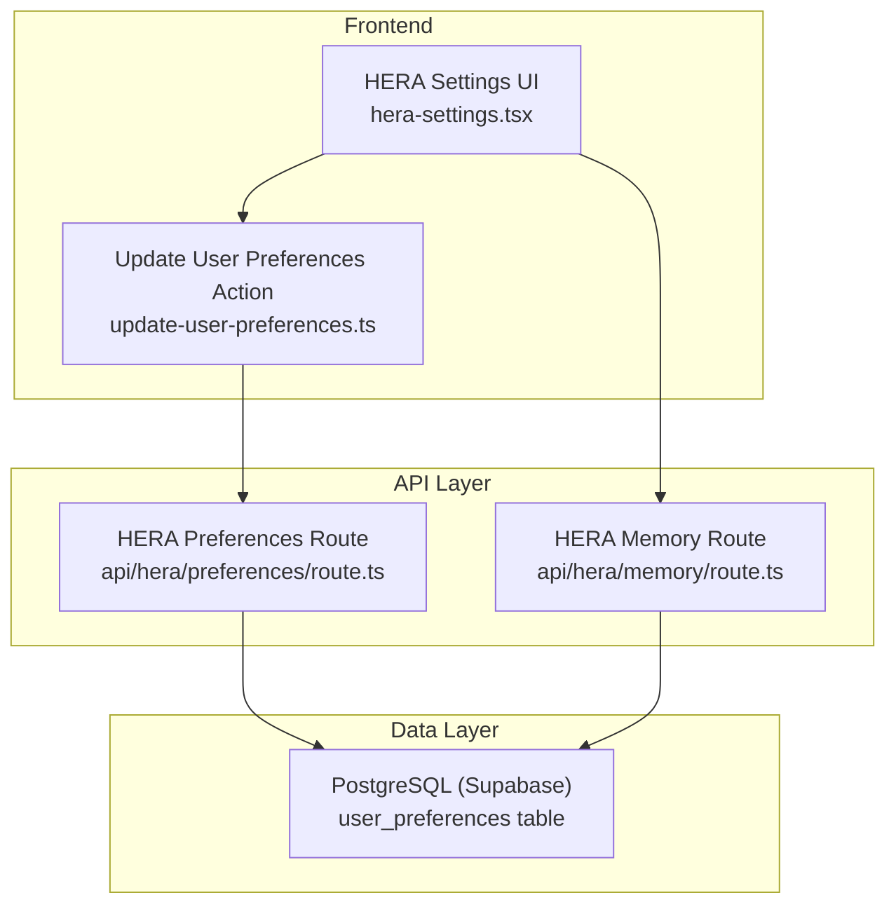
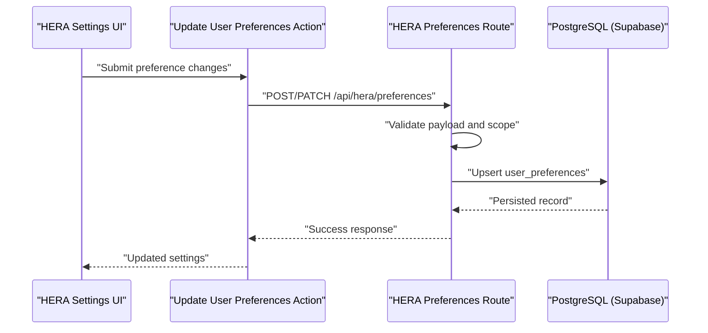
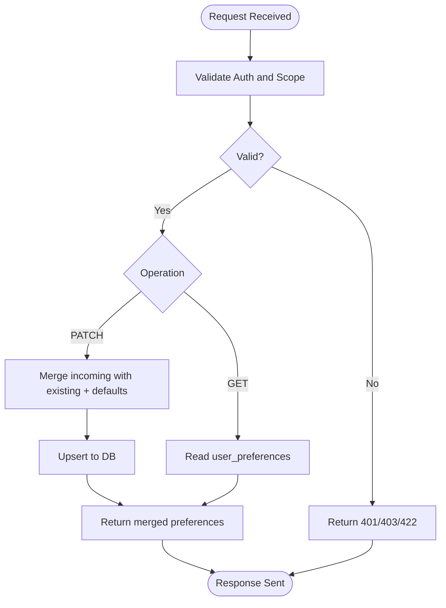
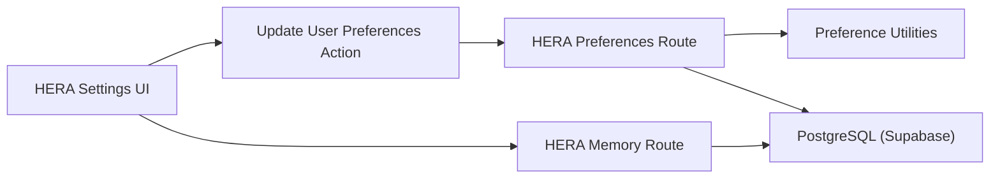

# Preferences Management APIs

<cite>
**Referenced Files in This Document**
- [apps/hr-suite/app/api/hera/preferences/route.ts](file://apps/hr-suite/app/api/hera/preferences/route.ts)
- [apps/hr-suite/app/api/hera/memory/route.ts](file://apps/hr-suite/app/api/hera/memory/route.ts)
- [apps/hr-suite/app/actions/update-user-preferences.ts](file://apps/hr-suite/app/actions/update-user-preferences.ts)
- [apps/hr-suite/components/hera/hera-settings.tsx](file://apps/hr-suite/components/hera/hera-settings.tsx)
- [apps/hr-suite/lib/preferences/index.ts](file://apps/hr-suite/lib/preferences/index.ts)
- [supabase/migrations/20260715070404_add_user_preferences.sql](file://supabase/migrations/20260715070404_add_user_preferences.sql)
- [supabase/migrations/20260717100000_harden_hera_memory_and_preferences.sql](file://supabase/migrations/20260717100000_harden_hera_memory_and_preferences.sql)
- [supabase/migrations/20260717100500_index_hera_preferences.sql](file://supabase/migrations/20260717100500_index_hera_preferences.sql)
- [supabase/tests/user_preferences_isolation.sql](file://supabase/tests/user_preferences_isolation.sql)
</cite>

## Table of Contents
1. [Introduction](#introduction)
2. [Project Structure](#project-structure)
3. [Core Components](#core-components)
4. [Architecture Overview](#architecture-overview)
5. [Detailed Component Analysis](#detailed-component-analysis)
6. [Dependency Analysis](#dependency-analysis)
7. [Performance Considerations](#performance-considerations)
8. [Troubleshooting Guide](#troubleshooting-guide)
9. [Conclusion](#conclusion)
10. [Appendices](#appendices)

## Introduction
This document provides API documentation for HERA preferences management endpoints. It covers how user preferences are stored, retrieved, and updated across the application, with a focus on chatbot behavior settings, personalization options, and UI customization. The guide explains preference schema definitions, validation rules, default value handling, examples for common operations, and guidance on managing preference scopes, data synchronization, conflict resolution, and inheritance patterns.

## Project Structure
The HERA preferences feature spans server-side API routes, client actions, UI components, and database migrations:
- API route for HERA preferences under apps/hr-suite/app/api/hera/preferences/route.ts
- Memory endpoint under apps/hr-suite/app/api/hera/memory/route.ts
- Client action for updating user preferences under apps/hr-suite/app/actions/update-user-preferences.ts
- HERA settings component under apps/hr-suite/components/hera/hera-settings.tsx
- Preference utilities under apps/hr-suite/lib/preferences/index.ts
- Database schema and policies defined in supabase migrations

**Diagram sources**
- [apps/hr-suite/components/hera/hera-settings.tsx](file://apps/hr-suite/components/hera/hera-settings.tsx)
- [apps/hr-suite/app/actions/update-user-preferences.ts](file://apps/hr-suite/app/actions/update-user-preferences.ts)
- [apps/hr-suite/app/api/hera/preferences/route.ts](file://apps/hr-suite/app/api/hera/preferences/route.ts)
- [apps/hr-suite/app/api/hera/memory/route.ts](file://apps/hr-suite/app/api/hera/memory/route.ts)
- [supabase/migrations/20260715070404_add_user_preferences.sql](file://supabase/migrations/20260715070404_add_user_preferences.sql)

**Section sources**
- [apps/hr-suite/app/api/hera/preferences/route.ts](file://apps/hr-suite/app/api/hera/preferences/route.ts)
- [apps/hr-suite/app/api/hera/memory/route.ts](file://apps/hr-suite/app/api/hera/memory/route.ts)
- [apps/hr-suite/app/actions/update-user-preferences.ts](file://apps/hr-suite/app/actions/update-user-preferences.ts)
- [apps/hr-suite/components/hera/hera-settings.tsx](file://apps/hr-suite/components/hera/hera-settings.tsx)
- [apps/hr-suite/lib/preferences/index.ts](file://apps/hr-suite/lib/preferences/index.ts)
- [supabase/migrations/20260715070404_add_user_preferences.sql](file://supabase/migrations/20260715070404_add_user_preferences.sql)
- [supabase/migrations/20260717100000_harden_hera_memory_and_preferences.sql](file://supabase/migrations/20260717100000_harden_hera_memory_and_preferences.sql)
- [supabase/migrations/20260717100500_index_hera_preferences.sql](file://supabase/migrations/20260717100500_index_hera_preferences.sql)

## Core Components
- HERA Preferences API Route: Handles GET and PATCH operations for retrieving and updating user preferences scoped to the authenticated user and tenant context.
- HERA Memory API Route: Provides memory-related operations that may interact with or reference user preferences for chatbot behavior.
- Update User Preferences Action: A client-side action used by the UI to trigger preference updates via server actions.
- HERA Settings UI: Presents preference controls for chatbot behavior, personalization, and UI customization; invokes the update action and reads current settings.
- Preference Utilities: Centralized helpers for schema validation, defaults, merging, and scope resolution.
- Database Migrations: Define the user_preferences table structure, indexes, and Row Level Security policies for isolation and performance.

**Section sources**
- [apps/hr-suite/app/api/hera/preferences/route.ts](file://apps/hr-suite/app/api/hera/preferences/route.ts)
- [apps/hr-suite/app/api/hera/memory/route.ts](file://apps/hr-suite/app/api/hera/memory/route.ts)
- [apps/hr-suite/app/actions/update-user-preferences.ts](file://apps/hr-suite/app/actions/update-user-preferences.ts)
- [apps/hr-suite/components/hera/hera-settings.tsx](file://apps/hr-suite/components/hera/hera-settings.tsx)
- [apps/hr-suite/lib/preferences/index.ts](file://apps/hr-suite/lib/preferences/index.ts)
- [supabase/migrations/20260715070404_add_user_preferences.sql](file://supabase/migrations/20260715070404_add_user_preferences.sql)
- [supabase/migrations/20260717100000_harden_hera_memory_and_preferences.sql](file://supabase/migrations/20260717100000_harden_hera_memory_and_preferences.sql)
- [supabase/migrations/20260717100500_index_hera_preferences.sql](file://supabase/migrations/20260717100500_index_hera_preferences.sql)

## Architecture Overview
The HERA preferences system follows a layered architecture:
- Frontend UI triggers preference changes through client actions or direct API calls.
- Server-side API routes enforce authentication, authorization, and validation before persisting changes.
- Database layer stores preferences per user and tenant with RLS policies ensuring isolation.
- Memory endpoints support chatbot state and contextual behaviors that can read or influence preferences.

**Diagram sources**
- [apps/hr-suite/components/hera/hera-settings.tsx](file://apps/hr-suite/components/hera/hera-settings.tsx)
- [apps/hr-suite/app/actions/update-user-preferences.ts](file://apps/hr-suite/app/actions/update-user-preferences.ts)
- [apps/hr-suite/app/api/hera/preferences/route.ts](file://apps/hr-suite/app/api/hera/preferences/route.ts)
- [supabase/migrations/20260715070404_add_user_preferences.sql](file://supabase/migrations/20260715070404_add_user_preferences.sql)

## Detailed Component Analysis

### HERA Preferences API Route
Responsibilities:
- Retrieve current user preferences (GET).
- Update one or multiple preferences atomically (PATCH).
- Enforce input validation against the preference schema.
- Resolve scope based on authenticated user and tenant context.
- Return merged results including defaults where applicable.

Key behaviors:
- Validation ensures required fields and allowed values are present.
- Defaults are applied for missing keys to guarantee consistent responses.
- Scope resolution supports per-user and per-tenant overrides.
- Error responses include clear messages for invalid payloads or unauthorized access.

**Diagram sources**
- [apps/hr-suite/app/api/hera/preferences/route.ts](file://apps/hr-suite/app/api/hera/preferences/route.ts)
- [supabase/migrations/20260715070404_add_user_preferences.sql](file://supabase/migrations/20260715070404_add_user_preferences.sql)

**Section sources**
- [apps/hr-suite/app/api/hera/preferences/route.ts](file://apps/hr-suite/app/api/hera/preferences/route.ts)

### HERA Memory API Route
Responsibilities:
- Manage chatbot memory entries linked to user sessions or conversations.
- Optionally read or infer preferences to tailor chatbot behavior.
- Provide endpoints for saving, retrieving, and purging memory data.

Integration points:
- May reference user preferences to adjust tone, verbosity, or suggested actions.
- Ensures memory is isolated per user and tenant.

**Section sources**
- [apps/hr-suite/app/api/hera/memory/route.ts](file://apps/hr-suite/app/api/hera/memory/route.ts)

### Update User Preferences Action
Responsibilities:
- Encapsulate client-side logic for invoking preference updates.
- Prepare payloads according to the preference schema.
- Handle optimistic updates and rollback on errors.

Usage patterns:
- Called from HERA settings UI when users toggle options or change values.
- Supports batch updates for multiple preferences in a single request.

**Section sources**
- [apps/hr-suite/app/actions/update-user-preferences.ts](file://apps/hr-suite/app/actions/update-user-preferences.ts)

### HERA Settings UI
Responsibilities:
- Render preference controls for chatbot behavior, personalization, and UI customization.
- Display current settings and provide immediate feedback on changes.
- Trigger updates via client actions or direct API calls.

User flows:
- Load current preferences on mount.
- Apply changes locally and persist via actions.
- Show error states and validation messages inline.

**Section sources**
- [apps/hr-suite/components/hera/hera-settings.tsx](file://apps/hr-suite/components/hera/hera-settings.tsx)

### Preference Utilities
Responsibilities:
- Define schema types and validation rules for preferences.
- Compute defaults and merge strategies.
- Resolve scope precedence (e.g., user > tenant > global defaults).

Common operations:
- validatePreferences(payload): returns normalized and validated object.
- applyDefaults(partial): fills missing keys with defaults.
- mergePreferences(existing, incoming): resolves conflicts deterministically.

**Section sources**
- [apps/hr-suite/lib/preferences/index.ts](file://apps/hr-suite/lib/preferences/index.ts)

### Database Schema and Policies
Schema highlights:
- user_preferences table stores key-value pairs or structured JSON per user and tenant.
- Indexes optimize lookups by user_id and tenant_id.
- Row Level Security policies ensure data isolation between tenants and users.

Migrations:
- Initial creation of user_preferences table.
- Hardening of memory and preferences with stricter policies.
- Indexing for performance.

**Section sources**
- [supabase/migrations/20260715070404_add_user_preferences.sql](file://supabase/migrations/20260715070404_add_user_preferences.sql)
- [supabase/migrations/20260717100000_harden_hera_memory_and_preferences.sql](file://supabase/migrations/20260717100000_harden_hera_memory_and_preferences.sql)
- [supabase/migrations/20260717100500_index_hera_preferences.sql](file://supabase/migrations/20260717100500_index_hera_preferences.sql)

## Dependency Analysis
The preferences system depends on:
- Authentication and authorization middleware to resolve user and tenant context.
- Validation utilities to enforce schema constraints.
- Database layer with RLS policies for secure multi-tenancy.
- UI components for presenting and editing preferences.

**Diagram sources**
- [apps/hr-suite/components/hera/hera-settings.tsx](file://apps/hr-suite/components/hera/hera-settings.tsx)
- [apps/hr-suite/app/actions/update-user-preferences.ts](file://apps/hr-suite/app/actions/update-user-preferences.ts)
- [apps/hr-suite/app/api/hera/preferences/route.ts](file://apps/hr-suite/app/api/hera/preferences/route.ts)
- [apps/hr-suite/app/api/hera/memory/route.ts](file://apps/hr-suite/app/api/hera/memory/route.ts)
- [apps/hr-suite/lib/preferences/index.ts](file://apps/hr-suite/lib/preferences/index.ts)
- [supabase/migrations/20260715070404_add_user_preferences.sql](file://supabase/migrations/20260715070404_add_user_preferences.sql)

**Section sources**
- [apps/hr-suite/app/api/hera/preferences/route.ts](file://apps/hr-suite/app/api/hera/preferences/route.ts)
- [apps/hr-suite/app/api/hera/memory/route.ts](file://apps/hr-suite/app/api/hera/memory/route.ts)
- [apps/hr-suite/app/actions/update-user-preferences.ts](file://apps/hr-suite/app/actions/update-user-preferences.ts)
- [apps/hr-suite/components/hera/hera-settings.tsx](file://apps/hr-suite/components/hera/hera-settings.tsx)
- [apps/hr-suite/lib/preferences/index.ts](file://apps/hr-suite/lib/preferences/index.ts)
- [supabase/migrations/20260715070404_add_user_preferences.sql](file://supabase/migrations/20260715070404_add_user_preferences.sql)

## Performance Considerations
- Use upsert operations to minimize round trips when updating multiple preferences.
- Leverage database indexes on user_id and tenant_id for fast retrieval.
- Apply partial updates to reduce payload size and contention.
- Cache frequently accessed preferences at the edge or in-memory where appropriate.
- Ensure RLS policies are optimized to avoid full-table scans.

[No sources needed since this section provides general guidance]

## Troubleshooting Guide
Common issues and resolutions:
- Invalid payload: Ensure all required fields are present and conform to schema types.
- Unauthorized access: Verify authentication headers and tenant context.
- Conflicting updates: Use atomic PATCH requests to merge changes safely.
- Missing defaults: Confirm that defaults are applied consistently on read paths.
- Data isolation failures: Review RLS policies and test with user_preferences_isolation tests.

**Section sources**
- [supabase/tests/user_preferences_isolation.sql](file://supabase/tests/user_preferences_isolation.sql)

## Conclusion
The HERA preferences management system provides a robust foundation for storing, retrieving, and updating user preferences across chatbot behavior, personalization, and UI customization. By leveraging schema validation, default handling, and secure multi-tenancy, it ensures consistent and reliable user experiences. Follow the documented endpoints and best practices to integrate preferences effectively and maintain data integrity.

[No sources needed since this section summarizes without analyzing specific files]

## Appendices

### API Endpoints Summary
- GET /api/hera/preferences
  - Purpose: Retrieve current user preferences.
  - Response: Merged preferences including defaults.
- PATCH /api/hera/preferences
  - Purpose: Update one or multiple preferences.
  - Request: Partial preference object adhering to schema.
  - Response: Updated merged preferences.
- GET /api/hera/memory
  - Purpose: Retrieve chatbot memory entries.
- POST /api/hera/memory
  - Purpose: Save new memory entry.
- DELETE /api/hera/memory/[id]
  - Purge specific memory entry.

[No sources needed since this section provides general guidance]

### Preference Schema Guidelines
- Keys: String identifiers for preference categories (e.g., chatbot_behavior, personalization, ui_customization).
- Values: Typed structures supporting booleans, strings, numbers, and nested objects.
- Validation: Required fields enforced; unknown keys rejected.
- Defaults: Applied on read to ensure consistent responses.

[No sources needed since this section provides general guidance]

### Examples
- Setting user preferences:
  - Send PATCH with desired keys and values; receive merged result.
- Retrieving current settings:
  - Send GET; receive full preferences with defaults applied.
- Updating multiple preferences:
  - Include all changed keys in a single PATCH request for atomicity.
- Managing preference scopes:
  - Use tenant-scoped keys to override user-level settings where supported.

[No sources needed since this section provides general guidance]

### Data Synchronization and Conflict Resolution
- Synchronization: Prefer idempotent PATCH operations; handle retries gracefully.
- Conflict resolution: Last-write-wins within a single request; merge strategy applies defaults and preserves known keys.
- Inheritance patterns: Tenant overrides user settings; global defaults fill remaining gaps.

[No sources needed since this section provides general guidance]