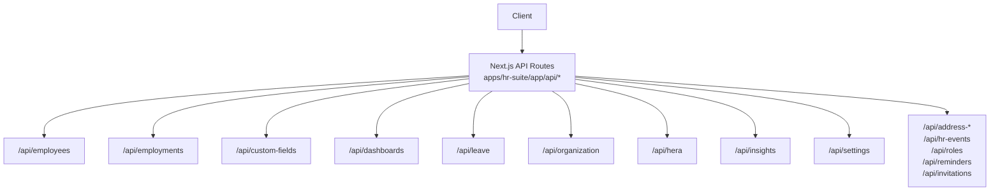
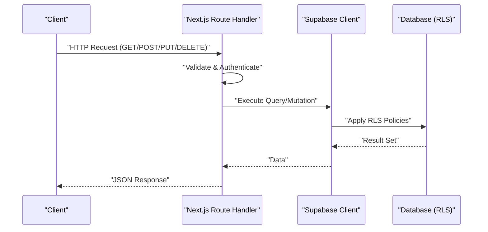
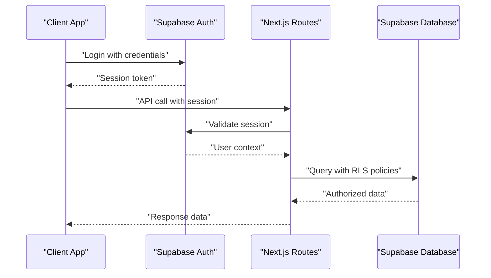
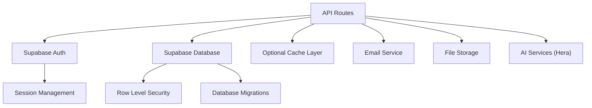

# API Reference

<cite>
**Referenced Files in This Document**
- [apps/hr-suite/app/api/employees/route.ts](file://apps/hr-suite/app/api/employees/route.ts)
- [apps/hr-suite/app/api/employees/[employeeId]/route.ts](file://apps/hr-suite/app/api/employees/[employeeId]/route.ts)
- [apps/hr-suite/app/api/employments/[employmentId]/route.ts](file://apps/hr-suite/app/api/employments/[employmentId]/route.ts)
- [apps/hr-suite/app/api/custom-fields/route.ts](file://apps/hr-suite/app/api/custom-fields/route.ts)
- [apps/hr-suite/app/api/custom-fields/[definitionId]/route.ts](file://apps/hr-suite/app/api/custom-fields/[definitionId]/route.ts)
- [apps/hr-suite/app/api/dashboards/route.ts](file://apps/hr-suite/app/api/dashboards/route.ts)
- [apps/hr-suite/app/api/dashboards/[dashboardId]/route.ts](file://apps/hr-suite/app/api/dashboards/[dashboardId]/route.ts)
- [apps/hr-suite/app/api/leave/request/route.ts](file://apps/hr-suite/app/api/leave/request/route.ts)
- [apps/hr-suite/app/api/leave/catalog/route.ts](file://apps/hr-suite/app/api/leave/catalog/route.ts)
- [apps/hr-suite/app/api/leave/balance-report/route.ts](file://apps/hr-suite/app/api/leave/balance-report/route.ts)
- [apps/hr-suite/app/api/organization/route.ts](file://apps/hr-suite/app/api/organization/route.ts)
- [apps/hr-suite/app/api/context/route.ts](file://apps/hr-suite/app/api/context/route.ts)
- [apps/hr-suite/app/api/hr-events/route.ts](file://apps/hr-suite/app/api/hr-events/route.ts)
- [apps/hr-suite/app/api/address-lookup/route.ts](file://apps/hr-suite/app/api/address-lookup/route.ts)
- [apps/hr-suite/app/api/address-suggestions/route.ts](file://apps/hr-suite/app/api/address-suggestions/route.ts)
- [apps/hr-suite/app/api/insights/upcoming-events/route.ts](file://apps/hr-suite/app/api/insights/upcoming-events/route.ts)
- [apps/hr-suite/app/api/insights/employees/route.ts](file://apps/hr-suite/app/api/insights/employees/route.ts)
- [apps/hr-suite/app/api/roles/route.ts](file://apps/hr-suite/app/api/roles/route.ts)
- [apps/hr-suite/app/api/settings/holidays/route.ts](file://apps/hr-suite/app/api/settings/holidays/route.ts)
- [apps/hr-suite/app/api/settings/modules/route.ts](file://apps/hr-suite/app/api/settings/modules/route.ts)
- [apps/hr-suite/app/api/reminders/route.ts](file://apps/hr-suite/app/api/reminders/route.ts)
- [apps/hr-suite/app/api/invitations/route.ts](file://apps/hr-suite/app/api/invitations/route.ts)
- [apps/hr-suite/app/auth/callback/route.ts](file://apps/hr-suite/app/auth/callback/route.ts)
- [apps/hr-suite/app/auth/signout/route.ts](file://apps/hr-suite/app/auth/signout/route.ts)
- [apps/hr-suite/app/api/hera/conversations/route.ts](file://apps/hr-suite/app/api/hera/conversations/route.ts)
- [apps/hr-suite/app/api/hera/memory/route.ts](file://apps/hr-suite/app/api/hera/memory/route.ts)
- [apps/hr-suite/app/api/hera/preferences/route.ts](file://apps/hr-suite/app/api/hera/preferences/route.ts)
</cite>

## Table of Contents
1. [Introduction](#introduction)
2. [Project Structure](#project-structure)
3. [Core Components](#core-components)
4. [Architecture Overview](#architecture-overview)
5. [Detailed Component Analysis](#detailed-component-analysis)
6. [Dependency Analysis](#dependency-analysis)
7. [Performance Considerations](#performance-considerations)
8. [Troubleshooting Guide](#troubleshooting-guide)
9. [Conclusion](#conclusion)
10. [Appendices](#appendices)

## Introduction
This document provides a comprehensive API reference for LiquidHR’s RESTful endpoints. It covers Employee Management, Employment, Organization, Custom Fields, Dashboard, Leave Management, and AI Assistant (Hera) APIs. For each endpoint group, you will find HTTP methods, URL patterns, request/response schemas, authentication requirements, error handling, practical examples, parameter validation guidance, and performance tips. Authentication is implemented via Supabase Auth, with session-based access through Next.js App Router routes. Rate limiting policies are not explicitly defined in the provided codebase; clients should implement standard backoff and retry strategies. Versioning is not enforced at the route level in this snapshot; maintain backward compatibility when evolving schemas.

## Project Structure
LiquidHR exposes its API as Next.js App Router server routes under apps/hr-suite/app/api/. Each domain has its own folder with route files implementing HTTP handlers. The structure aligns with REST conventions: resource-oriented URLs, consistent CRUD patterns, and nested subresources where applicable.



**Diagram sources**
- [apps/hr-suite/app/api/employees/route.ts](file://apps/hr-suite/app/api/employees/route.ts)
- [apps/hr-suite/app/api/employments/[employmentId]/route.ts](file://apps/hr-suite/app/api/employments/[employmentId]/route.ts)
- [apps/hr-suite/app/api/custom-fields/route.ts](file://apps/hr-suite/app/api/custom-fields/route.ts)
- [apps/hr-suite/app/api/dashboards/route.ts](file://apps/hr-suite/app/api/dashboards/route.ts)
- [apps/hr-suite/app/api/leave/request/route.ts](file://apps/hr-suite/app/api/leave/request/route.ts)
- [apps/hr-suite/app/api/organization/route.ts](file://apps/hr-suite/app/api/organization/route.ts)
- [apps/hr-suite/app/api/hera/conversations/route.ts](file://apps/hr-suite/app/api/hera/conversations/route.ts)
- [apps/hr-suite/app/api/insights/upcoming-events/route.ts](file://apps/hr-suite/app/api/insights/upcoming-events/route.ts)
- [apps/hr-suite/app/api/settings/holidays/route.ts](file://apps/hr-suite/app/api/settings/holidays/route.ts)
- [apps/hr-suite/app/api/hr-events/route.ts](file://apps/hr-suite/app/api/hr-events/route.ts)
- [apps/hr-suite/app/api/roles/route.ts](file://apps/hr-suite/app/api/roles/route.ts)
- [apps/hr-suite/app/api/reminders/route.ts](file://apps/hr-suite/app/api/reminders/route.ts)
- [apps/hr-suite/app/api/invitations/route.ts](file://apps/hr-suite/app/api/invitations/route.ts)

**Section sources**
- [apps/hr-suite/app/api/employees/route.ts](file://apps/hr-suite/app/api/employees/route.ts)
- [apps/hr-suite/app/api/employments/[employmentId]/route.ts](file://apps/hr-suite/app/api/employments/[employmentId]/route.ts)
- [apps/hr-suite/app/api/custom-fields/route.ts](file://apps/hr-suite/app/api/custom-fields/route.ts)
- [apps/hr-suite/app/api/dashboards/route.ts](file://apps/hr-suite/app/api/dashboards/route.ts)
- [apps/hr-suite/app/api/leave/request/route.ts](file://apps/hr-suite/app/api/leave/request/route.ts)
- [apps/hr-suite/app/api/organization/route.ts](file://apps/hr-suite/app/api/organization/route.ts)
- [apps/hr-suite/app/api/hera/conversations/route.ts](file://apps/hr-suite/app/api/hera/conversations/route.ts)
- [apps/hr-suite/app/api/insights/upcoming-events/route.ts](file://apps/hr-suite/app/api/insights/upcoming-events/route.ts)
- [apps/hr-suite/app/api/settings/holidays/route.ts](file://apps/hr-suite/app/api/settings/holidays/route.ts)
- [apps/hr-suite/app/api/hr-events/route.ts](file://apps/hr-suite/app/api/hr-events/route.ts)
- [apps/hr-suite/app/api/roles/route.ts](file://apps/hr-suite/app/api/roles/route.ts)
- [apps/hr-suite/app/api/reminders/route.ts](file://apps/hr-suite/app/api/reminders/route.ts)
- [apps/hr-suite/app/api/invitations/route.ts](file://apps/hr-suite/app/api/invitations/route.ts)

## Core Components
The API is organized by domain folders, each containing route handlers that implement HTTP verbs. Common patterns include:
- GET /list or GET /:id for retrieval
- POST /create for creation
- PUT /update or PATCH for updates
- DELETE /delete for removal
- Subresource endpoints for related entities (e.g., employments under employees)

Authentication is handled via Supabase Auth. Requests to protected routes must carry valid session cookies or tokens depending on client type. Authorization is enforced at the database layer using Row-Level Security (RLS) policies and tenant scoping.

**Section sources**
- [apps/hr-suite/app/api/employees/route.ts](file://apps/hr-suite/app/api/employees/route.ts)
- [apps/hr-suite/app/api/employees/[employeeId]/route.ts](file://apps/hr-suite/app/api/employees/[employeeId]/route.ts)
- [apps/hr-suite/app/api/employments/[employmentId]/route.ts](file://apps/hr-suite/app/api/employments/[employmentId]/route.ts)
- [apps/hr-suite/app/api/custom-fields/route.ts](file://apps/hr-suite/app/api/custom-fields/route.ts)
- [apps/hr-suite/app/api/custom-fields/[definitionId]/route.ts](file://apps/hr-suite/app/api/custom-fields/[definitionId]/route.ts)
- [apps/hr-suite/app/api/dashboards/route.ts](file://apps/hr-suite/app/api/dashboards/route.ts)
- [apps/hr-suite/app/api/dashboards/[dashboardId]/route.ts](file://apps/hr-suite/app/api/dashboards/[dashboardId]/route.ts)
- [apps/hr-suite/app/api/leave/request/route.ts](file://apps/hr-suite/app/api/leave/request/route.ts)
- [apps/hr-suite/app/api/leave/catalog/route.ts](file://apps/hr-suite/app/api/leave/catalog/route.ts)
- [apps/hr-suite/app/api/leave/balance-report/route.ts](file://apps/hr-suite/app/api/leave/balance-report/route.ts)
- [apps/hr-suite/app/api/organization/route.ts](file://apps/hr-suite/app/api/organization/route.ts)
- [apps/hr-suite/app/api/context/route.ts](file://apps/hr-suite/app/api/context/route.ts)
- [apps/hr-suite/app/api/hr-events/route.ts](file://apps/hr-suite/app/api/hr-events/route.ts)
- [apps/hr-suite/app/api/address-lookup/route.ts](file://apps/hr-suite/app/api/address-lookup/route.ts)
- [apps/hr-suite/app/api/address-suggestions/route.ts](file://apps/hr-suite/app/api/address-suggestions/route.ts)
- [apps/hr-suite/app/api/insights/upcoming-events/route.ts](file://apps/hr-suite/app/api/insights/upcoming-events/route.ts)
- [apps/hr-suite/app/api/insights/employees/route.ts](file://apps/hr-suite/app/api/insights/employees/route.ts)
- [apps/hr-suite/app/api/roles/route.ts](file://apps/hr-suite/app/api/roles/route.ts)
- [apps/hr-suite/app/api/settings/holidays/route.ts](file://apps/hr-suite/app/api/settings/holidays/route.ts)
- [apps/hr-suite/app/api/settings/modules/route.ts](file://apps/hr-suite/app/api/settings/modules/route.ts)
- [apps/hr-suite/app/api/reminders/route.ts](file://apps/hr-suite/app/api/reminders/route.ts)
- [apps/hr-suite/app/api/invitations/route.ts](file://apps/hr-suite/app/api/invitations/route.ts)
- [apps/hr-suite/app/auth/callback/route.ts](file://apps/hr-suite/app/auth/callback/route.ts)
- [apps/hr-suite/app/auth/signout/route.ts](file://apps/hr-suite/app/auth/signout/route.ts)
- [apps/hr-suite/app/api/hera/conversations/route.ts](file://apps/hr-suite/app/api/hera/conversations/route.ts)
- [apps/hr-suite/app/api/hera/memory/route.ts](file://apps/hr-suite/app/api/hera/memory/route.ts)
- [apps/hr-suite/app/api/hera/preferences/route.ts](file://apps/hr-suite/app/api/hera/preferences/route.ts)

## Architecture Overview
The API follows a layered architecture:
- Client applications call Next.js API routes
- Route handlers validate requests, enforce authentication and authorization
- Data operations are executed against Supabase with RLS policies ensuring tenant isolation
- Responses are standardized JSON payloads with consistent error structures



[No sources needed since this diagram shows conceptual workflow, not actual code structure]

## Detailed Component Analysis

### Employee Management APIs
Endpoints for managing employee records and related resources.

- GET /api/employees
  - Purpose: List employees with optional filters and pagination
  - Authentication: Required (Supabase session)
  - Query Parameters: page, limit, search, department, status
  - Response: Array of employee objects
- POST /api/employees
  - Purpose: Create a new employee
  - Authentication: Required
  - Body: Employee schema fields (name, email, organization, etc.)
  - Response: Created employee object
- GET /api/employees/:employeeId
  - Purpose: Retrieve employee details
  - Authentication: Required
  - Response: Employee object with nested relations
- PUT /api/employees/:employeeId
  - Purpose: Update employee information
  - Authentication: Required
  - Body: Partial employee schema
  - Response: Updated employee object
- DELETE /api/employees/:employeeId
  - Purpose: Archive or delete employee
  - Authentication: Required
  - Response: Success confirmation

Subresources:
- GET /api/employees/:employeeId/employments
- POST /api/employees/:employeeId/employments
- GET /api/employees/:employeeId/documents
- POST /api/employees/:employeeId/documents
- GET /api/employees/:employeeId/bank-accounts
- POST /api/employees/:employeeId/bank-accounts
- GET /api/employees/:employeeId/relations
- POST /api/employees/:employeeId/relations
- GET /api/employees/:employeeId/salary
- PUT /api/employees/:employeeId/salary
- GET /api/employees/:employeeId/custom-fields
- PUT /api/employees/:employeeId/custom-fields
- GET /api/employees/:employeeId/activity
- GET /api/employees/:employeeId/archive
- PUT /api/employees/:employeeId/archive
- GET /api/employees/:employeeId/addresses
- POST /api/employees/:employeeId/addresses
- GET /api/employees/:employeeId/bsn
- PUT /api/employees/:employeeId/bsn
- GET /api/employees/:employeeId/avatar
- PUT /api/employees/:employeeId/avatar
- GET /api/employees/matches
- POST /api/employees/matches
- GET /api/employees/next-number

Authentication: All endpoints require authenticated sessions via Supabase Auth.

Error Handling: Standardized JSON error responses with status codes and messages.

Validation: Input validation performed before database operations.

**Section sources**
- [apps/hr-suite/app/api/employees/route.ts](file://apps/hr-suite/app/api/employees/route.ts)
- [apps/hr-suite/app/api/employees/[employeeId]/route.ts](file://apps/hr-suite/app/api/employees/[employeeId]/route.ts)

### Employment APIs
Endpoints for managing employment contracts and lifecycle events.

- GET /api/employments/:employmentId
  - Purpose: Retrieve employment details
  - Authentication: Required
  - Response: Employment object with timeline and history
- PUT /api/employments/:employmentId
  - Purpose: Update employment information
  - Authentication: Required
  - Body: Employment update schema
  - Response: Updated employment object
- POST /api/employments/:employmentId/changes
  - Purpose: Record employment changes
  - Authentication: Required
  - Body: Change event data
  - Response: Change record
- GET /api/employments/:employmentId/follow-ups
- POST /api/employments/:employmentId/follow-ups
- GET /api/employments/:employmentId/profile-links
- POST /api/employments/:employmentId/profile-links
- POST /api/employments/:employmentId/termination
- GET /api/employments/:employmentId/timeline/:timeline
- GET /api/employments/:employmentId/work-patterns
- PUT /api/employments/:employmentId/work-patterns

Authentication: All endpoints require authenticated sessions.

Error Handling: Consistent error responses with detailed messages.

Validation: Employment change validation ensures data integrity.

**Section sources**
- [apps/hr-suite/app/api/employments/[employmentId]/route.ts](file://apps/hr-suite/app/api/employments/[employmentId]/route.ts)

### Organization APIs
Endpoints for organizational structure and management assignments.

- GET /api/organization
  - Purpose: Retrieve organization hierarchy
  - Authentication: Required
  - Response: Organization tree structure
- POST /api/organization/assignments
  - Purpose: Create role assignments
  - Authentication: Required
  - Body: Assignment data
  - Response: Created assignment
- GET /api/organization/placements
- POST /api/organization/placements
- GET /api/organization/management-assignments
- PUT /api/organization/management-assignments/:assignmentId

Authentication: Requires appropriate organizational permissions.

Error Handling: Permission-based error responses.

Validation: Organization structure validation ensures consistency.

**Section sources**
- [apps/hr-suite/app/api/organization/route.ts](file://apps/hr-suite/app/api/organization/route.ts)

### Custom Fields APIs
Endpoints for managing custom field definitions and values.

- GET /api/custom-fields
  - Purpose: List custom field definitions
  - Authentication: Required
  - Response: Array of field definitions
- POST /api/custom-fields
  - Purpose: Create custom field definition
  - Authentication: Required
  - Body: Field definition schema
  - Response: Created field definition
- GET /api/custom-fields/:definitionId
  - Purpose: Get specific field definition
  - Authentication: Required
  - Response: Field definition object
- PUT /api/custom-fields/:definitionId
  - Purpose: Update field definition
  - Authentication: Required
  - Body: Updated field schema
  - Response: Updated field definition
- DELETE /api/custom-fields/:definitionId
  - Purpose: Delete field definition
  - Authentication: Required
  - Response: Success confirmation

Authentication: Requires admin or custom field management permissions.

Error Handling: Validation errors and permission checks.

Validation: Field definition schema validation.

**Section sources**
- [apps/hr-suite/app/api/custom-fields/route.ts](file://apps/hr-suite/app/api/custom-fields/route.ts)
- [apps/hr-suite/app/api/custom-fields/[definitionId]/route.ts](file://apps/hr-suite/app/api/custom-fields/[definitionId]/route.ts)

### Dashboard APIs
Endpoints for personal dashboards and widget management.

- GET /api/dashboards
  - Purpose: List user dashboards
  - Authentication: Required
  - Response: Array of dashboard objects
- POST /api/dashboards
  - Purpose: Create new dashboard
  - Authentication: Required
  - Body: Dashboard configuration
  - Response: Created dashboard
- GET /api/dashboards/:dashboardId
  - Purpose: Get dashboard details
  - Authentication: Required
  - Response: Dashboard object with widgets
- PUT /api/dashboards/:dashboardId
  - Purpose: Update dashboard configuration
  - Authentication: Required
  - Body: Updated dashboard schema
  - Response: Updated dashboard
- DELETE /api/dashboards/:dashboardId
  - Purpose: Delete dashboard
  - Authentication: Required
  - Response: Success confirmation

Widget Layout:
- GET /api/dashboards/:dashboardId/layout
- PUT /api/dashboards/:dashboardId/layout

Authentication: User-specific dashboard access control.

Error Handling: Dashboard ownership validation.

Validation: Widget configuration schema validation.

**Section sources**
- [apps/hr-suite/app/api/dashboards/route.ts](file://apps/hr-suite/app/api/dashboards/route.ts)
- [apps/hr-suite/app/api/dashboards/[dashboardId]/route.ts](file://apps/hr-suite/app/api/dashboards/[dashboardId]/route.ts)

### Leave Management APIs
Endpoints for leave types, requests, balances, and reporting.

- GET /api/leave/catalog
  - Purpose: List available leave types
  - Authentication: Required
  - Response: Array of leave type configurations
- POST /api/leave/catalog
  - Purpose: Create new leave type
  - Authentication: Required
  - Body: Leave type schema
  - Response: Created leave type
- GET /api/leave/request
  - Purpose: List leave requests
  - Authentication: Required
  - Query Parameters: employeeId, dateFrom, dateTo, status
  - Response: Array of leave requests
- POST /api/leave/request
  - Purpose: Submit new leave request
  - Authentication: Required
  - Body: Leave request data
  - Response: Created request with approval workflow
- GET /api/leave/balance-report
  - Purpose: Generate leave balance report
  - Authentication: Required
  - Query Parameters: employeeId, year
  - Response: Balance summary

Additional Endpoints:
- GET /api/leave/ledger
- POST /api/leave/preview

Authentication: Role-based access for leave management.

Error Handling: Leave policy validation and conflict detection.

Validation: Date range validation and balance calculations.

**Section sources**
- [apps/hr-suite/app/api/leave/catalog/route.ts](file://apps/hr-suite/app/api/leave/catalog/route.ts)
- [apps/hr-suite/app/api/leave/request/route.ts](file://apps/hr-suite/app/api/leave/request/route.ts)
- [apps/hr-suite/app/api/leave/balance-report/route.ts](file://apps/hr-suite/app/api/leave/balance-report/route.ts)

### AI Assistant APIs (Hera)
Endpoints for the AI-powered HR assistant functionality.

- GET /api/hera/conversations
  - Purpose: List conversation history
  - Authentication: Required
  - Response: Array of conversation summaries
- POST /api/hera/conversations
  - Purpose: Start new conversation
  - Authentication: Required
  - Body: Conversation context
  - Response: New conversation ID
- GET /api/hera/conversations/:conversationId
  - Purpose: Get conversation details
  - Authentication: Required
  - Response: Full conversation with messages
- PUT /api/hera/conversations/:conversationId
  - Purpose: Update conversation metadata
  - Authentication: Required
  - Body: Metadata updates
  - Response: Updated conversation
- DELETE /api/hera/conversations/:conversationId
  - Purpose: Delete conversation
  - Authentication: Required
  - Response: Success confirmation

Memory Management:
- GET /api/hera/memory
- POST /api/hera/memory
- PUT /api/hera/memory/:memoryId
- DELETE /api/hera/memory/:memoryId

Preferences:
- GET /api/hera/preferences
- PUT /api/hera/preferences

Authentication: Requires active user session with AI features enabled.

Error Handling: Context validation and memory limits.

Validation: Message content sanitization and length limits.

**Section sources**
- [apps/hr-suite/app/api/hera/conversations/route.ts](file://apps/hr-suite/app/api/hera/conversations/route.ts)
- [apps/hr-suite/app/api/hera/memory/route.ts](file://apps/hr-suite/app/api/hera/memory/route.ts)
- [apps/hr-suite/app/api/hera/preferences/route.ts](file://apps/hr-suite/app/api/hera/preferences/route.ts)

### Additional APIs

#### Context and HR Events
- GET /api/context
  - Purpose: Get current user context and permissions
  - Authentication: Required
  - Response: User context with roles and scopes
- GET /api/hr-events
  - Purpose: Subscribe to HR events (real-time updates)
  - Authentication: Required
  - Response: Event stream

#### Address Lookup Services
- GET /api/address-lookup
  - Purpose: Validate and format addresses
  - Authentication: Optional
  - Query Parameters: address components
  - Response: Formatted address data
- GET /api/address-suggestions
  - Purpose: Get address suggestions
  - Authentication: Optional
  - Query Parameters: partial address text
  - Response: Address suggestions array

#### Insights and Reports
- GET /api/insights/upcoming-events
  - Purpose: Get upcoming HR events
  - Authentication: Required
  - Query Parameters: dateRange, eventType
  - Response: Event calendar data
- GET /api/insights/employees
  - Purpose: Employee analytics and insights
  - Authentication: Required
  - Query Parameters: filters, metrics
  - Response: Analytics data

#### Roles and Permissions
- GET /api/roles
  - Purpose: List available roles
  - Authentication: Required
  - Response: Role definitions
- POST /api/roles
  - Purpose: Create new role
  - Authentication: Required
  - Body: Role configuration
  - Response: Created role
- GET /api/roles/:roleId
  - Purpose: Get role details
  - Authentication: Required
  - Response: Role object with permissions
- PUT /api/roles/:roleId
  - Purpose: Update role configuration
  - Authentication: Required
  - Body: Updated role schema
  - Response: Updated role
- DELETE /api/roles/:roleId
  - Purpose: Delete role
  - Authentication: Required
  - Response: Success confirmation

#### Settings and Configuration
- GET /api/settings/holidays
  - Purpose: Manage holiday calendars
  - Authentication: Required
  - Response: Holiday list
- POST /api/settings/holidays
  - Purpose: Add new holiday
  - Authentication: Required
  - Body: Holiday data
  - Response: Created holiday
- GET /api/settings/modules
  - Purpose: Check enabled modules
  - Authentication: Required
  - Response: Module configuration

#### Reminders and Invitations
- GET /api/reminders
  - Purpose: List reminders
  - Authentication: Required
  - Response: Reminder list
- POST /api/reminders
  - Purpose: Create reminder
  - Authentication: Required
  - Body: Reminder configuration
  - Response: Created reminder
- GET /api/reminders/:reminderId
  - Purpose: Get reminder details
  - Authentication: Required
  - Response: Reminder object
- PUT /api/reminders/:reminderId
  - Purpose: Update reminder
  - Authentication: Required
  - Body: Updated reminder data
  - Response: Updated reminder
- DELETE /api/reminders/:reminderId
  - Purpose: Delete reminder
  - Authentication: Required
  - Response: Success confirmation
- POST /api/reminders/:reminderId/cancel
  - Purpose: Cancel scheduled reminder
  - Authentication: Required
  - Response: Cancellation confirmation
- POST /api/reminders/:reminderId/publish
  - Purpose: Publish reminder immediately
  - Authentication: Required
  - Response: Publication confirmation

- GET /api/invitations
  - Purpose: List user invitations
  - Authentication: Required
  - Response: Invitation list
- POST /api/invitations
  - Purpose: Send new invitation
  - Authentication: Required
  - Body: Invitation data
  - Response: Sent invitation

**Section sources**
- [apps/hr-suite/app/api/context/route.ts](file://apps/hr-suite/app/api/context/route.ts)
- [apps/hr-suite/app/api/hr-events/route.ts](file://apps/hr-suite/app/api/hr-events/route.ts)
- [apps/hr-suite/app/api/address-lookup/route.ts](file://apps/hr-suite/app/api/address-lookup/route.ts)
- [apps/hr-suite/app/api/address-suggestions/route.ts](file://apps/hr-suite/app/api/address-suggestions/route.ts)
- [apps/hr-suite/app/api/insights/upcoming-events/route.ts](file://apps/hr-suite/app/api/insights/upcoming-events/route.ts)
- [apps/hr-suite/app/api/insights/employees/route.ts](file://apps/hr-suite/app/api/insights/employees/route.ts)
- [apps/hr-suite/app/api/roles/route.ts](file://apps/hr-suite/app/api/roles/route.ts)
- [apps/hr-suite/app/api/settings/holidays/route.ts](file://apps/hr-suite/app/api/settings/holidays/route.ts)
- [apps/hr-suite/app/api/settings/modules/route.ts](file://apps/hr-suite/app/api/settings/modules/route.ts)
- [apps/hr-suite/app/api/reminders/route.ts](file://apps/hr-suite/app/api/reminders/route.ts)
- [apps/hr-suite/app/api/invitations/route.ts](file://apps/hr-suite/app/api/invitations/route.ts)

### Authentication Flow
Supabase Auth integration handles user authentication and session management.



**Diagram sources**
- [apps/hr-suite/app/auth/callback/route.ts](file://apps/hr-suite/app/auth/callback/route.ts)
- [apps/hr-suite/app/auth/signout/route.ts](file://apps/hr-suite/app/auth/signout/route.ts)

**Section sources**
- [apps/hr-suite/app/auth/callback/route.ts](file://apps/hr-suite/app/auth/callback/route.ts)
- [apps/hr-suite/app/auth/signout/route.ts](file://apps/hr-suite/app/auth/signout/route.ts)

## Dependency Analysis
The API routes depend on several core services and libraries:



Key Dependencies:
- Supabase Auth for authentication and authorization
- Supabase Database with RLS policies for data security
- File storage for document uploads
- Email service for notifications and invitations
- AI services for Hera chatbot functionality

**Diagram sources**
- [apps/hr-suite/app/api/employees/route.ts](file://apps/hr-suite/app/api/employees/route.ts)
- [apps/hr-suite/app/api/employments/[employmentId]/route.ts](file://apps/hr-suite/app/api/employments/[employmentId]/route.ts)
- [apps/hr-suite/app/api/custom-fields/route.ts](file://apps/hr-suite/app/api/custom-fields/route.ts)
- [apps/hr-suite/app/api/dashboards/route.ts](file://apps/hr-suite/app/api/dashboards/route.ts)
- [apps/hr-suite/app/api/leave/request/route.ts](file://apps/hr-suite/app/api/leave/request/route.ts)
- [apps/hr-suite/app/api/hera/conversations/route.ts](file://apps/hr-suite/app/api/hera/conversations/route.ts)

**Section sources**
- [apps/hr-suite/app/api/employees/route.ts](file://apps/hr-suite/app/api/employees/route.ts)
- [apps/hr-suite/app/api/employments/[employmentId]/route.ts](file://apps/hr-suite/app/api/employments/[employmentId]/route.ts)
- [apps/hr-suite/app/api/custom-fields/route.ts](file://apps/hr-suite/app/api/custom-fields/route.ts)
- [apps/hr-suite/app/api/dashboards/route.ts](file://apps/hr-suite/app/api/dashboards/route.ts)
- [apps/hr-suite/app/api/leave/request/route.ts](file://apps/hr-suite/app/api/leave/request/route.ts)
- [apps/hr-suite/app/api/hera/conversations/route.ts](file://apps/hr-suite/app/api/hera/conversations/route.ts)

## Performance Considerations
- Implement caching strategies for frequently accessed data like organization charts and master data
- Use pagination for large datasets (employees, leave requests, documents)
- Optimize database queries with proper indexing and query optimization
- Implement rate limiting at the application level if needed
- Use connection pooling for database operations
- Consider async processing for heavy operations like report generation
- Implement response compression for large payloads
- Use CDN for static assets and file downloads

## Troubleshooting Guide
Common issues and their solutions:

Authentication Problems:
- Verify Supabase session validity
- Check user permissions and roles
- Ensure proper cookie/token handling

Authorization Errors:
- Review RLS policies for data access
- Verify tenant isolation settings
- Check role-based permissions

Data Validation Issues:
- Validate input schemas before processing
- Check required fields and data types
- Review business rule constraints

Performance Issues:
- Monitor database query performance
- Check for N+1 query problems
- Review cache hit rates

Error Response Format:
All endpoints return standardized error responses:
```json
{
  "error": {
    "code": "ERROR_CODE",
    "message": "Human-readable error message",
    "details": "Additional error context"
  }
}
```

Debugging Tips:
- Enable detailed logging in development
- Use browser developer tools for network inspection
- Check Supabase dashboard for database queries
- Monitor application logs for errors

**Section sources**
- [apps/hr-suite/app/api/employees/route.ts](file://apps/hr-suite/app/api/employees/route.ts)
- [apps/hr-suite/app/api/employments/[employmentId]/route.ts](file://apps/hr-suite/app/api/employments/[employmentId]/route.ts)
- [apps/hr-suite/app/api/custom-fields/route.ts](file://apps/hr-suite/app/api/custom-fields/route.ts)
- [apps/hr-suite/app/api/dashboards/route.ts](file://apps/hr-suite/app/api/dashboards/route.ts)
- [apps/hr-suite/app/api/leave/request/route.ts](file://apps/hr-suite/app/api/leave/request/route.ts)
- [apps/hr-suite/app/api/hera/conversations/route.ts](file://apps/hr-suite/app/api/hera/conversations/route.ts)

## Conclusion
LiquidHR's API provides a comprehensive set of endpoints for HR management functionality. The RESTful design follows industry best practices with clear separation of concerns and consistent error handling. Authentication and authorization are handled securely through Supabase Auth and RLS policies. The modular architecture allows for easy extension and maintenance. Clients should implement proper error handling, caching, and retry logic for robust integration.

## Appendices

### API Usage Examples

#### Creating an Employee
```bash
curl -X POST https://api.liquidhr.com/api/employees \
  -H "Authorization: Bearer YOUR_TOKEN" \
  -H "Content-Type: application/json" \
  -d '{
    "firstName": "John",
    "lastName": "Doe",
    "email": "john.doe@company.com",
    "department": "engineering"
  }'
```

#### Getting Employee Details
```bash
curl -X GET https://api.liquidhr.com/api/employees/EMP001 \
  -H "Authorization: Bearer YOUR_TOKEN"
```

#### Submitting Leave Request
```bash
curl -X POST https://api.liquidhr.com/api/leave/request \
  -H "Authorization: Bearer YOUR_TOKEN" \
  -H "Content-Type: application/json" \
  -d '{
    "employeeId": "EMP001",
    "leaveTypeId": "VACATION",
    "startDate": "2024-01-15",
    "endDate": "2024-01-19",
    "reason": "Annual vacation"
  }'
```

### Best Practices
- Always handle authentication properly
- Implement proper error handling and retry logic
- Use pagination for large datasets
- Cache frequently accessed data
- Validate all input data
- Follow REST conventions consistently
- Document API changes thoroughly
- Monitor API usage and performance

### Security Recommendations
- Use HTTPS for all API calls
- Implement proper input validation
- Sanitize all user inputs
- Use parameterized queries
- Implement rate limiting
- Monitor for suspicious activity
- Regular security audits