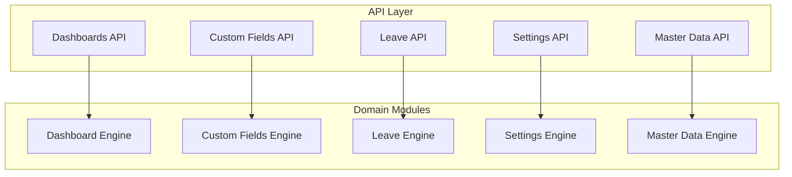
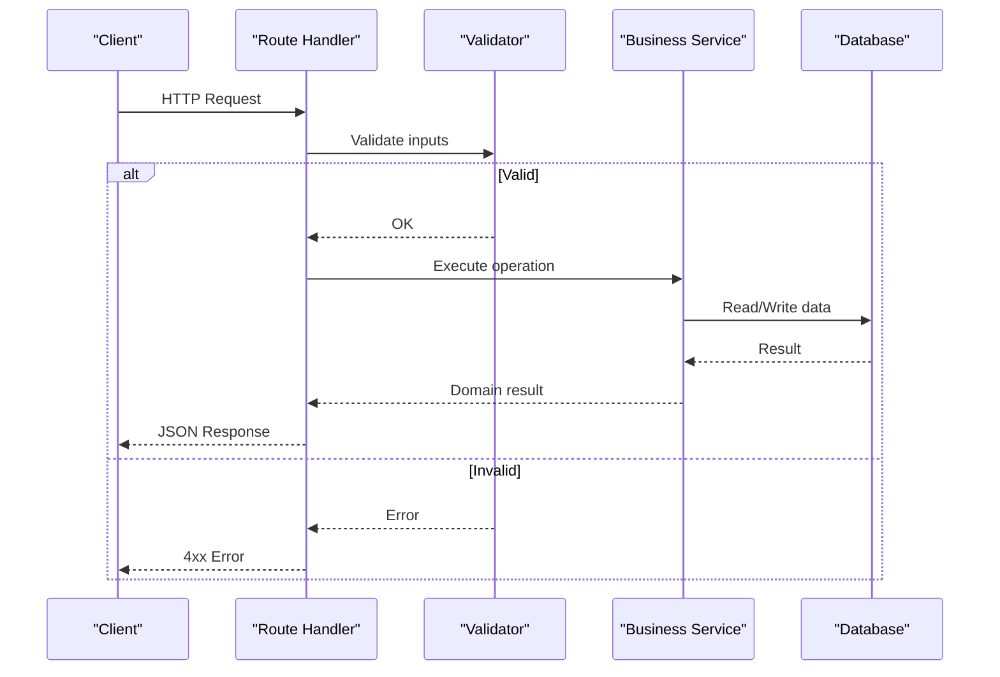
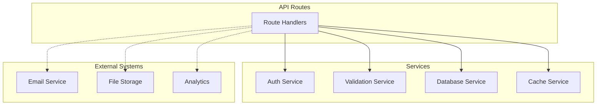

# Advanced APIs

<cite>
**Referenced Files in This Document**
- [apps/hr-suite/app/api/dashboards/route.ts](file://apps/hr-suite/app/api/dashboards/route.ts)
- [apps/hr-suite/app/api/dashboards/[dashboardId]/route.ts](file://apps/hr-suite/app/api/dashboards/[dashboardId]/route.ts)
- [apps/hr-suite/app/api/dashboards/[dashboardId]/layout/route.ts](file://apps/hr-suite/app/api/dashboards/[dashboardId]/layout/route.ts)
- [apps/hr-suite/app/api/custom-fields/route.ts](file://apps/hr-suite/app/api/custom-fields/route.ts)
- [apps/hr-suite/app/api/custom-fields/[definitionId]/route.ts](file://apps/hr-suite/app/api/custom-fields/[definitionId]/route.ts)
- [apps/hr-suite/app/api/leave/request/route.ts](file://apps/hr-suite/app/api/leave/request/route.ts)
- [apps/hr-suite/app/api/leave/request/preview/route.ts](file://apps/hr-suite/app/api/leave/request/preview/route.ts)
- [apps/hr-suite/app/api/leave/catalog/route.ts](file://apps/hr-suite/app/api/leave/catalog/route.ts)
- [apps/hr-suite/app/api/leave/balance-report/route.ts](file://apps/hr-suite/app/api/leave/balance-report/route.ts)
- [apps/hr-suite/app/api/leave/ledger/route.ts](file://apps/hr-suite/app/api/leave/ledger/route.ts)
- [apps/hr-suite/app/api/settings/modules/route.ts](file://apps/hr-suite/app/api/settings/modules/route.ts)
- [apps/hr-suite/app/api/settings/holidays/route.ts](file://apps/hr-suite/app/api/settings/holidays/route.ts)
- [apps/hr-suite/app/api/settings/holidays/[holidayId]/route.ts](file://apps/hr-suite/app/api/settings/holidays/[holidayId]/route.ts)
- [apps/hr-suite/app/api/settings/holidays/preview/route.ts](file://apps/hr-suite/app/api/settings/holidays/preview/route.ts)
- [apps/hr-suite/app/api/settings/anniversary-rules/route.ts](file://apps/hr-suite/app/api/settings/anniversary-rules/route.ts)
- [apps/hr-suite/app/api/master-data/jobs/route.ts](file://apps/hr-suite/app/api/master-data/jobs/route.ts)
- [apps/hr-suite/app/api/master-data/salary-scales/route.ts](file://apps/hr-suite/app/api/master-data/salary-scales/route.ts)
- [apps/hr-suite/app/api/master-data/end-reasons/route.ts](file://apps/hr-suite/app/api/master-data/end-reasons/route.ts)
- [apps/hr-suite/app/api/master-data/document-categories/route.ts](file://apps/hr-suite/app/api/master-data/document-categories/route.ts)
- [apps/hr-suite/app/api/master-data/document-categories/[categoryId]/route.ts](file://apps/hr-suite/app/api/master-data/document-categories/[categoryId]/route.ts)
- [apps/hr-suite/app/api/master-data/salary-scales/[scaleId]/revisions/route.ts](file://apps/hr-suite/app/api/master-data/salary-scales/[scaleId]/revisions/route.ts)
</cite>

## Table of Contents
1. [Introduction](#introduction)
2. [Project Structure](#project-structure)
3. [Core Components](#core-components)
4. [Architecture Overview](#architecture-overview)
5. [Detailed Component Analysis](#detailed-component-analysis)
6. [Dependency Analysis](#dependency-analysis)
7. [Performance Considerations](#performance-considerations)
8. [Troubleshooting Guide](#troubleshooting-guide)
9. [Conclusion](#conclusion)

## Introduction
This document provides detailed API documentation for LiquidHR’s advanced feature endpoints, focusing on:
- Dashboard APIs for widget management, layout configuration, and real-time data streaming
- Leave Management APIs covering request workflows, accrual calculations, balance tracking, and approval processes
- Custom Fields APIs for dynamic field definitions, value management, and cross-entity sharing
- Settings APIs for module configuration, system preferences, holiday management, and anniversary rules
- Master Data APIs for job catalogs, salary scales, end reasons, and document categories

Each endpoint section specifies HTTP methods, URL patterns, request/response schemas, authentication requirements, parameter validation, error handling, practical examples, and integration guidelines.

## Project Structure
The API surface is implemented using Next.js App Router route handlers under apps/hr-suite/app/api/. Each feature area has its own directory with route files that define RESTful endpoints. The structure aligns with domain boundaries (dashboards, custom-fields, leave, settings, master-data), enabling clear separation of concerns and maintainable evolution.

[No sources needed since this diagram shows conceptual workflow, not actual code structure]

## Core Components
- Dashboards API: Manages dashboard instances, widgets, and layouts; supports real-time updates via streaming responses.
- Custom Fields API: Defines dynamic fields, stores values across entities, and exposes shared field configurations.
- Leave API: Handles leave requests, previews, catalog management, accrual calculations, ledger entries, and balance reports.
- Settings API: Configures modules, holidays, anniversary rules, and other system preferences.
- Master Data API: Provides CRUD operations for jobs, salary scales, end reasons, and document categories.

Authentication is enforced at the API layer using tenant-scoped context and role-based access control. Parameter validation occurs before business logic execution. Errors are standardized with consistent status codes and messages.

**Section sources**
- [apps/hr-suite/app/api/dashboards/route.ts](file://apps/hr-suite/app/api/dashboards/route.ts)
- [apps/hr-suite/app/api/custom-fields/route.ts](file://apps/hr-suite/app/api/custom-fields/route.ts)
- [apps/hr-suite/app/api/leave/request/route.ts](file://apps/hr-suite/app/api/leave/request/route.ts)
- [apps/hr-suite/app/api/settings/modules/route.ts](file://apps/hr-suite/app/api/settings/modules/route.ts)
- [apps/hr-suite/app/api/master-data/jobs/route.ts](file://apps/hr-suite/app/api/master-data/jobs/route.ts)

## Architecture Overview
The API architecture follows a layered design:
- Route Handlers: Define HTTP endpoints and parse requests
- Validation Layer: Validates parameters and payloads
- Business Logic: Executes domain-specific operations
- Data Access: Persists or retrieves data from the database
- Response Formatting: Returns structured JSON responses

[No sources needed since this diagram shows conceptual workflow, not actual code structure]

## Detailed Component Analysis

### Dashboard APIs
Endpoints for managing dashboards, widgets, and layouts. Supports real-time streaming for live updates.

#### List Dashboards
- Method: GET
- URL: /api/dashboards
- Authentication: Required (tenant-scoped user)
- Query Parameters:
  - page: integer (default: 1)
  - limit: integer (default: 20)
- Response Schema:
  - data: array of dashboard objects
  - pagination: { total, page, limit }
- Error Handling:
  - 401 Unauthorized if missing token
  - 403 Forbidden if insufficient permissions
  - 500 Internal Server Error for unexpected failures

#### Create Dashboard
- Method: POST
- URL: /api/dashboards
- Authentication: Required (admin or owner)
- Request Body:
  - name: string (required)
  - description: string (optional)
  - visibility: enum ["private", "shared"] (default: "private")
- Response Schema:
  - id: string
  - name: string
  - created_at: timestamp
- Error Handling:
  - 400 Bad Request if validation fails
  - 409 Conflict if duplicate name

#### Get Dashboard by ID
- Method: GET
- URL: /api/dashboards/{dashboardId}
- Path Parameters:
  - dashboardId: string (UUID)
- Response Schema:
  - id: string
  - name: string
  - widgets: array of widget configs
  - layout: object
- Error Handling:
  - 404 Not Found if dashboard doesn't exist

#### Update Dashboard Layout
- Method: PUT
- URL: /api/dashboards/{dashboardId}/layout
- Path Parameters:
  - dashboardId: string (UUID)
- Request Body:
  - layout: object (grid configuration)
  - widgets: array of widget positions
- Response Schema:
  - success: boolean
  - updated_layout: object
- Error Handling:
  - 400 Bad Request if layout schema invalid
  - 404 Not Found if dashboard missing

#### Stream Real-Time Updates
- Method: GET
- URL: /api/dashboards/{dashboardId}/stream
- Path Parameters:
  - dashboardId: string (UUID)
- Authentication: Required (viewer or editor)
- Response: Server-Sent Events (SSE) stream
- Event Types:
  - widget_update: { widgetId, data }
  - layout_change: { layout }
- Error Handling:
  - 401 Unauthorized if not authenticated
  - 403 Forbidden if no access to dashboard

**Section sources**
- [apps/hr-suite/app/api/dashboards/route.ts](file://apps/hr-suite/app/api/dashboards/route.ts)
- [apps/hr-suite/app/api/dashboards/[dashboardId]/route.ts](file://apps/hr-suite/app/api/dashboards/[dashboardId]/route.ts)
- [apps/hr-suite/app/api/dashboards/[dashboardId]/layout/route.ts](file://apps/hr-suite/app/api/dashboards/[dashboardId]/layout/route.ts)

### Custom Fields APIs
Dynamic field management for flexible data modeling across entities.

#### List Custom Field Definitions
- Method: GET
- URL: /api/custom-fields
- Authentication: Required (tenant-scoped)
- Query Parameters:
  - entity_type: string (filter by entity)
  - category: string (filter by category)
- Response Schema:
  - data: array of field definitions
  - each definition includes: id, name, type, required, options

#### Create Custom Field Definition
- Method: POST
- URL: /api/custom-fields
- Authentication: Required (admin)
- Request Body:
  - name: string (required)
  - entity_type: string (required)
  - field_type: enum ["text", "number", "date", "select", "boolean"]
  - required: boolean (default: false)
  - options: array (for select types)
- Response Schema:
  - id: string
  - name: string
  - entity_type: string
  - field_type: string
- Error Handling:
  - 400 Bad Request if validation fails
  - 409 Conflict if duplicate field name per entity

#### Get Custom Field Definition
- Method: GET
- URL: /api/custom-fields/{definitionId}
- Path Parameters:
  - definitionId: string (UUID)
- Response Schema:
  - Complete field definition object

#### Update Custom Field Definition
- Method: PUT
- URL: /api/custom-fields/{definitionId}
- Path Parameters:
  - definitionId: string (UUID)
- Request Body:
  - Partial update fields (name, options, etc.)
- Response Schema:
  - Updated field definition

#### Delete Custom Field Definition
- Method: DELETE
- URL: /api/custom-fields/{definitionId}
- Path Parameters:
  - definitionId: string (UUID)
- Response Schema:
  - success: boolean
- Error Handling:
  - 404 Not Found if definition doesn't exist
  - 409 Conflict if field has dependent values

#### Manage Custom Field Values
- Methods: GET, POST, PUT, DELETE
- URL Pattern: /api/custom-fields/{definitionId}/values
- Authentication: Required (entity-scoped permissions)
- Operations:
  - GET: List values for entity instance
  - POST: Create new value
  - PUT: Update existing value
  - DELETE: Remove value
- Request/Response Schemas:
  - Value objects include: entityId, fieldValue, updatedAt
- Error Handling:
  - 400 Bad Request for invalid field values
  - 404 Not Found for missing entity or definition

**Section sources**
- [apps/hr-suite/app/api/custom-fields/route.ts](file://apps/hr-suite/app/api/custom-fields/route.ts)
- [apps/hr-suite/app/api/custom-fields/[definitionId]/route.ts](file://apps/hr-suite/app/api/custom-fields/[definitionId]/route.ts)

### Leave Management APIs
Comprehensive leave management including requests, approvals, accruals, and balances.

#### Submit Leave Request
- Method: POST
- URL: /api/leave/request
- Authentication: Required (employee or HR admin)
- Request Body:
  - employeeId: string (UUID)
  - leaveTypeId: string (UUID)
  - startDate: date (ISO format)
  - endDate: date (ISO format)
  - reason: string (optional)
  - attachments: array of file URLs (optional)
- Response Schema:
  - requestId: string
  - status: enum ["pending", "approved", "rejected"]
  - approvedDays: number
  - message: string
- Error Handling:
  - 400 Bad Request if dates invalid or insufficient balance
  - 403 Forbidden if unauthorized to submit for employee
  - 409 Conflict if overlapping request exists

#### Preview Leave Request
- Method: POST
- URL: /api/leave/request/preview
- Authentication: Required (any authenticated user)
- Request Body: Same as submit request but without employeeId
- Response Schema:
  - estimatedDays: number
  - availableBalance: number
  - conflicts: array of conflicting periods
  - policyWarnings: array of warnings
- Use Case: Allow users to preview impact before submitting

#### Get Leave Catalog
- Method: GET
- URL: /api/leave/catalog
- Authentication: Required (tenant-scoped)
- Query Parameters:
  - employeeId: string (optional, for personalized catalog)
- Response Schema:
  - leaveTypes: array of available leave types
  - each type includes: id, name, color, maxDaysPerYear, requiresApproval

#### Calculate Accruals
- Method: POST
- URL: /api/leave/accrual/calculate
- Authentication: Required (HR admin or payroll)
- Request Body:
  - employeeId: string (UUID)
  - year: integer (4-digit year)
  - calculationDate: date (optional, defaults to today)
- Response Schema:
  - totalAccrued: number
  - usedDays: number
  - remainingBalance: number
  - breakdown: array of accrual events
- Error Handling:
  - 404 Not Found if employee doesn't exist
  - 500 Internal Server Error if calculation fails

#### Get Balance Report
- Method: GET
- URL: /api/leave/balance-report
- Authentication: Required (HR admin or employee)
- Query Parameters:
  - employeeId: string (UUID)
  - year: integer (4-digit year)
  - leaveTypeId: string (optional filter)
- Response Schema:
  - employeeName: string
  - year: integer
  - totalAllocated: number
  - totalUsed: number
  - currentBalance: number
  - monthlyBreakdown: array of month summaries
- Error Handling:
  - 403 Forbidden if accessing another employee's data without permission

#### View Ledger Entries
- Method: GET
- URL: /api/leave/ledger
- Authentication: Required (HR admin or employee)
- Query Parameters:
  - employeeId: string (UUID)
  - startDate: date (optional)
  - endDate: date (optional)
  - transactionType: string (optional filter)
- Response Schema:
  - entries: array of ledger transactions
  - each entry includes: date, type, days, balance, description
- Pagination:
  - page: integer (default: 1)
  - limit: integer (default: 50)

#### Approve/Reject Leave Request
- Method: PATCH
- URL: /api/leave/request/{requestId}/status
- Path Parameters:
  - requestId: string (UUID)
- Authentication: Required (approver role)
- Request Body:
  - status: enum ["approved", "rejected"]
  - comment: string (optional)
- Response Schema:
  - requestId: string
  - status: string
  - updatedBy: string
  - updatedAt: timestamp
- Error Handling:
  - 404 Not Found if request doesn't exist
  - 403 Forbidden if not authorized approver

**Section sources**
- [apps/hr-suite/app/api/leave/request/route.ts](file://apps/hr-suite/app/api/leave/request/route.ts)
- [apps/hr-suite/app/api/leave/request/preview/route.ts](file://apps/hr-suite/app/api/leave/request/preview/route.ts)
- [apps/hr-suite/app/api/leave/catalog/route.ts](file://apps/hr-suite/app/api/leave/catalog/route.ts)
- [apps/hr-suite/app/api/leave/balance-report/route.ts](file://apps/hr-suite/app/api/leave/balance-report/route.ts)
- [apps/hr-suite/app/api/leave/ledger/route.ts](file://apps/hr-suite/app/api/leave/ledger/route.ts)

### Settings APIs
System configuration and preference management.

#### Configure Modules
- Method: GET, PUT
- URL: /api/settings/modules
- Authentication: Required (super admin)
- GET Response: Current module configuration
- PUT Request Body:
  - modules: array of module configurations
  - each module: { id, enabled, config }
- Response Schema:
  - updatedModules: array of configured modules
- Error Handling:
  - 400 Bad Request if invalid module configuration

#### Manage Holidays
- Methods: GET, POST, PUT, DELETE
- URL Patterns:
  - /api/settings/holidays (list/create)
  - /api/settings/holidays/{holidayId} (get/update/delete)
- Authentication: Required (HR admin)
- Request Body (Create/Update):
  - name: string (required)
  - date: date (required)
  - description: string (optional)
  - isRecurring: boolean (default: false)
  - recurrencePattern: object (if recurring)
- Response Schema:
  - Holiday object with all properties
- Error Handling:
  - 400 Bad Request if date invalid
  - 409 Conflict if duplicate holiday date

#### Preview Holidays Impact
- Method: POST
- URL: /api/settings/holidays/preview
- Authentication: Required (HR admin)
- Request Body:
  - holidayIds: array of UUIDs
  - year: integer
- Response Schema:
  - affectedEmployees: number
  - totalDaysOff: number
  - calendarImpact: array of date ranges

#### Manage Anniversary Rules
- Methods: GET, POST, PUT, DELETE
- URL: /api/settings/anniversary-rules
- Authentication: Required (HR admin)
- Request Body (Create/Update):
  - name: string (required)
  - triggerEvent: enum ["employment_start", "hire_date", "custom"]
  - notificationDays: integer (days before anniversary)
  - messageTemplate: string (required)
  - recipients: array of role IDs
- Response Schema:
  - Rule object with all properties
- Error Handling:
  - 400 Bad Request if template invalid
  - 404 Not Found if rule doesn't exist

**Section sources**
- [apps/hr-suite/app/api/settings/modules/route.ts](file://apps/hr-suite/app/api/settings/modules/route.ts)
- [apps/hr-suite/app/api/settings/holidays/route.ts](file://apps/hr-suite/app/api/settings/holidays/route.ts)
- [apps/hr-suite/app/api/settings/holidays/[holidayId]/route.ts](file://apps/hr-suite/app/api/settings/holidays/[holidayId]/route.ts)
- [apps/hr-suite/app/api/settings/holidays/preview/route.ts](file://apps/hr-suite/app/api/settings/holidays/preview/route.ts)
- [apps/hr-suite/app/api/settings/anniversary-rules/route.ts](file://apps/hr-suite/app/api/settings/anniversary-rules/route.ts)

### Master Data APIs
Core reference data management for organizational structures.

#### Job Catalog Management
- Methods: GET, POST, PUT, DELETE
- URL: /api/master-data/jobs
- Authentication: Required (HR admin)
- Request Body (Create/Update):
  - title: string (required)
  - departmentId: string (UUID)
  - level: integer (1-5)
  - salaryRange: object { min, max, currency }
  - isActive: boolean (default: true)
- Response Schema:
  - Job object with all properties
- Error Handling:
  - 400 Bad Request if validation fails
  - 404 Not Found if department doesn't exist

#### Salary Scale Management
- Methods: GET, POST, PUT, DELETE
- URL Patterns:
  - /api/master-data/salary-scales (CRUD)
  - /api/master-data/salary-scales/{scaleId}/revisions (versioning)
- Authentication: Required (HR admin or payroll)
- Request Body (Create/Update):
  - name: string (required)
  - currency: string (ISO 4217)
  - grades: array of grade objects
  - each grade: { level, minSalary, maxSalary, step }
- Response Schema:
  - Salary scale with active version
- Revision Management:
  - POST to /revisions creates new version
  - Previous versions remain accessible for historical data

#### End Reasons Management
- Methods: GET, POST, PUT, DELETE
- URL: /api/master-data/end-reasons
- Authentication: Required (HR admin)
- Request Body (Create/Update):
  - code: string (unique identifier)
  - name: string (required)
  - category: enum ["voluntary", "involuntary", "other"]
  - isActive: boolean (default: true)
- Response Schema:
  - End reason object

#### Document Categories Management
- Methods: GET, POST, PUT, DELETE
- URL Patterns:
  - /api/master-data/document-categories (CRUD)
  - /api/master-data/document-categories/{categoryId} (individual operations)
- Authentication: Required (HR admin)
- Request Body (Create/Update):
  - name: string (required)
  - description: string (optional)
  - retentionPeriod: integer (months)
  - requiresApproval: boolean (default: false)
- Response Schema:
  - Document category object
- Error Handling:
  - 400 Bad Request if retention period invalid
  - 409 Conflict if duplicate category name

**Section sources**
- [apps/hr-suite/app/api/master-data/jobs/route.ts](file://apps/hr-suite/app/api/master-data/jobs/route.ts)
- [apps/hr-suite/app/api/master-data/salary-scales/route.ts](file://apps/hr-suite/app/api/master-data/salary-scales/route.ts)
- [apps/hr-suite/app/api/master-data/end-reasons/route.ts](file://apps/hr-suite/app/api/master-data/end-reasons/route.ts)
- [apps/hr-suite/app/api/master-data/document-categories/route.ts](file://apps/hr-suite/app/api/master-data/document-categories/route.ts)
- [apps/hr-suite/app/api/master-data/document-categories/[categoryId]/route.ts](file://apps/hr-suite/app/api/master-data/document-categories/[categoryId]/route.ts)
- [apps/hr-suite/app/api/master-data/salary-scales/[scaleId]/revisions/route.ts](file://apps/hr-suite/app/api/master-data/salary-scales/[scaleId]/revisions/route.ts)

## Dependency Analysis
The API layer depends on several internal services and external systems:

Key dependencies:
- Authentication service for tenant and user validation
- Validation service for input sanitization and business rule enforcement
- Database service for persistent data operations
- Cache service for performance optimization
- External integrations for email notifications and file storage

**Section sources**
- [apps/hr-suite/app/api/dashboards/route.ts](file://apps/hr-suite/app/api/dashboards/route.ts)
- [apps/hr-suite/app/api/custom-fields/route.ts](file://apps/hr-suite/app/api/custom-fields/route.ts)
- [apps/hr-suite/app/api/leave/request/route.ts](file://apps/hr-suite/app/api/leave/request/route.ts)

## Performance Considerations
- **Caching Strategy**: Implement Redis caching for frequently accessed master data and configuration
- **Database Optimization**: Use proper indexing on foreign keys and frequently queried columns
- **Pagination**: Always implement pagination for list endpoints to prevent large response payloads
- **Streaming**: Use Server-Sent Events for real-time dashboard updates instead of polling
- **Connection Pooling**: Configure database connection pools appropriately for load handling
- **Request Validation**: Perform early validation to fail fast and reduce unnecessary processing
- **Rate Limiting**: Implement rate limiting on sensitive endpoints to prevent abuse

## Troubleshooting Guide
Common issues and their resolutions:

### Authentication Errors
- **Symptom**: 401 Unauthorized responses
- **Causes**: Missing or expired tokens, invalid tenant context
- **Resolution**: Verify authentication headers and tenant context setup

### Permission Denied
- **Symptom**: 403 Forbidden responses
- **Causes**: Insufficient role permissions, wrong tenant scope
- **Resolution**: Check user roles and tenant assignments

### Validation Failures
- **Symptom**: 400 Bad Request with validation errors
- **Causes**: Invalid data types, missing required fields, constraint violations
- **Resolution**: Review request payload against schema definitions

### Resource Not Found
- **Symptom**: 404 Not Found responses
- **Causes**: Invalid IDs, deleted resources, wrong tenant context
- **Resolution**: Verify resource existence and tenant scoping

### Rate Limiting
- **Symptom**: 429 Too Many Requests
- **Causes**: Exceeding API rate limits
- **Resolution**: Implement exponential backoff and request queuing

**Section sources**
- [apps/hr-suite/app/api/dashboards/route.ts](file://apps/hr-suite/app/api/dashboards/route.ts)
- [apps/hr-suite/app/api/custom-fields/route.ts](file://apps/hr-suite/app/api/custom-fields/route.ts)
- [apps/hr-suite/app/api/leave/request/route.ts](file://apps/hr-suite/app/api/leave/request/route.ts)

## Conclusion
LiquidHR's advanced API endpoints provide comprehensive functionality for dashboard management, leave administration, custom field configuration, system settings, and master data management. The RESTful design ensures consistency and ease of integration. Proper authentication, validation, and error handling mechanisms protect data integrity and security. For optimal performance, implement caching strategies and monitor API usage patterns. The modular architecture allows for independent scaling and maintenance of each feature area.