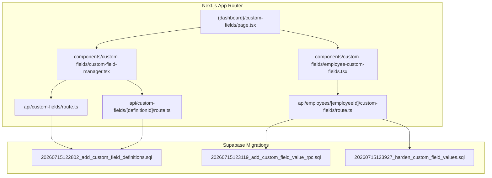
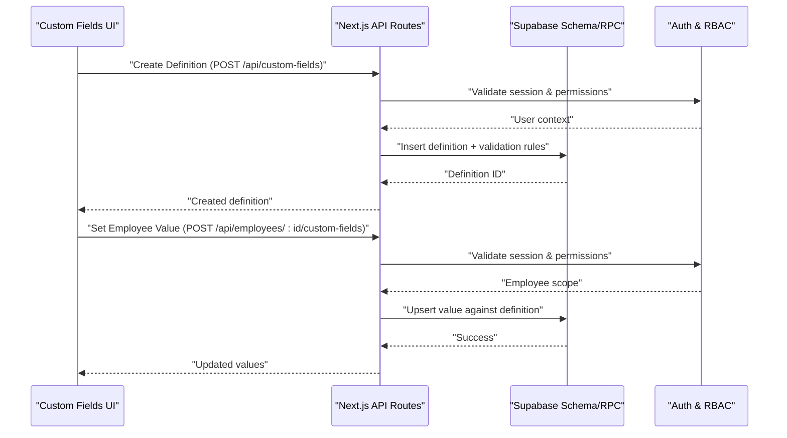
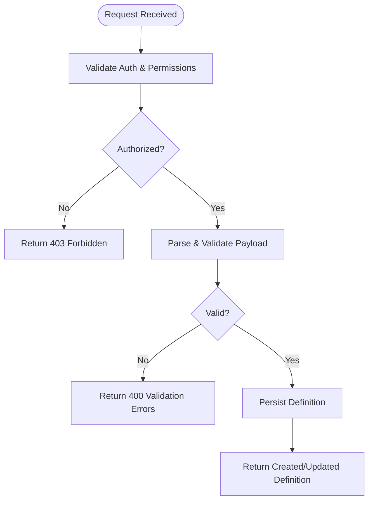
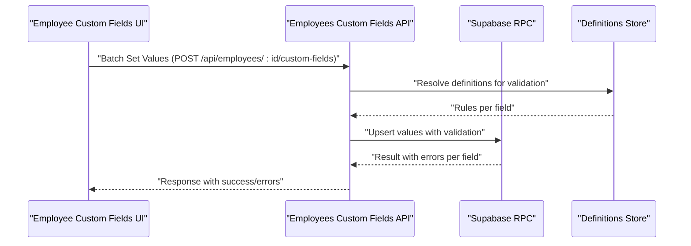
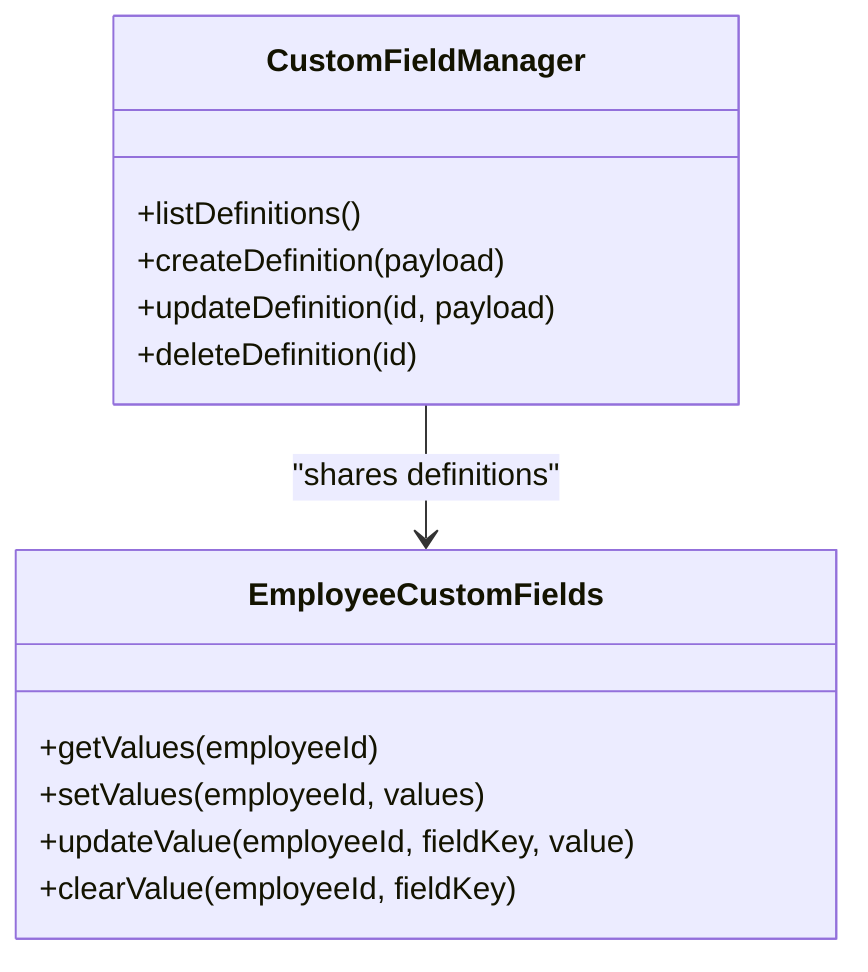

# Custom Fields APIs

<cite>
**Referenced Files in This Document**
- [route.ts](file://apps/hr-suite/app/api/custom-fields/route.ts)
- [route.ts](file://apps/hr-suite/app/api/custom-fields/[definitionId]/route.ts)
- [route.ts](file://apps/hr-suite/app/api/employees/[employeeId]/custom-fields/route.ts)
- [page.tsx](file://apps/hr-suite/app/(dashboard)/custom-fields/page.tsx)
- [custom-field-manager.tsx](file://apps/hr-suite/components/custom-fields/custom-field-manager.tsx)
- [employee-custom-fields.tsx](file://apps/hr-suite/components/custom-fields/employee-custom-fields.tsx)
- [20260715122802_add_custom_field_definitions.sql](file://apps/hr-suite/supabase/migrations/20260715122802_add_custom_field_definitions.sql)
- [20260715123119_add_custom_field_value_rpc.sql](file://apps/hr-suite/supabase/migrations/20260715123119_add_custom_field_value_rpc.sql)
- [20260715123927_harden_custom_field_values.sql](file://apps/hr-suite/supabase/migrations/20260715123927_harden_custom_field_values.sql)
- [VRIJE_VELDEN.md](file://docs/requirements/custom-fields/VRIJE_VELDEN.md)
</cite>

## Table of Contents
1. [Introduction](#introduction)
2. [Project Structure](#project-structure)
3. [Core Components](#core-components)
4. [Architecture Overview](#architecture-overview)
5. [Detailed Component Analysis](#detailed-component-analysis)
6. [Dependency Analysis](#dependency-analysis)
7. [Performance Considerations](#performance-considerations)
8. [Troubleshooting Guide](#troubleshooting-guide)
9. [Conclusion](#conclusion)
10. [Appendices](#appendices)

## Introduction
This document provides comprehensive API documentation for LiquidHR’s Custom Fields system. It covers:
- Field definition management (create, update, delete, list)
- Field value operations (set, get, update) across entities such as employees
- Cross-entity sharing of reusable field definitions
- HTTP methods, URL patterns, request/response schemas, authentication requirements, validation rules by type, and error handling strategies
- Practical examples for creating custom employee attributes, implementing conditional validation, and integrating into existing workflows
- Performance considerations for large datasets and optimization techniques for queries

## Project Structure
The Custom Fields feature spans Next.js App Router API routes, UI components, and Supabase migrations that define the schema and RPCs used by the API layer.

**Diagram sources**
- [route.ts](file://apps/hr-suite/app/api/custom-fields/route.ts)
- [route.ts](file://apps/hr-suite/app/api/custom-fields/[definitionId]/route.ts)
- [route.ts](file://apps/hr-suite/app/api/employees/[employeeId]/custom-fields/route.ts)
- [page.tsx](file://apps/hr-suite/app/(dashboard)/custom-fields/page.tsx)
- [custom-field-manager.tsx](file://apps/hr-suite/components/custom-fields/custom-field-manager.tsx)
- [employee-custom-fields.tsx](file://apps/hr-suite/components/custom-fields/employee-custom-fields.tsx)
- [20260715122802_add_custom_field_definitions.sql](file://apps/hr-suite/supabase/migrations/20260715122802_add_custom_field_definitions.sql)
- [20260715123119_add_custom_field_value_rpc.sql](file://apps/hr-suite/supabase/migrations/20260715123119_add_custom_field_value_rpc.sql)
- [20260715123927_harden_custom_field_values.sql](file://apps/hr-suite/supabase/migrations/20260715123927_harden_custom_field_values.sql)

**Section sources**
- [route.ts](file://apps/hr-suite/app/api/custom-fields/route.ts)
- [route.ts](file://apps/hr-suite/app/api/custom-fields/[definitionId]/route.ts)
- [route.ts](file://apps/hr-suite/app/api/employees/[employeeId]/custom-fields/route.ts)
- [page.tsx](file://apps/hr-suite/app/(dashboard)/custom-fields/page.tsx)
- [custom-field-manager.tsx](file://apps/hr-suite/components/custom-fields/custom-field-manager.tsx)
- [employee-custom-fields.tsx](file://apps/hr-suite/components/custom-fields/employee-custom-fields.tsx)
- [20260715122802_add_custom_field_definitions.sql](file://apps/hr-suite/supabase/migrations/20260715122802_add_custom_field_definitions.sql)
- [20260715123119_add_custom_field_value_rpc.sql](file://apps/hr-suite/supabase/migrations/20260715123119_add_custom_field_value_rpc.sql)
- [20260715123927_harden_custom_field_values.sql](file://apps/hr-suite/supabase/migrations/20260715123927_harden_custom_field_values.sql)

## Core Components
- Custom Field Definitions API
  - Purpose: Manage reusable field definitions (schema, labels, types, validation rules).
  - Endpoints:
    - List/Create definitions: GET/POST /api/custom-fields
    - Get/Update/Delete a definition: GET/PUT/DELETE /api/custom-fields/:definitionId
- Employee Custom Field Values API
  - Purpose: Set, retrieve, and update dynamic values for an employee against shared definitions.
  - Endpoint: POST /api/employees/:employeeId/custom-fields (batch set/update), with GET/PUT/DELETE variants as implemented.

Authentication and Authorization
- All endpoints require authenticated requests via the application’s auth middleware.
- RBAC enforces tenant isolation and role-based access to custom fields and values.

Validation Rules by Type
- String: length constraints, regex patterns
- Number: min/max, integer or float
- Boolean: true/false only
- Date/DateTime: ISO format, range checks
- Enum: allowed values list
- JSON: schema validation if defined

Error Handling Strategy
- Validation errors return 400 with detailed messages per field
- Not found returns 404
- Unauthorized returns 401
- Forbidden returns 403
- Server errors return 500 with sanitized messages

**Section sources**
- [route.ts](file://apps/hr-suite/app/api/custom-fields/route.ts)
- [route.ts](file://apps/hr-suite/app/api/custom-fields/[definitionId]/route.ts)
- [route.ts](file://apps/hr-suite/app/api/employees/[employeeId]/custom-fields/route.ts)

## Architecture Overview
The Custom Fields system follows a clear separation between API routes, UI components, and database schema/RPCs.

**Diagram sources**
- [route.ts](file://apps/hr-suite/app/api/custom-fields/route.ts)
- [route.ts](file://apps/hr-suite/app/api/custom-fields/[definitionId]/route.ts)
- [route.ts](file://apps/hr-suite/app/api/employees/[employeeId]/custom-fields/route.ts)
- [20260715122802_add_custom_field_definitions.sql](file://apps/hr-suite/supabase/migrations/20260715122802_add_custom_field_definitions.sql)
- [20260715123119_add_custom_field_value_rpc.sql](file://apps/hr-suite/supabase/migrations/20260715123119_add_custom_field_value_rpc.sql)
- [20260715123927_harden_custom_field_values.sql](file://apps/hr-suite/supabase/migrations/20260715123927_harden_custom_field_values.sql)

## Detailed Component Analysis

### Custom Field Definitions API
- Endpoints
  - GET /api/custom-fields: List all definitions (supports filtering by entity scope and visibility)
  - POST /api/custom-fields: Create a new definition with type, label, validation rules, and cross-entity sharing flags
  - GET /api/custom-fields/:definitionId: Retrieve a single definition
  - PUT /api/custom-fields/:definitionId: Update definition metadata and validation rules
  - DELETE /api/custom-fields/:definitionId: Remove a definition (with referential integrity checks)

- Request/Response Schemas
  - Create/Update payload includes:
    - name, label, description
    - type (string, number, boolean, date, datetime, enum, json)
    - required flag
    - validation rules (min, max, pattern, allowedValues, etc.)
    - sharedAcrossEntities flag
    - targetEntityScope (e.g., employee, department)
  - Responses include full definition object with id, timestamps, and validation schema

- Authentication & Authorization
  - Requires authenticated user with admin or custom-fields manager role within the tenant
  - Enforces tenant isolation on creation and updates

- Validation Rules by Type
  - string: minLength, maxLength, pattern
  - number: min, max, integerOnly
  - boolean: strict true/false
  - date/datetime: format enforcement, range checks
  - enum: allowedValues must match
  - json: optional schema validation

- Error Handling
  - 400 for invalid payloads or rule violations
  - 404 when definition not found
  - 403 for insufficient permissions
  - 409 for duplicate names where enforced

**Diagram sources**
- [route.ts](file://apps/hr-suite/app/api/custom-fields/route.ts)
- [route.ts](file://apps/hr-suite/app/api/custom-fields/[definitionId]/route.ts)
- [20260715122802_add_custom_field_definitions.sql](file://apps/hr-suite/supabase/migrations/20260715122802_add_custom_field_definitions.sql)

**Section sources**
- [route.ts](file://apps/hr-suite/app/api/custom-fields/route.ts)
- [route.ts](file://apps/hr-suite/app/api/custom-fields/[definitionId]/route.ts)
- [20260715122802_add_custom_field_definitions.sql](file://apps/hr-suite/supabase/migrations/20260715122802_add_custom_field_definitions.sql)

### Employee Custom Field Values API
- Endpoint
  - POST /api/employees/:employeeId/custom-fields: Batch set/update values for multiple fields at once
  - GET /api/employees/:employeeId/custom-fields: Retrieve current values mapped by definitionId
  - PUT /api/employees/:employeeId/custom-fields/:fieldKey: Update a single field value
  - DELETE /api/employees/:employeeId/custom-fields/:fieldKey: Clear a field value

- Request/Response Schemas
  - Batch set payload: array of { fieldDefinitionId, value }
  - Response: confirmation with updated values and any validation errors per field
  - Single update payload: { value } validated against definition rules

- Cross-Entity Sharing
  - If a definition is marked sharedAcrossEntities, it can be applied to multiple entity types; the API resolves the correct table/column mapping based on targetEntityScope

- Authentication & Authorization
  - Requires authenticated user with write permission to employee data and custom fields
  - Tenant-scoped access ensures employees are visible only within the caller’s tenant

- Validation Rules by Type
  - Same rules as definition-level validation are enforced at value write time
  - Conditional validation supported via definition-level conditions (e.g., if another field equals X, then Y becomes required)

**Diagram sources**
- [route.ts](file://apps/hr-suite/app/api/employees/[employeeId]/custom-fields/route.ts)
- [20260715123119_add_custom_field_value_rpc.sql](file://apps/hr-suite/supabase/migrations/20260715123119_add_custom_field_value_rpc.sql)
- [20260715123927_harden_custom_field_values.sql](file://apps/hr-suite/supabase/migrations/20260715123927_harden_custom_field_values.sql)

**Section sources**
- [route.ts](file://apps/hr-suite/app/api/employees/[employeeId]/custom-fields/route.ts)
- [20260715123119_add_custom_field_value_rpc.sql](file://apps/hr-suite/supabase/migrations/20260715123119_add_custom_field_value_rpc.sql)
- [20260715123927_harden_custom_field_values.sql](file://apps/hr-suite/supabase/migrations/20260715123927_harden_custom_field_values.sql)

### UI Integration Points
- Custom Fields Manager
  - Provides CRUD interface for definitions
  - Validates inputs client-side before sending to API
- Employee Custom Fields Panel
  - Displays editable fields based on available definitions
  - Handles batch updates and displays per-field validation errors

**Diagram sources**
- [custom-field-manager.tsx](file://apps/hr-suite/components/custom-fields/custom-field-manager.tsx)
- [employee-custom-fields.tsx](file://apps/hr-suite/components/custom-fields/employee-custom-fields.tsx)

**Section sources**
- [custom-field-manager.tsx](file://apps/hr-suite/components/custom-fields/custom-field-manager.tsx)
- [employee-custom-fields.tsx](file://apps/hr-suite/components/custom-fields/employee-custom-fields.tsx)

## Dependency Analysis
- API routes depend on Supabase schema and RPCs for persistence and validation
- UI components depend on API routes for data operations
- Migrations define tables, indexes, and functions used by the API layer

**Diagram sources**
- [route.ts](file://apps/hr-suite/app/api/custom-fields/route.ts)
- [route.ts](file://apps/hr-suite/app/api/custom-fields/[definitionId]/route.ts)
- [route.ts](file://apps/hr-suite/app/api/employees/[employeeId]/custom-fields/route.ts)
- [20260715122802_add_custom_field_definitions.sql](file://apps/hr-suite/supabase/migrations/20260715122802_add_custom_field_definitions.sql)
- [20260715123119_add_custom_field_value_rpc.sql](file://apps/hr-suite/supabase/migrations/20260715123119_add_custom_field_value_rpc.sql)
- [20260715123927_harden_custom_field_values.sql](file://apps/hr-suite/supabase/migrations/20260715123927_harden_custom_field_values.sql)

**Section sources**
- [route.ts](file://apps/hr-suite/app/api/custom-fields/route.ts)
- [route.ts](file://apps/hr-suite/app/api/custom-fields/[definitionId]/route.ts)
- [route.ts](file://apps/hr-suite/app/api/employees/[employeeId]/custom-fields/route.ts)
- [20260715122802_add_custom_field_definitions.sql](file://apps/hr-suite/supabase/migrations/20260715122802_add_custom_field_definitions.sql)
- [20260715123119_add_custom_field_value_rpc.sql](file://apps/hr-suite/supabase/migrations/20260715123119_add_custom_field_value_rpc.sql)
- [20260715123927_harden_custom_field_values.sql](file://apps/hr-suite/supabase/migrations/20260715123927_harden_custom_field_values.sql)

## Performance Considerations
- Use batch operations for setting multiple field values to reduce round-trips
- Leverage indexes defined in migrations for fast lookups by employeeId and definitionId
- Cache definition metadata on the client side to minimize repeated fetches
- Avoid over-fetching by requesting only needed fields and applying pagination where applicable
- For large datasets, prefer server-side validation and filtering to reduce payload sizes

[No sources needed since this section provides general guidance]

## Troubleshooting Guide
Common issues and resolutions:
- Validation errors: Check field type and rules; ensure payloads conform to definition constraints
- Permission denied: Verify user roles and tenant scope; ensure the user has write access to custom fields
- Not found errors: Confirm definitionId and employeeId exist and belong to the same tenant
- Data inconsistency: Re-run batch updates with corrected payloads; review per-field error responses

**Section sources**
- [route.ts](file://apps/hr-suite/app/api/custom-fields/route.ts)
- [route.ts](file://apps/hr-suite/app/api/custom-fields/[definitionId]/route.ts)
- [route.ts](file://apps/hr-suite/app/api/employees/[employeeId]/custom-fields/route.ts)

## Conclusion
LiquidHR’s Custom Fields system provides a robust, extensible mechanism for defining and managing dynamic attributes across entities. With strong validation, cross-entity sharing, and secure tenant isolation, it enables flexible data modeling while maintaining performance and reliability.

[No sources needed since this section summarizes without analyzing specific files]

## Appendices

### Practical Examples
- Creating a custom employee attribute
  - Define a new field with appropriate type and validation rules
  - Assign to employee scope and mark as shared if reusable
  - Use the batch set endpoint to populate initial values

- Implementing conditional validation
  - Configure definition-level conditions (e.g., required when another field matches a value)
  - Ensure client-side hints align with server-side rules

- Integrating into existing workflows
  - Extend employee creation/update flows to include custom fields
  - Display field values in dashboards and reports using definition metadata

**Section sources**
- [VRIJE_VELDEN.md](file://docs/requirements/custom-fields/VRIJE_VELDEN.md)
- [route.ts](file://apps/hr-suite/app/api/custom-fields/route.ts)
- [route.ts](file://apps/hr-suite/app/api/custom-fields/[definitionId]/route.ts)
- [route.ts](file://apps/hr-suite/app/api/employees/[employeeId]/custom-fields/route.ts)