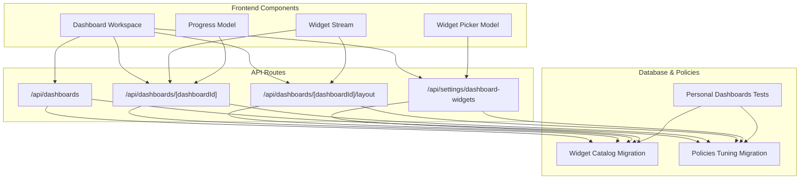
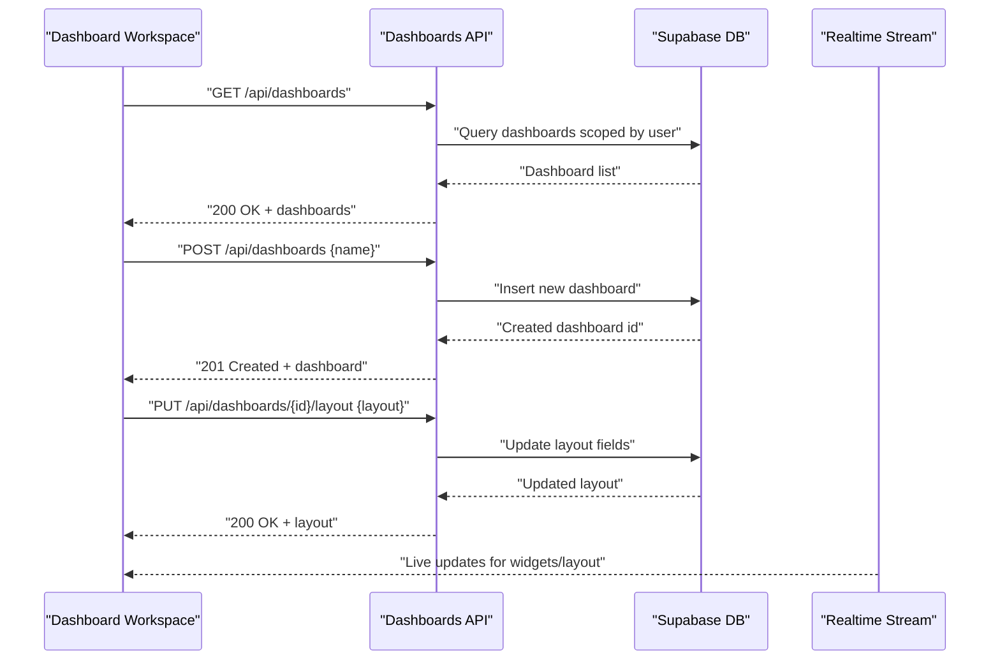
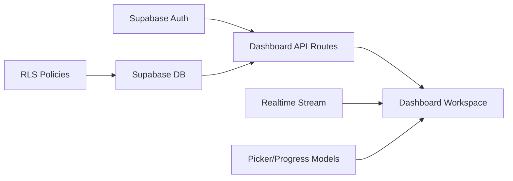

# Dashboard APIs

<cite>
**Referenced Files in This Document**
- [apps/hr-suite/app/api/dashboards/route.ts](file://apps/hr-suite/app/api/dashboards/route.ts)
- [apps/hr-suite/app/api/dashboards/[dashboardId]/route.ts](file://apps/hr-suite/app/api/dashboards/[dashboardId]/route.ts)
- [apps/hr-suite/app/api/dashboards/[dashboardId]/layout/route.ts](file://apps/hr-suite/app/api/dashboards/[dashboardId]/layout/route.ts)
- [apps/hr-suite/app/api/settings/dashboard-widgets/route.ts](file://apps/hr-suite/app/api/settings/dashboard-widgets/route.ts)
- [apps/hr-suite/components/dashboard/dashboard-workspace.tsx](file://apps/hr-suite/components/dashboard/dashboard-workspace.tsx)
- [apps/hr-suite/components/dashboard/dashboard-widget-stream.tsx](file://apps/hr-suite/components/dashboard/dashboard-widget-stream.tsx)
- [apps/hr-suite/components/dashboard/widget-picker-model.ts](file://apps/hr-suite/components/dashboard/widget-picker-model.ts)
- [apps/hr-suite/components/dashboard/dashboard-progress-model.ts](file://apps/hr-suite/components/dashboard/dashboard-progress-model.ts)
- [apps/hr-suite/supabase/migrations/20260718170000_add_dashboard_widget_catalog.sql](file://apps/hr-suite/supabase/migrations/20260718170000_add_dashboard_widget_catalog.sql)
- [apps/hr-suite/supabase/migrations/20260718173000_tune_dashboard_widget_policies.sql](file://apps/hr-suite/supabase/migrations/20260718173000_tune_dashboard_widget_policies.sql)
- [apps/hr-suite/supabase/tests/personal_dashboards.sql](file://apps/hr-suite/supabase/tests/personal_dashboards.sql)
</cite>

## Table of Contents
1. [Introduction](#introduction)
2. [Project Structure](#project-structure)
3. [Core Components](#core-components)
4. [Architecture Overview](#architecture-overview)
5. [Detailed Component Analysis](#detailed-component-analysis)
6. [Dependency Analysis](#dependency-analysis)
7. [Performance Considerations](#performance-considerations)
8. [Troubleshooting Guide](#troubleshooting-guide)
9. [Conclusion](#conclusion)

## Introduction
This document provides comprehensive API documentation for LiquidHR’s Dashboard management endpoints. It covers:
- Personal dashboard CRUD operations (create, read, update, delete)
- Widget management APIs (add, remove, configure widgets)
- Layout configuration endpoints (positions, sizes, responsive behavior)
- Real-time data streaming for live dashboard updates
- Authentication using Supabase Auth
- Parameter validation rules and error handling strategies
- Practical examples and performance considerations for large dashboards

## Project Structure
The dashboard feature is implemented with Next.js App Router API routes under apps/hr-suite/app/api/dashboards and related settings routes. The frontend components orchestrate widget rendering, layout editing, and real-time streaming.

**Diagram sources**
- [apps/hr-suite/app/api/dashboards/route.ts](file://apps/hr-suite/app/api/dashboards/route.ts)
- [apps/hr-suite/app/api/dashboards/[dashboardId]/route.ts](file://apps/hr-suite/app/api/dashboards/[dashboardId]/route.ts)
- [apps/hr-suite/app/api/dashboards/[dashboardId]/layout/route.ts](file://apps/hr-suite/app/api/dashboards/[dashboardId]/layout/route.ts)
- [apps/hr-suite/app/api/settings/dashboard-widgets/route.ts](file://apps/hr-suite/app/api/settings/dashboard-widgets/route.ts)
- [apps/hr-suite/components/dashboard/dashboard-workspace.tsx](file://apps/hr-suite/components/dashboard/dashboard-workspace.tsx)
- [apps/hr-suite/components/dashboard/dashboard-widget-stream.tsx](file://apps/hr-suite/components/dashboard/dashboard-widget-stream.tsx)
- [apps/hr-suite/components/dashboard/widget-picker-model.ts](file://apps/hr-suite/components/dashboard/widget-picker-model.ts)
- [apps/hr-suite/components/dashboard/dashboard-progress-model.ts](file://apps/hr-suite/components/dashboard/dashboard-progress-model.ts)
- [apps/hr-suite/supabase/migrations/20260718170000_add_dashboard_widget_catalog.sql](file://apps/hr-suite/supabase/migrations/20260718170000_add_dashboard_widget_catalog.sql)
- [apps/hr-suite/supabase/migrations/20260718173000_tune_dashboard_widget_policies.sql](file://apps/hr-suite/supabase/migrations/20260718173000_tune_dashboard_widget_policies.sql)
- [apps/hr-suite/supabase/tests/personal_dashboards.sql](file://apps/hr-suite/supabase/tests/personal_dashboards.sql)

**Section sources**
- [apps/hr-suite/app/api/dashboards/route.ts](file://apps/hr-suite/app/api/dashboards/route.ts)
- [apps/hr-suite/app/api/dashboards/[dashboardId]/route.ts](file://apps/hr-suite/app/api/dashboards/[dashboardId]/route.ts)
- [apps/hr-suite/app/api/dashboards/[dashboardId]/layout/route.ts](file://apps/hr-suite/app/api/dashboards/[dashboardId]/layout/route.ts)
- [apps/hr-suite/app/api/settings/dashboard-widgets/route.ts](file://apps/hr-suite/app/api/settings/dashboard-widgets/route.ts)
- [apps/hr-suite/components/dashboard/dashboard-workspace.tsx](file://apps/hr-suite/components/dashboard/dashboard-workspace.tsx)
- [apps/hr-suite/components/dashboard/dashboard-widget-stream.tsx](file://apps/hr-suite/components/dashboard/dashboard-widget-stream.tsx)
- [apps/hr-suite/components/dashboard/widget-picker-model.ts](file://apps/hr-suite/components/dashboard/widget-picker-model.ts)
- [apps/hr-suite/components/dashboard/dashboard-progress-model.ts](file://apps/hr-suite/components/dashboard/dashboard-progress-model.ts)
- [apps/hr-suite/supabase/migrations/20260718170000_add_dashboard_widget_catalog.sql](file://apps/hr-suite/supabase/migrations/20260718170000_add_dashboard_widget_catalog.sql)
- [apps/hr-suite/supabase/migrations/20260718173000_tune_dashboard_widget_policies.sql](file://apps/hr-suite/supabase/migrations/20260718173000_tune_dashboard_widget_policies.sql)
- [apps/hr-suite/supabase/tests/personal_dashboards.sql](file://apps/hr-suite/supabase/tests/personal_dashboards.sql)

## Core Components
- Dashboard API routes handle personal dashboard CRUD and layout persistence.
- Settings API route manages the widget catalog and per-user widget configurations.
- Frontend workspace orchestrates fetching, editing, and saving layouts.
- Streaming component subscribes to real-time changes for live updates.
- Models encapsulate widget selection and progress tracking logic.

Key responsibilities:
- Validate authenticated user context via Supabase Auth.
- Enforce tenant/user scoping on dashboard and widget resources.
- Persist layout metadata including positions, sizes, and responsive breakpoints.
- Provide a widget catalog for available widget types and their default configurations.

**Section sources**
- [apps/hr-suite/app/api/dashboards/route.ts](file://apps/hr-suite/app/api/dashboards/route.ts)
- [apps/hr-suite/app/api/dashboards/[dashboardId]/route.ts](file://apps/hr-suite/app/api/dashboards/[dashboardId]/route.ts)
- [apps/hr-suite/app/api/dashboards/[dashboardId]/layout/route.ts](file://apps/hr-suite/app/api/dashboards/[dashboardId]/layout/route.ts)
- [apps/hr-suite/app/api/settings/dashboard-widgets/route.ts](file://apps/hr-suite/app/api/settings/dashboard-widgets/route.ts)
- [apps/hr-suite/components/dashboard/dashboard-workspace.tsx](file://apps/hr-suite/components/dashboard/dashboard-workspace.tsx)
- [apps/hr-suite/components/dashboard/dashboard-widget-stream.tsx](file://apps/hr-suite/components/dashboard/dashboard-widget-stream.tsx)
- [apps/hr-suite/components/dashboard/widget-picker-model.ts](file://apps/hr-suite/components/dashboard/widget-picker-model.ts)
- [apps/hr-suite/components/dashboard/dashboard-progress-model.ts](file://apps/hr-suite/components/dashboard/dashboard-progress-model.ts)

## Architecture Overview
The dashboard system follows a client-server architecture with real-time updates:
- Client components call REST endpoints for CRUD and layout operations.
- A streaming endpoint or channel delivers live updates to the UI.
- Database policies enforce access control at the row level.

**Diagram sources**
- [apps/hr-suite/app/api/dashboards/route.ts](file://apps/hr-suite/app/api/dashboards/route.ts)
- [apps/hr-suite/app/api/dashboards/[dashboardId]/route.ts](file://apps/hr-suite/app/api/dashboards/[dashboardId]/route.ts)
- [apps/hr-suite/app/api/dashboards/[dashboardId]/layout/route.ts](file://apps/hr-suite/app/api/dashboards/[dashboardId]/layout/route.ts)
- [apps/hr-suite/components/dashboard/dashboard-widget-stream.tsx](file://apps/hr-suite/components/dashboard/dashboard-widget-stream.tsx)

## Detailed Component Analysis

### Dashboard CRUD Endpoints
- Base path: /api/dashboards
- Methods:
  - GET: List personal dashboards for the authenticated user
  - POST: Create a new personal dashboard
  - GET /{dashboardId}: Retrieve a specific dashboard
  - PUT /{dashboardId}: Update dashboard metadata (e.g., name, visibility)
  - DELETE /{dashboardId}: Delete a personal dashboard

Request/response schema highlights:
- Request body for create/update includes name and optional metadata fields.
- Response returns full dashboard object including id, timestamps, and ownership.

Authentication:
- Requires Supabase Auth session; user identity is enforced server-side.

Validation:
- Name must be non-empty and within length limits.
- Ownership checks ensure users can only modify their own dashboards.

Error handling:
- Returns 401 for unauthenticated requests.
- Returns 403 if the user lacks permission to access the resource.
- Returns 400 for invalid payloads.
- Returns 404 when the requested dashboard does not exist.

Practical example:
- Create a custom dashboard named “My HR Insights” and receive its id for subsequent layout operations.

**Section sources**
- [apps/hr-suite/app/api/dashboards/route.ts](file://apps/hr-suite/app/api/dashboards/route.ts)
- [apps/hr-suite/app/api/dashboards/[dashboardId]/route.ts](file://apps/hr-suite/app/api/dashboards/[dashboardId]/route.ts)
- [apps/hr-suite/supabase/tests/personal_dashboards.sql](file://apps/hr-suite/supabase/tests/personal_dashboards.sql)

### Layout Configuration Endpoint
- Path: /api/dashboards/{dashboardId}/layout
- Method: PUT
- Purpose: Persist widget layout including positions, sizes, and responsive behavior.

Request schema:
- layout object containing:
  - widgets array with widgetId, x, y, width, height, and breakpoint-specific overrides
  - optional global settings such as grid size, column count, and snap behavior

Response schema:
- Updated layout object persisted to the database.

Validation:
- Ensure all referenced widgetIds exist in the widget catalog.
- Validate numeric ranges for positions and sizes.
- Enforce minimum widget dimensions and maximum layout bounds.

Error handling:
- 400 for malformed layout payloads.
- 404 if the dashboard does not exist.
- 403 if the user cannot edit the dashboard.

Practical example:
- Drag-and-drop widgets to new positions and save the layout; the UI reflects changes immediately after successful save.

**Section sources**
- [apps/hr-suite/app/api/dashboards/[dashboardId]/layout/route.ts](file://apps/hr-suite/app/api/dashboards/[dashboardId]/layout/route.ts)

### Widget Management APIs
- Path: /api/settings/dashboard-widgets
- Methods:
  - GET: Retrieve the widget catalog and current user-specific widget configurations
  - POST: Add a widget instance to a dashboard (or set default configuration)
  - PUT: Update widget configuration (parameters, visibility, labels)
  - DELETE: Remove a widget from a dashboard

Request/response schema highlights:
- Catalog entry includes widget type, title, description, default parameters, and permissions.
- User configuration includes widgetId, parameters, and display options.

Validation:
- Widget type must be present in the catalog.
- Parameters must conform to the widget’s schema.
- Ownership and permissions are enforced per user and role.

Error handling:
- 400 for invalid widget configurations.
- 403 for unauthorized access or missing permissions.
- 404 for unknown widget types or missing references.

Practical example:
- Add a “Leave Balance” widget with custom date range parameters and save the configuration.

**Section sources**
- [apps/hr-suite/app/api/settings/dashboard-widgets/route.ts](file://apps/hr-suite/app/api/settings/dashboard-widgets/route.ts)
- [apps/hr-suite/supabase/migrations/20260718170000_add_dashboard_widget_catalog.sql](file://apps/hr-suite/supabase/migrations/20260718170000_add_dashboard_widget_catalog.sql)
- [apps/hr-suite/supabase/migrations/20260718173000_tune_dashboard_widget_policies.sql](file://apps/hr-suite/supabase/migrations/20260718173000_tune_dashboard_widget_policies.sql)

### Real-Time Data Streaming
- Purpose: Deliver live updates for widget data and layout changes without polling.
- Implementation:
  - Frontend component subscribes to a realtime channel tied to the dashboard id.
  - Server emits events when underlying data changes or layout is updated.

Flow:
- Client establishes a WebSocket or Supabase realtime subscription.
- Events include payload with updated widget state or layout snapshot.
- UI updates reactively based on event type.

Error handling:
- Reconnect logic handles transient network failures.
- Graceful degradation falls back to polling if realtime is unavailable.

Practical example:
- When an employee’s leave balance changes, the corresponding widget refreshes instantly on the dashboard.

**Section sources**
- [apps/hr-suite/components/dashboard/dashboard-widget-stream.tsx](file://apps/hr-suite/components/dashboard/dashboard-widget-stream.tsx)
- [apps/hr-suite/components/dashboard/dashboard-workspace.tsx](file://apps/hr-suite/components/dashboard/dashboard-workspace.tsx)

### Widget Picker and Progress Models
- Widget Picker Model:
  - Provides filtering and search across the widget catalog.
  - Manages selected widgets and temporary configuration before saving.
- Progress Model:
  - Tracks loading states for widget data fetches and layout operations.
  - Exposes status flags for success, error, and in-progress states.

Usage:
- UI calls model methods to add/remove widgets and persist changes.
- Progress indicators inform users about ongoing operations.

**Section sources**
- [apps/hr-suite/components/dashboard/widget-picker-model.ts](file://apps/hr-suite/components/dashboard/widget-picker-model.ts)
- [apps/hr-suite/components/dashboard/dashboard-progress-model.ts](file://apps/hr-suite/components/dashboard/dashboard-progress-model.ts)

## Dependency Analysis
The dashboard system depends on:
- Supabase Auth for authentication and authorization.
- Supabase DB for storing dashboards, layouts, and widget configurations.
- Realtime subscriptions for live updates.
- Frontend models for state management and UI interactions.

**Diagram sources**
- [apps/hr-suite/app/api/dashboards/route.ts](file://apps/hr-suite/app/api/dashboards/route.ts)
- [apps/hr-suite/app/api/dashboards/[dashboardId]/route.ts](file://apps/hr-suite/app/api/dashboards/[dashboardId]/route.ts)
- [apps/hr-suite/app/api/dashboards/[dashboardId]/layout/route.ts](file://apps/hr-suite/app/api/dashboards/[dashboardId]/layout/route.ts)
- [apps/hr-suite/app/api/settings/dashboard-widgets/route.ts](file://apps/hr-suite/app/api/settings/dashboard-widgets/route.ts)
- [apps/hr-suite/components/dashboard/dashboard-workspace.tsx](file://apps/hr-suite/components/dashboard/dashboard-workspace.tsx)
- [apps/hr-suite/components/dashboard/dashboard-widget-stream.tsx](file://apps/hr-suite/components/dashboard/dashboard-widget-stream.tsx)
- [apps/hr-suite/supabase/migrations/20260718173000_tune_dashboard_widget_policies.sql](file://apps/hr-suite/supabase/migrations/20260718173000_tune_dashboard_widget_policies.sql)

**Section sources**
- [apps/hr-suite/app/api/dashboards/route.ts](file://apps/hr-suite/app/api/dashboards/route.ts)
- [apps/hr-suite/app/api/dashboards/[dashboardId]/route.ts](file://apps/hr-suite/app/api/dashboards/[dashboardId]/route.ts)
- [apps/hr-suite/app/api/dashboards/[dashboardId]/layout/route.ts](file://apps/hr-suite/app/api/dashboards/[dashboardId]/layout/route.ts)
- [apps/hr-suite/app/api/settings/dashboard-widgets/route.ts](file://apps/hr-suite/app/api/settings/dashboard-widgets/route.ts)
- [apps/hr-suite/components/dashboard/dashboard-workspace.tsx](file://apps/hr-suite/components/dashboard/dashboard-workspace.tsx)
- [apps/hr-suite/components/dashboard/dashboard-widget-stream.tsx](file://apps/hr-suite/components/dashboard/dashboard-widget-stream.tsx)
- [apps/hr-suite/supabase/migrations/20260718173000_tune_dashboard_widget_policies.sql](file://apps/hr-suite/supabase/migrations/20260718173000_tune_dashboard_widget_policies.sql)

## Performance Considerations
- Pagination and lazy loading:
  - For dashboards with many widgets, load widget data incrementally.
  - Use virtualization for large lists within widgets.
- Caching strategies:
  - Cache widget catalog responses with short TTLs.
  - Cache layout snapshots locally and reconcile with server changes.
- Realtime optimization:
  - Debounce frequent updates to avoid excessive re-renders.
  - Subscribe only to relevant channels per dashboard.
- Database indexing:
  - Ensure indexes on user_id and dashboard_id for fast queries.
  - Optimize RLS policies to minimize overhead.

[No sources needed since this section provides general guidance]

## Troubleshooting Guide
Common issues and resolutions:
- Authentication errors:
  - Verify Supabase session is active and tokens are valid.
  - Check CORS and proxy configurations if running locally.
- Permission denied (403):
  - Confirm user owns the dashboard or has appropriate roles.
  - Review RLS policies for dashboard and widget tables.
- Validation failures (400):
  - Inspect request payloads for required fields and constraints.
  - Validate widget parameter schemas against catalog definitions.
- Not found (404):
  - Ensure correct dashboardId and widgetId values.
  - Check deletion status and cascading effects.

Debugging steps:
- Enable detailed logging on API routes.
- Inspect realtime connection status and event payloads.
- Use browser dev tools to monitor network requests and responses.

**Section sources**
- [apps/hr-suite/app/api/dashboards/route.ts](file://apps/hr-suite/app/api/dashboards/route.ts)
- [apps/hr-suite/app/api/dashboards/[dashboardId]/route.ts](file://apps/hr-suite/app/api/dashboards/[dashboardId]/route.ts)
- [apps/hr-suite/app/api/dashboards/[dashboardId]/layout/route.ts](file://apps/hr-suite/app/api/dashboards/[dashboardId]/layout/route.ts)
- [apps/hr-suite/app/api/settings/dashboard-widgets/route.ts](file://apps/hr-suite/app/api/settings/dashboard-widgets/route.ts)
- [apps/hr-suite/components/dashboard/dashboard-widget-stream.tsx](file://apps/hr-suite/components/dashboard/dashboard-widget-stream.tsx)

## Conclusion
LiquidHR’s Dashboard APIs provide a robust foundation for managing personal dashboards, widgets, and layouts with secure authentication, comprehensive validation, and real-time updates. By following the documented endpoints, schemas, and best practices, developers can build dynamic, responsive dashboards tailored to individual user needs while maintaining performance and security.

[No sources needed since this section summarizes without analyzing specific files]