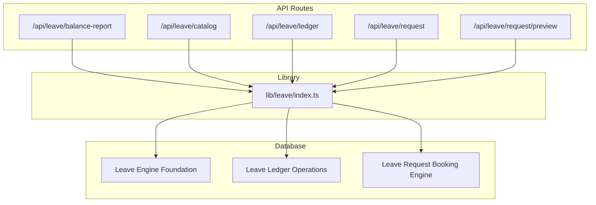
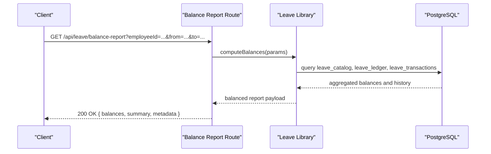
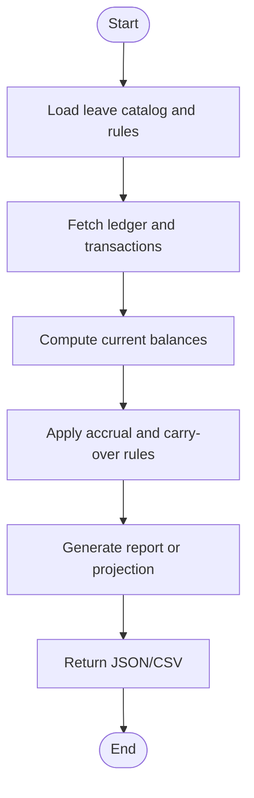
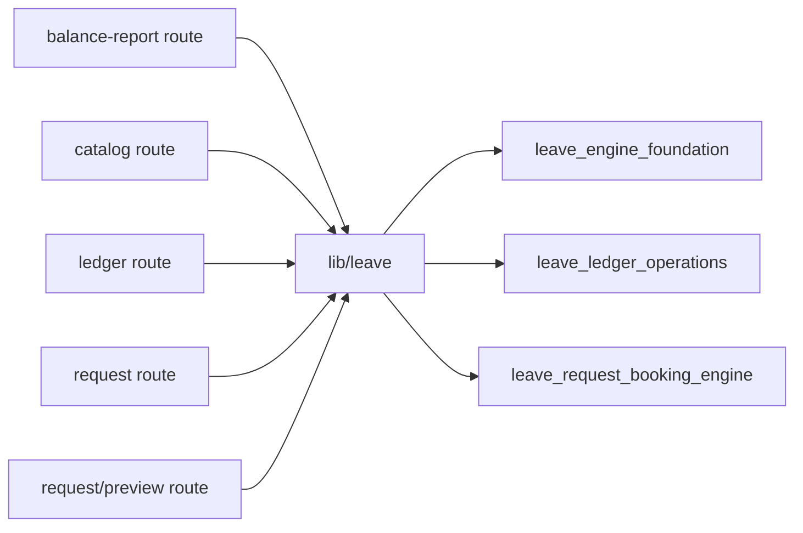

# Leave Balance APIs

<cite>
**Referenced Files in This Document**
- [apps/hr-suite/app/api/leave/balance-report/route.ts](file://apps/hr-suite/app/api/leave/balance-report/route.ts)
- [apps/hr-suite/app/api/leave/balance-report/route.test.ts](file://apps/hr-suite/app/api/leave/balance-report/route.test.ts)
- [apps/hr-suite/app/api/leave/catalog/route.ts](file://apps/hr-suite/app/api/leave/catalog/route.ts)
- [apps/hr-suite/app/api/leave/catalog/route.test.ts](file://apps/hr-suite/app/api/leave/catalog/route.test.ts)
- [apps/hr-suite/app/api/leave/ledger/route.ts](file://apps/hr-suite/app/api/leave/ledger/route.ts)
- [apps/hr-suite/app/api/leave/request/route.ts](file://apps/hr-suite/app/api/leave/request/route.ts)
- [apps/hr-suite/app/api/leave/request/preview/route.ts](file://apps/hr-suite/app/api/leave/request/preview/route.ts)
- [apps/hr-suite/lib/leave/index.ts](file://apps/hr-suite/lib/leave/index.ts)
- [apps/hr-suite/components/leave/leave-ledger-panel.tsx](file://apps/hr-suite/components/leave/leave-ledger-panel.tsx)
- [apps/hr-suite/components/leave/leave-catalog-page.tsx](file://apps/hr-suite/components/leave/leave-catalog-page.tsx)
- [apps/hr-suite/supabase/migrations/20260722142551_add_leave_engine_foundation.sql](file://apps/hr-suite/supabase/migrations/20260722142551_add_leave_engine_foundation.sql)
- [apps/hr-suite/supabase/migrations/20260722192000_add_leave_ledger_operations.sql](file://apps/hr-suite/supabase/migrations/20260722192000_add_leave_ledger_operations.sql)
- [apps/hr-suite/supabase/migrations/20260722190000_add_leave_request_booking_engine.sql](file://apps/hr-suite/supabase/migrations/20260722190000_add_leave_request_booking_engine.sql)
</cite>

## Table of Contents
1. [Introduction](#introduction)
2. [Project Structure](#project-structure)
3. [Core Components](#core-components)
4. [Architecture Overview](#architecture-overview)
5. [Detailed Component Analysis](#detailed-component-analysis)
6. [Dependency Analysis](#dependency-analysis)
7. [Performance Considerations](#performance-considerations)
8. [Troubleshooting Guide](#troubleshooting-guide)
9. [Conclusion](#conclusion)

## Introduction
This document provides comprehensive API documentation for LiquidHR’s leave balance calculation and reporting endpoints. It covers:
- Current leave balance calculation
- Historical usage reports
- Accrual projections
- Entitlement summaries
- Integration with leave transactions, accrual engines, and reporting systems
- Performance considerations for large datasets and caching strategies

The focus is on the Next.js App Router REST endpoints under /api/leave and their supporting libraries and database schema.

## Project Structure
Leave-related functionality is implemented as:
- API routes under apps/hr-suite/app/api/leave
- Library modules under apps/hr-suite/lib/leave
- UI components that consume these APIs
- Database migrations defining leave engine tables and operations

**Diagram sources**
- [apps/hr-suite/app/api/leave/balance-report/route.ts](file://apps/hr-suite/app/api/leave/balance-report/route.ts)
- [apps/hr-suite/app/api/leave/catalog/route.ts](file://apps/hr-suite/app/api/leave/catalog/route.ts)
- [apps/hr-suite/app/api/leave/ledger/route.ts](file://apps/hr-suite/app/api/leave/ledger/route.ts)
- [apps/hr-suite/app/api/leave/request/route.ts](file://apps/hr-suite/app/api/leave/request/route.ts)
- [apps/hr-suite/app/api/leave/request/preview/route.ts](file://apps/hr-suite/app/api/leave/request/preview/route.ts)
- [apps/hr-suite/lib/leave/index.ts](file://apps/hr-suite/lib/leave/index.ts)
- [apps/hr-suite/supabase/migrations/20260722142551_add_leave_engine_foundation.sql](file://apps/hr-suite/supabase/migrations/20260722142551_add_leave_engine_foundation.sql)
- [apps/hr-suite/supabase/migrations/20260722192000_add_leave_ledger_operations.sql](file://apps/hr-suite/supabase/migrations/20260722192000_add_leave_ledger_operations.sql)
- [apps/hr-suite/supabase/migrations/20260722190000_add_leave_request_booking_engine.sql](file://apps/hr-suite/supabase/migrations/20260722190000_add_leave_request_booking_engine.sql)

**Section sources**
- [apps/hr-suite/app/api/leave/balance-report/route.ts](file://apps/hr-suite/app/api/leave/balance-report/route.ts)
- [apps/hr-suite/app/api/leave/catalog/route.ts](file://apps/hr-suite/app/api/leave/catalog/route.ts)
- [apps/hr-suite/app/api/leave/ledger/route.ts](file://apps/hr-suite/app/api/leave/ledger/route.ts)
- [apps/hr-suite/app/api/leave/request/route.ts](file://apps/hr-suite/app/api/leave/request/route.ts)
- [apps/hr-suite/app/api/leave/request/preview/route.ts](file://apps/hr-suite/app/api/leave/request/preview/route.ts)
- [apps/hr-suite/lib/leave/index.ts](file://apps/hr-suite/lib/leave/index.ts)

## Core Components
- Balance Report endpoint: Computes current leave balances across types and periods, supports employee filters and date ranges.
- Catalog endpoint: Returns available leave types and entitlement rules used by calculations.
- Ledger endpoint: Provides historical transactional data for leave usage and adjustments.
- Request endpoints: Create and preview leave requests; preview uses balance and accrual logic to validate availability.
- Library module: Encapsulates business logic for accruals, balances, projections, and report formatting.

Key responsibilities:
- Input validation and parameter normalization (dates, employee IDs, type filters)
- Querying leave ledger and configuration tables
- Aggregating balances and generating reports
- Returning consistent JSON schemas for clients

**Section sources**
- [apps/hr-suite/app/api/leave/balance-report/route.ts](file://apps/hr-suite/app/api/leave/balance-report/route.ts)
- [apps/hr-suite/app/api/leave/catalog/route.ts](file://apps/hr-suite/app/api/leave/catalog/route.ts)
- [apps/hr-suite/app/api/leave/ledger/route.ts](file://apps/hr-suite/app/api/leave/ledger/route.ts)
- [apps/hr-suite/app/api/leave/request/route.ts](file://apps/hr-suite/app/api/leave/request/route.ts)
- [apps/hr-suite/app/api/leave/request/preview/route.ts](file://apps/hr-suite/app/api/leave/request/preview/route.ts)
- [apps/hr-suite/lib/leave/index.ts](file://apps/hr-suite/lib/leave/index.ts)

## Architecture Overview
The leave balance system follows a layered architecture:
- API layer: Next.js route handlers expose REST endpoints
- Service layer: lib/leave encapsulates business logic
- Data layer: Supabase Postgres stores leave configurations, transactions, and ledger entries

**Diagram sources**
- [apps/hr-suite/app/api/leave/balance-report/route.ts](file://apps/hr-suite/app/api/leave/balance-report/route.ts)
- [apps/hr-suite/lib/leave/index.ts](file://apps/hr-suite/lib/leave/index.ts)
- [apps/hr-suite/supabase/migrations/20260722142551_add_leave_engine_foundation.sql](file://apps/hr-suite/supabase/migrations/20260722142551_add_leave_engine_foundation.sql)
- [apps/hr-suite/supabase/migrations/20260722192000_add_leave_ledger_operations.sql](file://apps/hr-suite/supabase/migrations/20260722192000_add_leave_ledger_operations.sql)

## Detailed Component Analysis

### Balance Report Endpoint
Purpose:
- Calculate current leave balances per employee and leave type
- Support date range filtering and employee filters
- Return structured report including totals, breakdowns, and metadata

HTTP Method:
- GET

URL Pattern:
- /api/leave/balance-report

Query Parameters:
- employeeId: string (optional) – filter by specific employee
- departmentId: string (optional) – filter by department
- leaveTypeId: string (optional) – filter by leave type
- from: string (YYYY-MM-DD) – start of period
- to: string (YYYY-MM-DD) – end of period
- includeHistory: boolean (optional) – include historical usage within range
- format: string (json|csv) (optional) – response format

Response Schema:
- balances: array of objects with fields like employeeId, leaveTypeId, accrued, used, carriedOver, remaining, effectiveDate
- summary: object with totals across filtered set
- metadata: object with request parameters, generatedAt, timezone

Error Responses:
- 400 Bad Request for invalid parameters or date ranges
- 401 Unauthorized if authentication fails
- 500 Internal Server Error for unexpected failures

Practical Examples:
- Generate balance report for an employee over a year
- Export CSV for multiple employees and departments
- Include historical usage for audit purposes

Integration Points:
- Uses leave catalog to resolve entitlement rules
- Reads from leave ledger and transactions for usage and accruals
- Supports projection via library functions for future accruals

**Section sources**
- [apps/hr-suite/app/api/leave/balance-report/route.ts](file://apps/hr-suite/app/api/leave/balance-report/route.ts)
- [apps/hr-suite/app/api/leave/balance-report/route.test.ts](file://apps/hr-suite/app/api/leave/balance-report/route.test.ts)
- [apps/hr-suite/lib/leave/index.ts](file://apps/hr-suite/lib/leave/index.ts)

### Catalog Endpoint
Purpose:
- Retrieve leave types and associated entitlement rules
- Provide configuration needed for balance calculations and projections

HTTP Method:
- GET

URL Pattern:
- /api/leave/catalog

Query Parameters:
- tenantId: string (optional) – scope by tenant
- activeOnly: boolean (optional) – return only active leave types

Response Schema:
- leaveTypes: array of objects with id, name, code, accrualRule, carryOverPolicy, maxAccrual, currency, isActive
- policies: object with global settings affecting accruals and balances

Use Cases:
- Populate dropdowns in UI
- Validate leaveTypeId in other endpoints
- Drive accrual engine configuration

**Section sources**
- [apps/hr-suite/app/api/leave/catalog/route.ts](file://apps/hr-suite/app/api/leave/catalog/route.ts)
- [apps/hr-suite/app/api/leave/catalog/route.test.ts](file://apps/hr-suite/app/api/leave/catalog/route.test.ts)
- [apps/hr-suite/components/leave/leave-catalog-page.tsx](file://apps/hr-suite/components/leave/leave-catalog-page.tsx)

### Ledger Endpoint
Purpose:
- Provide historical leave transactions and ledger entries
- Support date range queries and employee filters
- Enable exportable reports for auditing and compliance

HTTP Method:
- GET

URL Pattern:
- /api/leave/ledger

Query Parameters:
- employeeId: string (optional)
- leaveTypeId: string (optional)
- from: string (YYYY-MM-DD)
- to: string (YYYY-MM-DD)
- includeAdjustments: boolean (optional)
- format: string (json|csv) (optional)

Response Schema:
- entries: array of ledger items with fields like date, employeeId, leaveTypeId, type (accrual, usage, adjustment), amount, runningBalance, referenceId
- totals: aggregated sums by type and period
- pagination: optional page, limit, totalCount

Use Cases:
- Generate historical usage reports
- Reconcile balances against ledger
- Export data for external reporting systems

**Section sources**
- [apps/hr-suite/app/api/leave/ledger/route.ts](file://apps/hr-suite/app/api/leave/ledger/route.ts)
- [apps/hr-suite/components/leave/leave-ledger-panel.tsx](file://apps/hr-suite/components/leave/leave-ledger-panel.tsx)
- [apps/hr-suite/supabase/migrations/20260722192000_add_leave_ledger_operations.sql](file://apps/hr-suite/supabase/migrations/20260722192000_add_leave_ledger_operations.sql)

### Request Endpoints
Purpose:
- Create new leave requests
- Preview leave requests to validate availability and calculate impact

HTTP Methods:
- POST /api/leave/request
- GET /api/leave/request/preview

URL Patterns:
- /api/leave/request
- /api/leave/request/preview

Request Schemas:
- create: { employeeId, leaveTypeId, startDate, endDate, reason?, notes? }
- preview: { employeeId, leaveTypeId, startDate, endDate, reason?, notes? }

Response Schemas:
- create: { requestId, status, message, balanceImpact }
- preview: { estimatedDays, availableBalance, projectedRemaining, warnings[], errors[] }

Validation and Business Rules:
- Checks against catalog rules and current balances
- Applies accrual engine logic for projected usage
- Returns warnings for partial days or policy violations

**Section sources**
- [apps/hr-suite/app/api/leave/request/route.ts](file://apps/hr-suite/app/api/leave/request/route.ts)
- [apps/hr-suite/app/api/leave/request/preview/route.ts](file://apps/hr-suite/app/api/leave/request/preview/route.ts)
- [apps/hr-suite/supabase/migrations/20260722190000_add_leave_request_booking_engine.sql](file://apps/hr-suite/supabase/migrations/20260722190000_add_leave_request_booking_engine.sql)

### Conceptual Overview
The leave balance system integrates three core areas:
- Configuration: leave types and accrual rules
- Transactions: bookings, adjustments, and ledger entries
- Reporting: balances, histories, and projections

[No sources needed since this diagram shows conceptual workflow, not actual code structure]

## Dependency Analysis
The leave balance APIs depend on:
- Catalog configuration for entitlement rules
- Ledger and transaction tables for historical data
- Accrual engine logic for projections and carry-over calculations

**Diagram sources**
- [apps/hr-suite/app/api/leave/balance-report/route.ts](file://apps/hr-suite/app/api/leave/balance-report/route.ts)
- [apps/hr-suite/app/api/leave/catalog/route.ts](file://apps/hr-suite/app/api/leave/catalog/route.ts)
- [apps/hr-suite/app/api/leave/ledger/route.ts](file://apps/hr-suite/app/api/leave/ledger/route.ts)
- [apps/hr-suite/app/api/leave/request/route.ts](file://apps/hr-suite/app/api/leave/request/route.ts)
- [apps/hr-suite/app/api/leave/request/preview/route.ts](file://apps/hr-suite/app/api/leave/request/preview/route.ts)
- [apps/hr-suite/lib/leave/index.ts](file://apps/hr-suite/lib/leave/index.ts)
- [apps/hr-suite/supabase/migrations/20260722142551_add_leave_engine_foundation.sql](file://apps/hr-suite/supabase/migrations/20260722142551_add_leave_engine_foundation.sql)
- [apps/hr-suite/supabase/migrations/20260722192000_add_leave_ledger_operations.sql](file://apps/hr-suite/supabase/migrations/20260722192000_add_leave_ledger_operations.sql)
- [apps/hr-suite/supabase/migrations/20260722190000_add_leave_request_booking_engine.sql](file://apps/hr-suite/supabase/migrations/20260722190000_add_leave_request_booking_engine.sql)

**Section sources**
- [apps/hr-suite/lib/leave/index.ts](file://apps/hr-suite/lib/leave/index.ts)
- [apps/hr-suite/supabase/migrations/20260722142551_add_leave_engine_foundation.sql](file://apps/hr-suite/supabase/migrations/20260722142551_add_leave_engine_foundation.sql)
- [apps/hr-suite/supabase/migrations/20260722192000_add_leave_ledger_operations.sql](file://apps/hr-suite/supabase/migrations/20260722192000_add_leave_ledger_operations.sql)
- [apps/hr-suite/supabase/migrations/20260722190000_add_leave_request_booking_engine.sql](file://apps/hr-suite/supabase/migrations/20260722190000_add_leave_request_booking_engine.sql)

## Performance Considerations
- Pagination: Use page and limit parameters for ledger queries to avoid large payloads
- Indexing: Ensure indexes on employeeId, leaveTypeId, and date columns for faster filtering
- Caching: Cache catalog responses and frequently accessed balances for short TTLs
- Batch Processing: For bulk reports, consider server-side aggregation and streaming CSV output
- Query Optimization: Avoid full table scans by narrowing date ranges and employee scopes
- Concurrency: Limit concurrent heavy computations and implement rate limiting where appropriate

[No sources needed since this section provides general guidance]

## Troubleshooting Guide
Common issues and resolutions:
- Invalid date ranges: Ensure from <= to and within supported fiscal years
- Missing employee or leave type: Validate IDs against catalog and active records
- Authentication failures: Confirm user session and permissions for requested scope
- Large dataset timeouts: Reduce date ranges, enable pagination, and optimize queries
- Inconsistent balances: Reconcile ledger entries and verify accrual rule application

Debugging steps:
- Inspect request parameters and response metadata
- Check ledger entries for anomalies around reported dates
- Validate catalog rules and policy settings
- Review error logs for stack traces and SQL errors

**Section sources**
- [apps/hr-suite/app/api/leave/balance-report/route.test.ts](file://apps/hr-suite/app/api/leave/balance-report/route.test.ts)
- [apps/hr-suite/app/api/leave/catalog/route.test.ts](file://apps/hr-suite/app/api/leave/catalog/route.test.ts)

## Conclusion
LiquidHR’s leave balance APIs provide robust capabilities for calculating balances, generating historical reports, projecting accruals, and exporting data. By leveraging well-defined endpoints, clear schemas, and efficient database operations, the system supports both real-time UI interactions and batch reporting needs. Adhering to performance best practices and troubleshooting guidelines ensures reliable operation at scale.

[No sources needed since this section summarizes without analyzing specific files]