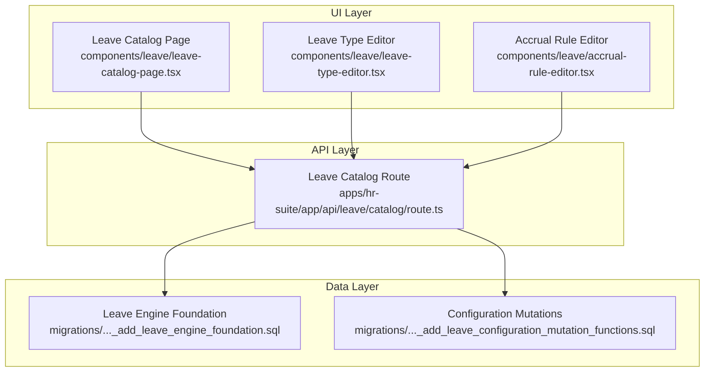
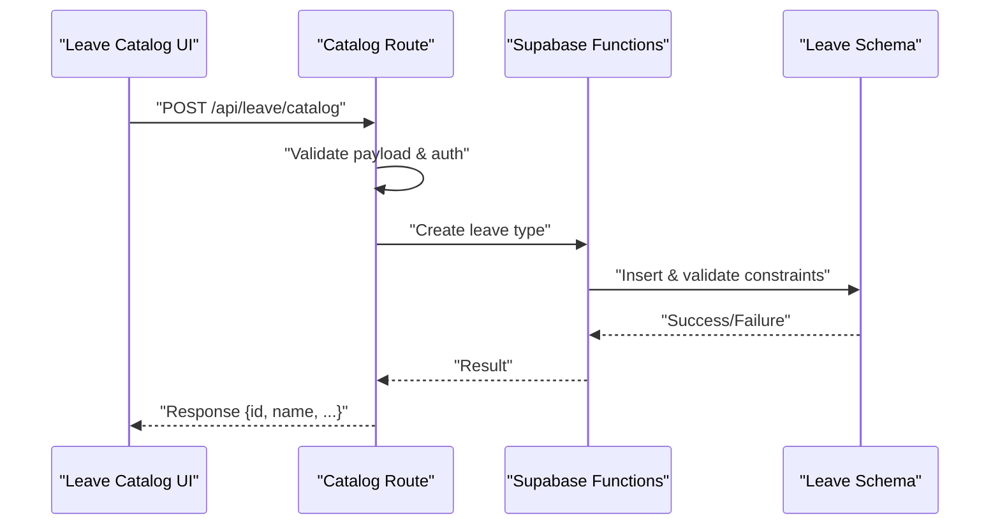
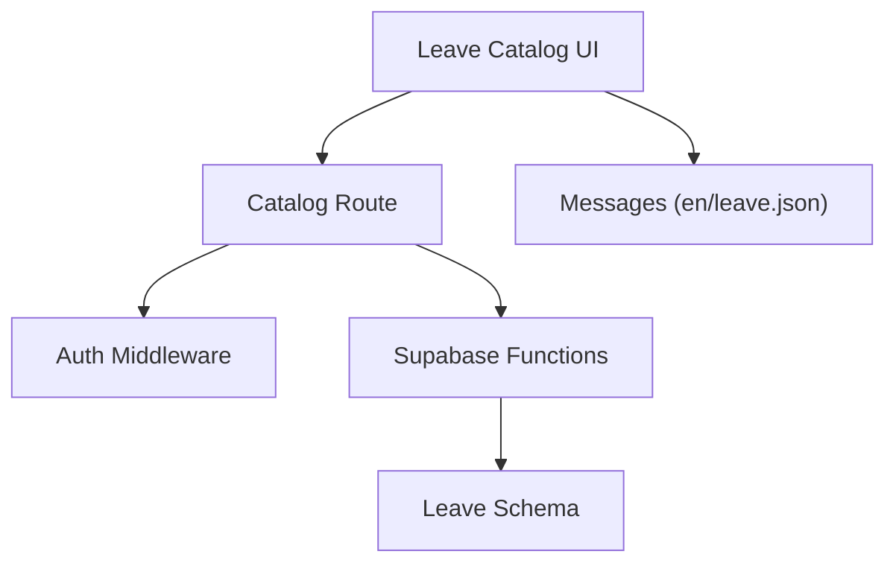

# Leave Catalog APIs

<cite>
**Referenced Files in This Document**
- [apps/hr-suite/app/api/leave/catalog/route.ts](file://apps/hr-suite/app/api/leave/catalog/route.ts)
- [apps/hr-suite/app/api/leave/catalog/route.test.ts](file://apps/hr-suite/app/api/leave/catalog/route.test.ts)
- [apps/hr-suite/components/leave/leave-catalog-page.tsx](file://apps/hr-suite/components/leave/leave-catalog-page.tsx)
- [apps/hr-suite/components/leave/leave-type-editor.tsx](file://apps/hr-suite/components/leave/leave-type-editor.tsx)
- [apps/hr-suite/components/leave/accrual-rule-editor.tsx](file://apps/hr-suite/components/leave/accrual-rule-editor.tsx)
- [apps/hr-suite/lib/leave/index.ts](file://apps/hr-suite/lib/leave/index.ts)
- [apps/hr-suite/supabase/migrations/20260722142551_add_leave_engine_foundation.sql](file://apps/hr-suite/supabase/migrations/20260722142551_add_leave_engine_foundation.sql)
- [apps/hr-suite/supabase/migrations/20260722151920_add_leave_configuration_mutation_functions.sql](file://apps/hr-suite/supabase/migrations/20260722151920_add_leave_configuration_mutation_functions.sql)
- [apps/hr-suite/messages/en/leave.json](file://apps/hr-suite/messages/en/leave.json)
</cite>

## Table of Contents
1. [Introduction](#introduction)
2. [Project Structure](#project-structure)
3. [Core Components](#core-components)
4. [Architecture Overview](#architecture-overview)
5. [Detailed Component Analysis](#detailed-component-analysis)
6. [Dependency Analysis](#dependency-analysis)
7. [Performance Considerations](#performance-considerations)
8. [Troubleshooting Guide](#troubleshooting-guide)
9. [Conclusion](#conclusion)
10. [Appendices](#appendices)

## Introduction
This document provides detailed API documentation for LiquidHR’s leave catalog management endpoints. It covers creating, updating, and managing leave types (e.g., vacation, sick leave, parental leave, and custom categories), accrual rule configuration, policy definitions, eligibility criteria, and leave type inheritance. It also documents HTTP methods, URL patterns, request/response schemas with validation rules, authentication and authorization requirements, and practical examples for setting up new leave types, configuring accrual policies, defining carry-over rules, and managing leave type hierarchies. Integration points with master data, organization settings, and employee entitlement calculations are included to help you implement end-to-end leave workflows.

## Project Structure
The leave catalog feature is implemented as a Next.js App Router API route under the leave module, with UI components for editing leave types and accrual rules. The database schema and mutation functions are defined in Supabase migrations.

**Diagram sources**
- [apps/hr-suite/app/api/leave/catalog/route.ts](file://apps/hr-suite/app/api/leave/catalog/route.ts)
- [apps/hr-suite/components/leave/leave-catalog-page.tsx](file://apps/hr-suite/components/leave/leave-catalog-page.tsx)
- [apps/hr-suite/components/leave/leave-type-editor.tsx](file://apps/hr-suite/components/leave/leave-type-editor.tsx)
- [apps/hr-suite/components/leave/accrual-rule-editor.tsx](file://apps/hr-suite/components/leave/accrual-rule-editor.tsx)
- [apps/hr-suite/supabase/migrations/20260722142551_add_leave_engine_foundation.sql](file://apps/hr-suite/supabase/migrations/20260722142551_add_leave_engine_foundation.sql)
- [apps/hr-suite/supabase/migrations/20260722151920_add_leave_configuration_mutation_functions.sql](file://apps/hr-suite/supabase/migrations/20260722151920_add_leave_configuration_mutation_functions.sql)

**Section sources**
- [apps/hr-suite/app/api/leave/catalog/route.ts](file://apps/hr-suite/app/api/leave/catalog/route.ts)
- [apps/hr-suite/components/leave/leave-catalog-page.tsx](file://apps/hr-suite/components/leave/leave-catalog-page.tsx)
- [apps/hr-suite/components/leave/leave-type-editor.tsx](file://apps/hr-suite/components/leave/leave-type-editor.tsx)
- [apps/hr-suite/components/leave/accrual-rule-editor.tsx](file://apps/hr-suite/components/leave/accrual-rule-editor.tsx)
- [apps/hr-suite/supabase/migrations/20260722142551_add_leave_engine_foundation.sql](file://apps/hr-suite/supabase/migrations/20260722142551_add_leave_engine_foundation.sql)
- [apps/hr-suite/supabase/migrations/20260722151920_add_leave_configuration_mutation_functions.sql](file://apps/hr-suite/supabase/migrations/20260722151920_add_leave_configuration_mutation_functions.sql)

## Core Components
- Leave Catalog API Route: Central endpoint for CRUD operations on leave types and related configurations.
- Leave Catalog UI: Admin pages and editors for managing leave types, accrual rules, and policies.
- Database Schema and Mutations: Defines leave catalog entities, relationships, and server-side mutations.

Key responsibilities:
- Validate and enforce tenant isolation and RBAC permissions.
- Provide consistent request/response schemas for leave catalog operations.
- Integrate with master data (e.g., job groups, departments) and organization settings (e.g., holidays, modules).
- Support leave type inheritance and priority-based accrual rules.

**Section sources**
- [apps/hr-suite/app/api/leave/catalog/route.ts](file://apps/hr-suite/app/api/leave/catalog/route.ts)
- [apps/hr-suite/components/leave/leave-catalog-page.tsx](file://apps/hr-suite/components/leave/leave-catalog-page.tsx)
- [apps/hr-suite/components/leave/leave-type-editor.tsx](file://apps/hr-suite/components/leave/leave-type-editor.tsx)
- [apps/hr-suite/components/leave/accrual-rule-editor.tsx](file://apps/hr-suite/components/leave/accrual-rule-editor.tsx)
- [apps/hr-suite/supabase/migrations/20260722142551_add_leave_engine_foundation.sql](file://apps/hr-suite/supabase/migrations/20260722142551_add_leave_engine_foundation.sql)
- [apps/hr-suite/supabase/migrations/20260722151920_add_leave_configuration_mutation_functions.sql](file://apps/hr-suite/supabase/migrations/20260722151920_add_leave_configuration_mutation_functions.sql)

## Architecture Overview
The leave catalog API follows a layered architecture:
- Client/UI calls the API route.
- The route validates input, enforces authorization, and delegates to database functions.
- Database functions perform schema-level validations and maintain consistency across leave catalog entities.

**Diagram sources**
- [apps/hr-suite/app/api/leave/catalog/route.ts](file://apps/hr-suite/app/api/leave/catalog/route.ts)
- [apps/hr-suite/supabase/migrations/20260722142551_add_leave_engine_foundation.sql](file://apps/hr-suite/supabase/migrations/20260722142551_add_leave_engine_foundation.sql)
- [apps/hr-suite/supabase/migrations/20260722151920_add_leave_configuration_mutation_functions.sql](file://apps/hr-suite/supabase/migrations/20260722151920_add_leave_configuration_mutation_functions.sql)

## Detailed Component Analysis

### Leave Catalog API Endpoints
Base path: /api/leave/catalog

Common behavior:
- Authentication: Requires an authenticated session; user identity is resolved from the request context.
- Authorization: Enforces RBAC roles scoped to the tenant/administration context. Only authorized administrators can create/update leave catalog entries.
- Validation: Input payloads are validated against expected schemas; errors return structured messages.
- Tenant Isolation: All operations are scoped to the current tenant; cross-tenant access is denied.

Endpoints:
- Create leave type
  - Method: POST
  - Path: /api/leave/catalog
  - Request body fields:
    - name: string, required, unique per tenant
    - code: string, optional, unique per tenant if provided
    - category: enum, e.g., "vacation", "sick_leave", "parental_leave", "custom"
    - color: string, optional, hex color code
    - description: string, optional
    - inheritance_parent_id: uuid, optional, references another leave type within the same tenant
    - accrual_rule_id: uuid, optional, links to an accrual rule
    - policy_id: uuid, optional, links to a policy definition
    - eligibility_criteria: object, optional, defines who is eligible (e.g., employment status, department, job group)
    - carry_over_rules: object, optional, defines carry-over limits and expiration behavior
    - active: boolean, default true
  - Response:
    - 201 Created: { id, name, code, category, color, description, inheritance_parent_id, accrual_rule_id, policy_id, eligibility_criteria, carry_over_rules, active }
    - 400 Bad Request: validation error details
    - 401 Unauthorized: missing or invalid session
    - 403 Forbidden: insufficient permissions
    - 409 Conflict: duplicate code/name within tenant

- Update leave type
  - Method: PATCH
  - Path: /api/leave/catalog/{leaveTypeId}
  - Request body fields: subset of create fields; only provided fields are updated
  - Response:
    - 200 OK: updated leave type object
    - 404 Not Found: leave type not found
    - 400 Bad Request: validation error details
    - 401 Unauthorized: missing or invalid session
    - 403 Forbidden: insufficient permissions

- Delete leave type
  - Method: DELETE
  - Path: /api/leave/catalog/{leaveTypeId}
  - Response:
    - 204 No Content: deletion successful
    - 404 Not Found: leave type not found
    - 401 Unauthorized: missing or invalid session
    - 403 Forbidden: insufficient permissions

- List leave types
  - Method: GET
  - Path: /api/leave/catalog
  - Query parameters:
    - category: optional filter by category
    - active: optional filter by active status
  - Response:
    - 200 OK: array of leave type objects

- Get leave type by ID
  - Method: GET
  - Path: /api/leave/catalog/{leaveTypeId}
  - Response:
    - 200 OK: leave type object
    - 404 Not Found: leave type not found
    - 401 Unauthorized: missing or invalid session
    - 403 Forbidden: insufficient permissions

Notes:
- Inheritance: If inheritance_parent_id is set, the leave type inherits default behaviors from the parent unless overridden.
- Accrual rules: accrual_rule_id links to configured accrual policies; changes propagate to entitlement calculations.
- Policy definitions: policy_id links to policy rules that govern usage, approvals, and reporting.
- Eligibility criteria: eligibility_criteria determines which employees qualify based on attributes like employment status, department, job group, or custom fields.
- Carry-over rules: carry_over_rules define maximum carry-over amounts, expiration dates, and proration logic.

Practical examples:
- Setting up a new leave type:
  - POST /api/leave/catalog with category "custom", name "Sabbatical", code "SABBATICAL", active true, and empty inheritance_parent_id.
- Configuring accrual policies:
  - Create an accrual rule via the accrual rule editor; link it to a leave type using accrual_rule_id.
- Defining carry-over rules:
  - Set carry_over_rules.max_carryover_days, carry_over_rules.expiration_month, and carry_over_rules.prorate_on_start_date.
- Managing leave type hierarchies:
  - Set inheritance_parent_id to a base leave type (e.g., "Vacation") to inherit defaults while overriding specific fields.

**Section sources**
- [apps/hr-suite/app/api/leave/catalog/route.ts](file://apps/hr-suite/app/api/leave/catalog/route.ts)
- [apps/hr-suite/app/api/leave/catalog/route.test.ts](file://apps/hr-suite/app/api/leave/catalog/route.test.ts)
- [apps/hr-suite/supabase/migrations/20260722142551_add_leave_engine_foundation.sql](file://apps/hr-suite/supabase/migrations/20260722142551_add_leave_engine_foundation.sql)
- [apps/hr-suite/supabase/migrations/20260722151920_add_leave_configuration_mutation_functions.sql](file://apps/hr-suite/supabase/migrations/20260722151920_add_leave_configuration_mutation_functions.sql)

### Leave Type Editor Component
Responsibilities:
- Provides a form interface for creating and editing leave types.
- Validates inputs client-side before sending requests to the API.
- Displays inherited properties and allows overrides.
- Integrates with accrual rule and policy selectors.

User interactions:
- Selecting a category updates available options and defaults.
- Choosing an inheritance parent pre-populates fields; edits override inherited values.
- Saving triggers POST/PATCH to the catalog API with validated payloads.

Validation highlights:
- Required fields enforced before submission.
- Unique code checks against existing leave types within the tenant.
- Color format validation (hex codes).

**Section sources**
- [apps/hr-suite/components/leave/leave-type-editor.tsx](file://apps/hr-suite/components/leave/leave-type-editor.tsx)
- [apps/hr-suite/app/api/leave/catalog/route.ts](file://apps/hr-suite/app/api/leave/catalog/route.ts)

### Accrual Rule Editor Component
Responsibilities:
- Allows creation and editing of accrual rules linked to leave types.
- Supports configuration of accrual frequency, rates, caps, and proration.
- Integrates with work hours and calendar settings for accurate accrual calculations.

Configuration options:
- Accrual frequency: monthly, yearly, per pay period.
- Accrual rate: fixed amount or percentage-based.
- Caps: annual maximum accrual.
- Proration: pro-rate based on start date or employment duration.

Integration points:
- Links to leave types via accrual_rule_id.
- Uses organization settings such as holidays and work patterns to compute accruals.

**Section sources**
- [apps/hr-suite/components/leave/accrual-rule-editor.tsx](file://apps/hr-suite/components/leave/accrual-rule-editor.tsx)
- [apps/hr-suite/supabase/migrations/20260722151920_add_leave_configuration_mutation_functions.sql](file://apps/hr-suite/supabase/migrations/20260722151920_add_leave_configuration_mutation_functions.sql)

### Leave Catalog Page
Responsibilities:
- Lists all leave types with filters and search.
- Provides navigation to create/edit forms.
- Displays inheritance relationships and active status.

Features:
- Filtering by category and active status.
- Bulk actions for activation/deactivation.
- Quick view of inheritance chains.

**Section sources**
- [apps/hr-suite/components/leave/leave-catalog-page.tsx](file://apps/hr-suite/components/leave/leave-catalog-page.tsx)
- [apps/hr-suite/app/api/leave/catalog/route.ts](file://apps/hr-suite/app/api/leave/catalog/route.ts)

## Dependency Analysis
The leave catalog system depends on:
- Authentication and authorization middleware to ensure secure access.
- Database schema and functions for persistence and business rules.
- UI components for user interactions and validation.

**Diagram sources**
- [apps/hr-suite/app/api/leave/catalog/route.ts](file://apps/hr-suite/app/api/leave/catalog/route.ts)
- [apps/hr-suite/supabase/migrations/20260722142551_add_leave_engine_foundation.sql](file://apps/hr-suite/supabase/migrations/20260722142551_add_leave_engine_foundation.sql)
- [apps/hr-suite/supabase/migrations/20260722151920_add_leave_configuration_mutation_functions.sql](file://apps/hr-suite/supabase/migrations/20260722151920_add_leave_configuration_mutation_functions.sql)
- [apps/hr-suite/messages/en/leave.json](file://apps/hr-suite/messages/en/leave.json)

**Section sources**
- [apps/hr-suite/app/api/leave/catalog/route.ts](file://apps/hr-suite/app/api/leave/catalog/route.ts)
- [apps/hr-suite/supabase/migrations/20260722142551_add_leave_engine_foundation.sql](file://apps/hr-suite/supabase/migrations/20260722142551_add_leave_engine_foundation.sql)
- [apps/hr-suite/supabase/migrations/20260722151920_add_leave_configuration_mutation_functions.sql](file://apps/hr-suite/supabase/migrations/20260722151920_add_leave_configuration_mutation_functions.sql)
- [apps/hr-suite/messages/en/leave.json](file://apps/hr-suite/messages/en/leave.json)

## Performance Considerations
- Indexes: Ensure foreign keys and frequently filtered columns (category, active) are indexed for fast queries.
- Caching: Cache read-heavy endpoints like list leave types with appropriate TTLs.
- Payload size: Keep request payloads minimal; use PATCH for partial updates.
- Database functions: Prefer server-side mutations to reduce client-side complexity and improve consistency.

[No sources needed since this section provides general guidance]

## Troubleshooting Guide
Common issues and resolutions:
- 401 Unauthorized: Verify session token and authentication headers.
- 403 Forbidden: Check RBAC roles and tenant scope; ensure the user has admin privileges for leave catalog management.
- 400 Bad Request: Inspect payload validation errors; ensure required fields are present and correctly formatted.
- 404 Not Found: Confirm the leave type ID exists within the tenant context.
- 409 Conflict: Resolve duplicate code/name conflicts by adjusting identifiers.

Debugging tips:
- Use the test file to validate expected behaviors and responses.
- Review database migration logs for constraint violations.
- Enable logging in the API route to trace request flows.

**Section sources**
- [apps/hr-suite/app/api/leave/catalog/route.test.ts](file://apps/hr-suite/app/api/leave/catalog/route.test.ts)
- [apps/hr-suite/supabase/migrations/20260722142551_add_leave_engine_foundation.sql](file://apps/hr-suite/supabase/migrations/20260722142551_add_leave_engine_foundation.sql)

## Conclusion
LiquidHR’s leave catalog APIs provide a robust foundation for managing leave types, accrual rules, policies, and eligibility criteria. With clear authentication and authorization controls, consistent schemas, and integration points for master data and organization settings, the system supports flexible leave management across diverse organizational needs. By following the documented endpoints and best practices, developers can implement comprehensive leave workflows that align with company policies and legal requirements.

[No sources needed since this section summarizes without analyzing specific files]

## Appendices

### Practical Setup Examples
- Creating a new leave type:
  - POST /api/leave/catalog with category "vacation", name "Annual Vacation", code "ANNUAL_VACATION", active true.
- Linking accrual rules:
  - Create an accrual rule via the accrual rule editor; update the leave type with accrual_rule_id.
- Defining carry-over rules:
  - Set carry_over_rules.max_carryover_days to limit unused days carried into the next year.
- Managing inheritance:
  - Set inheritance_parent_id to a base leave type to inherit default behaviors while customizing specifics.

### Integration Points
- Master data:
  - Job groups and departments influence eligibility criteria.
- Organization settings:
  - Holidays and work patterns affect accrual calculations and leave balances.
- Employee entitlements:
  - Accrual rules and policies drive entitlement calculations for each employee.

**Section sources**
- [apps/hr-suite/components/leave/accrual-rule-editor.tsx](file://apps/hr-suite/components/leave/accrual-rule-editor.tsx)
- [apps/hr-suite/supabase/migrations/20260722151920_add_leave_configuration_mutation_functions.sql](file://apps/hr-suite/supabase/migrations/20260722151920_add_leave_configuration_mutation_functions.sql)
- [apps/hr-suite/messages/en/leave.json](file://apps/hr-suite/messages/en/leave.json)