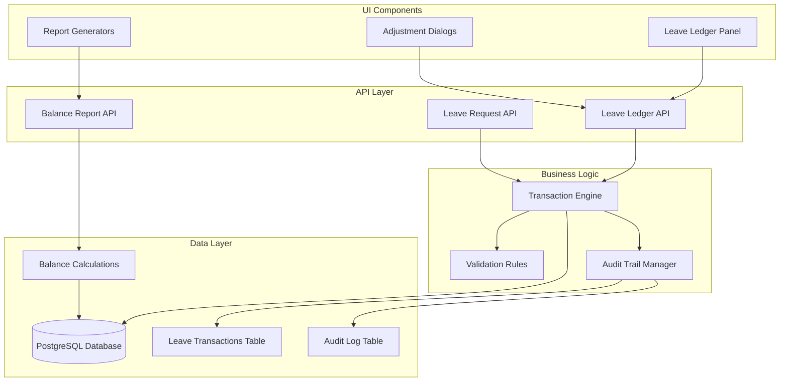
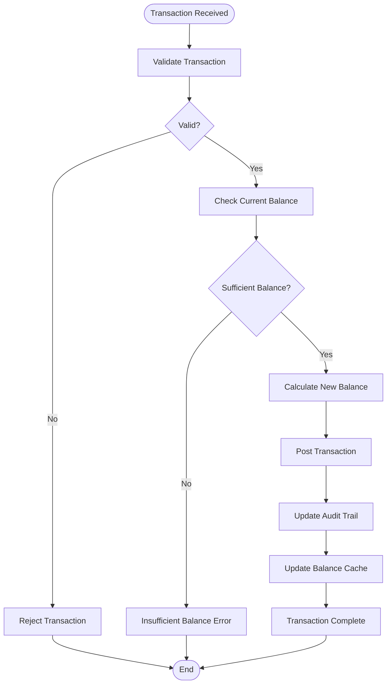
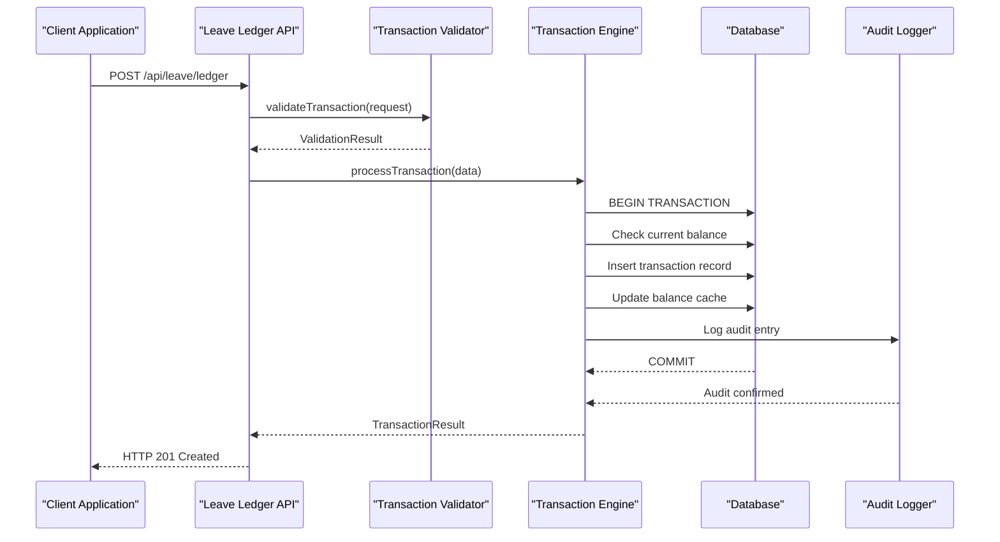
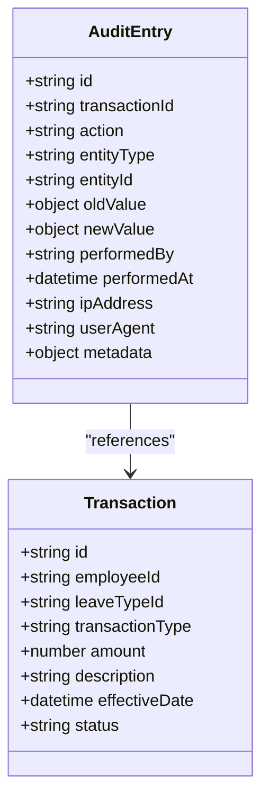
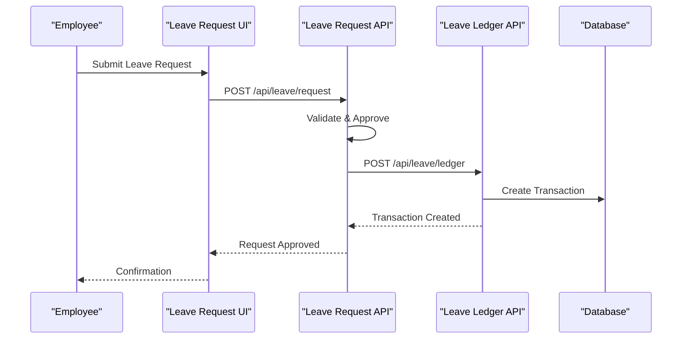
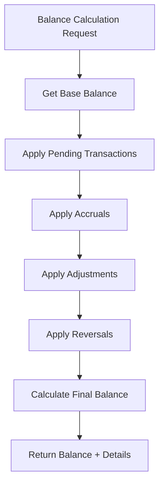
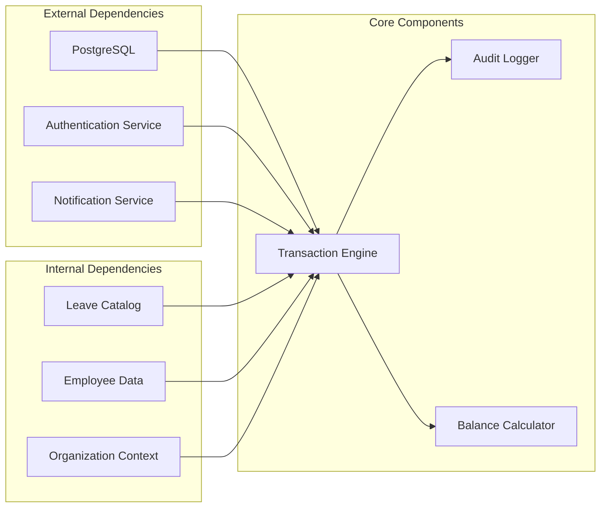

# Leave Ledger APIs

<cite>
**Referenced Files in This Document**
- [apps/hr-suite/app/api/leave/ledger/route.ts](file://apps/hr-suite/app/api/leave/ledger/route.ts)
- [apps/hr-suite/app/api/leave/balance-report/route.ts](file://apps/hr-suite/app/api/leave/balance-report/route.ts)
- [apps/hr-suite/app/api/leave/request/route.ts](file://apps/hr-suite/app/api/leave/request/route.ts)
- [apps/hr-suite/supabase/migrations/20260722192000_add_leave_ledger_operations.sql](file://apps/hr-suite/supabase/migrations/20260722192000_add_leave_ledger_operations.sql)
- [apps/hr-suite/supabase/migrations/20260722142551_add_leave_engine_foundation.sql](file://apps/hr-suite/supabase/migrations/20260722142551_add_leave_engine_foundation.sql)
- [apps/hr-suite/components/leave/leave-ledger-panel.tsx](file://apps/hr-suite/components/leave/leave-ledger-panel.tsx)
</cite>

## Table of Contents
1. [Introduction](#introduction)
2. [Project Structure](#project-structure)
3. [Core Components](#core-components)
4. [Architecture Overview](#architecture-overview)
5. [Detailed Component Analysis](#detailed-component-analysis)
6. [Dependency Analysis](#dependency-analysis)
7. [Performance Considerations](#performance-considerations)
8. [Troubleshooting Guide](#troubleshooting-guide)
9. [Conclusion](#conclusion)

## Introduction

The LiquidHR Leave Ledger system provides a comprehensive API for managing employee leave transactions, adjustments, reversals, and audit trails. This documentation covers the complete leave transaction lifecycle, from initial booking through adjustments and reversals, ensuring financial-grade accuracy and compliance reporting capabilities.

The leave ledger serves as the single source of truth for all leave-related financial transactions, maintaining immutable records while supporting necessary corrections through proper adjustment mechanisms. The system enforces strict validation rules, maintains detailed audit trails, and provides robust reporting capabilities for compliance and financial reconciliation.

## Project Structure

The leave ledger functionality is implemented across multiple layers of the application architecture:



**Diagram sources**
- [apps/hr-suite/app/api/leave/ledger/route.ts](file://apps/hr-suite/app/api/leave/ledger/route.ts)
- [apps/hr-suite/app/api/leave/balance-report/route.ts](file://apps/hr-suite/app/api/leave/balance-report/route.ts)
- [apps/hr-suite/app/api/leave/request/route.ts](file://apps/hr-suite/app/api/leave/request/route.ts)

**Section sources**
- [apps/hr-suite/app/api/leave/ledger/route.ts](file://apps/hr-suite/app/api/leave/ledger/route.ts)
- [apps/hr-suite/app/api/leave/balance-report/route.ts](file://apps/hr-suite/app/api/leave/balance-report/route.ts)

## Core Components

### Leave Transaction Types

The system supports several core transaction types that maintain the integrity of leave balances:

| Transaction Type | Description | Direction | Reversible | Audit Required |
|------------------|-------------|-----------|------------|----------------|
| `LEAVE_BOOKING` | Standard leave request approval | Debit (negative) | Yes | Yes |
| `LEAVE_ADJUSTMENT` | Manual balance correction | Positive/Negative | No | Yes |
| `LEAVE_REVERSAL` | Undo previous transaction | Opposite direction | No | Yes |
| `LEAVE_ACCRUAL` | Automatic leave accrual posting | Credit (positive) | No | Yes |
| `LEAVE_CARRY_FORWARD` | Year-end balance carry forward | Positive | No | Yes |
| `LEAVE_EXPIRY` | End-of-year leave expiry | Debit (negative) | No | Yes |

### Transaction Schema

All leave transactions follow a standardized schema ensuring consistency and auditability:

```typescript
interface LeaveTransaction {
  id: string;                    // Unique transaction identifier
  employeeId: string;            // Employee reference
  employmentId: string;          // Employment period reference
  leaveTypeId: string;           // Leave type reference
  transactionType: TransactionType;
  amount: number;               // Days/hours (positive or negative)
  description: string;          // Human-readable description
  referenceId: string;          // Related document/reference
  effectiveDate: Date;          // Transaction effective date
  postedAt: Date;               // System posting timestamp
  postedBy: string;             // User/system ID
  status: TransactionStatus;    // PENDING, POSTED, REVERSED
  metadata: TransactionMetadata; // Extended transaction data
}
```

### Balance Calculation Engine

The balance calculation engine maintains real-time leave balances using a double-entry accounting approach:



**Diagram sources**
- [apps/hr-suite/app/api/leave/ledger/route.ts](file://apps/hr-suite/app/api/leave/ledger/route.ts)

**Section sources**
- [apps/hr-suite/app/api/leave/ledger/route.ts](file://apps/hr-suite/app/api/leave/ledger/route.ts)
- [apps/hr-suite/supabase/migrations/20260722192000_add_leave_ledger_operations.sql](file://apps/hr-suite/supabase/migrations/20260722192000_add_leave_ledger_operations.sql)

## Architecture Overview

The leave ledger system follows a layered architecture pattern with clear separation of concerns:



**Diagram sources**
- [apps/hr-suite/app/api/leave/ledger/route.ts](file://apps/hr-suite/app/api/leave/ledger/route.ts)
- [apps/hr-suite/supabase/migrations/20260722192000_add_leave_ledger_operations.sql](file://apps/hr-suite/supabase/migrations/20260722192000_add_leave_ledger_operations.sql)

## Detailed Component Analysis

### Leave Ledger API Endpoints

#### POST /api/leave/ledger - Create Leave Transaction

Creates a new leave transaction with full validation and audit trail support.

**Request Schema:**
```json
{
  "employeeId": "string",
  "employmentId": "string", 
  "leaveTypeId": "string",
  "transactionType": "LEAVE_BOOKING|LEAVE_ADJUSTMENT|LEAVE_REVERSAL",
  "amount": "number",
  "description": "string",
  "referenceId": "string",
  "effectiveDate": "ISO 8601 date",
  "metadata": "object"
}
```

**Response Schema:**
```json
{
  "id": "string",
  "status": "POSTED|PENDING",
  "balanceAfter": "number",
  "postedAt": "ISO 8601 datetime",
  "auditId": "string"
}
```

#### GET /api/leave/ledger - Query Transactions

Retrieves leave transactions with filtering and pagination support.

**Query Parameters:**
- `employeeId`: Filter by employee
- `leaveTypeId`: Filter by leave type  
- `dateFrom`: Start date filter
- `dateTo`: End date filter
- `transactionType`: Filter by transaction type
- `status`: Filter by transaction status
- `page`: Page number (default: 1)
- `limit`: Items per page (default: 50)

#### POST /api/leave/ledger/reverse - Reverse Transaction

Reverses an existing transaction by creating a compensating transaction.

**Request Schema:**
```json
{
  "transactionId": "string",
  "reason": "string",
  "authorizedBy": "string"
}
```

#### GET /api/leave/balance-report - Balance Report

Generates comprehensive balance reports for employees or organizations.

**Query Parameters:**
- `employeeId`: Specific employee
- `organizationId`: Organization scope
- `reportDate`: Report as of date
- `includeHistory`: Include transaction history

### Transaction Validation Rules

The system enforces comprehensive validation rules to maintain data integrity:

| Rule Category | Validation | Error Handling |
|---------------|------------|----------------|
| **Employee Validation** | Employee exists and active | 404 Not Found |
| **Employment Validation** | Employment period valid | 400 Bad Request |
| **Leave Type Validation** | Leave type configured | 422 Unprocessable |
| **Amount Validation** | Amount > 0 and reasonable | 400 Bad Request |
| **Balance Validation** | Sufficient balance available | 409 Conflict |
| **Duplicate Detection** | Prevent duplicate bookings | 409 Conflict |
| **Date Validation** | Effective date not in future | 400 Bad Request |
| **Authorization** | User has permission | 403 Forbidden |

### Audit Trail Implementation

Every transaction generates a comprehensive audit trail:



**Diagram sources**
- [apps/hr-suite/supabase/migrations/20260722192000_add_leave_ledger_operations.sql](file://apps/hr-suite/supabase/migrations/20260722192000_add_leave_ledger_operations.sql)

**Section sources**
- [apps/hr-suite/app/api/leave/ledger/route.ts](file://apps/hr-suite/app/api/leave/ledger/route.ts)
- [apps/hr-suite/supabase/migrations/20260722192000_add_leave_ledger_operations.sql](file://apps/hr-suite/supabase/migrations/20260722192000_add_leave_ledger_operations.sql)

### Integration with Leave Requests

The leave ledger integrates seamlessly with the leave request system:



**Diagram sources**
- [apps/hr-suite/app/api/leave/request/route.ts](file://apps/hr-suite/app/api/leave/request/route.ts)
- [apps/hr-suite/app/api/leave/ledger/route.ts](file://apps/hr-suite/app/api/leave/ledger/route.ts)

### Balance Calculation Engine

The balance calculation engine ensures accurate real-time balance tracking:



**Section sources**
- [apps/hr-suite/app/api/leave/balance-report/route.ts](file://apps/hr-suite/app/api/leave/balance-report/route.ts)

## Dependency Analysis

The leave ledger system has well-defined dependencies between components:



**Diagram sources**
- [apps/hr-suite/supabase/migrations/20260722142551_add_leave_engine_foundation.sql](file://apps/hr-suite/supabase/migrations/20260722142551_add_leave_engine_foundation.sql)

**Section sources**
- [apps/hr-suite/supabase/migrations/20260722142551_add_leave_engine_foundation.sql](file://apps/hr-suite/supabase/migrations/20260722142551_add_leave_engine_foundation.sql)

## Performance Considerations

### Database Optimization

The leave ledger system implements several performance optimizations:

- **Indexing Strategy**: Composite indexes on frequently queried columns (employeeId, leaveTypeId, effectiveDate)
- **Connection Pooling**: Optimized database connection management
- **Query Optimization**: Prepared statements and query result caching
- **Batch Operations**: Bulk transaction processing for high-volume scenarios

### Caching Strategy

- **Balance Cache**: Real-time balance calculations cached at the application level
- **Metadata Cache**: Leave type and employee metadata cached for faster lookups
- **Report Caching**: Generated reports cached with appropriate TTL settings

### Scalability Patterns

- **Horizontal Scaling**: Stateless API design allows horizontal scaling
- **Queue Processing**: Asynchronous processing for heavy operations
- **Read Replicas**: Read-heavy operations use database replicas

## Troubleshooting Guide

### Common Issues and Solutions

| Issue | Symptoms | Solution |
|-------|----------|----------|
| **Insufficient Balance** | 409 Conflict error | Verify employee leave balance and transaction amounts |
| **Invalid Employee** | 404 Not Found | Check employee ID and employment status |
| **Duplicate Transaction** | 409 Conflict error | Implement deduplication logic in client applications |
| **Permission Denied** | 403 Forbidden | Verify user roles and organization permissions |
| **Database Connection** | Connection timeout | Check database connectivity and connection pool settings |

### Debugging Tools

The system provides comprehensive debugging capabilities:

- **Transaction Tracing**: Full transaction lifecycle logging
- **Audit Trail Queries**: Detailed audit log retrieval
- **Balance Reconciliation**: Automated balance verification
- **Error Tracking**: Centralized error monitoring and alerting

### Recovery Procedures

In case of data inconsistencies:

1. **Identify Inconsistencies**: Use balance reconciliation queries
2. **Generate Correction Transactions**: Create adjustment transactions
3. **Verify Corrections**: Run validation checks
4. **Document Changes**: Maintain audit trail of corrections

**Section sources**
- [apps/hr-suite/components/leave/leave-ledger-panel.tsx](file://apps/hr-suite/components/leave/leave-ledger-panel.tsx)

## Conclusion

The LiquidHR Leave Ledger system provides a robust, scalable, and compliant solution for managing employee leave transactions. With comprehensive audit trails, real-time balance calculations, and extensive validation rules, it ensures data integrity and regulatory compliance. The modular architecture enables easy integration with other HR systems while maintaining performance and reliability.

Key strengths include:
- **Financial-grade accuracy** with double-entry accounting principles
- **Comprehensive audit trails** for regulatory compliance
- **Real-time balance calculations** with caching optimization
- **Flexible transaction types** supporting various business scenarios
- **Robust error handling** and recovery mechanisms
- **Scalable architecture** supporting enterprise workloads

The system is designed to grow with organizational needs while maintaining the highest standards of data integrity and security.