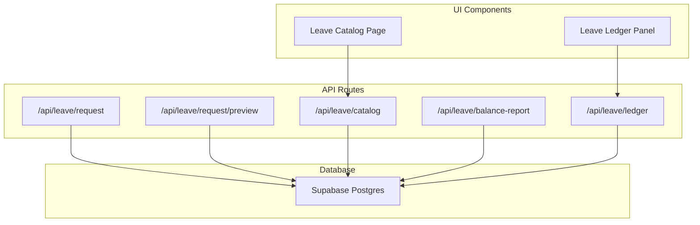
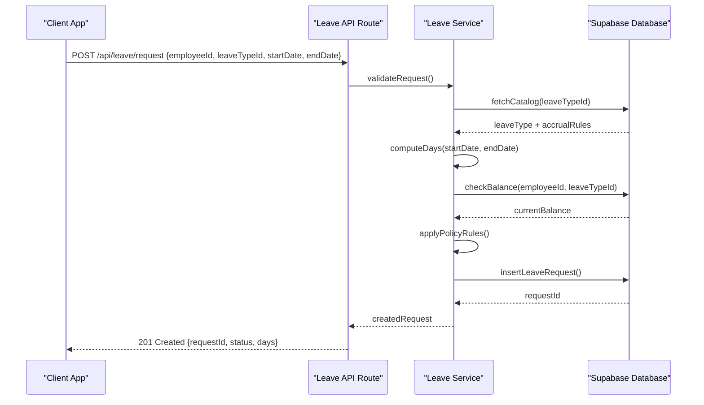
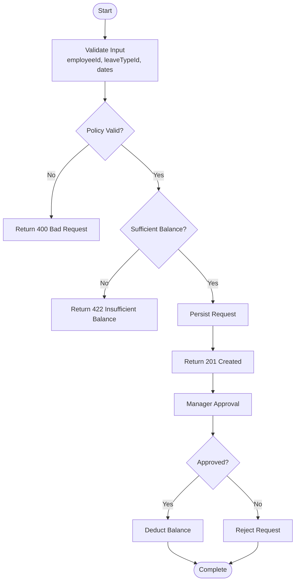
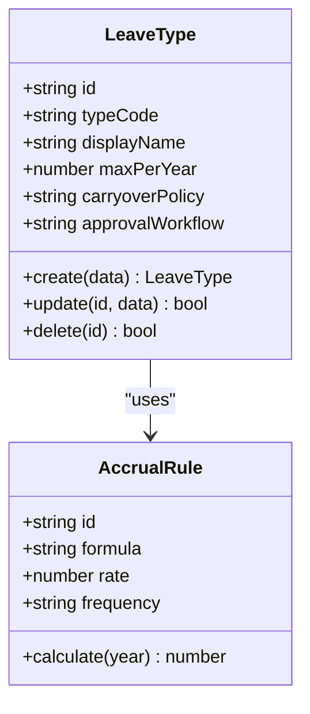
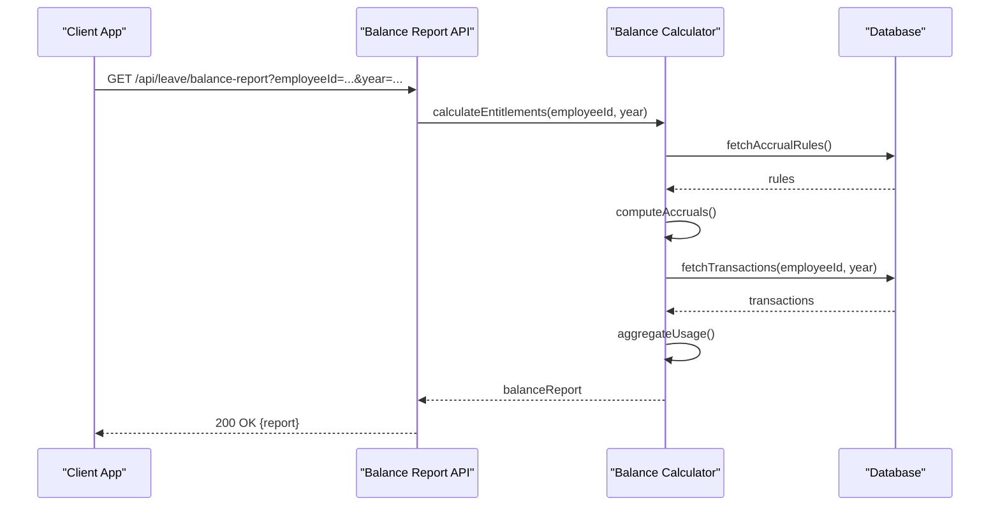
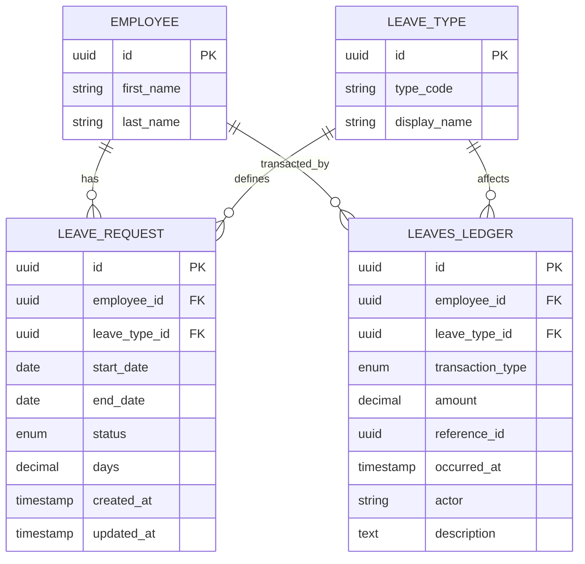
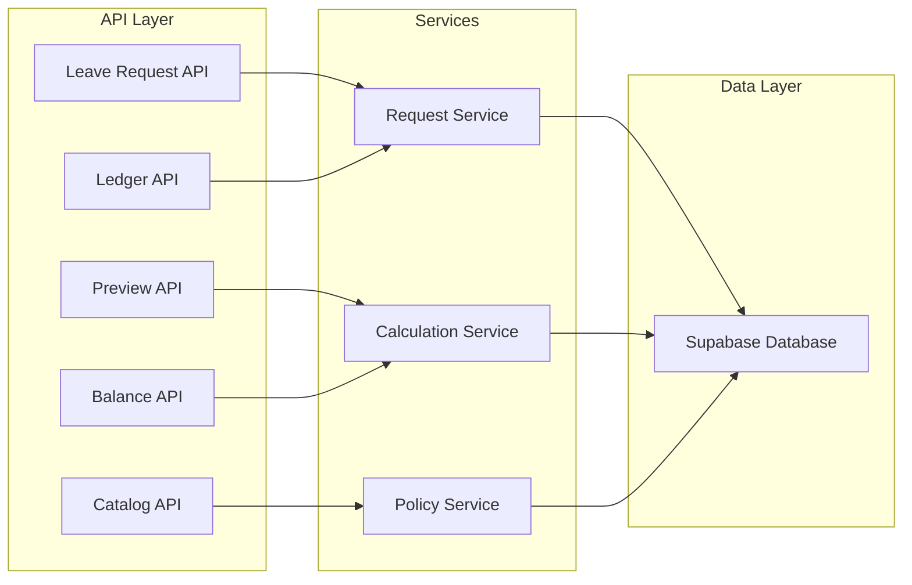

# Leave Management APIs

<cite>
**Referenced Files in This Document**
- [apps/hr-suite/app/api/leave/request/route.ts](file://apps/hr-suite/app/api/leave/request/route.ts)
- [apps/hr-suite/app/api/leave/request/preview/route.ts](file://apps/hr-suite/app/api/leave/request/preview/route.ts)
- [apps/hr-suite/app/api/leave/catalog/route.ts](file://apps/hr-suite/app/api/leave/catalog/route.ts)
- [apps/hr-suite/app/api/leave/balance-report/route.ts](file://apps/hr-suite/app/api/leave/balance-report/route.ts)
- [apps/hr-suite/app/api/leave/ledger/route.ts](file://apps/hr-suite/app/api/leave/ledger/route.ts)
- [apps/hr-suite/components/leave/leave-catalog-page.tsx](file://apps/hr-suite/components/leave/leave-catalog-page.tsx)
- [apps/hr-suite/components/leave/leave-ledger-panel.tsx](file://apps/hr-suite/components/leave/leave-ledger-panel.tsx)
- [apps/hr-suite/lib/leave](file://apps/hr-suite/lib/leave)
- [apps/hr-suite/messages/en/leave.json](file://apps/hr-suite/messages/en/leave.json)
- [apps/hr-suite/supabase/migrations/20260722142551_add_leave_engine_foundation.sql](file://apps/hr-suite/supabase/migrations/20260722142551_add_leave_engine_foundation.sql)
- [apps/hr-suite/supabase/migrations/20260722190000_add_leave_request_booking_engine.sql](file://apps/hr-suite/supabase/migrations/20260722190000_add_leave_request_booking_engine.sql)
- [apps/hr-suite/supabase/migrations/20260722192000_add_leave_ledger_operations.sql](file://apps/hr-suite/supabase/migrations/20260722192000_add_leave_ledger_operations.sql)
</cite>

## Table of Contents
1. [Introduction](#introduction)
2. [Project Structure](#project-structure)
3. [Core Components](#core-components)
4. [Architecture Overview](#architecture-overview)
5. [Detailed Component Analysis](#detailed-component-analysis)
6. [Dependency Analysis](#dependency-analysis)
7. [Performance Considerations](#performance-considerations)
8. [Troubleshooting Guide](#troubleshooting-guide)
9. [Conclusion](#conclusion)
10. [Appendices](#appendices)

## Introduction
This document provides comprehensive API documentation for LiquidHR’s Leave Management system. It covers leave request workflows (submission, preview, approval, modification, cancellation), leave catalog management (types, accrual rules, policy configurations), balance calculation endpoints (entitlements, remaining balances, historical usage), and ledger endpoints (transactions, adjustments, audit trails). Each endpoint specifies HTTP methods, URL patterns, authentication requirements, parameter validation, business rule enforcement, and error handling strategies. Practical examples illustrate common scenarios such as requesting vacation days, calculating accruals, generating reports, and handling complex policies.

## Project Structure
The Leave Management feature is implemented as a set of Next.js App Router API routes under apps/hr-suite/app/api/leave, with supporting UI components and database migrations:
- API routes:
  - /api/leave/request: Submit and manage leave requests
  - /api/leave/request/preview: Preview leave impact before submission
  - /api/leave/catalog: Manage leave types and policies
  - /api/leave/balance-report: Compute balances and generate reports
  - /api/leave/ledger: Track transactions and audit trail
- UI components:
  - Leave catalog page and ledger panel for HR administration
- Database migrations:
  - Foundation schema, booking engine, and ledger operations



**Diagram sources**
- [apps/hr-suite/app/api/leave/request/route.ts](file://apps/hr-suite/app/api/leave/request/route.ts)
- [apps/hr-suite/app/api/leave/request/preview/route.ts](file://apps/hr-suite/app/api/leave/request/preview/route.ts)
- [apps/hr-suite/app/api/leave/catalog/route.ts](file://apps/hr-suite/app/api/leave/catalog/route.ts)
- [apps/hr-suite/app/api/leave/balance-report/route.ts](file://apps/hr-suite/app/api/leave/balance-report/route.ts)
- [apps/hr-suite/app/api/leave/ledger/route.ts](file://apps/hr-suite/app/api/leave/ledger/route.ts)
- [apps/hr-suite/components/leave/leave-catalog-page.tsx](file://apps/hr-suite/components/leave/leave-catalog-page.tsx)
- [apps/hr-suite/components/leave/leave-ledger-panel.tsx](file://apps/hr-suite/components/leave/leave-ledger-panel.tsx)

**Section sources**
- [apps/hr-suite/app/api/leave/request/route.ts](file://apps/hr-suite/app/api/leave/request/route.ts)
- [apps/hr-suite/app/api/leave/request/preview/route.ts](file://apps/hr-suite/app/api/leave/request/preview/route.ts)
- [apps/hr-suite/app/api/leave/catalog/route.ts](file://apps/hr-suite/app/api/leave/catalog/route.ts)
- [apps/hr-suite/app/api/leave/balance-report/route.ts](file://apps/hr-suite/app/api/leave/balance-report/route.ts)
- [apps/hr-suite/app/api/leave/ledger/route.ts](file://apps/hr-suite/app/api/leave/ledger/route.ts)
- [apps/hr-suite/components/leave/leave-catalog-page.tsx](file://apps/hr-suite/components/leave/leave-catalog-page.tsx)
- [apps/hr-suite/components/leave/leave-ledger-panel.tsx](file://apps/hr-suite/components/leave/leave-ledger-panel.tsx)

## Core Components
- Leave Request Submission:
  - Endpoint: POST /api/leave/request
  - Purpose: Create a new leave request with validation against policy and availability
  - Authentication: Requires authenticated user context; role-based authorization enforced
  - Input fields: employeeId, leaveTypeId, startDate, endDate, reason, attachments (optional)
  - Business rules: Validates working days, holidays, minimum notice, maximum consecutive days, and sufficient balance
  - Response: Created request with status (e.g., pending, approved, rejected) and computed days
- Leave Request Preview:
  - Endpoint: POST /api/leave/request/preview
  - Purpose: Calculate projected impact without persisting the request
  - Input fields: Same as submission but no persistence
  - Response: Projected days, balance delta, conflicts, warnings
- Leave Catalog Management:
  - Endpoints: GET/POST/PUT/DELETE /api/leave/catalog
  - Purpose: Define leave types, accrual rules, and policy configurations
  - Fields: typeCode, displayName, accrualRuleId, maxPerYear, carryoverPolicy, approvalWorkflow
  - Validation: Unique type codes, valid accrual references, policy constraints
- Balance Report:
  - Endpoint: GET /api/leave/balance-report
  - Purpose: Compute entitlements, remaining balances, and historical usage per employee and leave type
  - Parameters: employeeId, leaveTypeId, year, asOfDate
  - Response: Entitlements, used, remaining, carryover, adjustments
- Ledger:
  - Endpoint: GET/POST /api/leave/ledger
  - Purpose: Query and record leave transactions, adjustments, and audit entries
  - Filters: employeeId, leaveTypeId, dateRange, transactionType
  - Response: Paginated list of transactions with timestamps and actors

**Section sources**
- [apps/hr-suite/app/api/leave/request/route.ts](file://apps/hr-suite/app/api/leave/request/route.ts)
- [apps/hr-suite/app/api/leave/request/preview/route.ts](file://apps/hr-suite/app/api/leave/request/preview/route.ts)
- [apps/hr-suite/app/api/leave/catalog/route.ts](file://apps/hr-suite/app/api/leave/catalog/route.ts)
- [apps/hr-suite/app/api/leave/balance-report/route.ts](file://apps/hr-suite/app/api/leave/balance-report/route.ts)
- [apps/hr-suite/app/api/leave/ledger/route.ts](file://apps/hr-suite/app/api/leave/ledger/route.ts)

## Architecture Overview
The Leave Management system follows a layered architecture:
- API Layer: Next.js App Router handlers validate inputs, enforce authorization, and orchestrate business logic
- Service Layer: Internal modules implement leave calculations, policy checks, and workflow transitions
- Data Layer: Supabase Postgres stores leave requests, catalog definitions, balances, and ledger entries
- UI Layer: React components provide HR and employee interfaces for managing leave



**Diagram sources**
- [apps/hr-suite/app/api/leave/request/route.ts](file://apps/hr-suite/app/api/leave/request/route.ts)
- [apps/hr-suite/supabase/migrations/20260722190000_add_leave_request_booking_engine.sql](file://apps/hr-suite/supabase/migrations/20260722190000_add_leave_request_booking_engine.sql)

## Detailed Component Analysis

### Leave Request Workflow
The leave request workflow encompasses submission, preview, approval, modification, and cancellation:
- Submission:
  - Validates input parameters and business rules
  - Checks leave type availability and policy compliance
  - Computes working days excluding holidays
  - Persists request with initial status
- Preview:
  - Calculates projected impact without side effects
  - Returns warnings for insufficient balance or conflicts
- Approval:
  - Manager action updates request status to approved/rejected
  - Triggers balance deduction upon approval
- Modification:
  - Allows changes to dates/reason if within policy limits
  - Re-validates rules and recalculates impact
- Cancellation:
  - Cancels pending requests only
  - Restores any reserved balances



**Diagram sources**
- [apps/hr-suite/app/api/leave/request/route.ts](file://apps/hr-suite/app/api/leave/request/route.ts)
- [apps/hr-suite/app/api/leave/request/preview/route.ts](file://apps/hr-suite/app/api/leave/request/preview/route.ts)

**Section sources**
- [apps/hr-suite/app/api/leave/request/route.ts](file://apps/hr-suite/app/api/leave/request/route.ts)
- [apps/hr-suite/app/api/leave/request/preview/route.ts](file://apps/hr-suite/app/api/leave/request/preview/route.ts)

### Leave Catalog Management
The leave catalog defines leave types, accrual rules, and policy configurations:
- CRUD Operations:
  - GET /api/leave/catalog: List all leave types
  - POST /api/leave/catalog: Create new leave type
  - PUT /api/leave/catalog/{id}: Update existing type
  - DELETE /api/leave/catalog/{id}: Remove type (if not referenced)
- Fields:
  - typeCode: Unique identifier
  - displayName: Human-readable name
  - accrualRuleId: Reference to accrual configuration
  - maxPerYear: Annual limit
  - carryoverPolicy: Rules for unused days
  - approvalWorkflow: Required approvals
- Validation:
  - Enforces unique type codes
  - Validates accrual rule existence
  - Prevents deletion if in use



**Diagram sources**
- [apps/hr-suite/app/api/leave/catalog/route.ts](file://apps/hr-suite/app/api/leave/catalog/route.ts)
- [apps/hr-suite/components/leave/leave-catalog-page.tsx](file://apps/hr-suite/components/leave/leave-catalog-page.tsx)

**Section sources**
- [apps/hr-suite/app/api/leave/catalog/route.ts](file://apps/hr-suite/app/api/leave/catalog/route.ts)
- [apps/hr-suite/components/leave/leave-catalog-page.tsx](file://apps/hr-suite/components/leave/leave-catalog-page.tsx)

### Balance Calculation and Reports
Balance calculation computes entitlements, remaining balances, and historical usage:
- Endpoint: GET /api/leave/balance-report
- Parameters:
  - employeeId: Target employee
  - leaveTypeId: Specific leave type (optional)
  - year: Reporting year
  - asOfDate: Snapshot date for calculations
- Response Schema:
  - entitlements: Total allocated days
  - used: Days consumed
  - remaining: Available balance
  - carryover: Rollover from previous year
  - adjustments: Manual corrections
- Business Logic:
  - Applies accrual rules based on employment start date
  - Excludes holidays and non-working days
  - Aggregates historical transactions



**Diagram sources**
- [apps/hr-suite/app/api/leave/balance-report/route.ts](file://apps/hr-suite/app/api/leave/balance-report/route.ts)

**Section sources**
- [apps/hr-suite/app/api/leave/balance-report/route.ts](file://apps/hr-suite/app/api/leave/balance-report/route.ts)

### Ledger and Audit Trail
The ledger tracks all leave-related transactions and adjustments:
- Endpoints:
  - GET /api/leave/ledger: Query transactions with filters
  - POST /api/leave/ledger: Record manual adjustments
- Filters:
  - employeeId, leaveTypeId, dateRange, transactionType
- Transaction Types:
  - REQUEST_CREATED, APPROVED, REJECTED, CANCELLED, ADJUSTMENT
- Response:
  - Paginated list with timestamps, actors, and descriptions
- Audit Trail:
  - Immutable records with full history
  - Supports compliance and reporting



**Diagram sources**
- [apps/hr-suite/supabase/migrations/20260722192000_add_leave_ledger_operations.sql](file://apps/hr-suite/supabase/migrations/20260722192000_add_leave_ledger_operations.sql)
- [apps/hr-suite/supabase/migrations/20260722190000_add_leave_request_booking_engine.sql](file://apps/hr-suite/supabase/migrations/20260722190000_add_leave_request_booking_engine.sql)

**Section sources**
- [apps/hr-suite/app/api/leave/ledger/route.ts](file://apps/hr-suite/app/api/leave/ledger/route.ts)
- [apps/hr-suite/components/leave/leave-ledger-panel.tsx](file://apps/hr-suite/components/leave/leave-ledger-panel.tsx)

## Dependency Analysis
The Leave Management system has clear dependency relationships:
- API routes depend on internal services for business logic
- Services interact with database through Supabase client
- UI components consume API endpoints for data presentation
- Migrations define schema dependencies between entities



**Diagram sources**
- [apps/hr-suite/app/api/leave/request/route.ts](file://apps/hr-suite/app/api/leave/request/route.ts)
- [apps/hr-suite/app/api/leave/balance-report/route.ts](file://apps/hr-suite/app/api/leave/balance-report/route.ts)
- [apps/hr-suite/app/api/leave/catalog/route.ts](file://apps/hr-suite/app/api/leave/catalog/route.ts)
- [apps/hr-suite/app/api/leave/ledger/route.ts](file://apps/hr-suite/app/api/leave/ledger/route.ts)

**Section sources**
- [apps/hr-suite/app/api/leave/request/route.ts](file://apps/hr-suite/app/api/leave/request/route.ts)
- [apps/hr-suite/app/api/leave/balance-report/route.ts](file://apps/hr-suite/app/api/leave/balance-report/route.ts)
- [apps/hr-suite/app/api/leave/catalog/route.ts](file://apps/hr-suite/app/api/leave/catalog/route.ts)
- [apps/hr-suite/app/api/leave/ledger/route.ts](file://apps/hr-suite/app/api/leave/ledger/route.ts)

## Performance Considerations
- Database Indexing:
  - Foreign key indexes on employee_id and leave_type_id
  - Composite indexes for date range queries
- Query Optimization:
  - Pagination for large result sets
  - Selective field retrieval to reduce payload size
- Caching Strategies:
  - Cache catalog data for frequent access
  - Memoize balance calculations for same-day requests
- Concurrency Control:
  - Optimistic locking for balance updates
  - Transaction isolation for critical operations

[No sources needed since this section provides general guidance]

## Troubleshooting Guide
Common issues and their resolutions:
- Insufficient Balance:
  - Error: 422 Unprocessable Entity
  - Cause: Request exceeds available leave balance
  - Resolution: Adjust dates or request additional time off
- Policy Violation:
  - Error: 400 Bad Request
  - Cause: Request violates company policy (e.g., minimum notice)
  - Resolution: Review policy settings and adjust request
- Workflow State Errors:
  - Error: 409 Conflict
  - Cause: Invalid state transition (e.g., cancelling approved request)
  - Resolution: Follow proper workflow sequence
- Database Constraints:
  - Error: 409 Conflict
  - Cause: Duplicate entries or foreign key violations
  - Resolution: Check data integrity and relationships

**Section sources**
- [apps/hr-suite/app/api/leave/request/route.ts](file://apps/hr-suite/app/api/leave/request/route.ts)
- [apps/hr-suite/app/api/leave/catalog/route.ts](file://apps/hr-suite/app/api/leave/catalog/route.ts)

## Conclusion
LiquidHR’s Leave Management system provides a comprehensive solution for managing employee leave through well-defined APIs. The system supports complete leave lifecycle management, from request submission to approval and tracking. With robust balance calculations, detailed audit trails, and flexible policy configurations, it enables organizations to implement sophisticated leave management strategies. The modular architecture ensures scalability and maintainability while providing clear integration points for external systems.

[No sources needed since this section summarizes without analyzing specific files]

## Appendices

### Authentication and Authorization
- All endpoints require authenticated users via session-based authentication
- Role-based access control (RBAC) enforces permissions:
  - Employees can submit and view their own requests
  - Managers can approve/reject team member requests
  - HR administrators have full access to catalog and ledger
- Authorization headers:
  - Bearer token required for API calls
  - Context includes tenant and administration scope

### Parameter Validation
- Date formats: ISO 8601 (YYYY-MM-DD)
- Numeric values: Positive integers for days and amounts
- String fields: Trimmed and sanitized
- Required fields: Enforced at API level with descriptive error messages

### Error Response Format
```json
{
  "error": {
    "code": "INSUFFICIENT_BALANCE",
    "message": "Requested days exceed available balance",
    "details": {
      "requested": 5,
      "available": 3
    }
  }
}
```

### Practical Examples

#### Example 1: Request Vacation Days
```http
POST /api/leave/request
Authorization: Bearer <token>
Content-Type: application/json

{
  "employeeId": "emp-123",
  "leaveTypeId": "vacation",
  "startDate": "2024-07-15",
  "endDate": "2024-07-19",
  "reason": "Family vacation"
}
```

#### Example 2: Calculate Accruals
```http
GET /api/leave/balance-report?employeeId=emp-123&leaveTypeId=vacation&year=2024&asOfDate=2024-06-30
Authorization: Bearer <token>
```

#### Example 3: Generate Ledger Report
```http
GET /api/leave/ledger?employeeId=emp-123&dateRange=2024-01-01..2024-12-31&type=REQUEST_CREATED
Authorization: Bearer <token>
```

**Section sources**
- [apps/hr-suite/app/api/leave/request/route.ts](file://apps/hr-suite/app/api/leave/request/route.ts)
- [apps/hr-suite/app/api/leave/balance-report/route.ts](file://apps/hr-suite/app/api/leave/balance-report/route.ts)
- [apps/hr-suite/app/api/leave/ledger/route.ts](file://apps/hr-suite/app/api/leave/ledger/route.ts)