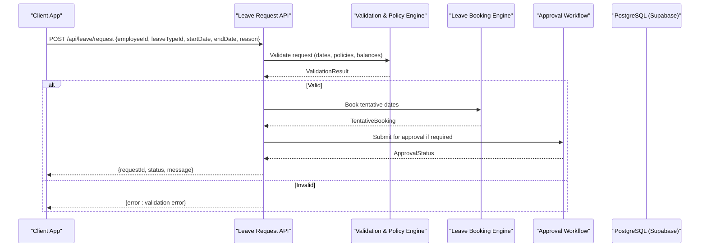
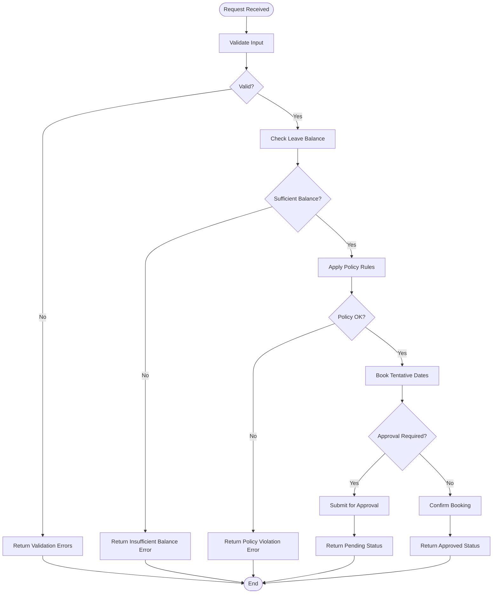
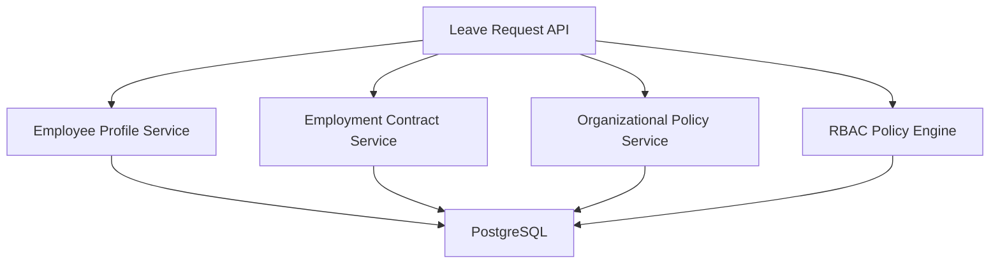

# Leave Request APIs

<cite>
**Referenced Files in This Document**
- [leave/route.ts](file://apps/hr-suite/app/api/leave/request/route.ts)
- [leave/preview/route.ts](file://apps/hr-suite/app/api/leave/request/preview/route.ts)
- [leave/balance-report/route.ts](file://apps/hr-suite/app/api/leave/balance-report/route.ts)
- [leave/catalog/route.ts](file://apps/hr-suite/app/api/leave/catalog/route.ts)
- [leave/ledger/route.ts](file://apps/hr-suite/app/api/leave/ledger/route.ts)
- [20260722142551_add_leave_engine_foundation.sql](file://apps/hr-suite/supabase/migrations/20260722142551_add_leave_engine_foundation.sql)
- [20260722190000_add_leave_request_booking_engine.sql](file://apps/hr-suite/supabase/migrations/20260722190000_add_leave_request_booking_engine.sql)
- [20260722192000_add_leave_ledger_operations.sql](file://apps/hr-suite/supabase/migrations/20260722192000_add_leave_ledger_operations.sql)
- [20260722192500_skip_holidays_in_leave_requests.sql](file://apps/hr-suite/supabase/migrations/20260722192500_skip_holidays_in_leave_requests.sql)
- [leave.json (en)](file://apps/hr-suite/messages/en/leave.json)
- [leave.json (nl)](file://apps/hr-suite/messages/nl/leave.json)
</cite>

## Table of Contents
1. [Introduction](#introduction)
2. [Project Structure](#project-structure)
3. [Core Components](#core-components)
4. [Architecture Overview](#architecture-overview)
5. [Detailed Component Analysis](#detailed-component-analysis)
6. [Dependency Analysis](#dependency-analysis)
7. [Performance Considerations](#performance-considerations)
8. [Troubleshooting Guide](#troubleshooting-guide)
9. [Conclusion](#conclusion)
10. [Appendices](#appendices)

## Introduction
This document provides comprehensive API documentation for LiquidHR’s leave request management endpoints. It covers the complete lifecycle of a leave request: creation, validation, preview generation, submission, approval workflows, modifications, and cancellations. It also details HTTP methods, URL patterns, request/response schemas with field validations, authentication requirements using RBAC policies, and business rule enforcement. Practical examples are included for common scenarios such as vacation days, sick leave, parental leave, and complex multi-day requests. Error handling is documented for insufficient balances, policy violations, workflow state transitions, and concurrent modification conflicts. Integration points with employee profiles, employment contracts, and organizational policies are specified.

## Project Structure
The leave functionality is implemented under the Next.js app router at apps/hr-suite/app/api/leave. The key endpoints are organized by feature:
- Leave requests: POST to create and submit requests, GET to retrieve details
- Preview: POST to generate a non-binding preview of a leave request
- Catalog: GET to list available leave types and rules
- Balance report: GET to compute projected balances after proposed changes
- Ledger: GET to view historical leave transactions and adjustments

```mermaid
graph TB
subgraph "API Layer"
A["Leave Requests<br/>POST /api/leave/request"]
B["Preview<br/>POST /api/leave/request/preview"]
C["Catalog<br/>GET /api/leave/catalog"]
D["Balance Report<br/>GET /api/leave/balance-report"]
E["Ledger<br/>GET /api/leave/ledger"]
end
subgraph "Domain Services"
F["Validation & Policy Engine"]
G["Leave Booking Engine"]
H["Approval Workflow"]
I["Ledger Operations"]
end
subgraph "Data Layer"
J["PostgreSQL (Supabase)"]
K["RBAC Policies"]
end
A --> F
A --> G
A --> H
B --> F
B --> G
C --> F
D --> G
E --> I
F --> J
G --> J
H --> J
I --> J
J --> K
```

**Diagram sources**
- [leave/route.ts](file://apps/hr-suite/app/api/leave/request/route.ts)
- [leave/preview/route.ts](file://apps/hr-suite/app/api/leave/request/preview/route.ts)
- [leave/catalog/route.ts](file://apps/hr-suite/app/api/leave/catalog/route.ts)
- [leave/balance-report/route.ts](file://apps/hr-suite/app/api/leave/balance-report/route.ts)
- [leave/ledger/route.ts](file://apps/hr-suite/app/api/leave/ledger/route.ts)

**Section sources**
- [leave/route.ts](file://apps/hr-suite/app/api/leave/request/route.ts)
- [leave/preview/route.ts](file://apps/hr-suite/app/api/leave/request/preview/route.ts)
- [leave/catalog/route.ts](file://apps/hr-suite/app/api/leave/catalog/route.ts)
- [leave/balance-report/route.ts](file://apps/hr-suite/app/api/leave/balance-report/route.ts)
- [leave/ledger/route.ts](file://apps/hr-suite/app/api/leave/ledger/route.ts)

## Core Components
- Leave Request Endpoint: Handles creation and submission of leave requests, including validation against policies and balance checks.
- Preview Endpoint: Generates a non-binding preview of a leave request, including estimated days, affected holidays, and projected balance impact.
- Catalog Endpoint: Returns available leave types, accrual rules, and policy constraints for the current tenant and user context.
- Balance Report Endpoint: Computes projected balances based on existing requests and proposed changes.
- Ledger Endpoint: Provides historical transactions, approvals, adjustments, and audit trail entries.

Authentication and Authorization:
- All endpoints require authenticated users via the application’s auth layer.
- RBAC policies enforce access control based on roles and scopes (e.g., employee, manager, HR admin).
- Multi-tenancy isolation ensures data visibility is scoped to the current administration.

Business Rules:
- Validation includes date range checks, holiday skipping, minimum notice periods, and type-specific constraints.
- Balance checks ensure sufficient accrued leave before booking.
- Approval workflows may be required depending on leave type, duration, and policy configuration.

**Section sources**
- [leave/route.ts](file://apps/hr-suite/app/api/leave/request/route.ts)
- [leave/preview/route.ts](file://apps/hr-suite/app/api/leave/request/preview/route.ts)
- [leave/catalog/route.ts](file://apps/hr-suite/app/api/leave/catalog/route.ts)
- [leave/balance-report/route.ts](file://apps/hr-suite/app/api/leave/balance-report/route.ts)
- [leave/ledger/route.ts](file://apps/hr-suite/app/api/leave/ledger/route.ts)

## Architecture Overview
The leave request system follows a layered architecture:
- API Layer: Next.js route handlers expose RESTful endpoints.
- Domain Services: Validation, policy engine, booking engine, approval workflow, and ledger operations.
- Data Layer: PostgreSQL with Supabase, enforcing RBAC policies and multi-tenancy.

**Diagram sources**
- [leave/route.ts](file://apps/hr-suite/app/api/leave/request/route.ts)
- [20260722190000_add_leave_request_booking_engine.sql](file://apps/hr-suite/supabase/migrations/20260722190000_add_leave_request_booking_engine.sql)

## Detailed Component Analysis

### Leave Request Creation and Submission
- Method: POST
- URL: /api/leave/request
- Authentication: Required (RBAC: employee, manager, HR admin)
- Request Schema:
  - employeeId: string (UUID)
  - leaveTypeId: string (UUID)
  - startDate: date (ISO 8601)
  - endDate: date (ISO 8601)
  - reason: string (optional, max length defined by policy)
  - attachments: array of file references (optional)
- Response Schema:
  - requestId: string (UUID)
  - status: enum (draft, pending_approval, approved, rejected, cancelled)
  - message: string
  - errors: array of validation errors (if any)
- Business Rules:
  - Date range must be valid and not overlap with existing requests.
  - Holiday skipping applies based on configuration.
  - Minimum notice period enforced per leave type.
  - Balance check performed; insufficient balance returns error.
- Error Handling:
  - Insufficient balance: 422 Unprocessable Entity
  - Policy violation: 422 Unprocessable Entity
  - Concurrent modification: 409 Conflict

**Diagram sources**
- [leave/route.ts](file://apps/hr-suite/app/api/leave/request/route.ts)
- [20260722192500_skip_holidays_in_leave_requests.sql](file://apps/hr-suite/supabase/migrations/20260722192500_skip_holidays_in_leave_requests.sql)

**Section sources**
- [leave/route.ts](file://apps/hr-suite/app/api/leave/request/route.ts)
- [20260722190000_add_leave_request_booking_engine.sql](file://apps/hr-suite/supabase/migrations/20260722190000_add_leave_request_booking_engine.sql)

### Preview Generation
- Method: POST
- URL: /api/leave/request/preview
- Authentication: Required (RBAC: employee, manager, HR admin)
- Request Schema: Same as leave request creation
- Response Schema:
  - estimatedDays: number
  - affectedHolidays: array of dates
  - projectedBalanceImpact: object (before/after balances)
  - warnings: array of policy warnings
- Use Cases:
  - Vacation days: Preview shows total days excluding weekends/holidays.
  - Sick leave: Preview may include partial day calculations.
  - Parental leave: Preview reflects extended duration and policy-specific rules.

**Section sources**
- [leave/preview/route.ts](file://apps/hr-suite/app/api/leave/request/preview/route.ts)

### Catalog Management
- Method: GET
- URL: /api/leave/catalog
- Authentication: Required (RBAC: employee, manager, HR admin)
- Response Schema:
  - leaveTypes: array of leave type definitions
  - accrualRules: array of accrual rule configurations
  - policyConstraints: object defining global constraints
- Purpose:
  - Provides dynamic configuration for leave types and rules.
  - Supports localization via messages files.

**Section sources**
- [leave/catalog/route.ts](file://apps/hr-suite/app/api/leave/catalog/route.ts)
- [leave.json (en)](file://apps/hr-suite/messages/en/leave.json)
- [leave.json (nl)](file://apps/hr-suite/messages/nl/leave.json)

### Balance Report
- Method: GET
- URL: /api/leave/balance-report
- Authentication: Required (RBAC: employee, manager, HR admin)
- Query Parameters:
  - employeeId: string (UUID)
  - year: integer
  - includeProposed: boolean
- Response Schema:
  - currentBalance: number
  - projectedBalance: number
  - adjustments: array of proposed changes
- Use Cases:
  - Pre-submission balance verification.
  - Manager review of team leave impact.

**Section sources**
- [leave/balance-report/route.ts](file://apps/hr-suite/app/api/leave/balance-report/route.ts)

### Ledger and Audit Trail
- Method: GET
- URL: /api/leave/ledger
- Authentication: Required (RBAC: HR admin, manager)
- Query Parameters:
  - employeeId: string (UUID)
  - startDate: date
  - endDate: date
  - status: enum (approved, rejected, cancelled)
- Response Schema:
  - transactions: array of ledger entries
  - summary: object with totals and counts
- Purpose:
  - Historical tracking of leave transactions.
  - Audit trail for compliance and reporting.

**Section sources**
- [leave/ledger/route.ts](file://apps/hr-suite/app/api/leave/ledger/route.ts)
- [20260722192000_add_leave_ledger_operations.sql](file://apps/hr-suite/supabase/migrations/20260722192000_add_leave_ledger_operations.sql)

## Dependency Analysis
The leave request system depends on several core components:
- Employee Profiles: For validating employee existence and role.
- Employment Contracts: For determining leave entitlements and accrual rules.
- Organizational Policies: For enforcing leave type constraints and approval workflows.
- RBAC Policies: For access control and data isolation.

**Diagram sources**
- [leave/route.ts](file://apps/hr-suite/app/api/leave/request/route.ts)
- [20260722142551_add_leave_engine_foundation.sql](file://apps/hr-suite/supabase/migrations/20260722142551_add_leave_engine_foundation.sql)

**Section sources**
- [leave/route.ts](file://apps/hr-suite/app/api/leave/request/route.ts)
- [20260722142551_add_leave_engine_foundation.sql](file://apps/hr-suite/supabase/migrations/20260722142551_add_leave_engine_foundation.sql)

## Performance Considerations
- Indexing: Ensure proper indexing on employeeId, leaveTypeId, and date ranges for efficient queries.
- Caching: Cache catalog and policy data where appropriate to reduce database load.
- Batch Processing: For bulk leave submissions, implement batch endpoints to minimize round trips.
- Concurrency Control: Use optimistic locking or versioning to handle concurrent modifications.

[No sources needed since this section provides general guidance]

## Troubleshooting Guide
Common issues and resolutions:
- Insufficient Balance: Verify accrual rules and existing bookings. Adjust leave dates or request additional time off.
- Policy Violations: Review organizational policies and adjust request parameters accordingly.
- Approval Workflow Stalls: Check approval chain configuration and notify relevant approvers.
- Concurrent Modification Conflicts: Implement retry logic with conflict resolution strategies.

**Section sources**
- [leave/route.ts](file://apps/hr-suite/app/api/leave/request/route.ts)
- [20260722190000_add_leave_request_booking_engine.sql](file://apps/hr-suite/supabase/migrations/20260722190000_add_leave_request_booking_engine.sql)

## Conclusion
LiquidHR’s leave request management system provides a robust and flexible API for managing employee leave. With comprehensive validation, policy enforcement, and approval workflows, it supports a wide range of leave scenarios. The modular architecture ensures scalability and maintainability, while RBAC policies and multi-tenancy provide secure and isolated access control.

[No sources needed since this section summarizes without analyzing specific files]

## Appendices

### Practical Examples
- Vacation Days:
  - Request: POST /api/leave/request with leaveTypeId for vacation, startDate and endDate for a week.
  - Expected: Approved if balance sufficient and no policy violations.
- Sick Leave:
  - Request: POST /api/leave/request with leaveTypeId for sick leave, possibly with medical certificate attachment.
  - Expected: May bypass approval depending on policy.
- Parental Leave:
  - Request: POST /api/leave/request with leaveTypeId for parental leave, extended date range.
  - Expected: Requires approval and may involve additional documentation.
- Multi-Day Requests:
  - Request: POST /api/leave/request with overlapping dates across multiple weeks.
  - Expected: Holiday skipping applied, balance calculated accurately.

[No sources needed since this section provides conceptual examples]