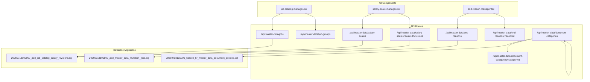
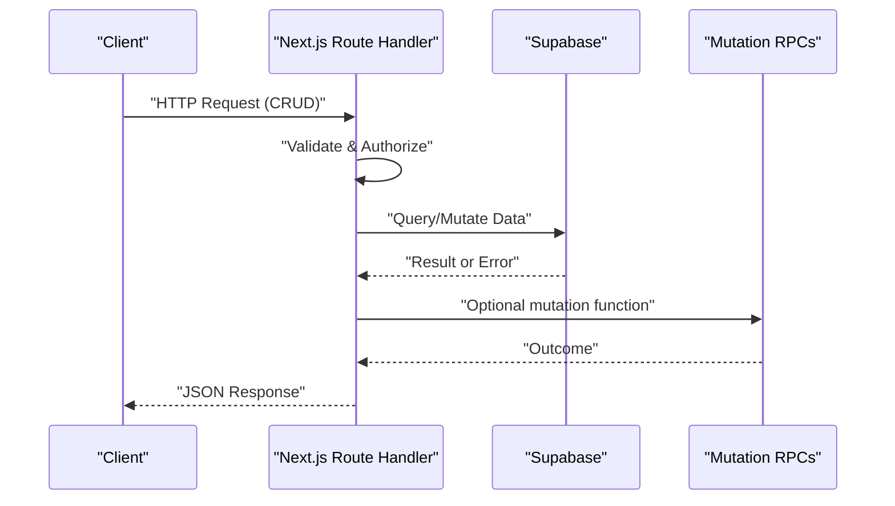
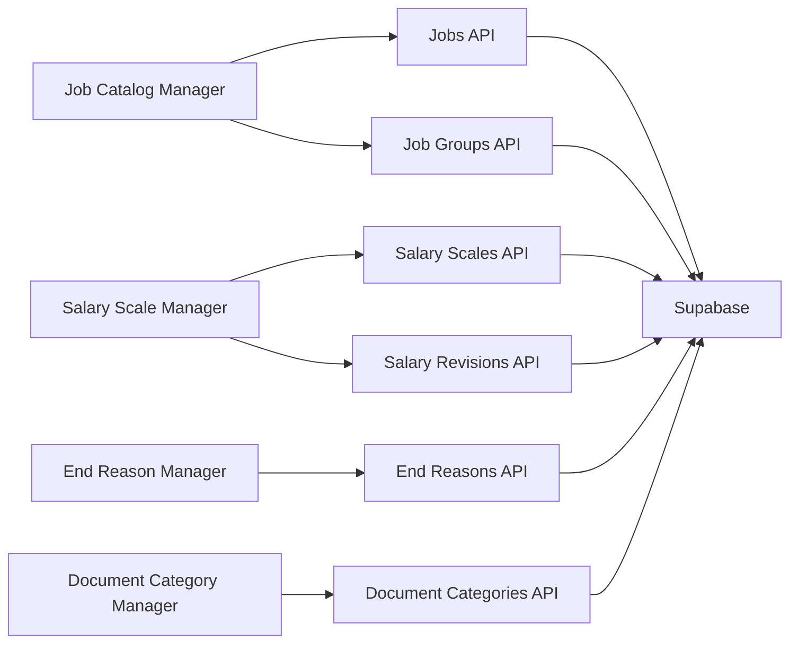

# Master Data APIs

<cite>
**Referenced Files in This Document**
- [apps/hr-suite/app/api/master-data/jobs/route.ts](file://apps/hr-suite/app/api/master-data/jobs/route.ts)
- [apps/hr-suite/app/api/master-data/job-groups/route.ts](file://apps/hr-suite/app/api/master-data/job-groups/route.ts)
- [apps/hr-suite/app/api/master-data/salary-scales/route.ts](file://apps/hr-suite/app/api/master-data/salary-scales/route.ts)
- [apps/hr-suite/app/api/master-data/salary-scales/[scaleId]/revisions/route.ts](file://apps/hr-suite/app/api/master-data/salary-scales/[scaleId]/revisions/route.ts)
- [apps/hr-suite/app/api/master-data/end-reasons/route.ts](file://apps/hr-suite/app/api/master-data/end-reasons/route.ts)
- [apps/hr-suite/app/api/master-data/end-reasons/[reasonId]/route.ts](file://apps/hr-suite/app/api/master-data/end-reasons/[reasonId]/route.ts)
- [apps/hr-suite/app/api/master-data/document-categories/route.ts](file://apps/hr-suite/app/api/master-data/document-categories/route.ts)
- [apps/hr-suite/app/api/master-data/document-categories/[categoryId]/route.ts](file://apps/hr-suite/app/api/master-data/document-categories/[categoryId]/route.ts)
- [apps/hr-suite/components/master-data/job-catalog-manager.tsx](file://apps/hr-suite/components/master-data/job-catalog-manager.tsx)
- [apps/hr-suite/components/master-data/salary-scale-manager.tsx](file://apps/hr-suite/components/master-data/salary-scale-manager.tsx)
- [apps/hr-suite/components/master-data/end-reason-manager.tsx](file://apps/hr-suite/components/master-data/end-reason-manager.tsx)
- [apps/hr-suite/lib/master-data/index.ts](file://apps/hr-suite/lib/master-data/index.ts)
- [apps/hr-suite/supabase/migrations/20260718100000_add_job_catalog_salary_revisions.sql](file://apps/hr-suite/supabase/migrations/20260718100000_add_job_catalog_salary_revisions.sql)
- [apps/hr-suite/supabase/migrations/20260718100500_add_master_data_mutation_rpcs.sql](file://apps/hr-suite/supabase/migrations/20260718100500_add_master_data_mutation_rpcs.sql)
- [apps/hr-suite/supabase/migrations/20260718131000_harden_hr_master_data_document_policies.sql](file://apps/hr-suite/supabase/migrations/20260718131000_harden_hr_master_data_document_policies.sql)
</cite>

## Table of Contents
1. [Introduction](#introduction)
2. [Project Structure](#project-structure)
3. [Core Components](#core-components)
4. [Architecture Overview](#architecture-overview)
5. [Detailed Component Analysis](#detailed-component-analysis)
6. [Dependency Analysis](#dependency-analysis)
7. [Performance Considerations](#performance-considerations)
8. [Troubleshooting Guide](#troubleshooting-guide)
9. [Conclusion](#conclusion)
10. [Appendices](#appendices)

## Introduction
This document provides comprehensive API documentation for LiquidHR’s Master Data management endpoints. It covers:
- Job catalog APIs for managing job titles, descriptions, and hierarchical relationships (jobs and job groups).
- Salary scale management including grade structures, ranges, and revision history.
- End reason configuration for termination categorization and reporting.
- Document category management for organizing employee documents and compliance materials.

The guide specifies HTTP methods, URL patterns, request/response schemas, authentication requirements, validation rules, business constraints, practical examples, data integrity considerations, versioning strategies, and migration support.

## Project Structure
Master Data is exposed via Next.js App Router REST-style routes under /api/master-data. Each resource has a collection route and optional item-level routes for updates and deletions. Related UI components and Supabase migrations provide the implementation context.

**Diagram sources**
- [apps/hr-suite/app/api/master-data/jobs/route.ts](file://apps/hr-suite/app/api/master-data/jobs/route.ts)
- [apps/hr-suite/app/api/master-data/job-groups/route.ts](file://apps/hr-suite/app/api/master-data/job-groups/route.ts)
- [apps/hr-suite/app/api/master-data/salary-scales/route.ts](file://apps/hr-suite/app/api/master-data/salary-scales/route.ts)
- [apps/hr-suite/app/api/master-data/salary-scales/[scaleId]/revisions/route.ts](file://apps/hr-suite/app/api/master-data/salary-scales/[scaleId]/revisions/route.ts)
- [apps/hr-suite/app/api/master-data/end-reasons/route.ts](file://apps/hr-suite/app/api/master-data/end-reasons/route.ts)
- [apps/hr-suite/app/api/master-data/end-reasons/[reasonId]/route.ts](file://apps/hr-suite/app/api/master-data/end-reasons/[reasonId]/route.ts)
- [apps/hr-suite/app/api/master-data/document-categories/route.ts](file://apps/hr-suite/app/api/master-data/document-categories/route.ts)
- [apps/hr-suite/app/api/master-data/document-categories/[categoryId]/route.ts](file://apps/hr-suite/app/api/master-data/document-categories/[categoryId]/route.ts)
- [apps/hr-suite/components/master-data/job-catalog-manager.tsx](file://apps/hr-suite/components/master-data/job-catalog-manager.tsx)
- [apps/hr-suite/components/master-data/salary-scale-manager.tsx](file://apps/hr-suite/components/master-data/salary-scale-manager.tsx)
- [apps/hr-suite/components/master-data/end-reason-manager.tsx](file://apps/hr-suite/components/master-data/end-reason-manager.tsx)
- [apps/hr-suite/supabase/migrations/20260718100000_add_job_catalog_salary_revisions.sql](file://apps/hr-suite/supabase/migrations/20260718100000_add_job_catalog_salary_revisions.sql)
- [apps/hr-suite/supabase/migrations/20260718100500_add_master_data_mutation_rpcs.sql](file://apps/hr-suite/supabase/migrations/20260718100500_add_master_data_mutation_rpcs.sql)
- [apps/hr-suite/supabase/migrations/20260718131000_harden_hr_master_data_document_policies.sql](file://apps/hr-suite/supabase/migrations/20260718131000_harden_hr_master_data_document_policies.sql)

**Section sources**
- [apps/hr-suite/app/api/master-data/jobs/route.ts](file://apps/hr-suite/app/api/master-data/jobs/route.ts)
- [apps/hr-suite/app/api/master-data/job-groups/route.ts](file://apps/hr-suite/app/api/master-data/job-groups/route.ts)
- [apps/hr-suite/app/api/master-data/salary-scales/route.ts](file://apps/hr-suite/app/api/master-data/salary-scales/route.ts)
- [apps/hr-suite/app/api/master-data/salary-scales/[scaleId]/revisions/route.ts](file://apps/hr-suite/app/api/master-data/salary-scales/[scaleId]/revisions/route.ts)
- [apps/hr-suite/app/api/master-data/end-reasons/route.ts](file://apps/hr-suite/app/api/master-data/end-reasons/route.ts)
- [apps/hr-suite/app/api/master-data/end-reasons/[reasonId]/route.ts](file://apps/hr-suite/app/api/master-data/end-reasons/[reasonId]/route.ts)
- [apps/hr-suite/app/api/master-data/document-categories/route.ts](file://apps/hr-suite/app/api/master-data/document-categories/route.ts)
- [apps/hr-suite/app/api/master-data/document-categories/[categoryId]/route.ts](file://apps/hr-suite/app/api/master-data/document-categories/[categoryId]/route.ts)
- [apps/hr-suite/components/master-data/job-catalog-manager.tsx](file://apps/hr-suite/components/master-data/job-catalog-manager.tsx)
- [apps/hr-suite/components/master-data/salary-scale-manager.tsx](file://apps/hr-suite/components/master-data/salary-scale-manager.tsx)
- [apps/hr-suite/components/master-data/end-reason-manager.tsx](file://apps/hr-suite/components/master-data/end-reason-manager.tsx)
- [apps/hr-suite/supabase/migrations/20260718100000_add_job_catalog_salary_revisions.sql](file://apps/hr-suite/supabase/migrations/20260718100000_add_job_catalog_salary_revisions.sql)
- [apps/hr-suite/supabase/migrations/20260718100500_add_master_data_mutation_rpcs.sql](file://apps/hr-suite/supabase/migrations/20260718100500_add_master_data_mutation_rpcs.sql)
- [apps/hr-suite/supabase/migrations/20260718131000_harden_hr_master_data_document_policies.sql](file://apps/hr-suite/supabase/migrations/20260718131000_harden_hr_master_data_document_policies.sql)

## Core Components
- Jobs and Job Groups: Manage job titles, descriptions, and hierarchy via dedicated routes.
- Salary Scales and Revisions: Manage grade structures, ranges, and maintain revision history.
- End Reasons: Configure termination reasons for categorization and reporting.
- Document Categories: Organize employee documents and compliance materials.

These components are implemented as Next.js Route Handlers with consistent CRUD semantics and are backed by Supabase tables and functions defined in migrations.

**Section sources**
- [apps/hr-suite/app/api/master-data/jobs/route.ts](file://apps/hr-suite/app/api/master-data/jobs/route.ts)
- [apps/hr-suite/app/api/master-data/job-groups/route.ts](file://apps/hr-suite/app/api/master-data/job-groups/route.ts)
- [apps/hr-suite/app/api/master-data/salary-scales/route.ts](file://apps/hr-suite/app/api/master-data/salary-scales/route.ts)
- [apps/hr-suite/app/api/master-data/salary-scales/[scaleId]/revisions/route.ts](file://apps/hr-suite/app/api/master-data/salary-scales/[scaleId]/revisions/route.ts)
- [apps/hr-suite/app/api/master-data/end-reasons/route.ts](file://apps/hr-suite/app/api/master-data/end-reasons/route.ts)
- [apps/hr-suite/app/api/master-data/end-reasons/[reasonId]/route.ts](file://apps/hr-suite/app/api/master-data/end-reasons/[reasonId]/route.ts)
- [apps/hr-suite/app/api/master-data/document-categories/route.ts](file://apps/hr-suite/app/api/master-data/document-categories/route.ts)
- [apps/hr-suite/app/api/master-data/document-categories/[categoryId]/route.ts](file://apps/hr-suite/app/api/master-data/document-categories/[categoryId]/route.ts)

## Architecture Overview
The Master Data layer follows a standard REST pattern:
- Clients authenticate to the application and call Next.js API routes.
- Routes validate requests, enforce authorization, and interact with Supabase (tables/functions).
- Responses return standardized JSON payloads.

[No diagram sources needed since this diagram shows conceptual workflow, not actual code structure]

## Detailed Component Analysis

### Job Catalog APIs
Covers job titles, descriptions, and hierarchical relationships through jobs and job groups.

- Base path: /api/master-data/jobs
- Methods:
  - GET: List jobs with optional filters (e.g., group, active status).
  - POST: Create a new job entry.
  - PATCH: Update an existing job.
  - DELETE: Remove a job (soft delete if supported).
- Base path: /api/master-data/job-groups
- Methods:
  - GET: List job groups.
  - POST: Create a job group.
  - PATCH: Update a job group.
  - DELETE: Remove a job group.

Request schema highlights:
- job: id (optional on create), title, description, groupId (nullable), isActive (boolean), sortOrder (number), metadata (object).
- jobGroup: id (optional on create), name, description, isActive (boolean), sortOrder (number).

Response schema highlights:
- Single resource object with created/updated timestamps and audit fields.
- Lists return arrays of resources with pagination metadata when applicable.

Authentication and authorization:
- Requires authenticated user with appropriate role (e.g., HR Admin).
- Enforced at route level before database access.

Validation rules:
- Non-empty title/name fields.
- Unique constraints per tenant where applicable.
- Valid foreign key references (groupId must exist).

Business constraints:
- Active/inactive flags control visibility in downstream modules.
- Hierarchy enforced via groupId; circular references prevented.

Practical examples:
- Create a job group and assign multiple jobs to it.
- Deactivate obsolete job titles while preserving historical records.

Data integrity and versioning:
- Use soft deletes to preserve audit trails.
- Maintain sort order to ensure stable UI ordering.

Migration support:
- Tables and indexes defined in job catalog migrations.

**Section sources**
- [apps/hr-suite/app/api/master-data/jobs/route.ts](file://apps/hr-suite/app/api/master-data/jobs/route.ts)
- [apps/hr-suite/app/api/master-data/job-groups/route.ts](file://apps/hr-suite/app/api/master-data/job-groups/route.ts)
- [apps/hr-suite/components/master-data/job-catalog-manager.tsx](file://apps/hr-suite/components/master-data/job-catalog-manager.tsx)
- [apps/hr-suite/supabase/migrations/20260718100000_add_job_catalog_salary_revisions.sql](file://apps/hr-suite/supabase/migrations/20260718100000_add_job_catalog_salary_revisions.sql)

### Salary Scale Management
Manages grade structures, ranges, and revision history for compensation alignment.

- Base path: /api/master-data/salary-scales
- Methods:
  - GET: List scales with filters (e.g., effectiveDate, isActive).
  - POST: Create a new scale.
  - PATCH: Update an existing scale.
  - DELETE: Remove a scale (soft delete if supported).
- Subpath: /api/master-data/salary-scales/{scaleId}/revisions
- Methods:
  - GET: List revisions for a scale.
  - POST: Create a new revision (versioned update).
  - PATCH: Update a specific revision.
  - DELETE: Remove a revision (soft delete if supported).

Request schema highlights:
- salaryScale: id (optional on create), name, currency, minGrade, maxGrade, range definitions, effectiveFrom, effectiveTo, isActive.
- revision: id (optional on create), scaleId, versionNumber, changes (diff object), effectiveDate, createdBy.

Response schema highlights:
- Scale objects include current active range and metadata.
- Revision list includes version numbers and effective dates.

Authentication and authorization:
- Requires HR Admin or Compensation Admin roles.
- Audit fields capture creator/updater.

Validation rules:
- Effective date ordering enforced across revisions.
- Range consistency checks (min <= max).
- Version number increments strictly monotonic.

Business constraints:
- Only one active revision per effective period.
- Historical revisions preserved for reporting and audits.

Practical examples:
- Publish a new salary scale revision effective next fiscal year.
- Roll back to a previous revision by creating a corrective revision.

Data integrity and versioning:
- Immutable revision records; corrections use new revisions.
- Indexes optimize queries by scaleId and effectiveDate.

Migration support:
- Schema and indexes defined in salary revisions migration.

**Section sources**
- [apps/hr-suite/app/api/master-data/salary-scales/route.ts](file://apps/hr-suite/app/api/master-data/salary-scales/route.ts)
- [apps/hr-suite/app/api/master-data/salary-scales/[scaleId]/revisions/route.ts](file://apps/hr-suite/app/api/master-data/salary-scales/[scaleId]/revisions/route.ts)
- [apps/hr-suite/components/master-data/salary-scale-manager.tsx](file://apps/hr-suite/components/master-data/salary-scale-manager.tsx)
- [apps/hr-suite/supabase/migrations/20260718100000_add_job_catalog_salary_revisions.sql](file://apps/hr-suite/supabase/migrations/20260718100000_add_job_catalog_salary_revisions.sql)

### End Reason Configuration
Configures termination reasons for categorization and reporting.

- Base path: /api/master-data/end-reasons
- Methods:
  - GET: List end reasons with optional filters (e.g., category, isActive).
  - POST: Create a new end reason.
  - PATCH: Update an existing end reason.
  - DELETE: Remove an end reason (soft delete if supported).
- Item path: /api/master-data/end-reasons/{reasonId}
- Methods:
  - GET: Retrieve a single end reason.
  - PATCH: Update a single end reason.
  - DELETE: Delete a single end reason.

Request schema highlights:
- endReason: id (optional on create), code, label, category, description, isActive, sortOrder.

Response schema highlights:
- Single end reason object with timestamps and audit fields.
- Lists include filtering and sorting results.

Authentication and authorization:
- Requires HR Admin role.
- Tenant-scoped isolation enforced.

Validation rules:
- Unique code per tenant.
- Non-empty label and category.
- Sort order within categories maintained.

Business constraints:
- Inactive reasons remain available for historical reporting.
- Predefined categories ensure consistent reporting.

Practical examples:
- Add a new termination category and map legacy codes to new labels.
- Deactivate deprecated reasons while retaining historical usage.

Data integrity and versioning:
- Soft deletes preserve historical linkage.
- Category grouping supports roll-up reports.

Migration support:
- Mutation RPCs and policies defined in master data migrations.

**Section sources**
- [apps/hr-suite/app/api/master-data/end-reasons/route.ts](file://apps/hr-suite/app/api/master-data/end-reasons/route.ts)
- [apps/hr-suite/app/api/master-data/end-reasons/[reasonId]/route.ts](file://apps/hr-suite/app/api/master-data/end-reasons/[reasonId]/route.ts)
- [apps/hr-suite/components/master-data/end-reason-manager.tsx](file://apps/hr-suite/components/master-data/end-reason-manager.tsx)
- [apps/hr-suite/supabase/migrations/20260718100500_add_master_data_mutation_rpcs.sql](file://apps/hr-suite/supabase/migrations/20260718100500_add_master_data_mutation_rpcs.sql)

### Document Category Management
Organizes employee documents and compliance materials into categories.

- Base path: /api/master-data/document-categories
- Methods:
  - GET: List document categories with optional filters (e.g., type, isActive).
  - POST: Create a new document category.
  - PATCH: Update an existing category.
  - DELETE: Remove a category (soft delete if supported).
- Item path: /api/master-data/document-categories/{categoryId}
- Methods:
  - GET: Retrieve a single category.
  - PATCH: Update a single category.
  - DELETE: Delete a single category.

Request schema highlights:
- documentCategory: id (optional on create), name, description, type, requiredForCompliance (boolean), isActive, sortOrder.

Response schema highlights:
- Single category object with timestamps and audit fields.
- Lists include filtering and sorting results.

Authentication and authorization:
- Requires HR Admin or Compliance Admin roles.
- Tenant-scoped isolation enforced.

Validation rules:
- Unique name per tenant.
- Type values constrained to allowed set.
- Sort order within types maintained.

Business constraints:
- Required-for-compliance flags drive mandatory document workflows.
- Inactive categories remain visible for historical uploads.

Practical examples:
- Introduce a new compliance category and mark it as required.
- Archive outdated categories while preserving past document associations.

Data integrity and versioning:
- Soft deletes preserve historical linkage.
- Policies hardened for secure document operations.

Migration support:
- Policies and indexes defined in document policies migration.

**Section sources**
- [apps/hr-suite/app/api/master-data/document-categories/route.ts](file://apps/hr-suite/app/api/master-data/document-categories/route.ts)
- [apps/hr-suite/app/api/master-data/document-categories/[categoryId]/route.ts](file://apps/hr-suite/app/api/master-data/document-categories/[categoryId]/route.ts)
- [apps/hr-suite/supabase/migrations/20260718131000_harden_hr_master_data_document_policies.sql](file://apps/hr-suite/supabase/migrations/20260718131000_harden_hr_master_data_document_policies.sql)

## Dependency Analysis
Master Data routes depend on:
- Authentication middleware ensuring user identity and roles.
- Supabase client for data access and policy enforcement.
- Optional mutation RPCs for complex transactions.
- UI components that consume these APIs for management interfaces.

**Diagram sources**
- [apps/hr-suite/components/master-data/job-catalog-manager.tsx](file://apps/hr-suite/components/master-data/job-catalog-manager.tsx)
- [apps/hr-suite/components/master-data/salary-scale-manager.tsx](file://apps/hr-suite/components/master-data/salary-scale-manager.tsx)
- [apps/hr-suite/components/master-data/end-reason-manager.tsx](file://apps/hr-suite/components/master-data/end-reason-manager.tsx)
- [apps/hr-suite/app/api/master-data/jobs/route.ts](file://apps/hr-suite/app/api/master-data/jobs/route.ts)
- [apps/hr-suite/app/api/master-data/job-groups/route.ts](file://apps/hr-suite/app/api/master-data/job-groups/route.ts)
- [apps/hr-suite/app/api/master-data/salary-scales/route.ts](file://apps/hr-suite/app/api/master-data/salary-scales/route.ts)
- [apps/hr-suite/app/api/master-data/salary-scales/[scaleId]/revisions/route.ts](file://apps/hr-suite/app/api/master-data/salary-scales/[scaleId]/revisions/route.ts)
- [apps/hr-suite/app/api/master-data/end-reasons/route.ts](file://apps/hr-suite/app/api/master-data/end-reasons/route.ts)
- [apps/hr-suite/app/api/master-data/document-categories/route.ts](file://apps/hr-suite/app/api/master-data/document-categories/route.ts)

**Section sources**
- [apps/hr-suite/lib/master-data/index.ts](file://apps/hr-suite/lib/master-data/index.ts)
- [apps/hr-suite/supabase/migrations/20260718100500_add_master_data_mutation_rpcs.sql](file://apps/hr-suite/supabase/migrations/20260718100500_add_master_data_mutation_rpcs.sql)

## Performance Considerations
- Use pagination and filtering on list endpoints to reduce payload size.
- Leverage indexes defined in migrations for common query patterns (e.g., tenantId, effectiveDate, groupId).
- Prefer PATCH over full replacements to minimize write amplification.
- Cache read-heavy catalog data at the client layer with invalidation on mutations.

[No sources needed since this section provides general guidance]

## Troubleshooting Guide
Common issues and resolutions:
- Authorization failures: Ensure the user has the required role and tenant scope.
- Validation errors: Check required fields, unique constraints, and value enums.
- Foreign key violations: Verify referenced entities exist (e.g., groupId, scaleId).
- Revision conflicts: For salary scales, ensure monotonic versioning and non-overlapping effective periods.
- Policy denials: Confirm Supabase RLS policies allow the operation for the current tenant/user.

Diagnostic steps:
- Inspect response error messages for field-level details.
- Validate request payloads against documented schemas.
- Review audit fields (createdBy, updatedAt) to trace mutations.
- Use Supabase logs to identify policy or constraint violations.

**Section sources**
- [apps/hr-suite/supabase/migrations/20260718100500_add_master_data_mutation_rpcs.sql](file://apps/hr-suite/supabase/migrations/20260718100500_add_master_data_mutation_rpcs.sql)
- [apps/hr-suite/supabase/migrations/20260718131000_harden_hr_master_data_document_policies.sql](file://apps/hr-suite/supabase/migrations/20260718131000_harden_hr_master_data_document_policies.sql)

## Conclusion
LiquidHR’s Master Data APIs provide a robust, versioned, and secure foundation for managing organizational catalogs, compensation scales, termination reasons, and document categories. By following the documented schemas, validation rules, and best practices, teams can maintain data integrity, support reporting needs, and integrate smoothly with external HR systems.

[No sources needed since this section summarizes without analyzing specific files]

## Appendices

### Practical Examples

- Maintaining organizational master data:
  - Create job groups, assign jobs, and toggle active states to reflect organizational changes.
  - Publish salary scale revisions aligned with fiscal calendars.
  - Update end reasons to align with legal and policy updates.
  - Introduce document categories for compliance tracking.

- Importing bulk configurations:
  - Batch-create job groups and jobs using POST endpoints in controlled transactions.
  - Bulk-update salary scale ranges via targeted PATCH calls with effective dates.
  - Seed end reasons and document categories from CSV exports, validating uniqueness and enums.

- Synchronizing with external HR systems:
  - Use PATCH for incremental updates and POST for new entries.
  - Map external identifiers to internal IDs via metadata fields.
  - Implement idempotency keys to prevent duplicate imports.

[No sources needed since this section provides general guidance]

### Data Integrity and Versioning Strategies
- Soft deletes for all master data to preserve historical links.
- Strict versioning for salary scale revisions with monotonic version numbers.
- Tenant-scoped isolation enforced by policies and indexes.
- Audit fields track creators and timestamps for accountability.

**Section sources**
- [apps/hr-suite/supabase/migrations/20260718100000_add_job_catalog_salary_revisions.sql](file://apps/hr-suite/supabase/migrations/20260718100000_add_job_catalog_salary_revisions.sql)
- [apps/hr-suite/supabase/migrations/20260718100500_add_master_data_mutation_rpcs.sql](file://apps/hr-suite/supabase/migrations/20260718100500_add_master_data_mutation_rpcs.sql)
- [apps/hr-suite/supabase/migrations/20260718131000_harden_hr_master_data_document_policies.sql](file://apps/hr-suite/supabase/migrations/20260718131000_harden_hr_master_data_document_policies.sql)