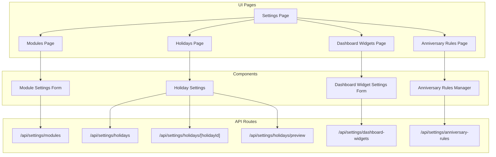
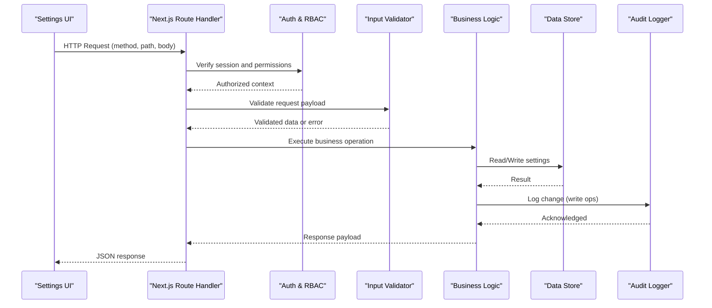
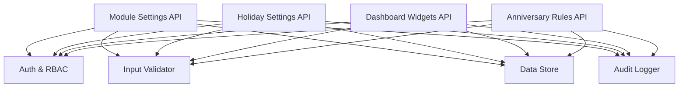

# Settings APIs

<cite>
**Referenced Files in This Document**
- [apps/hr-suite/app/api/settings/modules/route.ts](file://apps/hr-suite/app/api/settings/modules/route.ts)
- [apps/hr-suite/app/api/settings/holidays/route.ts](file://apps/hr-suite/app/api/settings/holidays/route.ts)
- [apps/hr-suite/app/api/settings/holidays/[holidayId]/route.ts](file://apps/hr-suite/app/api/settings/holidays/[holidayId]/route.ts)
- [apps/hr-suite/app/api/settings/holidays/preview/route.ts](file://apps/hr-suite/app/api/settings/holidays/preview/route.ts)
- [apps/hr-suite/app/api/settings/dashboard-widgets/route.ts](file://apps/hr-suite/app/api/settings/dashboard-widgets/route.ts)
- [apps/hr-suite/app/api/settings/anniversary-rules/route.ts](file://apps/hr-suite/app/api/settings/anniversary-rules/route.ts)
- [apps/hr-suite/components/settings/module-settings-form.tsx](file://apps/hr-suite/components/settings/module-settings-form.tsx)
- [apps/hr-suite/components/settings/holiday-settings.tsx](file://apps/hr-suite/components/settings/holiday-settings.tsx)
- [apps/hr-suite/components/settings/dashboard-widget-settings-form.tsx](file://apps/hr-suite/components/settings/dashboard-widget-settings-form.tsx)
- [apps/hr-suite/components/settings/anniversary-rules-manager.tsx](file://apps/hr-suite/components/settings/anniversary-rules-manager.tsx)
- [apps/hr-suite/app/(dashboard)/settings/page.tsx](file://apps/hr-suite/app/(dashboard)/settings/page.tsx)
- [apps/hr-suite/app/(dashboard)/settings/modules/page.tsx](file://apps/hr-suite/app/(dashboard)/settings/modules/page.tsx)
- [apps/hr-suite/app/(dashboard)/settings/holidays/page.tsx](file://apps/hr-suite/app/(dashboard)/settings/holidays/page.tsx)
- [apps/hr-suite/app/(dashboard)/settings/dashboard-widgets/page.tsx](file://apps/hr-suite/app/(dashboard)/settings/dashboard-widgets/page.tsx)
- [apps/hr-suite/app/(dashboard)/settings/anniversary-rules/page.tsx](file://apps/hr-suite/app/(dashboard)/settings/anniversary-rules/page.tsx)
</cite>

## Table of Contents
1. [Introduction](#introduction)
2. [Project Structure](#project-structure)
3. [Core Components](#core-components)
4. [Architecture Overview](#architecture-overview)
5. [Detailed Component Analysis](#detailed-component-analysis)
6. [Dependency Analysis](#dependency-analysis)
7. [Performance Considerations](#performance-considerations)
8. [Troubleshooting Guide](#troubleshooting-guide)
9. [Conclusion](#conclusion)
10. [Appendices](#appendices)

## Introduction
This document provides detailed API documentation for LiquidHR’s Settings management endpoints. It covers:
- Module configuration APIs to enable or disable system modules and manage feature availability
- Holiday management endpoints for creating, updating, previewing, and organizing company holidays and observances
- Dashboard widget settings for configuring default widgets and user preferences
- Anniversary rules configuration for automated notifications and celebrations

For each endpoint, the document specifies HTTP methods, URL patterns, request/response schemas, authentication requirements, validation rules, error handling, and practical examples for administration tasks, bulk updates, and integrations. Security considerations for sensitive settings and audit logging guidance are also included.

## Project Structure
The Settings APIs are implemented as Next.js App Router route handlers under apps/hr-suite/app/api/settings. Each subdirectory corresponds to a settings domain (modules, holidays, dashboard-widgets, anniversary-rules). The UI pages live under apps/hr-suite/app/(dashboard)/settings and call these APIs from their respective components.

**Diagram sources**
- [apps/hr-suite/app/api/settings/modules/route.ts](file://apps/hr-suite/app/api/settings/modules/route.ts)
- [apps/hr-suite/app/api/settings/holidays/route.ts](file://apps/hr-suite/app/api/settings/holidays/route.ts)
- [apps/hr-suite/app/api/settings/holidays/[holidayId]/route.ts](file://apps/hr-suite/app/api/settings/holidays/[holidayId]/route.ts)
- [apps/hr-suite/app/api/settings/holidays/preview/route.ts](file://apps/hr-suite/app/api/settings/holidays/preview/route.ts)
- [apps/hr-suite/app/api/settings/dashboard-widgets/route.ts](file://apps/hr-suite/app/api/settings/dashboard-widgets/route.ts)
- [apps/hr-suite/app/api/settings/anniversary-rules/route.ts](file://apps/hr-suite/app/api/settings/anniversary-rules/route.ts)
- [apps/hr-suite/app/(dashboard)/settings/page.tsx](file://apps/hr-suite/app/(dashboard)/settings/page.tsx)
- [apps/hr-suite/app/(dashboard)/settings/modules/page.tsx](file://apps/hr-suite/app/(dashboard)/settings/modules/page.tsx)
- [apps/hr-suite/app/(dashboard)/settings/holidays/page.tsx](file://apps/hr-suite/app/(dashboard)/settings/holidays/page.tsx)
- [apps/hr-suite/app/(dashboard)/settings/dashboard-widgets/page.tsx](file://apps/hr-suite/app/(dashboard)/settings/dashboard-widgets/page.tsx)
- [apps/hr-suite/app/(dashboard)/settings/anniversary-rules/page.tsx](file://apps/hr-suite/app/(dashboard)/settings/anniversary-rules/page.tsx)
- [apps/hr-suite/components/settings/module-settings-form.tsx](file://apps/hr-suite/components/settings/module-settings-form.tsx)
- [apps/hr-suite/components/settings/holiday-settings.tsx](file://apps/hr-suite/components/settings/holiday-settings.tsx)
- [apps/hr-suite/components/settings/dashboard-widget-settings-form.tsx](file://apps/hr-suite/components/settings/dashboard-widget-settings-form.tsx)
- [apps/hr-suite/components/settings/anniversary-rules-manager.tsx](file://apps/hr-suite/components/settings/anniversary-rules-manager.tsx)

**Section sources**
- [apps/hr-suite/app/(dashboard)/settings/page.tsx](file://apps/hr-suite/app/(dashboard)/settings/page.tsx)
- [apps/hr-suite/app/(dashboard)/settings/modules/page.tsx](file://apps/hr-suite/app/(dashboard)/settings/modules/page.tsx)
- [apps/hr-suite/app/(dashboard)/settings/holidays/page.tsx](file://apps/hr-suite/app/(dashboard)/settings/holidays/page.tsx)
- [apps/hr-suite/app/(dashboard)/settings/dashboard-widgets/page.tsx](file://apps/hr-suite/app/(dashboard)/settings/dashboard-widgets/page.tsx)
- [apps/hr-suite/app/(dashboard)/settings/anniversary-rules/page.tsx](file://apps/hr-suite/app/(dashboard)/settings/anniversary-rules/page.tsx)

## Core Components
- Module Configuration API: Enables/disables system modules and manages feature flags at tenant scope.
- Holiday Management API: CRUD operations for company holidays and observances with preview capabilities.
- Dashboard Widget Settings API: Configures default widgets and per-user preferences for dashboards.
- Anniversary Rules API: Defines automated notifications and celebration triggers based on employee anniversaries.

These components are exposed via REST-like route handlers and consumed by dedicated UI forms and managers.

**Section sources**
- [apps/hr-suite/app/api/settings/modules/route.ts](file://apps/hr-suite/app/api/settings/modules/route.ts)
- [apps/hr-suite/app/api/settings/holidays/route.ts](file://apps/hr-suite/app/api/settings/holidays/route.ts)
- [apps/hr-suite/app/api/settings/holidays/[holidayId]/route.ts](file://apps/hr-suite/app/api/settings/holidays/[holidayId]/route.ts)
- [apps/hr-suite/app/api/settings/holidays/preview/route.ts](file://apps/hr-suite/app/api/settings/holidays/preview/route.ts)
- [apps/hr-suite/app/api/settings/dashboard-widgets/route.ts](file://apps/hr-suite/app/api/settings/dashboard-widgets/route.ts)
- [apps/hr-suite/app/api/settings/anniversary-rules/route.ts](file://apps/hr-suite/app/api/settings/anniversary-rules/route.ts)
- [apps/hr-suite/components/settings/module-settings-form.tsx](file://apps/hr-suite/components/settings/module-settings-form.tsx)
- [apps/hr-suite/components/settings/holiday-settings.tsx](file://apps/hr-suite/components/settings/holiday-settings.tsx)
- [apps/hr-suite/components/settings/dashboard-widget-settings-form.tsx](file://apps/hr-suite/components/settings/dashboard-widget-settings-form.tsx)
- [apps/hr-suite/components/settings/anniversary-rules-manager.tsx](file://apps/hr-suite/components/settings/anniversary-rules-manager.tsx)

## Architecture Overview
The Settings APIs follow a consistent pattern:
- Authentication and authorization are enforced at the route level before business logic executes.
- Input validation is performed prior to persistence or computation.
- Responses are standardized with success payloads and structured error objects.
- Audit logging is recommended for write operations to track configuration changes.

[No sources needed since this diagram shows conceptual workflow, not actual code structure]

## Detailed Component Analysis

### Module Configuration API
Purpose: Enable/disable system modules and manage feature availability for the tenant.

Endpoints:
- GET /api/settings/modules
  - Description: Retrieve current module states and feature flags.
  - Authentication: Required (tenant admin or equivalent role).
  - Response schema:
    - modules: array of module entries
      - id: string
      - name: string
      - enabled: boolean
      - features: object mapping feature keys to booleans
    - updatedAt: timestamp
- PATCH /api/settings/modules
  - Description: Update module states and feature flags in bulk.
  - Authentication: Required (tenant admin or equivalent role).
  - Request schema:
    - modules: array of module updates
      - id: string
      - enabled: boolean
      - features: object mapping feature keys to booleans
  - Validation rules:
    - All module ids must exist in catalog.
    - enabled must be boolean.
    - Feature keys must be valid for the module.
  - Response schema:
    - updated: number
    - modules: array of updated module entries
    - updatedAt: timestamp
  - Error handling:
    - 400 Bad Request for invalid payloads.
    - 403 Forbidden if insufficient permissions.
    - 500 Internal Server Error for unexpected failures.

Practical examples:
- Bulk enable modules: Send PATCH with multiple module updates setting enabled to true.
- Disable a feature flag: Include the specific feature key set to false within the module update.

Security considerations:
- Restrict writes to administrators.
- Log all changes to an audit trail including who changed what and when.

**Section sources**
- [apps/hr-suite/app/api/settings/modules/route.ts](file://apps/hr-suite/app/api/settings/modules/route.ts)
- [apps/hr-suite/components/settings/module-settings-form.tsx](file://apps/hr-suite/components/settings/module-settings-form.tsx)
- [apps/hr-suite/app/(dashboard)/settings/modules/page.tsx](file://apps/hr-suite/app/(dashboard)/settings/modules/page.tsx)

### Holiday Management API
Purpose: Create, update, organize, and preview company holidays and observances.

Endpoints:
- GET /api/settings/holidays
  - Description: List all holidays for the current tenant/year range.
  - Authentication: Required (tenant admin or HR role).
  - Query parameters:
    - year: integer (default current year)
  - Response schema:
    - holidays: array of holiday entries
      - id: string
      - name: string
      - date: date
      - type: enum (public_holiday, company_observance, custom)
      - recurring: boolean
      - notes: string
    - total: number
- POST /api/settings/holidays
  - Description: Create a new holiday or observance.
  - Authentication: Required (tenant admin or HR role).
  - Request schema:
    - name: string (required, non-empty)
    - date: date (required, valid future or past date)
    - type: enum (public_holiday, company_observance, custom)
    - recurring: boolean
    - notes: string
  - Validation rules:
    - Duplicate names on the same date are rejected.
    - Date must be valid ISO format.
  - Response schema:
    - id: string
    - name: string
    - date: date
    - type: enum
    - recurring: boolean
    - notes: string
    - createdAt: timestamp
- GET /api/settings/holidays/[holidayId]
  - Description: Retrieve details of a specific holiday.
  - Authentication: Required.
  - Response schema: Same as individual holiday entry.
- PATCH /api/settings/holidays/[holidayId]
  - Description: Update an existing holiday.
  - Authentication: Required.
  - Request schema: Partial fields allowed; same constraints as create.
  - Response schema: Updated holiday entry.
- DELETE /api/settings/holidays/[holidayId]
  - Description: Remove a holiday.
  - Authentication: Required.
  - Response schema:
    - deleted: boolean
- GET /api/settings/holidays/preview
  - Description: Preview how holidays affect leave calculations or calendar views without persisting changes.
  - Authentication: Required.
  - Request schema:
    - year: integer
    - includeRecurring: boolean
  - Response schema:
    - effectiveDates: array of dates
    - impactSummary: object with counts and affected periods

Practical examples:
- Add a new company observance: POST with type company_observance and a descriptive name.
- Organize holidays: Use PATCH to reorder or adjust recurring flags; use preview to validate impacts.

Error handling:
- 400 Bad Request for invalid inputs.
- 404 Not Found for missing holiday id.
- 403 Forbidden for unauthorized users.
- 500 Internal Server Error for server-side issues.

**Section sources**
- [apps/hr-suite/app/api/settings/holidays/route.ts](file://apps/hr-suite/app/api/settings/holidays/route.ts)
- [apps/hr-suite/app/api/settings/holidays/[holidayId]/route.ts](file://apps/hr-suite/app/api/settings/holidays/[holidayId]/route.ts)
- [apps/hr-suite/app/api/settings/holidays/preview/route.ts](file://apps/hr-suite/app/api/settings/holidays/preview/route.ts)
- [apps/hr-suite/components/settings/holiday-settings.tsx](file://apps/hr-suite/components/settings/holiday-settings.tsx)
- [apps/hr-suite/app/(dashboard)/settings/holidays/page.tsx](file://apps/hr-suite/app/(dashboard)/settings/holidays/page.tsx)

### Dashboard Widget Settings API
Purpose: Configure default widgets and user preferences for dashboards.

Endpoints:
- GET /api/settings/dashboard-widgets
  - Description: Retrieve default widget configuration and user-specific overrides.
  - Authentication: Required.
  - Response schema:
    - defaults: array of widget definitions
      - id: string
      - type: string
      - title: string
      - layout: object (position, size)
      - options: object
    - userOverrides: object mapping userId to widget arrays
- PATCH /api/settings/dashboard-widgets
  - Description: Update default widgets or user overrides.
  - Authentication: Required (admin for defaults; user for own overrides).
  - Request schema:
    - defaults?: array of widget definitions
    - userOverrides?: object mapping userId to widget arrays
  - Validation rules:
    - Widget types must be supported.
    - Layout values must be numeric and within bounds.
  - Response schema:
    - updatedDefaults?: array
    - updatedUserOverrides?: object
    - updatedAt: timestamp

Practical examples:
- Set default widgets for all users: PATCH with defaults array containing supported widget types and layouts.
- Personalize dashboard: PATCH with userOverrides for the current user’s widget arrangement.

Security considerations:
- Enforce tenant isolation for defaults.
- Ensure users can only modify their own overrides.

**Section sources**
- [apps/hr-suite/app/api/settings/dashboard-widgets/route.ts](file://apps/hr-suite/app/api/settings/dashboard-widgets/route.ts)
- [apps/hr-suite/components/settings/dashboard-widget-settings-form.tsx](file://apps/hr-suite/components/settings/dashboard-widget-settings-form.tsx)
- [apps/hr-suite/app/(dashboard)/settings/dashboard-widgets/page.tsx](file://apps/hr-suite/app/(dashboard)/settings/dashboard-widgets/page.tsx)

### Anniversary Rules API
Purpose: Define automated notifications and celebrations triggered by employee anniversaries.

Endpoints:
- GET /api/settings/anniversary-rules
  - Description: List all anniversary rules for the tenant.
  - Authentication: Required (tenant admin or HR role).
  - Response schema:
    - rules: array of rule entries
      - id: string
      - name: string
      - trigger: enum (work_anniversary, hire_date, custom)
      - schedule: object (frequency, channels)
      - messageTemplate: string
      - enabled: boolean
- POST /api/settings/anniversary-rules
  - Description: Create a new anniversary rule.
  - Authentication: Required.
  - Request schema:
    - name: string (required)
    - trigger: enum
    - schedule: object (frequency: daily/weekly/monthly; channels: email/in-app)
    - messageTemplate: string (must contain placeholders like {employeeName}, {anniversaryDate})
    - enabled: boolean
  - Validation rules:
    - Template placeholders must be valid.
    - Frequency must match supported enums.
  - Response schema: Created rule entry.
- PATCH /api/settings/anniversary-rules
  - Description: Update existing rules in bulk or individually.
  - Authentication: Required.
  - Request schema: Array of rule updates or single rule patch.
  - Response schema: Updated rules list.
- DELETE /api/settings/anniversary-rules/:id
  - Description: Remove a rule.
  - Authentication: Required.
  - Response schema:
    - deleted: boolean

Practical examples:
- Automate work anniversary emails: POST with trigger work_anniversary, frequency monthly, and a personalized message template.
- Toggle rule activation: PATCH to set enabled to false for temporary pauses.

Error handling:
- 400 Bad Request for invalid templates or unsupported enums.
- 404 Not Found for missing rule id.
- 403 Forbidden for unauthorized users.
- 500 Internal Server Error for server-side issues.

**Section sources**
- [apps/hr-suite/app/api/settings/anniversary-rules/route.ts](file://apps/hr-suite/app/api/settings/anniversary-rules/route.ts)
- [apps/hr-suite/components/settings/anniversary-rules-manager.tsx](file://apps/hr-suite/components/settings/anniversary-rules-manager.tsx)
- [apps/hr-suite/app/(dashboard)/settings/anniversary-rules/page.tsx](file://apps/hr-suite/app/(dashboard)/settings/anniversary-rules/page.tsx)

## Dependency Analysis
The Settings APIs depend on:
- Authentication and RBAC middleware to enforce access control.
- Validators to ensure input integrity.
- Data store services for persistence and retrieval.
- Optional audit logger for tracking configuration changes.

[No sources needed since this diagram shows conceptual dependencies, not direct file mappings]

## Performance Considerations
- Batch operations: Prefer bulk PATCH endpoints to minimize network overhead.
- Caching: Cache read-only configurations (e.g., module catalogs, widget definitions) where appropriate.
- Pagination: For large datasets (e.g., holidays across years), implement pagination or filtering.
- Validation efficiency: Perform early validation to avoid expensive computations.
- Concurrency: Use optimistic updates in UI to improve responsiveness while background jobs persist changes.

[No sources needed since this section provides general guidance]

## Troubleshooting Guide
Common issues and resolutions:
- Invalid input errors:
  - Check required fields and enum values.
  - Validate date formats and placeholder syntax in templates.
- Authorization failures:
  - Confirm user roles have sufficient permissions.
  - Ensure tenant context is correctly resolved.
- Unexpected server errors:
  - Inspect logs for stack traces.
  - Verify database connectivity and permissions.
- Audit log gaps:
  - Ensure write operations invoke the audit logger.
  - Check for transaction rollbacks that might skip logging.

**Section sources**
- [apps/hr-suite/app/api/settings/modules/route.ts](file://apps/hr-suite/app/api/settings/modules/route.ts)
- [apps/hr-suite/app/api/settings/holidays/route.ts](file://apps/hr-suite/app/api/settings/holidays/route.ts)
- [apps/hr-suite/app/api/settings/holidays/[holidayId]/route.ts](file://apps/hr-suite/app/api/settings/holidays/[holidayId]/route.ts)
- [apps/hr-suite/app/api/settings/holidays/preview/route.ts](file://apps/hr-suite/app/api/settings/holidays/preview/route.ts)
- [apps/hr-suite/app/api/settings/dashboard-widgets/route.ts](file://apps/hr-suite/app/api/settings/dashboard-widgets/route.ts)
- [apps/hr-suite/app/api/settings/anniversary-rules/route.ts](file://apps/hr-suite/app/api/settings/anniversary-rules/route.ts)

## Conclusion
LiquidHR’s Settings APIs provide a robust foundation for managing modules, holidays, dashboard widgets, and anniversary rules. By adhering to the documented schemas, validation rules, and security practices, administrators can confidently configure system behavior and automate HR processes. Integrations should leverage batch endpoints and respect authentication boundaries, while audit logging ensures traceability of all configuration changes.

[No sources needed since this section summarizes without analyzing specific files]

## Appendices

### Practical Administration Tasks
- Bulk enable modules:
  - Use PATCH /api/settings/modules with an array of module updates.
  - Example payload includes module ids and enabled flags.
- Organize company holidays:
  - Create new observances via POST /api/settings/holidays.
  - Preview impacts using GET /api/settings/holidays/preview.
- Customize dashboards:
  - Set default widgets with PATCH /api/settings/dashboard-widgets.
  - Apply user-specific overrides for personalization.
- Automate anniversary notifications:
  - Define rules via POST /api/settings/anniversary-rules.
  - Test templates and schedules before enabling.

### Integration Examples
- External HRIS sync:
  - Sync holiday calendars by polling GET /api/settings/holidays and applying deltas via PATCH.
- Notification systems:
  - Consume anniversary rule outputs to trigger external messaging platforms.

### Security Considerations
- Sensitive settings:
  - Encrypt stored templates and credentials.
  - Limit access to administrators and HR roles.
- Audit logging:
  - Record who changed what, when, and why.
  - Retain logs for compliance and troubleshooting.

[No sources needed since this section provides general guidance]