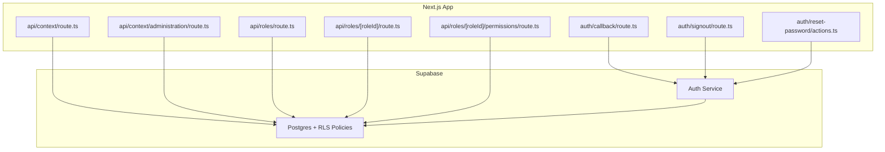
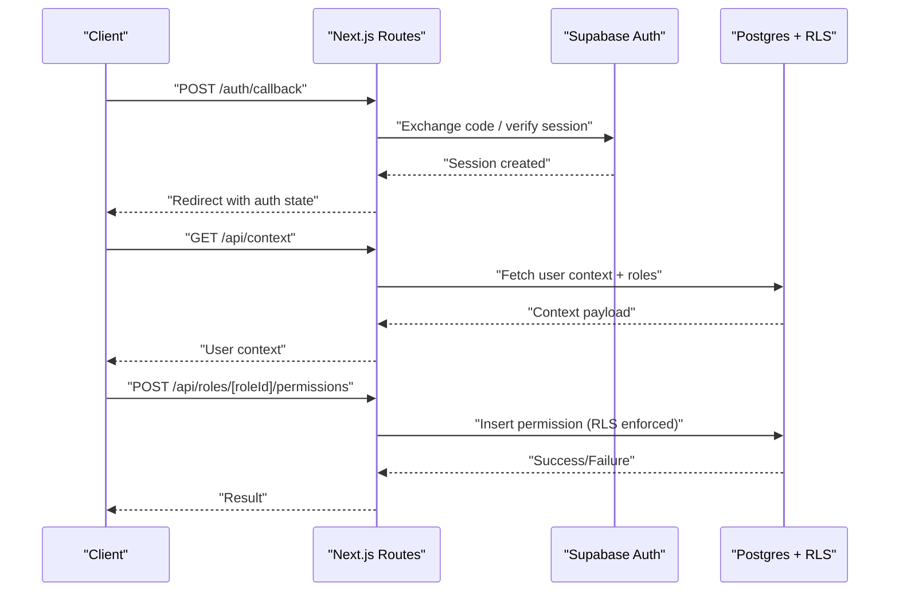
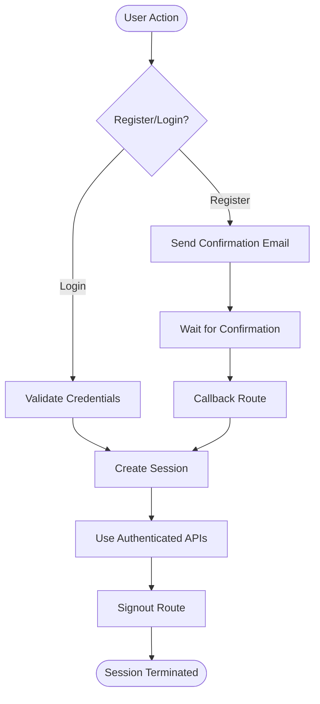
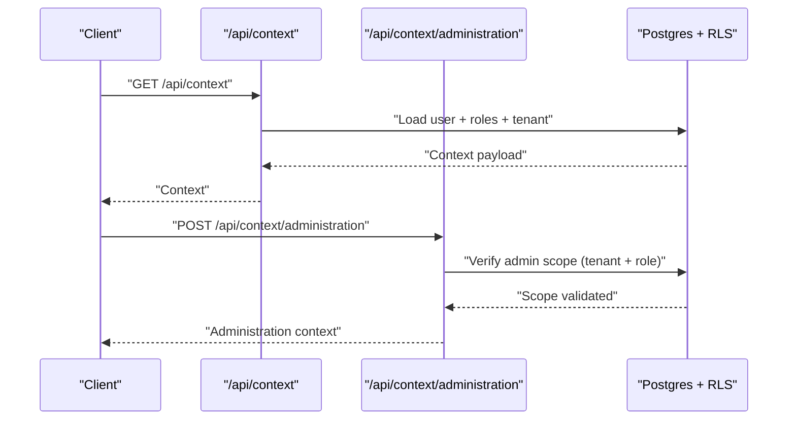
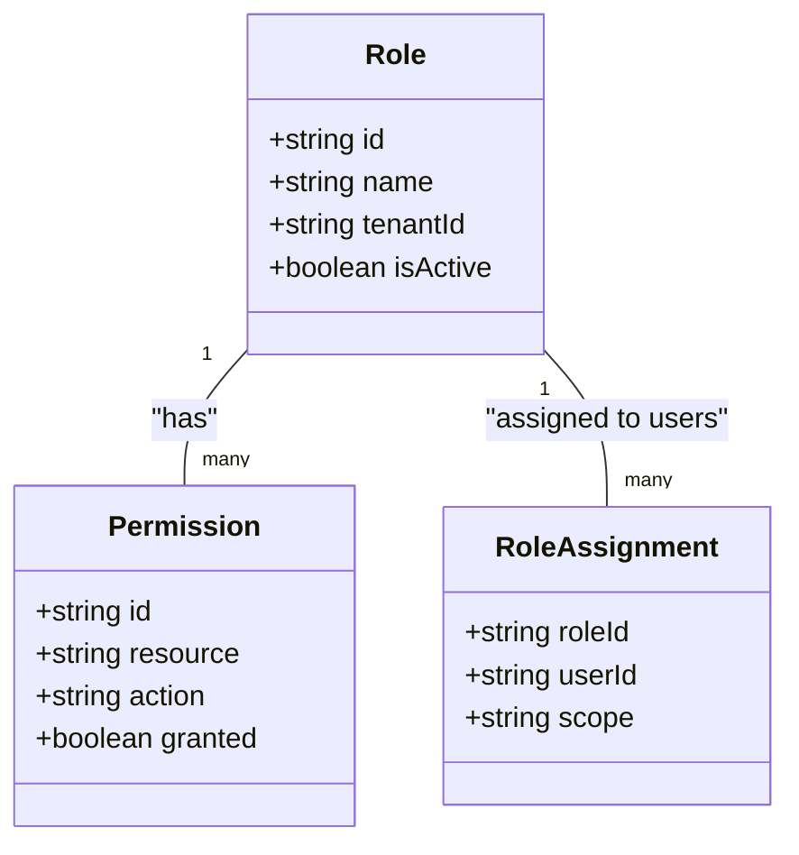
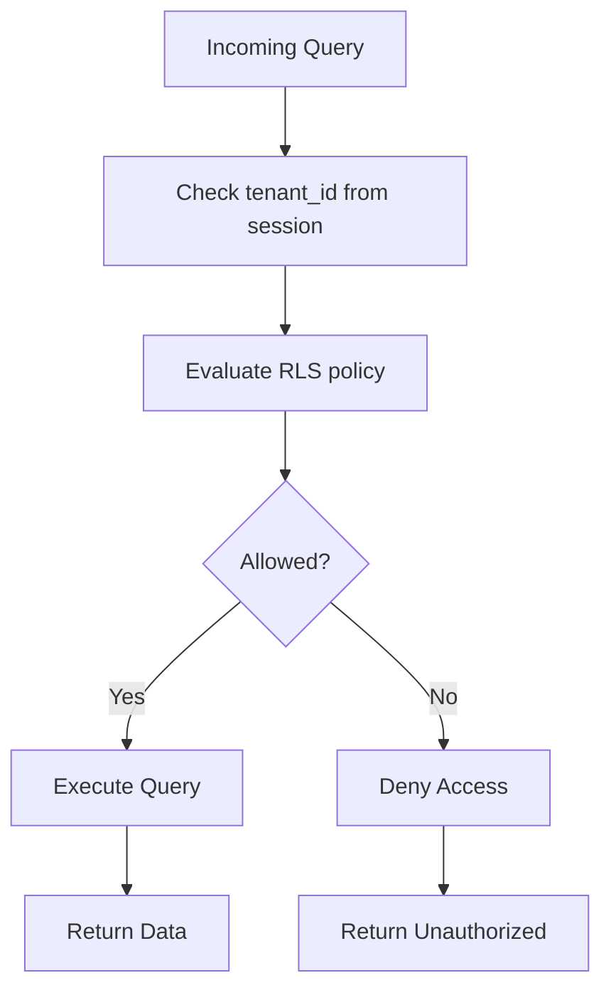
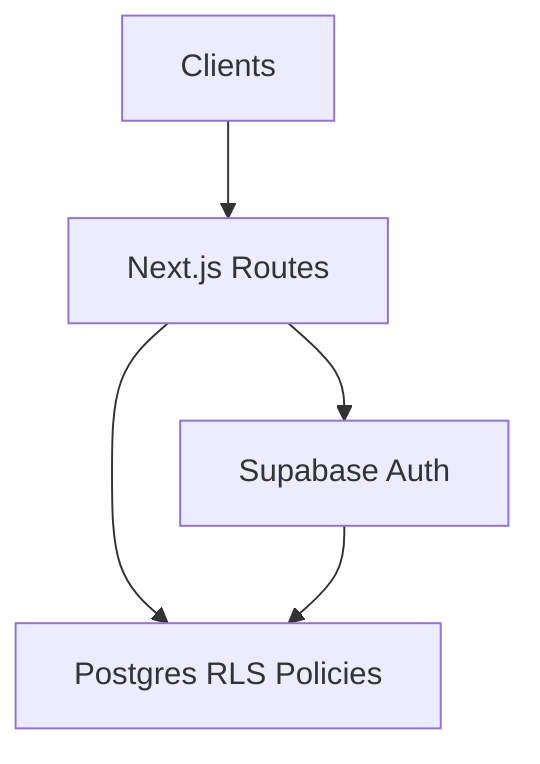

# Authentication & Security

<cite>
**Referenced Files in This Document**
- [apps/hr-suite/app/auth/callback/route.ts](file://apps/hr-suite/app/auth/callback/route.ts)
- [apps/hr-suite/app/auth/reset-password/actions.ts](file://apps/hr-suite/app/auth/reset-password/actions.ts)
- [apps/hr-suite/app/auth/signout/route.ts](file://apps/hr-suite/app/auth/signout/route.ts)
- [apps/hr-suite/app/api/context/route.ts](file://apps/hr-suite/app/api/context/route.ts)
- [apps/hr-suite/app/api/context/administration/route.ts](file://apps/hr-suite/app/api/context/administration/route.ts)
- [apps/hr-suite/app/api/roles/route.ts](file://apps/hr-suite/app/api/roles/route.ts)
- [apps/hr-suite/app/api/roles/[roleId]/route.ts](file://apps/hr-suite/app/api/roles/[roleId]/route.ts)
- [apps/hr-suite/app/api/roles/[roleId]/permissions/route.ts](file://apps/hr-suite/app/api/roles/[roleId]/permissions/route.ts)
- [apps/hr-suite/supabase/migrations/20260712124911_add_tenant_rbac_and_organization.sql](file://apps/hr-suite/supabase/migrations/20260712124911_add_tenant_rbac_and_organization.sql)
- [apps/hr-suite/supabase/migrations/20260715070404_add_user_preferences.sql](file://apps/hr-suite/supabase/migrations/20260715070404_add_user_preferences.sql)
- [apps/hr-suite/supabase/migrations/20260715071054_add_employee_identity_matching.sql](file://apps/hr-suite/supabase/migrations/20260715071054_add_employee_identity_matching.sql)
- [apps/hr-suite/supabase/migrations/20260715123639_add_organization_authorization_management.sql](file://apps/hr-suite/supabase/migrations/20260715123639_add_organization_authorization_management.sql)
- [apps/hr-suite/supabase/migrations/20260715124506_isolate_employee_secure_identifiers.sql](file://apps/hr-suite/supabase/migrations/20260715124506_isolate_employee_secure_identifiers.sql)
- [apps/hr-suite/supabase/migrations/20260715131230_seed_custom_fields_and_tenant_roles.sql](file://apps/hr-suite/supabase/migrations/20260715131230_seed_custom_fields_and_tenant_roles.sql)
- [apps/hr-suite/supabase/migrations/20260724112407_add_role_assignment_scope.sql](file://apps/hr-suite/supabase/migrations/20260724112407_add_role_assignment_scope.sql)
- [apps/hr-suite/supabase/tests/multitenancy_isolation.sql](file://apps/hr-suite/supabase/tests/multitenancy_isolation.sql)
- [apps/hr-suite/supabase/tests/user_invitation_isolation.sql](file://apps/hr-suite/supabase/tests/user_invitation_isolation.sql)
- [apps/hr-suite/supabase/config.toml](file://apps/hr-suite/supabase/config.toml)
- [apps/hr-suite/lib/supabase/client.ts](file://apps/hr-suite/lib/supabase/client.ts)
- [apps/hr-suite/lib/security/index.ts](file://apps/hr-suite/lib/security/index.ts)
</cite>

## Table of Contents
1. [Introduction](#introduction)
2. [Project Structure](#project-structure)
3. [Core Components](#core-components)
4. [Architecture Overview](#architecture-overview)
5. [Detailed Component Analysis](#detailed-component-analysis)
6. [Dependency Analysis](#dependency-analysis)
7. [Performance Considerations](#performance-considerations)
8. [Troubleshooting Guide](#troubleshooting-guide)
9. [Conclusion](#conclusion)
10. [Appendices](#appendices)

## Introduction
This document explains LiquidHR’s authentication and security model, focusing on Supabase Auth integration, Row Level Security (RLS) policies for tenant and user isolation, and role-based authorization APIs. It covers user registration flows, login, password reset, session management, multi-tenancy boundaries, and secure API patterns. It also provides best practices for input validation, output sanitization, and protection against common vulnerabilities, along with examples of error handling and debugging strategies.

## Project Structure
Authentication and authorization are implemented across Next.js App Router routes, Supabase migrations, and shared libraries:
- Authentication endpoints: callback, signout, and password reset actions
- Authorization context and administration scoping via API routes
- RBAC and tenant isolation via Supabase RLS policies and migrations
- Client-side Supabase client configuration and security utilities

**Diagram sources**
- [apps/hr-suite/app/auth/callback/route.ts](file://apps/hr-suite/app/auth/callback/route.ts)
- [apps/hr-suite/app/auth/signout/route.ts](file://apps/hr-suite/app/auth/signout/route.ts)
- [apps/hr-suite/app/auth/reset-password/actions.ts](file://apps/hr-suite/app/auth/reset-password/actions.ts)
- [apps/hr-suite/app/api/context/route.ts](file://apps/hr-suite/app/api/context/route.ts)
- [apps/hr-suite/app/api/context/administration/route.ts](file://apps/hr-suite/app/api/context/administration/route.ts)
- [apps/hr-suite/app/api/roles/route.ts](file://apps/hr-suite/app/api/roles/route.ts)
- [apps/hr-suite/app/api/roles/[roleId]/route.ts](file://apps/hr-suite/app/api/roles/[roleId]/route.ts)
- [apps/hr-suite/app/api/roles/[roleId]/permissions/route.ts](file://apps/hr-suite/app/api/roles/[roleId]/permissions/route.ts)

**Section sources**
- [apps/hr-suite/app/auth/callback/route.ts](file://apps/hr-suite/app/auth/callback/route.ts)
- [apps/hr-suite/app/auth/signout/route.ts](file://apps/hr-suite/app/auth/signout/route.ts)
- [apps/hr-suite/app/auth/reset-password/actions.ts](file://apps/hr-suite/app/auth/reset-password/actions.ts)
- [apps/hr-suite/app/api/context/route.ts](file://apps/hr-suite/app/api/context/route.ts)
- [apps/hr-suite/app/api/context/administration/route.ts](file://apps/hr-suite/app/api/context/administration/route.ts)
- [apps/hr-suite/app/api/roles/route.ts](file://apps/hr-suite/app/api/roles/route.ts)
- [apps/hr-suite/app/api/roles/[roleId]/route.ts](file://apps/hr-suite/app/api/roles/[roleId]/route.ts)
- [apps/hr-suite/app/api/roles/[roleId]/permissions/route.ts](file://apps/hr-suite/app/api/roles/[roleId]/permissions/route.ts)

## Core Components
- Supabase Auth integration:
  - Callback handling to finalize sessions after email confirmation or OAuth flows
  - Signout endpoint to terminate sessions server-side
  - Password reset action to initiate secure token-based recovery
- Context and Administration APIs:
  - Current user context retrieval with tenant and role metadata
  - Administration boundary enforcement per tenant
- Role-Based Access Control (RBAC):
  - Role CRUD endpoints
  - Permission assignment and querying per role
- Row Level Security (RLS):
  - Tenant-scoped data isolation
  - User-scoped access within a tenant
  - Secure identifier isolation for sensitive employee data

Key implementation references:
- Session lifecycle: [callback route](file://apps/hr-suite/app/auth/callback/route.ts), [signout route](file://apps/hr-suite/app/auth/signout/route.ts)
- Password reset flow: [reset password actions](file://apps/hr-suite/app/auth/reset-password/actions.ts)
- Context and admin scope: [context route](file://apps/hr-suite/app/api/context/route.ts), [administration route](file://apps/hr-suite/app/api/context/administration/route.ts)
- RBAC endpoints: [roles route](file://apps/hr-suite/app/api/roles/route.ts), [role detail route](file://apps/hr-suite/app/api/roles/[roleId]/route.ts), [permissions route](file://apps/hr-suite/app/api/roles/[roleId]/permissions/route.ts)
- RLS policies and schema: [tenant/RBAC migration](file://apps/hr-suite/supabase/migrations/20260712124911_add_tenant_rbac_and_organization.sql), [user preferences](file://apps/hr-suite/supabase/migrations/20260715070404_add_user_preferences.sql), [employee identity matching](file://apps/hr-suite/supabase/migrations/20260715071054_add_employee_identity_matching.sql), [authorization management](file://apps/hr-suite/supabase/migrations/20260715123639_add_organization_authorization_management.sql), [secure identifiers](file://apps/hr-suite/supabase/migrations/20260715124506_isolate_employee_secure_identifiers.sql), [seed roles](file://apps/hr-suite/supabase/migrations/20260715131230_seed_custom_fields_and_tenant_roles.sql), [role assignment scope](file://apps/hr-suite/supabase/migrations/20260724112407_add_role_assignment_scope.sql)

**Section sources**
- [apps/hr-suite/app/auth/callback/route.ts](file://apps/hr-suite/app/auth/callback/route.ts)
- [apps/hr-suite/app/auth/signout/route.ts](file://apps/hr-suite/app/auth/signout/route.ts)
- [apps/hr-suite/app/auth/reset-password/actions.ts](file://apps/hr-suite/app/auth/reset-password/actions.ts)
- [apps/hr-suite/app/api/context/route.ts](file://apps/hr-suite/app/api/context/route.ts)
- [apps/hr-suite/app/api/context/administration/route.ts](file://apps/hr-suite/app/api/context/administration/route.ts)
- [apps/hr-suite/app/api/roles/route.ts](file://apps/hr-suite/app/api/roles/route.ts)
- [apps/hr-suite/app/api/roles/[roleId]/route.ts](file://apps/hr-suite/app/api/roles/[roleId]/route.ts)
- [apps/hr-suite/app/api/roles/[roleId]/permissions/route.ts](file://apps/hr-suite/app/api/roles/[roleId]/permissions/route.ts)
- [apps/hr-suite/supabase/migrations/20260712124911_add_tenant_rbac_and_organization.sql](file://apps/hr-suite/supabase/migrations/20260712124911_add_tenant_rbac_and_organization.sql)
- [apps/hr-suite/supabase/migrations/20260715070404_add_user_preferences.sql](file://apps/hr-suite/supabase/migrations/20260715070404_add_user_preferences.sql)
- [apps/hr-suite/supabase/migrations/20260715071054_add_employee_identity_matching.sql](file://apps/hr-suite/supabase/migrations/20260715071054_add_employee_identity_matching.sql)
- [apps/hr-suite/supabase/migrations/20260715123639_add_organization_authorization_management.sql](file://apps/hr-suite/supabase/migrations/20260715123639_add_organization_authorization_management.sql)
- [apps/hr-suite/supabase/migrations/20260715124506_isolate_employee_secure_identifiers.sql](file://apps/hr-suite/supabase/migrations/20260715124506_isolate_employee_secure_identifiers.sql)
- [apps/hr-suite/supabase/migrations/20260715131230_seed_custom_fields_and_tenant_roles.sql](file://apps/hr-suite/supabase/migrations/20260715131230_seed_custom_fields_and_tenant_roles.sql)
- [apps/hr-suite/supabase/migrations/20260724112407_add_role_assignment_scope.sql](file://apps/hr-suite/supabase/migrations/20260724112407_add_role_assignment_scope.sql)

## Architecture Overview
The authentication and authorization architecture combines Supabase Auth for identity, Next.js App Router for API endpoints, and Postgres RLS for fine-grained data isolation.

**Diagram sources**
- [apps/hr-suite/app/auth/callback/route.ts](file://apps/hr-suite/app/auth/callback/route.ts)
- [apps/hr-suite/app/api/context/route.ts](file://apps/hr-suite/app/api/context/route.ts)
- [apps/hr-suite/app/api/roles/[roleId]/permissions/route.ts](file://apps/hr-suite/app/api/roles/[roleId]/permissions/route.ts)

## Detailed Component Analysis

### Supabase Auth Integration
- Registration and Login:
  - Handled by Supabase Auth; Next.js routes manage callbacks and redirects
  - Email confirmation flows are finalized in the callback route
- Password Reset:
  - Initiated via reset password actions; tokens are managed securely by Supabase
- Session Management:
  - Server-side signout terminates sessions
  - Client-side Supabase client maintains session state

**Diagram sources**
- [apps/hr-suite/app/auth/callback/route.ts](file://apps/hr-suite/app/auth/callback/route.ts)
- [apps/hr-suite/app/auth/reset-password/actions.ts](file://apps/hr-suite/app/auth/reset-password/actions.ts)
- [apps/hr-suite/app/auth/signout/route.ts](file://apps/hr-suite/app/auth/signout/route.ts)

**Section sources**
- [apps/hr-suite/app/auth/callback/route.ts](file://apps/hr-suite/app/auth/callback/route.ts)
- [apps/hr-suite/app/auth/reset-password/actions.ts](file://apps/hr-suite/app/auth/reset-password/actions.ts)
- [apps/hr-suite/app/auth/signout/route.ts](file://apps/hr-suite/app/auth/signout/route.ts)

### Authorization Context and Administration Boundaries
- Context API:
  - Returns authenticated user metadata, current tenant, and role information
- Administration Scope:
  - Enforces that administrative operations are scoped to the user’s assigned administration
- Input Validation:
  - Validates tenant identifiers and role IDs before processing requests

**Diagram sources**
- [apps/hr-suite/app/api/context/route.ts](file://apps/hr-suite/app/api/context/route.ts)
- [apps/hr-suite/app/api/context/administration/route.ts](file://apps/hr-suite/app/api/context/administration/route.ts)

**Section sources**
- [apps/hr-suite/app/api/context/route.ts](file://apps/hr-suite/app/api/context/route.ts)
- [apps/hr-suite/app/api/context/administration/route.ts](file://apps/hr-suite/app/api/context/administration/route.ts)

### Role-Based Access Control (RBAC)
- Roles:
  - CRUD endpoints for managing roles within a tenant
- Permissions:
  - Assign permissions to roles; query effective permissions
- Scoping:
  - Role assignments include scope constraints to limit authority

**Diagram sources**
- [apps/hr-suite/app/api/roles/route.ts](file://apps/hr-suite/app/api/roles/route.ts)
- [apps/hr-suite/app/api/roles/[roleId]/route.ts](file://apps/hr-suite/app/api/roles/[roleId]/route.ts)
- [apps/hr-suite/app/api/roles/[roleId]/permissions/route.ts](file://apps/hr-suite/app/api/roles/[roleId]/permissions/route.ts)
- [apps/hr-suite/supabase/migrations/20260712124911_add_tenant_rbac_and_organization.sql](file://apps/hr-suite/supabase/migrations/20260712124911_add_tenant_rbac_and_organization.sql)
- [apps/hr-suite/supabase/migrations/20260724112407_add_role_assignment_scope.sql](file://apps/hr-suite/supabase/migrations/20260724112407_add_role_assignment_scope.sql)

**Section sources**
- [apps/hr-suite/app/api/roles/route.ts](file://apps/hr-suite/app/api/roles/route.ts)
- [apps/hr-suite/app/api/roles/[roleId]/route.ts](file://apps/hr-suite/app/api/roles/[roleId]/route.ts)
- [apps/hr-suite/app/api/roles/[roleId]/permissions/route.ts](file://apps/hr-suite/app/api/roles/[roleId]/permissions/route.ts)
- [apps/hr-suite/supabase/migrations/20260712124911_add_tenant_rbac_and_organization.sql](file://apps/hr-suite/supabase/migrations/20260712124911_add_tenant_rbac_and_organization.sql)
- [apps/hr-suite/supabase/migrations/20260724112407_add_role_assignment_scope.sql](file://apps/hr-suite/supabase/migrations/20260724112407_add_role_assignment_scope.sql)

### Row Level Security (RLS) and Multi-Tenancy
- Tenant Isolation:
  - All queries enforce tenant_id filters via RLS policies
- User Isolation:
  - Users can only access data associated with their identity within the tenant
- Secure Identifiers:
  - Employee sensitive fields are isolated and require explicit permissions

**Diagram sources**
- [apps/hr-suite/supabase/migrations/20260712124911_add_tenant_rbac_and_organization.sql](file://apps/hr-suite/supabase/migrations/20260712124911_add_tenant_rbac_and_organization.sql)
- [apps/hr-suite/supabase/migrations/20260715124506_isolate_employee_secure_identifiers.sql](file://apps/hr-suite/supabase/migrations/20260715124506_isolate_employee_secure_identifiers.sql)
- [apps/hr-suite/supabase/tests/multitenancy_isolation.sql](file://apps/hr-suite/supabase/tests/multitenancy_isolation.sql)

**Section sources**
- [apps/hr-suite/supabase/migrations/20260712124911_add_tenant_rbac_and_organization.sql](file://apps/hr-suite/supabase/migrations/20260712124911_add_tenant_rbac_and_organization.sql)
- [apps/hr-suite/supabase/migrations/20260715124506_isolate_employee_secure_identifiers.sql](file://apps/hr-suite/supabase/migrations/20260715124506_isolate_employee_secure_identifiers.sql)
- [apps/hr-suite/supabase/tests/multitenancy_isolation.sql](file://apps/hr-suite/supabase/tests/multitenancy_isolation.sql)

### Token Management and Headers
- Authentication Headers:
  - Requests must include Supabase session tokens in headers
- Token Lifecycle:
  - Tokens are refreshed automatically by the Supabase client
- Best Practices:
  - Avoid logging tokens
  - Store tokens securely and minimize exposure

References:
- Supabase client configuration: [client.ts](file://apps/hr-suite/lib/supabase/client.ts)
- Supabase configuration: [config.toml](file://apps/hr-suite/supabase/config.toml)

**Section sources**
- [apps/hr-suite/lib/supabase/client.ts](file://apps/hr-suite/lib/supabase/client.ts)
- [apps/hr-suite/supabase/config.toml](file://apps/hr-suite/supabase/config.toml)

### Security Best Practices
- Input Validation:
  - Validate all inputs at API boundaries; reject malformed or unexpected values
- Output Sanitization:
  - Ensure responses do not leak sensitive data; filter fields based on permissions
- Protection Against Vulnerabilities:
  - Enforce RLS to prevent unauthorized data access
  - Use least privilege principles for roles and permissions
  - Implement rate limiting and audit logging where applicable

[No sources needed since this section provides general guidance]

## Dependency Analysis
The authentication and authorization components depend on Supabase Auth and Postgres RLS policies. Next.js routes orchestrate flows and enforce business rules before delegating to the database.

**Diagram sources**
- [apps/hr-suite/app/auth/callback/route.ts](file://apps/hr-suite/app/auth/callback/route.ts)
- [apps/hr-suite/app/api/context/route.ts](file://apps/hr-suite/app/api/context/route.ts)
- [apps/hr-suite/supabase/migrations/20260712124911_add_tenant_rbac_and_organization.sql](file://apps/hr-suite/supabase/migrations/20260712124911_add_tenant_rbac_and_organization.sql)

**Section sources**
- [apps/hr-suite/app/auth/callback/route.ts](file://apps/hr-suite/app/auth/callback/route.ts)
- [apps/hr-suite/app/api/context/route.ts](file://apps/hr-suite/app/api/context/route.ts)
- [apps/hr-suite/supabase/migrations/20260712124911_add_tenant_rbac_and_organization.sql](file://apps/hr-suite/supabase/migrations/20260712124911_add_tenant_rbac_and_organization.sql)

## Performance Considerations
- Minimize round-trips by batching context and role queries
- Cache frequently accessed role and permission sets where appropriate
- Leverage database indexes defined in migrations for efficient filtering
- Avoid unnecessary token refreshes by using long-lived sessions when safe

[No sources needed since this section provides general guidance]

## Troubleshooting Guide
Common issues and debugging steps:
- Authentication failures:
  - Verify callback URL configuration and environment variables
  - Check Supabase logs for auth errors
- Authorization denials:
  - Inspect RLS policies and ensure tenant_id matches session context
  - Validate role assignments and scopes
- Session problems:
  - Ensure tokens are present in headers and not expired
  - Review client-side session storage and refresh logic

References:
- Test suites for isolation and invitation acceptance:
  - [multitenancy_isolation.sql](file://apps/hr-suite/supabase/tests/multitenancy_isolation.sql)
  - [user_invitation_isolation.sql](file://apps/hr-suite/supabase/tests/user_invitation_isolation.sql)

**Section sources**
- [apps/hr-suite/supabase/tests/multitenancy_isolation.sql](file://apps/hr-suite/supabase/tests/multitenancy_isolation.sql)
- [apps/hr-suite/supabase/tests/user_invitation_isolation.sql](file://apps/hr-suite/supabase/tests/user_invitation_isolation.sql)

## Conclusion
LiquidHR’s authentication and security model integrates Supabase Auth with Next.js routes and Postgres RLS to provide robust, tenant-isolated, and role-based access control. By enforcing strict input validation, secure token handling, and comprehensive RLS policies, the system ensures data isolation and minimizes attack surfaces. Following the recommended best practices and troubleshooting steps will help maintain a secure and reliable platform.

[No sources needed since this section summarizes without analyzing specific files]

## Appendices
- Additional RLS and authorization migrations:
  - [user preferences](file://apps/hr-suite/supabase/migrations/20260715070404_add_user_preferences.sql)
  - [employee identity matching](file://apps/hr-suite/supabase/migrations/20260715071054_add_employee_identity_matching.sql)
  - [authorization management](file://apps/hr-suite/supabase/migrations/20260715123639_add_organization_authorization_management.sql)
  - [secure identifiers](file://apps/hr-suite/supabase/migrations/20260715124506_isolate_employee_secure_identifiers.sql)
  - [seed roles](file://apps/hr-suite/supabase/migrations/20260715131230_seed_custom_fields_and_tenant_roles.sql)
  - [role assignment scope](file://apps/hr-suite/supabase/migrations/20260724112407_add_role_assignment_scope.sql)

[No sources needed since this section lists references without analysis]