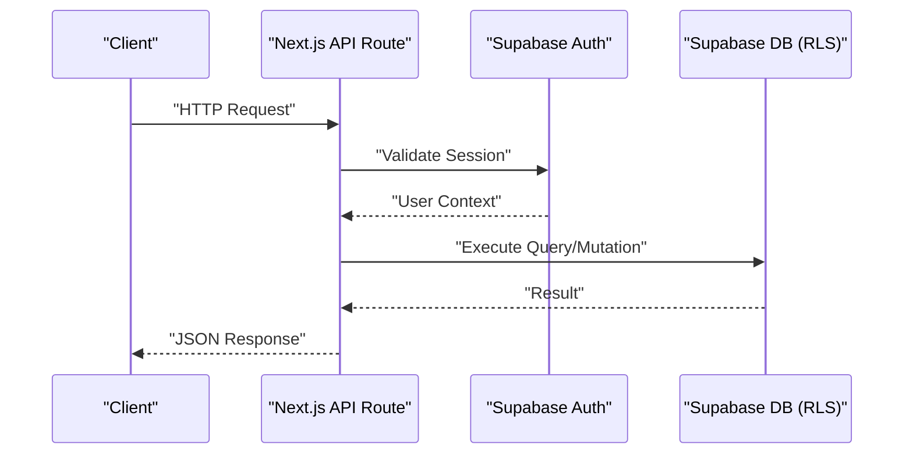
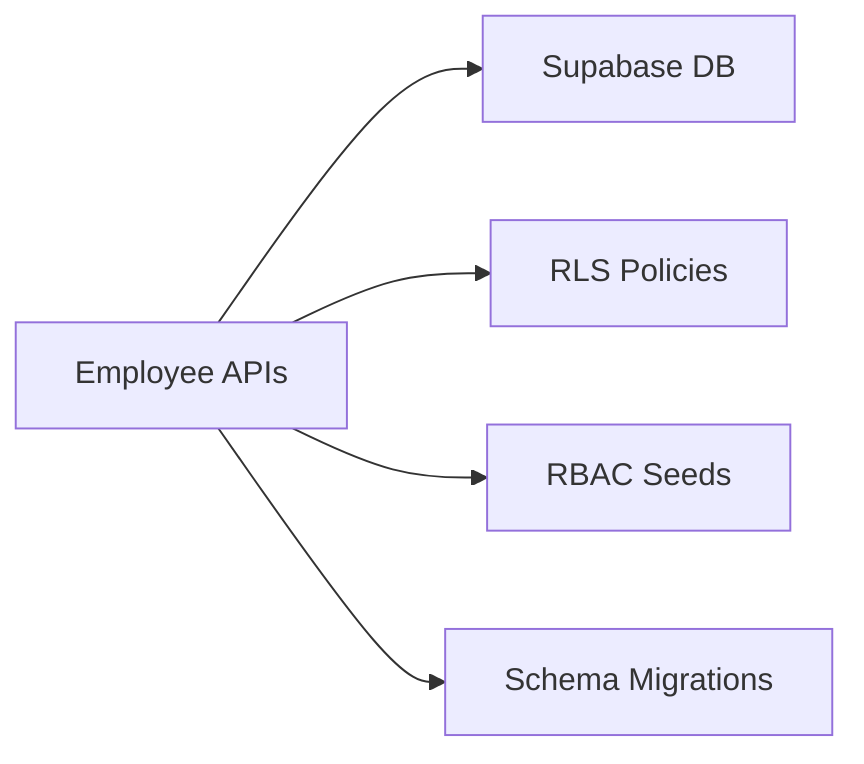

# Core APIs

<cite>
**Referenced Files in This Document**
- [apps/hr-suite/app/api/employees/route.ts](file://apps/hr-suite/app/api/employees/route.ts)
- [apps/hr-suite/app/api/employees/[employeeId]/route.ts](file://apps/hr-suite/app/api/employees/[employeeId]/route.ts)
- [apps/hr-suite/app/api/employees/[employeeId]/documents/route.ts](file://apps/hr-suite/app/api/employees/[employeeId]/documents/route.ts)
- [apps/hr-suite/app/api/employees/[employeeId]/activity/route.ts](file://apps/hr-suite/app/api/employees/[employeeId]/activity/route.ts)
- [apps/hr-suite/app/api/employments/[employmentId]/route.ts](file://apps/hr-suite/app/api/employments/[employmentId]/route.ts)
- [apps/hr-suite/app/api/employments/[employmentId]/termination/route.ts](file://apps/hr-suite/app/api/employments/[employmentId]/termination/route.ts)
- [apps/hr-suite/app/api/employments/[employmentId]/work-patterns/route.ts](file://apps/hr-suite/app/api/employments/[employmentId]/work-patterns/route.ts)
- [apps/hr-suite/app/api/employments/[employmentId]/timeline/[timeline]/route.ts](file://apps/hr-suite/app/api/employments/[employmentId]/timeline/[timeline]/route.ts)
- [apps/hr-suite/app/api/departments/route.ts](file://apps/hr-suite/app/api/departments/route.ts)
- [apps/hr-suite/app/api/departments/[departmentId]/route.ts](file://apps/hr-suite/app/api/departments/[departmentId]/route.ts)
- [apps/hr-suite/app/api/organization/assignments/route.ts](file://apps/hr-suite/app/api/organization/assignments/route.ts)
- [apps/hr-suite/app/api/roles/route.ts](file://apps/hr-suite/app/api/roles/route.ts)
- [apps/hr-suite/app/api/roles/[roleId]/route.ts](file://apps/hr-suite/app/api/roles/[roleId]/route.ts)
- [apps/hr-suite/app/auth/callback/route.ts](file://apps/hr-suite/app/auth/callback/route.ts)
- [supabase/migrations/20260712124911_add_tenant_rbac_and_organization.sql](file://supabase/migrations/20260712124911_add_tenant_rbac_and_organization.sql)
- [supabase/migrations/20260715131230_seed_custom_fields_and_tenant_roles.sql](file://supabase/migrations/20260715131230_seed_custom_fields_and_tenant_roles.sql)
</cite>

## Table of Contents
1. [Introduction](#introduction)
2. [Project Structure](#project-structure)
3. [Core Components](#core-components)
4. [Architecture Overview](#architecture-overview)
5. [Detailed Component Analysis](#detailed-component-analysis)
6. [Dependency Analysis](#dependency-analysis)
7. [Performance Considerations](#performance-considerations)
8. [Troubleshooting Guide](#troubleshooting-guide)
9. [Conclusion](#conclusion)

## Introduction
This document provides comprehensive API documentation for LiquidHR’s core business endpoints, focusing on Employee Management, Employment, and Organization domains. It covers HTTP methods, URL patterns, request/response schemas, authentication via Supabase Auth, parameter validation, error handling, practical examples, common use cases, integration patterns, and performance considerations. The goal is to enable both technical and non-technical readers to understand and integrate with the system effectively.

## Project Structure
LiquidHR exposes RESTful endpoints through Next.js App Router route handlers under apps/hr-suite/app/api/. Each domain (employees, employments, departments, organization, roles) has dedicated route files that implement CRUD operations and specialized workflows. Authentication is handled by Supabase Auth, with callbacks and session management centralized in the auth routes. Database access and security policies are enforced via Supabase migrations and Row Level Security (RLS).

```mermaid
graph TB
subgraph "API Layer"
EMP["/api/employees"]
EMP_ID["/api/employees/[employeeId]"]
DOC["/api/employees/[employeeId]/documents"]
ACT["/api/employees/[employeeId]/activity"]
EMP_T["/api/employments/[employmentId]"]
TERM["/api/employments/[employmentId]/termination"]
WP["/api/employments/[employmentId]/work-patterns"]
TL["/api/employments/[employmentId]/timeline/[timeline]"]
DEPT["/api/departments"]
DEPT_ID["/api/departments/[departmentId]"]
ORG_ASSIGN["/api/organization/assignments"]
ROLE["/api/roles"]
ROLE_ID["/api/roles/[roleId]"]
end
subgraph "Auth & DB"
AUTH_CB["/api/auth/callback"]
SUPABASE["Supabase (DB + RLS)"]
end
EMP --> SUPABASE
EMP_ID --> SUPABASE
DOC --> SUPABASE
ACT --> SUPABASE
EMP_T --> SUPABASE
TERM --> SUPABASE
WP --> SUPABASE
TL --> SUPABASE
DEPT --> SUPABASE
DEPT_ID --> SUPABASE
ORG_ASSIGN --> SUPABASE
ROLE --> SUPABASE
ROLE_ID --> SUPABASE
AUTH_CB --> SUPABASE
```

**Diagram sources**
- [apps/hr-suite/app/api/employees/route.ts](file://apps/hr-suite/app/api/employees/route.ts)
- [apps/hr-suite/app/api/employees/[employeeId]/route.ts](file://apps/hr-suite/app/api/employees/[employeeId]/route.ts)
- [apps/hr-suite/app/api/employees/[employeeId]/documents/route.ts](file://apps/hr-suite/app/api/employees/[employeeId]/documents/route.ts)
- [apps/hr-suite/app/api/employees/[employeeId]/activity/route.ts](file://apps/hr-suite/app/api/employees/[employeeId]/activity/route.ts)
- [apps/hr-suite/app/api/employments/[employmentId]/route.ts](file://apps/hr-suite/app/api/employments/[employmentId]/route.ts)
- [apps/hr-suite/app/api/employments/[employmentId]/termination/route.ts](file://apps/hr-suite/app/api/employments/[employmentId]/termination/route.ts)
- [apps/hr-suite/app/api/employments/[employmentId]/work-patterns/route.ts](file://apps/hr-suite/app/api/employments/[employmentId]/work-patterns/route.ts)
- [apps/hr-suite/app/api/employments/[employmentId]/timeline/[timeline]/route.ts](file://apps/hr-suite/app/api/employments/[employmentId]/timeline/[timeline]/route.ts)
- [apps/hr-suite/app/api/departments/route.ts](file://apps/hr-suite/app/api/departments/route.ts)
- [apps/hr-suite/app/api/departments/[departmentId]/route.ts](file://apps/hr-suite/app/api/departments/[departmentId]/route.ts)
- [apps/hr-suite/app/api/organization/assignments/route.ts](file://apps/hr-suite/app/api/organization/assignments/route.ts)
- [apps/hr-suite/app/api/roles/route.ts](file://apps/hr-suite/app/api/roles/route.ts)
- [apps/hr-suite/app/api/roles/[roleId]/route.ts](file://apps/hr-suite/app/api/roles/[roleId]/route.ts)
- [apps/hr-suite/app/auth/callback/route.ts](file://apps/hr-suite/app/auth/callback/route.ts)

**Section sources**
- [apps/hr-suite/app/api/employees/route.ts](file://apps/hr-suite/app/api/employees/route.ts)
- [apps/hr-suite/app/api/employees/[employeeId]/route.ts](file://apps/hr-suite/app/api/employees/[employeeId]/route.ts)
- [apps/hr-suite/app/api/departments/route.ts](file://apps/hr-suite/app/api/departments/route.ts)
- [apps/hr-suite/app/api/roles/route.ts](file://apps/hr-suite/app/api/roles/route.ts)
- [apps/hr-suite/app/auth/callback/route.ts](file://apps/hr-suite/app/auth/callback/route.ts)

## Core Components
- Employee Management APIs: Create, read, update, archive employees; manage documents and activity logs.
- Employment APIs: Manage contracts, timelines, terminations, and work patterns.
- Organization APIs: Department CRUD, role assignments, authorization controls, organizational structure operations.
- Authentication: Supabase Auth callback and session handling.

Key responsibilities:
- Route handlers validate inputs, enforce tenant scoping, and delegate to Supabase services.
- Data models include employees, employments, departments, roles, and related entities.
- Security is enforced via RLS policies and RBAC seeds.

**Section sources**
- [apps/hr-suite/app/api/employees/route.ts](file://apps/hr-suite/app/api/employees/route.ts)
- [apps/hr-suite/app/api/employees/[employeeId]/route.ts](file://apps/hr-suite/app/api/employees/[employeeId]/route.ts)
- [apps/hr-suite/app/api/employees/[employeeId]/documents/route.ts](file://apps/hr-suite/app/api/employees/[employeeId]/documents/route.ts)
- [apps/hr-suite/app/api/employees/[employeeId]/activity/route.ts](file://apps/hr-suite/app/api/employees/[employeeId]/activity/route.ts)
- [apps/hr-suite/app/api/employments/[employmentId]/route.ts](file://apps/hr-suite/app/api/employments/[employmentId]/route.ts)
- [apps/hr-suite/app/api/employments/[employmentId]/termination/route.ts](file://apps/hr-suite/app/api/employments/[employmentId]/termination/route.ts)
- [apps/hr-suite/app/api/employments/[employmentId]/work-patterns/route.ts](file://apps/hr-suite/app/api/employments/[employmentId]/work-patterns/route.ts)
- [apps/hr-suite/app/api/employments/[employmentId]/timeline/[timeline]/route.ts](file://apps/hr-suite/app/api/employments/[employmentId]/timeline/[timeline]/route.ts)
- [apps/hr-suite/app/api/departments/route.ts](file://apps/hr-suite/app/api/departments/route.ts)
- [apps/hr-suite/app/api/departments/[departmentId]/route.ts](file://apps/hr-suite/app/api/departments/[departmentId]/route.ts)
- [apps/hr-suite/app/api/organization/assignments/route.ts](file://apps/hr-suite/app/api/organization/assignments/route.ts)
- [apps/hr-suite/app/api/roles/route.ts](file://apps/hr-suite/app/api/roles/route.ts)
- [apps/hr-suite/app/api/roles/[roleId]/route.ts](file://apps/hr-suite/app/api/roles/[roleId]/route.ts)
- [apps/hr-suite/app/auth/callback/route.ts](file://apps/hr-suite/app/auth/callback/route.ts)

## Architecture Overview
The API layer uses Next.js App Router route handlers to expose REST endpoints. Requests are authenticated via Supabase Auth sessions. Business logic delegates to Supabase functions or direct queries constrained by RLS policies. Migrations define schema, indexes, and policies ensuring multi-tenancy and RBAC.

**Diagram sources**
- [apps/hr-suite/app/auth/callback/route.ts](file://apps/hr-suite/app/auth/callback/route.ts)
- [apps/hr-suite/app/api/employees/route.ts](file://apps/hr-suite/app/api/employees/route.ts)
- [apps/hr-suite/app/api/employees/[employeeId]/route.ts](file://apps/hr-suite/app/api/employees/[employeeId]/route.ts)

## Detailed Component Analysis

### Employee Management APIs
Endpoints:
- List/Create Employees: GET /api/employees, POST /api/employees
- Get/Update/Delete Employee: GET /api/employees/[employeeId], PATCH /api/employees/[employeeId], DELETE /api/employees/[employeeId]
- Archive Employee: PATCH /api/employees/[employeeId]/archive
- Documents: GET/POST /api/employees/[employeeId]/documents
- Activity: GET /api/employees/[employeeId]/activity

Authentication:
- Requires Supabase Auth session; user must belong to the same tenant/administration scope.

Request/Response Schemas:
- Employee fields include identifiers, personal details, contact info, department, job, status, timestamps.
- Document upload includes file metadata and category references.
- Activity entries capture event type, timestamp, actor, and context.

Parameter Validation:
- Path parameters validated (employeeId UUID format).
- Body payloads validated for required fields and constraints (e.g., dates, enums).

Error Handling:
- 401 Unauthorized when missing/invalid session.
- 403 Forbidden when insufficient permissions.
- 404 Not Found for missing resources.
- 422 Unprocessable Entity for validation errors.
- 500 Internal Server Error for unexpected failures.

Practical Examples:
- Create employee: POST /api/employees with JSON body containing required fields; returns created employee object.
- Upload document: POST /api/employees/[employeeId]/documents with multipart/form-data; returns document metadata.
- Fetch activity: GET /api/employees/[employeeId]/activity?limit=50&after=timestamp; returns paginated activity list.

Common Use Cases:
- Onboarding new hires with initial documents and activity logging.
- Updating employee profile and assigning to departments/jobs.
- Archiving inactive employees while preserving historical data.

Integration Patterns:
- Use client-side form validation before sending requests.
- Implement retry logic for transient network errors.
- Cache read-only lists with appropriate invalidation strategies.

Performance Considerations:
- Paginate large lists using limit and cursor-based pagination.
- Avoid heavy payloads; split updates into focused PATCH calls.
- Indexes on frequently queried columns improve performance.

**Section sources**
- [apps/hr-suite/app/api/employees/route.ts](file://apps/hr-suite/app/api/employees/route.ts)
- [apps/hr-suite/app/api/employees/[employeeId]/route.ts](file://apps/hr-suite/app/api/employees/[employeeId]/route.ts)
- [apps/hr-suite/app/api/employees/[employeeId]/documents/route.ts](file://apps/hr-suite/app/api/employees/[employeeId]/documents/route.ts)
- [apps/hr-suite/app/api/employees/[employeeId]/activity/route.ts](file://apps/hr-suite/app/api/employees/[employeeId]/activity/route.ts)

### Employment APIs
Endpoints:
- Employment CRUD: GET/PATCH/DELETE /api/employments/[employmentId]
- Termination: POST /api/employments/[employmentId]/termination
- Work Patterns: GET/POST/PUT /api/employments/[employmentId]/work-patterns
- Timeline: GET/POST /api/employments/[employmentId]/timeline/[timeline]

Authentication:
- Requires Supabase Auth session; RBAC enforces who can modify employment records.

Request/Response Schemas:
- Employment includes contract start/end dates, job title, department, salary scale, status.
- Termination payload includes termination date, reason, and notes.
- Work pattern defines working days, hours, and exceptions.
- Timeline entries record events like start, change, termination.

Parameter Validation:
- employmentId UUID validation.
- Dates validated against business rules (e.g., termination after start).
- Enums validated for statuses and reasons.

Error Handling:
- 401/403 for auth/authorization failures.
- 404 for missing employment.
- 422 for invalid payloads.
- 500 for server errors.

Practical Examples:
- Terminate employment: POST /api/employments/[employmentId]/termination with { terminationDate, reason }; returns updated employment.
- Configure work pattern: PUT /api/employments/[employmentId]/work-patterns with schedule; returns applied pattern.
- Add timeline entry: POST /api/employments/[employmentId]/timeline/[timeline] with event details; returns created entry.

Common Use Cases:
- Managing contract lifecycle from hire to termination.
- Tracking changes over time via timeline entries.
- Configuring individualized work schedules.

Integration Patterns:
- Use transactions for dependent updates (e.g., termination + timeline).
- Emit events for downstream systems (e.g., payroll).

Performance Considerations:
- Batch timeline updates where possible.
- Optimize queries with proper indexing on foreign keys and timestamps.

**Section sources**
- [apps/hr-suite/app/api/employments/[employmentId]/route.ts](file://apps/hr-suite/app/api/employments/[employmentId]/route.ts)
- [apps/hr-suite/app/api/employments/[employmentId]/termination/route.ts](file://apps/hr-suite/app/api/employments/[employmentId]/termination/route.ts)
- [apps/hr-suite/app/api/employments/[employmentId]/work-patterns/route.ts](file://apps/hr-suite/app/api/employments/[employmentId]/work-patterns/route.ts)
- [apps/hr-suite/app/api/employments/[employmentId]/timeline/[timeline]/route.ts](file://apps/hr-suite/app/api/employments/[employmentId]/timeline/[timeline]/route.ts)

### Organization APIs
Endpoints:
- Departments: GET/POST /api/departments, GET/PATCH/DELETE /api/departments/[departmentId]
- Role Assignments: GET/POST /api/organization/assignments
- Roles: GET/POST /api/roles, GET/PATCH/DELETE /api/roles/[roleId]

Authentication:
- Requires Supabase Auth session; admin-level roles required for organization management.

Request/Response Schemas:
- Department includes name, code, parent department, manager, active flag.
- Role assignment links users to roles within an administration scope.
- Role defines permissions and scope.

Parameter Validation:
- departmentId UUID validation.
- Role IDs and user IDs validated.
- Hierarchical relationships validated to prevent cycles.

Error Handling:
- 401/403 for unauthorized access.
- 404 for missing entities.
- 422 for invalid relationships or payloads.
- 500 for server errors.

Practical Examples:
- Create department: POST /api/departments with { name, code, parentId }; returns created department.
- Assign role: POST /api/organization/assignments with { userId, roleId, administrationId }; returns assignment.
- Update role permissions: PATCH /api/roles/[roleId] with permission set; returns updated role.

Common Use Cases:
- Building organizational hierarchy.
- Managing access control via roles and assignments.
- Auditing role changes and assignments.

Integration Patterns:
- Use cascading deletes carefully for departments.
- Enforce RBAC at API level and database level via RLS.

Performance Considerations:
- Preload hierarchical data for org charts.
- Cache role definitions and assignments for frequent reads.

**Section sources**
- [apps/hr-suite/app/api/departments/route.ts](file://apps/hr-suite/app/api/departments/route.ts)
- [apps/hr-suite/app/api/departments/[departmentId]/route.ts](file://apps/hr-suite/app/api/departments/[departmentId]/route.ts)
- [apps/hr-suite/app/api/organization/assignments/route.ts](file://apps/hr-suite/app/api/organization/assignments/route.ts)
- [apps/hr-suite/app/api/roles/route.ts](file://apps/hr-suite/app/api/roles/route.ts)
- [apps/hr-suite/app/api/roles/[roleId]/route.ts](file://apps/hr-suite/app/api/roles/[roleId]/route.ts)

### Authentication with Supabase Auth
Flow:
- Client initiates login via Supabase SDK.
- Callback route handles token exchange and sets session cookies.
- Subsequent API calls include session tokens for authorization.

Security:
- Sessions validated per request.
- RBAC policies restrict access based on roles and administration scope.

Practical Examples:
- Login flow: Redirect to Supabase OAuth; callback validates and creates session.
- Protected endpoint: Include Authorization header with Bearer token.

Common Use Cases:
- Single sign-on integration.
- Multi-tenant isolation via administration context.

Integration Patterns:
- Store tokens securely; refresh automatically.
- Handle token expiration gracefully.

**Section sources**
- [apps/hr-suite/app/auth/callback/route.ts](file://apps/hr-suite/app/auth/callback/route.ts)

## Dependency Analysis
Components depend on Supabase for data persistence and security policies. Migrations define schema, indexes, and RLS policies. Seed scripts establish default roles and custom fields.

**Diagram sources**
- [supabase/migrations/20260712124911_add_tenant_rbac_and_organization.sql](file://supabase/migrations/20260712124911_add_tenant_rbac_and_organization.sql)
- [supabase/migrations/20260715131230_seed_custom_fields_and_tenant_roles.sql](file://supabase/migrations/20260715131230_seed_custom_fields_and_tenant_roles.sql)

**Section sources**
- [supabase/migrations/20260712124911_add_tenant_rbac_and_organization.sql](file://supabase/migrations/20260712124911_add_tenant_rbac_and_organization.sql)
- [supabase/migrations/20260715131230_seed_custom_fields_and_tenant_roles.sql](file://supabase/migrations/20260715131230_seed_custom_fields_and_tenant_roles.sql)

## Performance Considerations
- Pagination: Always paginate large datasets using limit and cursor parameters.
- Caching: Cache static or infrequently changing data (roles, departments).
- Indexing: Ensure proper indexes on foreign keys and query filters.
- Payload Size: Minimize request/response sizes; avoid unnecessary fields.
- Concurrency: Use optimistic concurrency for updates where applicable.
- Monitoring: Track latency and error rates for critical endpoints.

[No sources needed since this section provides general guidance]

## Troubleshooting Guide
Common Issues:
- 401 Unauthorized: Missing or expired session; re-authenticate.
- 403 Forbidden: Insufficient permissions; check role assignments.
- 404 Not Found: Invalid ID or resource deleted; verify path parameters.
- 422 Unprocessable Entity: Invalid input; review schema and constraints.
- 500 Internal Server Error: Check server logs; investigate DB errors.

Debugging Steps:
- Validate tokens and session state.
- Inspect request payloads and response bodies.
- Review Supabase logs for query execution details.
- Verify RLS policies and RBAC seeds.

**Section sources**
- [apps/hr-suite/app/auth/callback/route.ts](file://apps/hr-suite/app/auth/callback/route.ts)
- [apps/hr-suite/app/api/employees/route.ts](file://apps/hr-suite/app/api/employees/route.ts)
- [apps/hr-suite/app/api/employments/[employmentId]/route.ts](file://apps/hr-suite/app/api/employments/[employmentId]/route.ts)

## Conclusion
LiquidHR’s core APIs provide robust capabilities for managing employees, employments, and organizational structures. With Supabase Auth and RLS, security and multi-tenancy are enforced consistently. By following the documented schemas, validation rules, and best practices, integrators can build reliable and scalable HR solutions.

[No sources needed since this section summarizes without analyzing specific files]