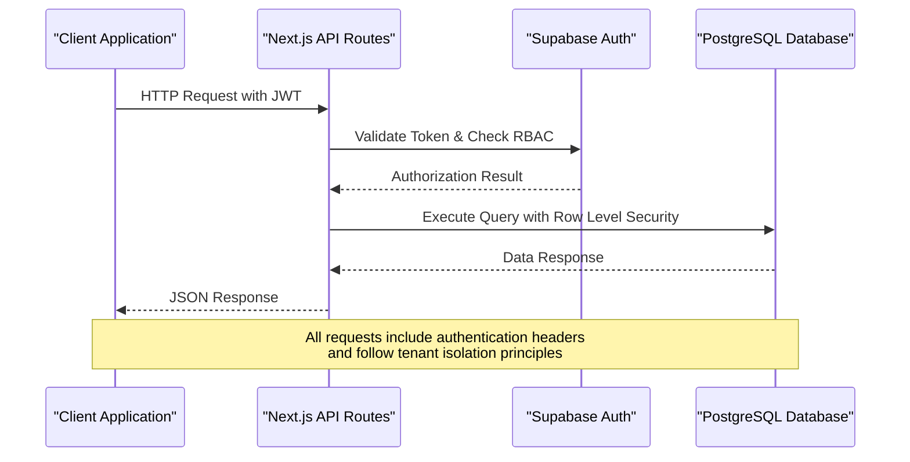
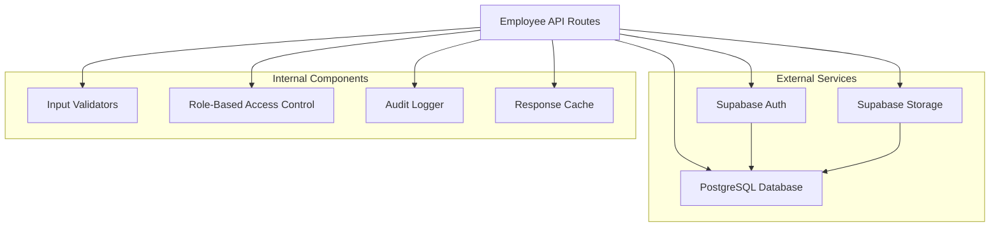

# Employee Management APIs

<cite>
**Referenced Files in This Document**
- [apps/hr-suite/app/api/employees/route.ts](file://apps/hr-suite/app/api/employees/route.ts)
- [apps/hr-suite/app/api/employees/[employeeId]/route.ts](file://apps/hr-suite/app/api/employees/[employeeId]/route.ts)
- [apps/hr-suite/app/api/employees/[employeeId]/documents/route.ts](file://apps/hr-suite/app/api/employees/[employeeId]/documents/route.ts)
- [apps/hr-suite/app/api/employees/[employeeId]/documents/[documentId]/route.ts](file://apps/hr-suite/app/api/employees/[employeeId]/documents/[documentId]/route.ts)
- [apps/hr-suite/app/api/employees/[employeeId]/activity/route.ts](file://apps/hr-suite/app/api/employees/[employeeId]/activity/route.ts)
- [apps/hr-suite/app/api/employees/[employeeId]/addresses/route.ts](file://apps/hr-suite/app/api/employees/[employeeId]/addresses/route.ts)
- [apps/hr-suite/app/api/employees/[employeeId]/addresses/[addressId]/route.ts](file://apps/hr-suite/app/api/employees/[employeeId]/addresses/[addressId]/route.ts)
- [apps/hr-suite/app/api/employees/[employeeId]/bank-accounts/route.ts](file://apps/hr-suite/app/api/employees/[employeeId]/bank-accounts/route.ts)
- [apps/hr-suite/app/api/employees/[employeeId]/bank-accounts/[bankAccountId]/route.ts](file://apps/hr-suite/app/api/employees/[employeeId]/bank-accounts/[bankAccountId]/route.ts)
- [apps/hr-suite/app/api/employees/[employeeId]/relations/route.ts](file://apps/hr-suite/app/api/employees/[employeeId]/relations/route.ts)
- [apps/hr-suite/app/api/employees/[employeeId]/relations/[relationId]/route.ts](file://apps/hr-suite/app/api/employees/[employeeId]/relations/[relationId]/route.ts)
- [apps/hr-suite/app/api/employees/[employeeId]/archive/route.ts](file://apps/hr-suite/app/api/employees/[employeeId]/archive/route.ts)
- [apps/hr-suite/app/api/employees/[employeeId]/avatar/route.ts](file://apps/hr-suite/app/api/employees/[employeeId]/avatar/route.ts)
- [apps/hr-suite/app/api/employees/matches/route.ts](file://apps/hr-suite/app/api/employees/matches/route.ts)
- [apps/hr-suite/app/api/employees/next-number/route.ts](file://apps/hr-suite/app/api/employees/next-number/route.ts)
- [apps/hr-suite/app/api/master-data/document-categories/route.ts](file://apps/hr-suite/app/api/master-data/document-categories/route.ts)
- [apps/hr-suite/app/api/master-data/document-categories/[categoryId]/route.ts](file://apps/hr-suite/app/api/master-data/document-categories/[categoryId]/route.ts)
- [supabase/migrations/20260718110000_add_employee_document_dossiers.sql](file://supabase/migrations/20260718110000_add_employee_document_dossiers.sql)
- [supabase/migrations/20260724160000_add_employee_activity_entries.sql](file://supabase/migrations/20260724160000_add_employee_activity_entries.sql)
- [supabase/migrations/20260725132351_address_input_internationalization.sql](file://supabase/migrations/20260725132351_address_input_internationalization.sql)
</cite>

## Table of Contents
1. [Introduction](#introduction)
2. [Project Structure](#project-structure)
3. [Core Components](#core-components)
4. [Architecture Overview](#architecture-overview)
5. [Detailed Component Analysis](#detailed-component-analysis)
6. [Dependency Analysis](#dependency-analysis)
7. [Performance Considerations](#performance-considerations)
8. [Troubleshooting Guide](#troubleshooting-guide)
9. [Conclusion](#conclusion)

## Introduction
This document provides comprehensive API documentation for the Employee Management endpoints in LiquidHR. It covers all CRUD operations for employees and their sub-resources: documents, activities, addresses, bank accounts, and relations. Authentication is handled via Supabase Auth with role-based access control (RBAC). The API supports pagination, filtering, sorting, and bulk operations where applicable. Error handling follows consistent patterns to ensure predictable client behavior.

## Project Structure
Employee-related API routes are organized under Next.js App Router paths. Each resource has a dedicated route file that handles HTTP methods and business logic. Sub-resources are nested under the employee endpoint using path parameters.

```mermaid
graph TB
A["/api/employees"] --> B["GET - List employees"]
A --> C["POST - Create employee"]
D["/api/employees/[employeeId]"] --> E["GET - Get employee"]
D --> F["PATCH - Update employee"]
D --> G["DELETE - Delete employee"]
H["/api/employees/[employeeId]/documents"] --> I["GET - List documents"]
H --> J["POST - Upload document"]
K["/api/employees/[employeeId]/documents/[documentId]"] --> L["GET - Download document"]
M["/api/employees/[employeeId]/activity"] --> N["GET - List activities"]
O["/api/employees/[employeeId]/addresses"] --> P["GET - List addresses"]
O --> Q["POST - Add address"]
R["/api/employees/[employeeId]/bank-accounts"] --> S["GET - List bank accounts"]
T["/api/employees/[employeeId]/relations"] --> U["GET - List relations"]
```



**Diagram sources**
- [apps/hr-suite/app/api/employees/route.ts](file://apps/hr-suite/app/api/employees/route.ts)
- [apps/hr-suite/app/api/employees/[employeeId]/route.ts](file://apps/hr-suite/app/api/employees/[employeeId]/route.ts)
- [apps/hr-suite/app/api/employees/[employeeId]/documents/route.ts](file://apps/hr-suite/app/api/employees/[employeeId]/documents/route.ts)
- [apps/hr-suite/app/api/employees/[employeeId]/activity/route.ts](file://apps/hr-suite/app/api/employees/[employeeId]/activity/route.ts)
- [apps/hr-suite/app/api/employees/[employeeId]/addresses/route.ts](file://apps/hr-suite/app/api/employees/[employeeId]/addresses/route.ts)
- [apps/hr-suite/app/api/employees/[employeeId]/bank-accounts/route.ts](file://apps/hr-suite/app/api/employees/[employeeId]/bank-accounts/route.ts)
- [apps/hr-suite/app/api/employees/[employeeId]/relations/route.ts](file://apps/hr-suite/app/api/employees/[employeeId]/relations/route.ts)

**Section sources**
- [apps/hr-suite/app/api/employees/route.ts](file://apps/hr-suite/app/api/employees/route.ts)
- [apps/hr-suite/app/api/employees/[employeeId]/route.ts](file://apps/hr-suite/app/api/employees/[employeeId]/route.ts)

## Core Components
The Employee Management system consists of several core components:

### Employee CRUD Operations
- **List Employees**: GET /api/employees with pagination and filtering support
- **Create Employee**: POST /api/employees with validation rules
- **Get Employee**: GET /api/employees/[employeeId] 
- **Update Employee**: PATCH /api/employees/[employeeId]
- **Delete Employee**: DELETE /api/employees/[employeeId]

### Sub-resource Management
- **Documents**: Upload, download, categorize employee documents
- **Activities**: Track and log employee activities with filtering capabilities
- **Addresses**: Manage multiple addresses per employee with internationalization support
- **Bank Accounts**: Handle employee banking information securely
- **Relations**: Manage employee relationships (family, emergency contacts, etc.)

**Section sources**
- [apps/hr-suite/app/api/employees/route.ts](file://apps/hr-suite/app/api/employees/route.ts)
- [apps/hr-suite/app/api/employees/[employeeId]/route.ts](file://apps/hr-suite/app/api/employees/[employeeId]/route.ts)

## Architecture Overview
The Employee Management API follows a RESTful architecture pattern with Next.js App Router. Authentication and authorization are handled through Supabase Auth with RBAC policies ensuring data isolation between tenants.



**Diagram sources**
- [apps/hr-suite/app/api/employees/route.ts](file://apps/hr-suite/app/api/employees/route.ts)
- [supabase/migrations/20260712124911_add_tenant_rbac_and_organization.sql](file://supabase/migrations/20260712124911_add_tenant_rbac_and_organization.sql)

## Detailed Component Analysis

### Employee CRUD Endpoints

#### List Employees
- **Method**: GET
- **URL**: /api/employees
- **Authentication**: Required (Supabase Auth)
- **Query Parameters**:
  - `page`: Page number (default: 1)
  - `limit`: Items per page (default: 20, max: 100)
  - `search`: Search term for name/email
  - `department`: Filter by department ID
  - `status`: Filter by employment status
  - `sort`: Sort field (name, created_at, etc.)
  - `order`: Sort order (asc, desc)

**Request Example**:
```http
GET /api/employees?page=1&limit=20&search=john&sort=created_at&order=desc
Authorization: Bearer <jwt_token>
```

**Response Schema**:
```json
{
  "data": [{"id": "uuid", "name": "string", "email": "string", ...}],
  "pagination": {"total": 100, "page": 1, "limit": 20},
  "meta": {"filters_applied": ["search", "department"]}
}
```

#### Create Employee
- **Method**: POST
- **URL**: /api/employees
- **Authentication**: Required (Admin or HR role)
- **Request Body**:
```json
{
  "firstName": "string (required)",
  "lastName": "string (required)",
  "email": "string (required, unique)",
  "dateOfBirth": "date (optional)",
  "gender": "enum (male, female, other, prefer_not_to_say)",
  "departmentId": "uuid (optional)",
  "jobTitle": "string (optional)"
}
```

**Validation Rules**:
- Email must be valid format and unique within tenant
- First name and last name are required
- Date of birth must be valid date format
- Gender must be one of the allowed values

#### Get Employee
- **Method**: GET
- **URL**: /api/employees/[employeeId]
- **Authentication**: Required (Employee owner or authorized role)

#### Update Employee
- **Method**: PATCH
- **URL**: /api/employees/[employeeId]
- **Authentication**: Required (Employee owner or authorized role)
- **Request Body**: Partial update object with same schema as create

#### Delete Employee
- **Method**: DELETE
- **URL**: /api/employees/[employeeId]
- **Authentication**: Required (Admin role only)

**Section sources**
- [apps/hr-suite/app/api/employees/route.ts](file://apps/hr-suite/app/api/employees/route.ts)
- [apps/hr-suite/app/api/employees/[employeeId]/route.ts](file://apps/hr-suite/app/api/employees/[employeeId]/route.ts)

### Document Management

#### Upload Document
- **Method**: POST
- **URL**: /api/employees/[employeeId]/documents
- **Authentication**: Required (Employee owner or authorized role)
- **Content-Type**: multipart/form-data
- **Form Fields**:
  - `file`: File upload (max 10MB, supported types: pdf, jpg, png, doc, docx)
  - `category`: Document category (required)
  - `description`: Optional description

#### Download Document
- **Method**: GET
- **URL**: /api/employees/[employeeId]/documents/[documentId]
- **Authentication**: Required (Employee owner or authorized role)
- **Response**: Binary file content with appropriate Content-Type

#### List Documents
- **Method**: GET
- **URL**: /api/employees/[employeeId]/documents
- **Query Parameters**:
  - `category`: Filter by document category
  - `type`: Filter by file type
  - `dateFrom`: Filter by upload date from
  - `dateTo`: Filter by upload date to

**Section sources**
- [apps/hr-suite/app/api/employees/[employeeId]/documents/route.ts](file://apps/hr-suite/app/api/employees/[employeeId]/documents/route.ts)
- [apps/hr-suite/app/api/employees/[employeeId]/documents/[documentId]/route.ts](file://apps/hr-suite/app/api/employees/[employeeId]/documents/[documentId]/route.ts)
- [supabase/migrations/20260718110000_add_employee_document_dossiers.sql](file://supabase/migrations/20260718110000_add_employee_document_dossiers.sql)

### Activity Tracking

#### Log Activity
- **Method**: POST
- **URL**: /api/employees/[employeeId]/activity
- **Authentication**: Required (Authorized role)
- **Request Body**:
```json
{
  "type": "enum (profile_update, document_upload, address_change, etc.)",
  "description": "string (required)",
  "metadata": "object (optional, additional context)"
}
```

#### List Activities
- **Method**: GET
- **URL**: /api/employees/[employeeId]/activity
- **Query Parameters**:
  - `type`: Filter by activity type
  - `dateFrom`: Filter by date from
  - `dateTo`: Filter by date to
  - `userId`: Filter by user who performed action

**Section sources**
- [apps/hr-suite/app/api/employees/[employeeId]/activity/route.ts](file://apps/hr-suite/app/api/employees/[employeeId]/activity/route.ts)
- [supabase/migrations/20260724160000_add_employee_activity_entries.sql](file://supabase/migrations/20260724160000_add_employee_activity_entries.sql)

### Address Management

#### Add Address
- **Method**: POST
- **URL**: /api/employees/[employeeId]/addresses
- **Authentication**: Required (Employee owner or authorized role)
- **Request Body**:
```json
{
  "street": "string (required)",
  "streetNumber": "string (required)",
  "postalCode": "string (required)",
  "city": "string (required)",
  "country": "string (required, ISO 3166-1 alpha-2)",
  "type": "enum (home, work, other)",
  "isPrimary": "boolean (optional, default: false)"
}
```

#### Update Address
- **Method**: PATCH
- **URL**: /api/employees/[employeeId]/addresses/[addressId]
- **Authentication**: Required (Employee owner or authorized role)

#### Delete Address
- **Method**: DELETE
- **URL**: /api/employees/[employeeId]/addresses/[addressId]
- **Authentication**: Required (Employee owner or authorized role)

**Internationalization Support**: Address validation supports multiple countries with localized formatting rules.

**Section sources**
- [apps/hr-suite/app/api/employees/[employeeId]/addresses/route.ts](file://apps/hr-suite/app/api/employees/[employeeId]/addresses/route.ts)
- [apps/hr-suite/app/api/employees/[employeeId]/addresses/[addressId]/route.ts](file://apps/hr-suite/app/api/employees/[employeeId]/addresses/[addressId]/route.ts)
- [supabase/migrations/20260725132351_address_input_internationalization.sql](file://supabase/migrations/20260725132351_address_input_internationalization.sql)

### Bank Account Handling

#### Add Bank Account
- **Method**: POST
- **URL**: /api/employees/[employeeId]/bank-accounts
- **Authentication**: Required (Employee owner or authorized role)
- **Request Body**:
```json
{
  "accountHolderName": "string (required)",
  "iban": "string (required, IBAN format)",
  "bankName": "string (required)",
  "swiftCode": "string (optional)",
  "isPrimary": "boolean (optional, default: false)"
}
```

#### Update Bank Account
- **Method**: PATCH
- **URL**: /api/employees/[employeeId]/bank-accounts/[bankAccountId]

#### Delete Bank Account
- **Method**: DELETE
- **URL**: /api/employees/[employeeId]/bank-accounts/[bankAccountId]

**Security Notes**: Bank account data is encrypted at rest and requires elevated permissions for access.

**Section sources**
- [apps/hr-suite/app/api/employees/[employeeId]/bank-accounts/route.ts](file://apps/hr-suite/app/api/employees/[employeeId]/bank-accounts/route.ts)
- [apps/hr-suite/app/api/employees/[employeeId]/bank-accounts/[bankAccountId]/route.ts](file://apps/hr-suite/app/api/employees/[employeeId]/bank-accounts/[bankAccountId]/route.ts)

### Relationship Management

#### Add Relation
- **Method**: POST
- **URL**: /api/employees/[employeeId]/relations
- **Authentication**: Required (Employee owner or authorized role)
- **Request Body**:
```json
{
  "relationType": "string (required, from catalog)",
  "firstName": "string (required)",
  "lastName": "string (required)",
  "dateOfBirth": "date (optional)",
  "contactPhone": "string (optional)",
  "contactEmail": "string (optional)",
  "relationshipNotes": "string (optional)"
}
```

#### Update Relation
- **Method**: PATCH
- **URL**: /api/employees/[employeeId]/relations/[relationId]

#### Delete Relation
- **Method**: DELETE
- **URL**: /api/employees/[employeeId]/relations/[relationId]

**Section sources**
- [apps/hr-suite/app/api/employees/[employeeId]/relations/route.ts](file://apps/hr-suite/app/api/employees/[employeeId]/relations/route.ts)
- [apps/hr-suite/app/api/employees/[employeeId]/relations/[relationId]/route.ts](file://apps/hr-suite/app/api/employees/[employeeId]/relations/[relationId]/route.ts)

### Additional Employee Features

#### Archive Employee
- **Method**: POST
- **URL**: /api/employees/[employeeId]/archive
- **Authentication**: Required (Admin role)
- **Purpose**: Soft delete functionality for compliance requirements

#### Upload Avatar
- **Method**: POST
- **URL**: /api/employees/[employeeId]/avatar
- **Authentication**: Required (Employee owner or authorized role)
- **Content-Type**: multipart/form-data
- **File Requirements**: JPEG/PNG, max 2MB, square dimensions recommended

#### Identity Matching
- **Method**: POST
- **URL**: /api/employees/matches
- **Authentication**: Required (HR/Admin role)
- **Purpose**: Find potential duplicate employee records based on identity criteria

**Section sources**
- [apps/hr-suite/app/api/employees/[employeeId]/archive/route.ts](file://apps/hr-suite/app/api/employees/[employeeId]/archive/route.ts)
- [apps/hr-suite/app/api/employees/[employeeId]/avatar/route.ts](file://apps/hr-suite/app/api/employees/[employeeId]/avatar/route.ts)
- [apps/hr-suite/app/api/employees/matches/route.ts](file://apps/hr-suite/app/api/employees/matches/route.ts)

## Dependency Analysis
The Employee Management API depends on several external services and internal components:



**Diagram sources**
- [apps/hr-suite/app/api/employees/route.ts](file://apps/hr-suite/app/api/employees/route.ts)
- [supabase/migrations/20260712124911_add_tenant_rbac_and_organization.sql](file://supabase/migrations/20260712124911_add_tenant_rbac_and_organization.sql)

**Section sources**
- [apps/hr-suite/app/api/employees/route.ts](file://apps/hr-suite/app/api/employees/route.ts)

## Performance Considerations
- **Pagination**: Always use pagination for list endpoints to prevent large response payloads
- **Indexing**: Database queries are optimized with appropriate indexes on frequently filtered columns
- **Caching**: Implement response caching for read-heavy endpoints where appropriate
- **File Uploads**: Use streaming for large file uploads to prevent memory issues
- **Connection Pooling**: Database connections are pooled to handle concurrent requests efficiently
- **Rate Limiting**: Implement rate limiting to prevent abuse of API endpoints

## Troubleshooting Guide

### Common Authentication Errors
- **401 Unauthorized**: Invalid or expired JWT token
- **403 Forbidden**: Insufficient permissions for requested operation
- **404 Not Found**: Employee or resource not found

### Validation Errors
- **422 Unprocessable Entity**: Invalid request body or parameter validation failure
- **409 Conflict**: Duplicate email or resource conflict

### Database Errors
- **500 Internal Server Error**: Database connection issues or query failures
- **429 Too Many Requests**: Rate limiting exceeded

### Debugging Tips
- Enable detailed logging in development environment
- Check Supabase dashboard for database query performance
- Verify RBAC policies are correctly configured
- Monitor API response times and error rates

**Section sources**
- [apps/hr-suite/app/api/employees/route.ts](file://apps/hr-suite/app/api/employees/route.ts)
- [apps/hr-suite/app/api/employees/[employeeId]/route.ts](file://apps/hr-suite/app/api/employees/[employeeId]/route.ts)

## Conclusion
The Employee Management API provides a comprehensive set of endpoints for managing employee data and related resources. The system follows modern API design principles with proper authentication, authorization, validation, and error handling. The modular architecture allows for easy extension and maintenance while ensuring data security and performance optimization.

Key features include:
- Complete CRUD operations for employees and sub-resources
- Robust authentication and authorization with Supabase Auth and RBAC
- Comprehensive validation and error handling
- Pagination, filtering, and sorting capabilities
- Secure file handling for documents and avatars
- Internationalization support for addresses
- Activity tracking and audit logging

The API is designed to scale with the organization's needs while maintaining security and performance standards.