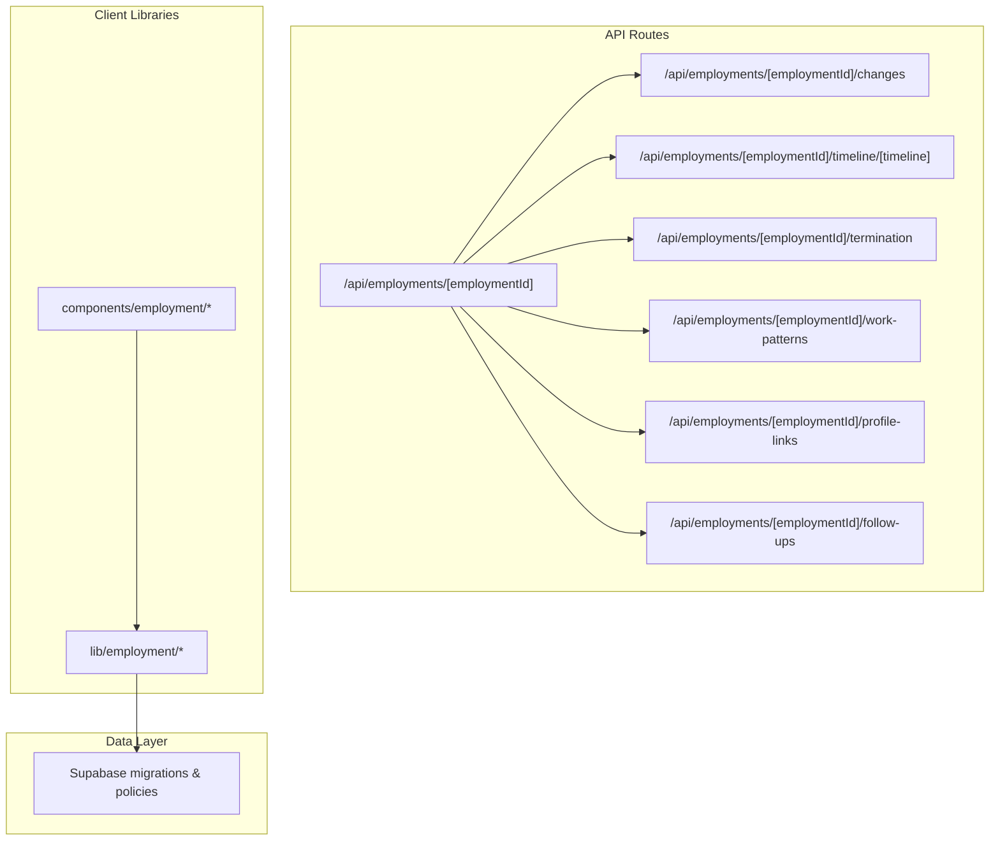
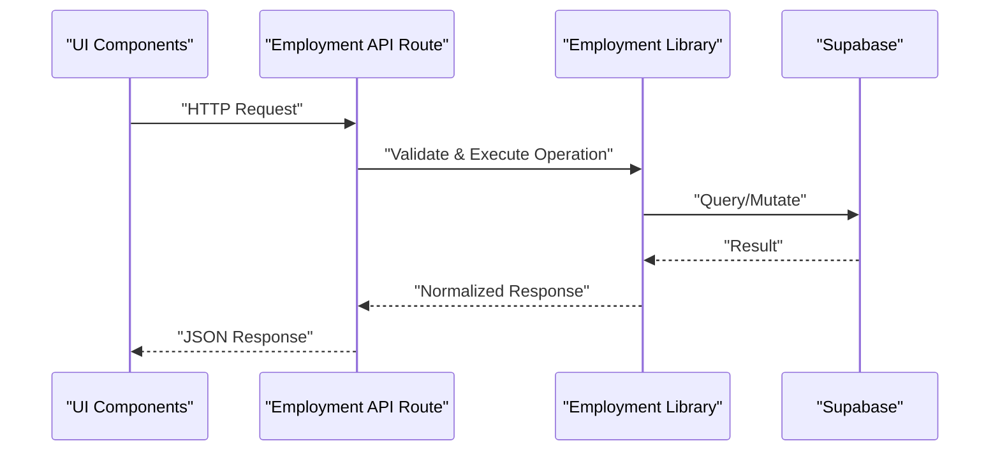
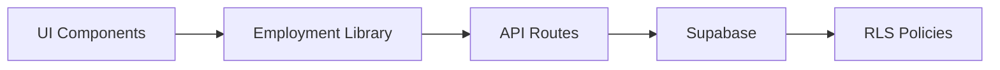

# Employment Lifecycle APIs

<cite>
**Referenced Files in This Document**
- [employment route](file://apps/hr-suite/app/api/employments/[employmentId]/route.ts)
- [employment changes route](file://apps/hr-suite/app/api/employments/[employmentId]/changes/route.ts)
- [employment timeline route](file://apps/hr-suite/app/api/employments/[employmentId]/timeline/[timeline]/route.ts)
- [employment termination route](file://apps/hr-suite/app/api/employments/[employmentId]/termination/route.ts)
- [employment work patterns route](file://apps/hr-suite/app/api/employments/[employmentId]/work-patterns/route.ts)
- [employment profile links route](file://apps/hr-suite/app/api/employments/[employmentId]/profile-links/route.ts)
- [employment follow-ups route](file://apps/hr-suite/app/api/employments/[employmentId]/follow-ups/route.ts)
- [employee employments route](file://apps/hr-suite/app/api/employees/[employeeId]/employments/route.ts)
- [employment components](file://apps/hr-suite/components/employment/employment-create-form.tsx)
- [employment components](file://apps/hr-suite/components/employment/employment-mutation-panel.tsx)
- [employment components](file://apps/hr-suite/components/employment/employment-timeline.tsx)
- [employment components](file://apps/hr-suite/components/employment/termination-form.tsx)
- [employment components](file://apps/hr-suite/components/employment/work-pattern-panel.tsx)
- [employment components](file://apps/hr-suite/components/employment/profile-link-form.tsx)
- [employment lib](file://apps/hr-suite/lib/employment/index.ts)
- [employment lib](file://apps/hr-suite/lib/employment/types.ts)
- [employment lib](file://apps/hr-suite/lib/employment/schema.ts)
- [employment lib](file://apps/hr-suite/lib/employment/validation.ts)
- [employment lib](file://apps/hr-suite/lib/employment/mutations.ts)
- [employment lib](file://apps/hr-suite/lib/employment/query.ts)
- [employment lib](file://apps/hr-suite/lib/employment/timeline.ts)
- [employment lib](file://apps/hr-suite/lib/employment/termination.ts)
- [employment lib](file://apps/hr-suite/lib/employment/work-patterns.ts)
- [employment lib](file://apps/hr-suite/lib/employment/profile-links.ts)
- [employment lib](file://apps/hr-suite/lib/employment/change-management.ts)
</cite>

## Table of Contents
1. [Introduction](#introduction)
2. [Project Structure](#project-structure)
3. [Core Components](#core-components)
4. [Architecture Overview](#architecture-overview)
5. [Detailed Component Analysis](#detailed-component-analysis)
6. [Dependency Analysis](#dependency-analysis)
7. [Performance Considerations](#performance-considerations)
8. [Troubleshooting Guide](#troubleshooting-guide)
9. [Conclusion](#conclusion)
10. [Appendices](#appendices)

## Introduction
This document provides comprehensive API documentation for the Employment Lifecycle endpoints in LiquidHR. It covers employment contract management (creation, modification, versioning, and status tracking), employment timeline operations (career events, promotions, transfers, and history), termination processes (exits, resignations, terminations with workflow states), work pattern configuration (scheduling, time tracking, availability), and profile link management for external system integrations. Each endpoint includes HTTP methods, URL patterns, request/response schemas, authentication requirements, parameter validation, and error handling. Practical examples demonstrate typical workflows and integration patterns.

## Project Structure
The Employment Lifecycle is implemented as a set of Next.js App Router API routes under apps/hr-suite/app/api/employments. Each employment resource exposes sub-resources for changes, timeline, termination, work patterns, profile links, and follow-ups. Client-side UI components and library modules orchestrate requests and validations.

**Diagram sources**
- [employment route](file://apps/hr-suite/app/api/employments/[employmentId]/route.ts)
- [employment changes route](file://apps/hr-suite/app/api/employments/[employmentId]/changes/route.ts)
- [employment timeline route](file://apps/hr-suite/app/api/employments/[employmentId]/timeline/[timeline]/route.ts)
- [employment termination route](file://apps/hr-suite/app/api/employments/[employmentId]/termination/route.ts)
- [employment work patterns route](file://apps/hr-suite/app/api/employments/[employmentId]/work-patterns/route.ts)
- [employment profile links route](file://apps/hr-suite/app/api/employments/[employmentId]/profile-links/route.ts)
- [employment follow-ups route](file://apps/hr-suite/app/api/employments/[employmentId]/follow-ups/route.ts)

**Section sources**
- [employment route](file://apps/hr-suite/app/api/employments/[employmentId]/route.ts)
- [employment changes route](file://apps/hr-suite/app/api/employments/[employmentId]/changes/route.ts)
- [employment timeline route](file://apps/hr-suite/app/api/employments/[employmentId]/timeline/[timeline]/route.ts)
- [employment termination route](file://apps/hr-suite/app/api/employments/[employmentId]/termination/route.ts)
- [employment work patterns route](file://apps/hr-suite/app/api/employments/[employmentId]/work-patterns/route.ts)
- [employment profile links route](file://apps/hr-suite/app/api/employments/[employmentId]/profile-links/route.ts)
- [employment follow-ups route](file://apps/hr-suite/app/api/employments/[employmentId]/follow-ups/route.ts)

## Core Components
- Employment CRUD: Create, read, update, and manage employment contracts.
- Change Management: Versioned modifications to employment records with audit trails.
- Timeline: Record career events such as promotions, transfers, and role changes.
- Termination: Manage exit workflows including resignation and termination with state transitions.
- Work Patterns: Configure scheduling, time tracking rules, and availability windows.
- Profile Links: Manage external system integrations linked to an employment record.
- Follow-ups: Track reminders and tasks associated with employment lifecycle events.

These capabilities are exposed via RESTful endpoints and supported by client libraries that handle schema validation, error mapping, and retry logic.

**Section sources**
- [employment route](file://apps/hr-suite/app/api/employments/[employmentId]/route.ts)
- [employment changes route](file://apps/hr-suite/app/api/employments/[employmentId]/changes/route.ts)
- [employment timeline route](file://apps/hr-suite/app/api/employments/[employmentId]/timeline/[timeline]/route.ts)
- [employment termination route](file://apps/hr-suite/app/api/employments/[employmentId]/termination/route.ts)
- [employment work patterns route](file://apps/hr-suite/app/api/employments/[employmentId]/work-patterns/route.ts)
- [employment profile links route](file://apps/hr-suite/app/api/employments/[employmentId]/profile-links/route.ts)
- [employment follow-ups route](file://apps/hr-suite/app/api/employments/[employmentId]/follow-ups/route.ts)

## Architecture Overview
The Employment Lifecycle follows a layered architecture:
- API Layer: Next.js App Router handlers for each endpoint.
- Service Layer: Business logic encapsulated in lib/employment modules.
- Data Layer: Supabase database with RLS policies and migrations ensuring security and integrity.
- Client Layer: React components and hooks that call the API and manage UI state.

[No sources needed since this diagram shows conceptual workflow, not actual code structure]

## Detailed Component Analysis

### Employment Contract Management
Endpoints:
- GET /api/employments/[employmentId]: Retrieve employment details.
- PATCH /api/employments/[employmentId]: Update employment fields.
- POST /api/employments/[employmentId]: Create new employment versions or apply changes.

Authentication: Requires authenticated session with appropriate RBAC permissions scoped to tenant and administration.

Request Schema:
- Fields include effective dates, job assignment, department, salary scale, and custom fields.
- Validation enforces date ordering, required fields, and referential integrity.

Response Schema:
- Employment object with version metadata, status, and timestamps.

Error Handling:
- 400 Bad Request for invalid payloads.
- 401 Unauthorized for missing or invalid credentials.
- 403 Forbidden for insufficient permissions.
- 404 Not Found when employment does not exist.
- 500 Internal Server Error for unexpected failures.

Example Workflow:
- Create initial employment record with start date and job assignment.
- Apply subsequent updates to adjust compensation or role while preserving version history.

**Section sources**
- [employment route](file://apps/hr-suite/app/api/employments/[employmentId]/route.ts)
- [employment lib](file://apps/hr-suite/lib/employment/index.ts)
- [employment lib](file://apps/hr-suite/lib/employment/types.ts)
- [employment lib](file://apps/hr-suite/lib/employment/schema.ts)
- [employment lib](file://apps/hr-suite/lib/employment/validation.ts)
- [employment lib](file://apps/hr-suite/lib/employment/mutations.ts)
- [employment lib](file://apps/hr-suite/lib/employment/query.ts)

### Employment Changes and Versioning
Endpoints:
- GET /api/employments/[employmentId]/changes: List change sets and versions.
- POST /api/employments/[employmentId]/changes: Submit a change set for approval or immediate application.

Authentication: Requires write permissions on employment change management.

Request Schema:
- Change set includes field diffs, effective date, reason, and approver context.
- Validation ensures non-conflicting changes and valid effective dates.

Response Schema:
- Change set metadata, status (draft, pending, approved, rejected), and audit trail entries.

Error Handling:
- 400 for invalid change sets.
- 409 Conflict if overlapping changes detected.
- 403 for unauthorized change submissions.

Example Workflow:
- Draft a change set for promotion with updated job and salary.
- Approve change set to create a new employment version with effective date.

**Section sources**
- [employment changes route](file://apps/hr-suite/app/api/employments/[employmentId]/changes/route.ts)
- [employment lib](file://apps/hr-suite/lib/employment/change-management.ts)

### Employment Timeline Operations
Endpoints:
- GET /api/employments/[employmentId]/timeline/[timeline]: Retrieve specific timeline entry.
- POST /api/employments/[employmentId]/timeline: Add a new timeline event (promotion, transfer, role change).

Authentication: Requires read/write permissions on employment timeline.

Request Schema:
- Event type, date, description, and related identifiers (job, department, manager).
- Validation enforces chronological order and required fields per event type.

Response Schema:
- Timeline event object with metadata and linkage to employment version.

Error Handling:
- 400 for malformed events.
- 404 for missing employment or timeline reference.
- 403 for unauthorized access.

Example Workflow:
- Record a promotion event with effective date and new job assignment.
- Query timeline to display career progression in UI.

**Section sources**
- [employment timeline route](file://apps/hr-suite/app/api/employments/[employmentId]/timeline/[timeline]/route.ts)
- [employment lib](file://apps/hr-suite/lib/employment/timeline.ts)

### Termination Process APIs
Endpoints:
- POST /api/employments/[employmentId]/termination: Initiate termination workflow (resignation, termination, retirement).
- PATCH /api/employments/[employmentId]/termination: Update termination status or add notes.

Authentication: Requires termination workflow permissions.

Request Schema:
- Termination type, effective date, reason, final settlement flags, and exit interview data.
- Validation ensures termination date is not before current employment start and respects policy constraints.

Response Schema:
- Termination record with workflow state (initiated, in-progress, completed) and audit entries.

Error Handling:
- 400 for invalid termination payload.
- 409 Conflict if employment already terminated or incompatible state.
- 403 for unauthorized termination actions.

Example Workflow:
- Initiate resignation with effective date and reason.
- Progress through workflow states until completion, updating final settlement and notifications.

**Section sources**
- [employment termination route](file://apps/hr-suite/app/api/employments/[employmentId]/termination/route.ts)
- [employment lib](file://apps/hr-suite/lib/employment/termination.ts)

### Work Pattern Configuration
Endpoints:
- GET /api/employments/[employmentId]/work-patterns: Retrieve configured work patterns.
- PUT /api/employments/[employmentId]/work-patterns: Update scheduling rules, time tracking settings, and availability windows.

Authentication: Requires work pattern configuration permissions.

Request Schema:
- Weekly schedule, time zones, overtime rules, and availability calendars.
- Validation enforces consistency across days and prevents overlapping conflicts.

Response Schema:
- Work pattern object with schedule definitions and effective periods.

Error Handling:
- 400 for invalid schedule configurations.
- 403 for unauthorized updates.
- 409 Conflict if conflicting patterns exist.

Example Workflow:
- Define standard weekly schedule with core hours and flexible periods.
- Adjust availability for leave periods or project assignments.

**Section sources**
- [employment work patterns route](file://apps/hr-suite/app/api/employments/[employmentId]/work-patterns/route.ts)
- [employment lib](file://apps/hr-suite/lib/employment/work-patterns.ts)

### Profile Link Management
Endpoints:
- GET /api/employments/[employmentId]/profile-links: List external system links.
- POST /api/employments/[employmentId]/profile-links: Add a new external profile link.
- PATCH /api/employments/[employmentId]/profile-links/[linkId]: Update link metadata or status.
- DELETE /api/employments/[employmentId]/profile-links/[linkId]: Remove a link.

Authentication: Requires profile link management permissions.

Request Schema:
- External system identifier, URL, token references, and sync flags.
- Validation ensures unique link identifiers and secure token handling.

Response Schema:
- Profile link object with metadata, status, and last sync timestamp.

Error Handling:
- 400 for invalid link payloads.
- 409 Conflict for duplicate link identifiers.
- 403 for unauthorized link operations.

Example Workflow:
- Integrate with payroll system by adding a profile link with secure token.
- Sync employee data periodically using configured flags.

**Section sources**
- [employment profile links route](file://apps/hr-suite/app/api/employments/[employmentId]/profile-links/route.ts)

### Employment Follow-ups
Endpoints:
- GET /api/employments/[employmentId]/follow-ups: List follow-up tasks.
- POST /api/employments/[employmentId]/follow-ups: Create a new follow-up task.
- PATCH /api/employments/[employmentId]/follow-ups/[taskId]: Update task status or due date.

Authentication: Requires follow-up management permissions.

Request Schema:
- Task title, description, due date, assignee, and priority.
- Validation enforces required fields and date constraints.

Response Schema:
- Follow-up task object with status and metadata.

Error Handling:
- 400 for invalid task payloads.
- 403 for unauthorized task operations.

Example Workflow:
- Create a follow-up task for contract review with due date and assignee.
- Mark task as completed upon review.

**Section sources**
- [employment follow-ups route](file://apps/hr-suite/app/api/employments/[employmentId]/follow-ups/route.ts)

### Employee Employments Aggregation
Endpoints:
- GET /api/employees/[employeeId]/employments: List all employments for an employee.

Authentication: Requires employee read permissions.

Response Schema:
- Array of employment summaries with key attributes and status.

Error Handling:
- 404 for missing employee.
- 403 for unauthorized access.

Example Workflow:
- Display employment history in employee dashboard.

**Section sources**
- [employee employments route](file://apps/hr-suite/app/api/employees/[employeeId]/employments/route.ts)

## Dependency Analysis
The Employment Lifecycle endpoints depend on:
- Client libraries for schema validation and mutation orchestration.
- Database layer with strict RLS policies ensuring tenant isolation.
- UI components that render employment data and trigger API calls.

**Diagram sources**
- [employment lib](file://apps/hr-suite/lib/employment/index.ts)
- [employment route](file://apps/hr-suite/app/api/employments/[employmentId]/route.ts)

**Section sources**
- [employment lib](file://apps/hr-suite/lib/employment/index.ts)
- [employment route](file://apps/hr-suite/app/api/employments/[employmentId]/route.ts)

## Performance Considerations
- Use pagination for large datasets like timelines and follow-ups.
- Cache frequently accessed employment data at the client level with invalidation strategies.
- Optimize database queries with proper indexes defined in migrations.
- Implement retry logic for transient network errors in client libraries.

[No sources needed since this section provides general guidance]

## Troubleshooting Guide
Common issues and resolutions:
- Authentication failures: Verify session tokens and RBAC permissions.
- Validation errors: Check request payloads against schema definitions.
- Conflicts: Resolve overlapping changes or duplicate profile links.
- Permission denied: Ensure user has appropriate roles within tenant scope.

**Section sources**
- [employment lib](file://apps/hr-suite/lib/employment/validation.ts)
- [employment lib](file://apps/hr-suite/lib/employment/mutations.ts)

## Conclusion
The Employment Lifecycle APIs provide a robust foundation for managing employment contracts, timelines, terminations, work patterns, and integrations. By following the documented endpoints, schemas, and workflows, developers can implement comprehensive HR processes with strong security and auditability.

[No sources needed since this section summarizes without analyzing specific files]

## Appendices

### Practical Examples

#### Employment Creation and Modification
- Create initial employment with start date and job assignment.
- Apply subsequent updates to adjust compensation or role while preserving version history.

#### Promotion and Transfer Workflow
- Record promotion event with effective date and new job assignment.
- Query timeline to display career progression in UI.

#### Termination Process
- Initiate resignation with effective date and reason.
- Progress through workflow states until completion, updating final settlement and notifications.

#### Work Pattern Configuration
- Define standard weekly schedule with core hours and flexible periods.
- Adjust availability for leave periods or project assignments.

#### Integration with External Systems
- Integrate with payroll system by adding a profile link with secure token.
- Sync employee data periodically using configured flags.

[No sources needed since this section provides conceptual examples]