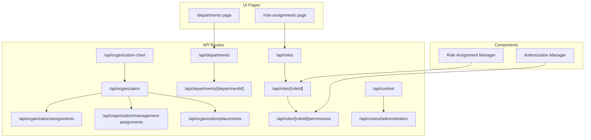
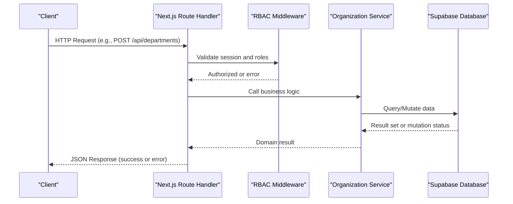
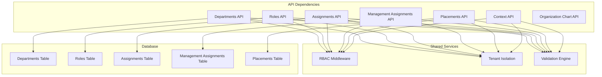

# Organization Management APIs

<cite>
**Referenced Files in This Document**
- [route.ts](file://apps/hr-suite/app/api/organization/route.ts)
- [route.ts](file://apps/hr-suite/app/api/organization/assignments/route.ts)
- [route.ts](file://apps/hr-suite/app/api/organization/management-assignments/route.ts)
- [route.ts](file://apps/hr-suite/app/api/organization/placements/route.ts)
- [route.ts](file://apps/hr-suite/app/api/departments/route.ts)
- [route.ts](file://apps/hr-suite/app/api/departments/[departmentId]/route.ts)
- [route.ts](file://apps/hr-suite/app/api/roles/route.ts)
- [route.ts](file://apps/hr-suite/app/api/roles/[roleId]/route.ts)
- [route.ts](file://apps/hr-suite/app/api/roles/[roleId]/permissions/route.ts)
- [route.ts](file://apps/hr-suite/app/api/context/route.ts)
- [route.ts](file://apps/hr-suite/app/api/context/administration/route.ts)
- [route.ts](file://apps/hr-suite/app/api/organization-chart/route.ts)
- [page.tsx](file://apps/hr-suite/app/(dashboard)/departments/page.tsx)
- [page.tsx](file://apps/hr-suite/app/(dashboard)/role-assignments/page.tsx)
- [authorization-manager.tsx](file://apps/hr-suite/components/organization/authorization-manager.tsx)
- [role-assignment-manager.tsx](file://apps/hr-suite/components/organization/role-assignment-manager.tsx)
- [20260712124911_add_tenant_rbac_and_organization.sql](file://apps/hr-suite/supabase/migrations/20260712124911_add_tenant_rbac_and_organization.sql)
- [20260715123639_add_organization_authorization_management.sql](file://apps/hr-suite/supabase/migrations/20260715123639_add_organization_authorization_management.sql)
</cite>

## Table of Contents
1. [Introduction](#introduction)
2. [Project Structure](#project-structure)
3. [Core Components](#core-components)
4. [Architecture Overview](#architecture-overview)
5. [Detailed Component Analysis](#detailed-component-analysis)
6. [Dependency Analysis](#dependency-analysis)
7. [Performance Considerations](#performance-considerations)
8. [Troubleshooting Guide](#troubleshooting-guide)
9. [Conclusion](#conclusion)
10. [Appendices](#appendices)

## Introduction
This document provides comprehensive API documentation for Organization Management endpoints in the HR Suite application. It covers:
- Department management with hierarchical structure and parent-child relationships
- Role assignment APIs for user-role mappings, permission inheritance, and access control
- Management assignments for reporting structures, delegation chains, and authority matrices
- Placement management for employee-department assignments and organizational positioning
- Authorization APIs for fine-grained permissions, resource-based access control, and policy enforcement
- Multitenancy considerations and administration context switching

Each endpoint specifies HTTP methods, URL patterns, request/response schemas, authentication requirements (RBAC), parameter validation, and error handling. Practical examples illustrate organizational setup, role hierarchies, and authorization patterns.

## Project Structure
Organization Management is implemented as Next.js App Router API routes under apps/hr-suite/app/api/organization and related modules. The UI pages and components provide context for how these APIs are consumed.

**Diagram sources**
- [route.ts](file://apps/hr-suite/app/api/organization/route.ts)
- [route.ts](file://apps/hr-suite/app/api/organization/assignments/route.ts)
- [route.ts](file://apps/hr-suite/app/api/organization/management-assignments/route.ts)
- [route.ts](file://apps/hr-suite/app/api/organization/placements/route.ts)
- [route.ts](file://apps/hr-suite/app/api/departments/route.ts)
- [route.ts](file://apps/hr-suite/app/api/departments/[departmentId]/route.ts)
- [route.ts](file://apps/hr-suite/app/api/roles/route.ts)
- [route.ts](file://apps/hr-suite/app/api/roles/[roleId]/route.ts)
- [route.ts](file://apps/hr-suite/app/api/roles/[roleId]/permissions/route.ts)
- [route.ts](file://apps/hr-suite/app/api/context/route.ts)
- [route.ts](file://apps/hr-suite/app/api/context/administration/route.ts)
- [route.ts](file://apps/hr-suite/app/api/organization-chart/route.ts)
- [page.tsx](file://apps/hr-suite/app/(dashboard)/departments/page.tsx)
- [page.tsx](file://apps/hr-suite/app/(dashboard)/role-assignments/page.tsx)
- [authorization-manager.tsx](file://apps/hr-suite/components/organization/authorization-manager.tsx)
- [role-assignment-manager.tsx](file://apps/hr-suite/components/organization/role-assignment-manager.tsx)

**Section sources**
- [route.ts](file://apps/hr-suite/app/api/organization/route.ts)
- [route.ts](file://apps/hr-suite/app/api/departments/route.ts)
- [route.ts](file://apps/hr-suite/app/api/roles/route.ts)
- [route.ts](file://apps/hr-suite/app/api/context/route.ts)
- [page.tsx](file://apps/hr-suite/app/(dashboard)/departments/page.tsx)
- [page.tsx](file://apps/hr-suite/app/(dashboard)/role-assignments/page.tsx)

## Core Components
- Departments API: CRUD for departments with hierarchical parent-child relationships and organizational units.
- Roles API: Role definitions, role membership, and role permissions.
- Assignments API: User-to-role assignments with scope and inheritance.
- Management Assignments API: Reporting lines, delegation chains, and authority matrices.
- Placements API: Employee-to-department assignments and organizational positioning.
- Context API: Tenant and administration context switching for multitenancy.
- Organization Chart API: Read model for visualization and traversal.

Authentication and RBAC:
- All write operations require authenticated users with appropriate RBAC roles.
- Read operations may be scoped to tenant and administration context.
- Fine-grained authorization policies enforce resource-level access.

Parameter Validation:
- Path parameters must be valid UUIDs where applicable.
- Request bodies are validated against expected schemas; invalid payloads return 400 errors.
- Required fields are enforced per endpoint.

Error Handling:
- Standardized error responses include code, message, and details.
- Common codes: 400 (Bad Request), 401 (Unauthorized), 403 (Forbidden), 404 (Not Found), 409 (Conflict), 500 (Internal Server Error).

**Section sources**
- [route.ts](file://apps/hr-suite/app/api/departments/route.ts)
- [route.ts](file://apps/hr-suite/app/api/departments/[departmentId]/route.ts)
- [route.ts](file://apps/hr-suite/app/api/roles/route.ts)
- [route.ts](file://apps/hr-suite/app/api/roles/[roleId]/route.ts)
- [route.ts](file://apps/hr-suite/app/api/roles/[roleId]/permissions/route.ts)
- [route.ts](file://apps/hr-suite/app/api/organization/assignments/route.ts)
- [route.ts](file://apps/hr-suite/app/api/organization/management-assignments/route.ts)
- [route.ts](file://apps/hr-suite/app/api/organization/placements/route.ts)
- [route.ts](file://apps/hr-suite/app/api/context/route.ts)
- [route.ts](file://apps/hr-suite/app/api/context/administration/route.ts)
- [route.ts](file://apps/hr-suite/app/api/organization-chart/route.ts)

## Architecture Overview
The Organization Management subsystem follows a layered architecture:
- API Layer: Next.js Route Handlers expose RESTful endpoints.
- Service Layer: Business logic validates inputs, enforces RBAC, and orchestrates data operations.
- Data Layer: Supabase database with RLS policies ensures tenant isolation and fine-grained access control.

**Diagram sources**
- [route.ts](file://apps/hr-suite/app/api/departments/route.ts)
- [route.ts](file://apps/hr-suite/app/api/roles/route.ts)
- [route.ts](file://apps/hr-suite/app/api/organization/assignments/route.ts)
- [route.ts](file://apps/hr-suite/app/api/organization/management-assignments/route.ts)
- [route.ts](file://apps/hr-suite/app/api/organization/placements/route.ts)

## Detailed Component Analysis

### Departments API
Endpoints:
- GET /api/departments: List departments with optional filters (tenant, parent_id, name).
- POST /api/departments: Create department with required fields (name, parent_id optional).
- GET /api/departments/[departmentId]: Retrieve department by ID.
- PUT /api/departments/[departmentId]: Update department fields.
- DELETE /api/departments/[departmentId]: Delete department if no children or dependencies.

Request/Response Schemas:
- Department: id (UUID), name (string), parent_id (UUID|null), created_at (timestamp), updated_at (timestamp).
- List response: array of Department objects.
- Create/Update request: name (required), parent_id (optional).

Authentication and RBAC:
- Requires role with organization.admin or department.manage permissions.
- Scopes enforced by tenant and administration context.

Validation:
- name must be non-empty string.
- parent_id must reference an existing department within the same tenant.

Error Handling:
- 400 on invalid input.
- 404 when department not found.
- 409 on conflicts (e.g., circular hierarchy).

Practical Example:
- Create a root department without parent_id.
- Create child departments by setting parent_id to the root department.

**Section sources**
- [route.ts](file://apps/hr-suite/app/api/departments/route.ts)
- [route.ts](file://apps/hr-suite/app/api/departments/[departmentId]/route.ts)

### Roles API
Endpoints:
- GET /api/roles: List roles with optional filters (tenant, name).
- POST /api/roles: Create role with required fields (name, description optional).
- GET /api/roles/[roleId]: Retrieve role by ID.
- PUT /api/roles/[roleId]: Update role fields.
- DELETE /api/roles/[roleId]: Delete role if not referenced.
- GET /api/roles/[roleId]/permissions: List permissions assigned to role.
- POST /api/roles/[roleId]/permissions: Add permissions to role.
- DELETE /api/roles/[roleId]/permissions: Remove permissions from role.

Request/Response Schemas:
- Role: id (UUID), name (string), description (string|null), created_at (timestamp), updated_at (timestamp).
- Permission: id (UUID), resource (string), action (string), condition (object|null).
- Role Permissions list: array of Permission objects.

Authentication and RBAC:
- Requires role with organization.admin or role.manage permissions.
- Permission changes require elevated privileges.

Validation:
- name must be unique within tenant.
- resource and action must match allowed catalog values.

Error Handling:
- 400 on invalid input.
- 404 when role not found.
- 409 on conflicts (e.g., duplicate permission).

Practical Example:
- Define roles: HR Admin, Department Manager, Employee.
- Assign permissions: read/write to employees, manage departments, view reports.

**Section sources**
- [route.ts](file://apps/hr-suite/app/api/roles/route.ts)
- [route.ts](file://apps/hr-suite/app/api/roles/[roleId]/route.ts)
- [route.ts](file://apps/hr-suite/app/api/roles/[roleId]/permissions/route.ts)

### Assignments API
Endpoints:
- GET /api/organization/assignments: List user-role assignments with filters (user_id, role_id, tenant_id).
- POST /api/organization/assignments: Create assignment mapping user to role with optional scope.
- PUT /api/organization/assignments/[assignmentId]: Update assignment scope or status.
- DELETE /api/organization/assignments/[assignmentId]: Remove assignment.

Request/Response Schemas:
- Assignment: id (UUID), user_id (UUID), role_id (UUID), scope (object|null), status (enum), created_at (timestamp), updated_at (timestamp).
- Scope: department_ids (array of UUID), manager_id (UUID|null), effective_from (timestamp), effective_to (timestamp).

Authentication and RBAC:
- Requires role with organization.admin or assignment.manage permissions.
- Scope restrictions enforced by tenant and administration context.

Validation:
- user_id and role_id must exist within tenant.
- scope.department_ids must reference valid departments.

Error Handling:
- 400 on invalid input.
- 404 when user or role not found.
- 409 on conflicting assignments.

Practical Example:
- Assign HR Admin role to a user with scope limited to specific departments.
- Set effective dates for temporary assignments.

**Section sources**
- [route.ts](file://apps/hr-suite/app/api/organization/assignments/route.ts)

### Management Assignments API
Endpoints:
- GET /api/organization/management-assignments: List management assignments with filters (manager_id, subordinate_id, tenant_id).
- POST /api/organization/management-assignments: Create reporting relationship between manager and subordinate.
- PUT /api/organization/management-assignments/[assignmentId]: Update delegation chain or authority matrix.
- DELETE /api/organization/management-assignments/[assignmentId]: Remove reporting relationship.

Request/Response Schemas:
- ManagementAssignment: id (UUID), manager_id (UUID), subordinate_id (UUID), delegation_level (integer), authority_scope (object|null), created_at (timestamp), updated_at (timestamp).
- AuthorityScope: department_ids (array of UUID), approval_limits (object), decision_rights (array of strings).

Authentication and RBAC:
- Requires role with organization.admin or management.manage permissions.
- Delegation levels must form a valid hierarchy without cycles.

Validation:
- manager_id and subordinate_id must exist within tenant.
- delegation_level must be positive integer.
- authority_scope.department_ids must reference valid departments.

Error Handling:
- 400 on invalid input.
- 404 when manager or subordinate not found.
- 409 on cycle detection or conflicting authorities.

Practical Example:
- Establish reporting line: VP -> Director -> Manager.
- Define approval limits per department and decision rights.

**Section sources**
- [route.ts](file://apps/hr-suite/app/api/organization/management-assignments/route.ts)

### Placements API
Endpoints:
- GET /api/organization/placements: List placements with filters (employee_id, department_id, tenant_id).
- POST /api/organization/placements: Assign employee to department with effective dates and job title.
- PUT /api/organization/placements/[placementId]: Update placement details or reassign to different department.
- DELETE /api/organization/placements/[placementId]: Terminate placement with reason.

Request/Response Schemas:
- Placement: id (UUID), employee_id (UUID), department_id (UUID), job_title (string), effective_from (timestamp), effective_to (timestamp|null), status (enum), created_at (timestamp), updated_at (timestamp).

Authentication and RBAC:
- Requires role with organization.admin or placement.manage permissions.
- Effective date ranges must not overlap for the same employee.

Validation:
- employee_id and department_id must exist within tenant.
- effective_from must be valid timestamp.
- effective_to must be greater than effective_from if provided.

Error Handling:
- 400 on invalid input.
- 404 when employee or department not found.
- 409 on overlapping placements or invalid state transitions.

Practical Example:
- Assign employee to Marketing department with job title “Content Specialist”.
- Reassign employee to Sales department with new effective dates.

**Section sources**
- [route.ts](file://apps/hr-suite/app/api/organization/placements/route.ts)

### Context API
Endpoints:
- GET /api/context: Get current tenant and administration context.
- POST /api/context/administration: Switch administration context for multi-admin scenarios.

Request/Response Schemas:
- Context: tenant_id (UUID), administration_id (UUID|null), user_roles (array of strings), permissions (array of objects).
- AdministrationSwitch: administration_id (UUID), reason (string).

Authentication and RBAC:
- Requires authenticated user with admin privileges for context switching.
- Context switching affects subsequent API calls within the session.

Validation:
- administration_id must exist and be accessible to the user.
- reason must be provided for audit trail.

Error Handling:
- 400 on invalid input.
- 403 when user lacks permission to switch context.
- 404 when administration not found.

Practical Example:
- Switch from default administration to a specific client administration for HR operations.

**Section sources**
- [route.ts](file://apps/hr-suite/app/api/context/route.ts)
- [route.ts](file://apps/hr-suite/app/api/context/administration/route.ts)

### Organization Chart API
Endpoints:
- GET /api/organization-chart: Retrieve organization chart data including departments, roles, assignments, and placements.

Request/Response Schemas:
- OrganizationChart: nodes (array of DepartmentNode), edges (array of RelationshipEdge), metadata (object).
- DepartmentNode: id (UUID), name (string), parent_id (UUID|null), manager_id (UUID|null), placement_count (integer).
- RelationshipEdge: source (UUID), target (UUID), type (enum), weight (integer).

Authentication and RBAC:
- Requires read access to organization data based on tenant and administration context.

Validation:
- Optional query parameters: depth (integer), include_inactive (boolean), filter_by_department (UUID).

Error Handling:
- 400 on invalid parameters.
- 404 when organization data not available.

Practical Example:
- Fetch full org chart with three levels of hierarchy for visualization.

**Section sources**
- [route.ts](file://apps/hr-suite/app/api/organization-chart/route.ts)

## Dependency Analysis
The Organization Management APIs depend on:
- Authentication and RBAC middleware for access control.
- Database layer with RLS policies for tenant isolation and fine-grained permissions.
- UI components that consume APIs for interactive management.

**Diagram sources**
- [route.ts](file://apps/hr-suite/app/api/departments/route.ts)
- [route.ts](file://apps/hr-suite/app/api/roles/route.ts)
- [route.ts](file://apps/hr-suite/app/api/organization/assignments/route.ts)
- [route.ts](file://apps/hr-suite/app/api/organization/management-assignments/route.ts)
- [route.ts](file://apps/hr-suite/app/api/organization/placements/route.ts)
- [route.ts](file://apps/hr-suite/app/api/context/route.ts)
- [route.ts](file://apps/hr-suite/app/api/organization-chart/route.ts)

**Section sources**
- [route.ts](file://apps/hr-suite/app/api/departments/route.ts)
- [route.ts](file://apps/hr-suite/app/api/roles/route.ts)
- [route.ts](file://apps/hr-suite/app/api/organization/assignments/route.ts)
- [route.ts](file://apps/hr-suite/app/api/organization/management-assignments/route.ts)
- [route.ts](file://apps/hr-suite/app/api/organization/placements/route.ts)
- [route.ts](file://apps/hr-suite/app/api/context/route.ts)
- [route.ts](file://apps/hr-suite/app/api/organization-chart/route.ts)

## Performance Considerations
- Use pagination for list endpoints to handle large datasets efficiently.
- Implement caching for read-heavy endpoints like organization chart.
- Optimize database queries with proper indexing on foreign keys and filters.
- Avoid deep recursion in hierarchy traversal; use iterative approaches with depth limits.
- Batch operations where possible to reduce network overhead.

[No sources needed since this section provides general guidance]

## Troubleshooting Guide
Common issues and resolutions:
- Authentication failures: Ensure valid session and correct RBAC roles are present.
- Permission denied: Verify user has required permissions for the requested operation.
- Invalid parameters: Check request schema and validate input types.
- Conflicts: Resolve duplicate entries or overlapping effective dates.
- Not found: Confirm entity IDs exist within the current tenant context.

Debugging tips:
- Enable detailed logging for API requests and responses.
- Use organization chart API to visualize current state.
- Check database policies and RLS rules for tenant isolation.

**Section sources**
- [route.ts](file://apps/hr-suite/app/api/departments/route.ts)
- [route.ts](file://apps/hr-suite/app/api/roles/route.ts)
- [route.ts](file://apps/hr-suite/app/api/organization/assignments/route.ts)
- [route.ts](file://apps/hr-suite/app/api/organization/management-assignments/route.ts)
- [route.ts](file://apps/hr-suite/app/api/organization/placements/route.ts)
- [route.ts](file://apps/hr-suite/app/api/context/route.ts)

## Conclusion
The Organization Management APIs provide a comprehensive foundation for managing departments, roles, assignments, management structures, and employee placements within a multitenant HR system. With robust RBAC, fine-grained authorization, and tenant isolation, these endpoints enable secure and scalable organizational management. Proper implementation of validation, error handling, and performance optimizations ensures reliable operation in production environments.

[No sources needed since this section summarizes without analyzing specific files]

## Appendices

### Database Schema Overview
Key tables involved in Organization Management:
- departments: Stores hierarchical department structure with parent-child relationships.
- roles: Defines roles and their metadata.
- role_permissions: Maps permissions to roles with conditions.
- user_role_assignments: Links users to roles with scope and effective dates.
- management_assignments: Defines reporting relationships and delegation chains.
- placements: Associates employees with departments and job titles.

**Section sources**
- [20260712124911_add_tenant_rbac_and_organization.sql](file://apps/hr-suite/supabase/migrations/20260712124911_add_tenant_rbac_and_organization.sql)
- [20260715123639_add_organization_authorization_management.sql](file://apps/hr-suite/supabase/migrations/20260715123639_add_organization_authorization_management.sql)

### UI Integration Examples
- Departments page consumes departments API for CRUD operations.
- Role assignments page manages user-role mappings through roles API.
- Authorization manager component handles permission assignments and policy enforcement.

**Section sources**
- [page.tsx](file://apps/hr-suite/app/(dashboard)/departments/page.tsx)
- [page.tsx](file://apps/hr-suite/app/(dashboard)/role-assignments/page.tsx)
- [authorization-manager.tsx](file://apps/hr-suite/components/organization/authorization-manager.tsx)
- [role-assignment-manager.tsx](file://apps/hr-suite/components/organization/role-assignment-manager.tsx)