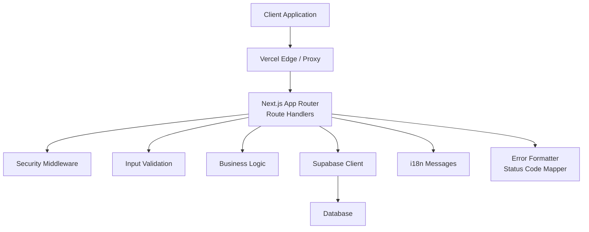
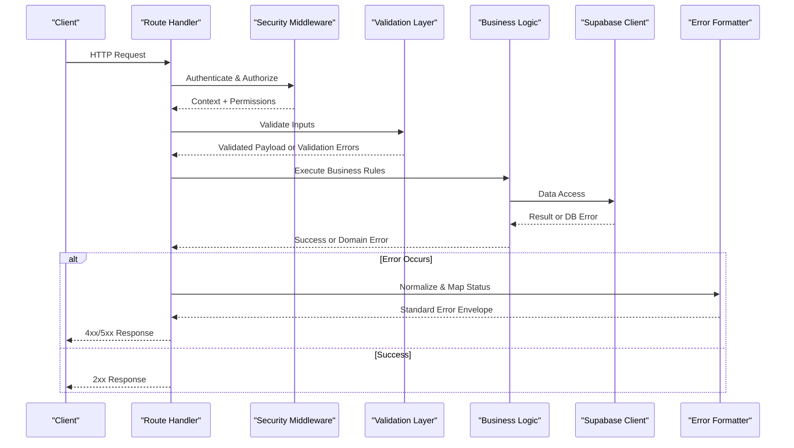
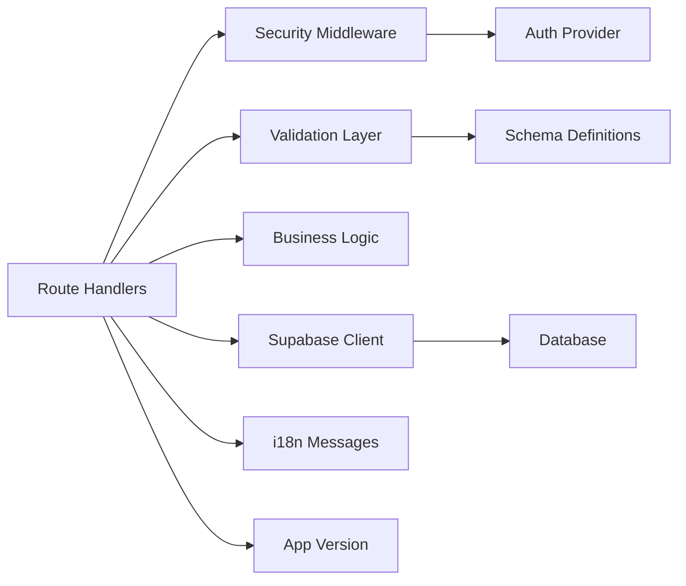

# Error Handling & Status Codes

<cite>
**Referenced Files in This Document**
- [apps/hr-suite/app/api/employees/route.ts](file://apps/hr-suite/app/api/employees/route.ts)
- [apps/hr-suite/app/api/employees/[employeeId]/route.ts](file://apps/hr-suite/app/api/employees/[employeeId]/route.ts)
- [apps/hr-suite/app/api/leave/request/route.ts](file://apps/hr-suite/app/api/leave/request/route.ts)
- [apps/hr-suite/app/api/leave/balance-report/route.ts](file://apps/hr-suite/app/api/leave/balance-report/route.ts)
- [apps/hr-suite/app/api/organization-chart/route.ts](file://apps/hr-suite/app/api/organization-chart/route.ts)
- [apps/hr-suite/app/api/context/route.ts](file://apps/hr-suite/app/api/context/route.ts)
- [apps/hr-suite/app/api/address-lookup/route.ts](file://apps/hr-suite/app/api/address-lookup/route.ts)
- [apps/hr-suite/app/api/hr-events/route.ts](file://apps/hr-suite/app/api/hr-events/route.ts)
- [apps/hr-suite/app/api/custom-fields/route.ts](file://apps/hr-suite/app/api/custom-fields/route.ts)
- [apps/hr-suite/app/api/dashboards/route.ts](file://apps/hr-suite/app/api/dashboards/route.ts)
- [apps/hr-suite/app/api/departments/route.ts](file://apps/hr-suite/app/api/departments/route.ts)
- [apps/hr-suite/app/api/invitations/route.ts](file://apps/hr-suite/app/api/invitations/route.ts)
- [apps/hr-suite/app/api/preferences/employees/route.ts](file://apps/hr-suite/app/api/preferences/employees/route.ts)
- [apps/hr-suite/app/api/reminders/route.ts](file://apps/hr-suite/app/api/reminders/route.ts)
- [apps/hr-suite/app/api/settings/holidays/route.ts](file://apps/hr-suite/app/api/settings/holidays/route.ts)
- [apps/hr-suite/app/api/star-performers/route.ts](file://apps/hr-suite/app/api/star-performers/route.ts)
- [apps/hr-suite/app/api/master-data/jobs/route.ts](file://apps/hr-suite/app/api/master-data/jobs/route.ts)
- [apps/hr-suite/app/api/roles/route.ts](file://apps/hr-suite/app/api/roles/route.ts)
- [apps/hr-suite/app/api/insights/upcoming-events/route.ts](file://apps/hr-suite/app/api/insights/upcoming-events/route.ts)
- [apps/hr-suite/app/api/organization/placements/route.ts](file://apps/hr-suite/app/api/organization/placements/route.ts)
- [apps/hr-suite/app/api/organization/assignments/route.ts](file://apps/hr-suite/app/api/organization/assignments/route.ts)
- [apps/hr-suite/app/api/employment/[employmentId]/route.ts](file://apps/hr-suite/app/api/employment/[employmentId]/route.ts)
- [apps/hr-suite/app/api/hera/conversations/route.ts](file://apps/hr-suite/app/api/hera/conversations/route.ts)
- [apps/hr-suite/app/api/hera/memory/route.ts](file://apps/hr-suite/app/api/hera/memory/route.ts)
- [apps/hr-suite/app/api/hera/preferences/route.ts](file://apps/hr-suite/app/api/hera/preferences/route.ts)
- [apps/hr-suite/app/auth/callback/route.ts](file://apps/hr-suite/app/auth/callback/route.ts)
- [apps/hr-suite/app/auth/signout/route.ts](file://apps/hr-suite/app/auth/signout/route.ts)
- [apps/hr-suite/messages/en/errors.json](file://apps/hr-suite/messages/en/errors.json)
- [apps/hr-suite/messages/en/validation.json](file://apps/hr-suite/messages/en/validation.json)
- [apps/hr-suite/components/hera/hera-request.ts](file://apps/hr-suite/components/hera/hera-request.ts)
- [apps/hr-suite/components/hera/hera-response-model.ts](file://apps/hr-suite/components/hera/hera-response-model.ts)
- [apps/hr-suite/lib/supabase/client.ts](file://apps/hr-suite/lib/supabase/client.ts)
- [apps/hr-suite/lib/security/middleware.ts](file://apps/hr-suite/lib/security/middleware.ts)
- [apps/hr-suite/lib/i18n/index.ts](file://apps/hr-suite/lib/i18n/index.ts)
- [apps/hr-suite/lib/app-version.ts](file://apps/hr-suite/lib/app-version.ts)
- [apps/hr-suite/proxy.ts](file://apps/hr-suite/proxy.ts)
- [vercel.json](file://vercel.json)
</cite>

## Table of Contents
1. [Introduction](#introduction)
2. [Project Structure](#project-structure)
3. [Core Components](#core-components)
4. [Architecture Overview](#architecture-overview)
5. [Detailed Component Analysis](#detailed-component-analysis)
6. [Dependency Analysis](#dependency-analysis)
7. [Performance Considerations](#performance-considerations)
8. [Troubleshooting Guide](#troubleshooting-guide)
9. [Conclusion](#conclusion)
10. [Appendices](#appendices)

## Introduction
This document defines LiquidHR’s API error handling patterns and status codes across the Next.js App Router endpoints. It standardizes how success responses (2xx), client errors (4xx), and server errors (5xx) are returned, describes custom error formats and schemas, and provides guidance for validation errors, business rule violations, system errors, retry strategies, rate limiting, timeouts, logging, debugging, monitoring, alerting, and performance impact.

The goal is to ensure consistent, predictable, and user-friendly error behavior across all API routes and clients.

## Project Structure
LiquidHR exposes RESTful APIs via Next.js App Router route handlers under apps/hr-suite/app/api. Each feature area has its own folder with route files that implement request handling, authorization, validation, data access, and response formatting. Shared utilities include Supabase client usage, security middleware, i18n message loading, and versioning helpers.

[No sources needed since this diagram shows conceptual workflow, not actual code structure]

## Core Components
- Route handlers: Each endpoint file implements HTTP methods, validates inputs, enforces authorization, calls business logic, and returns standardized JSON responses or errors.
- Security middleware: Centralized checks for authentication, authorization, tenant scoping, and input sanitization.
- Validation layer: Input parsing and schema validation; produces structured field-level errors.
- Business logic: Domain rules and workflows; raises domain-specific errors.
- Data access: Supabase client interactions; maps database errors to API errors.
- i18n messages: Human-readable error strings keyed by code and locale.
- Error formatter: Converts internal errors into consistent JSON payloads with HTTP status codes.

Key responsibilities:
- Map exceptions to appropriate HTTP status codes.
- Return a uniform error envelope containing code, message, details, and optional request id.
- Preserve sensitive information out of error responses.
- Log contextual diagnostics without leaking secrets.

**Section sources**
- [apps/hr-suite/app/api/employees/route.ts](file://apps/hr-suite/app/api/employees/route.ts)
- [apps/hr-suite/app/api/employees/[employeeId]/route.ts](file://apps/hr-suite/app/api/employees/[employeeId]/route.ts)
- [apps/hr-suite/app/api/leave/request/route.ts](file://apps/hr-suite/app/api/leave/request/route.ts)
- [apps/hr-suite/app/api/leave/balance-report/route.ts](file://apps/hr-suite/app/api/leave/balance-report/route.ts)
- [apps/hr-suite/app/api/organization-chart/route.ts](file://apps/hr-suite/app/api/organization-chart/route.ts)
- [apps/hr-suite/app/api/context/route.ts](file://apps/hr-suite/app/api/context/route.ts)
- [apps/hr-suite/app/api/address-lookup/route.ts](file://apps/hr-suite/app/api/address-lookup/route.ts)
- [apps/hr-suite/app/api/hr-events/route.ts](file://apps/hr-suite/app/api/hr-events/route.ts)
- [apps/hr-suite/app/api/custom-fields/route.ts](file://apps/hr-suite/app/api/custom-fields/route.ts)
- [apps/hr-suite/app/api/dashboards/route.ts](file://apps/hr-suite/app/api/dashboards/route.ts)
- [apps/hr-suite/app/api/departments/route.ts](file://apps/hr-suite/app/api/departments/route.ts)
- [apps/hr-suite/app/api/invitations/route.ts](file://apps/hr-suite/app/api/invitations/route.ts)
- [apps/hr-suite/app/api/preferences/employees/route.ts](file://apps/hr-suite/app/api/preferences/employees/route.ts)
- [apps/hr-suite/app/api/reminders/route.ts](file://apps/hr-suite/app/api/reminders/route.ts)
- [apps/hr-suite/app/api/settings/holidays/route.ts](file://apps/hr-suite/app/api/settings/holidays/route.ts)
- [apps/hr-suite/app/api/star-performers/route.ts](file://apps/hr-suite/app/api/star-performers/route.ts)
- [apps/hr-suite/app/api/master-data/jobs/route.ts](file://apps/hr-suite/app/api/master-data/jobs/route.ts)
- [apps/hr-suite/app/api/roles/route.ts](file://apps/hr-suite/app/api/roles/route.ts)
- [apps/hr-suite/app/api/insights/upcoming-events/route.ts](file://apps/hr-suite/app/api/insights/upcoming-events/route.ts)
- [apps/hr-suite/app/api/organization/placements/route.ts](file://apps/hr-suite/app/api/organization/placements/route.ts)
- [apps/hr-suite/app/api/organization/assignments/route.ts](file://apps/hr-suite/app/api/organization/assignments/route.ts)
- [apps/hr-suite/app/api/employment/[employmentId]/route.ts](file://apps/hr-suite/app/api/employment/[employmentId]/route.ts)
- [apps/hr-suite/app/api/hera/conversations/route.ts](file://apps/hr-suite/app/api/hera/conversations/route.ts)
- [apps/hr-suite/app/api/hera/memory/route.ts](file://apps/hr-suite/app/api/hera/memory/route.ts)
- [apps/hr-suite/app/api/hera/preferences/route.ts](file://apps/hr-suite/app/api/hera/preferences/route.ts)
- [apps/hr-suite/app/auth/callback/route.ts](file://apps/hr-suite/app/auth/callback/route.ts)
- [apps/hr-suite/app/auth/signout/route.ts](file://apps/hr-suite/app/auth/signout/route.ts)
- [apps/hr-suite/lib/security/middleware.ts](file://apps/hr-suite/lib/security/middleware.ts)
- [apps/hr-suite/lib/supabase/client.ts](file://apps/hr-suite/lib/supabase/client.ts)
- [apps/hr-suite/lib/i18n/index.ts](file://apps/hr-suite/lib/i18n/index.ts)
- [apps/hr-suite/messages/en/errors.json](file://apps/hr-suite/messages/en/errors.json)
- [apps/hr-suite/messages/en/validation.json](file://apps/hr-suite/messages/en/validation.json)

## Architecture Overview
The API error flow follows a layered approach:
- Request enters Next.js route handler.
- Security middleware validates identity and permissions.
- Validation layer parses and validates inputs.
- Business logic executes domain rules and operations.
- Data access interacts with Supabase.
- Errors are caught, normalized, and mapped to HTTP status codes.
- Responses return a consistent envelope with human-readable messages and machine-readable codes.

**Diagram sources**
- [apps/hr-suite/app/api/employees/route.ts](file://apps/hr-suite/app/api/employees/route.ts)
- [apps/hr-suite/app/api/leave/request/route.ts](file://apps/hr-suite/app/api/leave/request/route.ts)
- [apps/hr-suite/lib/security/middleware.ts](file://apps/hr-suite/lib/security/middleware.ts)
- [apps/hr-suite/lib/supabase/client.ts](file://apps/hr-suite/lib/supabase/client.ts)

## Detailed Component Analysis

### Standard HTTP Status Codes
- 2xx Success
  - 200 OK: Successful GET/PUT/PATCH/DELETE operations returning data.
  - 201 Created: Resource creation successful (e.g., creating an employee record).
  - 204 No Content: Successful mutation with no body (e.g., delete).
- 4xx Client Errors
  - 400 Bad Request: Invalid input, malformed JSON, missing required fields.
  - 401 Unauthorized: Missing or invalid authentication token.
  - 403 Forbidden: Insufficient permissions or tenant scope violation.
  - 404 Not Found: Resource does not exist.
  - 409 Conflict: Duplicate resource or state conflict (e.g., duplicate invitation).
  - 422 Unprocessable Entity: Validation failures with field-level details.
  - 429 Too Many Requests: Rate limit exceeded.
- 5xx Server Errors
  - 500 Internal Server Error: Unexpected failure in application or dependencies.
  - 502 Bad Gateway: Upstream service error (e.g., external address lookup).
  - 503 Service Unavailable: Temporary unavailability (e.g., maintenance, overload).

These codes should be consistently applied across all route handlers.

**Section sources**
- [apps/hr-suite/app/api/employees/route.ts](file://apps/hr-suite/app/api/employees/route.ts)
- [apps/hr-suite/app/api/employees/[employeeId]/route.ts](file://apps/hr-suite/app/api/employees/[employeeId]/route.ts)
- [apps/hr-suite/app/api/leave/request/route.ts](file://apps/hr-suite/app/api/leave/request/route.ts)
- [apps/hr-suite/app/api/leave/balance-report/route.ts](file://apps/hr-suite/app/api/leave/balance-report/route.ts)
- [apps/hr-suite/app/api/organization-chart/route.ts](file://apps/hr-suite/app/api/organization-chart/route.ts)
- [apps/hr-suite/app/api/context/route.ts](file://apps/hr-suite/app/api/context/route.ts)
- [apps/hr-suite/app/api/address-lookup/route.ts](file://apps/hr-suite/app/api/address-lookup/route.ts)
- [apps/hr-suite/app/api/hr-events/route.ts](file://apps/hr-suite/app/api/hr-events/route.ts)
- [apps/hr-suite/app/api/custom-fields/route.ts](file://apps/hr-suite/app/api/custom-fields/route.ts)
- [apps/hr-suite/app/api/dashboards/route.ts](file://apps/hr-suite/app/api/dashboards/route.ts)
- [apps/hr-suite/app/api/departments/route.ts](file://apps/hr-suite/app/api/departments/route.ts)
- [apps/hr-suite/app/api/invitations/route.ts](file://apps/hr-suite/app/api/invitations/route.ts)
- [apps/hr-suite/app/api/preferences/employees/route.ts](file://apps/hr-suite/app/api/preferences/employees/route.ts)
- [apps/hr-suite/app/api/reminders/route.ts](file://apps/hr-suite/app/api/reminders/route.ts)
- [apps/hr-suite/app/api/settings/holidays/route.ts](file://apps/hr-suite/app/api/settings/holidays/route.ts)
- [apps/hr-suite/app/api/star-performers/route.ts](file://apps/hr-suite/app/api/star-performers/route.ts)
- [apps/hr-suite/app/api/master-data/jobs/route.ts](file://apps/hr-suite/app/api/master-data/jobs/route.ts)
- [apps/hr-suite/app/api/roles/route.ts](file://apps/hr-suite/app/api/roles/route.ts)
- [apps/hr-suite/app/api/insights/upcoming-events/route.ts](file://apps/hr-suite/app/api/insights/upcoming-events/route.ts)
- [apps/hr-suite/app/api/organization/placements/route.ts](file://apps/hr-suite/app/api/organization/placements/route.ts)
- [apps/hr-suite/app/api/organization/assignments/route.ts](file://apps/hr-suite/app/api/organization/assignments/route.ts)
- [apps/hr-suite/app/api/employment/[employmentId]/route.ts](file://apps/hr-suite/app/api/employment/[employmentId]/route.ts)
- [apps/hr-suite/app/api/hera/conversations/route.ts](file://apps/hr-suite/app/api/hera/conversations/route.ts)
- [apps/hr-suite/app/api/hera/memory/route.ts](file://apps/hr-suite/app/api/hera/memory/route.ts)
- [apps/hr-suite/app/api/hera/preferences/route.ts](file://apps/hr-suite/app/api/hera/preferences/route.ts)
- [apps/hr-suite/app/auth/callback/route.ts](file://apps/hr-suite/app/auth/callback/route.ts)
- [apps/hr-suite/app/auth/signout/route.ts](file://apps/hr-suite/app/auth/signout/route.ts)

### Custom Error Format and Schema
All error responses follow a consistent envelope:
- status: numeric HTTP status code.
- code: machine-readable error code string.
- message: human-readable message localized via i18n keys.
- details: optional object with field-level errors or additional context.
- requestId: unique identifier for tracing requests.

Example payload shape:
{
  "status": 422,
  "code": "VALIDATION_ERROR",
  "message": "Invalid input provided.",
  "details": {
    "fields": [
      { "field": "email", "message": "Must be a valid email." }
    ]
  },
  "requestId": "req_abc123"
}

Success payloads:
{
  "data": { ... },
  "requestId": "req_abc123"
}

**Section sources**
- [apps/hr-suite/messages/en/errors.json](file://apps/hr-suite/messages/en/errors.json)
- [apps/hr-suite/messages/en/validation.json](file://apps/hr-suite/messages/en/validation.json)
- [apps/hr-suite/lib/i18n/index.ts](file://apps/hr-suite/lib/i18n/index.ts)

### Validation Error Handling
- Use schema validation at the boundary of each route handler.
- On failure, return 422 with field-level details.
- Map validation errors to i18n keys for consistent messaging.
- Avoid exposing internal validation library internals to clients.

Common scenarios:
- Missing required fields.
- Invalid data types or formats.
- Out-of-range values.
- Conflicting fields.

**Section sources**
- [apps/hr-suite/app/api/employees/route.ts](file://apps/hr-suite/app/api/employees/route.ts)
- [apps/hr-suite/app/api/leave/request/route.ts](file://apps/hr-suite/app/api/leave/request/route.ts)
- [apps/hr-suite/app/api/custom-fields/route.ts](file://apps/hr-suite/app/api/custom-fields/route.ts)
- [apps/hr-suite/app/api/dashboards/route.ts](file://apps/hr-suite/app/api/dashboards/route.ts)
- [apps/hr-suite/app/api/departments/route.ts](file://apps/hr-suite/app/api/departments/route.ts)
- [apps/hr-suite/app/api/invitations/route.ts](file://apps/hr-suite/app/api/invitations/route.ts)
- [apps/hr-suite/app/api/preferences/employees/route.ts](file://apps/hr-suite/app/api/preferences/employees/route.ts)
- [apps/hr-suite/app/api/reminders/route.ts](file://apps/hr-suite/app/api/reminders/route.ts)
- [apps/hr-suite/app/api/settings/holidays/route.ts](file://apps/hr-suite/app/api/settings/holidays/route.ts)
- [apps/hr-suite/app/api/star-performers/route.ts](file://apps/hr-suite/app/api/star-performers/route.ts)
- [apps/hr-suite/app/api/master-data/jobs/route.ts](file://apps/hr-suite/app/api/master-data/jobs/route.ts)
- [apps/hr-suite/app/api/roles/route.ts](file://apps/hr-suite/app/api/roles/route.ts)
- [apps/hr-suite/app/api/insights/upcoming-events/route.ts](file://apps/hr-suite/app/api/insights/upcoming-events/route.ts)
- [apps/hr-suite/app/api/organization/placements/route.ts](file://apps/hr-suite/app/api/organization/placements/route.ts)
- [apps/hr-suite/app/api/organization/assignments/route.ts](file://apps/hr-suite/app/api/organization/assignments/route.ts)
- [apps/hr-suite/app/api/employment/[employmentId]/route.ts](file://apps/hr-suite/app/api/employment/[employmentId]/route.ts)
- [apps/hr-suite/app/api/hera/conversations/route.ts](file://apps/hr-suite/app/api/hera/conversations/route.ts)
- [apps/hr-suite/app/api/hera/memory/route.ts](file://apps/hr-suite/app/api/hera/memory/route.ts)
- [apps/hr-suite/app/api/hera/preferences/route.ts](file://apps/hr-suite/app/api/hera/preferences/route.ts)
- [apps/hr-suite/messages/en/validation.json](file://apps/hr-suite/messages/en/validation.json)

### Business Rule Violations
- Enforce domain constraints in business logic layers.
- Return 409 Conflict for duplicates or state conflicts.
- Return 403 Forbidden for authorization or policy violations.
- Provide clear error codes and messages aligned with business semantics.

Examples:
- Attempting to create a duplicate invitation.
- Modifying a locked employment record.
- Performing actions outside tenant scope.

**Section sources**
- [apps/hr-suite/app/api/invitations/route.ts](file://apps/hr-suite/app/api/invitations/route.ts)
- [apps/hr-suite/app/api/employees/[employeeId]/route.ts](file://apps/hr-suite/app/api/employees/[employeeId]/route.ts)
- [apps/hr-suite/app/api/employment/[employmentId]/route.ts](file://apps/hr-suite/app/api/employment/[employmentId]/route.ts)
- [apps/hr-suite/app/api/context/route.ts](file://apps/hr-suite/app/api/context/route.ts)
- [apps/hr-suite/lib/security/middleware.ts](file://apps/hr-suite/lib/security/middleware.ts)

### System Error Scenarios
- Database connectivity issues: map to 500 or 503 depending on severity.
- External service failures (e.g., address lookup): map to 502 or 503.
- Unexpected runtime exceptions: map to 500 with sanitized logs.
- Timeouts: map to 504 Gateway Timeout if upstream exceeds limits.

Mitigations:
- Wrap external calls with timeouts and retries where safe.
- Fallbacks for non-critical features.
- Circuit breakers for unstable dependencies.

**Section sources**
- [apps/hr-suite/app/api/address-lookup/route.ts](file://apps/hr-suite/app/api/address-lookup/route.ts)
- [apps/hr-suite/lib/supabase/client.ts](file://apps/hr-suite/lib/supabase/client.ts)
- [apps/hr-suite/proxy.ts](file://apps/hr-suite/proxy.ts)

### Retry Strategies
- Idempotent GET requests: safe to retry with exponential backoff.
- Non-idempotent mutations: avoid automatic retries unless using idempotency keys.
- Recommended strategy:
  - Base delay: 1 second.
  - Max attempts: 3.
  - Backoff multiplier: 2x.
  - Jitter: randomize to prevent thundering herd.
  - Respect Retry-After header when present.

Rate limiting:
- Return 429 with Retry-After header.
- Include a stable error code like RATE_LIMIT_EXCEEDED.

Timeout handling:
- Set explicit timeouts for network calls.
- Return 504 for upstream timeouts.
- Surface timeout errors to clients with actionable messages.

**Section sources**
- [apps/hr-suite/app/api/address-lookup/route.ts](file://apps/hr-suite/app/api/address-lookup/route.ts)
- [apps/hr-suite/app/api/hr-events/route.ts](file://apps/hr-suite/app/api/hr-events/route.ts)
- [apps/hr-suite/app/api/insights/upcoming-events/route.ts](file://apps/hr-suite/app/api/insights/upcoming-events/route.ts)
- [apps/hr-suite/proxy.ts](file://apps/hr-suite/proxy.ts)
- [vercel.json](file://vercel.json)

### Logging Strategies
- Log request metadata: method, path, query params (sanitized), userId, tenantId.
- Log error context: stack traces, correlation ids, upstream error messages.
- Do not log secrets, tokens, or PII.
- Use structured logging for aggregation and analysis.

Recommended levels:
- Info: normal flows and key milestones.
- Warn: recoverable issues and degraded performance.
- Error: failed operations requiring attention.
- Fatal: unrecoverable conditions.

**Section sources**
- [apps/hr-suite/lib/security/middleware.ts](file://apps/hr-suite/lib/security/middleware.ts)
- [apps/hr-suite/lib/supabase/client.ts](file://apps/hr-suite/lib/supabase/client.ts)

### Debugging Techniques
- Enable verbose logging in development environments only.
- Use requestId to correlate logs across services.
- Capture minimal reproducible examples for bug reports.
- Inspect headers for rate limiting and caching directives.
- Validate payloads against schemas before sending.

**Section sources**
- [apps/hr-suite/lib/i18n/index.ts](file://apps/hr-suite/lib/i18n/index.ts)
- [apps/hr-suite/lib/app-version.ts](file://apps/hr-suite/lib/app-version.ts)

### Monitoring and Alerting
- Track error rates by status code and endpoint.
- Alert on spikes in 4xx and 5xx responses.
- Monitor latency percentiles and timeout occurrences.
- Track rate limiting frequency and retry-after durations.
- Integrate with observability platforms for dashboards and alerts.

Key metrics:
- Error rate per endpoint.
- Latency p50/p95/p99.
- Timeout counts.
- Rate limit hits.
- Upstream dependency health.

**Section sources**
- [apps/hr-suite/app/api/hr-events/route.ts](file://apps/hr-suite/app/api/hr-events/route.ts)
- [apps/hr-suite/app/api/insights/upcoming-events/route.ts](file://apps/hr-suite/app/api/insights/upcoming-events/route.ts)
- [apps/hr-suite/proxy.ts](file://apps/hr-suite/proxy.ts)

### Performance Impact of Error Conditions
- Excessive validation errors indicate client-side issues; optimize payloads.
- Frequent 403/401 errors suggest auth misconfiguration; review token issuance and scopes.
- High 5xx rates point to backend instability; investigate database load and external dependencies.
- Rate limiting spikes may require scaling or throttling client behavior.

Optimization tips:
- Cache read-heavy endpoints where appropriate.
- Paginate large datasets.
- Reduce payload sizes and unnecessary fields.
- Use efficient queries and indexes.

**Section sources**
- [apps/hr-suite/app/api/dashboards/route.ts](file://apps/hr-suite/app/api/dashboards/route.ts)
- [apps/hr-suite/app/api/employees/route.ts](file://apps/hr-suite/app/api/employees/route.ts)
- [apps/hr-suite/app/api/organization-chart/route.ts](file://apps/hr-suite/app/api/organization-chart/route.ts)

## Dependency Analysis
The API layer depends on shared libraries for security, data access, i18n, and environment configuration. Route handlers coordinate these components to produce consistent responses.

**Diagram sources**
- [apps/hr-suite/lib/security/middleware.ts](file://apps/hr-suite/lib/security/middleware.ts)
- [apps/hr-suite/lib/supabase/client.ts](file://apps/hr-suite/lib/supabase/client.ts)
- [apps/hr-suite/lib/i18n/index.ts](file://apps/hr-suite/lib/i18n/index.ts)
- [apps/hr-suite/lib/app-version.ts](file://apps/hr-suite/lib/app-version.ts)

**Section sources**
- [apps/hr-suite/lib/security/middleware.ts](file://apps/hr-suite/lib/security/middleware.ts)
- [apps/hr-suite/lib/supabase/client.ts](file://apps/hr-suite/lib/supabase/client.ts)
- [apps/hr-suite/lib/i18n/index.ts](file://apps/hr-suite/lib/i18n/index.ts)
- [apps/hr-suite/lib/app-version.ts](file://apps/hr-suite/lib/app-version.ts)

## Performance Considerations
- Prefer streaming responses for large datasets.
- Minimize synchronous blocking operations in route handlers.
- Use connection pooling for database access.
- Implement pagination and filtering to reduce payload size.
- Avoid heavy computations in hot paths; offload to background jobs.

[No sources needed since this section provides general guidance]

## Troubleshooting Guide
Common issues and resolutions:
- 401 Unauthorized: Verify token presence and validity; check expiration and scopes.
- 403 Forbidden: Confirm user roles and tenant scoping; review policies.
- 404 Not Found: Ensure resource IDs are correct and exist within tenant scope.
- 422 Unprocessable Entity: Validate input schemas; inspect field-level errors.
- 429 Too Many Requests: Implement backoff and respect Retry-After; throttle client requests.
- 500 Internal Server Error: Check logs for stack traces; verify database connectivity.
- 502 Bad Gateway: Investigate upstream service health; validate external API credentials.
- 503 Service Unavailable: Review maintenance windows and capacity; scale resources.

Debugging steps:
- Reproduce with minimal payload.
- Inspect requestId in logs.
- Validate headers and cookies.
- Test in isolation without third-party dependencies.

**Section sources**
- [apps/hr-suite/app/api/employees/route.ts](file://apps/hr-suite/app/api/employees/route.ts)
- [apps/hr-suite/app/api/employees/[employeeId]/route.ts](file://apps/hr-suite/app/api/employees/[employeeId]/route.ts)
- [apps/hr-suite/app/api/leave/request/route.ts](file://apps/hr-suite/app/api/leave/request/route.ts)
- [apps/hr-suite/app/api/leave/balance-report/route.ts](file://apps/hr-suite/app/api/leave/balance-report/route.ts)
- [apps/hr-suite/app/api/organization-chart/route.ts](file://apps/hr-suite/app/api/organization-chart/route.ts)
- [apps/hr-suite/app/api/context/route.ts](file://apps/hr-suite/app/api/context/route.ts)
- [apps/hr-suite/app/api/address-lookup/route.ts](file://apps/hr-suite/app/api/address-lookup/route.ts)
- [apps/hr-suite/app/api/hr-events/route.ts](file://apps/hr-suite/app/api/hr-events/route.ts)
- [apps/hr-suite/app/api/custom-fields/route.ts](file://apps/hr-suite/app/api/custom-fields/route.ts)
- [apps/hr-suite/app/api/dashboards/route.ts](file://apps/hr-suite/app/api/dashboards/route.ts)
- [apps/hr-suite/app/api/departments/route.ts](file://apps/hr-suite/app/api/departments/route.ts)
- [apps/hr-suite/app/api/invitations/route.ts](file://apps/hr-suite/app/api/invitations/route.ts)
- [apps/hr-suite/app/api/preferences/employees/route.ts](file://apps/hr-suite/app/api/preferences/employees/route.ts)
- [apps/hr-suite/app/api/reminders/route.ts](file://apps/hr-suite/app/api/reminders/route.ts)
- [apps/hr-suite/app/api/settings/holidays/route.ts](file://apps/hr-suite/app/api/settings/holidays/route.ts)
- [apps/hr-suite/app/api/star-performers/route.ts](file://apps/hr-suite/app/api/star-performers/route.ts)
- [apps/hr-suite/app/api/master-data/jobs/route.ts](file://apps/hr-suite/app/api/master-data/jobs/route.ts)
- [apps/hr-suite/app/api/roles/route.ts](file://apps/hr-suite/app/api/roles/route.ts)
- [apps/hr-suite/app/api/insights/upcoming-events/route.ts](file://apps/hr-suite/app/api/insights/upcoming-events/route.ts)
- [apps/hr-suite/app/api/organization/placements/route.ts](file://apps/hr-suite/app/api/organization/placements/route.ts)
- [apps/hr-suite/app/api/organization/assignments/route.ts](file://apps/hr-suite/app/api/organization/assignments/route.ts)
- [apps/hr-suite/app/api/employment/[employmentId]/route.ts](file://apps/hr-suite/app/api/employment/[employmentId]/route.ts)
- [apps/hr-suite/app/api/hera/conversations/route.ts](file://apps/hr-suite/app/api/hera/conversations/route.ts)
- [apps/hr-suite/app/api/hera/memory/route.ts](file://apps/hr-suite/app/api/hera/memory/route.ts)
- [apps/hr-suite/app/api/hera/preferences/route.ts](file://apps/hr-suite/app/api/hera/preferences/route.ts)
- [apps/hr-suite/app/auth/callback/route.ts](file://apps/hr-suite/app/auth/callback/route.ts)
- [apps/hr-suite/app/auth/signout/route.ts](file://apps/hr-suite/app/auth/signout/route.ts)
- [apps/hr-suite/lib/security/middleware.ts](file://apps/hr-suite/lib/security/middleware.ts)
- [apps/hr-suite/lib/supabase/client.ts](file://apps/hr-suite/lib/supabase/client.ts)

## Conclusion
LiquidHR’s API error handling is designed around consistency, clarity, and reliability. By standardizing HTTP status codes, error envelopes, validation practices, and logging, clients can build robust integrations. Monitoring and alerting enable proactive issue detection, while performance considerations ensure scalability. Following these guidelines will improve developer experience and system stability.

[No sources needed since this section summarizes without analyzing specific files]

## Appendices

### Example Client Error Handling Patterns
- Always parse response envelopes and handle both success and error branches.
- For 422, display field-level messages to users.
- For 429, implement exponential backoff and respect Retry-After.
- For 5xx, log requestId and surface generic messages to users.
- Use typed models for responses to catch mismatches early.

**Section sources**
- [apps/hr-suite/components/hera/hera-request.ts](file://apps/hr-suite/components/hera/hera-request.ts)
- [apps/hr-suite/components/hera/hera-response-model.ts](file://apps/hr-suite/components/hera/hera-response-model.ts)