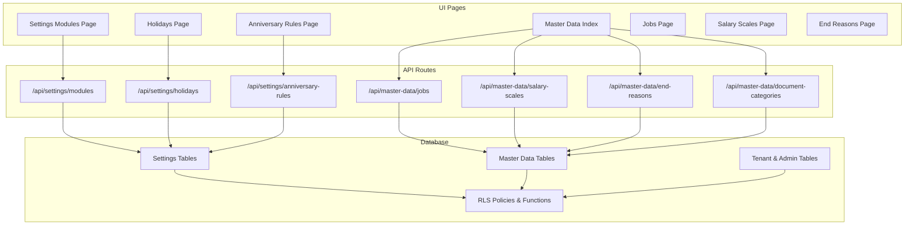
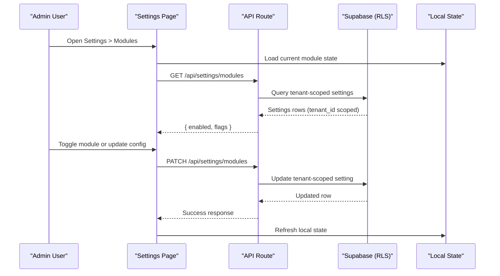
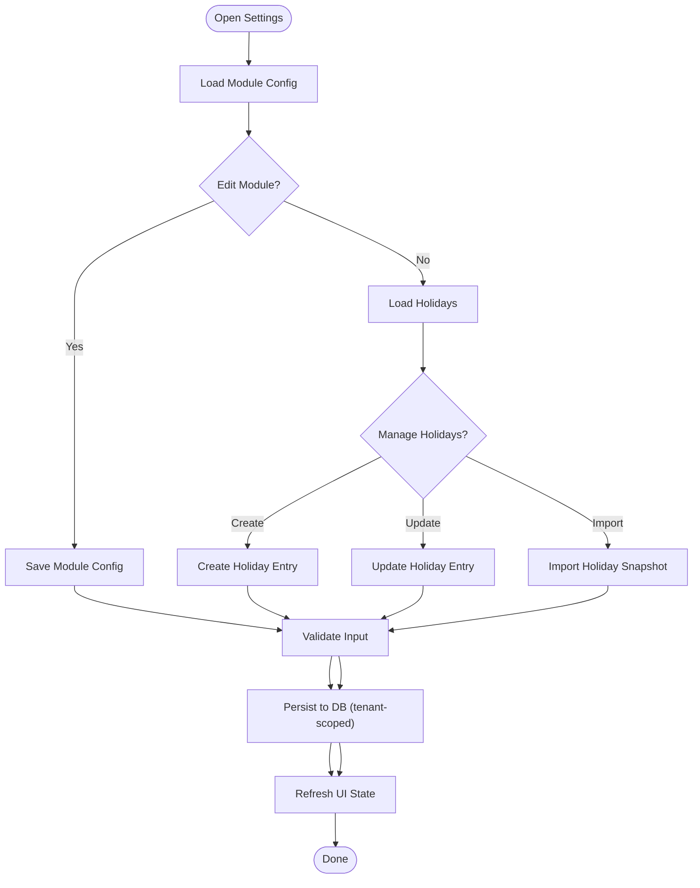
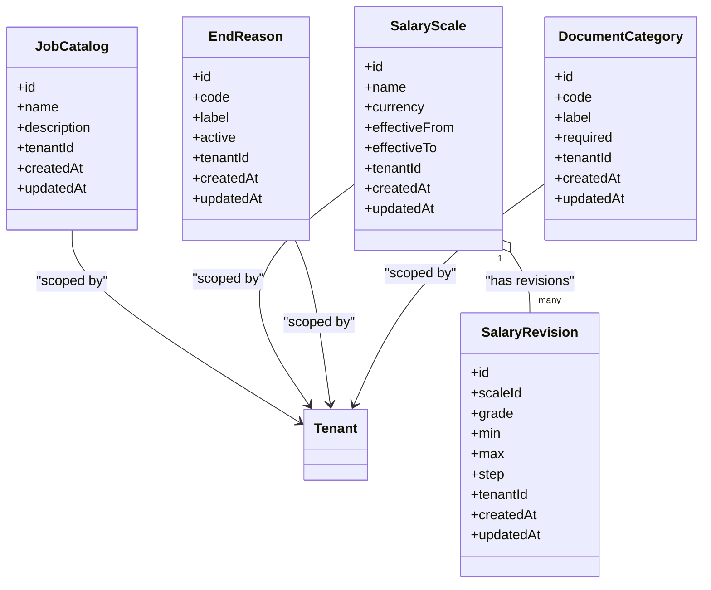
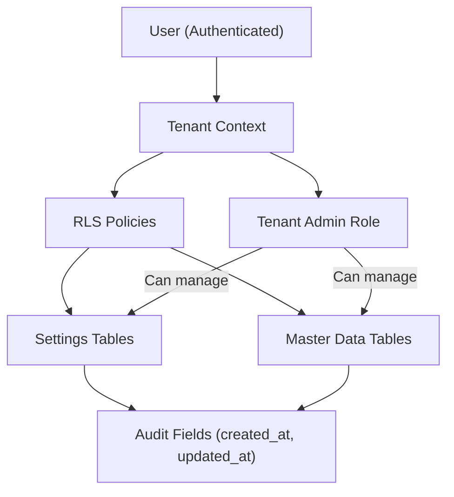
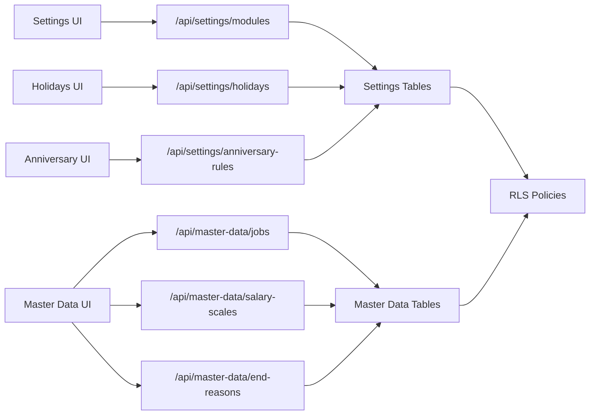

# Administration

<cite>
**Referenced Files in This Document**
- [apps/hr-suite/app/(dashboard)/settings/modules/page.tsx](file://apps/hr-suite/app/(dashboard)/settings/modules/page.tsx)
- [apps/hr-suite/app/(dashboard)/settings/holidays/page.tsx](file://apps/hr-suite/app/(dashboard)/settings/holidays/page.tsx)
- [apps/hr-suite/app/(dashboard)/settings/anniversary-rules/page.tsx](file://apps/hr-suite/app/(dashboard)/settings/anniversary-rules/page.tsx)
- [apps/hr-suite/app/(dashboard)/master-data/page.tsx](file://apps/hr-suite/app/(dashboard)/master-data/page.tsx)
- [apps/hr-suite/app/(dashboard)/master-data/jobs/page.tsx](file://apps/hr-suite/app/(dashboard)/master-data/jobs/page.tsx)
- [apps/hr-suite/app/(dashboard)/master-data/salary-scales/page.tsx](file://apps/hr-suite/app/(dashboard)/master-data/salary-scales/page.tsx)
- [apps/hr-suite/app/(dashboard)/master-data/end-reasons/page.tsx](file://apps/hr-suite/app/(dashboard)/master-data/end-reasons/page.tsx)
- [apps/hr-suite/app/api/settings/modules/route.ts](file://apps/hr-suite/app/api/settings/modules/route.ts)
- [apps/hr-suite/app/api/settings/holidays/route.ts](file://apps/hr-suite/app/api/settings/holidays/route.ts)
- [apps/hr-suite/app/api/settings/anniversary-rules/route.ts](file://apps/hr-suite/app/api/settings/anniversary-rules/route.ts)
- [apps/hr-suite/app/api/master-data/jobs/route.ts](file://apps/hr-suite/app/api/master-data/jobs/route.ts)
- [apps/hr-suite/app/api/master-data/salary-scales/route.ts](file://apps/hr-suite/app/api/master-data/salary-scales/route.ts)
- [apps/hr-suite/app/api/master-data/end-reasons/route.ts](file://apps/hr-suite/app/api/master-data/end-reasons/route.ts)
- [apps/hr-suite/app/api/master-data/document-categories/route.ts](file://apps/hr-suite/app/api/master-data/document-categories/route.ts)
- [apps/hr-suite/components/settings/module-settings-form.tsx](file://apps/hr-suite/components/settings/module-settings-form.tsx)
- [apps/hr-suite/components/settings/holiday-settings.tsx](file://apps/hr-suite/components/settings/holiday-settings.tsx)
- [apps/hr-suite/components/settings/anniversary-rules-manager.tsx](file://apps/hr-suite/components/settings/anniversary-rules-manager.tsx)
- [apps/hr-suite/components/master-data/job-catalog-manager.tsx](file://apps/hr-suite/components/master-data/job-catalog-manager.tsx)
- [apps/hr-suite/components/master-data/salary-scale-manager.tsx](file://apps/hr-suite/components/master-data/salary-scale-manager.tsx)
- [apps/hr-suite/components/master-data/end-reason-manager.tsx](file://apps/hr-suite/components/master-data/end-reason-manager.tsx)
- [apps/hr-suite/lib/settings/index.ts](file://apps/hr-suite/lib/settings/index.ts)
- [apps/hr-suite/lib/master-data/index.ts](file://apps/hr-suite/lib/master-data/index.ts)
- [apps/hr-suite/supabase/migrations/20260714174305_add_multitenancy_administrations.sql](file://apps/hr-suite/supabase/migrations/20260714174305_add_multitenancy_administrations.sql)
- [apps/hr-suite/supabase/migrations/20260718121308_add_settings_modules_work_patterns_holidays.sql](file://apps/hr-suite/supabase/migrations/20260718121308_add_settings_modules_work_patterns_holidays.sql)
- [apps/hr-suite/supabase/migrations/20260718122138_harden_settings_rosters_holidays.sql](file://apps/hr-suite/supabase/migrations/20260718122138_harden_settings_rosters_holidays.sql)
- [apps/hr-suite/supabase/migrations/20260718122614_enforce_optional_module_guards.sql](file://apps/hr-suite/supabase/migrations/20260718122614_enforce_optional_module_guards.sql)
- [apps/hr-suite/supabase/migrations/20260718123742_add_holiday_snapshot_import.sql](file://apps/hr-suite/supabase/migrations/20260718123742_add_holiday_snapshot_import.sql)
- [apps/hr-suite/supabase/migrations/20260718131000_harden_hr_master_data_document_policies.sql](file://apps/hr-suite/supabase/migrations/20260718131000_harden_hr_master_data_document_policies.sql)
- [apps/hr-suite/supabase/migrations/20260724100605_upcoming_events_and_anniversary_rules.sql](file://apps/hr-suite/supabase/migrations/20260724100605_upcoming_events_and_anniversary_rules.sql)
- [apps/hr-suite/supabase/tests/multitenancy_isolation.sql](file://apps/hr-suite/supabase/tests/multitenancy_isolation.sql)
</cite>

## Table of Contents
1. Introduction
2. Project Structure
3. Core Components
4. Architecture Overview
5. Detailed Component Analysis
6. Dependency Analysis
7. Performance Considerations
8. Troubleshooting Guide
9. Conclusion

## Introduction
This document explains LiquidHR’s Administration capabilities with a focus on:
- Settings Management for module configuration, user preferences, holiday calendars, and anniversary rules
- Master Data administration including job catalogs, salary scales, end reasons, and document categories
- Multitenancy architecture, tenant isolation mechanisms, and administrative controls
- Practical examples for configuring modules, managing organizational master data, and administering multi-tenant environments
- Security considerations, audit trails, and administrative best practices to maintain system integrity

The content is derived from the application pages, API routes, UI components, and database migrations that implement these features.

## Project Structure
Administration spans three primary layers:
- UI Pages: Next.js app router pages under settings and master-data
- API Routes: Server-side endpoints for CRUD operations and validations
- Database Layer: Migrations defining schemas, policies, and functions for tenant isolation and security

**Diagram sources**
- [apps/hr-suite/app/(dashboard)/settings/modules/page.tsx](file://apps/hr-suite/app/(dashboard)/settings/modules/page.tsx)
- [apps/hr-suite/app/(dashboard)/settings/holidays/page.tsx](file://apps/hr-suite/app/(dashboard)/settings/holidays/page.tsx)
- [apps/hr-suite/app/(dashboard)/settings/anniversary-rules/page.tsx](file://apps/hr-suite/app/(dashboard)/settings/anniversary-rules/page.tsx)
- [apps/hr-suite/app/(dashboard)/master-data/page.tsx](file://apps/hr-suite/app/(dashboard)/master-data/page.tsx)
- [apps/hr-suite/app/(dashboard)/master-data/jobs/page.tsx](file://apps/hr-suite/app/(dashboard)/master-data/jobs/page.tsx)
- [apps/hr-suite/app/(dashboard)/master-data/salary-scales/page.tsx](file://apps/hr-suite/app/(dashboard)/master-data/salary-scales/page.tsx)
- [apps/hr-suite/app/(dashboard)/master-data/end-reasons/page.tsx](file://apps/hr-suite/app/(dashboard)/master-data/end-reasons/page.tsx)
- [apps/hr-suite/app/api/settings/modules/route.ts](file://apps/hr-suite/app/api/settings/modules/route.ts)
- [apps/hr-suite/app/api/settings/holidays/route.ts](file://apps/hr-suite/app/api/settings/holidays/route.ts)
- [apps/hr-suite/app/api/settings/anniversary-rules/route.ts](file://apps/hr-suite/app/api/settings/anniversary-rules/route.ts)
- [apps/hr-suite/app/api/master-data/jobs/route.ts](file://apps/hr-suite/app/api/master-data/jobs/route.ts)
- [apps/hr-suite/app/api/master-data/salary-scales/route.ts](file://apps/hr-suite/app/api/master-data/salary-scales/route.ts)
- [apps/hr-suite/app/api/master-data/end-reasons/route.ts](file://apps/hr-suite/app/api/master-data/end-reasons/route.ts)
- [apps/hr-suite/app/api/master-data/document-categories/route.ts](file://apps/hr-suite/app/api/master-data/document-categories/route.ts)
- [apps/hr-suite/supabase/migrations/20260714174305_add_multitenancy_administrations.sql](file://apps/hr-suite/supabase/migrations/20260714174305_add_multitenancy_administrations.sql)
- [apps/hr-suite/supabase/migrations/20260718121308_add_settings_modules_work_patterns_holidays.sql](file://apps/hr-suite/supabase/migrations/20260718121308_add_settings_modules_work_patterns_holidays.sql)
- [apps/hr-suite/supabase/migrations/20260718122138_harden_settings_rosters_holidays.sql](file://apps/hr-suite/supabase/migrations/20260718122138_harden_settings_rosters_holidays.sql)
- [apps/hr-suite/supabase/migrations/20260718122614_enforce_optional_module_guards.sql](file://apps/hr-suite/supabase/migrations/20260718122614_enforce_optional_module_guards.sql)
- [apps/hr-suite/supabase/migrations/20260718123742_add_holiday_snapshot_import.sql](file://apps/hr-suite/supabase/migrations/20260718123742_add_holiday_snapshot_import.sql)
- [apps/hr-suite/supabase/migrations/20260718131000_harden_hr_master_data_document_policies.sql](file://apps/hr-suite/supabase/migrations/20260718131000_harden_hr_master_data_document_policies.sql)
- [apps/hr-suite/supabase/migrations/20260724100605_upcoming_events_and_anniversary_rules.sql](file://apps/hr-suite/supabase/migrations/20260724100605_upcoming_events_and_anniversary_rules.sql)

**Section sources**
- [apps/hr-suite/app/(dashboard)/settings/modules/page.tsx](file://apps/hr-suite/app/(dashboard)/settings/modules/page.tsx)
- [apps/hr-suite/app/(dashboard)/master-data/page.tsx](file://apps/hr-suite/app/(dashboard)/master-data/page.tsx)
- [apps/hr-suite/supabase/migrations/20260714174305_add_multitenancy_administrations.sql](file://apps/hr-suite/supabase/migrations/20260714174305_add_multitenancy_administrations.sql)

## Core Components
- Settings Management
  - Module configuration toggles and feature flags
  - Holiday calendar management (create, update, preview, import)
  - Anniversary rules for upcoming events and notifications
- Master Data Administration
  - Job catalog entries and revisions
  - Salary scale definitions and versioned revisions
  - End reasons for employment lifecycle
  - Document categories for employee dossiers
- Multitenancy and Tenant Administration
  - Tenant-scoped settings and master data
  - Role-based access control and policy enforcement
  - Administrative boundaries per tenant/administration

**Section sources**
- [apps/hr-suite/components/settings/module-settings-form.tsx](file://apps/hr-suite/components/settings/module-settings-form.tsx)
- [apps/hr-suite/components/settings/holiday-settings.tsx](file://apps/hr-suite/components/settings/holiday-settings.tsx)
- [apps/hr-suite/components/settings/anniversary-rules-manager.tsx](file://apps/hr-suite/components/settings/anniversary-rules-manager.tsx)
- [apps/hr-suite/components/master-data/job-catalog-manager.tsx](file://apps/hr-suite/components/master-data/job-catalog-manager.tsx)
- [apps/hr-suite/components/master-data/salary-scale-manager.tsx](file://apps/hr-suite/components/master-data/salary-scale-manager.tsx)
- [apps/hr-suite/components/master-data/end-reason-manager.tsx](file://apps/hr-suite/components/master-data/end-reason-manager.tsx)
- [apps/hr-suite/lib/settings/index.ts](file://apps/hr-suite/lib/settings/index.ts)
- [apps/hr-suite/lib/master-data/index.ts](file://apps/hr-suite/lib/master-data/index.ts)

## Architecture Overview
LiquidHR’s Administration follows a layered architecture:
- UI Pages orchestrate user interactions and render forms/lists
- API Routes enforce validation, authorization, and persistence
- Database layer enforces tenant isolation via Row-Level Security (RLS), policies, and functions

**Diagram sources**
- [apps/hr-suite/app/(dashboard)/settings/modules/page.tsx](file://apps/hr-suite/app/(dashboard)/settings/modules/page.tsx)
- [apps/hr-suite/app/api/settings/modules/route.ts](file://apps/hr-suite/app/api/settings/modules/route.ts)
- [apps/hr-suite/supabase/migrations/20260718121308_add_settings_modules_work_patterns_holidays.sql](file://apps/hr-suite/supabase/migrations/20260718121308_add_settings_modules_work_patterns_holidays.sql)
- [apps/hr-suite/supabase/migrations/20260718122138_harden_settings_rosters_holidays.sql](file://apps/hr-suite/supabase/migrations/20260718122138_harden_settings_rosters_holidays.sql)

## Detailed Component Analysis

### Settings Management
- Module Configuration
  - Purpose: Enable/disable optional modules and set feature flags per tenant
  - UI: Module settings form component and page
  - API: Centralized endpoint for reading/updating module state
  - Data: Tenant-scoped settings table with RLS policies
- Holiday Calendars
  - Purpose: Define annual holidays, preview effects, and import snapshots
  - UI: Holiday settings page and manager
  - API: Endpoints for CRUD and preview/import actions
  - Data: Holiday tables with tenant scoping and snapshot support
- Anniversary Rules
  - Purpose: Configure upcoming event triggers and notifications
  - UI: Anniversary rules manager and page
  - API: Endpoints for rule management
  - Data: Anniversary rules table linked to tenant context

**Diagram sources**
- [apps/hr-suite/components/settings/module-settings-form.tsx](file://apps/hr-suite/components/settings/module-settings-form.tsx)
- [apps/hr-suite/components/settings/holiday-settings.tsx](file://apps/hr-suite/components/settings/holiday-settings.tsx)
- [apps/hr-suite/components/settings/anniversary-rules-manager.tsx](file://apps/hr-suite/components/settings/anniversary-rules-manager.tsx)
- [apps/hr-suite/app/api/settings/modules/route.ts](file://apps/hr-suite/app/api/settings/modules/route.ts)
- [apps/hr-suite/app/api/settings/holidays/route.ts](file://apps/hr-suite/app/api/settings/holidays/route.ts)
- [apps/hr-suite/app/api/settings/anniversary-rules/route.ts](file://apps/hr-suite/app/api/settings/anniversary-rules/route.ts)
- [apps/hr-suite/supabase/migrations/20260718121308_add_settings_modules_work_patterns_holidays.sql](file://apps/hr-suite/supabase/migrations/20260718121308_add_settings_modules_work_patterns_holidays.sql)
- [apps/hr-suite/supabase/migrations/20260718123742_add_holiday_snapshot_import.sql](file://apps/hr-suite/supabase/migrations/20260718123742_add_holiday_snapshot_import.sql)
- [apps/hr-suite/supabase/migrations/20260724100605_upcoming_events_and_anniversary_rules.sql](file://apps/hr-suite/supabase/migrations/20260724100605_upcoming_events_and_anniversary_rules.sql)

**Section sources**
- [apps/hr-suite/app/(dashboard)/settings/modules/page.tsx](file://apps/hr-suite/app/(dashboard)/settings/modules/page.tsx)
- [apps/hr-suite/app/(dashboard)/settings/holidays/page.tsx](file://apps/hr-suite/app/(dashboard)/settings/holidays/page.tsx)
- [apps/hr-suite/app/(dashboard)/settings/anniversary-rules/page.tsx](file://apps/hr-suite/app/(dashboard)/settings/anniversary-rules/page.tsx)
- [apps/hr-suite/app/api/settings/modules/route.ts](file://apps/hr-suite/app/api/settings/modules/route.ts)
- [apps/hr-suite/app/api/settings/holidays/route.ts](file://apps/hr-suite/app/api/settings/holidays/route.ts)
- [apps/hr-suite/app/api/settings/anniversary-rules/route.ts](file://apps/hr-suite/app/api/settings/anniversary-rules/route.ts)
- [apps/hr-suite/supabase/migrations/20260718121308_add_settings_modules_work_patterns_holidays.sql](file://apps/hr-suite/supabase/migrations/20260718121308_add_settings_modules_work_patterns_holidays.sql)
- [apps/hr-suite/supabase/migrations/20260718122138_harden_settings_rosters_holidays.sql](file://apps/hr-suite/supabase/migrations/20260718122138_harden_settings_rosters_holidays.sql)
- [apps/hr-suite/supabase/migrations/20260718122614_enforce_optional_module_guards.sql](file://apps/hr-suite/supabase/migrations/20260718122614_enforce_optional_module_guards.sql)
- [apps/hr-suite/supabase/migrations/20260718123742_add_holiday_snapshot_import.sql](file://apps/hr-suite/supabase/migrations/20260718123742_add_holiday_snapshot_import.sql)
- [apps/hr-suite/supabase/migrations/20260724100605_upcoming_events_and_anniversary_rules.sql](file://apps/hr-suite/supabase/migrations/20260724100605_upcoming_events_and_anniversary_rules.sql)

### Master Data Administration
- Job Catalog
  - Purpose: Maintain job titles, descriptions, and related metadata
  - UI: Jobs page and catalog manager component
  - API: CRUD endpoints for jobs
  - Data: Job catalog tables with tenant scoping
- Salary Scales
  - Purpose: Define pay bands and versioned revisions
  - UI: Salary scales page and manager component
  - API: Endpoints for scales and revisions
  - Data: Salary scale tables with revision history
- End Reasons
  - Purpose: Standardize termination reasons across the organization
  - UI: End reasons page and manager component
  - API: CRUD endpoints for end reasons
  - Data: End reasons tables with tenant scoping
- Document Categories
  - Purpose: Classify employee documents for consistent dossier management
  - UI: Accessed via master data index
  - API: Endpoints for document categories
  - Data: Document category tables with strict policies

**Diagram sources**
- [apps/hr-suite/app/(dashboard)/master-data/jobs/page.tsx](file://apps/hr-suite/app/(dashboard)/master-data/jobs/page.tsx)
- [apps/hr-suite/app/(dashboard)/master-data/salary-scales/page.tsx](file://apps/hr-suite/app/(dashboard)/master-data/salary-scales/page.tsx)
- [apps/hr-suite/app/(dashboard)/master-data/end-reasons/page.tsx](file://apps/hr-suite/app/(dashboard)/master-data/end-reasons/page.tsx)
- [apps/hr-suite/app/api/master-data/jobs/route.ts](file://apps/hr-suite/app/api/master-data/jobs/route.ts)
- [apps/hr-suite/app/api/master-data/salary-scales/route.ts](file://apps/hr-suite/app/api/master-data/salary-scales/route.ts)
- [apps/hr-suite/app/api/master-data/end-reasons/route.ts](file://apps/hr-suite/app/api/master-data/end-reasons/route.ts)
- [apps/hr-suite/app/api/master-data/document-categories/route.ts](file://apps/hr-suite/app/api/master-data/document-categories/route.ts)
- [apps/hr-suite/supabase/migrations/20260718131000_harden_hr_master_data_document_policies.sql](file://apps/hr-suite/supabase/migrations/20260718131000_harden_hr_master_data_document_policies.sql)

**Section sources**
- [apps/hr-suite/app/(dashboard)/master-data/page.tsx](file://apps/hr-suite/app/(dashboard)/master-data/page.tsx)
- [apps/hr-suite/app/(dashboard)/master-data/jobs/page.tsx](file://apps/hr-suite/app/(dashboard)/master-data/jobs/page.tsx)
- [apps/hr-suite/app/(dashboard)/master-data/salary-scales/page.tsx](file://apps/hr-suite/app/(dashboard)/master-data/salary-scales/page.tsx)
- [apps/hr-suite/app/(dashboard)/master-data/end-reasons/page.tsx](file://apps/hr-suite/app/(dashboard)/master-data/end-reasons/page.tsx)
- [apps/hr-suite/app/api/master-data/jobs/route.ts](file://apps/hr-suite/app/api/master-data/jobs/route.ts)
- [apps/hr-suite/app/api/master-data/salary-scales/route.ts](file://apps/hr-suite/app/api/master-data/salary-scales/route.ts)
- [apps/hr-suite/app/api/master-data/end-reasons/route.ts](file://apps/hr-suite/app/api/master-data/end-reasons/route.ts)
- [apps/hr-suite/app/api/master-data/document-categories/route.ts](file://apps/hr-suite/app/api/master-data/document-categories/route.ts)

### Multitenancy and Tenant Administration
- Tenant Isolation
  - All settings and master data are scoped by tenant_id
  - Row-Level Security (RLS) policies ensure users can only access their tenant’s data
- Administrative Controls
  - Administrators manage tenants and roles within their scope
  - Optional module guards enforce feature availability per tenant
- Auditability
  - Timestamps and change tracking fields enable auditing
  - Policies restrict sensitive operations to authorized roles

**Diagram sources**
- [apps/hr-suite/supabase/migrations/20260714174305_add_multitenancy_administrations.sql](file://apps/hr-suite/supabase/migrations/20260714174305_add_multitenancy_administrations.sql)
- [apps/hr-suite/supabase/migrations/20260718121308_add_settings_modules_work_patterns_holidays.sql](file://apps/hr-suite/supabase/migrations/20260718121308_add_settings_modules_work_patterns_holidays.sql)
- [apps/hr-suite/supabase/migrations/20260718131000_harden_hr_master_data_document_policies.sql](file://apps/hr-suite/supabase/migrations/20260718131000_harden_hr_master_data_document_policies.sql)
- [apps/hr-suite/supabase/tests/multitenancy_isolation.sql](file://apps/hr-suite/supabase/tests/multitenancy_isolation.sql)

**Section sources**
- [apps/hr-suite/supabase/migrations/20260714174305_add_multitenancy_administrations.sql](file://apps/hr-suite/supabase/migrations/20260714174305_add_multitenancy_administrations.sql)
- [apps/hr-suite/supabase/migrations/20260718121308_add_settings_modules_work_patterns_holidays.sql](file://apps/hr-suite/supabase/migrations/20260718121308_add_settings_modules_work_patterns_holidays.sql)
- [apps/hr-suite/supabase/migrations/20260718122138_harden_settings_rosters_holidays.sql](file://apps/hr-suite/supabase/migrations/20260718122138_harden_settings_rosters_holidays.sql)
- [apps/hr-suite/supabase/migrations/20260718122614_enforce_optional_module_guards.sql](file://apps/hr-suite/supabase/migrations/20260718122614_enforce_optional_module_guards.sql)
- [apps/hr-suite/supabase/migrations/20260718131000_harden_hr_master_data_document_policies.sql](file://apps/hr-suite/supabase/migrations/20260718131000_harden_hr_master_data_document_policies.sql)
- [apps/hr-suite/supabase/tests/multitenancy_isolation.sql](file://apps/hr-suite/supabase/tests/multitenancy_isolation.sql)

## Dependency Analysis
- UI-to-API Dependencies
  - Settings pages depend on corresponding API routes for data operations
  - Master data pages depend on dedicated API endpoints for each entity
- API-to-DB Dependencies
  - API routes query and mutate tenant-scoped tables
  - RLS policies enforce tenant isolation at the database level
- Cross-cutting Concerns
  - Validation and authorization occur in API routes before DB operations
  - Audit fields are maintained by schema defaults or triggers

**Diagram sources**
- [apps/hr-suite/app/(dashboard)/settings/modules/page.tsx](file://apps/hr-suite/app/(dashboard)/settings/modules/page.tsx)
- [apps/hr-suite/app/(dashboard)/settings/holidays/page.tsx](file://apps/hr-suite/app/(dashboard)/settings/holidays/page.tsx)
- [apps/hr-suite/app/(dashboard)/settings/anniversary-rules/page.tsx](file://apps/hr-suite/app/(dashboard)/settings/anniversary-rules/page.tsx)
- [apps/hr-suite/app/(dashboard)/master-data/page.tsx](file://apps/hr-suite/app/(dashboard)/master-data/page.tsx)
- [apps/hr-suite/app/api/settings/modules/route.ts](file://apps/hr-suite/app/api/settings/modules/route.ts)
- [apps/hr-suite/app/api/settings/holidays/route.ts](file://apps/hr-suite/app/api/settings/holidays/route.ts)
- [apps/hr-suite/app/api/settings/anniversary-rules/route.ts](file://apps/hr-suite/app/api/settings/anniversary-rules/route.ts)
- [apps/hr-suite/app/api/master-data/jobs/route.ts](file://apps/hr-suite/app/api/master-data/jobs/route.ts)
- [apps/hr-suite/app/api/master-data/salary-scales/route.ts](file://apps/hr-suite/app/api/master-data/salary-scales/route.ts)
- [apps/hr-suite/app/api/master-data/end-reasons/route.ts](file://apps/hr-suite/app/api/master-data/end-reasons/route.ts)
- [apps/hr-suite/supabase/migrations/20260718121308_add_settings_modules_work_patterns_holidays.sql](file://apps/hr-suite/supabase/migrations/20260718121308_add_settings_modules_work_patterns_holidays.sql)
- [apps/hr-suite/supabase/migrations/20260718131000_harden_hr_master_data_document_policies.sql](file://apps/hr-suite/supabase/migrations/20260718131000_harden_hr_master_data_document_policies.sql)

**Section sources**
- [apps/hr-suite/app/api/settings/modules/route.ts](file://apps/hr-suite/app/api/settings/modules/route.ts)
- [apps/hr-suite/app/api/settings/holidays/route.ts](file://apps/hr-suite/app/api/settings/holidays/route.ts)
- [apps/hr-suite/app/api/settings/anniversary-rules/route.ts](file://apps/hr-suite/app/api/settings/anniversary-rules/route.ts)
- [apps/hr-suite/app/api/master-data/jobs/route.ts](file://apps/hr-suite/app/api/master-data/jobs/route.ts)
- [apps/hr-suite/app/api/master-data/salary-scales/route.ts](file://apps/hr-suite/app/api/master-data/salary-scales/route.ts)
- [apps/hr-suite/app/api/master-data/end-reasons/route.ts](file://apps/hr-suite/app/api/master-data/end-reasons/route.ts)
- [apps/hr-suite/supabase/migrations/20260718121308_add_settings_modules_work_patterns_holidays.sql](file://apps/hr-suite/supabase/migrations/20260718121308_add_settings_modules_work_patterns_holidays.sql)
- [apps/hr-suite/supabase/migrations/20260718131000_harden_hr_master_data_document_policies.sql](file://apps/hr-suite/supabase/migrations/20260718131000_harden_hr_master_data_document_policies.sql)

## Performance Considerations
- Prefer minimal re-renders in UI components by leveraging local state and optimistic updates where appropriate
- Use pagination and filtering on master data lists to reduce payload sizes
- Ensure database indexes exist on frequently queried foreign keys and tenant_id columns
- Avoid unnecessary API calls by caching read-only settings and master data where safe
- Validate inputs early to prevent expensive downstream operations

[No sources needed since this section provides general guidance]

## Troubleshooting Guide
- Common Issues
  - Tenant isolation errors: Verify user’s tenant context and RLS policies
  - Missing permissions: Confirm role assignments and policy grants
  - Invalid configurations: Check input validation messages and required fields
- Debugging Steps
  - Inspect API route responses for error details
  - Review database policies and functions for tenant scoping
  - Validate migration status and schema consistency
- Best Practices
  - Log meaningful errors without exposing sensitive data
  - Use idempotent operations for critical mutations
  - Maintain audit trails through timestamps and change logs

**Section sources**
- [apps/hr-suite/supabase/migrations/20260718122138_harden_settings_rosters_holidays.sql](file://apps/hr-suite/supabase/migrations/20260718122138_harden_settings_rosters_holidays.sql)
- [apps/hr-suite/supabase/migrations/20260718131000_harden_hr_master_data_document_policies.sql](file://apps/hr-suite/supabase/migrations/20260718131000_harden_hr_master_data_document_policies.sql)
- [apps/hr-suite/supabase/tests/multitenancy_isolation.sql](file://apps/hr-suite/supabase/tests/multitenancy_isolation.sql)

## Conclusion
LiquidHR’s Administration provides robust capabilities for configuring system modules, managing organizational master data, and enforcing multitenancy with strong isolation and security. By following the documented workflows and best practices, administrators can maintain system integrity, ensure compliance, and deliver a consistent experience across tenants.

[No sources needed since this section summarizes without analyzing specific files]