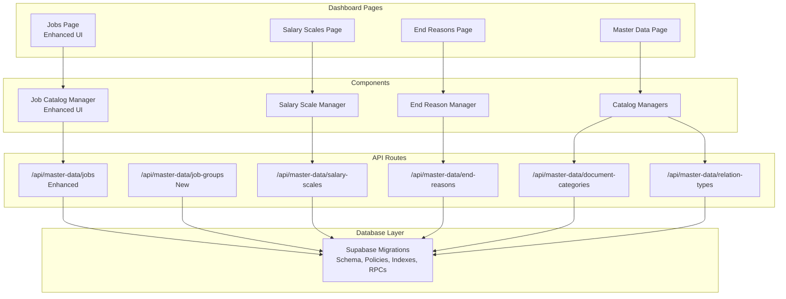
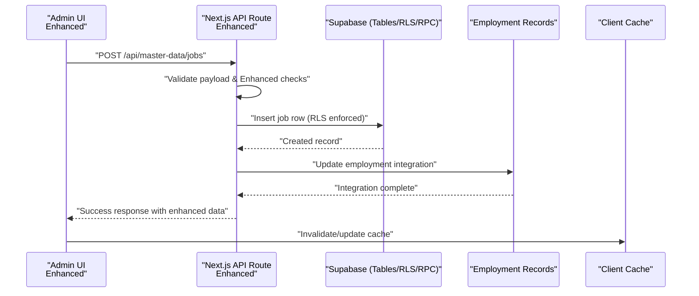
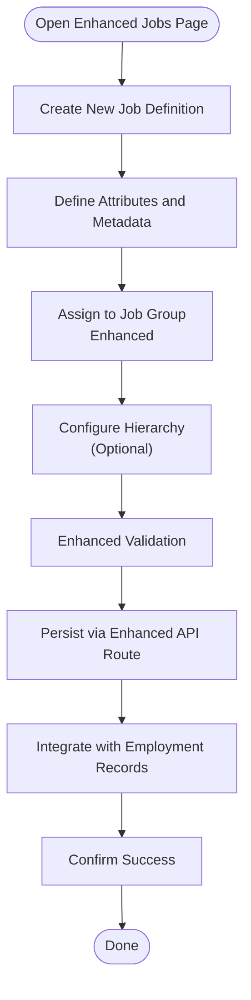
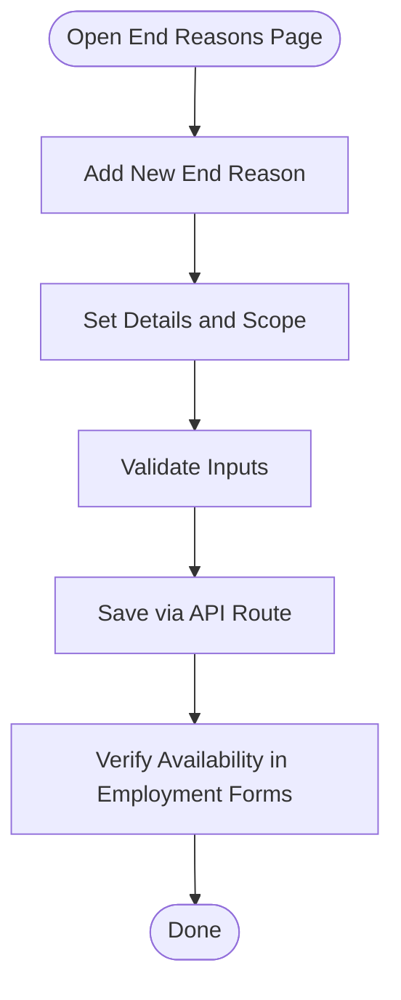
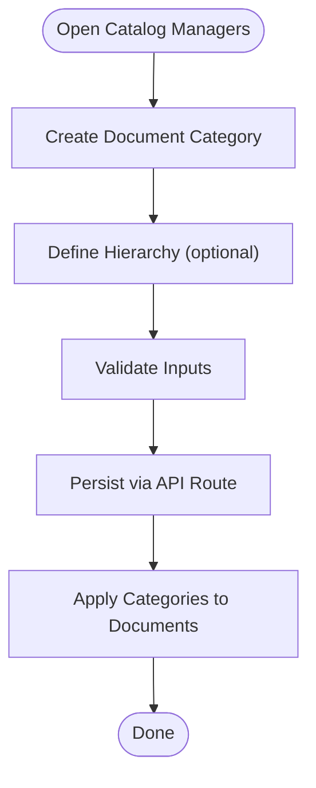
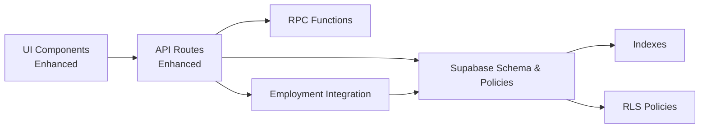

# Master Data Management

<cite>
**Referenced Files in This Document**
- [master-data page](file://apps/hr-suite/app/(dashboard)/master-data/page.tsx)
- [jobs page](file://apps/hr-suite/app/(dashboard)/master-data/jobs/page.tsx)
- [salary-scales page](file://apps/hr-suite/app/(dashboard)/master-data/salary-scales/page.tsx)
- [end-reasons page](file://apps/hr-suite/app/(dashboard)/master-data/end-reasons/page.tsx)
- [job-catalog-manager component](file://apps/hr-suite/components/master-data/job-catalog-manager.tsx)
- [salary-scale-manager component](file://apps/hr-suite/components/master-data/salary-scale-manager.tsx)
- [end-reason-manager component](file://apps/hr-suite/components/master-data/end-reason-manager.tsx)
- [catalog-managers component](file://apps/hr-suite/components/master-data/catalog-managers.tsx)
- [master-data jobs API route](file://apps/hr-suite/app/api/master-data/jobs/route.ts)
- [master-data job-groups API route](file://apps/hr-suite/app/api/master-data/job-groups/route.ts)
- [master-data salary-scales API route](file://apps/hr-suite/app/api/master-data/salary-scales/route.ts)
- [master-data end-reasons API route](file://apps/hr-suite/app/api/master-data/end-reasons/route.ts)
- [master-data document-categories API route](file://apps/hr-suite/app/api/master-data/document-categories/route.ts)
- [master-data relation-types API route](file://apps/hr-suite/app/api/master-data/relation-types/route.ts)
- [20260718100000_add_job_catalog_salary_revisions.sql](file://apps/hr-suite/supabase/migrations/20260718100000_add_job_catalog_salary_revisions.sql)
- [20260718100500_add_master_data_mutation_rpcs.sql](file://apps/hr-suite/supabase/migrations/20260718100500_add_master_data_mutation_rpcs.sql)
- [20260718100600_index_master_data_foreign_keys.sql](file://apps/hr-suite/supabase/migrations/20260718100600_index_master_data_foreign_keys.sql)
- [20260718131000_harden_hr_master_data_document_policies.sql](file://apps/hr-suite/supabase/migrations/20260718131000_harden_hr_master_data_document_policies.sql)
- [job_catalog_salary_revisions test](file://apps/hr-suite/supabase/tests/job_catalog_salary_revisions.sql)
</cite>

## Update Summary
**Changes Made**
- Enhanced job catalog management with improved UI components and better employment record integration
- Added comprehensive job group support with hierarchical organization capabilities
- Enhanced master data APIs with improved validation and error handling
- Improved integration between job catalogs and employment management workflows
- Updated API routes with enhanced functionality for job group operations

## Table of Contents
1. [Introduction](#introduction)
2. [Project Structure](#project-structure)
3. [Core Components](#core-components)
4. [Architecture Overview](#architecture-overview)
5. [Detailed Component Analysis](#detailed-component-analysis)
6. [Dependency Analysis](#dependency-analysis)
7. [Performance Considerations](#performance-considerations)
8. [Troubleshooting Guide](#troubleshooting-guide)
9. [Conclusion](#conclusion)
10. [Appendices](#appendices)

## Introduction
This document explains LiquidHR's Master Data Management (MDM) system with a focus on:
- Job catalog administration: job definitions, job groups, and position hierarchies with enhanced UI components
- Salary scale management: grade structures, step progression, and revision history tracking
- End reason configuration for employment terminations and transitions
- Document category management for employee documentation organization
- Enhanced integration between job catalogs and employment records

The system now provides improved UI components for job catalog management, comprehensive job group support, and enhanced master data APIs with better validation and error handling. It also covers data validation, referential integrity, version control for master data changes, multi-tenant isolation of reference data, RPC functions for mutations, and performance optimization strategies for large datasets. Practical examples are provided to guide administrators through common tasks.

## Project Structure
The MDM feature spans UI pages, reusable components, Next.js API routes, and Supabase migrations that define schemas, indexes, policies, and RPCs. The key areas are:
- Dashboard pages under the master-data section for browsing and editing
- Reusable managers for each domain (jobs, salary scales, end reasons)
- API routes exposing CRUD operations for master data entities
- Database migrations defining tables, constraints, indexes, RLS policies, and RPCs



**Diagram sources**
- [master-data page](file://apps/hr-suite/app/(dashboard)/master-data/page.tsx)
- [jobs page](file://apps/hr-suite/app/(dashboard)/master-data/jobs/page.tsx)
- [salary-scales page](file://apps/hr-suite/app/(dashboard)/master-data/salary-scales/page.tsx)
- [end-reasons page](file://apps/hr-suite/app/(dashboard)/master-data/end-reasons/page.tsx)
- [catalog-managers component](file://apps/hr-suite/components/master-data/catalog-managers.tsx)
- [job-catalog-manager component](file://apps/hr-suite/components/master-data/job-catalog-manager.tsx)
- [salary-scale-manager component](file://apps/hr-suite/components/master-data/salary-scale-manager.tsx)
- [end-reason-manager component](file://apps/hr-suite/components/master-data/end-reason-manager.tsx)
- [master-data jobs API route](file://apps/hr-suite/app/api/master-data/jobs/route.ts)
- [master-data job-groups API route](file://apps/hr-suite/app/api/master-data/job-groups/route.ts)
- [master-data salary-scales API route](file://apps/hr-suite/app/api/master-data/salary-scales/route.ts)
- [master-data end-reasons API route](file://apps/hr-suite/app/api/master-data/end-reasons/route.ts)
- [master-data document-categories API route](file://apps/hr-suite/app/api/master-data/document-categories/route.ts)
- [master-data relation-types API route](file://apps/hr-suite/app/api/master-data/relation-types/route.ts)
- [20260718100000_add_job_catalog_salary_revisions.sql](file://apps/hr-suite/supabase/migrations/20260718100000_add_job_catalog_salary_revisions.sql)
- [20260718100500_add_master_data_mutation_rpcs.sql](file://apps/hr-suite/supabase/migrations/20260718100500_add_master_data_mutation_rpcs.sql)
- [20260718100600_index_master_data_foreign_keys.sql](file://apps/hr-suite/supabase/migrations/20260718100600_index_master_data_foreign_keys.sql)
- [20260718131000_harden_hr_master_data_document_policies.sql](file://apps/hr-suite/supabase/migrations/20260718131000_harden_hr_master_data_document_policies.sql)

**Section sources**
- [master-data page](file://apps/hr-suite/app/(dashboard)/master-data/page.tsx)
- [jobs page](file://apps/hr-suite/app/(dashboard)/master-data/jobs/page.tsx)
- [salary-scales page](file://apps/hr-suite/app/(dashboard)/master-data/salary-scales/page.tsx)
- [end-reasons page](file://apps/hr-suite/app/(dashboard)/master-data/end-reasons/page.tsx)
- [catalog-managers component](file://apps/hr-suite/components/master-data/catalog-managers.tsx)
- [job-catalog-manager component](file://apps/hr-suite/components/master-data/job-catalog-manager.tsx)
- [salary-scale-manager component](file://apps/hr-suite/components/master-data/salary-scale-manager.tsx)
- [end-reason-manager component](file://apps/hr-suite/components/master-data/end-reason-manager.tsx)
- [master-data jobs API route](file://apps/hr-suite/app/api/master-data/jobs/route.ts)
- [master-data job-groups API route](file://apps/hr-suite/app/api/master-data/job-groups/route.ts)
- [master-data salary-scales API route](file://apps/hr-suite/app/api/master-data/salary-scales/route.ts)
- [master-data end-reasons API route](file://apps/hr-suite/app/api/master-data/end-reasons/route.ts)
- [master-data document-categories API route](file://apps/hr-suite/app/api/master-data/document-categories/route.ts)
- [master-data relation-types API route](file://apps/hr-suite/app/api/master-data/relation-types/route.ts)
- [20260718100000_add_job_catalog_salary_revisions.sql](file://apps/hr-suite/supabase/migrations/20260718100000_add_job_catalog_salary_revisions.sql)
- [20260718100500_add_master_data_mutation_rpcs.sql](file://apps/hr-suite/supabase/migrations/20260718100500_add_master_data_mutation_rpcs.sql)
- [20260718100600_index_master_data_foreign_keys.sql](file://apps/hr-suite/supabase/migrations/20260718100600_index_master_data_foreign_keys.sql)
- [20260718131000_harden_hr_master_data_document_policies.sql](file://apps/hr-suite/supabase/migrations/20260718131000_harden_hr_master_data_document_policies.sql)

## Core Components
- **Enhanced Job Catalog Manager**: Provides improved UI interfaces to create and manage job definitions, comprehensive job group management, and maintain hierarchical relationships among positions with better employment record integration.
- **Salary Scale Manager**: Enables definition of grades, steps, and revisions; supports versioning and auditability of salary structures over time.
- **End Reason Manager**: Configures termination and transition reasons used across employments.
- **Catalog Managers**: Central hub for managing related catalogs such as document categories and relation types.

These components interact with enhanced API routes that enforce validation, authorization, and persistence via Supabase, with improved error handling and better integration with employment workflows.

**Section sources**
- [job-catalog-manager component](file://apps/hr-suite/components/master-data/job-catalog-manager.tsx)
- [salary-scale-manager component](file://apps/hr-suite/components/master-data/salary-scale-manager.tsx)
- [end-reason-manager component](file://apps/hr-suite/components/master-data/end-reason-manager.tsx)
- [catalog-managers component](file://apps/hr-suite/components/master-data/catalog-managers.tsx)

## Architecture Overview
The MDM architecture follows a layered approach with enhanced integration points:
- Presentation layer: Dashboard pages and reusable manager components with improved UI components
- API layer: Next.js routes handling request validation, authorization checks, orchestration, and enhanced error handling
- Data layer: Supabase schema with RLS policies, foreign keys, indexes, and RPC functions for complex mutations



**Diagram sources**
- [master-data jobs API route](file://apps/hr-suite/app/api/master-data/jobs/route.ts)
- [20260718100500_add_master_data_mutation_rpcs.sql](file://apps/hr-suite/supabase/migrations/20260718100500_add_master_data_mutation_rpcs.sql)

## Detailed Component Analysis

### Enhanced Job Catalog Administration
Job catalog administration now includes enhanced features:
- **Job definitions**: core attributes describing roles and responsibilities with improved UI
- **Job groups**: logical grouping of jobs for reporting and access control with hierarchical organization
- **Position hierarchies**: parent-child relationships to model organizational structure
- **Employment integration**: seamless integration with employment records for real-time updates

**Updated** Enhanced UI components provide better user experience and improved employment record integration.

Implementation highlights:
- Enhanced UI flows driven by improved Job Catalog Manager component
- API routes handle creation, updates, and deletions with enhanced validation and error handling
- Database schema enforces referential integrity and tenant isolation
- Improved integration with employment management workflows

Practical example: Creating a job profile with job groups
- Navigate to the enhanced Jobs page
- Use the improved manager to define job attributes and assign to job groups
- Configure hierarchical relationships if needed
- Save and verify visibility within the tenant scope with employment integration



**Section sources**
- [jobs page](file://apps/hr-suite/app/(dashboard)/master-data/jobs/page.tsx)
- [job-catalog-manager component](file://apps/hr-suite/components/master-data/job-catalog-manager.tsx)
- [master-data jobs API route](file://apps/hr-suite/app/api/master-data/jobs/route.ts)
- [master-data job-groups API route](file://apps/hr-suite/app/api/master-data/job-groups/route.ts)

### Salary Scale Management
Salary scale management supports:
- Grade structures: defining levels or bands
- Step progression: incremental steps within grades
- Revision history: versioned changes to scales over time

Key aspects:
- Salary Scale Manager provides UI for creating grades/steps and publishing revisions
- API routes ensure consistent state transitions and validations
- Database migrations introduce revision tables and constraints to preserve historical accuracy

Practical example: Defining a salary structure
- Open the Salary Scales page
- Create a new scale with grades and steps
- Publish a revision when changes are approved
- Review revision history for auditability

```mermaid
classDiagram
class SalaryScale {
+id
+name
+currency
+isActive
}
class Grade {
+id
+scaleId
+level
+minStep
+maxStep
}
class Step {
+id
+gradeId
+stepNumber
+amount
}
class Revision {
+id
+scaleId
+version
+effectiveDate
+createdBy
}
SalaryScale ||--o{ Grade : "has many"
Grade ||--o{ Step : "has many"
SalaryScale ||--o{ Revision : "tracked by"
```

**Diagram sources**
- [salary-scale-manager component](file://apps/hr-suite/components/master-data/salary-scale-manager.tsx)
- [20260718100000_add_job_catalog_salary_revisions.sql](file://apps/hr-suite/supabase/migrations/20260718100000_add_job_catalog_salary_revisions.sql)

**Section sources**
- [salary-scales page](file://apps/hr-suite/app/(dashboard)/master-data/salary-scales/page.tsx)
- [salary-scale-manager component](file://apps/hr-suite/components/master-data/salary-scale-manager.tsx)
- [master-data salary-scales API route](file://apps/hr-suite/app/api/master-data/salary-scales/route.ts)
- [20260718100000_add_job_catalog_salary_revisions.sql](file://apps/hr-suite/supabase/migrations/20260718100000_add_job_catalog_salary_revisions.sql)

### End Reason Configuration
End reasons capture termination and transition reasons for employments. They are referenced during termination workflows to standardize outcomes and reporting.

Implementation highlights:
- End Reason Manager provides CRUD operations
- API routes validate inputs and enforce tenant scoping
- Referential integrity ensures only valid reasons are used in employment records

Practical example: Configuring a termination reason
- Go to the End Reasons page
- Add a new reason with descriptive metadata
- Save and use it in termination forms



**Section sources**
- [end-reasons page](file://apps/hr-suite/app/(dashboard)/master-data/end-reasons/page.tsx)
- [end-reason-manager component](file://apps/hr-suite/components/master-data/end-reason-manager.tsx)
- [master-data end-reasons API route](file://apps/hr-suite/app/api/master-data/end-reasons/route.ts)

### Document Category Management
Document categories organize employee documents into structured folders or tags. They support consistent categorization across tenants.

Implementation highlights:
- Catalog Managers expose endpoints for document categories
- API routes handle creation, updates, and deletion with validation
- Policies ensure tenant isolation and controlled access

Practical example: Organizing document categories
- Access the Catalog Managers interface
- Create categories and assign hierarchy if needed
- Apply categories when uploading or organizing employee documents



**Section sources**
- [catalog-managers component](file://apps/hr-suite/components/master-data/catalog-managers.tsx)
- [master-data document-categories API route](file://apps/hr-suite/app/api/master-data/document-categories/route.ts)

## Dependency Analysis
Master data modules depend on shared infrastructure with enhanced integration:
- API routes rely on Supabase for persistence, RLS policies for security, and indexes for performance
- UI components depend on enhanced API routes for data operations and caching strategies
- Migrations define schema, constraints, and RPCs enabling complex transactions
- Enhanced employment record integration requires additional dependency management



**Diagram sources**
- [master-data jobs API route](file://apps/hr-suite/app/api/master-data/jobs/route.ts)
- [master-data salary-scales API route](file://apps/hr-suite/app/api/master-data/salary-scales/route.ts)
- [master-data end-reasons API route](file://apps/hr-suite/app/api/master-data/end-reasons/route.ts)
- [master-data document-categories API route](file://apps/hr-suite/app/api/master-data/document-categories/route.ts)
- [20260718100500_add_master_data_mutation_rpcs.sql](file://apps/hr-suite/supabase/migrations/20260718100500_add_master_data_mutation_rpcs.sql)
- [20260718100600_index_master_data_foreign_keys.sql](file://apps/hr-suite/supabase/migrations/20260718100600_index_master_data_foreign_keys.sql)
- [20260718131000_harden_hr_master_data_document_policies.sql](file://apps/hr-suite/supabase/migrations/20260718131000_harden_hr_master_data_document_policies.sql)

**Section sources**
- [master-data jobs API route](file://apps/hr-suite/app/api/master-data/jobs/route.ts)
- [master-data salary-scales API route](file://apps/hr-suite/app/api/master-data/salary-scales/route.ts)
- [master-data end-reasons API route](file://apps/hr-suite/app/api/master-data/end-reasons/route.ts)
- [master-data document-categories API route](file://apps/hr-suite/app/api/master-data/document-categories/route.ts)
- [20260718100500_add_master_data_mutation_rpcs.sql](file://apps/hr-suite/supabase/migrations/20260718100500_add_master_data_mutation_rpcs.sql)
- [20260718100600_index_master_data_foreign_keys.sql](file://apps/hr-suite/supabase/migrations/20260718100600_index_master_data_foreign_keys.sql)
- [20260718131000_harden_hr_master_data_document_policies.sql](file://apps/hr-suite/supabase/migrations/20260718131000_harden_hr_master_data_document_policies.sql)

## Performance Considerations
To optimize MDM operations for large datasets with enhanced features:
- Leverage indexes on foreign keys and frequently queried columns to reduce lookup times
- Use pagination and filtering in API responses to limit payload sizes
- Implement client-side caching and invalidation strategies to minimize redundant requests
- Batch mutations where possible to reduce network overhead
- Ensure RLS policies are efficient and scoped to tenant identifiers to avoid full-table scans
- Optimize enhanced job group queries with proper indexing strategies
- Monitor employment integration performance for real-time updates

## Troubleshooting Guide
Common issues and resolutions with enhanced features:
- **Validation errors**: Check input payloads against expected schemas; ensure required fields are present and enhanced validation rules are satisfied
- **Authorization failures**: Verify user permissions and tenant scoping; confirm RLS policies allow access to enhanced features
- **Referential integrity violations**: Ensure referenced IDs exist and belong to the same tenant; check job group relationships
- **Performance bottlenecks**: Inspect query plans, add missing indexes, and reduce result sets with filters; monitor employment integration queries
- **Integration issues**: Verify employment record synchronization and job group assignments
- **Enhanced UI problems**: Check component dependencies and API route connectivity

**Section sources**
- [master-data jobs API route](file://apps/hr-suite/app/api/master-data/jobs/route.ts)
- [master-data salary-scales API route](file://apps/hr-suite/app/api/master-data/salary-scales/route.ts)
- [master-data end-reasons API route](file://apps/hr-suite/app/api/master-data/end-reasons/route.ts)
- [master-data document-categories API route](file://apps/hr-suite/app/api/master-data/document-categories/route.ts)
- [20260718131000_harden_hr_master_data_document_policies.sql](file://apps/hr-suite/supabase/migrations/20260718131000_harden_hr_master_data_document_policies.sql)

## Conclusion
LiquidHR's Master Data Management system provides robust tools for administering job catalogs, salary scales, end reasons, and document categories with enhanced UI components and improved employment record integration. The addition of comprehensive job group support and enhanced master data APIs significantly improves the user experience and system capabilities. With strong validation, referential integrity, version control, and multi-tenant isolation, it ensures reliable and scalable master data operations. Enhanced API routes and RPC functions enable efficient mutations, while indexes and policies optimize performance and security.

## Appendices

### Practical Examples Summary
- **Creating a job profile with job groups**: Use the enhanced Jobs page and Job Catalog Manager to define attributes, assign groups, and configure hierarchies
- **Defining a salary structure**: Use the Salary Scales page and Salary Scale Manager to set grades, steps, and publish revisions
- **Configuring termination reasons**: Use the End Reasons page and End Reason Manager to add and manage reasons
- **Organizing document categories**: Use Catalog Managers to create and apply categories consistently
- **Managing job hierarchies**: Utilize enhanced job group features for organizational structure modeling

### Version Control and Auditability
- Salary scale revisions are tracked to maintain historical accuracy
- Changes to master data should follow approval workflows before publication
- Audit trails can be extended via event projections or change logs
- Enhanced job group changes are tracked for compliance and reporting

**Section sources**
- [20260718100000_add_job_catalog_salary_revisions.sql](file://apps/hr-suite/supabase/migrations/20260718100000_add_job_catalog_salary_revisions.sql)
- [job_catalog_salary_revisions test](file://apps/hr-suite/supabase/tests/job_catalog_salary_revisions.sql)

### Multi-Tenant Isolation
- All master data is scoped to tenants via policies and foreign keys
- API routes enforce tenant context from authentication
- Queries and mutations must include tenant identifiers to prevent cross-tenant data leakage
- Enhanced job group features maintain tenant isolation boundaries

**Section sources**
- [20260718131000_harden_hr_master_data_document_policies.sql](file://apps/hr-suite/supabase/migrations/20260718131000_harden_hr_master_data_document_policies.sql)
- [20260718100600_index_master_data_foreign_keys.sql](file://apps/hr-suite/supabase/migrations/20260718100600_index_master_data_foreign_keys.sql)

### Enhanced Features Summary
- **Improved UI Components**: Enhanced job catalog management with better user experience
- **Job Group Support**: Comprehensive job grouping with hierarchical organization capabilities
- **Enhanced APIs**: Improved validation, error handling, and employment record integration
- **Better Integration**: Seamless connection between job catalogs and employment management workflows
- **Enhanced Error Handling**: More robust error messages and recovery mechanisms