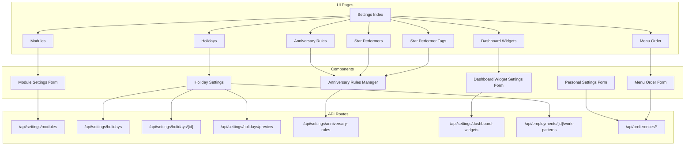
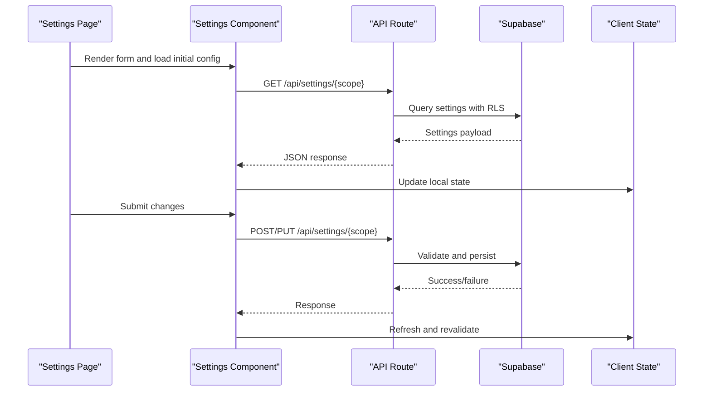
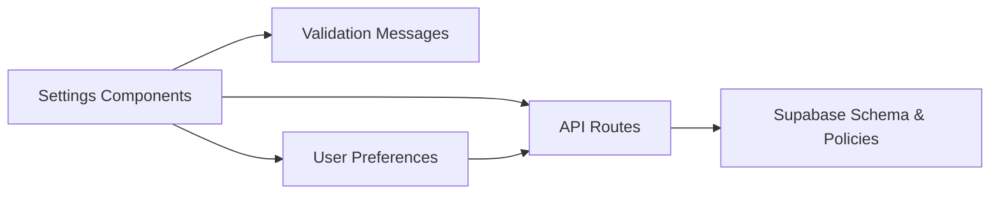
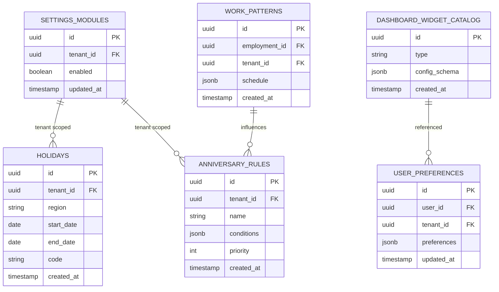

# Settings Management

<cite>
**Referenced Files in This Document**
- [settings page](file://apps/hr-suite/app/(dashboard)/settings/page.tsx)
- [modules settings page](file://apps/hr-suite/app/(dashboard)/settings/modules/page.tsx)
- [holidays settings page](file://apps/hr-suite/app/(dashboard)/settings/holidays/page.tsx)
- [anniversary rules settings page](file://apps/hr-suite/app/(dashboard)/settings/anniversary-rules/page.tsx)
- [dashboard widgets settings page](file://apps/hr-suite/app/(dashboard)/settings/dashboard-widgets/page.tsx)
- [menu order settings page](file://apps/hr-suite/app/(dashboard)/settings/menu-order/page.tsx)
- [star performers settings page](file://apps/hr-suite/app/(dashboard)/settings/star-performers/page.tsx)
- [star performer tags settings page](file://apps/hr-suite/app/(dashboard)/settings/star-performer-tags/page.tsx)
- [personal settings page](file://apps/hr-suite/app/(dashboard)/personal-settings/page.tsx)
- [update user preferences action](file://apps/hr-suite/app/actions/update-user-preferences.ts)
- [preferences employee dashboard route](file://apps/hr-suite/app/api/preferences/employee-dashboard/route.ts)
- [preferences employees route](file://apps/hr-suite/app/api/preferences/employees/route.ts)
- [preferences hr calendar route](file://apps/hr-suite/app/api/preferences/hr-calendar/route.ts)
- [preferences insights route](file://apps/hr-suite/app/api/preferences/insights/route.ts)
- [preferences organization chart route](file://apps/hr-suite/app/api/preferences/organization-chart/route.ts)
- [settings anniversary rules API route](file://apps/hr-suite/app/api/settings/anniversary-rules/route.ts)
- [settings dashboard widgets API route](file://apps/hr-suite/app/api/settings/dashboard-widgets/route.ts)
- [settings holidays API route](file://apps/hr-suite/app/api/settings/holidays/route.ts)
- [settings holidays preview route](file://apps/hr-suite/app/api/settings/holidays/preview/route.ts)
- [settings holidays by ID route](file://apps/hr-suite/app/api/settings/holidays/[holidayId]/route.ts)
- [settings modules API route](file://apps/hr-suite/app/api/settings/modules/route.ts)
- [work patterns employment route](file://apps/hr-suite/app/api/employments/[employmentId]/work-patterns/route.ts)
- [module settings form component](file://apps/hr-suite/components/settings/module-settings-form.tsx)
- [holiday settings component](file://apps/hr-suite/components/settings/holiday-settings.tsx)
- [anniversary rules manager component](file://apps/hr-suite/components/settings/anniversary-rules-manager.tsx)
- [dashboard widget settings form component](file://apps/hr-suite/components/settings/dashboard-widget-settings-form.tsx)
- [personal settings form component](file://apps/hr-suite/components/settings/personal-settings-form.tsx)
- [menu order form component](file://apps/hr-suite/components/settings/menu-order-form.tsx)
- [admin settings page header](file://apps/hr-suite/components/settings/admin-settings-page-header.tsx)
- [settings accordion component](file://apps/hr-suite/components/settings/settings-accordion.tsx)
- [employee settings placeholder dialog](file://apps/hr-suite/components/settings/employee-settings-placeholder-dialog.tsx)
- [HR calendar filter panel](file://apps/hr-suite/components/hr-calendar/hr-calendar-filter-panel.tsx)
- [HR calendar week select](file://apps/hr-suite/components/hr-calendar/hr-calendar-week-select.tsx)
- [HR month calendar](file://apps/hr-suite/components/hr-calendar/hr-month-calendar.tsx)
- [leave request dialog](file://apps/hr-suite/components/hr-calendar/leave-request-dialog.tsx)
- [HR calendar page size select](file://apps/hr-suite/components/hr-calendar/hr-calendar-page-size-select.tsx)
- [dashboard workspace model](file://apps/hr-suite/components/dashboard/dashboard-workspace-model.ts)
- [dashboard progress model](file://apps/hr-suite/components/dashboard/dashboard-progress-model.ts)
- [widget picker model](file://apps/hr-suite/components/dashboard/widget-picker-model.ts)
- [dashboard workspace component](file://apps/hr-suite/components/dashboard/dashboard-workspace.tsx)
- [dashboard editor component](file://apps/hr-suite/components/dashboard/dashboard-editor.tsx)
- [widget renderer component](file://apps/hr-suite/components/dashboard/widget-renderer.tsx)
- [widget skeleton component](file://apps/hr-suite/components/dashboard/widget-skeleton.tsx)
- [settings.json messages](file://apps/hr-suite/messages/en/settings.json)
- [validation.json messages](file://apps/hr-suite/messages/en/validation.json)
- [settings migration](file://apps/hr-suite/supabase/migrations/20260718121308_add_settings_modules_work_patterns_holidays.sql)
- [settings rosters holidays hardening](file://apps/hr-suite/supabase/migrations/20260718122138_harden_settings_rosters_holidays.sql)
- [optional module guards](file://apps/hr-suite/supabase/migrations/20260718122614_enforce_optional_module_guards.sql)
- [module state exposure](file://apps/hr-suite/supabase/migrations/20260718122751_expose_module_state_to_tenant_users.sql)
- [holiday snapshot import](file://apps/hr-suite/supabase/migrations/20260718123742_add_holiday_snapshot_import.sql)
- [dashboard widget catalog](file://apps/hr-suite/supabase/migrations/20260718170000_add_dashboard_widget_catalog.sql)
- [dashboard widget read scope](file://apps/hr-suite/supabase/migrations/20260718171000_relax_dashboard_widget_read_scope.sql)
- [personal dashboard widget types](file://apps/hr-suite/supabase/migrations/20260718172000_expand_personal_dashboard_widget_types.sql)
- [dashboard widget admin permissions](file://apps/hr-suite/supabase/migrations/20260718172051_grant_dashboard_widget_admin_permissions.sql)
- [dashboard widget policies tuning](file://apps/hr-suite/supabase/migrations/20260718173000_tune_dashboard_widget_policies.sql)
- [date time user preferences](file://apps/hr-suite/supabase/migrations/20260718180354_add_date_time_user_preferences.sql)
- [week numbering preference](file://apps/hr-suite/supabase/migrations/20260719112000_add_week_numbering_user_preference.sql)
- [upcoming events and anniversary rules](file://apps/hr-suite/supabase/migrations/20260724100605_upcoming_events_and_anniversary_rules.sql)
- [user preferences isolation test](file://apps/hr-suite/supabase/tests/user_preferences_isolation.sql)
- [settings rosters holidays test](file://apps/hr-suite/supabase/tests/settings_rosters_holidays.sql)
</cite>

## Table of Contents
1. [Introduction](#introduction)
2. [Project Structure](#project-structure)
3. [Core Components](#core-components)
4. [Architecture Overview](#architecture-overview)
5. [Detailed Component Analysis](#detailed-component-analysis)
6. [Dependency Analysis](#dependency-analysis)
7. [Performance Considerations](#performance-considerations)
8. [Troubleshooting Guide](#troubleshooting-guide)
9. [Conclusion](#conclusion)
10. [Appendices](#appendices)

## Introduction
This document explains LiquidHR’s Settings Management system, covering:
- Module configuration for enabling/disabling system features
- User preference management (personal and organizational)
- Holiday calendar administration (regional and custom observances)
- Anniversary rules for employee milestones
- Dashboard widget settings and customization
- Work pattern definitions per employment
It also documents the settings data model, validation rules, persistence mechanisms, security considerations, audit trails, and best practices for consistent configuration across tenants.

## Project Structure
Settings are exposed through Next.js App Router pages under the “settings” route group, with corresponding API routes for CRUD operations. UI components encapsulate forms and managers for each settings area. Database migrations define schemas and policies for settings, preferences, and related entities.

**Diagram sources**
- [settings page](file://apps/hr-suite/app/(dashboard)/settings/page.tsx)
- [modules settings page](file://apps/hr-suite/app/(dashboard)/settings/modules/page.tsx)
- [holidays settings page](file://apps/hr-suite/app/(dashboard)/settings/holidays/page.tsx)
- [anniversary rules settings page](file://apps/hr-suite/app/(dashboard)/settings/anniversary-rules/page.tsx)
- [dashboard widgets settings page](file://apps/hr-suite/app/(dashboard)/settings/dashboard-widgets/page.tsx)
- [menu order settings page](file://apps/hr-suite/app/(dashboard)/settings/menu-order/page.tsx)
- [star performers settings page](file://apps/hr-suite/app/(dashboard)/settings/star-performers/page.tsx)
- [star performer tags settings page](file://apps/hr-suite/app/(dashboard)/settings/star-performer-tags/page.tsx)
- [settings modules API route](file://apps/hr-suite/app/api/settings/modules/route.ts)
- [settings holidays API route](file://apps/hr-suite/app/api/settings/holidays/route.ts)
- [settings holidays by ID route](file://apps/hr-suite/app/api/settings/holidays/[holidayId]/route.ts)
- [settings holidays preview route](file://apps/hr-suite/app/api/settings/holidays/preview/route.ts)
- [settings anniversary rules API route](file://apps/hr-suite/app/api/settings/anniversary-rules/route.ts)
- [settings dashboard widgets API route](file://apps/hr-suite/app/api/settings/dashboard-widgets/route.ts)
- [work patterns employment route](file://apps/hr-suite/app/api/employments/[employmentId]/work-patterns/route.ts)
- [module settings form component](file://apps/hr-suite/components/settings/module-settings-form.tsx)
- [holiday settings component](file://apps/hr-suite/components/settings/holiday-settings.tsx)
- [anniversary rules manager component](file://apps/hr-suite/components/settings/anniversary-rules-manager.tsx)
- [dashboard widget settings form component](file://apps/hr-suite/components/settings/dashboard-widget-settings-form.tsx)
- [personal settings form component](file://apps/hr-suite/components/settings/personal-settings-form.tsx)
- [menu order form component](file://apps/hr-suite/components/settings/menu-order-form.tsx)

**Section sources**
- [settings page](file://apps/hr-suite/app/(dashboard)/settings/page.tsx)
- [settings.json messages](file://apps/hr-suite/messages/en/settings.json)

## Core Components
- Module configuration: Enables or disables feature modules at the tenant level via a dedicated form and API endpoint.
- Holiday calendar: Manages regional and custom holidays with preview capabilities and per-holiday updates.
- Anniversary rules: Configures milestone triggers and notifications for employee anniversaries.
- Dashboard widgets: Defines available widgets, their visibility, and personalizations.
- Personal preferences: Stores user-level settings such as date/time formats, week numbering, and UI options.
- Work patterns: Defines working schedules per employment to influence leave accrual and calendars.

Key responsibilities:
- UI forms validate inputs using shared validation messages and display localized errors.
- API routes enforce authorization, persist changes, and return structured responses.
- Migrations define schema, indexes, and Row Level Security (RLS) policies for multi-tenant isolation.

**Section sources**
- [module settings form component](file://apps/hr-suite/components/settings/module-settings-form.tsx)
- [holiday settings component](file://apps/hr-suite/components/settings/holiday-settings.tsx)
- [anniversary rules manager component](file://apps/hr-suite/components/settings/anniversary-rules-manager.tsx)
- [dashboard widget settings form component](file://apps/hr-suite/components/settings/dashboard-widget-settings-form.tsx)
- [personal settings form component](file://apps/hr-suite/components/settings/personal-settings-form.tsx)
- [menu order form component](file://apps/hr-suite/components/settings/menu-order-form.tsx)
- [validation.json messages](file://apps/hr-suite/messages/en/validation.json)

## Architecture Overview
The Settings Management follows a layered architecture:
- Presentation layer: Next.js pages render settings interfaces.
- Business logic: React components orchestrate form state, validation, and API calls.
- API layer: Route handlers perform authorization checks, input validation, and persistence.
- Data layer: Supabase database stores settings and preferences with RLS policies ensuring tenant isolation.

**Diagram sources**
- [settings modules API route](file://apps/hr-suite/app/api/settings/modules/route.ts)
- [settings holidays API route](file://apps/hr-suite/app/api/settings/holidays/route.ts)
- [settings anniversary rules API route](file://apps/hr-suite/app/api/settings/anniversary-rules/route.ts)
- [settings dashboard widgets API route](file://apps/hr-suite/app/api/settings/dashboard-widgets/route.ts)
- [work patterns employment route](file://apps/hr-suite/app/api/employments/[employmentId]/work-patterns/route.ts)

## Detailed Component Analysis

### Module Configuration Interface
Purpose:
- Enable/disable system modules per tenant.
- Expose module state to users based on roles and scopes.

Data flow:
- The Modules page loads current module states from the API.
- Users toggle features; the form validates selections and persists changes.
- API enforces tenant scoping and role-based access.

Validation:
- Required fields validated against message keys in validation messages.
- Boolean toggles ensure only allowed combinations are saved.

Persistence:
- Changes stored in settings tables with tenant identifiers.
- RLS policies restrict writes to authorized administrators.

Best practices:
- Use feature flags to gate functionality safely.
- Provide rollback capability for critical module changes.
- Audit all module enable/disable actions.

Security:
- Enforce administrative roles for module changes.
- Scope changes to the active tenant context.

**Section sources**
- [modules settings page](file://apps/hr-suite/app/(dashboard)/settings/modules/page.tsx)
- [settings modules API route](file://apps/hr-suite/app/api/settings/modules/route.ts)
- [module settings form component](file://apps/hr-suite/components/settings/module-settings-form.tsx)
- [settings migration](file://apps/hr-suite/supabase/migrations/20260718121308_add_settings_modules_work_patterns_holidays.sql)
- [optional module guards](file://apps/hr-suite/supabase/migrations/20260718122614_enforce_optional_module_guards.sql)
- [module state exposure](file://apps/hr-suite/supabase/migrations/20260718122751_expose_module_state_to_tenant_users.sql)

### Holiday Calendar Administration
Purpose:
- Manage regional and custom holiday observances.
- Preview holiday impact on calendars and leave calculations.

Data flow:
- Holidays page lists existing entries and allows creation/editing.
- Preview endpoint computes effects without persisting.
- Per-holiday endpoints support updates and deletions.

Validation:
- Date ranges must be valid and non-overlapping within regions.
- Names and codes must be unique per region.

Persistence:
- Holiday records include region, effective dates, and metadata.
- Snapshot imports allow bulk loading of official calendars.

Best practices:
- Maintain canonical regional catalogs and override with custom entries.
- Version holiday sets by year for clarity and auditing.

Security:
- Restrict holiday edits to HR administrators.
- Ensure tenant isolation for holiday data.

**Section sources**
- [holidays settings page](file://apps/hr-suite/app/(dashboard)/settings/holidays/page.tsx)
- [settings holidays API route](file://apps/hr-suite/app/api/settings/holidays/route.ts)
- [settings holidays by ID route](file://apps/hr-suite/app/api/settings/holidays/[holidayId]/route.ts)
- [settings holidays preview route](file://apps/hr-suite/app/api/settings/holidays/preview/route.ts)
- [holiday settings component](file://apps/hr-suite/components/settings/holiday-settings.tsx)
- [holiday snapshot import](file://apps/hr-suite/supabase/migrations/20260718123742_add_holiday_snapshot_import.sql)
- [settings rosters holidays hardening](file://apps/hr-suite/supabase/migrations/20260718122138_harden_settings_rosters_holidays.sql)

### Anniversary Rules Configuration
Purpose:
- Define rules that trigger milestones and notifications for employee anniversaries.

Data flow:
- Anniversary Rules Manager displays rule list and editors.
- API routes handle CRUD operations and rule evaluation metadata.

Validation:
- Rule conditions must reference valid event types and thresholds.
- Duplicate rule names within a tenant are prevented.

Persistence:
- Rules stored with tenant scoping and priority ordering.
- Upcoming events projection uses these rules to generate notifications.

Best practices:
- Keep rule sets minimal and well-documented.
- Test rule interactions before deployment.

Security:
- Only authorized HR roles can modify anniversary rules.

**Section sources**
- [anniversary rules settings page](file://apps/hr-suite/app/(dashboard)/settings/anniversary-rules/page.tsx)
- [settings anniversary rules API route](file://apps/hr-suite/app/api/settings/anniversary-rules/route.ts)
- [anniversary rules manager component](file://apps/hr-suite/components/settings/anniversary-rules-manager.tsx)
- [upcoming events and anniversary rules](file://apps/hr-suite/supabase/migrations/20260724100605_upcoming_events_and_anniversary_rules.sql)

### Dashboard Widget Settings
Purpose:
- Configure available widgets, their visibility, and personalization options.

Data flow:
- Dashboard Widgets page manages catalog entries and user-specific layouts.
- Workspace and progress models coordinate rendering and state.

Validation:
- Widget IDs must exist in the catalog.
- Layout constraints enforced to prevent invalid configurations.

Persistence:
- Catalog stored centrally; personal layouts stored per user.
- Policies tuned to allow read access while restricting writes.

Best practices:
- Version widget catalogs to manage breaking changes.
- Provide defaults for new users.

Security:
- Admin-only write access; users can customize personal dashboards.

**Section sources**
- [dashboard widgets settings page](file://apps/hr-suite/app/(dashboard)/settings/dashboard-widgets/page.tsx)
- [settings dashboard widgets API route](file://apps/hr-suite/app/api/settings/dashboard-widgets/route.ts)
- [dashboard widget settings form component](file://apps/hr-suite/components/settings/dashboard-widget-settings-form.tsx)
- [dashboard workspace model](file://apps/hr-suite/components/dashboard/dashboard-workspace-model.ts)
- [dashboard progress model](file://apps/hr-suite/components/dashboard/dashboard-progress-model.ts)
- [widget picker model](file://apps/hr-suite/components/dashboard/widget-picker-model.ts)
- [dashboard workspace component](file://apps/hr-suite/components/dashboard/dashboard-workspace.tsx)
- [dashboard editor component](file://apps/hr-suite/components/dashboard/dashboard-editor.tsx)
- [widget renderer component](file://apps/hr-suite/components/dashboard/widget-renderer.tsx)
- [widget skeleton component](file://apps/hr-suite/components/dashboard/widget-skeleton.tsx)
- [dashboard widget catalog](file://apps/hr-suite/supabase/migrations/20260718170000_add_dashboard_widget_catalog.sql)
- [dashboard widget read scope](file://apps/hr-suite/supabase/migrations/20260718171000_relax_dashboard_widget_read_scope.sql)
- [personal dashboard widget types](file://apps/hr-suite/supabase/migrations/20260718172000_expand_personal_dashboard_widget_types.sql)
- [dashboard widget admin permissions](file://apps/hr-suite/supabase/migrations/20260718172051_grant_dashboard_widget_admin_permissions.sql)
- [dashboard widget policies tuning](file://apps/hr-suite/supabase/migrations/20260718173000_tune_dashboard_widget_policies.sql)

### Personal Preferences Management
Purpose:
- Store user-level settings like date/time formats, locale, and UI options.

Data flow:
- Personal Settings Form collects preferences and submits via update action.
- Preference routes provide scoped APIs for different contexts (employee dashboard, HR calendar, insights, org chart).

Validation:
- Inputs validated against expected enums and ranges.
- Conflicts resolved with fallback defaults.

Persistence:
- Preferences persisted per user with tenant isolation.
- Tests verify isolation and correctness.

Best practices:
- Provide sensible defaults and allow overrides.
- Version preference schemas to support evolution.

Security:
- Users can edit only their own preferences.
- Administrative preferences are separate and restricted.

**Section sources**
- [personal settings page](file://apps/hr-suite/app/(dashboard)/personal-settings/page.tsx)
- [personal settings form component](file://apps/hr-suite/components/settings/personal-settings-form.tsx)
- [update user preferences action](file://apps/hr-suite/app/actions/update-user-preferences.ts)
- [preferences employee dashboard route](file://apps/hr-suite/app/api/preferences/employee-dashboard/route.ts)
- [preferences employees route](file://apps/hr-suite/app/api/preferences/employees/route.ts)
- [preferences hr calendar route](file://apps/hr-suite/app/api/preferences/hr-calendar/route.ts)
- [preferences insights route](file://apps/hr-suite/app/api/preferences/insights/route.ts)
- [preferences organization chart route](file://apps/hr-suite/app/api/preferences/organization-chart/route.ts)
- [date time user preferences](file://apps/hr-suite/supabase/migrations/20260718180354_add_date_time_user_preferences.sql)
- [week numbering preference](file://apps/hr-suite/supabase/migrations/20260719112000_add_week_numbering_user_preference.sql)
- [user preferences isolation test](file://apps/hr-suite/supabase/tests/user_preferences_isolation.sql)

### Work Pattern Definitions
Purpose:
- Define work schedules per employment to influence leave accrual and calendar behavior.

Data flow:
- Work patterns are managed via employment-scoped API routes.
- UI panels integrate patterns into employment details.

Validation:
- Patterns must cover full weeks and avoid overlaps.
- Time boundaries validated against business rules.

Persistence:
- Stored with employment foreign keys and tenant scoping.

Best practices:
- Reuse common patterns where possible.
- Document exceptions clearly.

Security:
- Employment owners and HR admins can modify patterns.

**Section sources**
- [work patterns employment route](file://apps/hr-suite/app/api/employments/[employmentId]/work-patterns/route.ts)
- [settings migration](file://apps/hr-suite/supabase/migrations/20260718121308_add_settings_modules_work_patterns_holidays.sql)

## Dependency Analysis
Settings components depend on:
- API routes for data access and mutation
- Shared validation messages for consistent error handling
- Database migrations defining schema and policies
- Contextual preferences for user-specific behavior

**Diagram sources**
- [module settings form component](file://apps/hr-suite/components/settings/module-settings-form.tsx)
- [holiday settings component](file://apps/hr-suite/components/settings/holiday-settings.tsx)
- [anniversary rules manager component](file://apps/hr-suite/components/settings/anniversary-rules-manager.tsx)
- [dashboard widget settings form component](file://apps/hr-suite/components/settings/dashboard-widget-settings-form.tsx)
- [personal settings form component](file://apps/hr-suite/components/settings/personal-settings-form.tsx)
- [settings modules API route](file://apps/hr-suite/app/api/settings/modules/route.ts)
- [settings holidays API route](file://apps/hr-suite/app/api/settings/holidays/route.ts)
- [settings anniversary rules API route](file://apps/hr-suite/app/api/settings/anniversary-rules/route.ts)
- [settings dashboard widgets API route](file://apps/hr-suite/app/api/settings/dashboard-widgets/route.ts)
- [preferences employee dashboard route](file://apps/hr-suite/app/api/preferences/employee-dashboard/route.ts)
- [settings.json messages](file://apps/hr-suite/messages/en/settings.json)
- [validation.json messages](file://apps/hr-suite/messages/en/validation.json)

**Section sources**
- [settings.json messages](file://apps/hr-suite/messages/en/settings.json)
- [validation.json messages](file://apps/hr-suite/messages/en/validation.json)

## Performance Considerations
- Prefer server-side validation and caching for heavy computations (e.g., holiday previews).
- Use pagination for large settings lists (e.g., holiday catalogs).
- Minimize client-side state by leveraging optimistic updates where safe.
- Index frequently queried columns in settings and preferences tables.

[No sources needed since this section provides general guidance]

## Troubleshooting Guide
Common issues:
- Authorization failures when editing settings: Verify role and tenant context.
- Validation errors: Check input formats against validation messages.
- Missing preferences: Ensure defaults are applied and schema is up-to-date.
- Holiday conflicts: Resolve overlapping date ranges and duplicate codes.

Debugging steps:
- Inspect API responses for error payloads.
- Review RLS policies in migrations and tests.
- Use preview endpoints to validate changes before persisting.

**Section sources**
- [settings rosters holidays test](file://apps/hr-suite/supabase/tests/settings_rosters_holidays.sql)
- [user preferences isolation test](file://apps/hr-suite/supabase/tests/user_preferences_isolation.sql)

## Conclusion
LiquidHR’s Settings Management provides a robust, secure, and scalable foundation for configuring system modules, managing user preferences, administering holiday calendars, defining anniversary rules, customizing dashboards, and setting work patterns. Adhering to the documented best practices ensures consistency, security, and maintainability across tenants.

[No sources needed since this section summarizes without analyzing specific files]

## Appendices

### Data Model Overview
- Settings tables store module flags, holiday catalogs, anniversary rules, and widget catalogs.
- Preferences tables store user-level configurations with tenant isolation.
- Work patterns link to employments and influence leave and calendar logic.

**Diagram sources**
- [settings migration](file://apps/hr-suite/supabase/migrations/20260718121308_add_settings_modules_work_patterns_holidays.sql)
- [dashboard widget catalog](file://apps/hr-suite/supabase/migrations/20260718170000_add_dashboard_widget_catalog.sql)
- [date time user preferences](file://apps/hr-suite/supabase/migrations/20260718180354_add_date_time_user_preferences.sql)
- [upcoming events and anniversary rules](file://apps/hr-suite/supabase/migrations/20260724100605_upcoming_events_and_anniversary_rules.sql)

### Security and Audit Best Practices
- Enforce RBAC for all settings mutations.
- Log configuration changes with actor, timestamp, and diff.
- Isolate tenant data via RLS policies and explicit tenant checks.
- Rotate secrets and limit admin access to essential personnel.

[No sources needed since this section provides general guidance]