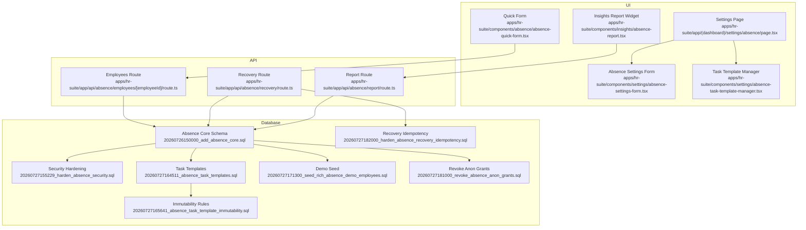
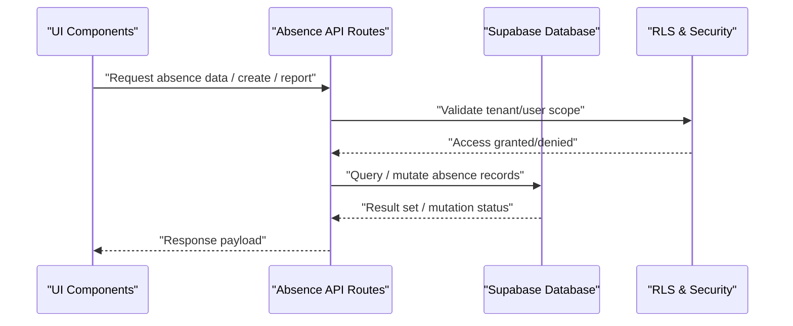
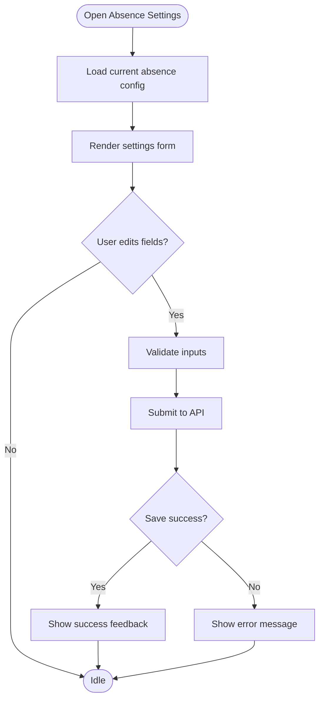
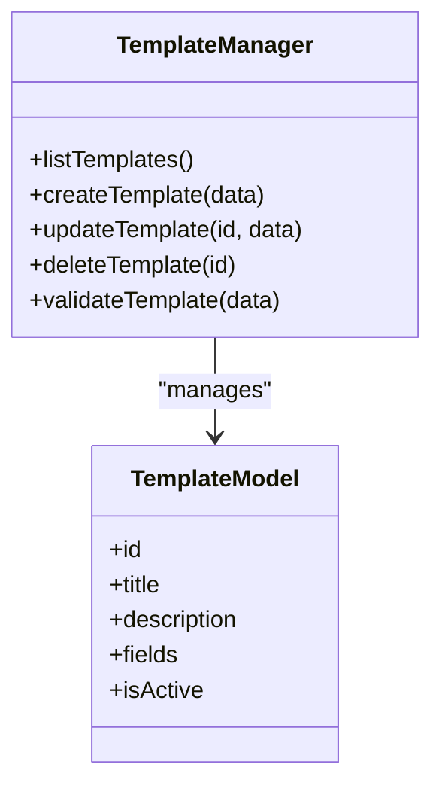
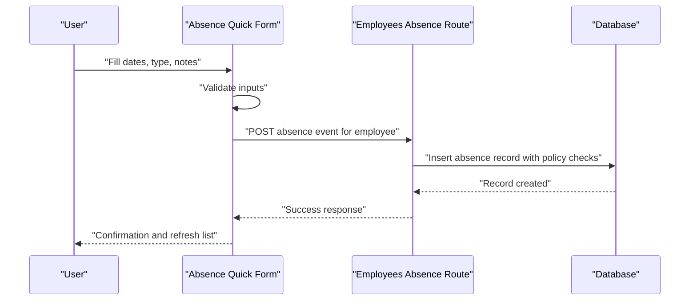
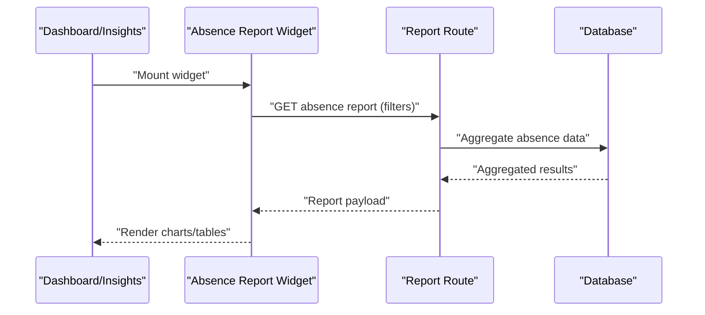
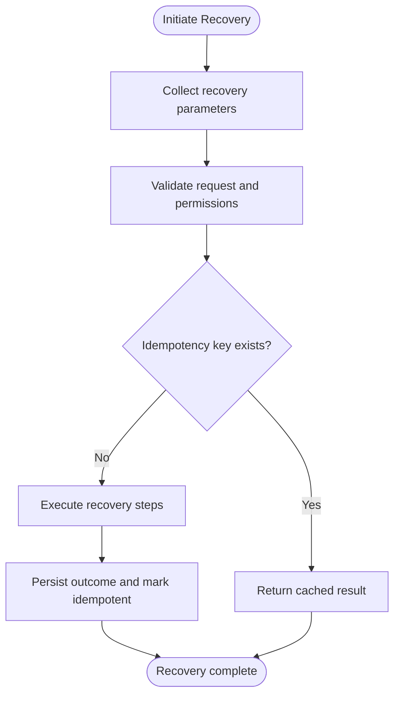
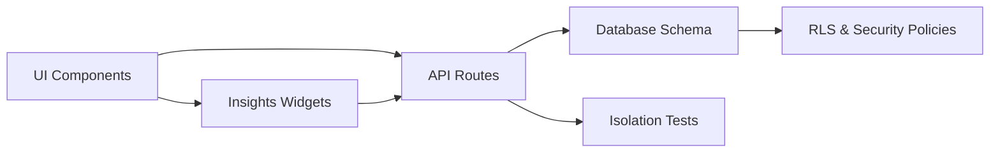

# Absence Management System

<cite>
**Referenced Files in This Document**
- [absence page](file://apps/hr-suite/app/(dashboard)/settings/absence/page.tsx)
- [absence settings form](file://apps/hr-suite/components/settings/absence-settings-form.tsx)
- [absence task template manager](file://apps/hr-suite/components/settings/absence-task-template-manager.tsx)
- [absence quick form component](file://apps/hr-suite/components/absence/absence-quick-form.tsx)
- [absence report widget](file://apps/hr-suite/components/insights/absence-report.tsx)
- [absence API route - employees](file://apps/hr-suite/app/api/absence/employees/[employeeId]/route.ts)
- [absence recovery API route](file://apps/hr-suite/app/api/absence/recovery/route.ts)
- [absence report API route](file://apps/hr-suite/app/api/absence/report/route.ts)
- [absence core migration](file://apps/hr-suite/supabase/migrations/20260726150000_add_absence_core.sql)
- [absence security hardening migration](file://apps/hr-suite/supabase/migrations/20260727155229_harden_absence_security.sql)
- [absence task templates migration](file://apps/hr-suite/supabase/migrations/20260727164511_absence_task_templates.sql)
- [absence immutability migration](file://apps/hr-suite/supabase/migrations/20260727165641_absence_task_template_immutability.sql)
- [absence demo seed](file://apps/hr-suite/supabase/migrations/20260727171300_seed_rich_absence_demo_employees.sql)
- [absence anon revoke migration](file://apps/hr-suite/supabase/migrations/20260727181000_revoke_absence_anon_grants.sql)
- [absence recovery idempotency migration](file://apps/hr-suite/supabase/migrations/20260727182000_harden_absence_recovery_idempotency.sql)
- [absence isolation test](file://apps/hr-suite/supabase/tests/absence_isolation.sql)
</cite>

## Table of Contents
1. [Introduction](#introduction)
2. [Project Structure](#project-structure)
3. [Core Components](#core-components)
4. [Architecture Overview](#architecture-overview)
5. [Detailed Component Analysis](#detailed-component-analysis)
6. [Dependency Analysis](#dependency-analysis)
7. [Performance Considerations](#performance-considerations)
8. [Troubleshooting Guide](#troubleshooting-guide)
9. [Conclusion](#conclusion)

## Introduction
This document explains the Absence Management System within the HR Suite application. It covers how absence data is modeled, configured, and accessed via APIs; how UI components present absence information and enable quick actions; and how reporting and recovery features are implemented. The goal is to provide both a high-level overview and detailed technical insights for developers and administrators.

## Project Structure
The absence feature spans several layers:
- UI pages and components under apps/hr-suite/app and apps/hr-suite/components
- API routes under apps/hr-suite/app/api/absence
- Database schema and policies defined in Supabase migrations
- Tests validating isolation and behavior

**Diagram sources**
- [absence page](file://apps/hr-suite/app/(dashboard)/settings/absence/page.tsx)
- [absence settings form](file://apps/hr-suite/components/settings/absence-settings-form.tsx)
- [absence task template manager](file://apps/hr-suite/components/settings/absence-task-template-manager.tsx)
- [absence quick form component](file://apps/hr-suite/components/absence/absence-quick-form.tsx)
- [absence report widget](file://apps/hr-suite/components/insights/absence-report.tsx)
- [absence API route - employees](file://apps/hr-suite/app/api/absence/employees/[employeeId]/route.ts)
- [absence recovery API route](file://apps/hr-suite/app/api/absence/recovery/route.ts)
- [absence report API route](file://apps/hr-suite/app/api/absence/report/route.ts)
- [absence core migration](file://apps/hr-suite/supabase/migrations/20260726150000_add_absence_core.sql)
- [absence security hardening migration](file://apps/hr-suite/supabase/migrations/20260727155229_harden_absence_security.sql)
- [absence task templates migration](file://apps/hr-suite/supabase/migrations/20260727164511_absence_task_templates.sql)
- [absence immutability migration](file://apps/hr-suite/supabase/migrations/20260727165641_absence_task_template_immutability.sql)
- [absence demo seed](file://apps/hr-suite/supabase/migrations/20260727171300_seed_rich_absence_demo_employees.sql)
- [absence anon revoke migration](file://apps/hr-suite/supabase/mupabase/migrations/20260727181000_revoke_absence_anon_grants.sql)
- [absence recovery idempotency migration](file://apps/hr-suite/supabase/migrations/20260727182000_harden_absence_recovery_idempotency.sql)

**Section sources**
- [absence page](file://apps/hr-suite/app/(dashboard)/settings/absence/page.tsx)
- [absence settings form](file://apps/hr-suite/components/settings/absence-settings-form.tsx)
- [absence task template manager](file://apps/hr-suite/components/settings/absence-task-template-manager.tsx)
- [absence quick form component](file://apps/hr-suite/components/absence/absence-quick-form.tsx)
- [absence report widget](file://apps/hr-suite/components/insights/absence-report.tsx)
- [absence API route - employees](file://apps/hr-suite/app/api/absence/employees/[employeeId]/route.ts)
- [absence recovery API route](file://apps/hr-suite/app/api/absence/recovery/route.ts)
- [absence report API route](file://apps/hr-suite/app/api/absence/report/route.ts)
- [absence core migration](file://apps/hr-suite/supabase/migrations/20260726150000_add_absence_core.sql)
- [absence security hardening migration](file://apps/hr-suite/supabase/migrations/20260727155229_harden_absence_security.sql)
- [absence task templates migration](file://apps/hr-suite/supabase/migrations/20260727164511_absence_task_templates.sql)
- [absence immutability migration](file://apps/hr-suite/supabase/migrations/20260727165641_absence_task_template_immutability.sql)
- [absence demo seed](file://apps/hr-suite/supabase/migrations/20260727171300_seed_rich_absence_demo_employees.sql)
- [absence anon revoke migration](file://apps/hr-suite/supabase/migrations/20260727181000_revoke_absence_anon_grants.sql)
- [absence recovery idempotency migration](file://apps/hr-suite/supabase/migrations/20260727182000_harden_absence_recovery_idempotency.sql)

## Core Components
- Absence Settings Page: Entry point for configuring absence-related options and viewing related management tools.
- Absence Settings Form: Provides forms to update absence configuration values.
- Absence Task Template Manager: Manages reusable absence task templates used by workflows.
- Absence Quick Form: Enables fast creation or logging of absence events from various contexts.
- Absence Insights Report Widget: Displays aggregated absence metrics and trends for dashboards and reports.

These components interact with backend APIs to persist and retrieve absence data, enforce policies, and generate reports.

**Section sources**
- [absence page](file://apps/hr-suite/app/(dashboard)/settings/absence/page.tsx)
- [absence settings form](file://apps/hr-suite/components/settings/absence-settings-form.tsx)
- [absence task template manager](file://apps/hr-suite/components/settings/absence-task-template-manager.tsx)
- [absence quick form component](file://apps/hr-suite/components/absence/absence-quick-form.tsx)
- [absence report widget](file://apps/hr-suite/components/insights/absence-report.tsx)

## Architecture Overview
The absence system follows a layered architecture:
- Presentation layer (Next.js pages and React components)
- API layer (Route handlers for CRUD, reporting, and recovery)
- Data layer (Supabase Postgres with RLS policies and stored procedures/functions as needed)

**Diagram sources**
- [absence API route - employees](file://apps/hr-suite/app/api/absence/employees/[employeeId]/route.ts)
- [absence recovery API route](file://apps/hr-suite/app/api/absence/recovery/route.ts)
- [absence report API route](file://apps/hr-suite/app/api/absence/report/route.ts)
- [absence core migration](file://apps/hr-suite/supabase/migrations/20260726150000_add_absence_core.sql)
- [absence security hardening migration](file://apps/hr-suite/supabase/migrations/20260727155229_harden_absence_security.sql)

## Detailed Component Analysis

### Absence Settings Page
- Purpose: Central hub for absence configuration and navigation to related managers.
- Behavior: Renders settings form and links to task template management.
- Integration: Uses client-side state to manage form inputs and triggers API calls when saving.

**Diagram sources**
- [absence page](file://apps/hr-suite/app/(dashboard)/settings/absence/page.tsx)
- [absence settings form](file://apps/hr-suite/components/settings/absence-settings-form.tsx)

**Section sources**
- [absence page](file://apps/hr-suite/app/(dashboard)/settings/absence/page.tsx)
- [absence settings form](file://apps/hr-suite/components/settings/absence-settings-form.tsx)

### Absence Task Template Manager
- Purpose: Create, view, and manage absence task templates that standardize follow-up tasks.
- Behavior: Supports CRUD operations on templates and enforces immutability rules where applicable.
- Integration: Calls API endpoints to persist templates and reads back updated lists.

**Diagram sources**
- [absence task template manager](file://apps/hr-suite/components/settings/absence-task-template-manager.tsx)
- [absence task templates migration](file://apps/hr-suite/supabase/migrations/20260727164511_absence_task_templates.sql)
- [absence immutability migration](file://apps/hr-suite/supabase/migrations/20260727165641_absence_task_template_immutability.sql)

**Section sources**
- [absence task template manager](file://apps/hr-suite/components/settings/absence-task-template-manager.tsx)
- [absence task templates migration](file://apps/hr-suite/supabase/migrations/20260727164511_absence_task_templates.sql)
- [absence immutability migration](file://apps/hr-suite/supabase/migrations/20260727165641_absence_task_template_immutability.sql)

### Absence Quick Form
- Purpose: Fast entry for logging absence events directly from employee context or dashboard widgets.
- Behavior: Validates date ranges, type selection, and optional notes; submits to API for processing.
- Integration: Posts to the employees-specific absence endpoint to associate entries with an employee.

**Diagram sources**
- [absence quick form component](file://apps/hr-suite/components/absence/absence-quick-form.tsx)
- [absence API route - employees](file://apps/hr-suite/app/api/absence/employees/[employeeId]/route.ts)
- [absence core migration](file://apps/hr-suite/supabase/migrations/20260726150000_add_absence_core.sql)

**Section sources**
- [absence quick form component](file://apps/hr-suite/components/absence/absence-quick-form.tsx)
- [absence API route - employees](file://apps/hr-suite/app/api/absence/employees/[employeeId]/route.ts)

### Absence Insights Report Widget
- Purpose: Aggregates absence metrics for dashboards and insights pages.
- Behavior: Requests summary data from the report API and renders charts or tables.
- Integration: Reads filtered datasets based on tenant, time range, and filters.

**Diagram sources**
- [absence report widget](file://apps/hr-suite/components/insights/absence-report.tsx)
- [absence report API route](file://apps/hr-suite/app/api/absence/report/route.ts)
- [absence core migration](file://apps/hr-suite/supabase/migrations/20260726150000_add_absence_core.sql)

**Section sources**
- [absence report widget](file://apps/hr-suite/components/insights/absence-report.tsx)
- [absence report API route](file://apps/hr-suite/app/api/absence/report/route.ts)

### Recovery Flow
- Purpose: Re-process or reconcile absence records to ensure consistency and handle edge cases.
- Behavior: Accepts parameters to identify affected records and performs idempotent operations.
- Integration: Uses dedicated recovery API and relies on idempotency guarantees in database layer.

**Diagram sources**
- [absence recovery API route](file://apps/hr-suite/app/api/absence/recovery/route.ts)
- [absence recovery idempotency migration](file://apps/hr-suite/supabase/migrations/20260727182000_harden_absence_recovery_idempotency.sql)

**Section sources**
- [absence recovery API route](file://apps/hr-suite/app/api/absence/recovery/route.ts)
- [absence recovery idempotency migration](file://apps/hr-suite/supabase/migrations/20260727182000_harden_absence_recovery_idempotency.sql)

## Dependency Analysis
The absence module depends on:
- UI components for user interactions
- API routes for business logic and persistence
- Database schema and policies for data integrity and security
- Tests ensuring isolation across tenants and users

**Diagram sources**
- [absence API route - employees](file://apps/hr-suite/app/api/absence/employees/[employeeId]/route.ts)
- [absence recovery API route](file://apps/hr-suite/app/api/absence/recovery/route.ts)
- [absence report API route](file://apps/hr-suite/app/api/absence/report/route.ts)
- [absence core migration](file://apps/hr-suite/supabase/migrations/20260726150000_add_absence_core.sql)
- [absence security hardening migration](file://apps/hr-suite/supabase/migrations/20260727155229_harden_absence_security.sql)
- [absence isolation test](file://apps/hr-suite/supabase/tests/absence_isolation.sql)

**Section sources**
- [absence API route - employees](file://apps/hr-suite/app/api/absence/employees/[employeeId]/route.ts)
- [absence recovery API route](file://apps/hr-suite/app/api/absence/recovery/route.ts)
- [absence report API route](file://apps/hr-suite/app/api/absence/report/route.ts)
- [absence core migration](file://apps/hr-suite/supabase/migrations/20260726150000_add_absence_core.sql)
- [absence security hardening migration](file://apps/hr-suite/supabase/migrations/20260727155229_harden_absence_security.sql)
- [absence isolation test](file://apps/hr-suite/supabase/tests/absence_isolation.sql)

## Performance Considerations
- Use efficient queries and indexes defined in migrations to optimize report generation and lookups.
- Leverage idempotency in recovery flows to avoid redundant work and ensure consistent outcomes.
- Minimize client-side re-renders by batching updates and using optimistic UI patterns where appropriate.
- Ensure proper pagination and filtering in API responses to reduce payload sizes.

[No sources needed since this section provides general guidance]

## Troubleshooting Guide
Common issues and resolutions:
- Permission errors: Verify tenant and user scope; check RLS policies enforced by security hardening migration.
- Duplicate entries: Confirm idempotency keys and recovery flow correctness.
- Missing data: Ensure demo seed has been applied in development environments.
- Anonymized access: Confirm anonymous grants have been revoked per policy.

**Section sources**
- [absence security hardening migration](file://apps/hr-suite/supabase/migrations/20260727155229_harden_absence_security.sql)
- [absence recovery idempotency migration](file://apps/hr-suite/supabase/migrations/20260727182000_harden_absence_recovery_idempotency.sql)
- [absence demo seed](file://apps/hr-suite/supabase/migrations/20260727171300_seed_rich_absence_demo_employees.sql)
- [absence anon revoke migration](file://apps/hr-suite/supabase/migrations/20260727181000_revoke_absence_anon_grants.sql)
- [absence isolation test](file://apps/hr-suite/supabase/tests/absence_isolation.sql)

## Conclusion
The Absence Management System integrates UI, API, and database layers to support absence configuration, quick logging, reporting, and recovery. Strong security policies and idempotency measures ensure data integrity and safe operations. Developers can extend functionality through well-defined components and APIs while maintaining tenant isolation and performance.

[No sources needed since this section summarizes without analyzing specific files]