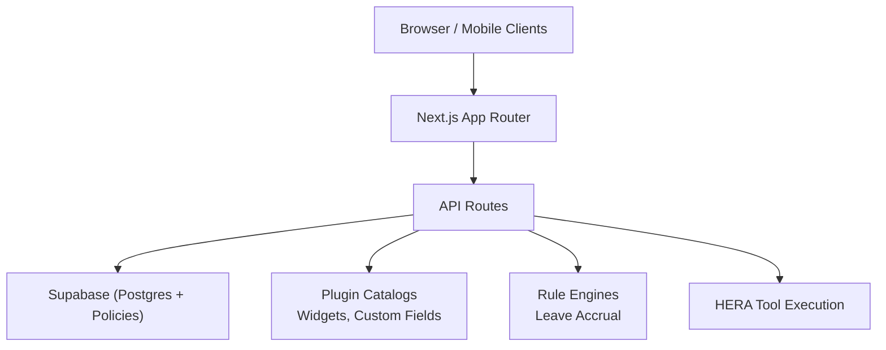
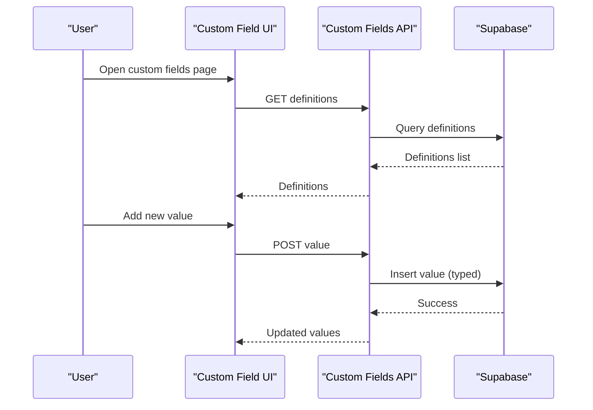
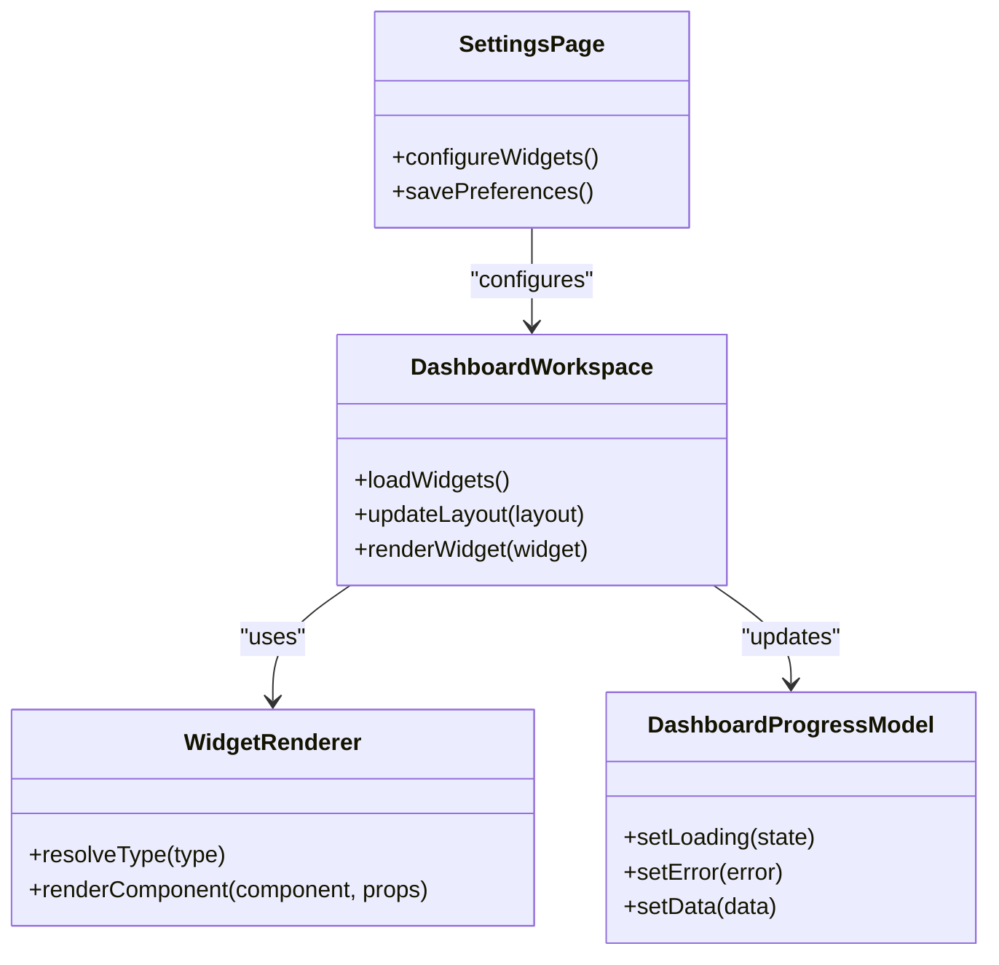
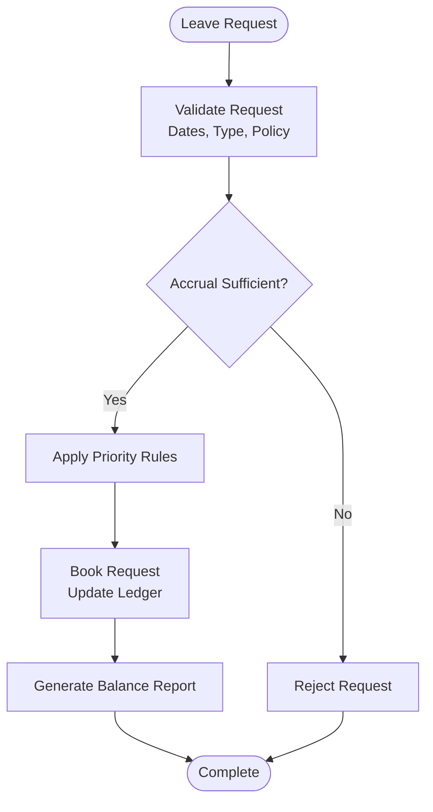
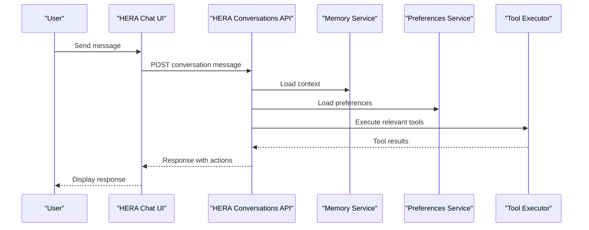
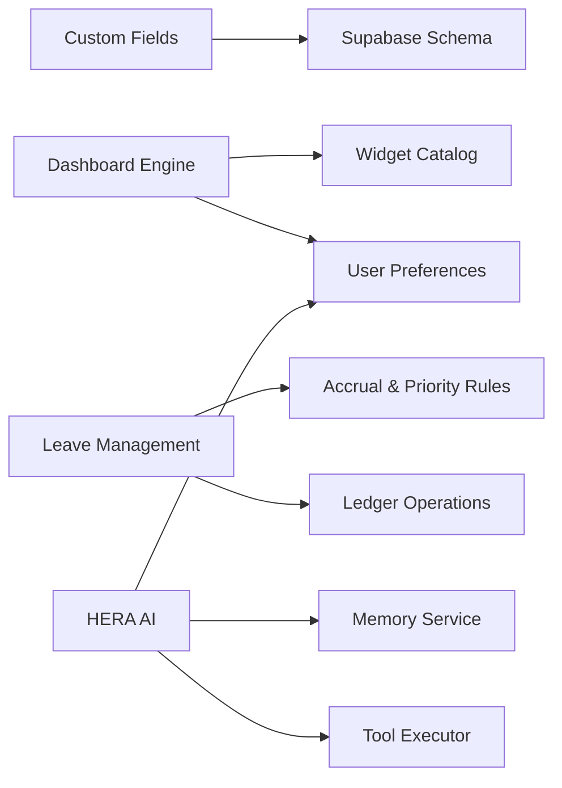

# Advanced Features

<cite>
**Referenced Files in This Document**
- [apps/hr-suite/app/(dashboard)/custom-fields/page.tsx](file://apps/hr-suite/app/(dashboard)/custom-fields/page.tsx)
- [apps/hr-suite/app/api/custom-fields/route.ts](file://apps/hr-suite/app/api/custom-fields/route.ts)
- [apps/hr-suite/app/api/custom-fields/[definitionId]/route.ts](file://apps/hr-suite/app/api/custom-fields/[definitionId]/route.ts)
- [apps/hr-suite/components/custom-fields/custom-field-manager.tsx](file://apps/hr-suite/components/custom-fields/custom-field-manager.tsx)
- [apps/hr-suite/components/custom-fields/employee-custom-fields.tsx](file://apps/hr-suite/components/custom-fields/employee-custom-fields.tsx)
- [apps/hr-suite/lib/custom-fields/index.ts](file://apps/hr-suite/lib/custom-fields/index.ts)
- [apps/hr-suite/app/(dashboard)/dashboard/page.tsx](file://apps/hr-suite/app/(dashboard)/dashboard/page.tsx)
- [apps/hr-suite/app/api/dashboards/route.ts](file://apps/hr-suite/app/api/dashboards/route.ts)
- [apps/hr-suite/app/api/dashboards/[dashboardId]/route.ts](file://apps/hr-suite/app/api/dashboards/[dashboardId]/route.ts)
- [apps/hr-suite/components/dashboard/dashboard-workspace.tsx](file://apps/hr-suite/components/dashboard/dashboard-workspace.tsx)
- [apps/hr-suite/components/dashboard/widget-renderer.tsx](file://apps/hr-suite/components/dashboard/widget-renderer.tsx)
- [apps/hr-suite/components/dashboard/dashboard-progress-model.ts](file://apps/hr-suite/components/dashboard/dashboard-progress-model.ts)
- [apps/hr-suite/components/dashboard/dashboard-workspace-model.ts](file://apps/hr-suite/components/dashboard/dashboard-workspace-model.ts)
- [apps/hr-suite/app/(dashboard)/settings/dashboard-widgets/page.tsx](file://apps/hr-suite/app/(dashboard)/settings/dashboard-widgets/page.tsx)
- [apps/hr-suite/app/api/settings/dashboard-widgets/route.ts](file://apps/hr-suite/app/api/settings/dashboard-widgets/route.ts)
- [apps/hr-suite/app/(dashboard)/leave-accrual/page.tsx](file://apps/hr-suite/app/(dashboard)/leave-accrual/page.tsx)
- [apps/hr-suite/app/(dashboard)/leave-accrual/rules/new/page.tsx](file://apps/hr-suite/app/(dashboard)/leave-accrual/rules/new/page.tsx)
- [apps/hr-suite/app/(dashboard)/leave-accrual/priority-rules/page.tsx](file://apps/hr-suite/app/(dashboard)/leave-accrual/priority-rules/page.tsx)
- [apps/hr-suite/app/api/leave/request/route.ts](file://apps/hr-suite/app/api/leave/request/route.ts)
- [apps/hr-suite/app/api/leave/balance-report/route.ts](file://apps/hr-suite/app/api/leave/balance-report/route.ts)
- [apps/hr-suite/components/leave/accrual-rule-editor.tsx](file://apps/hr-suite/components/leave/accrual-rule-editor.tsx)
- [apps/hr-suite/components/leave/priority-rule-editor.tsx](file://apps/hr-suite/components/leave/priority-rule-editor.tsx)
- [apps/hr-suite/app/(dashboard)/hera/page.tsx](file://apps/hr-suite/app/(dashboard)/hera/page.tsx)
- [apps/hr-suite/app/api/hera/conversations/route.ts](file://apps/hr-suite/app/api/hera/conversations/route.ts)
- [apps/hr-suite/app/api/hera/memory/route.ts](file://apps/hr-suite/app/api/hera/memory/route.ts)
- [apps/hr-suite/app/api/hera/preferences/route.ts](file://apps/hr-suite/app/api/hera/preferences/route.ts)
- [apps/hr-suite/components/hera/hera-chat.tsx](file://apps/hr-suite/components/hera/hera-chat.tsx)
- [apps/hr-suite/components/hera/hera-chat-state.ts](file://apps/hr-suite/components/hera/hera-chat-state.ts)
- [apps/hr-suite/components/hera/hera-request.ts](file://apps/hr-suite/components/hera/hera-request.ts)
- [apps/hr-suite/components/hera/hera-response-model.ts](file://apps/hr-suite/components/hera/hera-response-model.ts)
- [supabase/migrations/20260715122802_add_custom_field_definitions.sql](file://supabase/migrations/20260715122802_add_custom_field_definitions.sql)
- [supabase/migrations/20260715123119_add_custom_field_value_rpc.sql](file://supabase/migrations/20260715123119_add_custom_field_value_rpc.sql)
- [supabase/migrations/20260718170000_add_dashboard_widget_catalog.sql](file://supabase/migrations/20260718170000_add_dashboard_widget_catalog.sql)
- [supabase/migrations/20260722142551_add_leave_engine_foundation.sql](file://supabase/migrations/20260722142551_add_leave_engine_foundation.sql)
- [supabase/migrations/20260722190000_add_leave_request_booking_engine.sql](file://supabase/migrations/20260722190000_add_leave_request_booking_engine.sql)
- [supabase/migrations/20260722192000_add_leave_ledger_operations.sql](file://supabase/migrations/20260722192000_add_leave_ledger_operations.sql)
- [supabase/migrations/20260716092637_add_hera_ai_agent.sql](file://supabase/migrations/20260716092637_add_hera_ai_agent.sql)
</cite>

## Table of Contents
1. [Introduction](#introduction)
2. [Project Structure](#project-structure)
3. [Core Components](#core-components)
4. [Architecture Overview](#architecture-overview)
5. [Detailed Component Analysis](#detailed-component-analysis)
6. [Dependency Analysis](#dependency-analysis)
7. [Performance Considerations](#performance-considerations)
8. [Troubleshooting Guide](#troubleshooting-guide)
9. [Conclusion](#conclusion)
10. [Appendices](#appendices)

## Introduction
This document explains LiquidHR’s advanced features with a focus on extensibility and intelligent capabilities:
- Custom Fields System for dynamic data modeling
- Dashboard Engine for personalized analytics and widgets
- Leave Management with accrual calculations and approval workflows
- HERA AI Assistant for natural language interactions and tool execution

It covers architectural patterns (plugin architectures, widget systems, AI tool execution models), configuration options, extension points, integration patterns, practical examples, performance considerations, and best practices.

## Project Structure
The advanced features are implemented across Next.js app routes, API routes, React components, and Supabase migrations. The key areas include:
- Custom fields: UI pages, API routes, component managers, and database schema
- Dashboards: workspace, widget renderer, progress model, settings, and catalog
- Leave engine: rules, priority rules, request booking, ledger, and balance reporting
- HERA AI: chat UI, state management, request/response models, memory, preferences, and conversation APIs

```mermaid
graph TB
subgraph "Custom Fields"
CF_UI["UI Pages<br/>custom-fields/page.tsx"]
CF_API["API Routes<br/>api/custom-fields/*"]
CF_COMP["Components<br/>custom-field-manager.tsx<br/>employee-custom-fields.tsx"]
CF_DB["Schema & RPC<br/>migrations: custom fields"]
end
subgraph "Dashboard Engine"
DASH_UI["UI Pages<br/>dashboard/page.tsx<br/>settings/dashboard-widgets/page.tsx"]
DASH_API["API Routes<br/>api/dashboards/*<br/>api/settings/dashboard-widgets/*"]
DASH_COMP["Components<br/>dashboard-workspace.tsx<br/>widget-renderer.tsx<br/>models"]
DASH_DB["Schema<br/>migrations: dashboard widget catalog"]
end
subgraph "Leave Management"
LEAVE_UI["UI Pages<br/>leave-accrual/*"]
LEAVE_API["API Routes<br/>api/leave/*"]
LEAVE_COMP["Components<br/>accrual-rule-editor.tsx<br/>priority-rule-editor.tsx"]
LEAVE_DB["Schema & Ops<br/>migrations: leave engine, ledger"]
end
subgraph "HERA AI"
HERA_UI["UI Pages<br/>hera/page.tsx"]
HERA_API["API Routes<br/>api/hera/*"]
HERA_COMP["Components<br/>hera-chat.tsx<br/>state & request models"]
HERA_DB["Schema<br/>migrations: hera agent, memory"]
end
CF_UI --> CF_API --> CF_DB
CF_COMP --> CF_API
DASH_UI --> DASH_API --> DASH_DB
DASH_COMP --> DASH_API
LEAVE_UI --> LEAVE_API --> LEAVE_DB
LEAVE_COMP --> LEAVE_API
HERA_UI --> HERA_API --> HERA_DB
HERA_COMP --> HERA_API
```

**Diagram sources**
- [apps/hr-suite/app/(dashboard)/custom-fields/page.tsx](file://apps/hr-suite/app/(dashboard)/custom-fields/page.tsx)
- [apps/hr-suite/app/api/custom-fields/route.ts](file://apps/hr-suite/app/api/custom-fields/route.ts)
- [apps/hr-suite/components/custom-fields/custom-field-manager.tsx](file://apps/hr-suite/components/custom-fields/custom-field-manager.tsx)
- [apps/hr-suite/app/(dashboard)/dashboard/page.tsx](file://apps/hr-suite/app/(dashboard)/dashboard/page.tsx)
- [apps/hr-suite/app/api/dashboards/route.ts](file://apps/hr-suite/app/api/dashboards/route.ts)
- [apps/hr-suite/components/dashboard/dashboard-workspace.tsx](file://apps/hr-suite/components/dashboard/dashboard-workspace.tsx)
- [apps/hr-suite/app/(dashboard)/leave-accrual/page.tsx](file://apps/hr-suite/app/(dashboard)/leave-accrual/page.tsx)
- [apps/hr-suite/app/api/leave/request/route.ts](file://apps/hr-suite/app/api/leave/request/route.ts)
- [apps/hr-suite/components/leave/accrual-rule-editor.tsx](file://apps/hr-suite/components/leave/accrual-rule-editor.tsx)
- [apps/hr-suite/app/(dashboard)/hera/page.tsx](file://apps/hr-suite/app/(dashboard)/hera/page.tsx)
- [apps/hr-suite/app/api/hera/conversations/route.ts](file://apps/hr-suite/app/api/hera/conversations/route.ts)
- [supabase/migrations/20260715122802_add_custom_field_definitions.sql](file://supabase/migrations/20260715122802_add_custom_field_definitions.sql)
- [supabase/migrations/20260718170000_add_dashboard_widget_catalog.sql](file://supabase/migrations/20260718170000_add_dashboard_widget_catalog.sql)
- [supabase/migrations/20260722142551_add_leave_engine_foundation.sql](file://supabase/migrations/20260722142551_add_leave_engine_foundation.sql)
- [supabase/migrations/20260716092637_add_hera_ai_agent.sql](file://supabase/migrations/20260716092637_add_hera_ai_agent.sql)

**Section sources**
- [apps/hr-suite/app/(dashboard)/custom-fields/page.tsx](file://apps/hr-suite/app/(dashboard)/custom-fields/page.tsx)
- [apps/hr-suite/app/(dashboard)/dashboard/page.tsx](file://apps/hr-suite/app/(dashboard)/dashboard/page.tsx)
- [apps/hr-suite/app/(dashboard)/leave-accrual/page.tsx](file://apps/hr-suite/app/(dashboard)/leave-accrual/page.tsx)
- [apps/hr-suite/app/(dashboard)/hera/page.tsx](file://apps/hr-suite/app/(dashboard)/hera/page.tsx)

## Core Components
- Custom Fields System: Dynamic field definitions and values stored via Supabase; managed through UI and API routes; supports typed values and validation at the schema layer.
- Dashboard Engine: Personalized dashboards composed of widgets defined in a catalog; rendered by a widget system that resolves types and renders corresponding components; persisted per user or role.
- Leave Management: Accrual rules define how leave balances accumulate; priority rules govern allocation order; requests are booked via an engine that updates ledgers and reports balances.
- HERA AI Assistant: Chat interface backed by conversation storage, memory, and preferences; integrates tools to execute actions based on natural language prompts.

**Section sources**
- [apps/hr-suite/app/api/custom-fields/route.ts](file://apps/hr-suite/app/api/custom-fields/route.ts)
- [apps/hr-suite/components/custom-fields/custom-field-manager.tsx](file://apps/hr-suite/components/custom-fields/custom-field-manager.tsx)
- [apps/hr-suite/app/api/dashboards/route.ts](file://apps/hr-suite/app/api/dashboards/route.ts)
- [apps/hr-suite/components/dashboard/widget-renderer.tsx](file://apps/hr-suite/components/dashboard/widget-renderer.tsx)
- [apps/hr-suite/app/api/leave/request/route.ts](file://apps/hr-suite/app/api/leave/request/route.ts)
- [apps/hr-suite/components/leave/accrual-rule-editor.tsx](file://apps/hr-suite/components/leave/accrual-rule-editor.tsx)
- [apps/hr-suite/app/api/hera/conversations/route.ts](file://apps/hr-suite/app/api/hera/conversations/route.ts)
- [apps/hr-suite/components/hera/hera-chat.tsx](file://apps/hr-suite/components/hera/hera-chat.tsx)

## Architecture Overview
LiquidHR uses a layered architecture:
- Presentation layer: Next.js pages and React components provide interactive UIs
- API layer: Route handlers orchestrate business logic and interact with the database
- Data layer: Supabase provides relational storage, RPC functions, and policies
- Extension points: Plugin-style catalogs (widgets, custom fields), rule engines (leave accrual), and AI tool execution (HERA)

[No sources needed since this diagram shows conceptual workflow, not actual code structure]

## Detailed Component Analysis

### Custom Fields System
Purpose: Enable dynamic, typed attributes for entities without schema changes.

Key elements:
- Definition management: Create, update, and delete field definitions
- Value persistence: Store values keyed by entity and definition
- Validation: Enforce types and constraints at the database level
- UI: Manager and inline editors for employees

**Diagram sources**
- [apps/hr-suite/app/(dashboard)/custom-fields/page.tsx](file://apps/hr-suite/app/(dashboard)/custom-fields/page.tsx)
- [apps/hr-suite/app/api/custom-fields/route.ts](file://apps/hr-suite/app/api/custom-fields/route.ts)
- [supabase/migrations/20260715122802_add_custom_field_definitions.sql](file://supabase/migrations/20260715122802_add_custom_field_definitions.sql)
- [supabase/migrations/20260715123119_add_custom_field_value_rpc.sql](file://supabase/migrations/20260715123119_add_custom_field_value_rpc.sql)

Configuration and extension points:
- Define field types and constraints in the schema
- Use RPC functions for safe typed reads/writes
- Extend UI components to support new field types

Practical example: Creating a custom field type
- Add a new field definition with a specific type and validation rules
- Implement a rendering component in the employee custom fields editor
- Ensure API route handles the new type safely

Best practices:
- Validate inputs server-side using database constraints
- Cache frequently accessed definitions
- Avoid overusing custom fields for core attributes

**Section sources**
- [apps/hr-suite/app/api/custom-fields/route.ts](file://apps/hr-suite/app/api/custom-fields/route.ts)
- [apps/hr-suite/app/api/custom-fields/[definitionId]/route.ts](file://apps/hr-suite/app/api/custom-fields/[definitionId]/route.ts)
- [apps/hr-suite/components/custom-fields/custom-field-manager.tsx](file://apps/hr-suite/components/custom-fields/custom-field-manager.tsx)
- [apps/hr-suite/components/custom-fields/employee-custom-fields.tsx](file://apps/hr-suite/components/custom-fields/employee-custom-fields.tsx)
- [supabase/migrations/20260715122802_add_custom_field_definitions.sql](file://supabase/migrations/20260715122802_add_custom_field_definitions.sql)
- [supabase/migrations/20260715123119_add_custom_field_value_rpc.sql](file://supabase/migrations/20260715123119_add_custom_field_value_rpc.sql)

### Dashboard Engine
Purpose: Provide personalized dashboards composed of configurable widgets.

Key elements:
- Widget catalog: Registry of available widget types and metadata
- Workspace: Layout and ordering of widgets per user
- Renderer: Resolves widget type to component and renders it
- Progress model: Tracks loading and error states

**Diagram sources**
- [apps/hr-suite/components/dashboard/dashboard-workspace.tsx](file://apps/hr-suite/components/dashboard/dashboard-workspace.tsx)
- [apps/hr-suite/components/dashboard/widget-renderer.tsx](file://apps/hr-suite/components/dashboard/widget-renderer.tsx)
- [apps/hr-suite/components/dashboard/dashboard-progress-model.ts](file://apps/hr-suite/components/dashboard/dashboard-progress-model.ts)
- [apps/hr-suite/app/(dashboard)/settings/dashboard-widgets/page.tsx](file://apps/hr-suite/app/(dashboard)/settings/dashboard-widgets/page.tsx)

Configuration and extension points:
- Register new widget types in the catalog
- Implement widget components adhering to the expected props interface
- Persist widget configurations per user or role

Practical example: Building a dashboard widget
- Define a widget type with metadata (title, icon, description)
- Implement a component that fetches data and renders insights
- Add configuration options in the settings page

Best practices:
- Keep widget components lightweight and focused
- Use streaming or incremental loading for large datasets
- Cache widget data where appropriate

**Section sources**
- [apps/hr-suite/app/(dashboard)/dashboard/page.tsx](file://apps/hr-suite/app/(dashboard)/dashboard/page.tsx)
- [apps/hr-suite/app/api/dashboards/route.ts](file://apps/hr-suite/app/api/dashboards/route.ts)
- [apps/hr-suite/app/api/dashboards/[dashboardId]/route.ts](file://apps/hr-suite/app/api/dashboards/[dashboardId]/route.ts)
- [apps/hr-suite/components/dashboard/dashboard-workspace.tsx](file://apps/hr-suite/components/dashboard/dashboard-workspace.tsx)
- [apps/hr-suite/components/dashboard/widget-renderer.tsx](file://apps/hr-suite/components/dashboard/widget-renderer.tsx)
- [apps/hr-suite/components/dashboard/dashboard-progress-model.ts](file://apps/hr-suite/components/dashboard/dashboard-progress-model.ts)
- [apps/hr-suite/app/(dashboard)/settings/dashboard-widgets/page.tsx](file://apps/hr-suite/app/(dashboard)/settings/dashboard-widgets/page.tsx)
- [apps/hr-suite/app/api/settings/dashboard-widgets/route.ts](file://apps/hr-suite/app/api/settings/dashboard-widgets/route.ts)
- [supabase/migrations/20260718170000_add_dashboard_widget_catalog.sql](file://supabase/migrations/20260718170000_add_dashboard_widget_catalog.sql)

### Leave Management
Purpose: Manage leave accruals, priorities, requests, and balances.

Key elements:
- Accrual rules: Define how leave balances accumulate over time
- Priority rules: Determine allocation order when multiple rules apply
- Request booking: Process leave requests and update ledgers
- Balance reporting: Generate current and historical balances

**Diagram sources**
- [apps/hr-suite/app/api/leave/request/route.ts](file://apps/hr-suite/app/api/leave/request/route.ts)
- [apps/hr-suite/app/api/leave/balance-report/route.ts](file://apps/hr-suite/app/api/leave/balance-report/route.ts)
- [apps/hr-suite/components/leave/accrual-rule-editor.tsx](file://apps/hr-suite/components/leave/accrual-rule-editor.tsx)
- [apps/hr-suite/components/leave/priority-rule-editor.tsx](file://apps/hr-suite/components/leave/priority-rule-editor.tsx)

Configuration and extension points:
- Define accrual rules with parameters (frequency, caps, eligibility)
- Configure priority rules to resolve conflicts
- Extend request processing with additional validations or approvals

Practical example: Configuring accrual rules
- Create a rule specifying accrual frequency and maximum balance
- Link the rule to leave types and employee groups
- Test with preview and validate ledger updates

Best practices:
- Use idempotent operations for booking to avoid duplicates
- Index frequently queried columns for performance
- Audit all ledger changes for compliance

**Section sources**
- [apps/hr-suite/app/(dashboard)/leave-accrual/page.tsx](file://apps/hr-suite/app/(dashboard)/leave-accrual/page.tsx)
- [apps/hr-suite/app/(dashboard)/leave-accrual/rules/new/page.tsx](file://apps/hr-suite/app/(dashboard)/leave-accrual/rules/new/page.tsx)
- [apps/hr-suite/app/(dashboard)/leave-accrual/priority-rules/page.tsx](file://apps/hr-suite/app/(dashboard)/leave-accrual/priority-rules/page.tsx)
- [apps/hr-suite/app/api/leave/request/route.ts](file://apps/hr-suite/app/api/leave/request/route.ts)
- [apps/hr-suite/app/api/leave/balance-report/route.ts](file://apps/hr-suite/app/api/leave/balance-report/route.ts)
- [apps/hr-suite/components/leave/accrual-rule-editor.tsx](file://apps/hr-suite/components/leave/accrual-rule-editor.tsx)
- [apps/hr-suite/components/leave/priority-rule-editor.tsx](file://apps/hr-suite/components/leave/priority-rule-editor.tsx)
- [supabase/migrations/20260722142551_add_leave_engine_foundation.sql](file://supabase/migrations/20260722142551_add_leave_engine_foundation.sql)
- [supabase/migrations/20260722190000_add_leave_request_booking_engine.sql](file://supabase/migrations/20260722190000_add_leave_request_booking_engine.sql)
- [supabase/migrations/20260722192000_add_leave_ledger_operations.sql](file://supabase/migrations/20260722192000_add_leave_ledger_operations.sql)

### HERA AI Assistant
Purpose: Provide natural language interactions with HR data and processes via tools.

Key elements:
- Chat UI: Real-time conversation interface
- State management: Tracks messages, context, and tool usage
- Request handling: Processes prompts and executes tools
- Memory and preferences: Stores context and user-specific settings

**Diagram sources**
- [apps/hr-suite/app/(dashboard)/hera/page.tsx](file://apps/hr-suite/app/(dashboard)/hera/page.tsx)
- [apps/hr-suite/app/api/hera/conversations/route.ts](file://apps/hr-suite/app/api/hera/conversations/route.ts)
- [apps/hr-suite/app/api/hera/memory/route.ts](file://apps/hr-suite/app/api/hera/memory/route.ts)
- [apps/hr-suite/app/api/hera/preferences/route.ts](file://apps/hr-suite/app/api/hera/preferences/route.ts)
- [apps/hr-suite/components/hera/hera-chat.tsx](file://apps/hr-suite/components/hera/hera-chat.tsx)
- [apps/hr-suite/components/hera/hera-chat-state.ts](file://apps/hr-suite/components/hera/hera-chat-state.ts)
- [apps/hr-suite/components/hera/hera-request.ts](file://apps/hr-suite/components/hera/hera-request.ts)
- [apps/hr-suite/components/hera/hera-response-model.ts](file://apps/hr-suite/components/hera/hera-response-model.ts)

Configuration and extension points:
- Define tools with input schemas and output formats
- Register tools in the executor pipeline
- Customize memory retention and preference scopes

Practical example: Extending AI capabilities
- Implement a new tool for querying employee data
- Add validation and error handling
- Integrate with conversation flow and UI responses

Best practices:
- Limit tool execution scope to prevent unintended side effects
- Log tool invocations for auditability
- Cache frequent queries to reduce latency

**Section sources**
- [apps/hr-suite/app/(dashboard)/hera/page.tsx](file://apps/hr-suite/app/(dashboard)/hera/page.tsx)
- [apps/hr-suite/app/api/hera/conversations/route.ts](file://apps/hr-suite/app/api/hera/conversations/route.ts)
- [apps/hr-suite/app/api/hera/memory/route.ts](file://apps/hr-suite/app/api/hera/memory/route.ts)
- [apps/hr-suite/app/api/hera/preferences/route.ts](file://apps/hr-suite/app/api/hera/preferences/route.ts)
- [apps/hr-suite/components/hera/hera-chat.tsx](file://apps/hr-suite/components/hera/hera-chat.tsx)
- [apps/hr-suite/components/hera/hera-chat-state.ts](file://apps/hr-suite/components/hera/hera-chat-state.ts)
- [apps/hr-suite/components/hera/hera-request.ts](file://apps/hr-suite/components/hera/hera-request.ts)
- [apps/hr-suite/components/hera/hera-response-model.ts](file://apps/hr-suite/components/hera/hera-response-model.ts)
- [supabase/migrations/20260716092637_add_hera_ai_agent.sql](file://supabase/migrations/20260716092637_add_hera_ai_agent.sql)

## Dependency Analysis
Inter-module dependencies:
- Custom fields depend on Supabase schema and RPC functions
- Dashboard engine depends on widget catalog and user preferences
- Leave management depends on accrual and priority rules, ledger operations
- HERA AI depends on memory, preferences, and tool execution services

**Diagram sources**
- [apps/hr-suite/app/api/custom-fields/route.ts](file://apps/hr-suite/app/api/custom-fields/route.ts)
- [apps/hr-suite/app/api/dashboards/route.ts](file://apps/hr-suite/app/api/dashboards/route.ts)
- [apps/hr-suite/app/api/leave/request/route.ts](file://apps/hr-suite/app/api/leave/request/route.ts)
- [apps/hr-suite/app/api/hera/conversations/route.ts](file://apps/hr-suite/app/api/hera/conversations/route.ts)

**Section sources**
- [apps/hr-suite/app/api/custom-fields/route.ts](file://apps/hr-suite/app/api/custom-fields/route.ts)
- [apps/hr-suite/app/api/dashboards/route.ts](file://apps/hr-suite/app/api/dashboards/route.ts)
- [apps/hr-suite/app/api/leave/request/route.ts](file://apps/hr-suite/app/api/leave/request/route.ts)
- [apps/hr-suite/app/api/hera/conversations/route.ts](file://apps/hr-suite/app/api/hera/conversations/route.ts)

## Performance Considerations
- Database indexing: Ensure foreign keys and query filters are indexed
- Caching strategies: Cache static catalogs (widgets, field definitions)
- Streaming responses: Use progressive loading for dashboards and large datasets
- Idempotency: Prevent duplicate operations in leave booking and AI tool execution
- Query optimization: Leverage RPC functions for complex calculations

[No sources needed since this section provides general guidance]

## Troubleshooting Guide
Common issues and resolutions:
- Custom fields validation errors: Check schema constraints and RPC function behavior
- Dashboard widget loading failures: Verify widget registration and data availability
- Leave request rejections: Review accrual rules and priority configurations
- HERA AI unexpected responses: Inspect tool execution logs and memory context

Debugging steps:
- Inspect API route responses and error payloads
- Validate database policies and permissions
- Use Supabase tests to verify schema and function behavior

**Section sources**
- [apps/hr-suite/app/api/custom-fields/route.ts](file://apps/hr-suite/app/api/custom-fields/route.ts)
- [apps/hr-suite/app/api/dashboards/route.ts](file://apps/hr-suite/app/api/dashboards/route.ts)
- [apps/hr-suite/app/api/leave/request/route.ts](file://apps/hr-suite/app/api/leave/request/route.ts)
- [apps/hr-suite/app/api/hera/conversations/route.ts](file://apps/hr-suite/app/api/hera/conversations/route.ts)

## Conclusion
LiquidHR’s advanced features demonstrate a robust, extensible architecture enabling dynamic data modeling, personalized analytics, sophisticated leave management, and intelligent AI interactions. By leveraging plugin architectures, widget systems, and AI tool execution models, organizations can tailor the platform to their unique needs while maintaining performance and reliability.

[No sources needed since this section summarizes without analyzing specific files]

## Appendices
- Best practices for extending custom fields, dashboards, leave rules, and AI tools
- Integration patterns with external systems via API routes and RPC functions
- Security considerations including RBAC and policy enforcement

[No sources needed since this section provides general guidance]