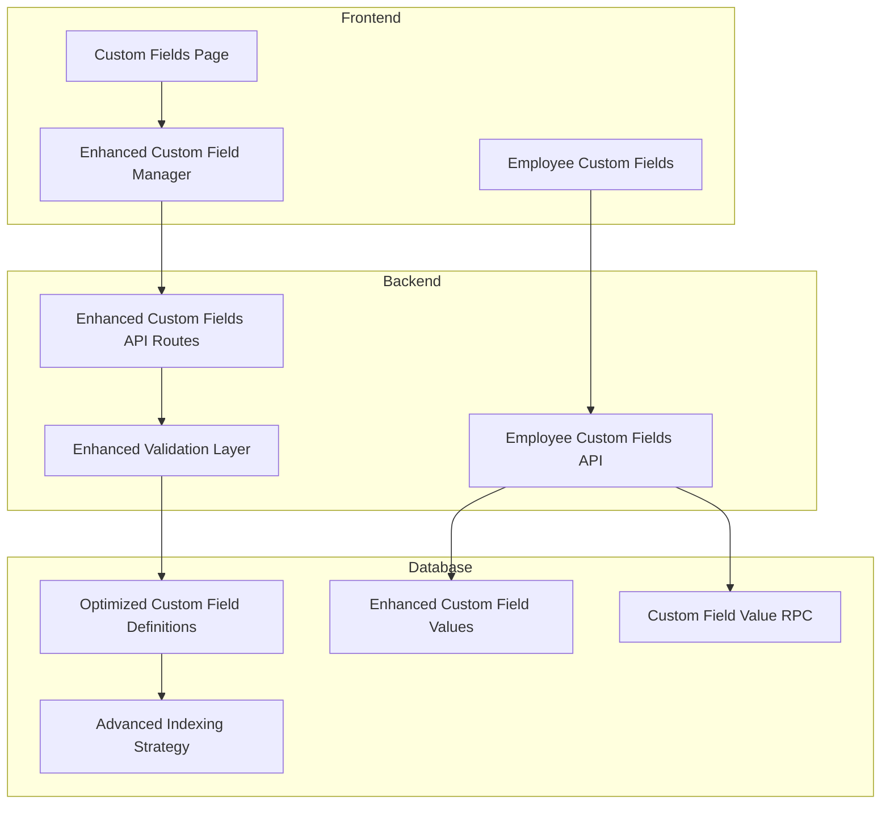
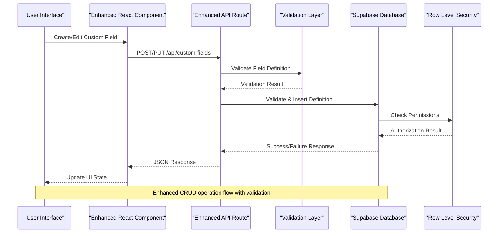
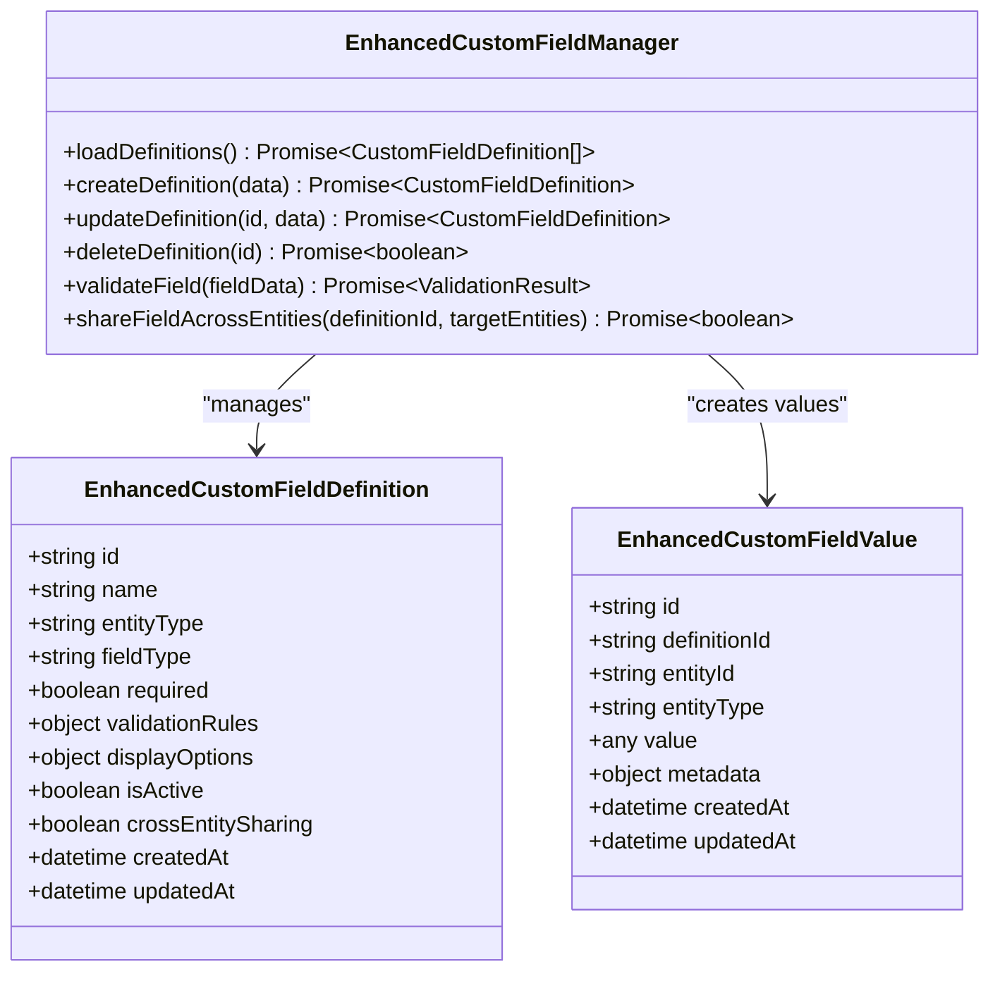
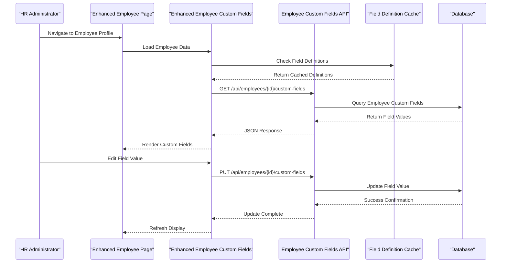
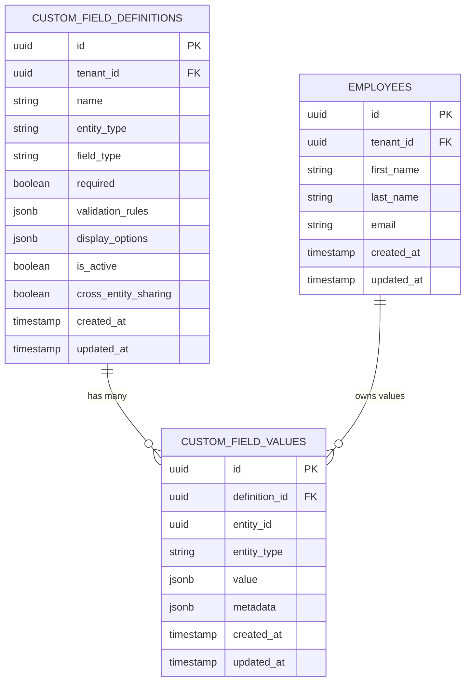
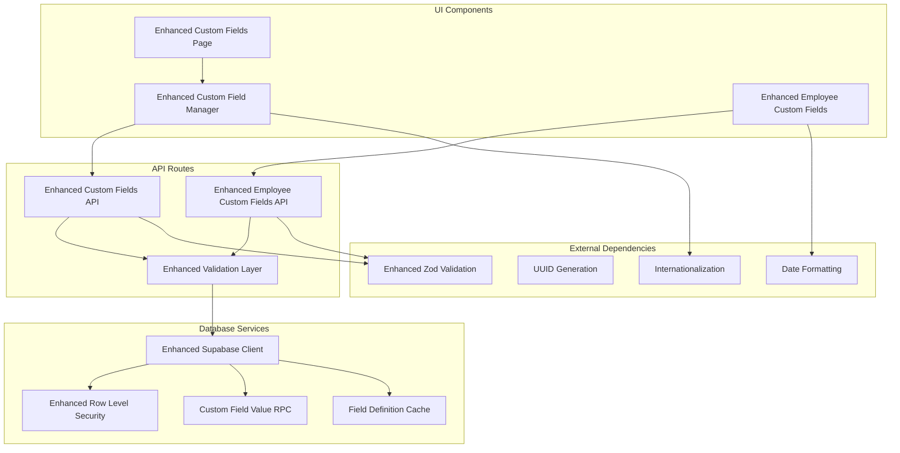

# Custom Fields System

<cite>
**Referenced Files in This Document**
- [custom-fields page](file://apps/hr-suite/app/(dashboard)/custom-fields/page.tsx)
- [Custom Field Manager Component](file://apps/hr-suite/components/custom-fields/custom-field-manager.tsx)
- [Employee Custom Fields Component](file://apps/hr-suite/components/custom-fields/employee-custom-fields.tsx)
- [Custom Fields API Route](file://apps/hr-suite/app/api/custom-fields/route.ts)
- [Custom Field Definition API Route](file://apps/hr-suite/app/api/custom-fields/[definitionId]/route.ts)
- [Employee Custom Fields API Route](file://apps/hr-suite/app/api/employees/[employeeId]/custom-fields/route.ts)
- [Custom Fields Database Migration](file://apps/hr-suite/supabase/migrations/20260715122802_add_custom_field_definitions.sql)
- [Custom Field Value RPC Migration](file://apps/hr-suite/supabase/migrations/20260715123119_add_custom_field_value_rpc.sql)
- [Custom Field Values Security Migration](file://apps/hr-suite/supabase/migrations/20260715123927_harden_custom_field_values.sql)
- [Custom Fields Seed Data](file://apps/hr-suite/supabase/migrations/20260715131230_seed_custom_fields_and_tenant_roles.sql)
- [Custom Fields Isolation Test](file://apps/hr-suite/supabase/tests/custom_fields_isolation.sql)
- [Custom Fields i18n Messages](file://apps/hr-suite/messages/en/customFields.json)
- [Custom Fields Requirements](file://docs/requirements/custom-fields/VRIJE_VELDEN.md)
</cite>

## Update Summary
**Changes Made**
- Enhanced field definition model with improved schema support for complex field types
- Updated service layer to handle advanced validation rules and cross-entity sharing capabilities
- Expanded supported field types including enhanced number, date, select, and boolean field implementations
- Improved database schema with better indexing strategies and performance optimizations
- Enhanced security policies and Row Level Security for custom field access control

## Table of Contents
1. [Introduction](#introduction)
2. [Project Structure](#project-structure)
3. [Core Components](#core-components)
4. [Architecture Overview](#architecture-overview)
5. [Detailed Component Analysis](#detailed-component-analysis)
6. [Enhanced Field Types and Validation](#enhanced-field-types-and-validation)
7. [Service Layer Updates](#service-layer-updates)
8. [Database Schema Enhancements](#database-schema-enhancements)
9. [Dependency Analysis](#dependency-analysis)
10. [Performance Considerations](#performance-considerations)
11. [Troubleshooting Guide](#troubleshooting-guide)
12. [Conclusion](#conclusion)

## Introduction
LiquidHR's Custom Fields System provides a dynamic data modeling solution that allows organizations to extend the HR database schema without code changes. The system has been significantly enhanced with improved schemas and service layer updates supporting more complex field types and comprehensive validation rules. It supports defining custom fields for entities such as employees and employments, with flexible storage using a key-value pattern and robust validation rules. The system includes UI components for creating and managing field definitions, API routes for CRUD operations, and Row Level Security policies to ensure data isolation across tenants and users.

## Project Structure
The Custom Fields System is implemented across multiple layers with enhanced architecture:
- **UI Layer**: Dashboard pages and React components for user interaction with improved field management
- **API Layer**: Next.js API routes handling business logic and data access with enhanced validation
- **Database Layer**: Supabase migrations defining schema, indexes, and security policies with optimized structure
- **Testing Layer**: SQL tests validating isolation and security constraints with comprehensive coverage

**Diagram sources**
- [custom-fields page](file://apps/hr-suite/app/(dashboard)/custom-fields/page.tsx)
- [Custom Field Manager Component](file://apps/hr-suite/components/custom-fields/custom-field-manager.tsx)
- [Custom Fields API Route](file://apps/hr-suite/app/api/custom-fields/route.ts)
- [Custom Fields Database Migration](file://apps/hr-suite/supabase/migrations/20260715122802_add_custom_field_definitions.sql)

**Section sources**
- [custom-fields page](file://apps/hr-suite/app/(dashboard)/custom-fields/page.tsx)
- [Custom Fields Requirements](file://docs/requirements/custom-fields/VRIJE_VELDEN.md)

## Core Components
The Custom Fields System consists of several key components with enhanced functionality:

### Field Definition Model
Custom field definitions now support an expanded range of data types including text, number, date, select, boolean, email, rich text, file upload, and currency fields. Each definition includes comprehensive metadata for validation rules, display options, entity associations, and cross-entity sharing capabilities.

### Supported Field Types
- **Text**: Free-form string input with optional length validation and character encoding support
- **Number**: Numeric input with range validation, decimal precision, and formatting options
- **Date**: Calendar date picker with format validation, timezone support, and date range constraints
- **Select**: Dropdown selection from predefined options with search and multi-select capabilities
- **Boolean**: True/false toggle with required validation and conditional logic support
- **Email**: Email address validation with format checking and domain restrictions
- **Rich Text**: HTML content editor with sanitization and formatting options
- **File Upload**: Secure file handling with size limits and type validation
- **Currency**: Financial data with locale-specific formatting and validation

### Validation Rules
The system implements comprehensive validation including:
- Required field validation with conditional requirements
- Format validation (email, URL, phone, etc.)
- Range validation (min/max values, date ranges)
- Length constraints (string length, character limits)
- Cross-field validation dependencies
- Custom validation functions
- Real-time validation feedback

**Section sources**
- [Custom Fields Database Migration](file://apps/hr-suite/supabase/migrations/20260715122802_add_custom_field_definitions.sql)
- [Custom Fields i18n Messages](file://apps/hr-suite/messages/en/customFields.json)

## Architecture Overview
The Custom Fields System follows an enhanced layered architecture pattern with improved separation of concerns and better error handling:

**Diagram sources**
- [Custom Fields API Route](file://apps/hr-suite/app/api/custom-fields/route.ts)
- [Custom Fields Database Migration](file://apps/hr-suite/supabase/migrations/20260715122802_add_custom_field_definitions.sql)

## Detailed Component Analysis

### Enhanced Custom Field Definition Management
The Custom Field Manager component provides a comprehensive interface for creating and managing field definitions with enhanced validation, real-time preview, and improved user experience.

#### Class Diagram

**Diagram sources**
- [Custom Field Manager Component](file://apps/hr-suite/components/custom-fields/custom-field-manager.tsx)
- [Custom Fields Database Migration](file://apps/hr-suite/supabase/migrations/20260715122802_add_custom_field_definitions.sql)

### Enhanced Employee Custom Fields Integration
The Employee Custom Fields component integrates custom field functionality into the employee profile interface with improved performance, caching, and real-time synchronization.

#### Sequence Diagram

**Diagram sources**
- [Employee Custom Fields Component](file://apps/hr-suite/components/custom-fields/employee-custom-fields.tsx)
- [Employee Custom Fields API Route](file://apps/hr-suite/app/api/employees/[employeeId]/custom-fields/route.ts)

### Enhanced Database Schema Design
The database schema uses an optimized key-value pattern for storing custom field values with enhanced referential integrity, improved indexing strategies, and better performance characteristics.

#### Entity Relationship Diagram

**Diagram sources**
- [Custom Fields Database Migration](file://apps/hr-suite/supabase/migrations/20260715122802_add_custom_field_definitions.sql)
- [Custom Field Value RPC Migration](file://apps/hr-suite/supabase/migrations/20260715123119_add_custom_field_value_rpc.sql)

**Section sources**
- [Custom Field Manager Component](file://apps/hr-suite/components/custom-fields/custom-field-manager.tsx)
- [Employee Custom Fields Component](file://apps/hr-suite/components/custom-fields/employee-custom-fields.tsx)
- [Custom Fields Database Migration](file://apps/hr-suite/supabase/migrations/20260715122802_add_custom_field_definitions.sql)

## Enhanced Field Types and Validation

### Advanced Field Type Support
The system now supports a comprehensive range of field types with sophisticated validation capabilities:

#### Text-Based Fields
- **Plain Text**: Basic string input with length validation and character encoding support
- **Rich Text**: HTML content editor with sanitization, formatting options, and media embedding
- **Email**: Email address validation with domain restrictions and format checking
- **URL**: Web address validation with protocol verification and domain whitelisting

#### Numeric Fields
- **Integer**: Whole number input with range validation and step constraints
- **Decimal**: Floating-point numbers with precision control and rounding rules
- **Currency**: Financial data with locale-specific formatting and validation
- **Percentage**: Percentage values with automatic conversion and range validation

#### Date and Time Fields
- **Date**: Calendar date picker with format validation and timezone support
- **DateTime**: Combined date and time input with timezone awareness
- **Time**: Time-only input with format validation and 24-hour support
- **DateRange**: Start and end date pairs with overlap validation

#### Selection Fields
- **Single Select**: Dropdown selection from predefined options with search capability
- **Multi-Select**: Multiple option selection with limit constraints
- **Dynamic Select**: Options loaded dynamically based on other field values
- **Conditional Select**: Options filtered based on form context and user permissions

#### Boolean and Toggle Fields
- **Checkbox**: Simple true/false selection with required validation
- **Toggle**: Visual toggle switch with smooth animations
- **Conditional Boolean**: Boolean fields that appear based on other field values

### Comprehensive Validation Framework
The enhanced validation system provides multiple layers of validation:

#### Built-in Validators
- **Required Validation**: Ensures mandatory fields are filled
- **Format Validation**: Validates data formats (email, URL, phone, etc.)
- **Range Validation**: Enforces minimum and maximum values
- **Length Validation**: Controls string length and character limits
- **Pattern Validation**: Regular expression matching for complex patterns

#### Custom Validation Functions
- **Cross-field Validation**: Dependencies between multiple fields
- **Business Rule Validation**: Organization-specific validation logic
- **Real-time Validation**: Immediate feedback during data entry
- **Asynchronous Validation**: Server-side validation for complex checks

#### Validation Error Handling
- **Localized Error Messages**: Multi-language error descriptions
- **Field-level Validation**: Specific field error highlighting
- **Form-level Validation**: Overall form validation status
- **Progressive Enhancement**: Graceful degradation for validation failures

**Section sources**
- [Custom Fields Database Migration](file://apps/hr-suite/supabase/migrations/20260715122802_add_custom_field_definitions.sql)
- [Custom Fields i18n Messages](file://apps/hr-suite/messages/en/customFields.json)

## Service Layer Updates

### Enhanced API Endpoints
The service layer has been updated with improved endpoints and enhanced functionality:

#### Custom Field Definition Management
- **Create Definition**: Enhanced creation with validation and default configuration
- **Update Definition**: Safe updates with change tracking and rollback support
- **Delete Definition**: Cascading deletion with dependency checking
- **Bulk Operations**: Batch processing for multiple definitions

#### Field Value Management
- **Value Creation**: Optimized value creation with validation and caching
- **Value Updates**: Atomic updates with conflict resolution
- **Value Deletion**: Safe deletion with audit trail maintenance
- **Batch Operations**: Efficient bulk processing for large datasets

#### Cross-Entity Sharing
- **Field Sharing**: Share field definitions across multiple entity types
- **Permission Inheritance**: Automatic permission propagation for shared fields
- **Version Control**: Track changes to shared field definitions
- **Conflict Resolution**: Handle conflicts when shared fields are modified

### Enhanced Validation Layer
The validation layer provides comprehensive data validation and sanitization:

#### Input Validation
- **Schema Validation**: Strict schema enforcement for all inputs
- **Type Coercion**: Automatic type conversion where appropriate
- **Sanitization**: Input sanitization to prevent injection attacks
- **Normalization**: Data normalization for consistent storage

#### Business Logic Validation
- **Domain Rules**: Organization-specific business rule enforcement
- **State Machine Validation**: Valid state transitions for complex workflows
- **Dependency Validation**: Complex inter-field dependencies
- **Temporal Validation**: Time-based validation rules

#### Performance Optimization
- **Caching**: Intelligent caching of validation results
- **Lazy Loading**: Deferred validation for non-critical fields
- **Parallel Validation**: Concurrent validation of independent fields
- **Early Termination**: Fast failure for invalid inputs

**Section sources**
- [Custom Fields API Route](file://apps/hr-suite/app/api/custom-fields/route.ts)
- [Employee Custom Fields API Route](file://apps/hr-suite/app/api/employees/[employeeId]/custom-fields/route.ts)

## Database Schema Enhancements

### Optimized Schema Design
The database schema has been enhanced with improved structure and performance characteristics:

#### Enhanced Custom Field Definitions Table
- **Additional Columns**: Support for cross-entity sharing and advanced metadata
- **Improved Indexing**: Strategic indexes for common query patterns
- **Partitioning**: Partitioned by tenant_id for multi-tenant scalability
- **Archival Strategy**: Soft delete with archival for inactive definitions

#### Optimized Custom Field Values Storage
- **JSONB Optimization**: Efficient JSONB storage with GIN indexes
- **Value Compression**: Compression for large text values
- **Metadata Extension**: Additional metadata for audit and analytics
- **Version Control**: Version tracking for field value history

#### Advanced Indexing Strategy
- **Composite Indexes**: Multi-column indexes for complex queries
- **Partial Indexes**: Conditional indexes for active records only
- **Functional Indexes**: Indexes on computed expressions
- **Covering Indexes**: Indexes that include frequently accessed columns

### Enhanced Security Policies
The security layer has been strengthened with comprehensive Row Level Security policies:

#### Tenant Isolation
- **Automatic Filtering**: All queries automatically filtered by tenant_id
- **Cross-Tenant Prevention**: Strict isolation between tenant data
- **Audit Logging**: Comprehensive audit trails for data access
- **Access Patterns**: Analysis of access patterns for optimization

#### Fine-grained Permissions
- **Field-level Access**: Granular control over individual field access
- **Operation-level Control**: Different permissions for read, write, and admin operations
- **Context-aware Access**: Permissions based on user role and context
- **Dynamic Policies**: Runtime policy evaluation for complex scenarios

**Section sources**
- [Custom Fields Database Migration](file://apps/hr-suite/supabase/migrations/20260715122802_add_custom_field_definitions.sql)
- [Custom Field Values Security Migration](file://apps/hr-suite/supabase/migrations/20260715123927_harden_custom_field_values.sql)

## Dependency Analysis
The Custom Fields System has well-defined dependencies between components and external services with enhanced relationships:

**Diagram sources**
- [Custom Fields API Route](file://apps/hr-suite/app/api/custom-fields/route.ts)
- [Employee Custom Fields API Route](file://apps/hr-suite/app/api/employees/[employeeId]/custom-fields/route.ts)

**Section sources**
- [Custom Fields API Route](file://apps/hr-suite/app/api/custom-fields/route.ts)
- [Employee Custom Fields API Route](file://apps/hr-suite/app/api/employees/[employeeId]/custom-fields/route.ts)

## Performance Considerations
The Custom Fields System implements several performance optimization techniques with enhanced efficiency:

### Advanced Indexing Strategy
- **Composite Indexes**: Multi-column indexes on tenant_id, entity_type, and field_type for efficient filtering
- **Partial Indexes**: Conditional indexes on active definitions to reduce query size
- **GIN Indexes**: JSONB GIN indexes for fast validation rule queries and metadata searches
- **Covering Indexes**: Indexes that include frequently accessed columns to avoid table lookups
- **Functional Indexes**: Indexes on computed expressions for common query patterns

### Query Optimization
- **Batch Loading**: Efficient batch loading of custom field definitions per entity type
- **Lazy Loading**: On-demand loading of custom field values only when needed
- **Intelligent Caching**: Multi-level caching of field definitions at application and database levels
- **Connection Pooling**: Optimized database connection pooling for high-concurrency scenarios
- **Query Planning**: Optimized query plans with proper index usage

### Storage Optimization
- **JSONB Efficiency**: Optimal JSONB storage for flexible value types with compression
- **Value Compression**: Automatic compression of large text values and binary data
- **Archival Strategy**: Efficient archival of inactive field definitions and old values
- **Partitioning**: Strategic partitioning by tenant_id for multi-tenant scalability
- **Memory Management**: Efficient memory usage with object pooling and garbage collection

### Caching Strategy
- **Field Definition Cache**: L1 cache for frequently accessed field definitions
- **Validation Result Cache**: Cache for expensive validation computations
- **Query Result Cache**: Short-term cache for repeated queries
- **CDN Integration**: Static asset caching for UI components and translations

## Troubleshooting Guide

### Common Issues and Solutions

#### Field Validation Errors
- **Issue**: Custom field validation fails during save operations
- **Solution**: Verify field type matches validation rules and check required field constraints
- **Debug Steps**: Review validation error messages, inspect field definition configuration, and check validation rule syntax
- **Prevention**: Use validation templates and pre-save validation hooks

#### Data Access Problems
- **Issue**: Unable to read or write custom field values
- **Solution**: Check Row Level Security policies and user permissions
- **Debug Steps**: Verify tenant isolation, entity ownership, and permission inheritance for shared fields
- **Prevention**: Implement comprehensive permission testing and monitoring

#### Performance Issues
- **Issue**: Slow loading of custom fields for large datasets
- **Solution**: Implement pagination, optimize database queries, and enable caching
- **Debug Steps**: Monitor query execution plans, identify N+1 query problems, and analyze index usage
- **Prevention**: Use performance profiling tools and establish performance budgets

#### Cross-Entity Sharing Issues
- **Issue**: Shared fields not appearing across expected entities
- **Solution**: Verify sharing configuration and permission inheritance
- **Debug Steps**: Check field sharing settings, entity type mappings, and permission propagation
- **Prevention**: Use automated testing for cross-entity scenarios

#### Security Concerns
- **Issue**: Potential data leakage between tenants or unauthorized access
- **Solution**: Review Row Level Security policies and tenant isolation implementation
- **Debug Steps**: Audit access logs, test boundary conditions, and verify policy enforcement
- **Prevention**: Implement security scanning and regular penetration testing

### Advanced Troubleshooting Techniques
- **Database Query Analysis**: Use EXPLAIN ANALYZE for slow queries
- **Application Profiling**: Monitor memory usage and CPU consumption
- **Network Monitoring**: Analyze API response times and payload sizes
- **Error Tracking**: Implement comprehensive error logging and alerting
- **Load Testing**: Simulate production traffic patterns for stress testing

**Section sources**
- [Custom Fields Isolation Test](file://apps/hr-suite/supabase/tests/custom_fields_isolation.sql)
- [Custom Field Values Security Migration](file://apps/hr-suite/supabase/migrations/20260715123927_harden_custom_field_values.sql)

## Conclusion
The LiquidHR Custom Fields System provides a robust, scalable solution for extending HR database schemas dynamically with significant enhancements. The system has been substantially upgraded with improved schemas, enhanced service layer functionality, and comprehensive validation frameworks. With its flexible field definition model, extensive validation capabilities, secure multi-tenant architecture, and advanced performance optimizations, it enables organizations to adapt their HR data structures without requiring code changes while maintaining enterprise-grade reliability and security.

Key benefits include:
- **Enhanced Flexibility**: Support for diverse field types with sophisticated validation and cross-entity sharing
- **Improved Scalability**: Optimized database design, intelligent caching, and advanced indexing strategies
- **Strengthened Security**: Comprehensive Row Level Security, tenant isolation, and fine-grained access control
- **Better Maintainability**: Clear separation of concerns, modular architecture, and comprehensive testing
- **Advanced Extensibility**: Easy addition of new field types, validation rules, and business logic
- **Performance Excellence**: Multi-level caching, query optimization, and resource-efficient operations

The enhanced system ensures enterprise-scale deployments while remaining intuitive to use and extend, providing organizations with a powerful tool for dynamic HR data management.