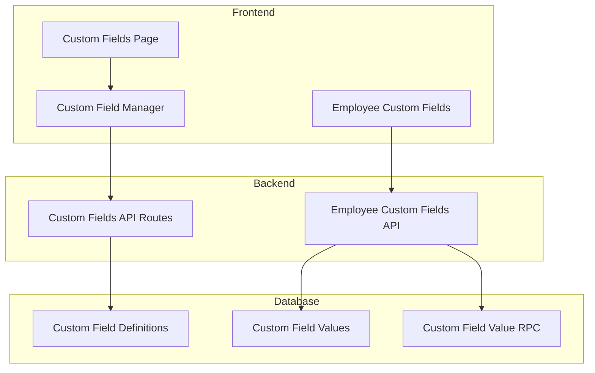
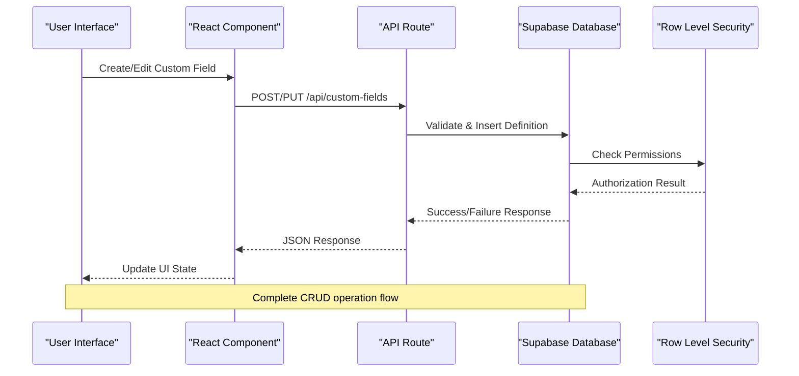
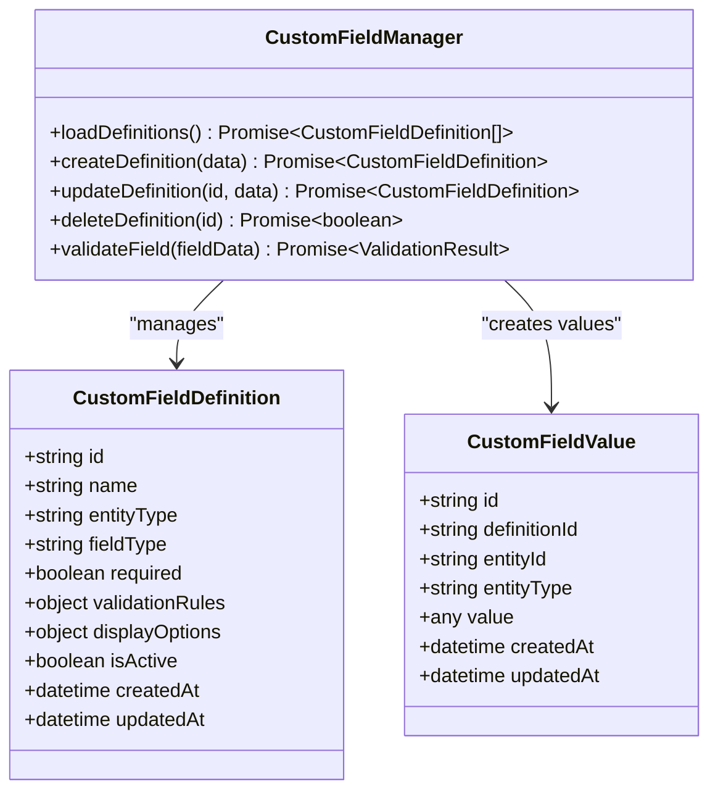
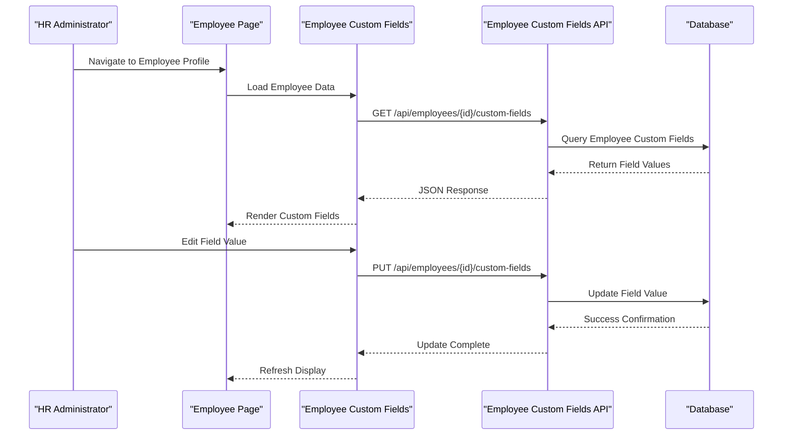
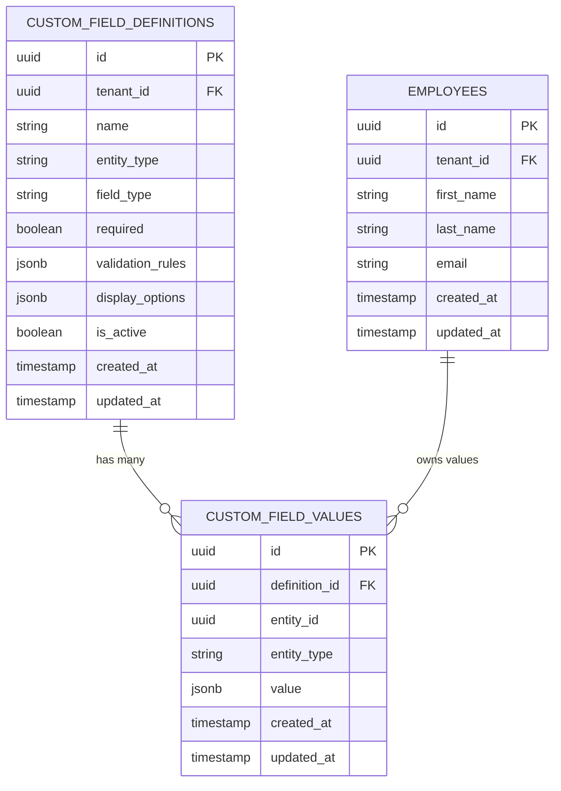
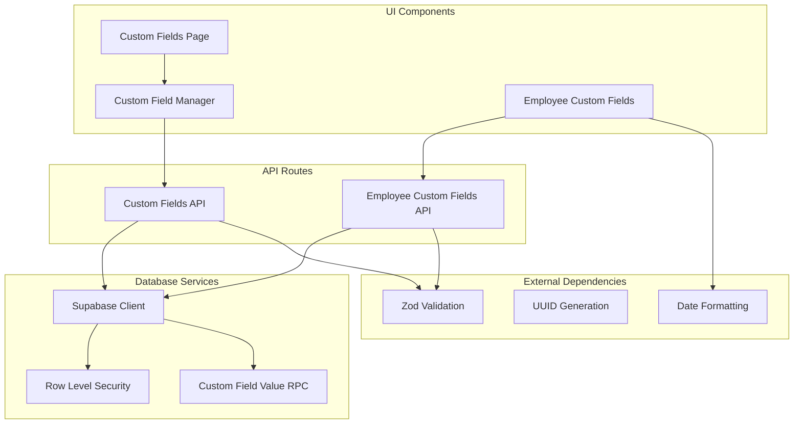

# Custom Fields System

<cite>
**Referenced Files in This Document**
- [custom-fields page](file://apps/hr-suite/app/(dashboard)/custom-fields/page.tsx)
- [Custom Field Manager Component](file://apps/hr-suite/components/custom-fields/custom-field-manager.tsx)
- [Employee Custom Fields Component](file://apps/hr-suite/components/custom-fields/employee-custom-fields.tsx)
- [Custom Fields API Route](file://apps/hr-suite/app/api/custom-fields/route.ts)
- [Custom Field Definition API Route](file://apps/hr-suite/app/api/custom-fields/[definitionId]/route.ts)
- [Employee Custom Fields API Route](file://apps/hr-suite/app/api/employees/[employeeId]/custom-fields/route.ts)
- [Custom Fields Database Migration](file://apps/hr-suite/supabase/migrations/20260715122802_add_custom_field_definitions.sql)
- [Custom Field Value RPC Migration](file://apps/hr-suite/supabase/migrations/20260715123119_add_custom_field_value_rpc.sql)
- [Custom Field Values Security Migration](file://apps/hr-suite/supabase/migrations/20260715123927_harden_custom_field_values.sql)
- [Custom Fields Seed Data](file://apps/hr-suite/supabase/migrations/20260715131230_seed_custom_fields_and_tenant_roles.sql)
- [Custom Fields Isolation Test](file://apps/hr-suite/supabase/tests/custom_fields_isolation.sql)
- [Custom Fields i18n Messages](file://apps/hr-suite/messages/en/customFields.json)
- [Custom Fields Requirements](file://docs/requirements/custom-fields/VRIJE_VELDEN.md)
</cite>

## Table of Contents
1. [Introduction](#introduction)
2. [Project Structure](#project-structure)
3. [Core Components](#core-components)
4. [Architecture Overview](#architecture-overview)
5. [Detailed Component Analysis](#detailed-component-analysis)
6. [Dependency Analysis](#dependency-analysis)
7. [Performance Considerations](#performance-considerations)
8. [Troubleshooting Guide](#troubleshooting-guide)
9. [Conclusion](#conclusion)

## Introduction
LiquidHR’s Custom Fields System provides a dynamic data modeling solution that allows organizations to extend the HR database schema without code changes. It supports defining custom fields for entities such as employees and employments, with flexible storage using a key-value pattern and robust validation rules. The system includes UI components for creating and managing field definitions, API routes for CRUD operations, and Row Level Security policies to ensure data isolation across tenants and users.

## Project Structure
The Custom Fields System is implemented across multiple layers:
- **UI Layer**: Dashboard pages and React components for user interaction
- **API Layer**: Next.js API routes handling business logic and data access
- **Database Layer**: Supabase migrations defining schema, indexes, and security policies
- **Testing Layer**: SQL tests validating isolation and security constraints

**Diagram sources**
- [custom-fields page](file://apps/hr-suite/app/(dashboard)/custom-fields/page.tsx)
- [Custom Field Manager Component](file://apps/hr-suite/components/custom-fields/custom-field-manager.tsx)
- [Custom Fields API Route](file://apps/hr-suite/app/api/custom-fields/route.ts)
- [Custom Fields Database Migration](file://apps/hr-suite/supabase/migrations/20260715122802_add_custom_field_definitions.sql)

**Section sources**
- [custom-fields page](file://apps/hr-suite/app/(dashboard)/custom-fields/page.tsx)
- [Custom Fields Requirements](file://docs/requirements/custom-fields/VRIJE_VELDEN.md)

## Core Components
The Custom Fields System consists of several key components:

### Field Definition Model
Custom field definitions support multiple data types including text, number, date, select, boolean, and email. Each definition includes metadata for validation rules, display options, and entity associations.

### Supported Field Types
- **Text**: Free-form string input with optional length validation
- **Number**: Numeric input with range validation and decimal precision
- **Date**: Calendar date picker with format validation
- **Select**: Dropdown selection from predefined options
- **Boolean**: True/false toggle with required validation
- **Email**: Email address validation with format checking

### Validation Rules
The system implements comprehensive validation including:
- Required field validation
- Format validation (email, URL, etc.)
- Range validation (min/max values)
- Length constraints (string length, character limits)
- Cross-field validation dependencies

**Section sources**
- [Custom Fields Database Migration](file://apps/hr-suite/supabase/migrations/20260715122802_add_custom_field_definitions.sql)
- [Custom Fields i18n Messages](file://apps/hr-suite/messages/en/customFields.json)

## Architecture Overview
The Custom Fields System follows a layered architecture pattern with clear separation of concerns:

**Diagram sources**
- [Custom Fields API Route](file://apps/hr-suite/app/api/custom-fields/route.ts)
- [Custom Fields Database Migration](file://apps/hr-suite/supabase/migrations/20260715122802_add_custom_field_definitions.sql)

## Detailed Component Analysis

### Custom Field Definition Management
The Custom Field Manager component provides a comprehensive interface for creating and managing field definitions. It handles form validation, type-specific inputs, and real-time preview of field behavior.

#### Class Diagram

**Diagram sources**
- [Custom Field Manager Component](file://apps/hr-suite/components/custom-fields/custom-field-manager.tsx)
- [Custom Fields Database Migration](file://apps/hr-suite/supabase/migrations/20260715122802_add_custom_field_definitions.sql)

### Employee Custom Fields Integration
The Employee Custom Fields component integrates custom field functionality into the employee profile interface, allowing HR administrators to manage employee-specific data dynamically.

#### Sequence Diagram

**Diagram sources**
- [Employee Custom Fields Component](file://apps/hr-suite/components/custom-fields/employee-custom-fields.tsx)
- [Employee Custom Fields API Route](file://apps/hr-suite/app/api/employees/[employeeId]/custom-fields/route.ts)

### Database Schema Design
The database schema uses a flexible key-value pattern for storing custom field values while maintaining referential integrity through foreign keys and proper indexing strategies.

#### Entity Relationship Diagram

**Diagram sources**
- [Custom Fields Database Migration](file://apps/hr-suite/supabase/migrations/20260715122802_add_custom_field_definitions.sql)
- [Custom Field Value RPC Migration](file://apps/hr-suite/supabase/migrations/20260715123119_add_custom_field_value_rpc.sql)

**Section sources**
- [Custom Field Manager Component](file://apps/hr-suite/components/custom-fields/custom-field-manager.tsx)
- [Employee Custom Fields Component](file://apps/hr-suite/components/custom-fields/employee-custom-fields.tsx)
- [Custom Fields Database Migration](file://apps/hr-suite/supabase/migrations/20260715122802_add_custom_field_definitions.sql)

## Dependency Analysis
The Custom Fields System has well-defined dependencies between components and external services:

**Diagram sources**
- [Custom Fields API Route](file://apps/hr-suite/app/api/custom-fields/route.ts)
- [Employee Custom Fields API Route](file://apps/hr-suite/app/api/employees/[employeeId]/custom-fields/route.ts)

**Section sources**
- [Custom Fields API Route](file://apps/hr-suite/app/api/custom-fields/route.ts)
- [Employee Custom Fields API Route](file://apps/hr-suite/app/api/employees/[employeeId]/custom-fields/route.ts)

## Performance Considerations
The Custom Fields System implements several performance optimization techniques:

### Indexing Strategy
- Composite indexes on tenant_id and entity_type for efficient filtering
- Partial indexes on active definitions to reduce query size
- JSONB GIN indexes for fast validation rule queries
- Foreign key indexes on definition_id and entity_id relationships

### Query Optimization
- Batch loading of custom field definitions per entity type
- Lazy loading of custom field values only when needed
- Caching of field definitions at the application level
- Efficient pagination for large datasets

### Storage Optimization
- JSONB storage for flexible value types
- Compression of large text values
- Archival of inactive field definitions
- Partitioning by tenant_id for multi-tenant scalability

## Troubleshooting Guide

### Common Issues and Solutions

#### Field Validation Errors
- **Issue**: Custom field validation fails during save operations
- **Solution**: Verify field type matches validation rules and check required field constraints
- **Debug Steps**: Review validation error messages and inspect field definition configuration

#### Data Access Problems
- **Issue**: Unable to read or write custom field values
- **Solution**: Check Row Level Security policies and user permissions
- **Debug Steps**: Verify tenant isolation and entity ownership

#### Performance Issues
- **Issue**: Slow loading of custom fields for large datasets
- **Solution**: Implement pagination and optimize database queries
- **Debug Steps**: Monitor query execution plans and identify bottlenecks

### Security Considerations
- **Tenant Isolation**: Ensure all queries include tenant_id filters
- **Input Validation**: Validate all custom field inputs against defined schemas
- **Access Control**: Implement proper authorization checks for field modifications
- **Data Sanitization**: Sanitize user inputs to prevent injection attacks

**Section sources**
- [Custom Fields Isolation Test](file://apps/hr-suite/supabase/tests/custom_fields_isolation.sql)
- [Custom Field Values Security Migration](file://apps/hr-suite/supabase/migrations/20260715123927_harden_custom_field_values.sql)

## Conclusion
The LiquidHR Custom Fields System provides a robust, scalable solution for extending HR database schemas dynamically. With its flexible field definition model, comprehensive validation framework, and secure multi-tenant architecture, it enables organizations to adapt their HR data structures without requiring code changes. The system's emphasis on performance optimization, security, and maintainability ensures it can handle enterprise-scale deployments while remaining easy to use and extend.

Key benefits include:
- **Flexibility**: Support for multiple field types and validation rules
- **Scalability**: Optimized database design and caching strategies
- **Security**: Comprehensive Row Level Security and tenant isolation
- **Maintainability**: Clear separation of concerns and modular architecture
- **Extensibility**: Easy addition of new field types and validation rules