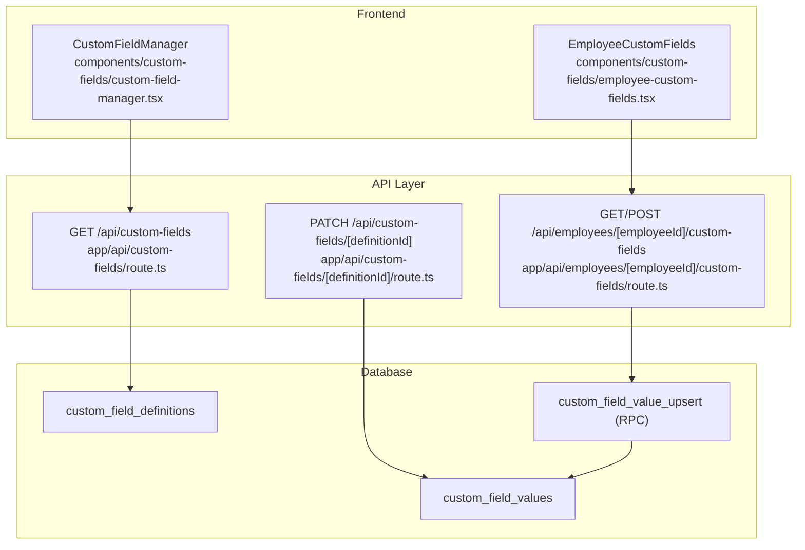
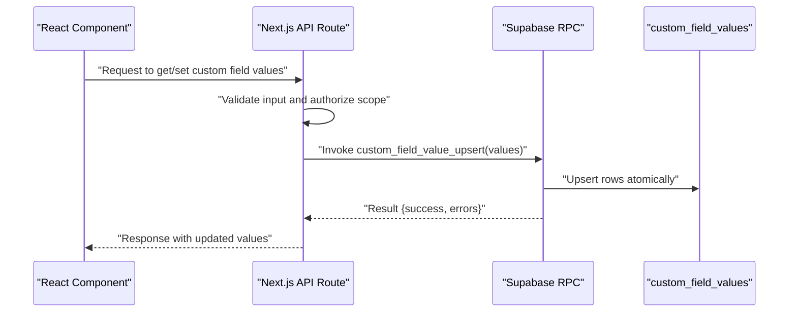
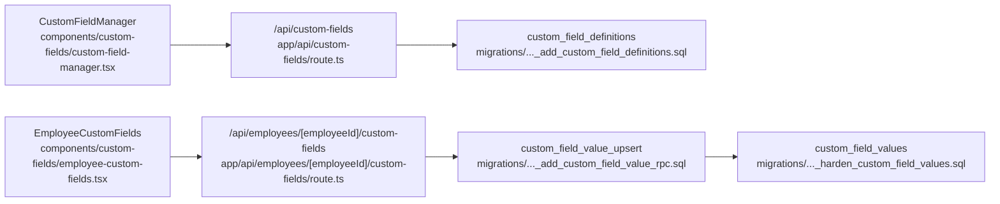

# Field Value Management

<cite>
**Referenced Files in This Document**
- [custom-fields/route.ts](file://apps/hr-suite/app/api/custom-fields/route.ts)
- [custom-fields/[definitionId]/route.ts](file://apps/hr-suite/app/api/custom-fields/[definitionId]/route.ts)
- [employees/[employeeId]/custom-fields/route.ts](file://apps/hr-suite/app/api/employees/[employeeId]/custom-fields/route.ts)
- [custom-field-manager.tsx](file://apps/hr-suite/components/custom-fields/custom-field-manager.tsx)
- [employee-custom-fields.tsx](file://apps/hr-suite/components/custom-fields/employee-custom-fields.tsx)
- [20260715122802_add_custom_field_definitions.sql](file://apps/hr-suite/supabase/migrations/20260715122802_add_custom_field_definitions.sql)
- [20260715123119_add_custom_field_value_rpc.sql](file://apps/hr-suite/supabase/migrations/20260715123119_add_custom_field_value_rpc.sql)
- [20260715123927_harden_custom_field_values.sql](file://apps/hr-suite/supabase/migrations/20260715123927_harden_custom_field_values.sql)
- [custom_fields_isolation.sql](file://apps/hr-suite/supabase/tests/custom_fields_isolation.sql)
</cite>

## Table of Contents
1. [Introduction](#introduction)
2. [Project Structure](#project-structure)
3. [Core Components](#core-components)
4. [Architecture Overview](#architecture-overview)
5. [Detailed Component Analysis](#detailed-component-analysis)
6. [Dependency Analysis](#dependency-analysis)
7. [Performance Considerations](#performance-considerations)
8. [Troubleshooting Guide](#troubleshooting-guide)
9. [Conclusion](#conclusion)

## Introduction
This document explains how custom field values are stored and retrieved across the application using a flexible key-value storage pattern. It covers:
- The database schema for custom field definitions and values
- Serialization and deserialization of different data types
- API endpoints for reading and writing custom field values, including batch operations and transaction handling
- Examples of accessing custom field values from React components and server-side code
- Database query patterns and indexing strategies
- Performance considerations such as caching and query optimization

## Project Structure
Custom fields functionality spans UI components, Next.js API routes, and Supabase migrations:
- API routes expose endpoints for managing custom field definitions and values
- React components provide user interfaces for editing and displaying custom fields
- SQL migrations define tables, functions, and policies that enforce isolation and performance

**Diagram sources**
- [custom-field-manager.tsx](file://apps/hr-suite/components/custom-fields/custom-field-manager.tsx)
- [employee-custom-fields.tsx](file://apps/hr-suite/components/custom-fields/employee-custom-fields.tsx)
- [custom-fields/route.ts](file://apps/hr-suite/app/api/custom-fields/route.ts)
- [custom-fields/[definitionId]/route.ts](file://apps/hr-suite/app/api/custom-fields/[definitionId]/route.ts)
- [employees/[employeeId]/custom-fields/route.ts](file://apps/hr-suite/app/api/employees/[employeeId]/custom-fields/route.ts)
- [20260715122802_add_custom_field_definitions.sql](file://apps/hr-suite/supabase/migrations/20260715122802_add_custom_field_definitions.sql)
- [20260715123119_add_custom_field_value_rpc.sql](file://apps/hr-suite/supabase/migrations/20260715123119_add_custom_field_value_rpc.sql)

**Section sources**
- [custom-fields/route.ts](file://apps/hr-suite/app/api/custom-fields/route.ts)
- [custom-fields/[definitionId]/route.ts](file://apps/hr-suite/app/api/custom-fields/[definitionId]/route.ts)
- [employees/[employeeId]/custom-fields/route.ts](file://apps/hr-suite/app/api/employees/[employeeId]/custom-fields/route.ts)
- [custom-field-manager.tsx](file://apps/hr-suite/components/custom-fields/custom-field-manager.tsx)
- [employee-custom-fields.tsx](file://apps/hr-suite/components/custom-fields/employee-custom-fields.tsx)
- [20260715122802_add_custom_field_definitions.sql](file://apps/hr-suite/supabase/migrations/20260715122802_add_custom_field_definitions.sql)
- [20260715123119_add_custom_field_value_rpc.sql](file://apps/hr-suite/supabase/migrations/20260715123119_add_custom_field_value_rpc.sql)

## Core Components
- Custom field definitions table stores metadata about each field (name, type, validation rules).
- Custom field values table stores serialized key-value pairs linked to a target entity (e.g., employee).
- An RPC function provides atomic upsert behavior for value writes, supporting batch operations within a single transaction.
- API routes validate inputs, enforce tenant isolation, and delegate persistence to the database layer.

Key responsibilities:
- Definitions management: list, create, update, delete field schemas
- Values management: read by entity and definition, write via upsert or batch upsert
- Type serialization: JSON-safe representation for strings, numbers, booleans, dates, arrays, objects
- Authorization: ensure requests are scoped to the correct tenant and entity

**Section sources**
- [20260715122802_add_custom_field_definitions.sql](file://apps/hr-suite/supabase/migrations/20260715122802_add_custom_field_definitions.sql)
- [20260715123119_add_custom_field_value_rpc.sql](file://apps/hr-suite/supabase/migrations/20260715123119_add_custom_field_value_rpc.sql)
- [20260715123927_harden_custom_field_values.sql](file://apps/hr-suite/supabase/migrations/20260715123927_harden_custom_field_values.sql)

## Architecture Overview
The system follows a layered architecture:
- Frontend components call Next.js API routes
- API routes perform validation and authorization checks
- Database functions handle persistence with strong consistency and isolation

**Diagram sources**
- [employees/[employeeId]/custom-fields/route.ts](file://apps/hr-suite/app/api/employees/[employeeId]/custom-fields/route.ts)
- [20260715123119_add_custom_field_value_rpc.sql](file://apps/hr-suite/supabase/migrations/20260715123119_add_custom_field_value_rpc.sql)

## Detailed Component Analysis

### API Endpoints
- GET /api/custom-fields
  - Purpose: List available custom field definitions for the current tenant
  - Behavior: Returns definitions with type and validation metadata
- PATCH /api/custom-fields/[definitionId]
  - Purpose: Update a specific custom field definition
  - Behavior: Validates changes and persists updates
- GET /api/employees/[employeeId]/custom-fields
  - Purpose: Retrieve all custom field values for an employee
  - Behavior: Returns a map keyed by definitionId to serialized values
- POST /api/employees/[employeeId]/custom-fields
  - Purpose: Batch upsert custom field values for an employee
  - Behavior: Accepts an array of {definitionId, value} entries; performs atomic upsert via RPC

Input validation and error handling:
- Validate definitionId exists and belongs to the tenant
- Validate value against field type and constraints
- Return structured errors for invalid payloads

Batch operations and transactions:
- Batch writes use a single RPC call to ensure atomicity
- Partial failures return per-entry errors while preserving successful writes

**Section sources**
- [custom-fields/route.ts](file://apps/hr-suite/app/api/custom-fields/route.ts)
- [custom-fields/[definitionId]/route.ts](file://apps/hr-suite/app/api/custom-fields/[definitionId]/route.ts)
- [employees/[employeeId]/custom-fields/route.ts](file://apps/hr-suite/app/api/employees/[employeeId]/custom-fields/route.ts)

### Data Model and Serialization
- custom_field_definitions: defines field name, type, required flag, and validation rules
- custom_field_values: stores serialized values as JSON alongside entity identifiers and definitionId
- Serialization strategy:
  - Strings, numbers, booleans: direct JSON encoding
  - Dates: ISO string format
  - Arrays and objects: nested JSON structures
  - Null values: explicitly stored to support clearing fields

Deserialization on read:
- API returns typed values based on definition metadata
- Client components receive consistent types regardless of storage format

**Section sources**
- [20260715122802_add_custom_field_definitions.sql](file://apps/hr-suite/supabase/migrations/20260715122802_add_custom_field_definitions.sql)
- [20260715123119_add_custom_field_value_rpc.sql](file://apps/hr-suite/supabase/migrations/20260715123119_add_custom_field_value_rpc.sql)

### React Components
- CustomFieldManager: manages CRUD operations for custom field definitions
  - Fetches definitions via GET endpoint
  - Submits updates via PATCH endpoint
- EmployeeCustomFields: displays and edits custom field values for employees
  - Loads values via GET endpoint
  - Submits batch updates via POST endpoint

Usage examples:
- Reading values: call GET endpoint with employeeId, then render values mapped by definitionId
- Writing values: collect form inputs into an array of {definitionId, value}, send via POST endpoint

**Section sources**
- [custom-field-manager.tsx](file://apps/hr-suite/components/custom-fields/custom-field-manager.tsx)
- [employee-custom-fields.tsx](file://apps/hr-suite/components/custom-fields/employee-custom-fields.tsx)

### Database Functions and Policies
- custom_field_value_upsert: accepts an array of value entries and performs atomic upserts
- Row-level security policies ensure tenant isolation and entity scoping
- Indexes optimize lookups by entity and definitionId

Transaction handling:
- Single RPC call encapsulates multiple row operations
- Ensures consistency even under concurrent writes

**Section sources**
- [20260715123119_add_custom_field_value_rpc.sql](file://apps/hr-suite/supabase/migrations/20260715123119_add_custom_field_value_rpc.sql)
- [20260715123927_harden_custom_field_values.sql](file://apps/hr-suite/supabase/migrations/20260715123927_harden_custom_field_values.sql)

## Dependency Analysis
The following diagram shows dependencies between components, API routes, and database layers:

**Diagram sources**
- [custom-field-manager.tsx](file://apps/hr-suite/components/custom-fields/custom-field-manager.tsx)
- [employee-custom-fields.tsx](file://apps/hr-suite/components/custom-fields/employee-custom-fields.tsx)
- [custom-fields/route.ts](file://apps/hr-suite/app/api/custom-fields/route.ts)
- [employees/[employeeId]/custom-fields/route.ts](file://apps/hr-suite/app/api/employees/[employeeId]/custom-fields/route.ts)
- [20260715122802_add_custom_field_definitions.sql](file://apps/hr-suite/supabase/migrations/20260715122802_add_custom_field_definitions.sql)
- [20260715123119_add_custom_field_value_rpc.sql](file://apps/hr-suite/supabase/migrations/20260715123119_add_custom_field_value_rpc.sql)
- [20260715123927_harden_custom_field_values.sql](file://apps/hr-suite/supabase/migrations/20260715123927_harden_custom_field_values.sql)

**Section sources**
- [custom-fields/route.ts](file://apps/hr-suite/app/api/custom-fields/route.ts)
- [employees/[employeeId]/custom-fields/route.ts](file://apps/hr-suite/app/api/employees/[employeeId]/custom-fields/route.ts)
- [20260715122802_add_custom_field_definitions.sql](file://apps/hr-suite/supabase/migrations/20260715122802_add_custom_field_definitions.sql)
- [20260715123119_add_custom_field_value_rpc.sql](file://apps/hr-suite/supabase/migrations/20260715123119_add_custom_field_value_rpc.sql)
- [20260715123927_harden_custom_field_values.sql](file://apps/hr-suite/supabase/migrations/20260715123927_harden_custom_field_values.sql)

## Performance Considerations
Indexing strategies:
- Composite indexes on (entity_id, definition_id) for fast reads and upserts
- Index on definition_id for efficient filtering when listing values by field
- Partitioning by tenant_id if dataset grows significantly

Query optimization:
- Use batch upsert RPC to minimize round-trips and ensure atomicity
- Select only necessary fields when reading large sets of values
- Leverage definition metadata to avoid unnecessary deserialization

Caching patterns:
- Client-side cache for frequently accessed definitions (e.g., memoization)
- Server-side cache for common employee value maps with short TTL
- Invalidate caches on mutations to maintain consistency

Concurrency and contention:
- Atomic upsert prevents race conditions during concurrent writes
- Monitor lock contention on high-write scenarios and consider sharding by tenant

[No sources needed since this section provides general guidance]

## Troubleshooting Guide
Common issues and resolutions:
- Invalid definitionId: Ensure the definition exists and belongs to the tenant
- Type mismatch: Validate value against definition type before sending to API
- Tenant isolation errors: Confirm request context includes correct tenant scope
- Partial batch failures: Inspect per-entry errors returned by the RPC function

Debugging steps:
- Log request payloads and responses at API layer
- Verify RPC function execution logs for database errors
- Check row-level security policies for access denials

**Section sources**
- [custom-fields/route.ts](file://apps/hr-suite/app/api/custom-fields/route.ts)
- [employees/[employeeId]/custom-fields/route.ts](file://apps/hr-suite/app/api/employees/[employeeId]/custom-fields/route.ts)
- [20260715123119_add_custom_field_value_rpc.sql](file://apps/hr-suite/supabase/migrations/20260715123119_add_custom_field_value_rpc.sql)
- [custom_fields_isolation.sql](file://apps/hr-suite/supabase/tests/custom_fields_isolation.sql)

## Conclusion
The custom field system provides a flexible, scalable approach to storing and retrieving dynamic data through a key-value pattern backed by robust database functions and clear API contracts. By leveraging batch operations, atomic transactions, and strategic indexing, the system ensures performance and reliability. Proper validation, authorization, and caching further enhance usability and efficiency across frontend and backend layers.

[No sources needed since this section summarizes without analyzing specific files]