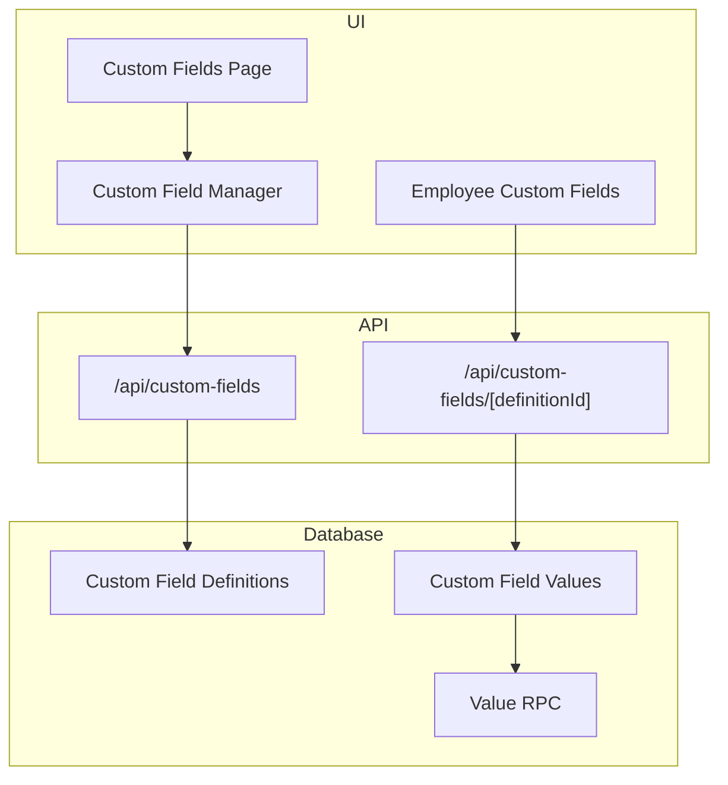
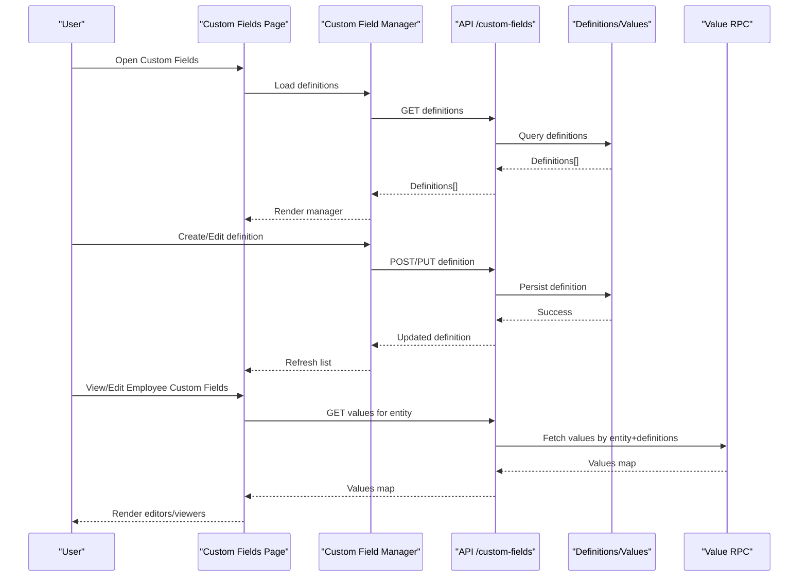
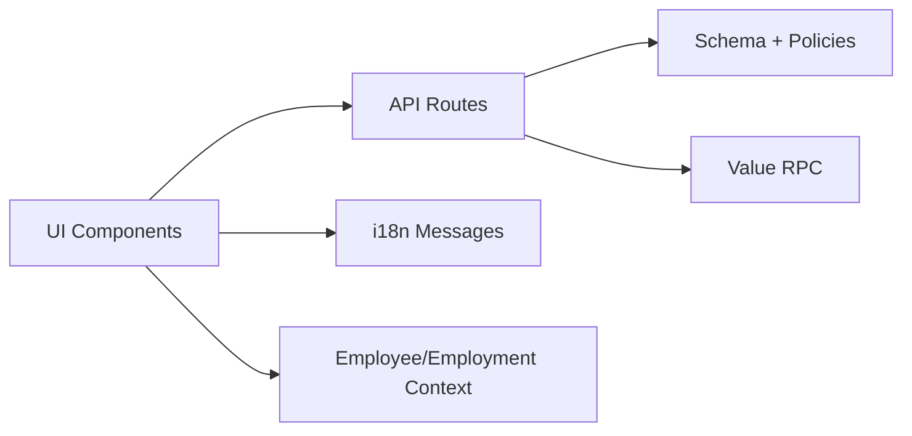

# Integration Patterns

<cite>
**Referenced Files in This Document**
- [custom-fields/page.tsx](file://apps/hr-suite/app/(dashboard)/custom-fields/page.tsx)
- [custom-field-manager.tsx](file://apps/hr-suite/components/custom-fields/custom-field-manager.tsx)
- [employee-custom-fields.tsx](file://apps/hr-suite/components/custom-fields/employee-custom-fields.tsx)
- [route.ts](file://apps/hr-suite/app/api/custom-fields/route.ts)
- [route.ts](file://apps/hr-suite/app/api/custom-fields/[definitionId]/route.ts)
- [20260715122802_add_custom_field_definitions.sql](file://apps/hr-suite/supabase/migrations/20260715122802_add_custom_field_definitions.sql)
- [20260715123119_add_custom_field_value_rpc.sql](file://apps/hr-suite/supabase/migrations/20260715123119_add_custom_field_value_rpc.sql)
- [20260715123639_harden_custom_field_values.sql](file://apps/hr-suite/supabase/migrations/20260715123639_harden_custom_field_values.sql)
- [20260715131230_seed_custom_fields_and_tenant_roles.sql](file://apps/hr-suite/supabase/migrations/20260715131230_seed_custom_fields_and_tenant_roles.sql)
- [customFields.json](file://apps/hr-suite/messages/en/customFields.json)
- [VRIJE_VELDEN.md](file://docs/requirements/custom-fields/VRIJE_VELDEN.md)
</cite>

## Table of Contents
1. [Introduction](#introduction)
2. [Project Structure](#project-structure)
3. [Core Components](#core-components)
4. [Architecture Overview](#architecture-overview)
5. [Detailed Component Analysis](#detailed-component-analysis)
6. [Dependency Analysis](#dependency-analysis)
7. [Performance Considerations](#performance-considerations)
8. [Troubleshooting Guide](#troubleshooting-guide)
9. [Conclusion](#conclusion)
10. [Appendices](#appendices)

## Introduction
This document explains how to integrate custom fields throughout the LiquidHR application. It covers displaying custom field values in employee profiles, forms, and reports; composing components for dynamic field types; implementing custom field editors; formatting values; handling dependencies; real-time updates; form validation integration; accessibility considerations; and patterns for extending existing components and creating reusable custom field components.

## Project Structure
Custom fields are implemented across UI pages, API routes, database migrations, and i18n messages:
- Dashboard page for managing custom fields
- API routes for CRUD operations on definitions and values
- Database schema and RPCs for storing and retrieving values
- UI components for editing and rendering custom fields
- Internationalization messages for labels and help text

**Diagram sources**
- [custom-fields/page.tsx](file://apps/hr-suite/app/(dashboard)/custom-fields/page.tsx)
- [custom-field-manager.tsx](file://apps/hr-suite/components/custom-fields/custom-field-manager.tsx)
- [employee-custom-fields.tsx](file://apps/hr-suite/components/custom-fields/employee-custom-fields.tsx)
- [route.ts](file://apps/hr-suite/app/api/custom-fields/route.ts)
- [route.ts](file://apps/hr-suite/app/api/custom-fields/[definitionId]/route.ts)
- [20260715122802_add_custom_field_definitions.sql](file://apps/hr-suite/supabase/migrations/20260715122802_add_custom_field_definitions.sql)
- [20260715123119_add_custom_field_value_rpc.sql](file://apps/hr-suite/supabase/migrations/20260715123119_add_custom_field_value_rpc.sql)
- [20260715123639_harden_custom_field_values.sql](file://apps/hr-suite/supabase/migrations/20260715123639_harden_custom_field_values.sql)

**Section sources**
- [custom-fields/page.tsx](file://apps/hr-suite/app/(dashboard)/custom-fields/page.tsx)
- [custom-field-manager.tsx](file://apps/hr-suite/components/custom-fields/custom-field-manager.tsx)
- [employee-custom-fields.tsx](file://apps/hr-suite/components/custom-fields/employee-custom-fields.tsx)
- [route.ts](file://apps/hr-suite/app/api/custom-fields/route.ts)
- [route.ts](file://apps/hr-suite/app/api/custom-fields/[definitionId]/route.ts)
- [20260715122802_add_custom_field_definitions.sql](file://apps/hr-suite/supabase/migrations/20260715122802_add_custom_field_definitions.sql)
- [20260715123119_add_custom_field_value_rpc.sql](file://apps/hr-suite/supabase/migrations/20260715123119_add_custom_field_value_rpc.sql)
- [20260715123639_harden_custom_field_values.sql](file://apps/hr-suite/supabase/migrations/20260715123639_harden_custom_field_values.sql)

## Core Components
- Custom Fields Page: Entry point for defining and organizing custom fields within the dashboard.
- Custom Field Manager: Orchestrates creation, editing, ordering, and deletion of custom field definitions.
- Employee Custom Fields: Renders editable or read-only custom fields for an employee context.
- API Routes: Provide endpoints to list/create/update/delete custom field definitions and to get/set values scoped by entity and definition.
- Database Migrations: Define tables for definitions and values, plus an RPC for efficient value retrieval.

Key responsibilities:
- Definition lifecycle management (CRUD)
- Value persistence per entity (e.g., employee)
- Rendering based on field type metadata
- Validation and dependency resolution at edit time
- i18n support for labels and hints

**Section sources**
- [custom-fields/page.tsx](file://apps/hr-suite/app/(dashboard)/custom-fields/page.tsx)
- [custom-field-manager.tsx](file://apps/hr-suite/components/custom-fields/custom-field-manager.tsx)
- [employee-custom-fields.tsx](file://apps/hr-suite/components/custom-fields/employee-custom-fields.tsx)
- [route.ts](file://apps/hr-suite/app/api/custom-fields/route.ts)
- [route.ts](file://apps/hr-suite/app/api/custom-fields/[definitionId]/route.ts)
- [20260715122802_add_custom_field_definitions.sql](file://apps/hr-suite/supabase/migrations/20260715122802_add_custom_field_definitions.sql)
- [20260715123119_add_custom_field_value_rpc.sql](file://apps/hr-suite/supabase/migrations/20260715123119_add_custom_field_value_rpc.sql)
- [20260715123639_harden_custom_field_values.sql](file://apps/hr-suite/supabase/migrations/20260715123639_harden_custom_field_values.sql)

## Architecture Overview
The custom fields system follows a data-driven pattern:
- Definitions describe field metadata (type, label, options, visibility, dependencies).
- Values store typed payloads linked to a target entity and definition.
- UI components render editors or viewers based on definition metadata.
- API routes enforce tenant isolation and authorization.
- An RPC provides optimized reads for value sets.

**Diagram sources**
- [custom-fields/page.tsx](file://apps/hr-suite/app/(dashboard)/custom-fields/page.tsx)
- [custom-field-manager.tsx](file://apps/hr-suite/components/custom-fields/custom-field-manager.tsx)
- [employee-custom-fields.tsx](file://apps/hr-suite/components/custom-fields/employee-custom-fields.tsx)
- [route.ts](file://apps/hr-suite/app/api/custom-fields/route.ts)
- [route.ts](file://apps/hr-suite/app/api/custom-fields/[definitionId]/route.ts)
- [20260715123119_add_custom_field_value_rpc.sql](file://apps/hr-suite/supabase/migrations/20260715123119_add_custom_field_value_rpc.sql)

## Detailed Component Analysis

### Custom Fields Page
Purpose:
- Provides the entry point for administrators to manage custom field definitions.
- Delegates heavy lifting to the Custom Field Manager component.

Integration points:
- Calls API routes to fetch and persist definitions.
- Uses i18n keys from customFields.json for labels and descriptions.

Best practices:
- Keep the page lightweight; delegate state and actions to the manager.
- Use optimistic updates where possible to improve perceived performance.

**Section sources**
- [custom-fields/page.tsx](file://apps/hr-suite/app/(dashboard)/custom-fields/page.tsx)
- [customFields.json](file://apps/hr-suite/messages/en/customFields.json)

### Custom Field Manager
Responsibilities:
- List, create, update, and delete custom field definitions.
- Manage field ordering and visibility toggles.
- Validate inputs against schema constraints.
- Emit events for parent components to refresh data.

Component composition:
- Reusable editor dialog for definition properties.
- Conditional rendering of advanced options based on field type.

Validation and dependencies:
- Enforce required fields and uniqueness.
- Surface dependency rules when editing dependent fields.

Accessibility:
- Ensure keyboard navigation and screen reader announcements for dynamic lists.

**Section sources**
- [custom-field-manager.tsx](file://apps/hr-suite/components/custom-fields/custom-field-manager.tsx)
- [customFields.json](file://apps/hr-suite/messages/en/customFields.json)

### Employee Custom Fields
Rendering modes:
- Edit mode: renders appropriate editors per field type with validation feedback.
- View mode: formats values according to field type (dates, booleans, enums, etc.).

Data flow:
- Loads values via API using entity identifiers and requested definitions.
- Supports partial updates and real-time synchronization if enabled.

Dependencies:
- Hides or disables fields based on other field values or global settings.
- Recomputes availability when dependencies change.

Accessibility:
- Associates labels with inputs, provides error messages, and ensures focus management.

**Section sources**
- [employee-custom-fields.tsx](file://apps/hr-suite/components/custom-fields/employee-custom-fields.tsx)
- [customFields.json](file://apps/hr-suite/messages/en/customFields.json)

### API Routes: Definitions and Values
Endpoints:
- /api/custom-fields: CRUD for definitions with tenant scoping.
- /api/custom-fields/[definitionId]: Get or update specific definition; also used to fetch values for a given definition scope.

Security:
- Enforces tenant isolation and role-based access control.
- Validates payloads against expected schemas.

Error handling:
- Returns consistent error codes and messages for client-side handling.

**Section sources**
- [route.ts](file://apps/hr-suite/app/api/custom-fields/route.ts)
- [route.ts](file://apps/hr-suite/app/api/custom-fields/[definitionId]/route.ts)

### Database Schema and RPCs
Tables:
- Custom field definitions: stores metadata such as type, label, options, visibility, and dependencies.
- Custom field values: stores typed values linked to a target entity and definition.

RPC:
- Optimized function to retrieve multiple values for a set of definitions and an entity.

Constraints:
- Tenant isolation enforced at row level.
- Type safety for value payloads.

**Section sources**
- [20260715122802_add_custom_field_definitions.sql](file://apps/hr-suite/supabase/migrations/20260715122802_add_custom_field_definitions.sql)
- [20260715123119_add_custom_field_value_rpc.sql](file://apps/hr-suite/supabase/migrations/20260715123119_add_custom_field_value_rpc.sql)
- [20260715123639_harden_custom_field_values.sql](file://apps/hr-suite/supabase/migrations/20260715123639_harden_custom_field_values.sql)
- [20260715131230_seed_custom_fields_and_tenant_roles.sql](file://apps/hr-suite/supabase/migrations/20260715131230_seed_custom_fields_and_tenant_roles.sql)

### i18n Messages
Messages:
- Labels, placeholders, and help texts for custom fields are localized through customFields.json.

Usage:
- All UI components should consume these keys to ensure consistent localization.

**Section sources**
- [customFields.json](file://apps/hr-suite/messages/en/customFields.json)

## Dependency Analysis
Custom fields depend on:
- API layer for persistence and authorization
- Database schema and RPC for efficient reads/writes
- i18n resources for user-facing text
- Existing employee and employment contexts for scoping values

**Diagram sources**
- [custom-field-manager.tsx](file://apps/hr-suite/components/custom-fields/custom-field-manager.tsx)
- [employee-custom-fields.tsx](file://apps/hr-suite/components/custom-fields/employee-custom-fields.tsx)
- [route.ts](file://apps/hr-suite/app/api/custom-fields/route.ts)
- [route.ts](file://apps/hr-suite/app/api/custom-fields/[definitionId]/route.ts)
- [20260715122802_add_custom_field_definitions.sql](file://apps/hr-suite/supabase/migrations/20260715122802_add_custom_field_definitions.sql)
- [20260715123119_add_custom_field_value_rpc.sql](file://apps/hr-suite/supabase/migrations/20260715123119_add_custom_field_value_rpc.sql)
- [customFields.json](file://apps/hr-suite/messages/en/customFields.json)

**Section sources**
- [custom-field-manager.tsx](file://apps/hr-suite/components/custom-fields/custom-field-manager.tsx)
- [employee-custom-fields.tsx](file://apps/hr-suite/components/custom-fields/employee-custom-fields.tsx)
- [route.ts](file://apps/hr-suite/app/api/custom-fields/route.ts)
- [route.ts](file://apps/hr-suite/app/api/custom-fields/[definitionId]/route.ts)
- [20260715122802_add_custom_field_definitions.sql](file://apps/hr-suite/supabase/migrations/20260715122802_add_custom_field_definitions.sql)
- [20260715123119_add_custom_field_value_rpc.sql](file://apps/hr-suite/supabase/migrations/20260715123119_add_custom_field_value_rpc.sql)
- [customFields.json](file://apps/hr-suite/messages/en/customFields.json)

## Performance Considerations
- Batch value reads using the provided RPC to minimize round trips.
- Cache definition metadata client-side to avoid repeated fetches.
- Use optimistic UI updates for edits to improve responsiveness.
- Debounce input changes in editors to reduce unnecessary writes.
- Limit visible fields per view to reduce rendering overhead.

[No sources needed since this section provides general guidance]

## Troubleshooting Guide
Common issues:
- Missing values: Verify entity scoping and definition IDs passed to the API.
- Authorization errors: Confirm tenant isolation and user roles.
- Validation failures: Check field-specific constraints and dependency rules.
- i18n missing: Ensure message keys exist in customFields.json.

Debugging steps:
- Inspect API responses for errors and status codes.
- Validate payload shapes against expected schemas.
- Review database policies and RPC behavior for anomalies.

**Section sources**
- [route.ts](file://apps/hr-suite/app/api/custom-fields/route.ts)
- [route.ts](file://apps/hr-suite/app/api/custom-fields/[definitionId]/route.ts)
- [customFields.json](file://apps/hr-suite/messages/en/customFields.json)

## Conclusion
LiquidHR’s custom fields system is designed around a clear separation of concerns: definitions drive rendering and behavior, values are persisted securely with tenant isolation, and the UI composes reusable components that adapt to field types. By following the patterns outlined here—data-driven rendering, robust validation, dependency handling, and accessible UX—you can extend LiquidHR with flexible, maintainable custom fields across profiles, forms, and reports.

[No sources needed since this section summarizes without analyzing specific files]

## Appendices

### Best Practices for Component Composition
- Encapsulate field editors in small, type-specific components.
- Compose higher-level editors by combining primitives (text, select, date, boolean).
- Centralize validation logic near the editor and surface errors consistently.
- Use dependency metadata to compute visibility and enablement dynamically.

[No sources needed since this section provides general guidance]

### Real-Time Updates
- Subscribe to relevant changes via server events or polling where applicable.
- Invalidate caches on successful mutations to keep UI in sync.
- Debounce frequent updates to avoid excessive re-renders.

[No sources needed since this section provides general guidance]

### Accessibility Checklist
- Associate labels with inputs and provide descriptive aria attributes.
- Announce validation errors clearly and associate them with inputs.
- Ensure keyboard navigability and logical tab order.
- Provide sufficient color contrast and readable typography.

[No sources needed since this section provides general guidance]

### Extending Existing Components
- Integrate custom fields into employee profiles by injecting editors/viewers based on definition metadata.
- Extend forms by registering field components keyed by type.
- Support reports by mapping field values to display formats and filters.

[No sources needed since this section provides general guidance]

### Requirements Reference
For detailed requirements and design decisions related to custom fields, refer to the dedicated requirements document.

**Section sources**
- [VRIJE_VELDEN.md](file://docs/requirements/custom-fields/VRIJE_VELDEN.md)