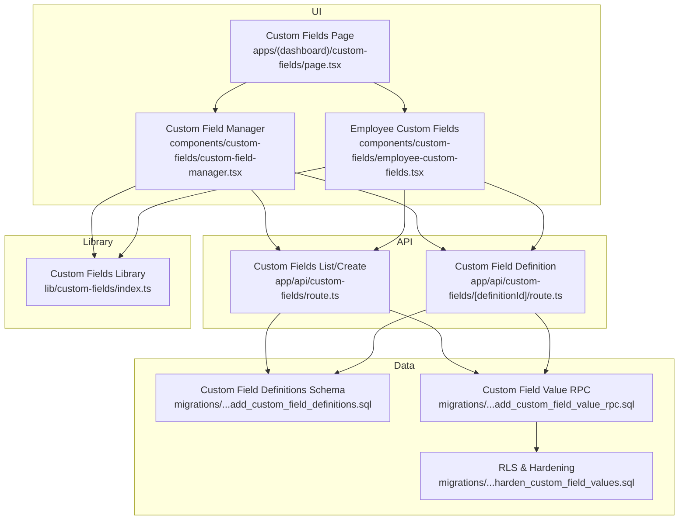
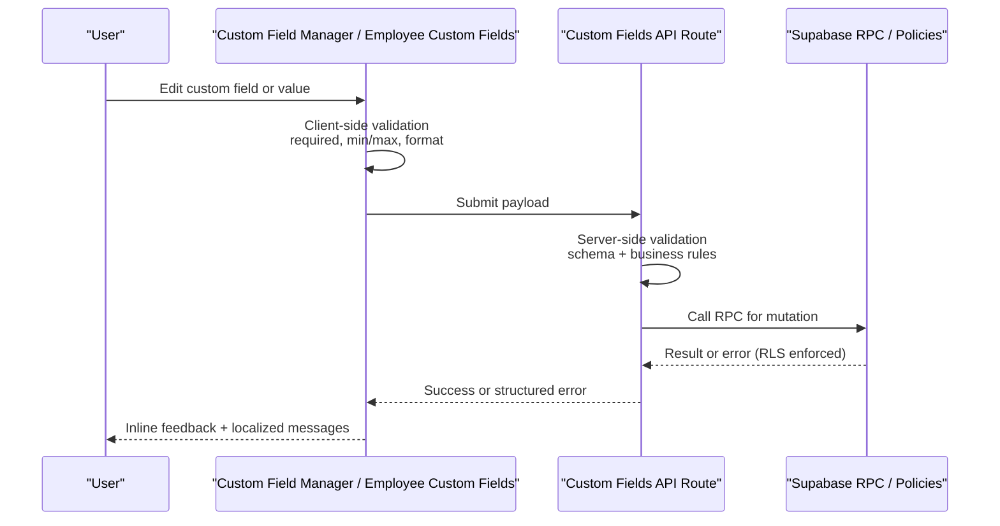
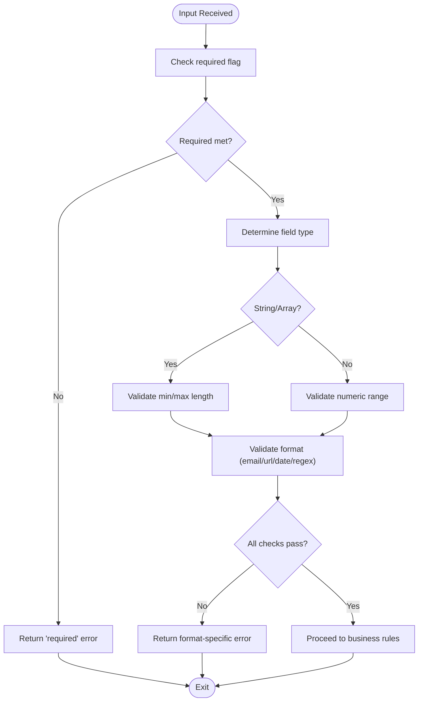
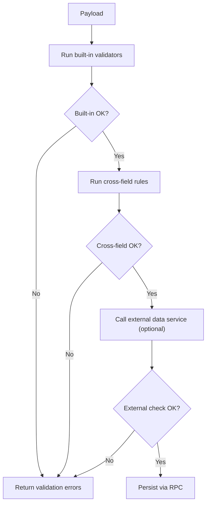
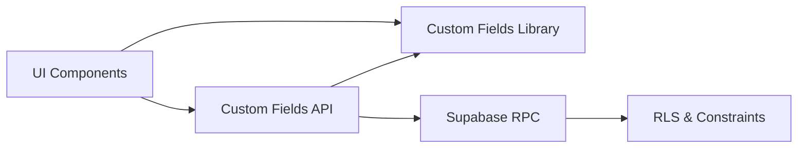

# Validation and Business Rules

<cite>
**Referenced Files in This Document**
- [custom-fields/page.tsx](file://apps/hr-suite/app/(dashboard)/custom-fields/page.tsx)
- [api/custom-fields/route.ts](file://apps/hr-suite/app/api/custom-fields/route.ts)
- [api/custom-fields/[definitionId]/route.ts](file://apps/hr-suite/app/api/custom-fields/[definitionId]/route.ts)
- [components/custom-fields/custom-field-manager.tsx](file://apps/hr-suite/components/custom-fields/custom-field-manager.tsx)
- [components/custom-fields/employee-custom-fields.tsx](file://apps/hr-suite/components/custom-fields/employee-custom-fields.tsx)
- [lib/custom-fields/index.ts](file://apps/hr-suite/lib/custom-fields/index.ts)
- [messages/en/validation.json](file://apps/hr-suite/messages/en/validation.json)
- [messages/nl/validation.json](file://apps/hr-suite/messages/nl/validation.json)
- [supabase/migrations/20260715122802_add_custom_field_definitions.sql](file://apps/hr-suite/supabase/migrations/20260715122802_add_custom_field_definitions.sql)
- [supabase/migrations/20260715123119_add_custom_field_value_rpc.sql](file://apps/hr-suite/supabase/migrations/20260715123119_add_custom_field_value_rpc.sql)
- [supabase/migrations/20260715123927_harden_custom_field_values.sql](file://apps/hr-suite/supabase/migrations/20260715123927_harden_custom_field_values.sql)
</cite>

## Table of Contents
1. Introduction
2. Project Structure
3. Core Components
4. Architecture Overview
5. Detailed Component Analysis
6. Dependency Analysis
7. Performance Considerations
8. Troubleshooting Guide
9. Conclusion

## Introduction
This document explains the validation framework for custom fields across client and server layers, covering built-in validators (required, min/max length, format), custom validation logic, cross-field business rules, external data source integration, error handling strategies, localization, user feedback patterns, and security considerations such as input sanitization, SQL injection prevention, and authorization checks for custom field modifications.

## Project Structure
Custom fields are implemented with:
- UI pages and components for authoring and editing custom field definitions and values
- API routes for CRUD operations on custom field definitions and values
- Library utilities for shared validation and formatting
- i18n message files for localized validation messages
- Database migrations defining schemas, constraints, and RPCs that enforce validation at the data layer

**Diagram sources**
- [custom-fields/page.tsx](file://apps/hr-suite/app/(dashboard)/custom-fields/page.tsx)
- [api/custom-fields/route.ts](file://apps/hr-suite/app/api/custom-fields/route.ts)
- [api/custom-fields/[definitionId]/route.ts](file://apps/hr-suite/app/api/custom-fields/[definitionId]/route.ts)
- [components/custom-fields/custom-field-manager.tsx](file://apps/hr-suite/components/custom-fields/custom-field-manager.tsx)
- [components/custom-fields/employee-custom-fields.tsx](file://apps/hr-suite/components/custom-fields/employee-custom-fields.tsx)
- [lib/custom-fields/index.ts](file://apps/hr-suite/lib/custom-fields/index.ts)
- [supabase/migrations/20260715122802_add_custom_field_definitions.sql](file://apps/hr-suite/supabase/migrations/20260715122802_add_custom_field_definitions.sql)
- [supabase/migrations/20260715123119_add_custom_field_value_rpc.sql](file://apps/hr-suite/supabase/migrations/20260715123119_add_custom_field_value_rpc.sql)
- [supabase/migrations/20260715123927_harden_custom_field_values.sql](file://apps/hr-suite/supabase/migrations/20260715123927_harden_custom_field_values.sql)

**Section sources**
- [custom-fields/page.tsx](file://apps/hr-suite/app/(dashboard)/custom-fields/page.tsx)
- [api/custom-fields/route.ts](file://apps/hr-suite/app/api/custom-fields/route.ts)
- [api/custom-fields/[definitionId]/route.ts](file://apps/hr-suite/app/api/custom-fields/[definitionId]/route.ts)
- [components/custom-fields/custom-field-manager.tsx](file://apps/hr-suite/components/custom-fields/custom-field-manager.tsx)
- [components/custom-fields/employee-custom-fields.tsx](file://apps/hr-suite/components/custom-fields/employee-custom-fields.tsx)
- [lib/custom-fields/index.ts](file://apps/hr-suite/lib/custom-fields/index.ts)
- [supabase/migrations/20260715122802_add_custom_field_definitions.sql](file://apps/hr-suite/supabase/migrations/20260715122802_add_custom_field_definitions.sql)
- [supabase/migrations/20260715123119_add_custom_field_value_rpc.sql](file://apps/hr-suite/supabase/migrations/20260715123119_add_custom_field_value_rpc.sql)
- [supabase/migrations/20260715123927_harden_custom_field_values.sql](file://apps/hr-suite/supabase/migrations/20260715123927_harden_custom_field_values.sql)

## Core Components
- Custom Field Manager: Orchestrates definition creation/editing, schema validation, and persistence via API routes. Integrates with i18n for messages and displays validation errors inline.
- Employee Custom Fields: Renders value editors per employee, applies field-specific validators, and submits validated payloads to the API.
- API Routes: Validate inputs, enforce business rules, call database RPCs, and return structured error responses.
- Custom Fields Library: Shared validation helpers, formatters, and rule composition utilities used by both UI and server code where applicable.
- Database Layer: Enforces type safety, constraints, and RLS policies; RPCs encapsulate complex validation and mutation logic.

Key responsibilities:
- Client-side validation for immediate feedback
- Server-side validation for correctness and security
- Cross-field and external-data validations
- Localized error messages and consistent user feedback
- Secure mutations with authorization and input sanitization

**Section sources**
- [components/custom-fields/custom-field-manager.tsx](file://apps/hr-suite/components/custom-fields/custom-field-manager.tsx)
- [components/custom-fields/employee-custom-fields.tsx](file://apps/hr-suite/components/custom-fields/employee-custom-fields.tsx)
- [api/custom-fields/route.ts](file://apps/hr-suite/app/api/custom-fields/route.ts)
- [api/custom-fields/[definitionId]/route.ts](file://apps/hr-suite/app/api/custom-fields/[definitionId]/route.ts)
- [lib/custom-fields/index.ts](file://apps/hr-suite/lib/custom-fields/index.ts)

## Architecture Overview
The validation pipeline spans three layers:
- UI layer: Validates user input against field definitions and shows localized errors.
- API layer: Re-validates inputs, enforces business rules, and delegates to database RPCs.
- Data layer: Applies schema constraints, RLS policies, and stored procedures/RPCs for complex validations.

**Diagram sources**
- [components/custom-fields/custom-field-manager.tsx](file://apps/hr-suite/components/custom-fields/custom-field-manager.tsx)
- [components/custom-fields/employee-custom-fields.tsx](file://apps/hr-suite/components/custom-fields/employee-custom-fields.tsx)
- [api/custom-fields/route.ts](file://apps/hr-suite/app/api/custom-fields/route.ts)
- [api/custom-fields/[definitionId]/route.ts](file://apps/hr-suite/app/api/custom-fields/[definitionId]/route.ts)
- [supabase/migrations/20260715123119_add_custom_field_value_rpc.sql](file://apps/hr-suite/supabase/migrations/20260715123119_add_custom_field_value_rpc.sql)
- [supabase/migrations/20260715123927_harden_custom_field_values.sql](file://apps/hr-suite/supabase/migrations/20260715123927_harden_custom_field_values.sql)

## Detailed Component Analysis

### Built-in Validators and Format Validation
- Required: Ensures non-empty values based on field definition flags.
- Min/Max Length: Enforced for string and array types; numeric ranges supported for number fields.
- Format Validation: Supports email, URL, date/time, and regex-based formats defined in field metadata.

Implementation highlights:
- UI uses shared validators from the library to validate inputs before submission.
- API re-validates using the same rules to prevent bypassed client-side checks.
- Database constraints and RPCs provide final enforcement.

**Diagram sources**
- [lib/custom-fields/index.ts](file://apps/hr-suite/lib/custom-fields/index.ts)
- [components/custom-fields/custom-field-manager.tsx](file://apps/hr-suite/components/custom-fields/custom-field-manager.tsx)
- [components/custom-fields/employee-custom-fields.tsx](file://apps/hr-suite/components/custom-fields/employee-custom-fields.tsx)
- [api/custom-fields/route.ts](file://apps/hr-suite/app/api/custom-fields/route.ts)

**Section sources**
- [lib/custom-fields/index.ts](file://apps/hr-suite/lib/custom-fields/index.ts)
- [components/custom-fields/custom-field-manager.tsx](file://apps/hr-suite/components/custom-fields/custom-field-manager.tsx)
- [components/custom-fields/employee-custom-fields.tsx](file://apps/hr-suite/components/custom-fields/employee-custom-fields.tsx)
- [api/custom-fields/route.ts](file://apps/hr-suite/app/api/custom-fields/route.ts)

### Custom Validation Logic and Cross-Field Rules
- Custom validators can be composed to implement domain-specific rules (e.g., “start date must be before end date”, “bonus percentage cannot exceed cap”).
- Cross-field validation is performed after individual field checks, using the full payload context.
- External data source checks (e.g., uniqueness against remote catalogs) are integrated via API calls within the server route before persisting.

Patterns:
- Centralized rule functions returning typed error objects.
- Composable validators that short-circuit on first failure.
- Async validators for external lookups with timeouts and retries.

**Diagram sources**
- [lib/custom-fields/index.ts](file://apps/hr-suite/lib/custom-fields/index.ts)
- [api/custom-fields/route.ts](file://apps/hr-suite/app/api/custom-fields/route.ts)
- [api/custom-fields/[definitionId]/route.ts](file://apps/hr-suite/app/api/custom-fields/[definitionId]/route.ts)

**Section sources**
- [lib/custom-fields/index.ts](file://apps/hr-suite/lib/custom-fields/index.ts)
- [api/custom-fields/route.ts](file://apps/hr-suite/app/api/custom-fields/route.ts)
- [api/custom-fields/[definitionId]/route.ts](file://apps/hr-suite/app/api/custom-fields/[definitionId]/route.ts)

### Client-Side Validation Implementation
- Inline validation on blur/change events for responsive UX.
- Aggregated error state per field and per-form summaries.
- Debounced async validation for external checks when appropriate.

Best practices:
- Mirror server-side rules exactly to avoid discrepancies.
- Provide actionable messages tied to i18n keys.
- Prevent submission until all validations pass.

**Section sources**
- [components/custom-fields/custom-field-manager.tsx](file://apps/hr-suite/components/custom-fields/custom-field-manager.tsx)
- [components/custom-fields/employee-custom-fields.tsx](file://apps/hr-suite/components/custom-fields/employee-custom-fields.tsx)
- [messages/en/validation.json](file://apps/hr-suite/messages/en/validation.json)
- [messages/nl/validation.json](file://apps/hr-suite/messages/nl/validation.json)

### Server-Side Validation Implementation
- Input parsing and strict typing at route boundaries.
- Re-run built-in and custom validators with full context.
- Enforce authorization and tenant scoping before mutation.
- Use parameterized queries and RPCs to prevent SQL injection.

Error handling:
- Normalize errors into a consistent shape with codes and messages.
- Log sensitive details server-side only; expose safe messages to clients.

**Section sources**
- [api/custom-fields/route.ts](file://apps/hr-suite/app/api/custom-fields/route.ts)
- [api/custom-fields/[definitionId]/route.ts](file://apps/hr-suite/app/api/custom-fields/[definitionId]/route.ts)
- [supabase/migrations/20260715123119_add_custom_field_value_rpc.sql](file://apps/hr-suite/supabase/migrations/20260715123119_add_custom_field_value_rpc.sql)

### Error Handling Strategies and Localization
- Errors include machine-readable codes and human-readable messages.
- Messages are sourced from i18n JSON files keyed by language.
- UI maps error codes to localized strings and displays them near relevant fields.

Localization workflow:
- Add new keys under validation namespaces for each language.
- Ensure key parity across locales during development.

**Section sources**
- [messages/en/validation.json](file://apps/hr-suite/messages/en/validation.json)
- [messages/nl/validation.json](file://apps/hr-suite/messages/nl/validation.json)
- [components/custom-fields/custom-field-manager.tsx](file://apps/hr-suite/components/custom-fields/custom-field-manager.tsx)
- [components/custom-fields/employee-custom-fields.tsx](file://apps/hr-suite/components/custom-fields/employee-custom-fields.tsx)

### User Feedback Patterns
- Inline field-level errors shown immediately after interaction.
- Form-level banners for critical failures (e.g., network errors).
- Success feedback upon successful save, including optimistic updates where applicable.

Accessibility:
- Associate error messages with inputs via aria attributes.
- Announce changes to screen readers on validation state updates.

**Section sources**
- [components/custom-fields/custom-field-manager.tsx](file://apps/hr-suite/components/custom-fields/custom-field-manager.tsx)
- [components/custom-fields/employee-custom-fields.tsx](file://apps/hr-suite/components/custom-fields/employee-custom-fields.tsx)

### Security Considerations
- Input sanitization: Strip dangerous characters and normalize inputs early in the pipeline.
- SQL injection prevention: Use parameterized queries and RPCs; never concatenate raw user input into SQL.
- Authorization checks: Verify roles, permissions, and tenant scope before allowing custom field modifications.
- Data integrity: Enforce constraints and types at the database level; rely on RLS policies for row-level isolation.

Database hardening:
- Migrations define constraints and policies to protect custom field data.
- RPCs encapsulate complex validation and mutation logic securely.

**Section sources**
- [supabase/migrations/20260715122802_add_custom_field_definitions.sql](file://apps/hr-suite/supabase/migrations/20260715122802_add_custom_field_definitions.sql)
- [supabase/migrations/20260715123119_add_custom_field_value_rpc.sql](file://apps/hr-suite/supabase/migrations/20260715123119_add_custom_field_value_rpc.sql)
- [supabase/migrations/20260715123927_harden_custom_field_values.sql](file://apps/hr-suite/supabase/migrations/20260715123927_harden_custom_field_values.sql)
- [api/custom-fields/route.ts](file://apps/hr-suite/app/api/custom-fields/route.ts)
- [api/custom-fields/[definitionId]/route.ts](file://apps/hr-suite/app/api/custom-fields/[definitionId]/route.ts)

## Dependency Analysis
Validation dependencies flow from UI to API to database:
- UI depends on library validators and i18n messages.
- API depends on library validators, authorization utilities, and database RPCs.
- Database relies on schema constraints, policies, and RPCs.

**Diagram sources**
- [components/custom-fields/custom-field-manager.tsx](file://apps/hr-suite/components/custom-fields/custom-field-manager.tsx)
- [components/custom-fields/employee-custom-fields.tsx](file://apps/hr-suite/components/custom-fields/employee-custom-fields.tsx)
- [lib/custom-fields/index.ts](file://apps/hr-suite/lib/custom-fields/index.ts)
- [api/custom-fields/route.ts](file://apps/hr-suite/app/api/custom-fields/route.ts)
- [api/custom-fields/[definitionId]/route.ts](file://apps/hr-suite/app/api/custom-fields/[definitionId]/route.ts)
- [supabase/migrations/20260715123119_add_custom_field_value_rpc.sql](file://apps/hr-suite/supabase/migrations/20260715123119_add_custom_field_value_rpc.sql)
- [supabase/migrations/20260715123927_harden_custom_field_values.sql](file://apps/hr-suite/supabase/migrations/20260715123927_harden_custom_field_values.sql)

**Section sources**
- [lib/custom-fields/index.ts](file://apps/hr-suite/lib/custom-fields/index.ts)
- [api/custom-fields/route.ts](file://apps/hr-suite/app/api/custom-fields/route.ts)
- [api/custom-fields/[definitionId]/route.ts](file://apps/hr-suite/app/api/custom-fields/[definitionId]/route.ts)
- [supabase/migrations/20260715123119_add_custom_field_value_rpc.sql](file://apps/hr-suite/supabase/migrations/20260715123119_add_custom_field_value_rpc.sql)
- [supabase/migrations/20260715123927_harden_custom_field_values.sql](file://apps/hr-suite/supabase/migrations/20260715123927_harden_custom_field_values.sql)

## Performance Considerations
- Defer expensive async validations until necessary (e.g., on submit or focused blur).
- Cache external lookup results where appropriate to reduce latency.
- Batch multiple custom field updates to minimize round trips.
- Leverage optimistic UI updates with rollback on error.

[No sources needed since this section provides general guidance]

## Troubleshooting Guide
Common issues and resolutions:
- Validation mismatch between client and server: Align validator implementations and ensure identical rule sets.
- Missing i18n keys: Add keys to both locale files and verify mapping in UI.
- Permission denied errors: Confirm role and tenant scoping; review RLS policies.
- Network or RPC failures: Inspect API logs and RPC outputs; add retry/backoff for transient errors.

Debugging tips:
- Enable verbose logging server-side while masking sensitive data.
- Use browser dev tools to inspect validation state and network payloads.
- Validate schema and policies locally using migration tests.

**Section sources**
- [api/custom-fields/route.ts](file://apps/hr-suite/app/api/custom-fields/route.ts)
- [api/custom-fields/[definitionId]/route.ts](file://apps/hr-suite/app/api/custom-fields/[definitionId]/route.ts)
- [supabase/migrations/20260715123119_add_custom_field_value_rpc.sql](file://apps/hr-suite/supabase/migrations/20260715123119_add_custom_field_value_rpc.sql)
- [supabase/migrations/20260715123927_harden_custom_field_values.sql](file://apps/hr-suite/supabase/migrations/20260715123927_harden_custom_field_values.sql)

## Conclusion
The custom fields validation framework combines robust client-side and server-side checks, centralized libraries, localized messaging, and secure database enforcement. By following the patterns outlined here—consistent validators, clear error handling, accessible feedback, and strong security—you can implement reliable business rules that span multiple fields and integrate safely with external systems.