# Dashboard Engine

<cite>
**Referenced Files in This Document**
- [page.tsx](file://apps/hr-suite/app/(dashboard)/dashboard/page.tsx)
- [loading.tsx](file://apps/hr-suite/app/(dashboard)/dashboard/loading.tsx)
- [start-page.tsx](file://apps/hr-suite/components/startpage/start-page.tsx)
- [dashboard-editor.tsx](file://apps/hr-suite/components/dashboard/dashboard-editor.tsx)
- [dashboard-workspace.tsx](file://apps/hr-suite/components/dashboard/dashboard-workspace.tsx)
- [dashboard-workspace-model.ts](file://apps/hr-suite/components/dashboard/dashboard-workspace-model.ts)
- [dashboard-progress.tsx](file://apps/hr-suite/components/dashboard/dashboard-progress.tsx)
- [dashboard-progress-model.ts](file://apps/hr-suite/components/dashboard/dashboard-progress-model.ts)
- [widget-renderer.tsx](file://apps/hr-suite/components/dashboard/widget-renderer.tsx)
- [widget-picker-dialog.tsx](file://apps/hr-suite/components/dashboard/widget-picker-dialog.tsx)
- [widget-picker-model.ts](file://apps/hr-suite/components/dashboard/widget-picker-model.ts)
- [dashboard-widget-stream.tsx](file://apps/hr-suite/components/dashboard/dashboard-widget-stream.tsx)
- [mini-chart.tsx](file://apps/hr-suite/components/dashboard/mini-chart.tsx)
- [widget-skeleton.tsx](file://apps/hr-suite/components/dashboard/widget-skeleton.tsx)
- [route.ts](file://apps/hr-suite/app/api/dashboards/route.ts)
- [route.ts](file://apps/hr-suite/app/api/dashboards/[dashboardId]/route.ts)
- [route.ts](file://apps/hr-suite/app/api/dashboards/[dashboardId]/layout/route.ts)
- [update-user-preferences.ts](file://apps/hr-suite/app/actions/update-user-preferences.ts)
- [employee-dashboard.tsx](file://apps/hr-suite/components/employees/employee-dashboard.tsx)
- [employee-dashboard-layout.tsx](file://apps/hr-suite/components/employees/employee-dashboard-layout.tsx)
- [company-document-library.tsx](file://apps/hr-suite/components/documents/company-document-library.tsx)
- [absence-report.tsx](file://apps/hr-suite/components/insights/absence-report.tsx)
- [dashboard.json](file://apps/hr-suite/messages/en/dashboard.json)
- [20260718170000_add_dashboard_widget_catalog.sql](file://apps/hr-suite/supabase/migrations/20260718170000_add_dashboard_widget_catalog.sql)
- [20260718171000_relax_dashboard_widget_read_scope.sql](file://apps/hr-suite/supabase/migrations/20260718171000_relax_dashboard_widget_read_scope.sql)
- [20260718172000_expand_personal_dashboard_widget_types.sql](file://apps/hr-suite/supabase/migrations/20260718172000_expand_personal_dashboard_widget_types.sql)
- [20260718172051_grant_dashboard_widget_admin_permissions.sql](file://apps/hr-suite/supabase/migrations/20260718172051_grant_dashboard_widget_admin_permissions.sql)
- [20260718180354_add_date_time_user_preferences.sql](file://apps/hr-suite/supabase/migrations/20260718180354_add_date_time_user_preferences.sql)
- [20260719112000_add_week_numbering_user_preference.sql](file://apps/hr-suite/supabase/migrations/20260719112000_add_week_numbering_user_preference.sql)
- [20260726112000_add_company_documents_to_default_dashboards.sql](file://apps/hr-suite/supabase/migrations/20260726112000_add_company_documents_to_default_dashboards.sql)
- [20260726113000_enable_company_documents_widget.sql](file://apps/hr-suite/supabase/migrations/20260726113000_enable_company_documents_widget.sql)
- [personal_dashboards.sql](file://apps/hr-suite/supabase/tests/personal_dashboards.sql)
</cite>

## Update Summary
**Changes Made**
- Added new customizable start page system with widget-based layout management
- Enhanced dashboard widget system with company documents and absence reporting widgets
- Updated widget registry to support new widget types
- Integrated personalized dashboard experiences with user preferences
- Expanded dashboard persistence model for custom layouts

## Table of Contents
1. [Introduction](#introduction)
2. [Project Structure](#project-structure)
3. [Core Components](#core-components)
4. [Architecture Overview](#architecture-overview)
5. [Detailed Component Analysis](#detailed-component-analysis)
6. [Customizable Start Page System](#customizable-start-page-system)
7. [Enhanced Widget System](#enhanced-widget-system)
8. [Dependency Analysis](#dependency-analysis)
9. [Performance Considerations](#performance-considerations)
10. [Troubleshooting Guide](#troubleshooting-guide)
11. [Conclusion](#conclusion)
12. [Appendices](#appendices)

## Introduction
This document explains LiquidHR's Dashboard Engine, a widget-based analytics system that powers personalized dashboards with real-time data streaming. The system now features a customizable start page system that allows users to create personalized dashboard experiences through widget-based layout management. It covers the enhanced widget architecture (charts, tables, metrics, lists, company documents, and absence reporting), composition patterns, and the expanded widget registry. It also documents the dashboard layout engine, responsive design principles, user preference management, real-time streaming via Supabase subscriptions, caching strategies, performance optimization, custom widget creation, external API integration, data transformations, persistence model, sharing capabilities, export functionality, accessibility compliance, and mobile responsiveness.

## Project Structure
The Dashboard Engine spans Next.js app routes, React components, server-side API routes, and Supabase migrations. Key areas include:
- App pages for dashboard entry points and loading states
- Customizable start page component for personalized experiences
- Dashboard workspace and editor components
- Widget rendering and picker UI
- Real-time streaming component
- Server API routes for dashboard CRUD and layout operations
- User preferences actions and migrations
- Company documents and absence reporting widgets
- Localization messages for dashboard labels

```mermaid
graph TB
subgraph "App Pages"
DPage["Dashboard Page<br/>app/(dashboard)/dashboard/page.tsx"]
DLoading["Dashboard Loading<br/>app/(dashboard)/dashboard/loading.tsx"]
StartPage["Start Page Component<br/>components/startpage/start-page.tsx"]
end
subgraph "Components"
Workspace["Dashboard Workspace<br/>components/dashboard/dashboard-workspace.tsx"]
Editor["Dashboard Editor<br/>components/dashboard/dashboard-editor.tsx"]
Renderer["Widget Renderer<br/>components/dashboard/widget-renderer.tsx"]
Picker["Widget Picker Dialog<br/>components/dashboard/widget-picker-dialog.tsx"]
Stream["Widget Stream<br/>components/dashboard/dashboard-widget-stream.tsx"]
MiniChart["Mini Chart<br/>components/dashboard/mini-chart.tsx"]
Skeleton["Widget Skeleton<br/>components/dashboard/widget-skeleton.tsx"]
Progress["Progress & Model<br/>components/dashboard/dashboard-progress.tsx<br/>components/dashboard/dashboard-progress-model.ts"]
WorkspaceModel["Workspace Model<br/>components/dashboard/dashboard-workspace-model.ts"]
CompanyDocs["Company Documents Widget<br/>components/documents/company-document-library.tsx"]
AbsenceReport["Absence Report Widget<br/>components/insights/absence-report.tsx"]
end
subgraph "API Routes"
DashRoute["Dashboards Route<br/>app/api/dashboards/route.ts"]
DashIdRoute["Dashboard ID Route<br/>app/api/dashboards/[dashboardId]/route.ts"]
LayoutRoute["Layout Route<br/>app/api/dashboards/[dashboardId]/layout/route.ts"]
end
subgraph "Preferences & Data"
PrefAction["Update Preferences Action<br/>app/actions/update-user-preferences.ts"]
DBMig1["Widget Catalog Migration<br/>20260718170000_add_dashboard_widget_catalog.sql"]
DBMig2["Read Scope Migration<br/>20260718171000_relax_dashboard_widget_read_scope.sql"]
DBMig3["Widget Types Migration<br/>20260718172000_expand_personal_dashboard_widget_types.sql"]
DBMig4["Admin Permissions Migration<br/>20260718172051_grant_dashboard_widget_admin_permissions.sql"]
DBMig5["Date/Time Preferences<br/>20260718180354_add_date_time_user_preferences.sql"]
DBMig6["Week Numbering Preference<br/>20260719112000_add_week_numbering_user_preference.sql"]
DBMig7["Company Docs Default<br/>20260726112000_add_company_documents_to_default_dashboards.sql"]
DBMig8["Company Docs Widget<br/>20260726113000_enable_company_documents_widget.sql"]
Tests["Personal Dashboards Tests<br/>supabase/tests/personal_dashboards.sql"]
end
DPage --> Workspace
DLoading --> Workspace
StartPage --> Workspace
Workspace --> Editor
Workspace --> Renderer
Workspace --> Picker
Workspace --> Stream
Renderer --> MiniChart
Renderer --> Skeleton
Renderer --> CompanyDocs
Renderer --> AbsenceReport
Workspace --> Progress
Workspace --> WorkspaceModel
Workspace --> DashRoute
Workspace --> DashIdRoute
Workspace --> LayoutRoute
Workspace --> PrefAction
DashRoute --> DBMig1
DashRoute --> DBMig2
DashRoute --> DBMig3
DashRoute --> DBMig4
PrefAction --> DBMig5
PrefAction --> DBMig6
DashRoute --> Tests
```

**Diagram sources**
- [page.tsx](file://apps/hr-suite/app/(dashboard)/dashboard/page.tsx)
- [loading.tsx](file://apps/hr-suite/app/(dashboard)/dashboard/loading.tsx)
- [start-page.tsx](file://apps/hr-suite/components/startpage/start-page.tsx)
- [dashboard-workspace.tsx](file://apps/hr-suite/components/dashboard/dashboard-workspace.tsx)
- [dashboard-editor.tsx](file://apps/hr-suite/components/dashboard/dashboard-editor.tsx)
- [widget-renderer.tsx](file://apps/hr-suite/components/dashboard/widget-renderer.tsx)
- [widget-picker-dialog.tsx](file://apps/hr-suite/components/dashboard/widget-picker-dialog.tsx)
- [dashboard-widget-stream.tsx](file://apps/hr-suite/components/dashboard/dashboard-widget-stream.tsx)
- [mini-chart.tsx](file://apps/hr-suite/components/dashboard/mini-chart.tsx)
- [widget-skeleton.tsx](file://apps/hr-suite/components/dashboard/widget-skeleton.tsx)
- [dashboard-progress.tsx](file://apps/hr-suite/components/dashboard/dashboard-progress.tsx)
- [dashboard-progress-model.ts](file://apps/hr-suite/components/dashboard/dashboard-progress-model.ts)
- [dashboard-workspace-model.ts](file://apps/hr-suite/components/dashboard/dashboard-workspace-model.ts)
- [company-document-library.tsx](file://apps/hr-suite/components/documents/company-document-library.tsx)
- [absence-report.tsx](file://apps/hr-suite/components/insights/absence-report.tsx)
- [route.ts](file://apps/hr-suite/app/api/dashboards/route.ts)
- [route.ts](file://apps/hr-suite/app/api/dashboards/[dashboardId]/route.ts)
- [route.ts](file://apps/hr-suite/app/api/dashboards/[dashboardId]/layout/route.ts)
- [update-user-preferences.ts](file://apps/hr-suite/app/actions/update-user-preferences.ts)
- [20260718170000_add_dashboard_widget_catalog.sql](file://apps/hr-suite/supabase/migrations/20260718170000_add_dashboard_widget_catalog.sql)
- [20260718171000_relax_dashboard_widget_read_scope.sql](file://apps/hr-suite/supabase/migrations/20260718171000_relax_dashboard_widget_read_scope.sql)
- [20260718172000_expand_personal_dashboard_widget_types.sql](file://apps/hr-suite/supabase/migrations/20260718172000_expand_personal_dashboard_widget_types.sql)
- [20260718172051_grant_dashboard_widget_admin_permissions.sql](file://apps/hr-suite/supabase/migrations/20260718172051_grant_dashboard_widget_admin_permissions.sql)
- [20260718180354_add_date_time_user_preferences.sql](file://apps/hr-suite/supabase/migrations/20260718180354_add_date_time_user_preferences.sql)
- [20260719112000_add_week_numbering_user_preference.sql](file://apps/hr-suite/supabase/migrations/20260719112000_add_week_numbering_user_preference.sql)
- [20260726112000_add_company_documents_to_default_dashboards.sql](file://apps/hr-suite/supabase/migrations/20260726112000_add_company_documents_to_default_dashboards.sql)
- [20260726113000_enable_company_documents_widget.sql](file://apps/hr-suite/supabase/migrations/20260726113000_enable_company_documents_widget.sql)
- [personal_dashboards.sql](file://apps/hr-suite/supabase/tests/personal_dashboards.sql)

**Section sources**
- [page.tsx](file://apps/hr-suite/app/(dashboard)/dashboard/page.tsx)
- [loading.tsx](file://apps/hr-suite/app/(dashboard)/dashboard/loading.tsx)
- [start-page.tsx](file://apps/hr-suite/components/startpage/start-page.tsx)
- [dashboard-workspace.tsx](file://apps/hr-suite/components/dashboard/dashboard-workspace.tsx)
- [dashboard-editor.tsx](file://apps/hr-suite/components/dashboard/dashboard-editor.tsx)
- [widget-renderer.tsx](file://apps/hr-suite/components/dashboard/widget-renderer.tsx)
- [widget-picker-dialog.tsx](file://apps/hr-suite/components/dashboard/widget-picker-dialog.tsx)
- [dashboard-widget-stream.tsx](file://apps/hr-suite/components/dashboard/dashboard-widget-stream.tsx)
- [mini-chart.tsx](file://apps/hr-suite/components/dashboard/mini-chart.tsx)
- [widget-skeleton.tsx](file://apps/hr-suite/components/dashboard/widget-skeleton.tsx)
- [dashboard-progress.tsx](file://apps/hr-suite/components/dashboard/dashboard-progress.tsx)
- [dashboard-progress-model.ts](file://apps/hr-suite/components/dashboard/dashboard-progress-model.ts)
- [dashboard-workspace-model.ts](file://apps/hr-suite/components/dashboard/dashboard-workspace-model.ts)
- [company-document-library.tsx](file://apps/hr-suite/components/documents/company-document-library.tsx)
- [absence-report.tsx](file://apps/hr-suite/components/insights/absence-report.tsx)
- [route.ts](file://apps/hr-suite/app/api/dashboards/route.ts)
- [route.ts](file://apps/hr-suite/app/api/dashboards/[dashboardId]/route.ts)
- [route.ts](file://apps/hr-suite/app/api/dashboards/[dashboardId]/layout/route.ts)
- [update-user-preferences.ts](file://apps/hr-suite/app/actions/update-user-preferences.ts)
- [20260718170000_add_dashboard_widget_catalog.sql](file://apps/hr-suite/supabase/migrations/20260718170000_add_dashboard_widget_catalog.sql)
- [20260718171000_relax_dashboard_widget_read_scope.sql](file://apps/hr-suite/supabase/migrations/20260718171000_relax_dashboard_widget_read_scope.sql)
- [20260718172000_expand_personal_dashboard_widget_types.sql](file://apps/hr-suite/supabase/migrations/20260718172000_expand_personal_dashboard_widget_types.sql)
- [20260718172051_grant_dashboard_widget_admin_permissions.sql](file://apps/hr-suite/supabase/migrations/20260718172051_grant_dashboard_widget_admin_permissions.sql)
- [20260718180354_add_date_time_user_preferences.sql](file://apps/hr-suite/supabase/migrations/20260718180354_add_date_time_user_preferences.sql)
- [20260719112000_add_week_numbering_user_preference.sql](file://apps/hr-suite/supabase/migrations/20260719112000_add_week_numbering_user_preference.sql)
- [20260726112000_add_company_documents_to_default_dashboards.sql](file://apps/hr-suite/supabase/migrations/20260726112000_add_company_documents_to_default_dashboards.sql)
- [20260726113000_enable_company_documents_widget.sql](file://apps/hr-suite/supabase/migrations/20260726113000_enable_company_documents_widget.sql)
- [personal_dashboards.sql](file://apps/hr-suite/supabase/tests/personal_dashboards.sql)

## Core Components
- Dashboard Workspace: Orchestrates layout, widget lifecycle, and state synchronization between editor and renderer.
- Dashboard Editor: Provides drag-and-drop or selection-based composition of widgets into the layout.
- Widget Renderer: Resolves widget types from an expanded registry and renders them with props and data streams.
- Widget Picker Dialog: Allows users to discover and add widgets including company documents and absence reports to their dashboard.
- Widget Stream: Manages real-time subscriptions and incremental updates for widgets.
- Customizable Start Page: Enables personalized dashboard experiences with user-specific widget configurations.
- Mini Chart: A lightweight chart widget implementation used by several dashboard widgets.
- Widget Skeleton: Placeholder UI during initial load or while data is streaming.
- Progress & Model: Tracks overall dashboard readiness and per-widget progress.
- Workspace Model: Encapsulates layout state, widget definitions, and persistence hooks.

These components collectively implement the enhanced widget architecture, composition patterns, and registry-driven rendering with support for new widget types.

**Section sources**
- [dashboard-workspace.tsx](file://apps/hr-suite/components/dashboard/dashboard-workspace.tsx)
- [dashboard-editor.tsx](file://apps/hr-suite/components/dashboard/dashboard-editor.tsx)
- [widget-renderer.tsx](file://apps/hr-suite/components/dashboard/widget-renderer.tsx)
- [widget-picker-dialog.tsx](file://apps/hr-suite/components/dashboard/widget-picker-dialog.tsx)
- [dashboard-widget-stream.tsx](file://apps/hr-suite/components/dashboard/dashboard-widget-stream.tsx)
- [start-page.tsx](file://apps/hr-suite/components/startpage/start-page.tsx)
- [mini-chart.tsx](file://apps/hr-suite/components/dashboard/mini-chart.tsx)
- [widget-skeleton.tsx](file://apps/hr-suite/components/dashboard/widget-skeleton.tsx)
- [dashboard-progress.tsx](file://apps/hr-suite/components/dashboard/dashboard-progress.tsx)
- [dashboard-progress-model.ts](file://apps/hr-suite/components/dashboard/dashboard-progress-model.ts)
- [dashboard-workspace-model.ts](file://apps/hr-suite/components/dashboard/dashboard-workspace-model.ts)

## Architecture Overview
The Dashboard Engine follows a layered architecture with enhanced customization capabilities:
- Presentation Layer: Next.js pages render the dashboard shell, loading states, and customizable start page.
- Composition Layer: Workspace and Editor manage layout and widget composition with personalized options.
- Rendering Layer: Widget Renderer resolves widget types from an expanded registry and mounts instances.
- Streaming Layer: Widget Stream subscribes to Supabase channels and pushes updates.
- Persistence Layer: API routes handle CRUD for dashboards and layouts; user preferences are persisted via actions and migrations.
- Data Layer: Supabase provides relational storage and real-time subscriptions with enhanced widget support.

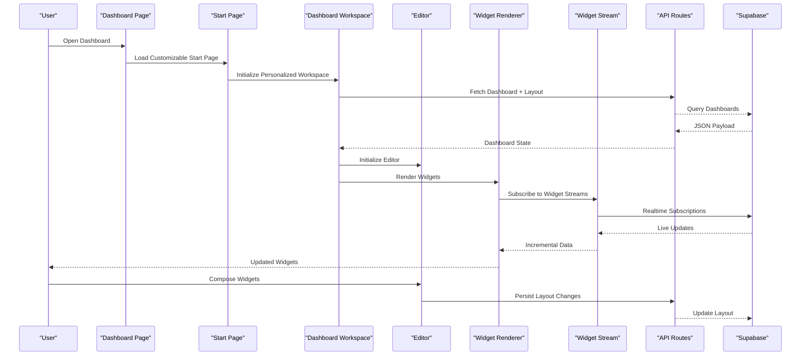

**Diagram sources**
- [page.tsx](file://apps/hr-suite/app/(dashboard)/dashboard/page.tsx)
- [start-page.tsx](file://apps/hr-suite/components/startpage/start-page.tsx)
- [dashboard-workspace.tsx](file://apps/hr-suite/components/dashboard/dashboard-workspace.tsx)
- [dashboard-editor.tsx](file://apps/hr-suite/components/dashboard/dashboard-editor.tsx)
- [widget-renderer.tsx](file://apps/hr-suite/components/dashboard/widget-renderer.tsx)
- [dashboard-widget-stream.tsx](file://apps/hr-suite/components/dashboard/dashboard-widget-stream.tsx)
- [route.ts](file://apps/hr-suite/app/api/dashboards/route.ts)
- [route.ts](file://apps/hr-suite/app/api/dashboards/[dashboardId]/route.ts)
- [route.ts](file://apps/hr-suite/app/api/dashboards/[dashboardId]/layout/route.ts)

## Detailed Component Analysis

### Widget Registry and Renderer
The Widget Renderer uses a registry pattern to resolve widget implementations by type. The registry has been expanded to include new widget types such as company documents and absence reporting widgets. Built-in widget types now include charts, tables, metrics, lists, company documents, and absence reports. The registry maps widget keys to components and configuration schemas. The renderer validates props, applies default configurations, and mounts the correct component.

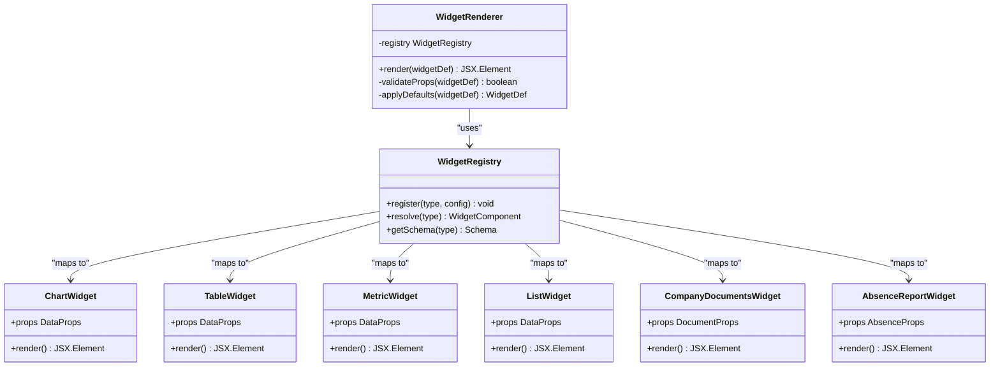

**Updated** Added support for company documents and absence reporting widgets in the registry system.

**Diagram sources**
- [widget-renderer.tsx](file://apps/hr-suite/components/dashboard/widget-renderer.tsx)
- [company-document-library.tsx](file://apps/hr-suite/components/documents/company-document-library.tsx)
- [absence-report.tsx](file://apps/hr-suite/components/insights/absence-report.tsx)

**Section sources**
- [widget-renderer.tsx](file://apps/hr-suite/components/dashboard/widget-renderer.tsx)
- [company-document-library.tsx](file://apps/hr-suite/components/documents/company-document-library.tsx)
- [absence-report.tsx](file://apps/hr-suite/components/insights/absence-report.tsx)

### Dashboard Workspace and Editor
The Workspace coordinates layout state, widget lifecycle, and persistence with enhanced support for customizable layouts. The Editor enables composition through drag-and-drop or selection workflows. They share a Workspace Model that encapsulates layout structure, widget metadata, and change tracking with support for personalized configurations.

**Updated** Enhanced to support customizable start page layouts and personalized widget configurations.

**Diagram sources**
- [dashboard-workspace.tsx](file://apps/hr-suite/components/dashboard/dashboard-workspace.tsx)
- [dashboard-editor.tsx](file://apps/hr-suite/components/dashboard/dashboard-editor.tsx)
- [dashboard-workspace-model.ts](file://apps/hr-suite/components/dashboard/dashboard-workspace-model.ts)

**Section sources**
- [dashboard-workspace.tsx](file://apps/hr-suite/components/dashboard/dashboard-workspace.tsx)
- [dashboard-editor.tsx](file://apps/hr-suite/components/dashboard/dashboard-editor.tsx)
- [dashboard-workspace-model.ts](file://apps/hr-suite/components/dashboard/dashboard-workspace-model.ts)

### Real-Time Data Streaming with Supabase
The Widget Stream manages Supabase subscriptions per widget, batching updates and handling reconnection logic. It integrates with the renderer to push incremental data without full re-renders, supporting both existing and new widget types.

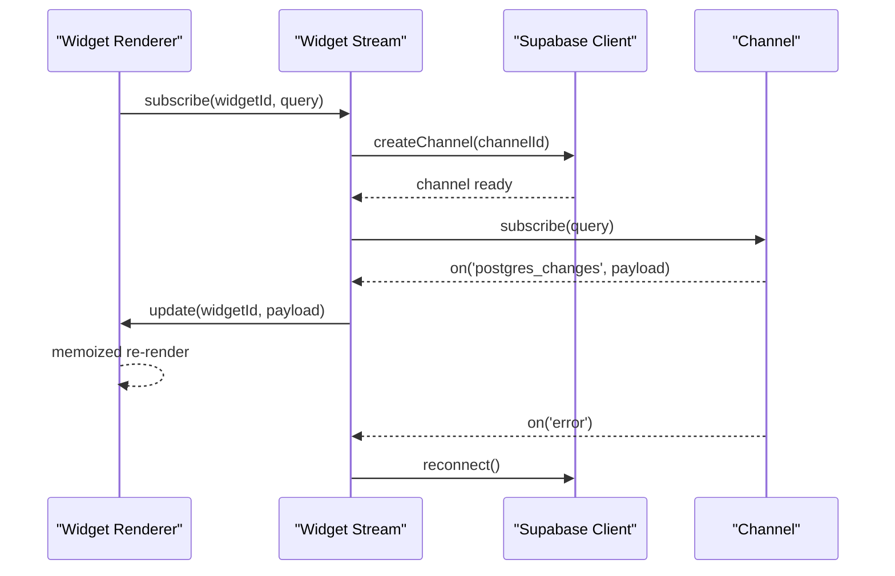

**Section sources**
- [dashboard-widget-stream.tsx](file://apps/hr-suite/components/dashboard/dashboard-widget-stream.tsx)

### Widget Picker and Composition Patterns
The Widget Picker Dialog exposes available widgets from the expanded registry and allows users to add them to the layout. Composition patterns include:
- Single widget placement
- Grouped widgets within sections
- Nested compositions via container widgets
- Conditional visibility based on filters or roles
- Support for company documents and absence reporting widgets

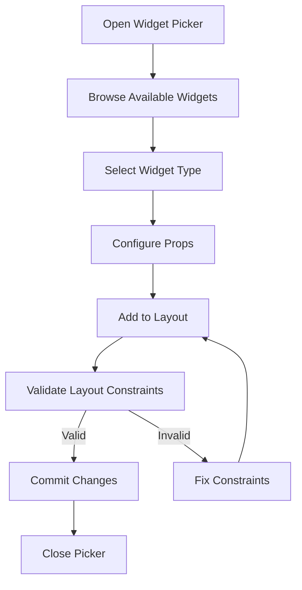

**Updated** Enhanced widget picker now includes company documents and absence reporting widgets.

**Diagram sources**
- [widget-picker-dialog.tsx](file://apps/hr-suite/components/dashboard/widget-picker-dialog.tsx)
- [widget-picker-model.ts](file://apps/hr-suite/components/dashboard/widget-picker-model.ts)

**Section sources**
- [widget-picker-dialog.tsx](file://apps/hr-suite/components/dashboard/widget-picker-dialog.tsx)
- [widget-picker-model.ts](file://apps/hr-suite/components/dashboard/widget-picker-model.ts)

### Mini Chart Implementation
Mini Chart is a lightweight chart widget used across dashboards for compact visualizations. It supports common chart types and adapts to small sizes.

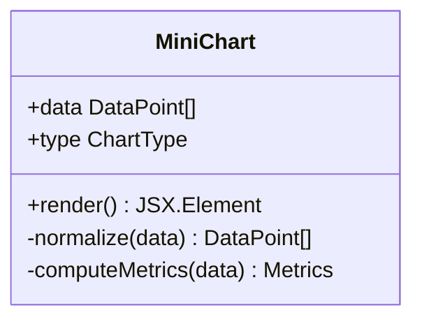

**Section sources**
- [mini-chart.tsx](file://apps/hr-suite/components/dashboard/mini-chart.tsx)

### Progress Tracking and Skeletons
Progress tracks overall dashboard readiness and per-widget status. Skeletons provide placeholders during loading and streaming initialization.

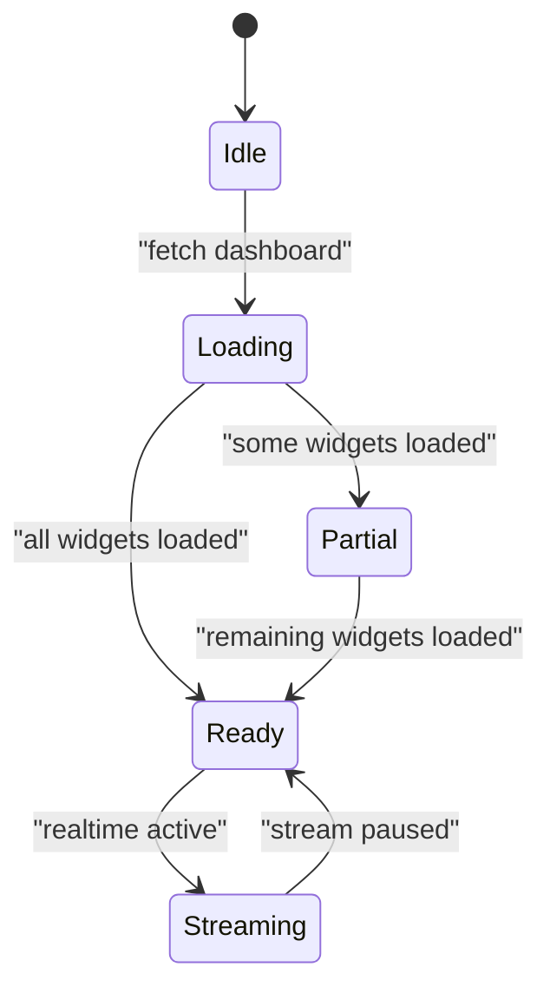

**Section sources**
- [dashboard-progress.tsx](file://apps/hr-suite/components/dashboard/dashboard-progress.tsx)
- [dashboard-progress-model.ts](file://apps/hr-suite/components/dashboard/dashboard-progress-model.ts)
- [widget-skeleton.tsx](file://apps/hr-suite/components/dashboard/widget-skeleton.tsx)

### API Routes and Persistence Model
API routes handle dashboard CRUD and layout updates. The persistence model includes widget catalogs, personal dashboards, user preferences, and support for company documents and absence reporting widgets. Migrations define schema evolution and permissions.

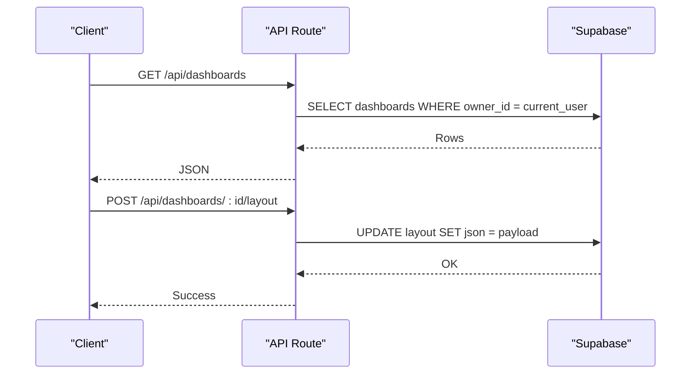

**Updated** Enhanced persistence model now supports company documents and absence reporting widget configurations.

**Diagram sources**
- [route.ts](file://apps/hr-suite/app/api/dashboards/route.ts)
- [route.ts](file://apps/hr-suite/app/api/dashboards/[dashboardId]/route.ts)
- [route.ts](file://apps/hr-suite/app/api/dashboards/[dashboardId]/layout/route.ts)

**Section sources**
- [route.ts](file://apps/hr-suite/app/api/dashboards/route.ts)
- [route.ts](file://apps/hr-suite/app/api/dashboards/[dashboardId]/route.ts)
- [route.ts](file://apps/hr-suite/app/api/dashboards/[dashboardId]/layout/route.ts)
- [20260718170000_add_dashboard_widget_catalog.sql](file://apps/hr-suite/supabase/migrations/20260718170000_add_dashboard_widget_catalog.sql)
- [20260718171000_relax_dashboard_widget_read_scope.sql](file://apps/hr-suite/supabase/migrations/20260718171000_relax_dashboard_widget_read_scope.sql)
- [20260718172000_expand_personal_dashboard_widget_types.sql](file://apps/hr-suite/supabase/migrations/20260718172000_expand_personal_dashboard_widget_types.sql)
- [20260718172051_grant_dashboard_widget_admin_permissions.sql](file://apps/hr-suite/supabase/migrations/20260718172051_grant_dashboard_widget_admin_permissions.sql)
- [20260726112000_add_company_documents_to_default_dashboards.sql](file://apps/hr-suite/supabase/migrations/20260726112000_add_company_documents_to_default_dashboards.sql)
- [20260726113000_enable_company_documents_widget.sql](file://apps/hr-suite/supabase/migrations/20260726113000_enable_company_documents_widget.sql)
- [personal_dashboards.sql](file://apps/hr-suite/supabase/tests/personal_dashboards.sql)

### User Preferences Management
User preferences control date/time formats, week numbering, and other dashboard behaviors. Actions update preferences atomically, and migrations ensure schema compatibility.

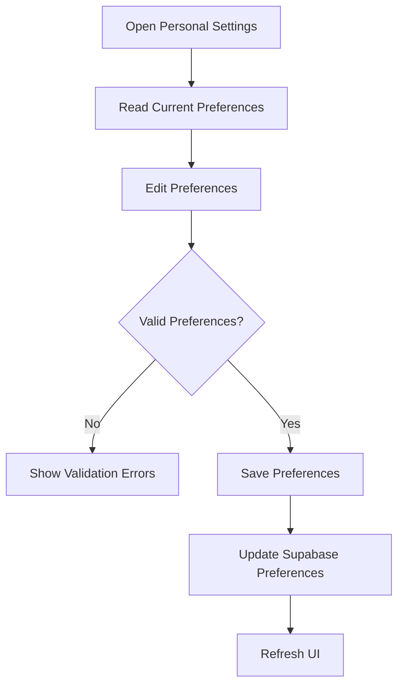

**Section sources**
- [update-user-preferences.ts](file://apps/hr-suite/app/actions/update-user-preferences.ts)
- [20260718180354_add_date_time_user_preferences.sql](file://apps/hr-suite/supabase/migrations/20260718180354_add_date_time_user_preferences.sql)
- [20260719112000_add_week_numbering_user_preference.sql](file://apps/hr-suite/supabase/migrations/20260719112000_add_week_numbering_user_preference.sql)

### Employee Dashboard Integration
Employee dashboards integrate with the core dashboard engine to present role-specific widgets and layouts.

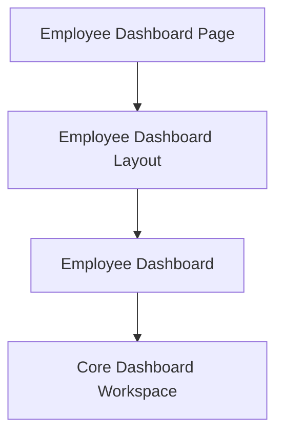

**Section sources**
- [employee-dashboard.tsx](file://apps/hr-suite/components/employees/employee-dashboard.tsx)
- [employee-dashboard-layout.tsx](file://apps/hr-suite/components/employees/employee-dashboard-layout.tsx)

## Customizable Start Page System

The new customizable start page system provides personalized dashboard experiences through widget-based layout management. Users can configure their preferred widgets, layouts, and display options upon first login or when accessing the dashboard.

### Start Page Architecture
The start page system consists of a configurable component that loads user-specific preferences and initializes the dashboard workspace with personalized widget configurations.

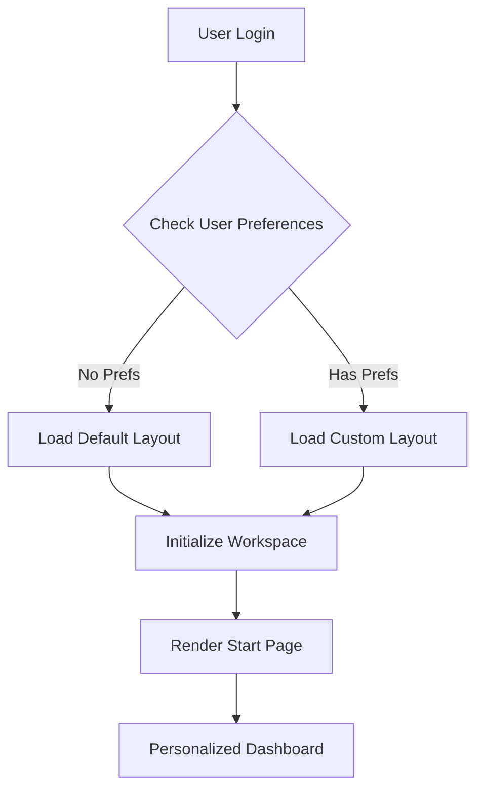

**Diagram sources**
- [start-page.tsx](file://apps/hr-suite/components/startpage/start-page.tsx)
- [dashboard-workspace.tsx](file://apps/hr-suite/components/dashboard/dashboard-workspace.tsx)

### Personalization Features
- **Widget Selection**: Users can choose which widgets appear on their start page
- **Layout Configuration**: Flexible grid layouts with drag-and-drop positioning
- **Display Preferences**: Customizable themes, colors, and widget sizes
- **Role-Based Defaults**: Different default layouts based on user roles and permissions
- **Persistence**: All customizations are saved and restored automatically

### Integration with Dashboard Engine
The start page system integrates seamlessly with the existing dashboard engine by:
- Using the same workspace and editor components
- Leveraging the widget registry for consistent widget rendering
- Utilizing the same persistence layer for layout storage
- Maintaining real-time streaming capabilities for all widgets

**Section sources**
- [start-page.tsx](file://apps/hr-suite/components/startpage/start-page.tsx)
- [dashboard-workspace.tsx](file://apps/hr-suite/components/dashboard/dashboard-workspace.tsx)

## Enhanced Widget System

The dashboard widget system has been significantly enhanced with new widget types and improved functionality.

### New Widget Types

#### Company Documents Widget
The company documents widget provides access to organizational documents directly from the dashboard. It displays recent documents, categories, and quick access links.

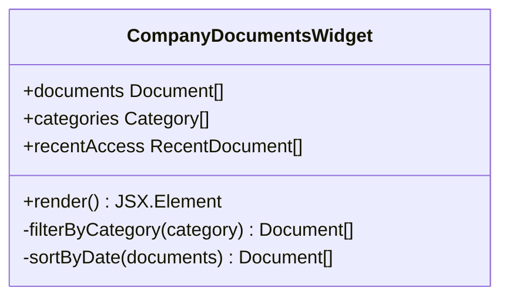

**Diagram sources**
- [company-document-library.tsx](file://apps/hr-suite/components/documents/company-document-library.tsx)

#### Absence Reporting Widget
The absence reporting widget provides real-time insights into employee absence data, including trends, summaries, and actionable alerts.

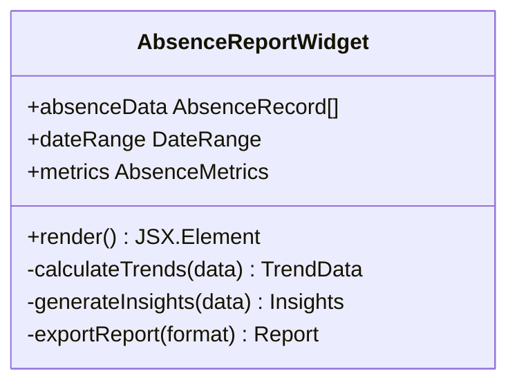

**Diagram sources**
- [absence-report.tsx](file://apps/hr-suite/components/insights/absence-report.tsx)

### Widget Enhancement Features
- **Real-time Updates**: Both new widgets support live data streaming
- **Responsive Design**: Optimized for desktop, tablet, and mobile devices
- **Accessibility**: Full keyboard navigation and screen reader support
- **Customization**: Configurable display options and filtering capabilities
- **Performance**: Optimized data loading and caching strategies

### Widget Registry Expansion
The widget registry has been updated to include the new widget types with proper schema validation and configuration options.

**Updated** Added company documents and absence reporting widgets to the widget registry system.

**Section sources**
- [company-document-library.tsx](file://apps/hr-suite/components/documents/company-document-library.tsx)
- [absence-report.tsx](file://apps/hr-suite/components/insights/absence-report.tsx)
- [widget-renderer.tsx](file://apps/hr-suite/components/dashboard/widget-renderer.tsx)

## Dependency Analysis
The Dashboard Engine has clear separation of concerns with enhanced dependencies for the new features:
- Workspace depends on Editor, Renderer, Stream, and API routes
- Renderer depends on Registry and Widget Implementations including new widgets
- Stream depends on Supabase client and channel management
- API routes depend on database migrations and policies
- Preferences action depends on migration-defined schema
- Start page system depends on workspace and user preferences

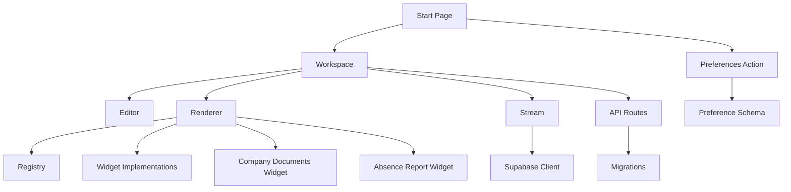

**Updated** Added dependencies for company documents widget, absence report widget, and start page system.

**Diagram sources**
- [dashboard-workspace.tsx](file://apps/hr-suite/components/dashboard/dashboard-workspace.tsx)
- [dashboard-editor.tsx](file://apps/hr-suite/components/dashboard/dashboard-editor.tsx)
- [widget-renderer.tsx](file://apps/hr-suite/components/dashboard/widget-renderer.tsx)
- [dashboard-widget-stream.tsx](file://apps/hr-suite/components/dashboard/dashboard-widget-stream.tsx)
- [company-document-library.tsx](file://apps/hr-suite/components/documents/company-document-library.tsx)
- [absence-report.tsx](file://apps/hr-suite/components/insights/absence-report.tsx)
- [start-page.tsx](file://apps/hr-suite/components/startpage/start-page.tsx)
- [route.ts](file://apps/hr-suite/app/api/dashboards/route.ts)
- [update-user-preferences.ts](file://apps/hr-suite/app/actions/update-user-preferences.ts)

**Section sources**
- [dashboard-workspace.tsx](file://apps/hr-suite/components/dashboard/dashboard-workspace.tsx)
- [dashboard-editor.tsx](file://apps/hr-suite/components/dashboard/dashboard-editor.tsx)
- [widget-renderer.tsx](file://apps/hr-suite/components/dashboard/widget-renderer.tsx)
- [dashboard-widget-stream.tsx](file://apps/hr-suite/components/dashboard/dashboard-widget-stream.tsx)
- [company-document-library.tsx](file://apps/hr-suite/components/documents/company-document-library.tsx)
- [absence-report.tsx](file://apps/hr-suite/components/insights/absence-report.tsx)
- [start-page.tsx](file://apps/hr-suite/components/startpage/start-page.tsx)
- [route.ts](file://apps/hr-suite/app/api/dashboards/route.ts)
- [update-user-preferences.ts](file://apps/hr-suite/app/actions/update-user-preferences.ts)

## Performance Considerations
- Memoization: Use memoized selectors for widget data to avoid unnecessary re-renders.
- Batched Updates: Aggregate multiple realtime updates before pushing to the renderer.
- Lazy Loading: Defer heavy widget initialization until visible in viewport.
- Pagination: Implement virtualized lists for large datasets in table widgets.
- Caching: Cache frequently accessed widget configurations and static assets.
- Connection Pooling: Reuse Supabase channels where possible to reduce overhead.
- Widget Optimization: Optimize new company documents and absence reporting widgets for performance.
- Start Page Loading: Implement progressive loading for customizable start pages.

[No sources needed since this section provides general guidance]

## Troubleshooting Guide
Common issues and resolutions:
- Widget not rendering: Verify registry mapping and prop validation.
- Realtime not updating: Check channel subscription and error handling.
- Layout persistence failures: Inspect API route responses and database policies.
- Preferences not saving: Confirm schema alignment and action payloads.
- Mobile responsiveness issues: Review responsive breakpoints and layout constraints.
- Start page not loading: Check user preferences and default layout fallback.
- Company documents widget errors: Verify document permissions and API connectivity.
- Absence reporting widget issues: Check data source availability and filtering parameters.

**Updated** Added troubleshooting guidance for new start page system and enhanced widgets.

**Section sources**
- [widget-renderer.tsx](file://apps/hr-suite/components/dashboard/widget-renderer.tsx)
- [dashboard-widget-stream.tsx](file://apps/hr-suite/components/dashboard/dashboard-widget-stream.tsx)
- [route.ts](file://apps/hr-suite/app/api/dashboards/route.ts)
- [update-user-preferences.ts](file://apps/hr-suite/app/actions/update-user-preferences.ts)
- [start-page.tsx](file://apps/hr-suite/components/startpage/start-page.tsx)
- [company-document-library.tsx](file://apps/hr-suite/components/documents/company-document-library.tsx)
- [absence-report.tsx](file://apps/hr-suite/components/insights/absence-report.tsx)

## Conclusion
LiquidHR's Dashboard Engine delivers a robust, extensible widget-based analytics platform with real-time streaming, flexible composition, and strong persistence. The addition of the customizable start page system and enhanced widget types (company documents and absence reporting) significantly improves the user experience by providing personalized dashboard experiences. By following the documented patterns and guidelines, teams can build accessible, responsive dashboards tailored to diverse user needs.

[No sources needed since this section summarizes without analyzing specific files]

## Appendices

### Creating Custom Widgets
Steps to create a custom widget:
- Define widget metadata and schema
- Implement the widget component
- Register the widget in the registry
- Provide props validation and defaults
- Integrate with streaming if needed
- Test with both existing and new widget patterns

[No sources needed since this section provides general guidance]

### Integrating External APIs
Approaches:
- Use server-side API routes to proxy external calls
- Cache responses to reduce latency
- Handle authentication securely
- Transform data to match widget schemas
- Implement error handling and retry logic

[No sources needed since this section provides general guidance]

### Data Transformations
Best practices:
- Normalize incoming data structures
- Apply consistent formatting rules
- Validate transformations with tests
- Log transformation errors for debugging
- Support both real-time and batch processing

[No sources needed since this section provides general guidance]

### Sharing Capabilities
Features:
- Share dashboards via secure links
- Role-based access controls
- Versioned layouts for collaboration
- Export to PDF or image formats
- Support for shared widget configurations

[No sources needed since this section provides general guidance]

### Accessibility Compliance
Guidelines:
- Semantic HTML structure
- Keyboard navigation support
- Screen reader compatibility
- Color contrast and focus indicators
- ARIA labels and descriptions for widgets

[No sources needed since this section provides general guidance]

### Mobile Responsiveness
Considerations:
- Flexible grid layouts
- Touch-friendly interactions
- Optimized chart rendering
- Progressive enhancement
- Responsive widget sizing and positioning

[No sources needed since this section provides general guidance]

### Customizable Start Page Implementation
Implementation steps:
- Create start page component with user preference detection
- Implement widget selection interface
- Add layout configuration options
- Integrate with dashboard workspace
- Set up persistence for user preferences
- Provide fallback to default layouts

[No sources needed since this section provides general guidance]

### Enhanced Widget Development
Development guidelines:
- Follow established widget patterns
- Implement proper error handling
- Add comprehensive testing
- Ensure accessibility compliance
- Optimize for performance
- Support real-time data streaming

[No sources needed since this section provides general guidance]