# Dashboard Engine

<cite>
**Referenced Files in This Document**
- [page.tsx](file://apps/hr-suite/app/(dashboard)/dashboard/page.tsx)
- [loading.tsx](file://apps/hr-suite/app/(dashboard)/dashboard/loading.tsx)
- [dashboard-editor.tsx](file://apps/hr-suite/components/dashboard/dashboard-editor.tsx)
- [dashboard-workspace.tsx](file://apps/hr-suite/components/dashboard/dashboard-workspace.tsx)
- [dashboard-workspace-model.ts](file://apps/hr-suite/components/dashboard/dashboard-workspace-model.ts)
- [dashboard-progress.tsx](file://apps/hr-suite/components/dashboard/dashboard-progress.tsx)
- [dashboard-progress-model.ts](file://apps/hr-suite/components/dashboard/dashboard-progress-model.ts)
- [widget-renderer.tsx](file://apps/hr-suite/components/dashboard/widget-renderer.tsx)
- [widget-picker-dialog.tsx](file://apps/hr-suite/components/dashboard/widget-picker-dialog.tsx)
- [widget-picker-model.ts](file://apps/hr-suite/components/dashboard/widget-picker-model.ts)
- [dashboard-widget-stream.tsx](file://apps/hr-suite/components/dashboard/dashboard-widget-stream.tsx)
- [mini-chart.tsx](file://apps/hr-suite/components/dashboard/mini-chart.tsx)
- [widget-skeleton.tsx](file://apps/hr-suite/components/dashboard/widget-skeleton.tsx)
- [route.ts](file://apps/hr-suite/app/api/dashboards/route.ts)
- [route.ts](file://apps/hr-suite/app/api/dashboards/[dashboardId]/route.ts)
- [route.ts](file://apps/hr-suite/app/api/dashboards/[dashboardId]/layout/route.ts)
- [update-user-preferences.ts](file://apps/hr-suite/app/actions/update-user-preferences.ts)
- [employee-dashboard.tsx](file://apps/hr-suite/components/employees/employee-dashboard.tsx)
- [employee-dashboard-layout.tsx](file://apps/hr-suite/components/employees/employee-dashboard-layout.tsx)
- [dashboard.json](file://apps/hr-suite/messages/en/dashboard.json)
- [20260718170000_add_dashboard_widget_catalog.sql](file://apps/hr-suite/supabase/migrations/20260718170000_add_dashboard_widget_catalog.sql)
- [20260718171000_relax_dashboard_widget_read_scope.sql](file://apps/hr-suite/supabase/migrations/20260718171000_relax_dashboard_widget_read_scope.sql)
- [20260718172000_expand_personal_dashboard_widget_types.sql](file://apps/hr-suite/supabase/migrations/20260718172000_expand_personal_dashboard_widget_types.sql)
- [20260718172051_grant_dashboard_widget_admin_permissions.sql](file://apps/hr-suite/supabase/migrations/20260718172051_grant_dashboard_widget_admin_permissions.sql)
- [20260718180354_add_date_time_user_preferences.sql](file://apps/hr-suite/supabase/migrations/20260718180354_add_date_time_user_preferences.sql)
- [20260719112000_add_week_numbering_user_preference.sql](file://apps/hr-suite/supabase/migrations/20260719112000_add_week_numbering_user_preference.sql)
- [personal_dashboards.sql](file://apps/hr-suite/supabase/tests/personal_dashboards.sql)
</cite>

## Table of Contents
1. [Introduction](#introduction)
2. [Project Structure](#project-structure)
3. [Core Components](#core-components)
4. [Architecture Overview](#architecture-overview)
5. [Detailed Component Analysis](#detailed-component-analysis)
6. [Dependency Analysis](#dependency-analysis)
7. [Performance Considerations](#performance-considerations)
8. [Troubleshooting Guide](#troubleshooting-guide)
9. [Conclusion](#conclusion)
10. [Appendices](#appendices)

## Introduction
This document explains LiquidHR’s Dashboard Engine, a widget-based analytics system that powers personalized dashboards with real-time data streaming. It covers the widget architecture (charts, tables, metrics, lists), composition patterns, and the widget registry. It also documents the dashboard layout engine, responsive design principles, user preference management, real-time streaming via Supabase subscriptions, caching strategies, performance optimization, custom widget creation, external API integration, data transformations, persistence model, sharing capabilities, export functionality, accessibility compliance, and mobile responsiveness.

## Project Structure
The Dashboard Engine spans Next.js app routes, React components, server-side API routes, and Supabase migrations. Key areas:
- App pages for dashboard entry points and loading states
- Dashboard workspace and editor components
- Widget rendering and picker UI
- Real-time streaming component
- Server API routes for dashboard CRUD and layout operations
- User preferences actions and migrations
- Localization messages for dashboard labels

```mermaid
graph TB
subgraph "App Pages"
DPage["Dashboard Page<br/>app/(dashboard)/dashboard/page.tsx"]
DLoading["Dashboard Loading<br/>app/(dashboard)/dashboard/loading.tsx"]
end
subgraph "Components"
Workspace["Dashboard Workspace<br/>components/dashboard/dashboard-workspace.tsx"]
Editor["Dashboard Editor<br/>components/dashboard/dashboard-editor.tsx"]
Renderer["Widget Renderer<br/>components/dashboard/widget-renderer.tsx"]
Picker["Widget Picker Dialog<br/>components/dashboard/widget-picker-dialog.tsx"]
Stream["Widget Stream<br/>components/dashboard/dashboard-widget-stream.tsx"]
MiniChart["Mini Chart<br/>components/dashboard/mini-chart.tsx"]
Skeleton["Widget Skeleton<br/>components/dashboard/widget-skeleton.tsx"]
Progress["Progress & Model<br/>components/dashboard/dashboard-progress.tsx<br/>components/dashboard/dashboard-progress-model.ts"]
WorkspaceModel["Workspace Model<br/>components/dashboard/dashboard-workspace-model.ts"]
end
subgraph "API Routes"
DashRoute["Dashboards Route<br/>app/api/dashboards/route.ts"]
DashIdRoute["Dashboard ID Route<br/>app/api/dashboards/[dashboardId]/route.ts"]
LayoutRoute["Layout Route<br/>app/api/dashboards/[dashboardId]/layout/route.ts"]
end
subgraph "Preferences & Data"
PrefAction["Update Preferences Action<br/>app/actions/update-user-preferences.ts"]
DBMig1["Widget Catalog Migration<br/>20260718170000_add_dashboard_widget_catalog.sql"]
DBMig2["Read Scope Migration<br/>20260718171000_relax_dashboard_widget_read_scope.sql"]
DBMig3["Widget Types Migration<br/>20260718172000_expand_personal_dashboard_widget_types.sql"]
DBMig4["Admin Permissions Migration<br/>20260718172051_grant_dashboard_widget_admin_permissions.sql"]
DBMig5["Date/Time Preferences<br/>20260718180354_add_date_time_user_preferences.sql"]
DBMig6["Week Numbering Preference<br/>20260719112000_add_week_numbering_user_preference.sql"]
Tests["Personal Dashboards Tests<br/>supabase/tests/personal_dashboards.sql"]
end
DPage --> Workspace
DLoading --> Workspace
Workspace --> Editor
Workspace --> Renderer
Workspace --> Picker
Workspace --> Stream
Renderer --> MiniChart
Renderer --> Skeleton
Workspace --> Progress
Workspace --> WorkspaceModel
Workspace --> DashRoute
Workspace --> DashIdRoute
Workspace --> LayoutRoute
Workspace --> PrefAction
DashRoute --> DBMig1
DashRoute --> DBMig2
DashRoute --> DBMig3
DashRoute --> DBMig4
PrefAction --> DBMig5
PrefAction --> DBMig6
DashRoute --> Tests
```

**Diagram sources**
- [page.tsx](file://apps/hr-suite/app/(dashboard)/dashboard/page.tsx)
- [loading.tsx](file://apps/hr-suite/app/(dashboard)/dashboard/loading.tsx)
- [dashboard-workspace.tsx](file://apps/hr-suite/components/dashboard/dashboard-workspace.tsx)
- [dashboard-editor.tsx](file://apps/hr-suite/components/dashboard/dashboard-editor.tsx)
- [widget-renderer.tsx](file://apps/hr-suite/components/dashboard/widget-renderer.tsx)
- [widget-picker-dialog.tsx](file://apps/hr-suite/components/dashboard/widget-picker-dialog.tsx)
- [dashboard-widget-stream.tsx](file://apps/hr-suite/components/dashboard/dashboard-widget-stream.tsx)
- [mini-chart.tsx](file://apps/hr-suite/components/dashboard/mini-chart.tsx)
- [widget-skeleton.tsx](file://apps/hr-suite/components/dashboard/widget-skeleton.tsx)
- [dashboard-progress.tsx](file://apps/hr-suite/components/dashboard/dashboard-progress.tsx)
- [dashboard-progress-model.ts](file://apps/hr-suite/components/dashboard/dashboard-progress-model.ts)
- [dashboard-workspace-model.ts](file://apps/hr-suite/components/dashboard/dashboard-workspace-model.ts)
- [route.ts](file://apps/hr-suite/app/api/dashboards/route.ts)
- [route.ts](file://apps/hr-suite/app/api/dashboards/[dashboardId]/route.ts)
- [route.ts](file://apps/hr-suite/app/api/dashboards/[dashboardId]/layout/route.ts)
- [update-user-preferences.ts](file://apps/hr-suite/app/actions/update-user-preferences.ts)
- [20260718170000_add_dashboard_widget_catalog.sql](file://apps/hr-suite/supabase/migrations/20260718170000_add_dashboard_widget_catalog.sql)
- [20260718171000_relax_dashboard_widget_read_scope.sql](file://apps/hr-suite/supabase/migrations/20260718171000_relax_dashboard_widget_read_scope.sql)
- [20260718172000_expand_personal_dashboard_widget_types.sql](file://apps/hr-suite/supabase/migrations/20260718172000_expand_personal_dashboard_widget_types.sql)
- [20260718172051_grant_dashboard_widget_admin_permissions.sql](file://apps/hr-suite/supabase/migrations/20260718172051_grant_dashboard_widget_admin_permissions.sql)
- [20260718180354_add_date_time_user_preferences.sql](file://apps/hr-suite/supabase/migrations/20260718180354_add_date_time_user_preferences.sql)
- [20260719112000_add_week_numbering_user_preference.sql](file://apps/hr-suite/supabase/migrations/20260719112000_add_week_numbering_user_preference.sql)
- [personal_dashboards.sql](file://apps/hr-suite/supabase/tests/personal_dashboards.sql)

**Section sources**
- [page.tsx](file://apps/hr-suite/app/(dashboard)/dashboard/page.tsx)
- [loading.tsx](file://apps/hr-suite/app/(dashboard)/dashboard/loading.tsx)
- [dashboard-workspace.tsx](file://apps/hr-suite/components/dashboard/dashboard-workspace.tsx)
- [dashboard-editor.tsx](file://apps/hr-suite/components/dashboard/dashboard-editor.tsx)
- [widget-renderer.tsx](file://apps/hr-suite/components/dashboard/widget-renderer.tsx)
- [widget-picker-dialog.tsx](file://apps/hr-suite/components/dashboard/widget-picker-dialog.tsx)
- [dashboard-widget-stream.tsx](file://apps/hr-suite/components/dashboard/dashboard-widget-stream.tsx)
- [mini-chart.tsx](file://apps/hr-suite/components/dashboard/mini-chart.tsx)
- [widget-skeleton.tsx](file://apps/hr-suite/components/dashboard/widget-skeleton.tsx)
- [dashboard-progress.tsx](file://apps/hr-suite/components/dashboard/dashboard-progress.tsx)
- [dashboard-progress-model.ts](file://apps/hr-suite/components/dashboard/dashboard-progress-model.ts)
- [dashboard-workspace-model.ts](file://apps/hr-suite/components/dashboard/dashboard-workspace-model.ts)
- [route.ts](file://apps/hr-suite/app/api/dashboards/route.ts)
- [route.ts](file://apps/hr-suite/app/api/dashboards/[dashboardId]/route.ts)
- [route.ts](file://apps/hr-suite/app/api/dashboards/[dashboardId]/layout/route.ts)
- [update-user-preferences.ts](file://apps/hr-suite/app/actions/update-user-preferences.ts)
- [20260718170000_add_dashboard_widget_catalog.sql](file://apps/hr-suite/supabase/migrations/20260718170000_add_dashboard_widget_catalog.sql)
- [20260718171000_relax_dashboard_widget_read_scope.sql](file://apps/hr-suite/supabase/migrations/20260718171000_relax_dashboard_widget_read_scope.sql)
- [20260718172000_expand_personal_dashboard_widget_types.sql](file://apps/hr-suite/supabase/migrations/20260718172000_expand_personal_dashboard_widget_types.sql)
- [20260718172051_grant_dashboard_widget_admin_permissions.sql](file://apps/hr-suite/supabase/migrations/20260718172051_grant_dashboard_widget_admin_permissions.sql)
- [20260718180354_add_date_time_user_preferences.sql](file://apps/hr-suite/supabase/migrations/20260718180354_add_date_time_user_preferences.sql)
- [20260719112000_add_week_numbering_user_preference.sql](file://apps/hr-suite/supabase/migrations/20260719112000_add_week_numbering_user_preference.sql)
- [personal_dashboards.sql](file://apps/hr-suite/supabase/tests/personal_dashboards.sql)

## Core Components
- Dashboard Workspace: Orchestrates layout, widget lifecycle, and state synchronization between editor and renderer.
- Dashboard Editor: Provides drag-and-drop or selection-based composition of widgets into the layout.
- Widget Renderer: Resolves widget types from a registry and renders them with props and data streams.
- Widget Picker Dialog: Allows users to discover and add widgets to their dashboard.
- Widget Stream: Manages real-time subscriptions and incremental updates for widgets.
- Mini Chart: A lightweight chart widget implementation used by several dashboard widgets.
- Widget Skeleton: Placeholder UI during initial load or while data is streaming.
- Progress & Model: Tracks overall dashboard readiness and per-widget progress.
- Workspace Model: Encapsulates layout state, widget definitions, and persistence hooks.

These components collectively implement the widget architecture, composition patterns, and registry-driven rendering.

**Section sources**
- [dashboard-workspace.tsx](file://apps/hr-suite/components/dashboard/dashboard-workspace.tsx)
- [dashboard-editor.tsx](file://apps/hr-suite/components/dashboard/dashboard-editor.tsx)
- [widget-renderer.tsx](file://apps/hr-suite/components/dashboard/widget-renderer.tsx)
- [widget-picker-dialog.tsx](file://apps/hr-suite/components/dashboard/widget-picker-dialog.tsx)
- [dashboard-widget-stream.tsx](file://apps/hr-suite/components/dashboard/dashboard-widget-stream.tsx)
- [mini-chart.tsx](file://apps/hr-suite/components/dashboard/mini-chart.tsx)
- [widget-skeleton.tsx](file://apps/hr-suite/components/dashboard/widget-skeleton.tsx)
- [dashboard-progress.tsx](file://apps/hr-suite/components/dashboard/dashboard-progress.tsx)
- [dashboard-progress-model.ts](file://apps/hr-suite/components/dashboard/dashboard-progress-model.ts)
- [dashboard-workspace-model.ts](file://apps/hr-suite/components/dashboard/dashboard-workspace-model.ts)

## Architecture Overview
The Dashboard Engine follows a layered architecture:
- Presentation Layer: Next.js pages render the dashboard shell and loading states.
- Composition Layer: Workspace and Editor manage layout and widget composition.
- Rendering Layer: Widget Renderer resolves widget types and mounts instances.
- Streaming Layer: Widget Stream subscribes to Supabase channels and pushes updates.
- Persistence Layer: API routes handle CRUD for dashboards and layouts; user preferences are persisted via actions and migrations.
- Data Layer: Supabase provides relational storage and real-time subscriptions.

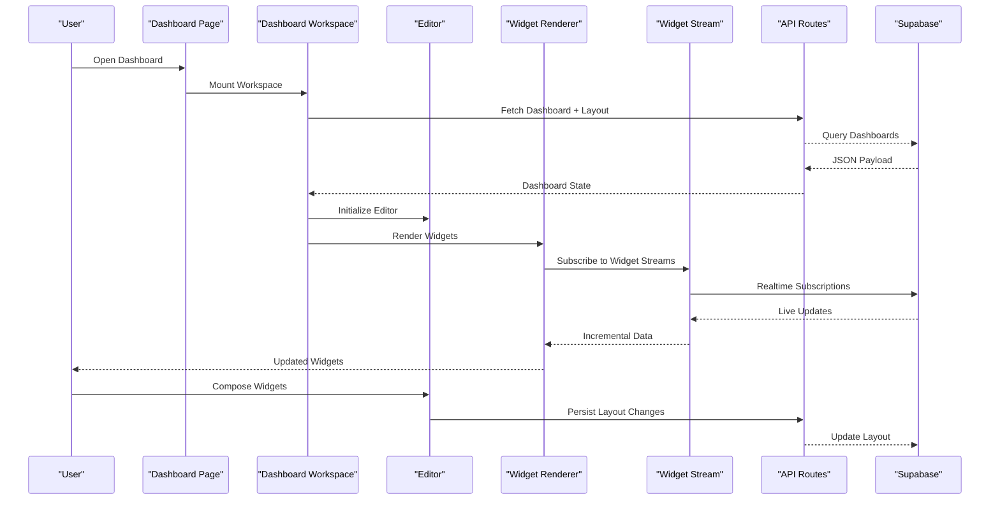

**Diagram sources**
- [page.tsx](file://apps/hr-suite/app/(dashboard)/dashboard/page.tsx)
- [dashboard-workspace.tsx](file://apps/hr-suite/components/dashboard/dashboard-workspace.tsx)
- [dashboard-editor.tsx](file://apps/hr-suite/components/dashboard/dashboard-editor.tsx)
- [widget-renderer.tsx](file://apps/hr-suite/components/dashboard/widget-renderer.tsx)
- [dashboard-widget-stream.tsx](file://apps/hr-suite/components/dashboard/dashboard-widget-stream.tsx)
- [route.ts](file://apps/hr-suite/app/api/dashboards/route.ts)
- [route.ts](file://apps/hr-suite/app/api/dashboards/[dashboardId]/route.ts)
- [route.ts](file://apps/hr-suite/app/api/dashboards/[dashboardId]/layout/route.ts)

## Detailed Component Analysis

### Widget Registry and Renderer
The Widget Renderer uses a registry pattern to resolve widget implementations by type. Built-in widget types include charts, tables, metrics, and lists. The registry maps widget keys to components and configuration schemas. The renderer validates props, applies default configurations, and mounts the correct component.

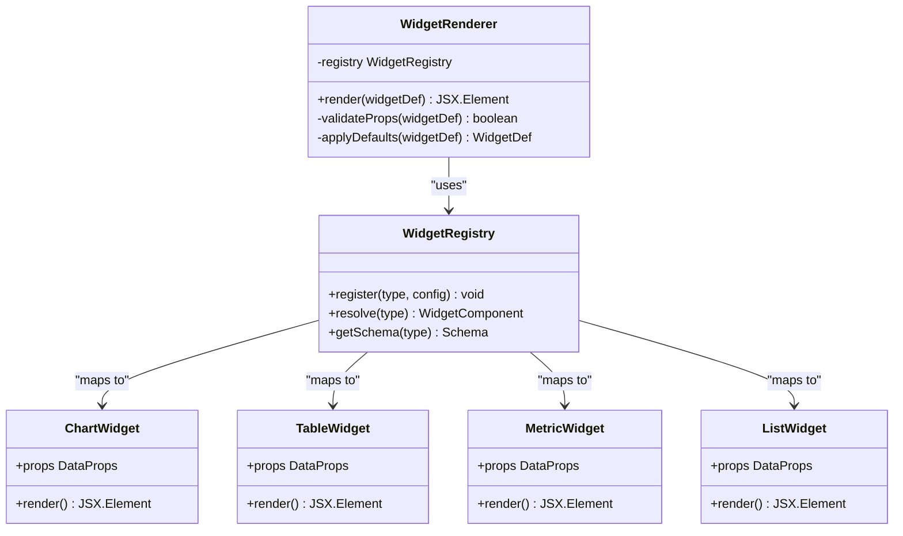

**Diagram sources**
- [widget-renderer.tsx](file://apps/hr-suite/components/dashboard/widget-renderer.tsx)

**Section sources**
- [widget-renderer.tsx](file://apps/hr-suite/components/dashboard/widget-renderer.tsx)

### Dashboard Workspace and Editor
The Workspace coordinates layout state, widget lifecycle, and persistence. The Editor enables composition through drag-and-drop or selection workflows. They share a Workspace Model that encapsulates layout structure, widget metadata, and change tracking.

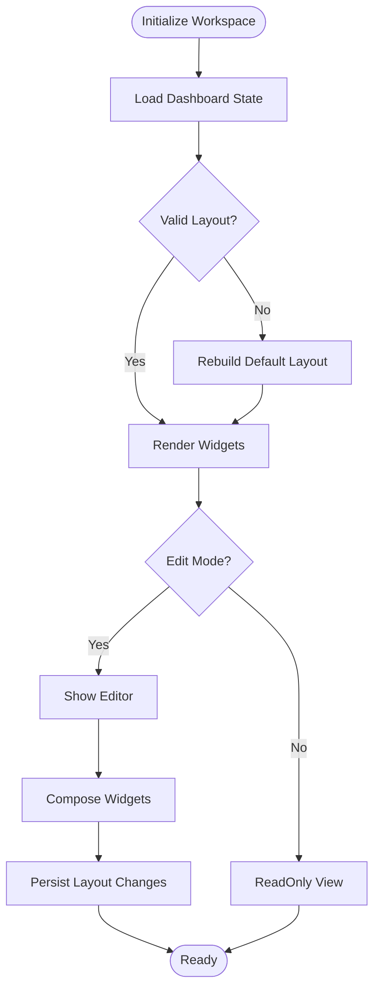

**Diagram sources**
- [dashboard-workspace.tsx](file://apps/hr-suite/components/dashboard/dashboard-workspace.tsx)
- [dashboard-editor.tsx](file://apps/hr-suite/components/dashboard/dashboard-editor.tsx)
- [dashboard-workspace-model.ts](file://apps/hr-suite/components/dashboard/dashboard-workspace-model.ts)

**Section sources**
- [dashboard-workspace.tsx](file://apps/hr-suite/components/dashboard/dashboard-workspace.tsx)
- [dashboard-editor.tsx](file://apps/hr-suite/components/dashboard/dashboard-editor.tsx)
- [dashboard-workspace-model.ts](file://apps/hr-suite/components/dashboard/dashboard-workspace-model.ts)

### Real-Time Data Streaming with Supabase
The Widget Stream manages Supabase subscriptions per widget, batching updates and handling reconnection logic. It integrates with the renderer to push incremental data without full re-renders.

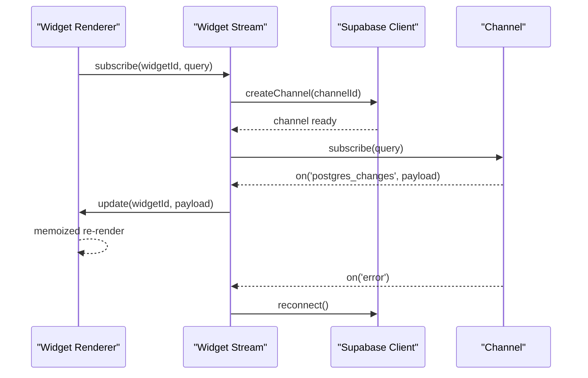

**Diagram sources**
- [dashboard-widget-stream.tsx](file://apps/hr-suite/components/dashboard/dashboard-widget-stream.tsx)

**Section sources**
- [dashboard-widget-stream.tsx](file://apps/hr-suite/components/dashboard/dashboard-widget-stream.tsx)

### Widget Picker and Composition Patterns
The Widget Picker Dialog exposes available widgets from the registry and allows users to add them to the layout. Composition patterns include:
- Single widget placement
- Grouped widgets within sections
- Nested compositions via container widgets
- Conditional visibility based on filters or roles

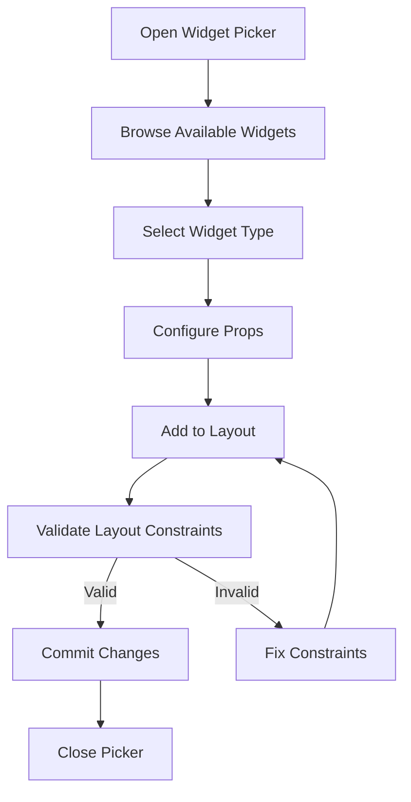

**Diagram sources**
- [widget-picker-dialog.tsx](file://apps/hr-suite/components/dashboard/widget-picker-dialog.tsx)
- [widget-picker-model.ts](file://apps/hr-suite/components/dashboard/widget-picker-model.ts)

**Section sources**
- [widget-picker-dialog.tsx](file://apps/hr-suite/components/dashboard/widget-picker-dialog.tsx)
- [widget-picker-model.ts](file://apps/hr-suite/components/dashboard/widget-picker-model.ts)

### Mini Chart Implementation
Mini Chart is a lightweight chart widget used across dashboards for compact visualizations. It supports common chart types and adapts to small sizes.

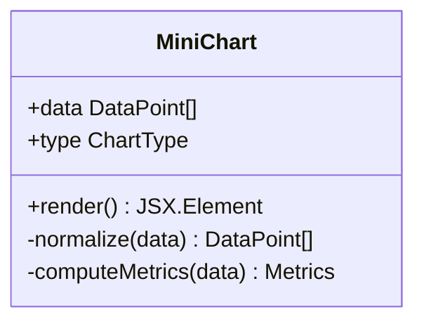

**Diagram sources**
- [mini-chart.tsx](file://apps/hr-suite/components/dashboard/mini-chart.tsx)

**Section sources**
- [mini-chart.tsx](file://apps/hr-suite/components/dashboard/mini-chart.tsx)

### Progress Tracking and Skeletons
Progress tracks overall dashboard readiness and per-widget status. Skeletons provide placeholders during loading and streaming initialization.

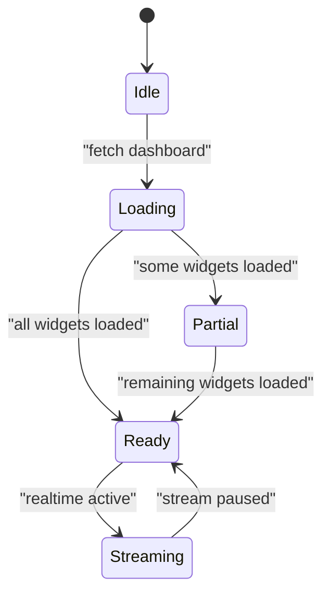

**Diagram sources**
- [dashboard-progress.tsx](file://apps/hr-suite/components/dashboard/dashboard-progress.tsx)
- [dashboard-progress-model.ts](file://apps/hr-suite/components/dashboard/dashboard-progress-model.ts)
- [widget-skeleton.tsx](file://apps/hr-suite/components/dashboard/widget-skeleton.tsx)

**Section sources**
- [dashboard-progress.tsx](file://apps/hr-suite/components/dashboard/dashboard-progress.tsx)
- [dashboard-progress-model.ts](file://apps/hr-suite/components/dashboard/dashboard-progress-model.ts)
- [widget-skeleton.tsx](file://apps/hr-suite/components/dashboard/widget-skeleton.tsx)

### API Routes and Persistence Model
API routes handle dashboard CRUD and layout updates. The persistence model includes widget catalogs, personal dashboards, and user preferences. Migrations define schema evolution and permissions.

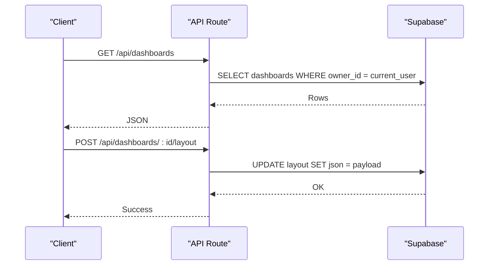

**Diagram sources**
- [route.ts](file://apps/hr-suite/app/api/dashboards/route.ts)
- [route.ts](file://apps/hr-suite/app/api/dashboards/[dashboardId]/route.ts)
- [route.ts](file://apps/hr-suite/app/api/dashboards/[dashboardId]/layout/route.ts)

**Section sources**
- [route.ts](file://apps/hr-suite/app/api/dashboards/route.ts)
- [route.ts](file://apps/hr-suite/app/api/dashboards/[dashboardId]/route.ts)
- [route.ts](file://apps/hr-suite/app/api/dashboards/[dashboardId]/layout/route.ts)
- [20260718170000_add_dashboard_widget_catalog.sql](file://apps/hr-suite/supabase/migrations/20260718170000_add_dashboard_widget_catalog.sql)
- [20260718171000_relax_dashboard_widget_read_scope.sql](file://apps/hr-suite/supabase/migrations/20260718171000_relax_dashboard_widget_read_scope.sql)
- [20260718172000_expand_personal_dashboard_widget_types.sql](file://apps/hr-suite/supabase/migrations/20260718172000_expand_personal_dashboard_widget_types.sql)
- [20260718172051_grant_dashboard_widget_admin_permissions.sql](file://apps/hr-suite/supabase/migrations/20260718172051_grant_dashboard_widget_admin_permissions.sql)
- [personal_dashboards.sql](file://apps/hr-suite/supabase/tests/personal_dashboards.sql)

### User Preferences Management
User preferences control date/time formats, week numbering, and other dashboard behaviors. Actions update preferences atomically, and migrations ensure schema compatibility.

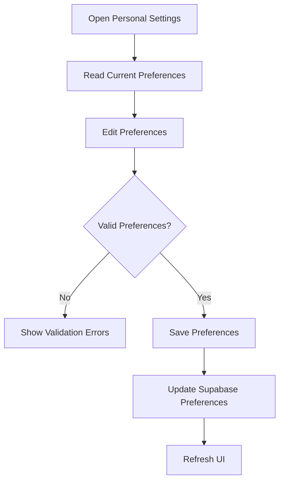

**Diagram sources**
- [update-user-preferences.ts](file://apps/hr-suite/app/actions/update-user-preferences.ts)
- [20260718180354_add_date_time_user_preferences.sql](file://apps/hr-suite/supabase/migrations/20260718180354_add_date_time_user_preferences.sql)
- [20260719112000_add_week_numbering_user_preference.sql](file://apps/hr-suite/supabase/migrations/20260719112000_add_week_numbering_user_preference.sql)

**Section sources**
- [update-user-preferences.ts](file://apps/hr-suite/app/actions/update-user-preferences.ts)
- [20260718180354_add_date_time_user_preferences.sql](file://apps/hr-suite/supabase/migrations/20260718180354_add_date_time_user_preferences.sql)
- [20260719112000_add_week_numbering_user_preference.sql](file://apps/hr-suite/supabase/migrations/20260719112000_add_week_numbering_user_preference.sql)

### Employee Dashboard Integration
Employee dashboards integrate with the core dashboard engine to present role-specific widgets and layouts.

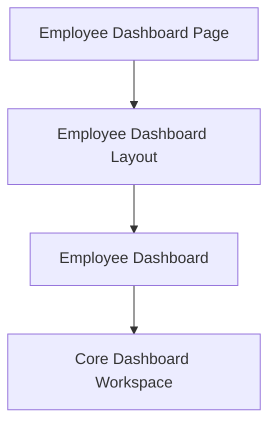

**Diagram sources**
- [employee-dashboard.tsx](file://apps/hr-suite/components/employees/employee-dashboard.tsx)
- [employee-dashboard-layout.tsx](file://apps/hr-suite/components/employees/employee-dashboard-layout.tsx)

**Section sources**
- [employee-dashboard.tsx](file://apps/hr-suite/components/employees/employee-dashboard.tsx)
- [employee-dashboard-layout.tsx](file://apps/hr-suite/components/employees/employee-dashboard-layout.tsx)

## Dependency Analysis
The Dashboard Engine has clear separation of concerns:
- Workspace depends on Editor, Renderer, Stream, and API routes
- Renderer depends on Registry and Widget Implementations
- Stream depends on Supabase client and channel management
- API routes depend on database migrations and policies
- Preferences action depends on migration-defined schema

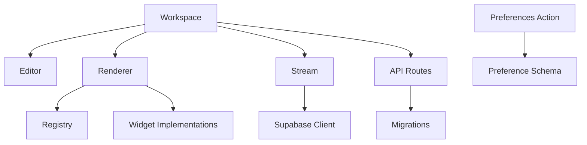

**Diagram sources**
- [dashboard-workspace.tsx](file://apps/hr-suite/components/dashboard/dashboard-workspace.tsx)
- [dashboard-editor.tsx](file://apps/hr-suite/components/dashboard/dashboard-editor.tsx)
- [widget-renderer.tsx](file://apps/hr-suite/components/dashboard/widget-renderer.tsx)
- [dashboard-widget-stream.tsx](file://apps/hr-suite/components/dashboard/dashboard-widget-stream.tsx)
- [route.ts](file://apps/hr-suite/app/api/dashboards/route.ts)
- [update-user-preferences.ts](file://apps/hr-suite/app/actions/update-user-preferences.ts)

**Section sources**
- [dashboard-workspace.tsx](file://apps/hr-suite/components/dashboard/dashboard-workspace.tsx)
- [dashboard-editor.tsx](file://apps/hr-suite/components/dashboard/dashboard-editor.tsx)
- [widget-renderer.tsx](file://apps/hr-suite/components/dashboard/widget-renderer.tsx)
- [dashboard-widget-stream.tsx](file://apps/hr-suite/components/dashboard/dashboard-widget-stream.tsx)
- [route.ts](file://apps/hr-suite/app/api/dashboards/route.ts)
- [update-user-preferences.ts](file://apps/hr-suite/app/actions/update-user-preferences.ts)

## Performance Considerations
- Memoization: Use memoized selectors for widget data to avoid unnecessary re-renders.
- Batched Updates: Aggregate multiple realtime updates before pushing to the renderer.
- Lazy Loading: Defer heavy widget initialization until visible in viewport.
- Pagination: Implement virtualized lists for large datasets in table widgets.
- Caching: Cache frequently accessed widget configurations and static assets.
- Connection Pooling: Reuse Supabase channels where possible to reduce overhead.

[No sources needed since this section provides general guidance]

## Troubleshooting Guide
Common issues and resolutions:
- Widget not rendering: Verify registry mapping and prop validation.
- Realtime not updating: Check channel subscription and error handling.
- Layout persistence failures: Inspect API route responses and database policies.
- Preferences not saving: Confirm schema alignment and action payloads.
- Mobile responsiveness issues: Review responsive breakpoints and layout constraints.

**Section sources**
- [widget-renderer.tsx](file://apps/hr-suite/components/dashboard/widget-renderer.tsx)
- [dashboard-widget-stream.tsx](file://apps/hr-suite/components/dashboard/dashboard-widget-stream.tsx)
- [route.ts](file://apps/hr-suite/app/api/dashboards/route.ts)
- [update-user-preferences.ts](file://apps/hr-suite/app/actions/update-user-preferences.ts)

## Conclusion
LiquidHR’s Dashboard Engine delivers a robust, extensible widget-based analytics platform with real-time streaming, flexible composition, and strong persistence. By following the documented patterns and guidelines, teams can build accessible, responsive dashboards tailored to diverse user needs.

[No sources needed since this section summarizes without analyzing specific files]

## Appendices

### Creating Custom Widgets
Steps to create a custom widget:
- Define widget metadata and schema
- Implement the widget component
- Register the widget in the registry
- Provide props validation and defaults
- Integrate with streaming if needed

[No sources needed since this section provides general guidance]

### Integrating External APIs
Approaches:
- Use server-side API routes to proxy external calls
- Cache responses to reduce latency
- Handle authentication securely
- Transform data to match widget schemas

[No sources needed since this section provides general guidance]

### Data Transformations
Best practices:
- Normalize incoming data structures
- Apply consistent formatting rules
- Validate transformations with tests
- Log transformation errors for debugging

[No sources needed since this section provides general guidance]

### Sharing Capabilities
Features:
- Share dashboards via secure links
- Role-based access controls
- Versioned layouts for collaboration
- Export to PDF or image formats

[No sources needed since this section provides general guidance]

### Accessibility Compliance
Guidelines:
- Semantic HTML structure
- Keyboard navigation support
- Screen reader compatibility
- Color contrast and focus indicators

[No sources needed since this section provides general guidance]

### Mobile Responsiveness
Considerations:
- Flexible grid layouts
- Touch-friendly interactions
- Optimized chart rendering
- Progressive enhancement

[No sources needed since this section provides general guidance]