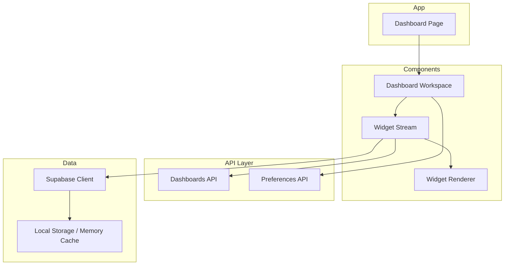
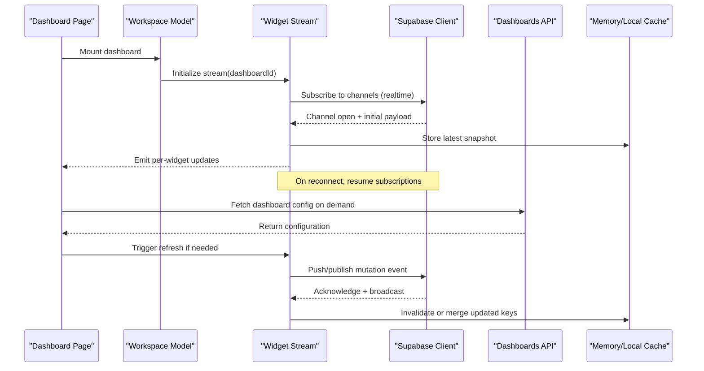
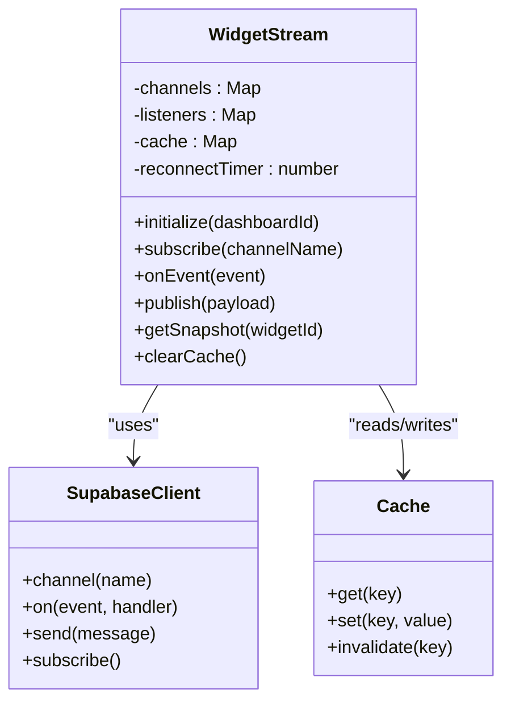
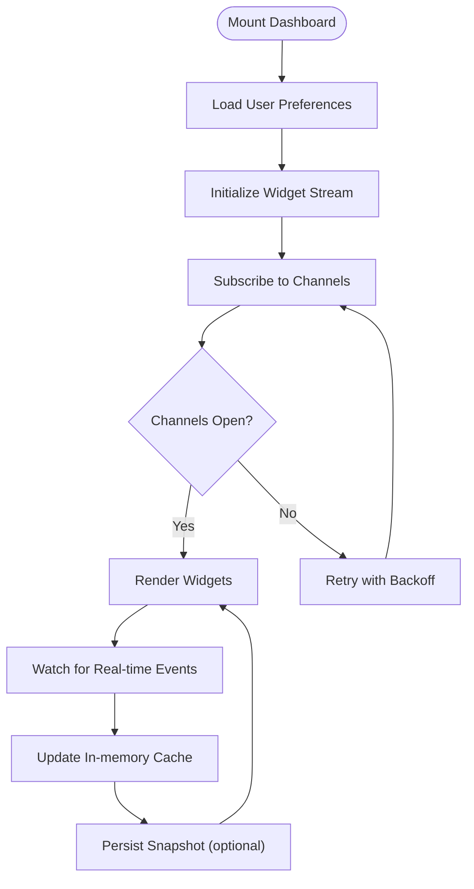
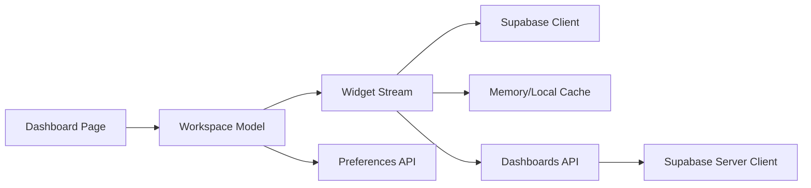

# Data Streaming & Real-time Updates

<cite>
**Referenced Files in This Document**
- [dashboard-widget-stream.tsx](file://apps/hr-suite/components/dashboard/dashboard-widget-stream.tsx)
- [dashboard-workspace-model.ts](file://apps/hr-suite/components/dashboard/dashboard-workspace-model.ts)
- [dashboard-workspace.tsx](file://apps/hr-suite/components/dashboard/dashboard-workspace.tsx)
- [widget-renderer.tsx](file://apps/hr-suite/components/dashboard/widget-renderer.tsx)
- [page.tsx](file://apps/hr-suite/app/(dashboard)/dashboard/page.tsx)
- [route.ts](file://apps/hr-suite/app/api/dashboards/route.ts)
- [route.ts](file://apps/hr-suite/app/api/dashboards/[dashboardId]/route.ts)
- [supabase/client.ts](file://apps/hr-suite/lib/supabase/client.ts)
- [supabase/server-client.ts](file://apps/hr-suite/lib/supabase/server-client.ts)
- [update-user-preferences.ts](file://apps/hr-suite/app/actions/update-user-preferences.ts)
- [preferences/employee-dashboard/route.ts](file://apps/hr-suite/app/api/preferences/employee-dashboard/route.ts)
</cite>

## Table of Contents
1. [Introduction](#introduction)
2. [Project Structure](#project-structure)
3. [Core Components](#core-components)
4. [Architecture Overview](#architecture-overview)
5. [Detailed Component Analysis](#detailed-component-analysis)
6. [Dependency Analysis](#dependency-analysis)
7. [Performance Considerations](#performance-considerations)
8. [Troubleshooting Guide](#troubleshooting-guide)
9. [Conclusion](#conclusion)

## Introduction
This document explains LiquidHR’s Data Streaming and Real-time Update system for dashboards. It covers how Supabase subscriptions are used to keep dashboard widgets live, how connection lifecycle and errors are managed, caching strategies for performance, the widget stream architecture that propagates updates to individual widgets, and the API endpoints that serve dashboard data. It also provides guidance for implementing custom data sources, handling connection failures, optimizing update frequency, and monitoring/debugging streaming behavior.

## Project Structure
The real-time dashboard experience is built around:
- A Next.js app page that mounts the dashboard workspace
- A workspace model that owns state and subscription lifecycle
- A widget stream component that subscribes to changes and dispatches updates per widget
- Widget renderers that consume normalized data and re-render efficiently
- API routes for fetching and updating dashboard configuration and data
- Supabase client utilities for both client-side and server-side operations

**Diagram sources**
- [page.tsx](file://apps/hr-suite/app/(dashboard)/dashboard/page.tsx)
- [dashboard-workspace.tsx](file://apps/hr-suite/components/dashboard/dashboard-workspace.tsx)
- [dashboard-widget-stream.tsx](file://apps/hr-suite/components/dashboard/dashboard-widget-stream.tsx)
- [widget-renderer.tsx](file://apps/hr-suite/components/dashboard/widget-renderer.tsx)
- [route.ts](file://apps/hr-suite/app/api/dashboards/route.ts)
- [route.ts](file://apps/hr-suite/app/api/dashboards/[dashboardId]/route.ts)
- [supabase/client.ts](file://apps/hr-suite/lib/supabase/client.ts)

**Section sources**
- [page.tsx](file://apps/hr-suite/app/(dashboard)/dashboard/page.tsx)
- [dashboard-workspace.tsx](file://apps/hr-suite/components/dashboard/dashboard-workspace.tsx)
- [dashboard-widget-stream.tsx](file://apps/hr-suite/components/dashboard/dashboard-widget-stream.tsx)
- [widget-renderer.tsx](file://apps/hr-suite/components/dashboard/widget-renderer.tsx)
- [route.ts](file://apps/hr-suite/app/api/dashboards/route.ts)
- [route.ts](file://apps/hr-suite/app/api/dashboards/[dashboardId]/route.ts)
- [supabase/client.ts](file://apps/hr-suite/lib/supabase/client.ts)

## Core Components
- Dashboard Workspace: Owns the active dashboard context, manages user preferences, and coordinates the widget stream lifecycle.
- Widget Stream: Subscribes to Supabase channels, normalizes incoming events, and pushes targeted updates to widgets via a publish/subscribe mechanism.
- Widget Renderer: Consumes normalized data from the stream and renders each widget with minimal re-renders.
- Supabase Clients: Provide typed clients for client-side subscriptions and server-side queries/mutations.
- API Routes: Serve dashboard metadata, widget payloads, and preferences; act as a bridge between UI and Supabase.

Key responsibilities:
- Connection management: establish, monitor, and reconnect Supabase channels
- Error handling: surface network/auth errors, retry with backoff, degrade gracefully
- Caching: memory cache for recent payloads, optional local storage for persisted snapshots
- Event routing: map channel events to specific widget IDs
- Update throttling: debounce rapid updates to avoid excessive re-renders

**Section sources**
- [dashboard-workspace-model.ts](file://apps/hr-suite/components/dashboard/dashboard-workspace-model.ts)
- [dashboard-widget-stream.tsx](file://apps/hr-suite/components/dashboard/dashboard-widget-stream.tsx)
- [widget-renderer.tsx](file://apps/hr-suite/components/dashboard/widget-renderer.tsx)
- [supabase/client.ts](file://apps/hr-suite/lib/supabase/client.ts)
- [supabase/server-client.ts](file://apps/hr-suite/lib/supabase/server-client.ts)

## Architecture Overview
The real-time pipeline connects UI components to Supabase channels and caches to deliver live updates to widgets.

**Diagram sources**
- [dashboard-workspace-model.ts](file://apps/hr-suite/components/dashboard/dashboard-workspace-model.ts)
- [dashboard-widget-stream.tsx](file://apps/hr-suite/components/dashboard/dashboard-widget-stream.tsx)
- [supabase/client.ts](file://apps/hr-suite/lib/supabase/client.ts)
- [route.ts](file://apps/hr-suite/app/api/dashboards/route.ts)
- [route.ts](file://apps/hr-suite/app/api/dashboards/[dashboardId]/route.ts)

## Detailed Component Analysis

### Widget Stream Architecture
The widget stream centralizes real-time subscriptions and distributes updates to individual widgets.

Responsibilities:
- Maintain channel instances keyed by dashboard/widget scope
- Normalize heterogeneous events into a consistent shape
- Debounce/throttle updates per widget to reduce render load
- Persist critical snapshots to local storage when available
- Reconnect channels with exponential backoff on failure

**Diagram sources**
- [dashboard-widget-stream.tsx](file://apps/hr-suite/components/dashboard/dashboard-widget-stream.tsx)
- [supabase/client.ts](file://apps/hr-suite/lib/supabase/client.ts)

**Section sources**
- [dashboard-widget-stream.tsx](file://apps/hr-suite/components/dashboard/dashboard-widget-stream.tsx)

### Workspace Model and Lifecycle
The workspace model orchestrates dashboard initialization, preference sync, and stream lifecycle.

Key behaviors:
- Defer heavy work until channels are open
- Persist last known good state to local storage for resilience
- Merge incremental updates instead of full re-fetches
- Expose a stable API for widgets to subscribe to their own slices

**Diagram sources**
- [dashboard-workspace-model.ts](file://apps/hr-suite/components/dashboard/dashboard-workspace-model.ts)

**Section sources**
- [dashboard-workspace-model.ts](file://apps/hr-suite/components/dashboard/dashboard-workspace-model.ts)

### API Endpoints for Dashboard Data
- GET/POST /api/dashboards: List/create dashboards and manage top-level metadata
- GET/PUT /api/dashboards/[dashboardId]: Read/update dashboard configuration and layout
- GET /api/preferences/employee-dashboard: Retrieve employee-specific dashboard preferences
- POST /app/actions/update-user-preferences: Server action to persist user preferences

These endpoints:
- Validate tenant/user context
- Return cached responses when appropriate
- Emit realtime events upon mutations to trigger stream updates

**Section sources**
- [route.ts](file://apps/hr-suite/app/api/dashboards/route.ts)
- [route.ts](file://apps/hr-suite/app/api/dashboards/[dashboardId]/route.ts)
- [preferences/employee-dashboard/route.ts](file://apps/hr-suite/app/api/preferences/employee-dashboard/route.ts)
- [update-user-preferences.ts](file://apps/hr-suite/app/actions/update-user-preferences.ts)

### Supabase Subscription Implementation
- Client-side: Use typed Supabase client to create channels scoped by dashboard ID and widget identifiers
- Server-side: Use server client for initial data fetch and mutations that trigger realtime broadcasts
- Channel lifecycle:
  - Create channel on mount
  - Listen for insert/update/delete events
  - Handle close/reconnect events with backoff
  - Clean up subscriptions on unmount

Error handling patterns:
- Network errors: queue mutations and replay on reconnect
- Auth errors: redirect to sign-in and clear sensitive caches
- Schema drift: fallback to last known snapshot and alert

**Section sources**
- [supabase/client.ts](file://apps/hr-suite/lib/supabase/client.ts)
- [supabase/server-client.ts](file://apps/hr-suite/lib/supabase/server-client.ts)
- [dashboard-widget-stream.tsx](file://apps/hr-suite/components/dashboard/dashboard-widget-stream.tsx)

### Caching Strategies
- Memory cache:
  - Per-widget key-value store with TTL
  - Deduplicates identical payloads
  - Supports partial merges for incremental updates
- Local storage:
  - Persists last successful snapshot for quick recovery
  - Evicts older entries under size constraints
- Cache invalidation:
  - On write operations, invalidate affected keys
  - On reconnect, reconcile with server state

Performance tips:
- Batch multiple small updates into a single render cycle
- Use immutable updates to minimize diffing cost
- Avoid deep cloning; prefer structural sharing where possible

**Section sources**
- [dashboard-widget-stream.tsx](file://apps/hr-suite/components/dashboard/dashboard-widget-stream.tsx)
- [dashboard-workspace-model.ts](file://apps/hr-suite/components/dashboard/dashboard-workspace-model.ts)

### Widget Rendering and Update Propagation
Widgets subscribe to their own slice of the stream:
- Each widget registers a listener keyed by its ID
- The stream emits only relevant events to subscribed widgets
- Renderers receive normalized data and compute minimal diffs

Optimization techniques:
- Memoize derived values inside widgets
- Coalesce frequent updates using requestAnimationFrame
- Show skeleton placeholders during first load or reconnect

**Section sources**
- [widget-renderer.tsx](file://apps/hr-suite/components/dashboard/widget-renderer.tsx)
- [dashboard-widget-stream.tsx](file://apps/hr-suite/components/dashboard/dashboard-widget-stream.tsx)

## Dependency Analysis
The following diagram shows runtime dependencies among core modules:

**Diagram sources**
- [page.tsx](file://apps/hr-suite/app/(dashboard)/dashboard/page.tsx)
- [dashboard-workspace-model.ts](file://apps/hr-suite/components/dashboard/dashboard-workspace-model.ts)
- [dashboard-widget-stream.tsx](file://apps/hr-suite/components/dashboard/dashboard-widget-stream.tsx)
- [supabase/client.ts](file://apps/hr-suite/lib/supabase/client.ts)
- [supabase/server-client.ts](file://apps/hr-suite/lib/supabase/server-client.ts)
- [route.ts](file://apps/hr-suite/app/api/dashboards/route.ts)
- [route.ts](file://apps/hr-suite/app/api/dashboards/[dashboardId]/route.ts)

**Section sources**
- [dashboard-workspace-model.ts](file://apps/hr-suite/components/dashboard/dashboard-workspace-model.ts)
- [dashboard-widget-stream.tsx](file://apps/hr-suite/components/dashboard/dashboard-widget-stream.tsx)
- [supabase/client.ts](file://apps/hr-suite/lib/supabase/client.ts)
- [supabase/server-client.ts](file://apps/hr-suite/lib/supabase/server-client.ts)
- [route.ts](file://apps/hr-suite/app/api/dashboards/route.ts)
- [route.ts](file://apps/hr-suite/app/api/dashboards/[dashboardId]/route.ts)

## Performance Considerations
- Throttle and debounce high-frequency events to prevent jank
- Prefer incremental updates over full re-fetches
- Keep payloads small; send only changed fields
- Use memoization and shallow comparisons in widgets
- Preload critical data on navigation to reduce perceived latency
- Monitor channel health and auto-reconnect with backoff
- Profile rendering with React DevTools and browser performance tools

[No sources needed since this section provides general guidance]

## Troubleshooting Guide
Common issues and resolutions:
- No updates received:
  - Verify channel names and scopes match dashboard/widget IDs
  - Check network connectivity and firewall rules
  - Inspect Supabase logs for channel errors
- Frequent disconnects:
  - Increase backoff intervals and max retries
  - Ensure proper cleanup on component unmount
- Stale data after reconnect:
  - Force reconciliation with server snapshot
  - Clear corrupted local storage entries
- High CPU usage:
  - Reduce update frequency or batch updates
  - Optimize widget computations and avoid unnecessary re-renders

Debugging tools:
- Enable verbose logging in the widget stream
- Log channel lifecycle events (open, error, close)
- Track cache hit rates and payload sizes
- Use browser devtools to inspect WebSocket frames

**Section sources**
- [dashboard-widget-stream.tsx](file://apps/hr-suite/components/dashboard/dashboard-widget-stream.tsx)
- [dashboard-workspace-model.ts](file://apps/hr-suite/components/dashboard/dashboard-workspace-model.ts)

## Conclusion
LiquidHR’s dashboard streaming layer combines Supabase realtime channels, robust connection management, and layered caching to deliver smooth, live updates to widgets. By centralizing subscription logic in the widget stream and isolating concerns in the workspace model, the system remains scalable and maintainable. Following the performance and troubleshooting recommendations ensures reliable operation under varying network conditions and high update frequencies.