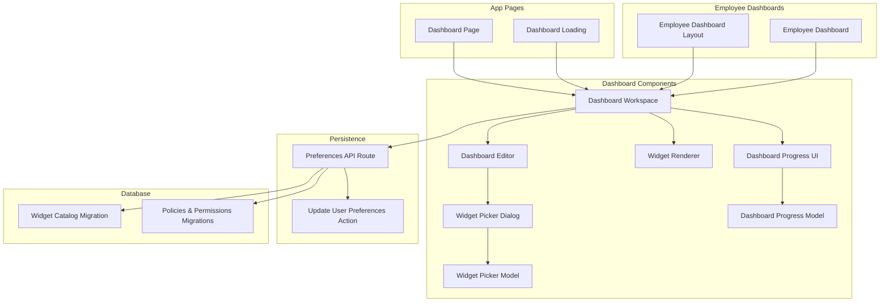
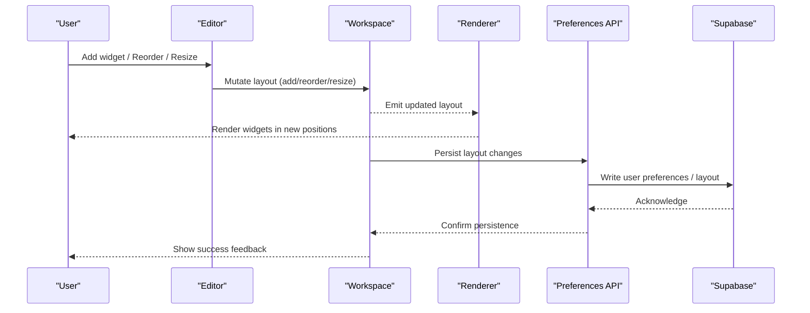
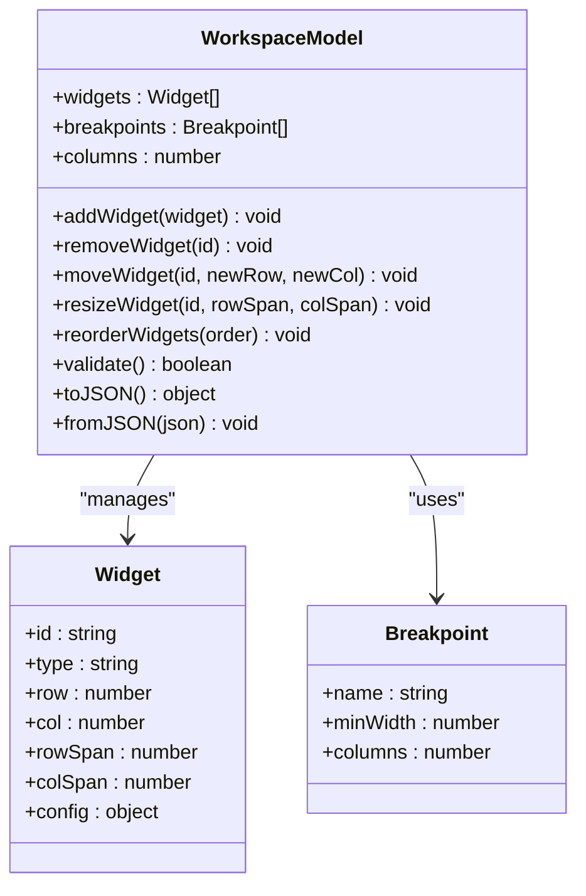
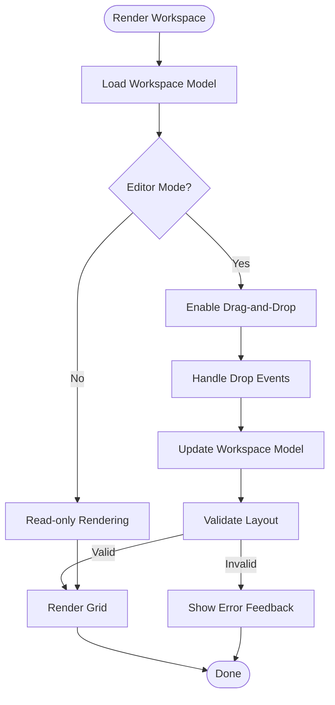
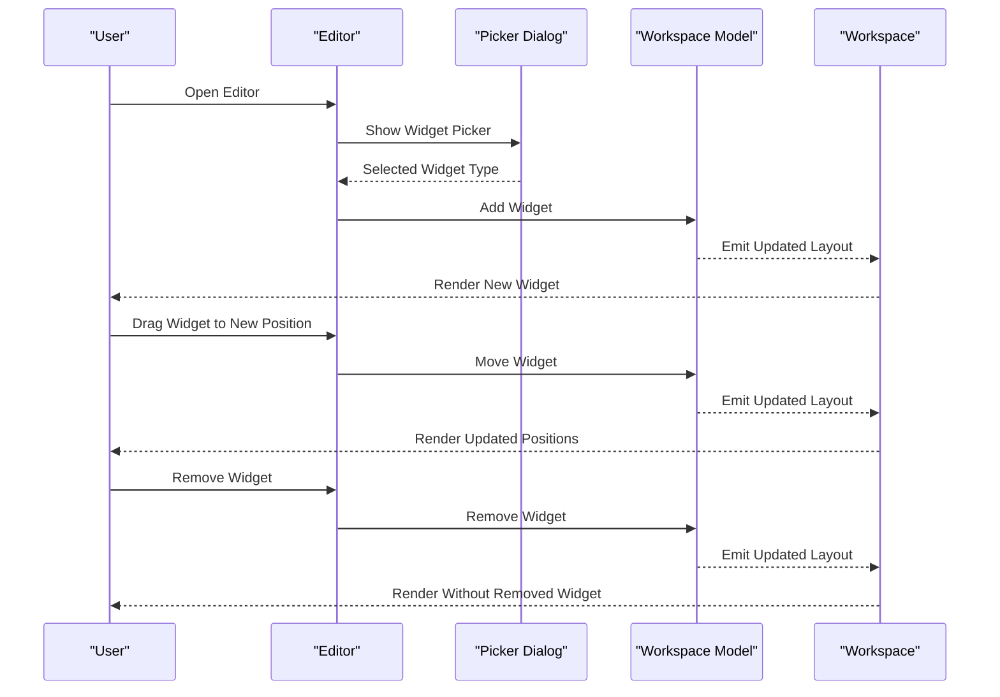
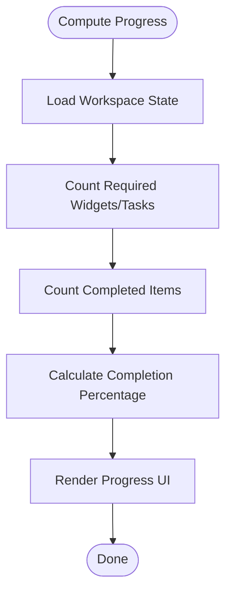
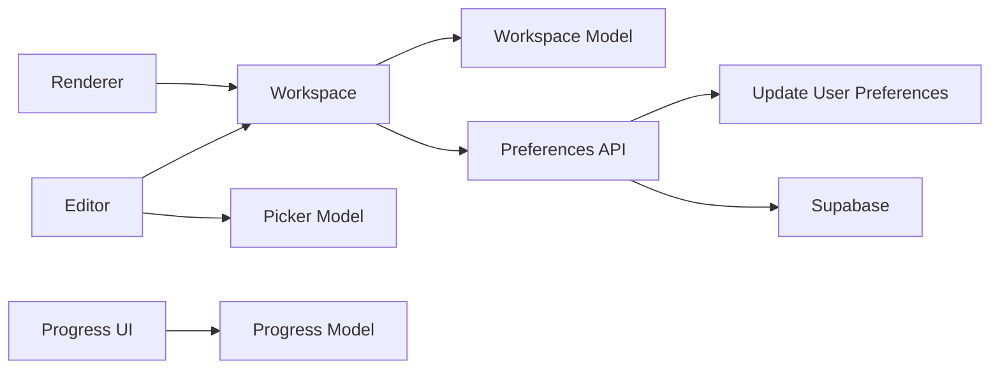

# Layout System

<cite>
**Referenced Files in This Document**
- [dashboard/page.tsx](file://apps/hr-suite/app/(dashboard)/dashboard/page.tsx)
- [dashboard/loading.tsx](file://apps/hr-suite/app/(dashboard)/dashboard/loading.tsx)
- [components/dashboard/dashboard-workspace.tsx](file://apps/hr-suite/components/dashboard/dashboard-workspace.tsx)
- [components/dashboard/dashboard-workspace-model.ts](file://apps/hr-suite/components/dashboard/dashboard-workspace-model.ts)
- [components/dashboard/dashboard-editor.tsx](file://apps/hr-suite/components/dashboard/dashboard-editor.tsx)
- [components/dashboard/widget-renderer.tsx](file://apps/hr-suite/components/dashboard/widget-renderer.tsx)
- [components/dashboard/widget-picker-dialog.tsx](file://apps/hr-suite/components/dashboard/widget-picker-dialog.tsx)
- [components/dashboard/widget-picker-model.ts](file://apps/hr-suite/components/dashboard/widget-picker-model.ts)
- [components/dashboard/dashboard-progress.tsx](file://apps/hr-suite/components/dashboard/dashboard-progress.tsx)
- [components/dashboard/dashboard-progress-model.ts](file://apps/hr-suite/components/dashboard/dashboard-progress-model.ts)
- [components/employees/employee-dashboard-layout.tsx](file://apps/hr-suite/components/employees/employee-dashboard-layout.tsx)
- [components/employees/employee-dashboard.tsx](file://apps/hr-suite/components/employees/employee-dashboard.tsx)
- [lib/preferences/employee-dashboard/route.ts](file://apps/hr-suite/app/api/preferences/employee-dashboard/route.ts)
- [app/actions/update-user-preferences.ts](file://apps/hr-suite/app/actions/update-user-preferences.ts)
- [supabase/migrations/20260718170000_add_dashboard_widget_catalog.sql](file://apps/hr-suite/supabase/migrations/20260718170000_add_dashboard_widget_catalog.sql)
- [supabase/migrations/20260718171000_relax_dashboard_widget_read_scope.sql](file://apps/hr-suite/supabase/migrations/20260718171000_relax_dashboard_widget_read_scope.sql)
- [supabase/migrations/20260718172000_expand_personal_dashboard_widget_types.sql](file://apps/hr-suite/supabase/migrations/20260718172000_expand_personal_dashboard_widget_types.sql)
- [supabase/migrations/20260718172051_grant_dashboard_widget_admin_permissions.sql](file://apps/hr-suite/supabase/migrations/20260718172051_grant_dashboard_widget_admin_permissions.sql)
- [supabase/migrations/20260718173000_tune_dashboard_widget_policies.sql](file://apps/hr-suite/supabase/migrations/20260718173000_tune_dashboard_widget_policies.sql)
- [supabase/migrations/20260718180354_add_date_time_user_preferences.sql](file://apps/hr-suite/supabase/migrations/20260718180354_add_date_time_user_preferences.sql)
- [supabase/migrations/20260719101500_refine_employee_document_upload_rules.sql](file://apps/hr-suite/supabase/migrations/20260719101500_refine_employee_document_upload_rules.sql)
- [supabase/migrations/20260719112000_add_week_numbering_user_preference.sql](file://apps/hr-suite/supabase/migrations/20260719112000_add_week_numbering_user_preference.sql)
- [supabase/tests/personal_dashboards.sql](file://apps/hr-suite/supabase/tests/personal_dashboards.sql)
</cite>

## Table of Contents
1. [Introduction](#introduction)
2. [Project Structure](#project-structure)
3. [Core Components](#core-components)
4. [Architecture Overview](#architecture-overview)
5. [Detailed Component Analysis](#detailed-component-analysis)
6. [Dependency Analysis](#dependency-analysis)
7. [Performance Considerations](#performance-considerations)
8. [Troubleshooting Guide](#troubleshooting-guide)
9. [Conclusion](#conclusion)
10. [Appendices](#appendices)

## Introduction
This document explains LiquidHR’s Dashboard Layout System, focusing on the grid-based layout engine, responsive design principles, and drag-and-drop functionality. It details the workspace model that manages widget positioning, sizing, and arrangement; the editor mode for customization (add, remove, reorder); progress tracking for dashboard completion and onboarding; persistence and sharing of configurations; and examples for implementing custom behaviors and breakpoint handling.

## Project Structure
The dashboard layout system is implemented across Next.js app pages, React components, and Supabase migrations:
- App-level pages render the dashboard shell and loading states.
- The core layout engine and editor live in dedicated dashboard components.
- A workspace model encapsulates state and operations for widgets.
- API routes and actions persist user preferences and dashboard layouts.
- Database migrations define the widget catalog and policies.

**Diagram sources**
- [dashboard/page.tsx](file://apps/hr-suite/app/(dashboard)/dashboard/page.tsx)
- [dashboard/loading.tsx](file://apps/hr-suite/app/(dashboard)/dashboard/loading.tsx)
- [components/dashboard/dashboard-workspace.tsx](file://apps/hr-suite/components/dashboard/dashboard-workspace.tsx)
- [components/dashboard/dashboard-editor.tsx](file://apps/hr-suite/components/dashboard/dashboard-editor.tsx)
- [components/dashboard/widget-renderer.tsx](file://apps/hr-suite/components/dashboard/widget-renderer.tsx)
- [components/dashboard/widget-picker-dialog.tsx](file://apps/hr-suite/components/dashboard/widget-picker-dialog.tsx)
- [components/dashboard/widget-picker-model.ts](file://apps/hr-suite/components/dashboard/widget-picker-model.ts)
- [components/dashboard/dashboard-progress.tsx](file://apps/hr-suite/components/dashboard/dashboard-progress.tsx)
- [components/dashboard/dashboard-progress-model.ts](file://apps/hr-suite/components/dashboard/dashboard-progress-model.ts)
- [components/employees/employee-dashboard-layout.tsx](file://apps/hr-suite/components/employees/employee-dashboard-layout.tsx)
- [components/employees/employee-dashboard.tsx](file://apps/hr-suite/components/employees/employee-dashboard.tsx)
- [lib/preferences/employee-dashboard/route.ts](file://apps/hr-suite/app/api/preferences/employee-dashboard/route.ts)
- [app/actions/update-user-preferences.ts](file://apps/hr-suite/app/actions/update-user-preferences.ts)
- [supabase/migrations/20260718170000_add_dashboard_widget_catalog.sql](file://apps/hr-suite/supabase/migrations/20260718170000_add_dashboard_widget_catalog.sql)
- [supabase/migrations/20260718171000_relax_dashboard_widget_read_scope.sql](file://apps/hr-suite/supabase/migrations/20260718171000_relax_dashboard_widget_read_scope.sql)
- [supabase/migrations/20260718172000_expand_personal_dashboard_widget_types.sql](file://apps/hr-suite/supabase/migrations/20260718172000_expand_personal_dashboard_widget_types.sql)
- [supabase/migrations/20260718172051_grant_dashboard_widget_admin_permissions.sql](file://apps/hr-suite/supabase/migrations/20260718172051_grant_dashboard_widget_admin_permissions.sql)
- [supabase/migrations/20260718173000_tune_dashboard_widget_policies.sql](file://apps/hr-suite/supabase/migrations/20260718173000_tune_dashboard_widget_policies.sql)

**Section sources**
- [dashboard/page.tsx](file://apps/hr-suite/app/(dashboard)/dashboard/page.tsx)
- [dashboard/loading.tsx](file://apps/hr-suite/app/(dashboard)/dashboard/loading.tsx)
- [components/dashboard/dashboard-workspace.tsx](file://apps/hr-suite/components/dashboard/dashboard-workspace.tsx)
- [components/dashboard/dashboard-editor.tsx](file://apps/hr-suite/components/dashboard/dashboard-editor.tsx)
- [components/dashboard/widget-renderer.tsx](file://apps/hr-suite/components/dashboard/widget-renderer.tsx)
- [components/dashboard/widget-picker-dialog.tsx](file://apps/hr-suite/components/dashboard/widget-picker-dialog.tsx)
- [components/dashboard/widget-picker-model.ts](file://apps/hr-suite/components/dashboard/widget-picker-model.ts)
- [components/dashboard/dashboard-progress.tsx](file://apps/hr-suite/components/dashboard/dashboard-progress.tsx)
- [components/dashboard/dashboard-progress-model.ts](file://apps/hr-suite/components/dashboard/dashboard-progress-model.ts)
- [components/employees/employee-dashboard-layout.tsx](file://apps/hr-suite/components/employees/employee-dashboard-layout.tsx)
- [components/employees/employee-dashboard.tsx](file://apps/hr-suite/components/employees/employee-dashboard.tsx)
- [lib/preferences/employee-dashboard/route.ts](file://apps/hr-suite/app/api/preferences/employee-dashboard/route.ts)
- [app/actions/update-user-preferences.ts](file://apps/hr-suite/app/actions/update-user-preferences.ts)
- [supabase/migrations/20260718170000_add_dashboard_widget_catalog.sql](file://apps/hr-suite/supabase/migrations/20260718170000_add_dashboard_widget_catalog.sql)
- [supabase/migrations/20260718171000_relax_dashboard_widget_read_scope.sql](file://apps/hr-suite/supabase/migrations/20260718171000_relax_dashboard_widget_read_scope.sql)
- [supabase/migrations/20260718172000_expand_personal_dashboard_widget_types.sql](file://apps/hr-suite/supabase/migrations/20260718172000_expand_personal_dashboard_widget_types.sql)
- [supabase/migrations/20260718172051_grant_dashboard_widget_admin_permissions.sql](file://apps/hr-suite/supabase/migrations/20260718172051_grant_dashboard_widget_admin_permissions.sql)
- [supabase/migrations/20260718173000_tune_dashboard_widget_policies.sql](file://apps/hr-suite/supabase/migrations/20260718173000_tune_dashboard_widget_policies.sql)

## Core Components
- Dashboard Workspace: Orchestrates the grid layout, handles drag-and-drop interactions, and renders widgets according to the current workspace model.
- Workspace Model: Encapsulates the state of widgets (position, size, order), provides methods to add, remove, move, resize, and validate layouts.
- Editor Mode: Enables customization by exposing controls to add widgets via a picker dialog, reorder them through drag-and-drop, and remove or adjust properties.
- Widget Renderer: Renders individual widgets based on their type and configuration, with support for skeleton placeholders during load.
- Widget Picker: Provides a searchable interface to discover available widgets from the catalog and add them to the layout.
- Progress Tracking: Computes and displays completion metrics for dashboard setup and onboarding tasks.

Key responsibilities:
- Grid engine computes cell positions and spans based on breakpoints and widget dimensions.
- Drag-and-drop updates the workspace model atomically and persists changes.
- Responsive behavior adapts columns and spans at different screen sizes.
- Persistence writes user-specific layouts and preferences to the backend.

**Section sources**
- [components/dashboard/dashboard-workspace.tsx](file://apps/hr-suite/components/dashboard/dashboard-workspace.tsx)
- [components/dashboard/dashboard-workspace-model.ts](file://apps/hr-suite/components/dashboard/dashboard-workspace-model.ts)
- [components/dashboard/dashboard-editor.tsx](file://apps/hr-suite/components/dashboard/dashboard-editor.tsx)
- [components/dashboard/widget-renderer.tsx](file://apps/hr-suite/components/dashboard/widget-renderer.tsx)
- [components/dashboard/widget-picker-dialog.tsx](file://apps/hr-suite/components/dashboard/widget-picker-dialog.tsx)
- [components/dashboard/widget-picker-model.ts](file://apps/hr-suite/components/dashboard/widget-picker-model.ts)
- [components/dashboard/dashboard-progress.tsx](file://apps/hr-suite/components/dashboard/dashboard-progress.tsx)
- [components/dashboard/dashboard-progress-model.ts](file://apps/hr-suite/components/dashboard/dashboard-progress-model.ts)

## Architecture Overview
The dashboard layout system follows a layered architecture:
- Presentation layer: Pages and components render the UI and handle user interactions.
- State layer: Workspace model holds the canonical layout state and exposes mutation methods.
- Interaction layer: Editor and picker components translate user actions into model mutations.
- Persistence layer: API routes and server actions write configurations to Supabase.
- Data layer: Migrations define the widget catalog and policies governing access.

**Diagram sources**
- [components/dashboard/dashboard-editor.tsx](file://apps/hr-suite/components/dashboard/dashboard-editor.tsx)
- [components/dashboard/dashboard-workspace.tsx](file://apps/hr-suite/components/dashboard/dashboard-workspace.tsx)
- [components/dashboard/widget-renderer.tsx](file://apps/hr-suite/components/dashboard/widget-renderer.tsx)
- [lib/preferences/employee-dashboard/route.ts](file://apps/hr-suite/app/api/preferences/employee-dashboard/route.ts)
- [app/actions/update-user-preferences.ts](file://apps/hr-suite/app/actions/update-user-preferences.ts)

## Detailed Component Analysis

### Workspace Model
The workspace model defines the data structures and operations for managing widgets:
- Widgets are identified by unique IDs and include metadata such as type, position (row/column), span (rows/columns), and optional configuration.
- Operations include adding a widget, removing a widget, moving a widget to a new position, resizing a widget, and reordering the list.
- Validation ensures no overlaps beyond allowed spans and respects grid constraints per breakpoint.

**Diagram sources**
- [components/dashboard/dashboard-workspace-model.ts](file://apps/hr-suite/components/dashboard/dashboard-workspace-model.ts)

**Section sources**
- [components/dashboard/dashboard-workspace-model.ts](file://apps/hr-suite/components/dashboard/dashboard-workspace-model.ts)

### Dashboard Workspace
The workspace component integrates the model with the UI:
- Renders the grid container and delegates rendering to the widget renderer.
- Listens to drag-and-drop events and applies changes via the workspace model.
- Applies responsive rules based on breakpoints to adjust column count and spans.
- Integrates with the editor mode to expose controls for customization.

**Diagram sources**
- [components/dashboard/dashboard-workspace.tsx](file://apps/hr-suite/components/dashboard/dashboard-workspace.tsx)

**Section sources**
- [components/dashboard/dashboard-workspace.tsx](file://apps/hr-suite/components/dashboard/dashboard-workspace.tsx)

### Editor Mode
The editor enables customization:
- Adds widgets via the widget picker dialog.
- Removes widgets using context menus or toolbar actions.
- Reorders widgets through drag-and-drop within the grid.
- Adjusts widget properties when supported by the widget type.

**Diagram sources**
- [components/dashboard/dashboard-editor.tsx](file://apps/hr-suite/components/dashboard/dashboard-editor.tsx)
- [components/dashboard/widget-picker-dialog.tsx](file://apps/hr-suite/components/dashboard/widget-picker-dialog.tsx)
- [components/dashboard/dashboard-workspace-model.ts](file://apps/hr-suite/components/dashboard/dashboard-workspace-model.ts)
- [components/dashboard/dashboard-workspace.tsx](file://apps/hr-suite/components/dashboard/dashboard-workspace.tsx)

**Section sources**
- [components/dashboard/dashboard-editor.tsx](file://apps/hr-suite/components/dashboard/dashboard-editor.tsx)
- [components/dashboard/widget-picker-dialog.tsx](file://apps/hr-suite/components/dashboard/widget-picker-dialog.tsx)

### Widget Renderer
The renderer displays widgets based on type and configuration:
- Supports skeleton placeholders while data loads.
- Applies responsive styles and grid placement.
- Delegates interactivity to the workspace/editor layer.

**Section sources**
- [components/dashboard/widget-renderer.tsx](file://apps/hr-suite/components/dashboard/widget-renderer.tsx)

### Widget Picker
The picker provides discovery and selection:
- Searches the widget catalog for available types.
- Returns selected widget metadata to the editor for insertion.

**Section sources**
- [components/dashboard/widget-picker-dialog.tsx](file://apps/hr-suite/components/dashboard/widget-picker-dialog.tsx)
- [components/dashboard/widget-picker-model.ts](file://apps/hr-suite/components/dashboard/widget-picker-model.ts)

### Progress Tracking
Progress tracking measures dashboard completion:
- Calculates percentage based on required widgets and onboarding tasks.
- Displays visual indicators and guidance for next steps.

**Diagram sources**
- [components/dashboard/dashboard-progress.tsx](file://apps/hr-suite/components/dashboard/dashboard-progress.tsx)
- [components/dashboard/dashboard-progress-model.ts](file://apps/hr-suite/components/dashboard/dashboard-progress-model.ts)

**Section sources**
- [components/dashboard/dashboard-progress.tsx](file://apps/hr-suite/components/dashboard/dashboard-progress.tsx)
- [components/dashboard/dashboard-progress-model.ts](file://apps/hr-suite/components/dashboard/dashboard-progress-model.ts)

### Employee Dashboards Integration
Employee dashboards use the same layout engine:
- Layout component composes the workspace for employee-specific contexts.
- Dashboard page initializes data and passes it to the workspace.

**Section sources**
- [components/employees/employee-dashboard-layout.tsx](file://apps/hr-suite/components/employees/employee-dashboard-layout.tsx)
- [components/employees/employee-dashboard.tsx](file://apps/hr-suite/components/employees/employee-dashboard.tsx)

## Dependency Analysis
The layout system has clear dependencies:
- Workspace depends on the workspace model for state and validation.
- Editor depends on the workspace and picker model for user actions.
- Renderer depends on widget types and configuration.
- Persistence depends on API routes and server actions.
- Database schema and policies govern read/write access.

**Diagram sources**
- [components/dashboard/dashboard-workspace.tsx](file://apps/hr-suite/components/dashboard/dashboard-workspace.tsx)
- [components/dashboard/dashboard-workspace-model.ts](file://apps/hr-suite/components/dashboard/dashboard-workspace-model.ts)
- [components/dashboard/dashboard-editor.tsx](file://apps/hr-suite/components/dashboard/dashboard-editor.tsx)
- [components/dashboard/widget-picker-model.ts](file://apps/hr-suite/components/dashboard/widget-picker-model.ts)
- [components/dashboard/widget-renderer.tsx](file://apps/hr-suite/components/dashboard/widget-renderer.tsx)
- [components/dashboard/dashboard-progress.tsx](file://apps/hr-suite/components/dashboard/dashboard-progress.tsx)
- [components/dashboard/dashboard-progress-model.ts](file://apps/hr-suite/components/dashboard/dashboard-progress-model.ts)
- [lib/preferences/employee-dashboard/route.ts](file://apps/hr-suite/app/api/preferences/employee-dashboard/route.ts)
- [app/actions/update-user-preferences.ts](file://apps/hr-suite/app/actions/update-user-preferences.ts)

**Section sources**
- [components/dashboard/dashboard-workspace.tsx](file://apps/hr-suite/components/dashboard/dashboard-workspace.tsx)
- [components/dashboard/dashboard-workspace-model.ts](file://apps/hr-suite/components/dashboard/dashboard-workspace-model.ts)
- [components/dashboard/dashboard-editor.tsx](file://apps/hr-suite/components/dashboard/dashboard-editor.tsx)
- [components/dashboard/widget-picker-model.ts](file://apps/hr-suite/components/dashboard/widget-picker-model.ts)
- [components/dashboard/widget-renderer.tsx](file://apps/hr-suite/components/dashboard/widget-renderer.tsx)
- [components/dashboard/dashboard-progress.tsx](file://apps/hr-suite/components/dashboard/dashboard-progress.tsx)
- [components/dashboard/dashboard-progress-model.ts](file://apps/hr-suite/components/dashboard/dashboard-progress-model.ts)
- [lib/preferences/employee-dashboard/route.ts](file://apps/hr-suite/app/api/preferences/employee-dashboard/route.ts)
- [app/actions/update-user-preferences.ts](file://apps/hr-suite/app/actions/update-user-preferences.ts)

## Performance Considerations
- Minimize re-renders by memoizing widget lists and computed grid cells.
- Debounce drag-and-drop updates to avoid excessive model mutations.
- Use virtualization for large widget catalogs in the picker.
- Batch persistence writes to reduce network overhead.
- Preload common widget data to reduce initial load time.

[No sources needed since this section provides general guidance]

## Troubleshooting Guide
Common issues and resolutions:
- Overlapping widgets: Ensure validation prevents invalid placements; check breakpoint column counts.
- Drag-and-drop not updating: Verify event handlers are attached and model mutations are triggered.
- Persistence failures: Inspect API route responses and database policies; confirm authentication context.
- Missing widgets: Validate widget catalog entries and permissions; ensure widget types are supported.

**Section sources**
- [components/dashboard/dashboard-workspace-model.ts](file://apps/hr-suite/components/dashboard/dashboard-workspace-model.ts)
- [lib/preferences/employee-dashboard/route.ts](file://apps/hr-suite/app/api/preferences/employee-dashboard/route.ts)
- [app/actions/update-user-preferences.ts](file://apps/hr-suite/app/actions/update-user-preferences.ts)

## Conclusion
LiquidHR’s Dashboard Layout System provides a robust, responsive, and customizable grid-based layout engine. The workspace model centralizes state and operations, while the editor and picker enable intuitive customization. Progress tracking supports onboarding and completion goals. Persistence and policies ensure secure, user-scoped configurations. Extending the system involves implementing new widget types and integrating with the workspace model and renderer.

[No sources needed since this section summarizes without analyzing specific files]

## Appendices

### Implementing Custom Layout Behaviors
- Extend the workspace model to support additional widget properties or constraints.
- Integrate custom drag-and-drop logic by overriding event handlers in the workspace component.
- Add new breakpoints by updating the model’s breakpoint definitions and responsive rules.

**Section sources**
- [components/dashboard/dashboard-workspace-model.ts](file://apps/hr-suite/components/dashboard/dashboard-workspace-model.ts)
- [components/dashboard/dashboard-workspace.tsx](file://apps/hr-suite/components/dashboard/dashboard-workspace.tsx)

### Breakpoint Handling and Mobile-Responsive Layouts
- Define breakpoints with minimum widths and column counts.
- Adjust widget spans dynamically based on active breakpoint.
- Test layouts across devices to ensure usability.

**Section sources**
- [components/dashboard/dashboard-workspace-model.ts](file://apps/hr-suite/components/dashboard/dashboard-workspace-model.ts)
- [components/dashboard/dashboard-workspace.tsx](file://apps/hr-suite/components/dashboard/dashboard-workspace.tsx)

### Persistence Model and Sharing Capabilities
- Persist layouts via the preferences API route and server action.
- Store widget catalog and policies in Supabase migrations.
- Share configurations by exporting/importing JSON snapshots of the workspace model.

**Section sources**
- [lib/preferences/employee-dashboard/route.ts](file://apps/hr-suite/app/api/preferences/employee-dashboard/route.ts)
- [app/actions/update-user-preferences.ts](file://apps/hr-suite/app/actions/update-user-preferences.ts)
- [supabase/migrations/20260718170000_add_dashboard_widget_catalog.sql](file://apps/hr-suite/supabase/migrations/20260718170000_add_dashboard_widget_catalog.sql)
- [supabase/migrations/20260718171000_relax_dashboard_widget_read_scope.sql](file://apps/hr-suite/supabase/migrations/20260718171000_relax_dashboard_widget_read_scope.sql)
- [supabase/migrations/20260718172000_expand_personal_dashboard_widget_types.sql](file://apps/hr-suite/supabase/migrations/20260718172000_expand_personal_dashboard_widget_types.sql)
- [supabase/migrations/20260718172051_grant_dashboard_widget_admin_permissions.sql](file://apps/hr-suite/supabase/migrations/20260718172051_grant_dashboard_widget_admin_permissions.sql)
- [supabase/migrations/20260718173000_tune_dashboard_widget_policies.sql](file://apps/hr-suite/supabase/migrations/20260718173000_tune_dashboard_widget_policies.sql)
- [supabase/tests/personal_dashboards.sql](file://apps/hr-suite/supabase/tests/personal_dashboards.sql)