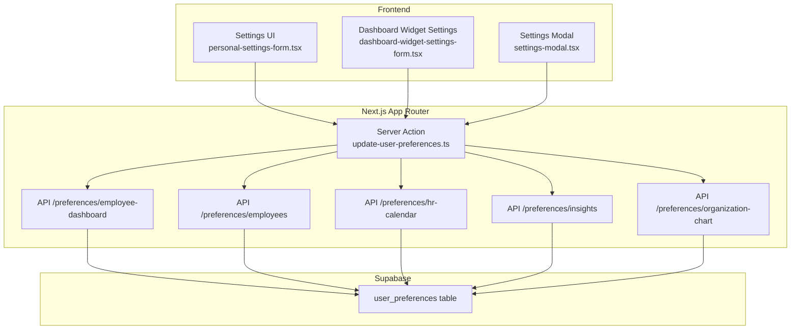
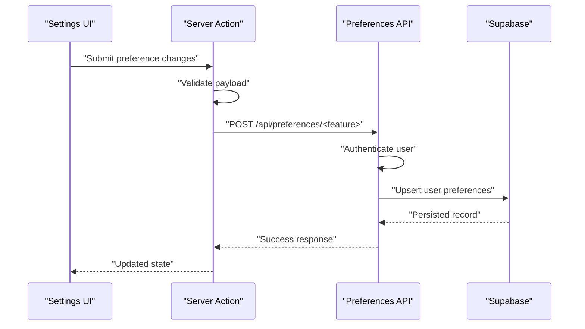
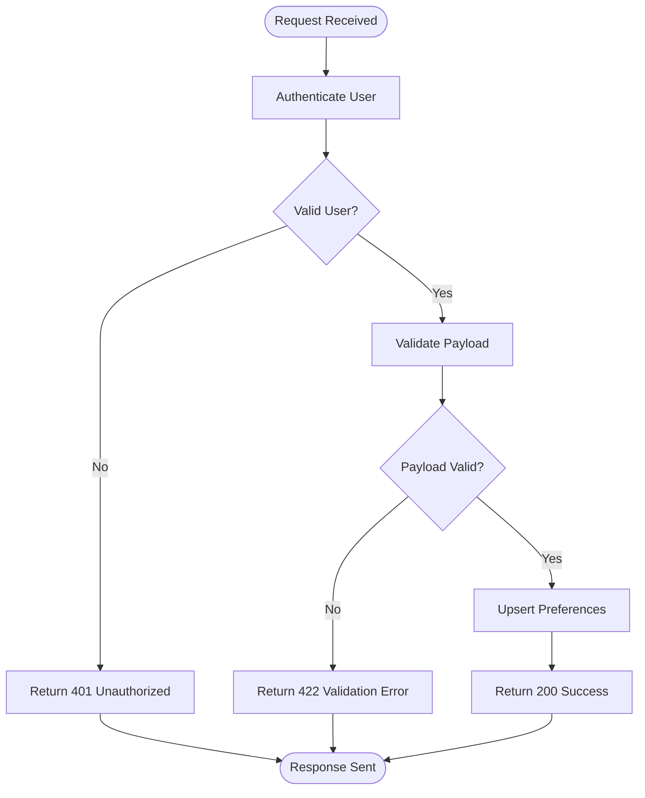
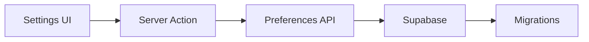

# User Preferences & Personalization

<cite>
**Referenced Files in This Document**
- [20260715070404_add_user_preferences.sql](file://apps/hr-suite/supabase/migrations/20260715070404_add_user_preferences.sql)
- [20260718180354_add_date_time_user_preferences.sql](file://apps/hr-suite/supabase/migrations/20260718180354_add_date_time_user_preferences.sql)
- [20260719112000_add_week_numbering_user_preference.sql](file://apps/hr-suite/supabase/migrations/20260719112000_add_week_numbering_user_preference.sql)
- [route.ts](file://apps/hr-suite/app/api/preferences/employee-dashboard/route.ts)
- [route.ts](file://apps/hr-suite/app/api/preferences/employees/route.ts)
- [route.ts](file://apps/hr-suite/app/api/preferences/hr-calendar/route.ts)
- [route.ts](file://apps/hr-suite/app/api/preferences/insights/route.ts)
- [route.ts](file://apps/hr-suite/app/api/preferences/organization-chart/route.ts)
- [update-user-preferences.ts](file://apps/hr-suite/app/actions/update-user-preferences.ts)
- [personal-settings-form.tsx](file://apps/hr-suite/components/settings/personal-settings-form.tsx)
- [dashboard-widget-settings-form.tsx](file://apps/hr-suite/components/settings/dashboard-widget-settings-form.tsx)
- [settings-modal.tsx](file://apps/hr-suite/components/layout/settings-modal.tsx)
- [user_preferences_isolation.sql](file://apps/hr-suite/supabase/tests/user_preferences_isolation.sql)
</cite>

## Table of Contents
1. [Introduction](#introduction)
2. [Project Structure](#project-structure)
3. [Core Components](#core-components)
4. [Architecture Overview](#architecture-overview)
5. [Detailed Component Analysis](#detailed-component-analysis)
6. [Dependency Analysis](#dependency-analysis)
7. [Performance Considerations](#performance-considerations)
8. [Troubleshooting Guide](#troubleshooting-guide)
9. [Conclusion](#conclusion)
10. [Appendices](#appendices)

## Introduction
This document explains LiquidHR’s User Preferences and Personalization system. It covers the preference schema, storage mechanisms, cross-device synchronization, and how preferences control dashboard visibility, widget configurations, and display settings. It also documents the personalization API endpoints for reading and updating preferences, integration with authentication for per-user isolation, examples for adding new preference types, implementing validation, handling migrations, and the settings UI components with accessibility considerations.

## Project Structure
The preferences feature spans database migrations, Next.js API routes, server actions, and UI components:
- Database layer: Supabase migrations define the user preferences table and indexes.
- API layer: Route handlers under app/api/preferences expose read/write operations scoped to the authenticated user.
- Server actions: A dedicated action updates preferences from client components.
- UI layer: Settings forms and modals provide interfaces for editing preferences.

**Diagram sources**
- [personal-settings-form.tsx](file://apps/hr-suite/components/settings/personal-settings-form.tsx)
- [dashboard-widget-settings-form.tsx](file://apps/hr-suite/components/settings/dashboard-widget-settings-form.tsx)
- [settings-modal.tsx](file://apps/hr-suite/components/layout/settings-modal.tsx)
- [update-user-preferences.ts](file://apps/hr-suite/app/actions/update-user-preferences.ts)
- [route.ts](file://apps/hr-suite/app/api/preferences/employee-dashboard/route.ts)
- [route.ts](file://apps/hr-suite/app/api/preferences/employees/route.ts)
- [route.ts](file://apps/hr-suite/app/api/preferences/hr-calendar/route.ts)
- [route.ts](file://apps/hr-suite/app/api/preferences/insights/route.ts)
- [route.ts](file://apps/hr-suite/app/api/preferences/organization-chart/route.ts)
- [20260715070404_add_user_preferences.sql](file://apps/hr-suite/supabase/migrations/20260715070404_add_user_preferences.sql)

**Section sources**
- [20260715070404_add_user_preferences.sql](file://apps/hr-suite/supabase/migrations/20260715070404_add_user_preferences.sql)
- [20260718180354_add_date_time_user_preferences.sql](file://apps/hr-suite/supabase/migrations/20260718180354_add_date_time_user_preferences.sql)
- [20260719112000_add_week_numbering_user_preference.sql](file://apps/hr-suite/supabase/migrations/20260719112000_add_week_numbering_user_preference.sql)
- [route.ts](file://apps/hr-suite/app/api/preferences/employee-dashboard/route.ts)
- [route.ts](file://apps/hr-suite/app/api/preferences/employees/route.ts)
- [route.ts](file://apps/hr-suite/app/api/preferences/hr-calendar/route.ts)
- [route.ts](file://apps/hr-suite/app/api/preferences/insights/route.ts)
- [route.ts](file://apps/hr-suite/app/api/preferences/organization-chart/route.ts)
- [update-user-preferences.ts](file://apps/hr-suite/app/actions/update-user-preferences.ts)
- [personal-settings-form.tsx](file://apps/hr-suite/components/settings/personal-settings-form.tsx)
- [dashboard-widget-settings-form.tsx](file://apps/hr-suite/components/settings/dashboard-widget-settings-form.tsx)
- [settings-modal.tsx](file://apps/hr-suite/components/layout/settings-modal.tsx)

## Core Components
- Preference Schema: Defined by Supabase migrations, including a base table for user preferences and subsequent migrations adding date/time and week numbering fields.
- API Endpoints: Per-feature routes under /api/preferences that read and update preferences for the authenticated user.
- Server Action: A centralized action to mutate preferences from the client.
- UI Components: Forms and modals to edit preferences and apply changes.

Key responsibilities:
- Enforce per-user isolation via authentication context.
- Validate inputs before persisting.
- Provide consistent responses for success and error states.
- Support cross-device sync through persistent storage.

**Section sources**
- [20260715070404_add_user_preferences.sql](file://apps/hr-suite/supabase/migrations/20260715070404_add_user_preferences.sql)
- [20260718180354_add_date_time_user_preferences.sql](file://apps/hr-suite/supabase/migrations/20260718180354_add_date_time_user_preferences.sql)
- [20260719112000_add_week_numbering_user_preference.sql](file://apps/hr-suite/supabase/migrations/20260719112000_add_week_numbering_user_preference.sql)
- [route.ts](file://apps/hr-suite/app/api/preferences/employee-dashboard/route.ts)
- [route.ts](file://apps/hr-suite/app/api/preferences/employees/route.ts)
- [route.ts](file://apps/hr-suite/app/api/preferences/hr-calendar/route.ts)
- [route.ts](file://apps/hr-suite/app/api/preferences/insights/route.ts)
- [route.ts](file://apps/hr-suite/app/api/preferences/organization-chart/route.ts)
- [update-user-preferences.ts](file://apps/hr-suite/app/actions/update-user-preferences.ts)

## Architecture Overview
The system follows a layered architecture:
- Client UI triggers preference edits.
- Server action validates and forwards mutations to API routes.
- API routes enforce authentication and authorization, then interact with Supabase.
- Migrations ensure schema evolution and data integrity.

**Diagram sources**
- [update-user-preferences.ts](file://apps/hr-suite/app/actions/update-user-preferences.ts)
- [route.ts](file://apps/hr-suite/app/api/preferences/employee-dashboard/route.ts)
- [route.ts](file://apps/hr-suite/app/api/preferences/employees/route.ts)
- [route.ts](file://apps/hr-suite/app/api/preferences/hr-calendar/route.ts)
- [route.ts](file://apps/hr-suite/app/api/preferences/insights/route.ts)
- [route.ts](file://apps/hr-suite/app/api/preferences/organization-chart/route.ts)
- [20260715070404_add_user_preferences.sql](file://apps/hr-suite/supabase/migrations/20260715070404_add_user_preferences.sql)

## Detailed Component Analysis

### Preference Schema and Storage
- Base schema: Introduced by the initial migration creating the user preferences table.
- Date/time preferences: Added via a dedicated migration to support localized date/time formatting.
- Week numbering preference: Added via a migration to control calendar week numbering behavior.
- Indexes: Optimized queries for fast retrieval by user and feature keys.

Storage characteristics:
- Persistent across devices due to server-side storage.
- Scoped per authenticated user to ensure isolation.
- Extensible key-value structure enabling new preference types without schema changes.

**Section sources**
- [20260715070404_add_user_preferences.sql](file://apps/hr-suite/supabase/migrations/20260715070404_add_user_preferences.sql)
- [20260718180354_add_date_time_user_preferences.sql](file://apps/hr-suite/supabase/migrations/20260718180354_add_date_time_user_preferences.sql)
- [20260719112000_add_week_numbering_user_preference.sql](file://apps/hr-suite/supabase/migrations/20260719112000_add_week_numbering_user_preference.sql)

### API Endpoints for Personalization
Endpoints are organized by feature area:
- Employee Dashboard preferences
- Employees list preferences
- HR Calendar preferences
- Insights preferences
- Organization Chart preferences

Each endpoint:
- Authenticates the current user.
- Validates request payloads.
- Reads or updates preferences in the database.
- Returns consistent success/error responses.

**Diagram sources**
- [route.ts](file://apps/hr-suite/app/api/preferences/employee-dashboard/route.ts)
- [route.ts](file://apps/hr-suite/app/api/preferences/employees/route.ts)
- [route.ts](file://apps/hr-suite/app/api/preferences/hr-calendar/route.ts)
- [route.ts](file://apps/hr-suite/app/api/preferences/insights/route.ts)
- [route.ts](file://apps/hr-suite/app/api/preferences/organization-chart/route.ts)

**Section sources**
- [route.ts](file://apps/hr-suite/app/api/preferences/employee-dashboard/route.ts)
- [route.ts](file://apps/hr-suite/app/api/preferences/employees/route.ts)
- [route.ts](file://apps/hr-suite/app/api/preferences/hr-calendar/route.ts)
- [route.ts](file://apps/hr-suite/app/api/preferences/insights/route.ts)
- [route.ts](file://apps/hr-suite/app/api/preferences/organization-chart/route.ts)

### Server Action for Updating Preferences
The server action centralizes mutation logic:
- Accepts preference payloads from UI components.
- Performs input validation.
- Calls appropriate API endpoints or directly persists changes.
- Provides feedback to the UI for success or errors.

Benefits:
- Reduces duplication across components.
- Ensures consistent validation and error handling.
- Keeps sensitive operations on the server.

**Section sources**
- [update-user-preferences.ts](file://apps/hr-suite/app/actions/update-user-preferences.ts)

### UI Components for Settings
- Personal Settings Form: Allows users to edit general preferences such as language, theme, and notification toggles.
- Dashboard Widget Settings Form: Enables configuring which widgets appear on dashboards and their layout.
- Settings Modal: Provides quick access to frequently used preferences.

Accessibility considerations:
- Use semantic HTML elements and proper labels.
- Ensure keyboard navigation and focus management.
- Provide clear error messages and success confirmations.
- Respect system color schemes and high contrast modes.

**Section sources**
- [personal-settings-form.tsx](file://apps/hr-suite/components/settings/personal-settings-form.tsx)
- [dashboard-widget-settings-form.tsx](file://apps/hr-suite/components/settings/dashboard-widget-settings-form.tsx)
- [settings-modal.tsx](file://apps/hr-suite/components/layout/settings-modal.tsx)

### Authentication and Isolation
- Each API route authenticates the current user before processing requests.
- Preferences are stored and retrieved using the authenticated user’s identifier.
- Tests verify isolation between users to prevent cross-user data leakage.

Isolation guarantees:
- Users cannot read or modify another user’s preferences.
- Multi-tenant environments maintain strict separation.

**Section sources**
- [route.ts](file://apps/hr-suite/app/api/preferences/employee-dashboard/route.ts)
- [route.ts](file://apps/hr-suite/app/api/preferences/employees/route.ts)
- [route.ts](file://apps/hr-suite/app/api/preferences/hr-calendar/route.ts)
- [route.ts](file://apps/hr-suite/app/api/preferences/insights/route.ts)
- [route.ts](file://apps/hr-suite/app/api/preferences/organization-chart/route.ts)
- [user_preferences_isolation.sql](file://apps/hr-suite/supabase/tests/user_preferences_isolation.sql)

### Adding New Preference Types
Steps to add a new preference type:
1. Define the preference key and value schema in the relevant API route.
2. Add validation rules in the server action or route handler.
3. Update the UI component to include the new setting.
4. If needed, extend the database schema via a migration.
5. Write tests to validate behavior and isolation.

Example references:
- See how date/time and week numbering preferences were added via migrations and corresponding API routes.

**Section sources**
- [20260718180354_add_date_time_user_preferences.sql](file://apps/hr-suite/supabase/migrations/20260718180354_add_date_time_user_preferences.sql)
- [20260719112000_add_week_numbering_user_preference.sql](file://apps/hr-suite/supabase/migrations/20260719112000_add_week_numbering_user_preference.sql)
- [update-user-preferences.ts](file://apps/hr-suite/app/actions/update-user-preferences.ts)
- [route.ts](file://apps/hr-suite/app/api/preferences/employee-dashboard/route.ts)

### Implementing Preference Validation
Validation strategies:
- Input shape validation at the API route level.
- Business rule validation in the server action.
- Default values for missing keys to ensure backward compatibility.

Best practices:
- Return detailed error messages for failed validations.
- Log validation failures for debugging.
- Keep validation rules close to the data boundary.

**Section sources**
- [update-user-preferences.ts](file://apps/hr-suite/app/actions/update-user-preferences.ts)
- [route.ts](file://apps/hr-suite/app/api/preferences/employee-dashboard/route.ts)

### Handling Preference Migrations
Migration guidelines:
- Create a new migration file for each schema change.
- Include up and down operations where applicable.
- Test migrations against sample data.
- Update API routes and UI components to handle new fields gracefully.

Examples:
- Date/time preferences migration introduced new columns.
- Week numbering migration added a boolean flag.

**Section sources**
- [20260718180354_add_date_time_user_preferences.sql](file://apps/hr-suite/supabase/migrations/20260718180354_add_date_time_user_preferences.sql)
- [20260719112000_add_week_numbering_user_preference.sql](file://apps/hr-suite/supabase/migrations/20260719112000_add_week_numbering_user_preference.sql)

## Dependency Analysis
The preferences system has clear dependencies:
- UI components depend on the server action for mutations.
- Server actions depend on API routes for persistence.
- API routes depend on Supabase for data storage.
- Migrations define the schema that all layers rely on.

**Diagram sources**
- [personal-settings-form.tsx](file://apps/hr-suite/components/settings/personal-settings-form.tsx)
- [update-user-preferences.ts](file://apps/hr-suite/app/actions/update-user-preferences.ts)
- [route.ts](file://apps/hr-suite/app/api/preferences/employee-dashboard/route.ts)
- [20260715070404_add_user_preferences.sql](file://apps/hr-suite/supabase/migrations/20260715070404_add_user_preferences.sql)

**Section sources**
- [personal-settings-form.tsx](file://apps/hr-suite/components/settings/personal-settings-form.tsx)
- [update-user-preferences.ts](file://apps/hr-suite/app/actions/update-user-preferences.ts)
- [route.ts](file://apps/hr-suite/app/api/preferences/employee-dashboard/route.ts)
- [20260715070404_add_user_preferences.sql](file://apps/hr-suite/supabase/migrations/20260715070404_add_user_preferences.sql)

## Performance Considerations
- Use efficient queries with indexed lookups by user and feature keys.
- Batch updates when possible to reduce round trips.
- Cache frequently accessed preferences on the client side with invalidation on updates.
- Avoid unnecessary re-renders by memoizing preference values in UI components.

[No sources needed since this section provides general guidance]

## Troubleshooting Guide
Common issues and resolutions:
- Authentication failures: Verify user session and token validity.
- Validation errors: Check payload structure and required fields.
- Data isolation problems: Ensure user context is correctly passed to API routes.
- Migration conflicts: Review migration history and rollback steps.

Debugging tips:
- Enable detailed logging in API routes.
- Inspect network requests and responses.
- Run isolation tests to confirm per-user boundaries.

**Section sources**
- [user_preferences_isolation.sql](file://apps/hr-suite/supabase/tests/user_preferences_isolation.sql)

## Conclusion
LiquidHR’s User Preferences and Personalization system provides a robust, scalable foundation for per-user customization. The layered architecture ensures security, performance, and maintainability. By following the documented patterns for adding new preferences, validating inputs, and migrating schemas, teams can extend the system confidently while preserving isolation and reliability.

[No sources needed since this section summarizes without analyzing specific files]

## Appendices

### Example: Adding a New Preference Type
- Define the preference key and value constraints.
- Update the server action to accept and validate the new field.
- Extend the relevant API route to handle the new preference.
- Modify UI components to present and edit the new setting.
- Add a migration if the schema requires new columns.

References:
- [update-user-preferences.ts](file://apps/hr-suite/app/actions/update-user-preferences.ts)
- [route.ts](file://apps/hr-suite/app/api/preferences/employee-dashboard/route.ts)
- [20260718180354_add_date_time_user_preferences.sql](file://apps/hr-suite/supabase/migrations/20260718180354_add_date_time_user_preferences.sql)

### Accessibility Checklist for Preference Management
- Semantic markup and labels for all form controls.
- Keyboard navigable interface with visible focus indicators.
- Clear error messaging and success confirmations.
- Support for screen readers and assistive technologies.
- High contrast and reduced motion preferences respected.

References:
- [personal-settings-form.tsx](file://apps/hr-suite/components/settings/personal-settings-form.tsx)
- [dashboard-widget-settings-form.tsx](file://apps/hr-suite/components/settings/dashboard-widget-settings-form.tsx)
- [settings-modal.tsx](file://apps/hr-suite/components/layout/settings-modal.tsx)