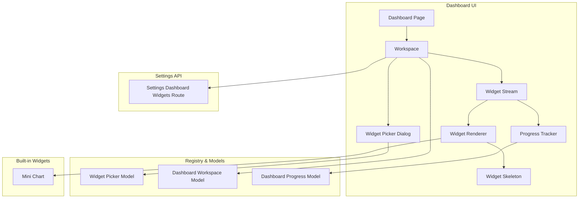
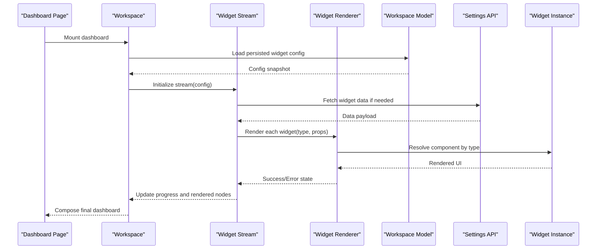
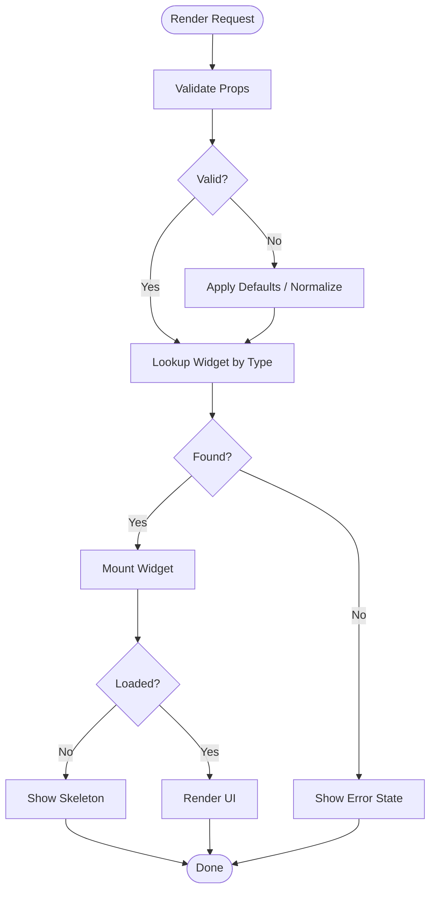
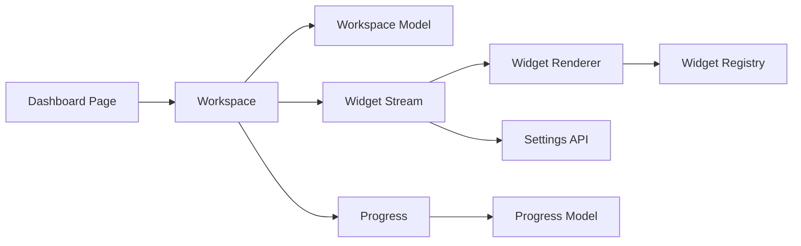

# Widget Architecture

<cite>
**Referenced Files in This Document**
- [dashboard-widget-stream.tsx](file://apps/hr-suite/components/dashboard/dashboard-widget-stream.tsx)
- [widget-renderer.tsx](file://apps/hr-suite/components/dashboard/widget-renderer.tsx)
- [mini-chart.tsx](file://apps/hr-suite/components/dashboard/mini-chart.tsx)
- [widget-picker-model.ts](file://apps/hr-suite/components/dashboard/widget-picker-model.ts)
- [widget-picker-dialog.tsx](file://apps/hr-suite/components/dashboard/widget-picker-dialog.tsx)
- [dashboard-workspace.tsx](file://apps/hr-suite/components/dashboard/dashboard-workspace.tsx)
- [dashboard-workspace-model.ts](file://apps/hr-suite/components/dashboard/dashboard-workspace-model.ts)
- [dashboard-progress.tsx](file://apps/hr-suite/components/dashboard/dashboard-progress.tsx)
- [dashboard-progress-model.ts](file://apps/hr-suite/components/dashboard/dashboard-progress-model.ts)
- [widget-skeleton.tsx](file://apps/hr-suite/components/dashboard/widget-skeleton.tsx)
- [dashboard-page.tsx](file://apps/hr-suite/app/(dashboard)/dashboard/page.tsx)
- [dashboard-loading.tsx](file://apps/hr-suite/app/(dashboard)/dashboard/loading.tsx)
- [settings-dashboard-widgets-route.ts](file://apps/hr-suite/app/api/settings/dashboard-widgets/route.ts)
- [employee-dashboard.tsx](file://apps/hr-suite/components/employees/employee-dashboard.tsx)
</cite>

## Table of Contents
1. Introduction
2. Project Structure
3. Core Components
4. Architecture Overview
5. Detailed Component Analysis
6. Dependency Analysis
7. Performance Considerations
8. Troubleshooting Guide
9. Conclusion

## Introduction
This document explains LiquidHR’s Widget Architecture system with a focus on the widget lifecycle, registration mechanism, and rendering pipeline. It covers the widget interface contract, props validation, event handling patterns, built-in widget types (charts, tables, metrics displays, lists), and the widget registry that manages availability and configuration. Practical guidance is provided for creating custom widgets using TypeScript interfaces, state management, and error handling. The document also includes widget composition patterns, data binding strategies, performance optimization techniques, testing approaches, and debugging tools.

## Project Structure
The widget system lives primarily under apps/hr-suite/components/dashboard and integrates with Next.js app routes for settings and dashboards. Key areas:
- Rendering pipeline: widget stream, renderer, skeleton placeholders
- Registry and picker: model and dialog for discovering and selecting widgets
- Workspace and progress: orchestration of widget loading and progress tracking
- Built-in widgets: mini-chart and others
- Settings API: persistence and retrieval of dashboard widget configurations

**Diagram sources**
- [dashboard-page.tsx](file://apps/hr-suite/app/(dashboard)/dashboard/page.tsx)
- [dashboard-workspace.tsx](file://apps/hr-suite/components/dashboard/dashboard-workspace.tsx)
- [dashboard-widget-stream.tsx](file://apps/hr-suite/components/dashboard/dashboard-widget-stream.tsx)
- [widget-renderer.tsx](file://apps/hr-suite/components/dashboard/widget-renderer.tsx)
- [widget-skeleton.tsx](file://apps/hr-suite/components/dashboard/widget-skeleton.tsx)
- [widget-picker-dialog.tsx](file://apps/hr-suite/components/dashboard/widget-picker-dialog.tsx)
- [widget-picker-model.ts](file://apps/hr-suite/components/dashboard/widget-picker-model.ts)
- [dashboard-workspace-model.ts](file://apps/hr-suite/components/dashboard/dashboard-workspace-model.ts)
- [dashboard-progress.tsx](file://apps/hr-suite/components/dashboard/dashboard-progress.tsx)
- [dashboard-progress-model.ts](file://apps/hr-suite/components/dashboard/dashboard-progress-model.ts)
- [mini-chart.tsx](file://apps/hr-suite/components/dashboard/mini-chart.tsx)
- [settings-dashboard-widgets-route.ts](file://apps/hr-suite/app/api/settings/dashboard-widgets/route.ts)

**Section sources**
- [dashboard-page.tsx](file://apps/hr-suite/app/(dashboard)/dashboard/page.tsx)
- [dashboard-workspace.tsx](file://apps/hr-suite/components/dashboard/dashboard-workspace.tsx)
- [dashboard-widget-stream.tsx](file://apps/hr-suite/components/dashboard/dashboard-widget-stream.tsx)
- [widget-renderer.tsx](file://apps/hr-suite/components/dashboard/widget-renderer.tsx)
- [widget-skeleton.tsx](file://apps/hr-suite/components/dashboard/widget-skeleton.tsx)
- [widget-picker-dialog.tsx](file://apps/hr-suite/components/dashboard/widget-picker-dialog.tsx)
- [widget-picker-model.ts](file://apps/hr-suite/components/dashboard/widget-picker-model.ts)
- [dashboard-workspace-model.ts](file://apps/hr-suite/components/dashboard/dashboard-workspace-model.ts)
- [dashboard-progress.tsx](file://apps/hr-suite/components/dashboard/dashboard-progress.tsx)
- [dashboard-progress-model.ts](file://apps/hr-suite/components/dashboard/dashboard-progress-model.ts)
- [mini-chart.tsx](file://apps/hr-suite/components/dashboard/mini-chart.tsx)
- [settings-dashboard-widgets-route.ts](file://apps/hr-suite/app/api/settings/dashboard-widgets/route.ts)

## Core Components
- Widget Stream: Coordinates fetching and streaming of widget instances based on workspace configuration.
- Widget Renderer: Resolves a widget by its type, validates props, renders the component, and handles errors and skeletons.
- Widget Skeleton: Lightweight placeholder shown while widgets are loading or unavailable.
- Widget Picker Model: Encapsulates available widget definitions, metadata, and selection logic.
- Widget Picker Dialog: User-facing UI to browse and add widgets to the dashboard.
- Dashboard Workspace Model: Manages layout, ordering, and persistence of widgets per dashboard.
- Dashboard Progress: Tracks loading states across multiple widgets and exposes aggregated progress.
- Mini Chart: A built-in chart widget demonstrating data binding and rendering patterns.

**Section sources**
- [dashboard-widget-stream.tsx](file://apps/hr-suite/components/dashboard/dashboard-widget-stream.tsx)
- [widget-renderer.tsx](file://apps/hr-suite/components/dashboard/widget-renderer.tsx)
- [widget-skeleton.tsx](file://apps/hr-suite/components/dashboard/widget-skeleton.tsx)
- [widget-picker-model.ts](file://apps/hr-suite/components/dashboard/widget-picker-model.ts)
- [widget-picker-dialog.tsx](file://apps/hr-suite/components/dashboard/widget-picker-dialog.tsx)
- [dashboard-workspace-model.ts](file://apps/hr-suite/components/dashboard/dashboard-workspace-model.ts)
- [dashboard-progress.tsx](file://apps/hr-suite/components/dashboard/dashboard-progress.tsx)
- [mini-chart.tsx](file://apps/hr-suite/components/dashboard/mini-chart.tsx)

## Architecture Overview
The widget architecture follows a clear separation of concerns:
- Configuration and registry live in models and dialogs.
- Data flow is orchestrated by the widget stream.
- Rendering is delegated to a generic renderer that resolves components by type.
- Progress and skeletons provide UX feedback during asynchronous operations.
- Settings API persists widget configurations.

**Diagram sources**
- [dashboard-page.tsx](file://apps/hr-suite/app/(dashboard)/dashboard/page.tsx)
- [dashboard-workspace.tsx](file://apps/hr-suite/components/dashboard/dashboard-workspace.tsx)
- [dashboard-widget-stream.tsx](file://apps/hr-suite/components/dashboard/dashboard-widget-stream.tsx)
- [widget-renderer.tsx](file://apps/hr-suite/components/dashboard/widget-renderer.tsx)
- [dashboard-workspace-model.ts](file://apps/hr-suite/components/dashboard/dashboard-workspace-model.ts)
- [settings-dashboard-widgets-route.ts](file://apps/hr-suite/app/api/settings/dashboard-widgets/route.ts)

## Detailed Component Analysis

### Widget Interface Contract
A widget is a React component that receives strongly-typed props defined by the widget registry. The contract typically includes:
- Type identifier: string used to resolve the widget implementation.
- Props schema: validated at render time; defaults applied when missing.
- Event callbacks: optional handlers for user interactions emitted up to the parent.
- Lifecycle hooks: optional methods for mounting, updating, and cleanup.

Props validation ensures robustness against misconfiguration and enables safe defaults. Error boundaries can wrap widgets to prevent crashes from propagating.

**Section sources**
- [widget-renderer.tsx](file://apps/hr-suite/components/dashboard/widget-renderer.tsx)
- [widget-picker-model.ts](file://apps/hr-suite/components/dashboard/widget-picker-model.ts)

### Widget Registration Mechanism
Widgets are registered via a central registry that maps type strings to implementations and metadata:
- Metadata includes title, description, category, and required/optional props.
- Registration occurs at module load time to make widgets discoverable.
- The picker model queries the registry to present available widgets.

Registration should be centralized to avoid duplication and ensure consistent behavior.

**Section sources**
- [widget-picker-model.ts](file://apps/hr-suite/components/dashboard/widget-picker-model.ts)
- [widget-picker-dialog.tsx](file://apps/hr-suite/components/dashboard/widget-picker-dialog.tsx)

### Rendering Pipeline
The rendering pipeline resolves and renders widgets consistently:
- Input: widget type and validated props.
- Resolution: lookup in registry to find the component.
- Rendering: mount component with props and event handlers.
- Fallbacks: show skeleton while loading; handle errors gracefully.

**Diagram sources**
- [widget-renderer.tsx](file://apps/hr-suite/components/dashboard/widget-renderer.tsx)
- [widget-skeleton.tsx](file://apps/hr-suite/components/dashboard/widget-skeleton.tsx)

**Section sources**
- [widget-renderer.tsx](file://apps/hr-suite/components/dashboard/widget-renderer.tsx)
- [widget-skeleton.tsx](file://apps/hr-suite/components/dashboard/widget-skeleton.tsx)

### Event Handling Patterns
Widgets emit events through callback props passed by the renderer or workspace. Recommended patterns:
- Use typed event payloads to ensure consistency.
- Debounce frequent events (e.g., scroll, resize).
- Centralize event handling in the workspace or stream to coordinate cross-widget actions.

**Section sources**
- [widget-renderer.tsx](file://apps/hr-suite/components/dashboard/widget-renderer.tsx)
- [dashboard-workspace.tsx](file://apps/hr-suite/components/dashboard/dashboard-workspace.tsx)

### Built-in Widget Types
- Mini Chart: Displays compact trend lines or bar charts with configurable datasets and styling. Demonstrates data binding and lightweight rendering.
- Tables: List-based widgets for tabular data with sorting, filtering, and pagination.
- Metrics Displays: Numeric summaries with formatting, thresholds, and color coding.
- List Widgets: Scrollable lists with item actions and lazy loading.

These built-ins illustrate common patterns for data fetching, memoization, and responsive layouts.

**Section sources**
- [mini-chart.tsx](file://apps/hr-suite/components/dashboard/mini-chart.tsx)

### Widget Registry System
The registry manages widget availability and configuration:
- Defines widget schemas and default props.
- Exposes discovery APIs for the picker dialog.
- Integrates with settings to persist user-selected widgets.

Configuration changes trigger re-rendering of affected widgets without reloading the entire dashboard.

**Section sources**
- [widget-picker-model.ts](file://apps/hr-suite/components/dashboard/widget-picker-model.ts)
- [settings-dashboard-widgets-route.ts](file://apps/hr-suite/app/api/settings/dashboard-widgets/route.ts)

### Creating Custom Widgets
To create a custom widget:
- Define a TypeScript interface for props with validation rules.
- Implement the component following the widget contract (type, props, events).
- Register the widget in the registry with metadata and default props.
- Wire up event handlers in the workspace or stream.
- Add tests for props validation, rendering, and event emission.

State management should be local to the widget unless shared state is required; use context sparingly and prefer prop-driven updates.

**Section sources**
- [widget-picker-model.ts](file://apps/hr-suite/components/dashboard/widget-picker-model.ts)
- [widget-renderer.tsx](file://apps/hr-suite/components/dashboard/widget-renderer.tsx)

### Widget Composition Patterns
Compose complex widgets by combining smaller, reusable pieces:
- Container components manage data and pass down pure presentational props.
- Layout wrappers standardize spacing and responsiveness.
- Decorators add behaviors like tooltips, animations, or accessibility enhancements.

Composition improves testability and reuse across widgets.

**Section sources**
- [dashboard-workspace.tsx](file://apps/hr-suite/components/dashboard/dashboard-workspace.tsx)

### Data Binding Strategies
- Declarative props: pass data as immutable props; derive state locally when needed.
- Memoization: use memoized selectors to avoid unnecessary recalculations.
- Lazy loading: fetch data on demand and cache results within the widget or workspace.
- Streaming updates: push incremental updates via the widget stream to keep UI responsive.

**Section sources**
- [dashboard-widget-stream.tsx](file://apps/hr-suite/components/dashboard/dashboard-widget-stream.tsx)

### Performance Optimization Techniques
- Render only visible widgets using virtualization where appropriate.
- Defer heavy computations off the main thread or debounce inputs.
- Cache API responses and deduplicate requests.
- Use skeleton placeholders to improve perceived performance.
- Avoid deep object cloning; prefer structural sharing.

**Section sources**
- [widget-skeleton.tsx](file://apps/hr-suite/components/dashboard/widget-skeleton.tsx)
- [dashboard-progress.tsx](file://apps/hr-suite/components/dashboard/dashboard-progress.tsx)

### Testing Approaches
- Unit tests for widget props validation and rendering.
- Integration tests for widget interaction flows and event handling.
- Snapshot tests for stable UI structures.
- Mock external data sources and timers for deterministic tests.

**Section sources**
- [widget-renderer.tsx](file://apps/hr-suite/components/dashboard/widget-renderer.tsx)
- [widget-picker-model.ts](file://apps/hr-suite/components/dashboard/widget-picker-model.ts)

### Debugging Tools
- Enable verbose logging in the widget stream and renderer.
- Inspect widget props and state via React DevTools.
- Use progress indicators to identify slow-loading widgets.
- Capture error boundaries to log stack traces and context.

**Section sources**
- [dashboard-progress.tsx](file://apps/hr-suite/components/dashboard/dashboard-progress.tsx)
- [widget-renderer.tsx](file://apps/hr-suite/components/dashboard/widget-renderer.tsx)

## Dependency Analysis
The widget system has clear dependencies between UI layers and models:
- Dashboard page depends on workspace for layout and orchestration.
- Workspace depends on workspace model for configuration and persistence.
- Widget stream depends on settings API for data and on renderer for output.
- Renderer depends on registry for component resolution.
- Progress tracks dependencies across widgets.

**Diagram sources**
- [dashboard-page.tsx](file://apps/hr-suite/app/(dashboard)/dashboard/page.tsx)
- [dashboard-workspace.tsx](file://apps/hr-suite/components/dashboard/dashboard-workspace.tsx)
- [dashboard-workspace-model.ts](file://apps/hr-suite/components/dashboard/dashboard-workspace-model.ts)
- [dashboard-widget-stream.tsx](file://apps/hr-suite/components/dashboard/dashboard-widget-stream.tsx)
- [widget-renderer.tsx](file://apps/hr-suite/components/dashboard/widget-renderer.tsx)
- [widget-picker-model.ts](file://apps/hr-suite/components/dashboard/widget-picker-model.ts)
- [dashboard-progress.tsx](file://apps/hr-suite/components/dashboard/dashboard-progress.tsx)
- [dashboard-progress-model.ts](file://apps/hr-suite/components/dashboard/dashboard-progress-model.ts)
- [settings-dashboard-widgets-route.ts](file://apps/hr-suite/app/api/settings/dashboard-widgets/route.ts)

**Section sources**
- [dashboard-page.tsx](file://apps/hr-suite/app/(dashboard)/dashboard/page.tsx)
- [dashboard-workspace.tsx](file://apps/hr-suite/components/dashboard/dashboard-workspace.tsx)
- [dashboard-workspace-model.ts](file://apps/hr-suite/components/dashboard/dashboard-workspace-model.ts)
- [dashboard-widget-stream.tsx](file://apps/hr-suite/components/dashboard/dashboard-widget-stream.tsx)
- [widget-renderer.tsx](file://apps/hr-suite/components/dashboard/widget-renderer.tsx)
- [widget-picker-model.ts](file://apps/hr-suite/components/dashboard/widget-picker-model.ts)
- [dashboard-progress.tsx](file://apps/hr-suite/components/dashboard/dashboard-progress.tsx)
- [dashboard-progress-model.ts](file://apps/hr-suite/components/dashboard/dashboard-progress-model.ts)
- [settings-dashboard-widgets-route.ts](file://apps/hr-suite/app/api/settings/dashboard-widgets/route.ts)

## Performance Considerations
- Prefer memoization for expensive computations and derived data.
- Use virtualization for large lists and tables.
- Batch state updates to minimize re-renders.
- Implement lazy loading for off-screen widgets.
- Cache network responses and deduplicate requests.
- Keep widget bundles small by code-splitting where feasible.

[No sources needed since this section provides general guidance]

## Troubleshooting Guide
Common issues and resolutions:
- Widget not found: verify registry mapping and type string.
- Props validation failures: check schema and defaults; inspect runtime logs.
- Slow rendering: profile with React DevTools; look for unnecessary re-renders.
- Missing data: confirm API routes and error boundaries; check progress indicators.
- Event not firing: ensure handlers are wired and payloads match expected shapes.

**Section sources**
- [widget-renderer.tsx](file://apps/hr-suite/components/dashboard/widget-renderer.tsx)
- [dashboard-progress.tsx](file://apps/hr-suite/components/dashboard/dashboard-progress.tsx)

## Conclusion
LiquidHR’s Widget Architecture provides a robust, extensible foundation for building dynamic dashboards. By adhering to the widget interface contract, leveraging the registry and renderer, and applying performance and testing best practices, developers can create reliable, maintainable widgets that compose into rich user experiences. The built-in widgets demonstrate practical patterns for data binding, event handling, and responsive design, while the registry and settings integration enable flexible configuration and persistence.

[No sources needed since this section summarizes without analyzing specific files]