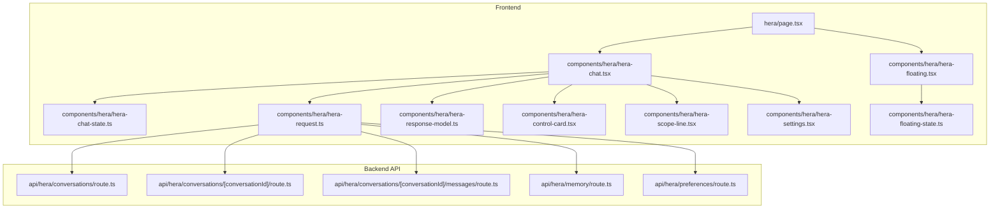
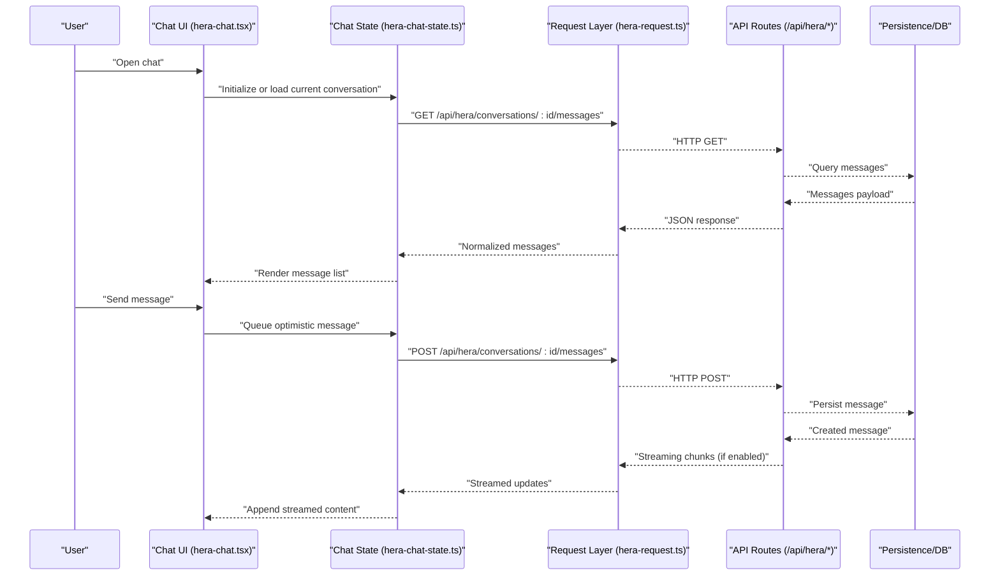
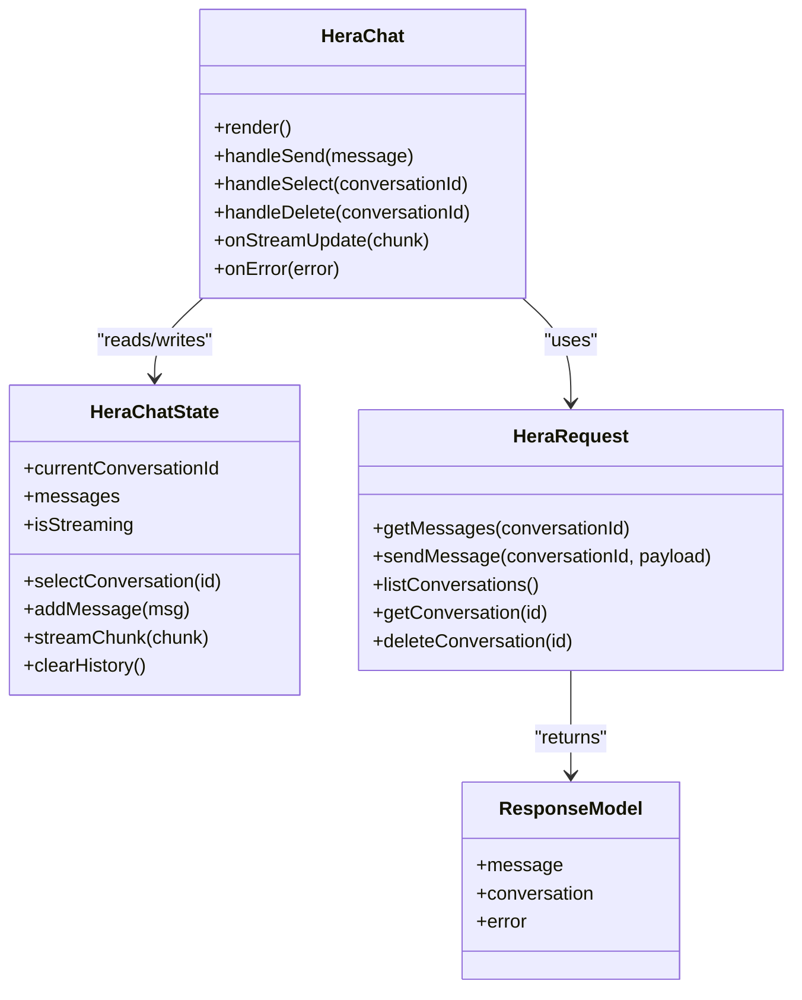
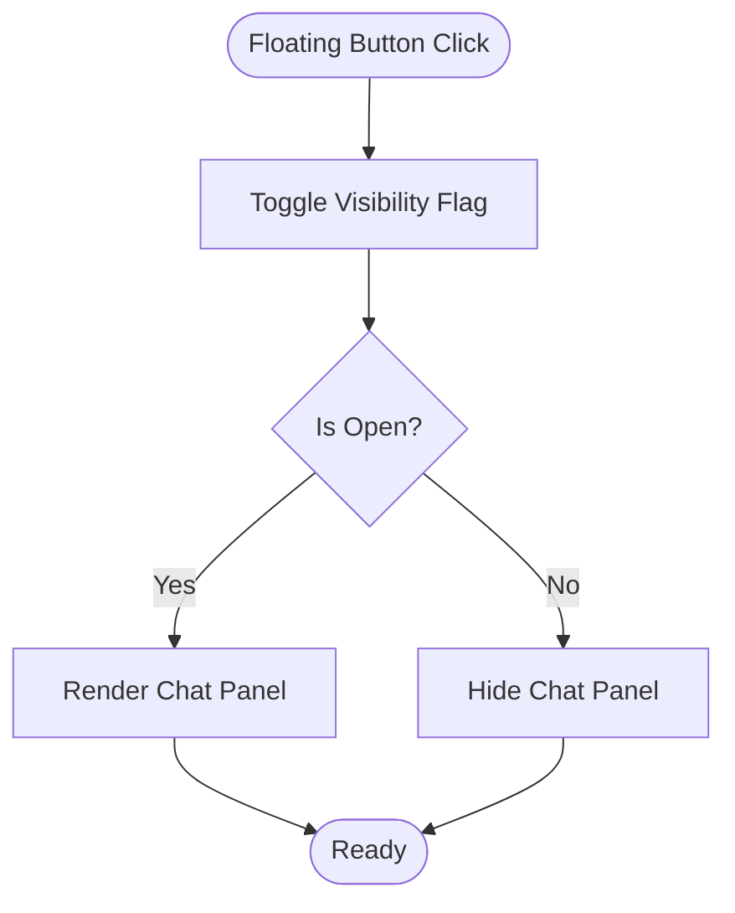
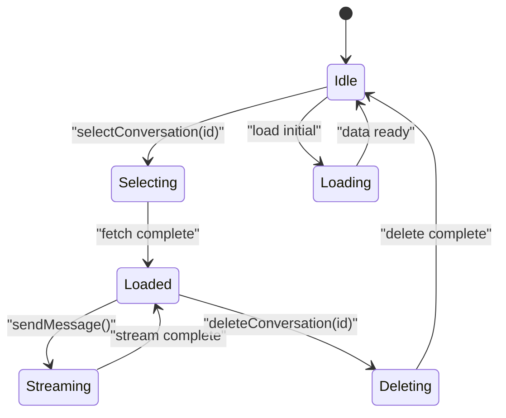
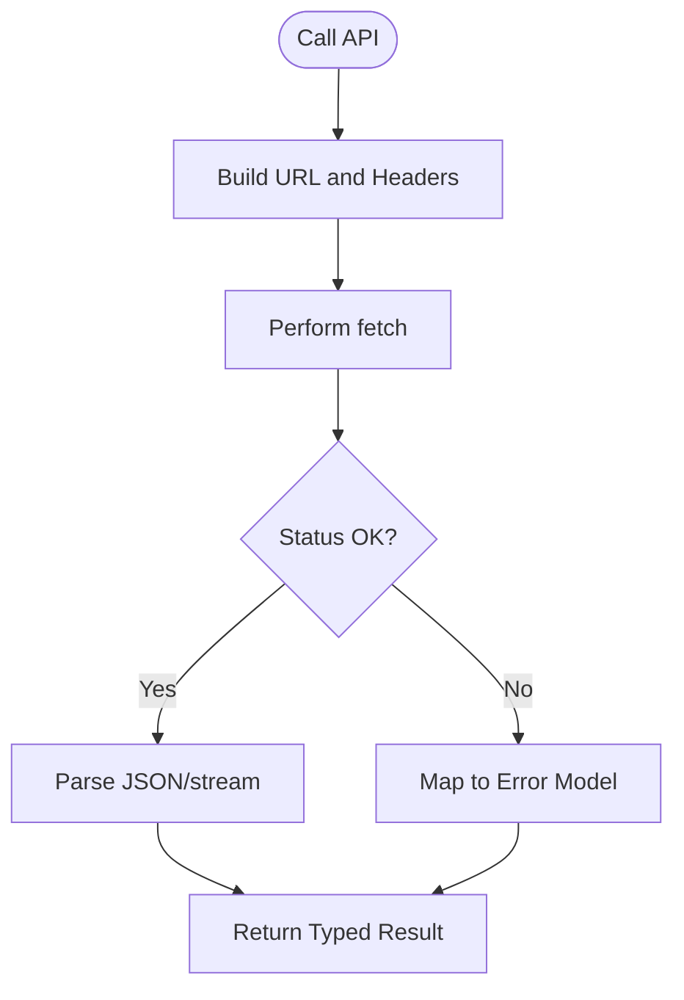
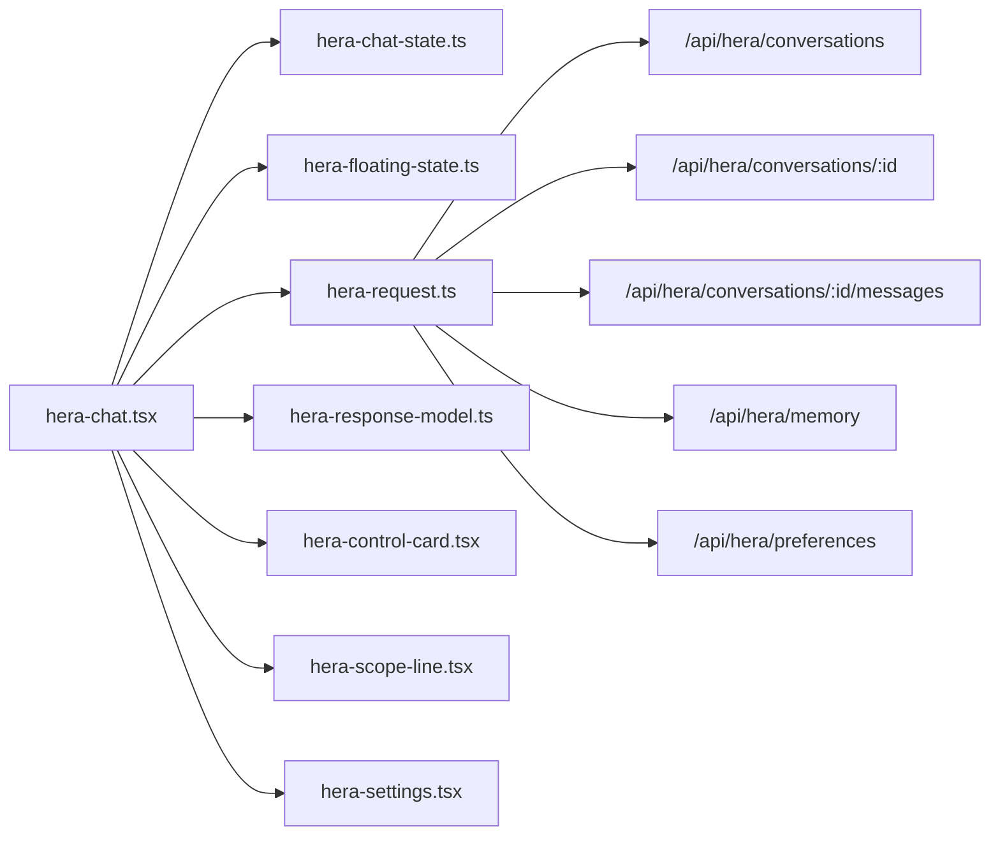

# Chat Interface & Conversation Management

<cite>
**Referenced Files in This Document**
- [apps/hr-suite/app/(dashboard)/hera/page.tsx](file://apps/hr-suite/app/(dashboard)/hera/page.tsx)
- [apps/hr-suite/components/hera/hera-chat.tsx](file://apps/hr-suite/components/hera/hera-chat.tsx)
- [apps/hr-suite/components/hera/hera-floating.tsx](file://apps/hr-suite/components/hera/hera-floating.tsx)
- [apps/hr-suite/components/hera/hera-chat-state.ts](file://apps/hr-suite/components/hera/hera-chat-state.ts)
- [apps/hr-suite/components/hera/hera-floating-state.ts](file://apps/hr-suite/components/hera/hera-floating-state.ts)
- [apps/hr-suite/components/hera/hera-request.ts](file://apps/hr-suite/components/hera/hera-request.ts)
- [apps/hr-suite/components/hera/hera-response-model.ts](file://apps/hr-suite/components/hera/hera-response-model.ts)
- [apps/hr-suite/components/hera/hera-control-card.tsx](file://apps/hr-suite/components/hera/hera-control-card.tsx)
- [apps/hr-suite/components/hera/hera-scope-line.tsx](file://apps/hr-suite/components/hera/hera-scope-line.tsx)
- [apps/hr-suite/components/hera/hera-settings.tsx](file://apps/hr-suite/components/hera/hera-settings.tsx)
- [apps/hr-suite/app/api/hera/conversations/route.ts](file://apps/hr-suite/app/api/hera/conversations/route.ts)
- [apps/hr-suite/app/api/hera/conversations/[conversationId]/route.ts](file://apps/hr-suite/app/api/hera/conversations/[conversationId]/route.ts)
- [apps/hr-suite/app/api/hera/conversations/[conversationId]/messages/route.ts](file://apps/hr-suite/app/api/hera/conversations/[conversationId]/messages/route.ts)
- [apps/hr-suite/app/api/hera/memory/route.ts](file://apps/hr-suite/app/api/hera/memory/route.ts)
- [apps/hr-suite/app/api/hera/preferences/route.ts](file://apps/hr-suite/app/api/hera/preferences/route.ts)
</cite>

## Table of Contents
1. [Introduction](#introduction)
2. [Project Structure](#project-structure)
3. [Core Components](#core-components)
4. [Architecture Overview](#architecture-overview)
5. [Detailed Component Analysis](#detailed-component-analysis)
6. [Dependency Analysis](#dependency-analysis)
7. [Performance Considerations](#performance-considerations)
8. [Troubleshooting Guide](#troubleshooting-guide)
9. [Conclusion](#conclusion)
10. [Appendices](#appendices)

## Introduction
This document explains HERA’s chat interface and conversation management system within the LiquidHR application. It covers the main chat component architecture, floating UI implementation, conversation state management, message handling flow, real-time updates, user interaction patterns, and backend API endpoints for conversation CRUD, message streaming, and metadata management. It also includes guidance on customizing appearance, implementing persistence, handling different message types, and optimizing performance for large histories and memory usage.

## Project Structure
HERA’s chat is implemented as a Next.js feature with:
- A page entry that renders the chat shell
- React components for the chat UI and floating launcher
- State modules for chat and floating UI behavior
- Request/response models and HTTP helpers
- Server routes under /api/hera for conversations, messages, memory, and preferences

**Diagram sources**
- [apps/hr-suite/app/(dashboard)/hera/page.tsx](file://apps/hr-suite/app/(dashboard)/hera/page.tsx)
- [apps/hr-suite/components/hera/hera-chat.tsx](file://apps/hr-suite/components/hera/hera-chat.tsx)
- [apps/hr-suite/components/hera/hera-floating.tsx](file://apps/hr-suite/components/hera/hera-floating.tsx)
- [apps/hr-suite/components/hera/hera-chat-state.ts](file://apps/hr-suite/components/hera/hera-chat-state.ts)
- [apps/hr-suite/components/hera/hera-floating-state.ts](file://apps/hr-suite/components/hera/hera-floating-state.ts)
- [apps/hr-suite/components/hera/hera-request.ts](file://apps/hr-suite/components/hera/hera-request.ts)
- [apps/hr-suite/components/hera/hera-response-model.ts](file://apps/hr-suite/components/hera/hera-response-model.ts)
- [apps/hr-suite/components/hera/hera-control-card.tsx](file://apps/hr-suite/components/hera/hera-control-card.tsx)
- [apps/hr-suite/components/hera/hera-scope-line.tsx](file://apps/hr-suite/components/hera/hera-scope-line.tsx)
- [apps/hr-suite/components/hera/hera-settings.tsx](file://apps/hr-suite/components/hera/hera-settings.tsx)
- [apps/hr-suite/app/api/hera/conversations/route.ts](file://apps/hr-suite/app/api/hera/conversations/route.ts)
- [apps/hr-suite/app/api/hera/conversations/[conversationId]/route.ts](file://apps/hr-suite/app/api/hera/conversations/[conversationId]/route.ts)
- [apps/hr-suite/app/api/hera/conversations/[conversationId]/messages/route.ts](file://apps/hr-suite/app/api/hera/conversations/[conversationId]/messages/route.ts)
- [apps/hr-suite/app/api/hera/memory/route.ts](file://apps/hr-suite/app/api/hera/memory/route.ts)
- [apps/hr-suite/app/api/hera/preferences/route.ts](file://apps/hr-suite/app/api/hera/preferences/route.ts)

**Section sources**
- [apps/hr-suite/app/(dashboard)/hera/page.tsx](file://apps/hr-suite/app/(dashboard)/hera/page.tsx)
- [apps/hr-suite/components/hera/hera-chat.tsx](file://apps/hr-suite/components/hera/hera-chat.tsx)
- [apps/hr-suite/components/hera/hera-floating.tsx](file://apps/hr-suite/components/hera/hera-floating.tsx)
- [apps/hr-suite/components/hera/hera-chat-state.ts](file://apps/hr-suite/components/hera/hera-chat-state.ts)
- [apps/hr-suite/components/hera/hera-floating-state.ts](file://apps/hr-suite/components/hera/hera-floating-state.ts)
- [apps/hr-suite/components/hera/hera-request.ts](file://apps/hr-suite/components/hera/hera-request.ts)
- [apps/hr-suite/components/hera/hera-response-model.ts](file://apps/hr-suite/components/hera/hera-response-model.ts)
- [apps/hr-suite/components/hera/hera-control-card.tsx](file://apps/hr-suite/components/hera/hera-control-card.tsx)
- [apps/hr-suite/components/hera/hera-scope-line.tsx](file://apps/hr-suite/components/hera/hera-scope-line.tsx)
- [apps/hr-suite/components/hera/hera-settings.tsx](file://apps/hr-suite/components/hera/hera-settings.tsx)
- [apps/hr-suite/app/api/hera/conversations/route.ts](file://apps/hr-suite/app/api/hera/conversations/route.ts)
- [apps/hr-suite/app/api/hera/conversations/[conversationId]/route.ts](file://apps/hr-suite/app/api/hera/conversations/[conversationId]/route.ts)
- [apps/hr-suite/app/api/hera/conversations/[conversationId]/messages/route.ts](file://apps/hr-suite/app/api/hera/conversations/[conversationId]/messages/route.ts)
- [apps/hr-suite/app/api/hera/memory/route.ts](file://apps/hr-suite/app/api/hera/memory/route.ts)
- [apps/hr-suite/app/api/hera/preferences/route.ts](file://apps/hr-suite/app/api/hera/preferences/route.ts)

## Core Components
- hera-chat.tsx: Main chat container; orchestrates rendering, input handling, message list, and integration with state and request layer.
- hera-floating.tsx: Floating launcher widget; toggles visibility and hosts the chat panel when open.
- hera-chat-state.ts: Manages conversation lifecycle (create, select, delete), message queue, and local cache.
- hera-floating-state.ts: Controls floating UI state (open/close, position).
- hera-request.ts: Encapsulates HTTP calls to /api/hera endpoints; handles retries and error mapping.
- hera-response-model.ts: Defines typed response structures for server responses.
- hera-control-card.tsx, hera-scope-line.tsx, hera-settings.tsx: UI building blocks used by the chat for controls, scope indicators, and settings.

Key responsibilities:
- UI orchestration and event handling in the chat component
- Local state synchronization for conversations and messages
- Network abstraction for consistent API access
- Typed data contracts for robust client-server communication

**Section sources**
- [apps/hr-suite/components/hera/hera-chat.tsx](file://apps/hr-suite/components/hera/hera-chat.tsx)
- [apps/hr-suite/components/hera/hera-floating.tsx](file://apps/hr-suite/components/hera/hera-floating.tsx)
- [apps/hr-suite/components/hera/hera-chat-state.ts](file://apps/hr-suite/components/hera/hera-chat-state.ts)
- [apps/hr-suite/components/hera/hera-floating-state.ts](file://apps/hr-suite/components/hera/hera-floating-state.ts)
- [apps/hr-suite/components/hera/hera-request.ts](file://apps/hr-suite/components/hera/hera-request.ts)
- [apps/hr-suite/components/hera/hera-response-model.ts](file://apps/hr-suite/components/hera/hera-response-model.ts)
- [apps/hr-suite/components/hera/hera-control-card.tsx](file://apps/hr-suite/components/hera/hera-control-card.tsx)
- [apps/hr-suite/components/hera/hera-scope-line.tsx](file://apps/hr-suite/components/hera/hera-scope-line.tsx)
- [apps/hr-suite/components/hera/hera-settings.tsx](file://apps/hr-suite/components/hera/hera-settings.tsx)

## Architecture Overview
The chat follows a layered architecture:
- Presentation layer: React components render the chat UI and floating launcher.
- State layer: Local state modules manage conversation selection, message queues, and UI flags.
- Data layer: A request module abstracts HTTP calls to Next.js API routes.
- Backend: Route handlers implement CRUD for conversations and messages, plus memory and preferences.

**Diagram sources**
- [apps/hr-suite/components/hera/hera-chat.tsx](file://apps/hr-suite/components/hera/hera-chat.tsx)
- [apps/hr-suite/components/hera/hera-chat-state.ts](file://apps/hr-suite/components/hera/hera-chat-state.ts)
- [apps/hr-suite/components/hera/hera-request.ts](file://apps/hr-suite/components/hera/hera-request.ts)
- [apps/hr-suite/app/api/hera/conversations/[conversationId]/messages/route.ts](file://apps/hr-suite/app/api/hera/conversations/[conversationId]/messages/route.ts)

## Detailed Component Analysis

### Chat Container (hera-chat.tsx)
Responsibilities:
- Renders message list, input area, and action buttons
- Subscribes to state changes and triggers network requests
- Handles user interactions (send, edit, retry)
- Integrates streaming updates from the backend

**Diagram sources**
- [apps/hr-suite/components/hera/hera-chat.tsx](file://apps/hr-suite/components/hera/hera-chat.tsx)
- [apps/hr-suite/components/hera/hera-chat-state.ts](file://apps/hr-suite/components/hera/hera-chat-state.ts)
- [apps/hr-suite/components/hera/hera-request.ts](file://apps/hr-suite/components/hera/hera-request.ts)
- [apps/hr-suite/components/hera/hera-response-model.ts](file://apps/hr-suite/components/hera/hera-response-model.ts)

**Section sources**
- [apps/hr-suite/components/hera/hera-chat.tsx](file://apps/hr-suite/components/hera/hera-chat.tsx)
- [apps/hr-suite/components/hera/hera-chat-state.ts](file://apps/hr-suite/components/hera/hera-chat-state.ts)
- [apps/hr-suite/components/hera/hera-request.ts](file://apps/hr-suite/components/hera/hera-request.ts)
- [apps/hr-suite/components/hera/hera-response-model.ts](file://apps/hr-suite/components/hera/hera-response-model.ts)

### Floating Launcher (hera-floating.tsx)
Responsibilities:
- Displays a persistent floating button
- Toggles chat panel visibility
- Coordinates with floating state module

**Diagram sources**
- [apps/hr-suite/components/hera/hera-floating.tsx](file://apps/hr-suite/components/hera/hera-floating.tsx)
- [apps/hr-suite/components/hera/hera-floating-state.ts](file://apps/hr-suite/components/hera/hera-floating-state.ts)

**Section sources**
- [apps/hr-suite/components/hera/hera-floating.tsx](file://apps/hr-suite/components/hera/hera-floating.tsx)
- [apps/hr-suite/components/hera/hera-floating-state.ts](file://apps/hr-suite/components/hera/hera-floating-state.ts)

### Conversation State Management (hera-chat-state.ts)
Responsibilities:
- Maintains current conversation ID and message list
- Provides methods to create/select/delete conversations
- Buffers incoming stream chunks and merges into message history
- Exposes actions for clearing history and pagination hooks

**Diagram sources**
- [apps/hr-suite/components/hera/hera-chat-state.ts](file://apps/hr-suite/components/hera/hera-chat-state.ts)

**Section sources**
- [apps/hr-suite/components/hera/hera-chat-state.ts](file://apps/hr-suite/components/hera/hera-chat-state.ts)

### Request Layer (hera-request.ts)
Responsibilities:
- Centralizes HTTP calls to /api/hera endpoints
- Normalizes errors and maps server responses to typed models
- Supports retry logic and timeout configuration

**Diagram sources**
- [apps/hr-suite/components/hera/hera-request.ts](file://apps/hr-suite/components/hera/hera-request.ts)
- [apps/hr-suite/components/hera/hera-response-model.ts](file://apps/hr-suite/components/hera/hera-response-model.ts)

**Section sources**
- [apps/hr-suite/components/hera/hera-request.ts](file://apps/hr-suite/components/hera/hera-request.ts)
- [apps/hr-suite/components/hera/hera-response-model.ts](file://apps/hr-suite/components/hera/hera-response-model.ts)

### UI Building Blocks
- hera-control-card.tsx: Reusable control card for actions like send, stop, clear.
- hera-scope-line.tsx: Visual indicator for conversation context or scope.
- hera-settings.tsx: Settings panel for theme, language, and behavior toggles.

These components are composed within the chat UI to provide a cohesive experience.

**Section sources**
- [apps/hr-suite/components/hera/hera-control-card.tsx](file://apps/hr-suite/components/hera/hera-control-card.tsx)
- [apps/hr-suite/components/hera/hera-scope-line.tsx](file://apps/hr-suite/components/hera/hera-scope-line.tsx)
- [apps/hr-suite/components/hera/hera-settings.tsx](file://apps/hr-suite/components/hera/hera-settings.tsx)

## Dependency Analysis
The chat depends on:
- State modules for local data and UI flags
- Request module for network operations
- API routes for persistence and processing
- UI building blocks for layout and controls

**Diagram sources**
- [apps/hr-suite/components/hera/hera-chat.tsx](file://apps/hr-suite/components/hera/hera-chat.tsx)
- [apps/hr-suite/components/hera/hera-chat-state.ts](file://apps/hr-suite/components/hera/hera-chat-state.ts)
- [apps/hr-suite/components/hera/hera-floating-state.ts](file://apps/hr-suite/components/hera/hera-floating-state.ts)
- [apps/hr-suite/components/hera/hera-request.ts](file://apps/hr-suite/components/hera/hera-request.ts)
- [apps/hr-suite/components/hera/hera-response-model.ts](file://apps/hr-suite/components/hera/hera-response-model.ts)
- [apps/hr-suite/components/hera/hera-control-card.tsx](file://apps/hr-suite/components/hera/hera-control-card.tsx)
- [apps/hr-suite/components/hera/hera-scope-line.tsx](file://apps/hr-suite/components/hera/hera-scope-line.tsx)
- [apps/hr-suite/components/hera/hera-settings.tsx](file://apps/hr-suite/components/hera/hera-settings.tsx)
- [apps/hr-suite/app/api/hera/conversations/route.ts](file://apps/hr-suite/app/api/hera/conversations/route.ts)
- [apps/hr-suite/app/api/hera/conversations/[conversationId]/route.ts](file://apps/hr-suite/app/api/hera/conversations/[conversationId]/route.ts)
- [apps/hr-suite/app/api/hera/conversations/[conversationId]/messages/route.ts](file://apps/hr-suite/app/api/hera/conversations/[conversationId]/messages/route.ts)
- [apps/hr-suite/app/api/hera/memory/route.ts](file://apps/hr-suite/app/api/hera/memory/route.ts)
- [apps/hr-suite/app/api/hera/preferences/route.ts](file://apps/hr-suite/app/api/hera/preferences/route.ts)

**Section sources**
- [apps/hr-suite/components/hera/hera-chat.tsx](file://apps/hr-suite/components/hera/hera-chat.tsx)
- [apps/hr-suite/components/hera/hera-chat-state.ts](file://apps/hr-suite/components/hera/hera-chat-state.ts)
- [apps/hr-suite/components/hera/hera-floating-state.ts](file://apps/hr-suite/components/hera/hera-floating-state.ts)
- [apps/hr-suite/components/hera/hera-request.ts](file://apps/hr-suite/components/hera/hera-request.ts)
- [apps/hr-suite/components/hera/hera-response-model.ts](file://apps/hr-suite/components/hera/hera-response-model.ts)
- [apps/hr-suite/components/hera/hera-control-card.tsx](file://apps/hr-suite/components/hera/hera-control-card.tsx)
- [apps/hr-suite/components/hera/hera-scope-line.tsx](file://apps/hr-suite/components/hera/hera-scope-line.tsx)
- [apps/hr-suite/components/hera/hera-settings.tsx](file://apps/hr-suite/components/hera/hera-settings.tsx)
- [apps/hr-suite/app/api/hera/conversations/route.ts](file://apps/hr-suite/app/api/hera/conversations/route.ts)
- [apps/hr-suite/app/api/hera/conversations/[conversationId]/route.ts](file://apps/hr-suite/app/api/hera/conversations/[conversationId]/route.ts)
- [apps/hr-suite/app/api/hera/conversations/[conversationId]/messages/route.ts](file://apps/hr-suite/app/api/hera/conversations/[conversationId]/messages/route.ts)
- [apps/hr-suite/app/api/hera/memory/route.ts](file://apps/hr-suite/app/api/hera/memory/route.ts)
- [apps/hr-suite/app/api/hera/preferences/route.ts](file://apps/hr-suite/app/api/hera/preferences/route.ts)

## Performance Considerations
- Virtualized message lists: Render only visible messages to reduce DOM size for long histories.
- Pagination and lazy loading: Load older messages on demand to avoid heavy initial payloads.
- Debounced input: Prevent excessive network calls during rapid typing.
- Stream batching: Aggregate small chunks to minimize re-renders.
- Memory management: Clear unused conversation caches and abort pending requests on unmount.
- Efficient diffs: Use stable IDs and minimal state updates to avoid unnecessary re-renders.
- Caching strategies: Cache conversation metadata and frequently accessed items locally with TTL.

[No sources needed since this section provides general guidance]

## Troubleshooting Guide
Common issues and resolutions:
- Network errors: Ensure correct endpoint paths and authentication headers; inspect error mappings in the request layer.
- Streaming interruptions: Implement reconnect logic and resume from last known offset.
- Stale state: Validate that state updates are idempotent and handle race conditions between optimistic updates and server confirmations.
- Large histories: Enable pagination and virtualization; monitor memory usage and clear old segments.
- UI freezes: Offload heavy computations to web workers or background tasks; keep UI thread responsive.

**Section sources**
- [apps/hr-suite/components/hera/hera-request.ts](file://apps/hr-suite/components/hera/hera-request.ts)
- [apps/hr-suite/components/hera/hera-chat-state.ts](file://apps/hr-suite/components/hera/hera-chat-state.ts)

## Conclusion
HERA’s chat integrates a modular React UI with robust state management and a clean request layer backed by Next.js API routes. The design supports real-time streaming, flexible conversation management, and scalable performance through virtualization and caching. By following the outlined patterns, teams can customize appearance, persist conversations, handle diverse message types, and optimize for large histories while maintaining a responsive user experience.

[No sources needed since this section summarizes without analyzing specific files]

## Appendices

### API Endpoints Summary
- Conversations CRUD
  - List/Create: POST /api/hera/conversations
  - Get: GET /api/hera/conversations/:conversationId
  - Update: PATCH /api/hera/conversations/:conversationId
  - Delete: DELETE /api/hera/conversations/:conversationId
- Messages
  - List: GET /api/hera/conversations/:conversationId/messages
  - Create: POST /api/hera/conversations/:conversationId/messages
  - Stream: SSE/Server-Sent Events or chunked response for live updates
- Metadata
  - Memory: GET/POST /api/hera/memory
  - Preferences: GET/POST /api/hera/preferences

**Section sources**
- [apps/hr-suite/app/api/hera/conversations/route.ts](file://apps/hr-suite/app/api/hera/conversations/route.ts)
- [apps/hr-suite/app/api/hera/conversations/[conversationId]/route.ts](file://apps/hr-suite/app/api/hera/conversations/[conversationId]/route.ts)
- [apps/hr-suite/app/api/hera/conversations/[conversationId]/messages/route.ts](file://apps/hr-suite/app/api/hera/conversations/[conversationId]/messages/route.ts)
- [apps/hr-suite/app/api/hera/memory/route.ts](file://apps/hr-suite/app/api/hera/memory/route.ts)
- [apps/hr-suite/app/api/hera/preferences/route.ts](file://apps/hr-suite/app/api/hera/preferences/route.ts)

### Customization Examples
- Appearance: Adjust themes via hera-settings.tsx; override styles in global CSS; use component props in hera-control-card.tsx and hera-scope-line.tsx.
- Persistence: Extend hera-chat-state.ts to persist conversations and messages to localStorage or IndexedDB; sync with backend on save.
- Message Types: Define new message schemas in hera-response-model.ts; add renderers in hera-chat.tsx based on type field.

**Section sources**
- [apps/hr-suite/components/hera/hera-settings.tsx](file://apps/hr-suite/components/hera/hera-settings.tsx)
- [apps/hr-suite/components/hera/hera-control-card.tsx](file://apps/hr-suite/components/hera/hera-control-card.tsx)
- [apps/hr-suite/components/hera/hera-scope-line.tsx](file://apps/hr-suite/components/hera/hera-scope-line.tsx)
- [apps/hr-suite/components/hera/hera-chat-state.ts](file://apps/hr-suite/components/hera/hera-chat-state.ts)
- [apps/hr-suite/components/hera/hera-response-model.ts](file://apps/hr-suite/components/hera/hera-response-model.ts)
- [apps/hr-suite/components/hera/hera-chat.tsx](file://apps/hr-suite/components/hera/hera-chat.tsx)