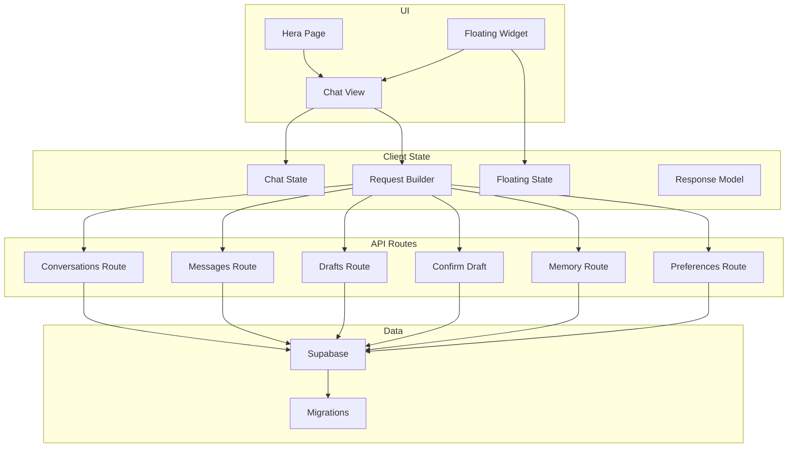
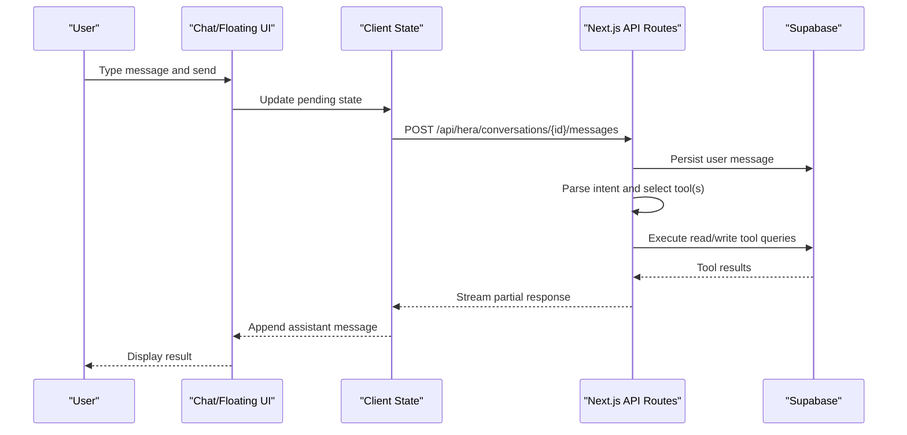
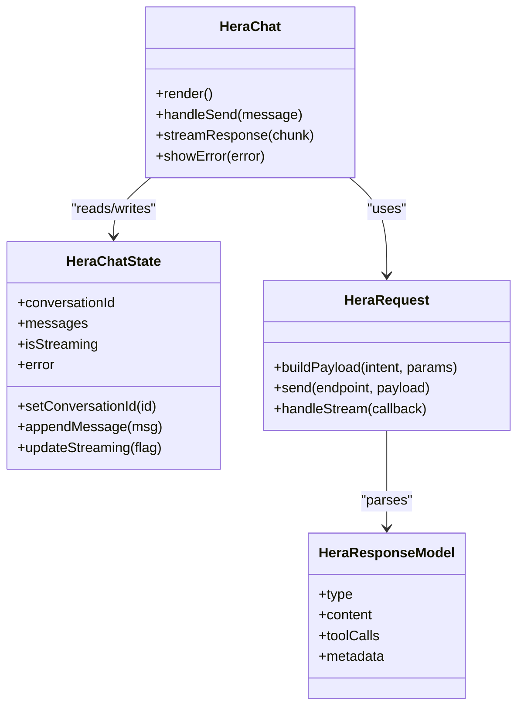
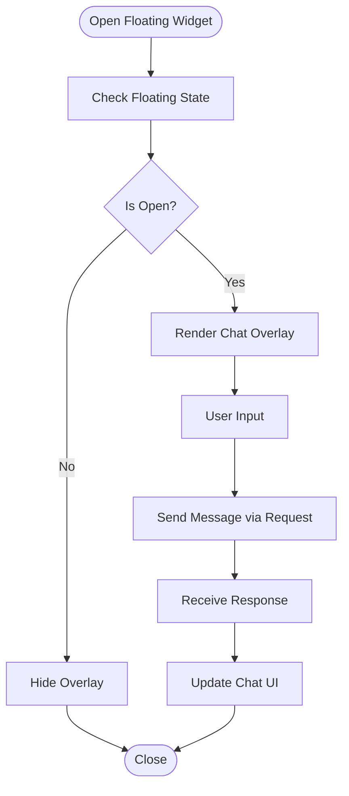
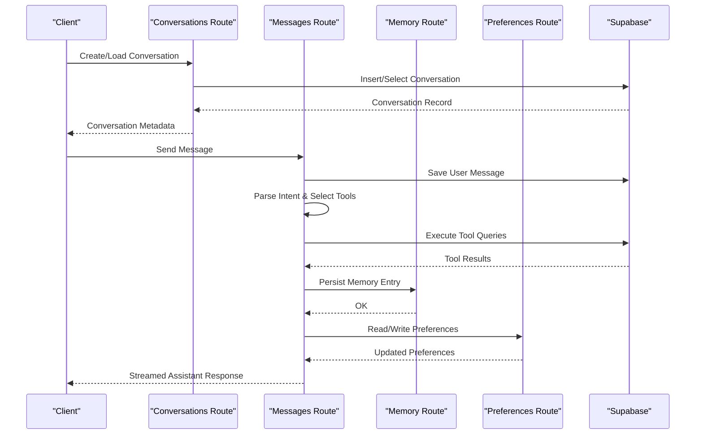
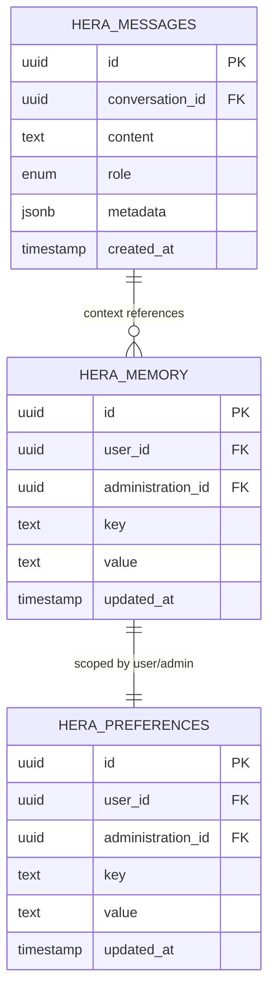
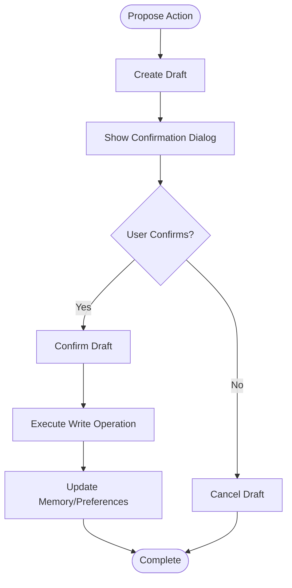
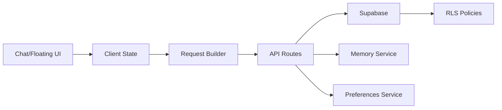

# HERA AI Assistant

<cite>
**Referenced Files in This Document**
- [apps/hr-suite/app/(dashboard)/hera/page.tsx](file://apps/hr-suite/app/(dashboard)/hera/page.tsx)
- [apps/hr-suite/components/hera/hera-chat.tsx](file://apps/hr-suite/components/hera/hera-chat.tsx)
- [apps/hr-suite/components/hera/hera-floating.tsx](file://apps/hr-suite/components/hera/hera-floating.tsx)
- [apps/hr-suite/components/hera/hera-chat-state.ts](file://apps/hr-suite/components/hera/hera-chat-state.ts)
- [apps/hr-suite/components/hera/hera-floating-state.ts](file://apps/hr-suite/components/hera/hera-floating-state.ts)
- [apps/hr-suite/components/hera/hera-request.ts](file://apps/hr-suite/components/hera/hera-request.ts)
- [apps/hr-suite/components/hera/hera-response-model.ts](file://apps/hr-suite/components/hera/hera-response-model.ts)
- [apps/hr-suite/components/hera/hera-control-card.tsx](file://apps/hr-suite/components/hera/hera-control-card.tsx)
- [apps/hr-suite/components/hera/hera-scope-line.tsx](file://apps/hr-suite/components/hera/hera-scope-line.tsx)
- [apps/hr-suite/components/hera/hera-settings.tsx](file://apps/hr-suite/components/hera/hera-settings.tsx)
- [apps/hr-suite/app/api/hera/conversations/route.ts](file://apps/hr-suite/app/api/hera/conversations/route.ts)
- [apps/hr-suite/app/api/hera/conversations/[conversationId]/route.ts](file://apps/hr-suite/app/api/hera/conversations/[conversationId]/route.ts)
- [apps/hr-suite/app/api/hera/conversations/[conversationId]/messages/route.ts](file://apps/hr-suite/app/api/hera/conversations/[conversationId]/messages/route.ts)
- [apps/hr-suite/app/api/hera/drafts/[draftId]/route.ts](file://apps/hr-suite/app/api/hera/drafts/[draftId]/route.ts)
- [apps/hr-suite/app/api/hera/drafts/[draftId]/confirm/route.ts](file://apps/hr-suite/app/api/hera/drafts/[draftId]/confirm/route.ts)
- [apps/hr-suite/app/api/hera/memory/route.ts](file://apps/hr-suite/app/api/hera/memory/route.ts)
- [apps/hr-suite/app/api/hera/preferences/route.ts](file://apps/hr-suite/app/api/hera/preferences/route.ts)
- [apps/hr-suite/lib/context/administration/route.ts](file://apps/hr-suite/lib/context/administration/route.ts)
- [apps/hr-suite/supabase/migrations/20260716092637_add_hera_ai_agent.sql](file://apps/hr-suite/supabase/migrations/20260716092637_add_hera_ai_agent.sql)
- [apps/hr-suite/supabase/migrations/20260717100000_harden_hera_memory_and_preferences.sql](file://apps/hr-suite/supabase/migrations/20260717100000_harden_hera_memory_and_preferences.sql)
- [apps/hr-suite/supabase/migrations/20260717100500_index_hera_preferences.sql](file://apps/hr-suite/supabase/migrations/20260717100500_index_hera_preferences.sql)
- [apps/hr-suite/supabase/migrations/20260717101000_add_hera_message_metadata.sql](file://apps/hr-suite/supabase/migrations/20260717101000_add_hera_message_metadata.sql)
- [apps/hr-suite/messages/en/hera.json](file://apps/hr-suite/messages/en/hera.json)
- [apps/hr-suite/messages/nl/hera.json](file://apps/hr-suite/messages/nl/hera.json)
</cite>

## Table of Contents
1. [Introduction](#introduction)
2. [Project Structure](#project-structure)
3. [Core Components](#core-components)
4. [Architecture Overview](#architecture-overview)
5. [Detailed Component Analysis](#detailed-component-analysis)
6. [Dependency Analysis](#dependency-analysis)
7. [Performance Considerations](#performance-considerations)
8. [Troubleshooting Guide](#troubleshooting-guide)
9. [Conclusion](#conclusion)
10. [Appendices](#appendices)

## Introduction
HERA (Human Employee Resource Assistant) is LiquidHR’s AI-powered chatbot that enables natural language interactions for HR tasks. It provides a floating UI and an embedded page view, manages conversations with persistent memory and preferences, and executes tools to retrieve data, perform document operations, and look up employee information. HERA integrates tightly with the HR suite via Next.js API routes and Supabase-backed storage, while enforcing tenant isolation and privacy through context and policies.

This document explains:
- Chat interface architecture and conversation management
- Tool execution model for data retrieval, documents, and employee lookups
- Memory system for conversation history and user preferences
- Floating UI component and integration patterns
- Extending HERA with custom tools, configuring response templates, and handling different flows
- AI agent configuration, safety measures, and performance optimization
- Privacy considerations and tenant data isolation

## Project Structure
HERA spans UI components, client state, API routes, and database migrations:
- UI: Embedded page and floating chat widget
- Client state: Conversation lifecycle, request/response models, and floating state
- API routes: Conversations, messages, drafts, memory, and preferences
- Database: Agent metadata, message history, memory entries, and preferences with indexes and policies

**Diagram sources**
- [apps/hr-suite/app/(dashboard)/hera/page.tsx](file://apps/hr-suite/app/(dashboard)/hera/page.tsx)
- [apps/hr-suite/components/hera/hera-chat.tsx](file://apps/hr-suite/components/hera/hera-chat.tsx)
- [apps/hr-suite/components/hera/hera-floating.tsx](file://apps/hr-suite/components/hera/hera-floating.tsx)
- [apps/hr-suite/components/hera/hera-chat-state.ts](file://apps/hr-suite/components/hera/hera-chat-state.ts)
- [apps/hr-suite/components/hera/hera-floating-state.ts](file://apps/hr-suite/components/hera/hera-floating-state.ts)
- [apps/hr-suite/components/hera/hera-request.ts](file://apps/hr-suite/components/hera/hera-request.ts)
- [apps/hr-suite/components/hera/hera-response-model.ts](file://apps/hr-suite/components/hera/hera-response-model.ts)
- [apps/hr-suite/app/api/hera/conversations/route.ts](file://apps/hr-suite/app/api/hera/conversations/route.ts)
- [apps/hr-suite/app/api/hera/conversations/[conversationId]/route.ts](file://apps/hr-suite/app/api/hera/conversations/[conversationId]/route.ts)
- [apps/hr-suite/app/api/hera/conversations/[conversationId]/messages/route.ts](file://apps/hr-suite/app/api/hera/conversations/[conversationId]/messages/route.ts)
- [apps/hr-suite/app/api/hera/drafts/[draftId]/route.ts](file://apps/hr-suite/app/api/hera/drafts/[draftId]/route.ts)
- [apps/hr-suite/app/api/hera/drafts/[draftId]/confirm/route.ts](file://apps/hr-suite/app/api/hera/drafts/[draftId]/confirm/route.ts)
- [apps/hr-suite/app/api/hera/memory/route.ts](file://apps/hr-suite/app/api/hera/memory/route.ts)
- [apps/hr-suite/app/api/hera/preferences/route.ts](file://apps/hr-suite/app/api/hera/preferences/route.ts)
- [apps/hr-suite/supabase/migrations/20260716092637_add_hera_ai_agent.sql](file://apps/hr-suite/supabase/migrations/20260716092637_add_hera_ai_agent.sql)
- [apps/hr-suite/supabase/migrations/20260717100000_harden_hera_memory_and_preferences.sql](file://apps/hr-suite/supabase/migrations/20260717100000_harden_hera_memory_and_preferences.sql)
- [apps/hr-suite/supabase/migrations/20260717100500_index_hera_preferences.sql](file://apps/hr-suite/supabase/migrations/20260717100500_index_hera_preferences.sql)
- [apps/hr-suite/supabase/migrations/20260717101000_add_hera_message_metadata.sql](file://apps/hr-suite/supabase/migrations/20260717101000_add_hera_message_metadata.sql)

**Section sources**
- [apps/hr-suite/app/(dashboard)/hera/page.tsx](file://apps/hr-suite/app/(dashboard)/hera/page.tsx)
- [apps/hr-suite/components/hera/hera-chat.tsx](file://apps/hr-suite/components/hera/hera-chat.tsx)
- [apps/hr-suite/components/hera/hera-floating.tsx](file://apps/hr-suite/components/hera/hera-floating.tsx)
- [apps/hr-suite/components/hera/hera-chat-state.ts](file://apps/hr-suite/components/hera/hera-chat-state.ts)
- [apps/hr-suite/components/hera/hera-floating-state.ts](file://apps/hr-suite/components/hera/hera-floating-state.ts)
- [apps/hr-suite/components/hera/hera-request.ts](file://apps/hr-suite/components/hera/hera-request.ts)
- [apps/hr-suite/components/hera/hera-response-model.ts](file://apps/hr-suite/components/hera/hera-response-model.ts)
- [apps/hr-suite/app/api/hera/conversations/route.ts](file://apps/hr-suite/app/api/hera/conversations/route.ts)
- [apps/hr-suite/app/api/hera/conversations/[conversationId]/route.ts](file://apps/hr-suite/app/api/hera/conversations/[conversationId]/route.ts)
- [apps/hr-suite/app/api/hera/conversations/[conversationId]/messages/route.ts](file://apps/hr-suite/app/api/hera/conversations/[conversationId]/messages/route.ts)
- [apps/hr-suite/app/api/hera/drafts/[draftId]/route.ts](file://apps/hr-suite/app/api/hera/drafts/[draftId]/route.ts)
- [apps/hr-suite/app/api/hera/drafts/[draftId]/confirm/route.ts](file://apps/hr-suite/app/api/hera/drafts/[draftId]/confirm/route.ts)
- [apps/hr-suite/app/api/hera/memory/route.ts](file://apps/hr-suite/app/api/hera/memory/route.ts)
- [apps/hr-suite/app/api/hera/preferences/route.ts](file://apps/hr-suite/app/api/hera/preferences/route.ts)
- [apps/hr-suite/supabase/migrations/20260716092637_add_hera_ai_agent.sql](file://apps/hr-suite/supabase/migrations/20260716092637_add_hera_ai_agent.sql)
- [apps/hr-suite/supabase/migrations/20260717100000_harden_hera_memory_and_preferences.sql](file://apps/hr-suite/supabase/migrations/20260717100000_harden_hera_memory_and_preferences.sql)
- [apps/hr-suite/supabase/migrations/20260717100500_index_hera_preferences.sql](file://apps/hr-suite/supabase/migrations/20260717100500_index_hera_preferences.sql)
- [apps/hr-suite/supabase/migrations/20260717101000_add_hera_message_metadata.sql](file://apps/hr-suite/supabase/migrations/20260717101000_add_hera_message_metadata.sql)

## Core Components
- Chat UI: Renders messages, input, and streaming responses; coordinates with client state.
- Floating UI: A draggable overlay that opens/closes the chat without navigating away from the current page.
- Client State: Manages conversation lifecycle, pending requests, error states, and UI toggles.
- Request Builder: Constructs typed payloads for API endpoints, including conversation ID, message content, and tool parameters.
- Response Model: Defines structured shapes for AI responses, tool calls, and UI actions.
- API Routes: Endpoints for creating/loading conversations, sending messages, managing drafts, persisting memory, and storing preferences.
- Data Layer: Supabase tables and indexes for agents, conversations, messages, memory, and preferences; RLS policies enforce tenant isolation.

Key responsibilities:
- Natural language processing occurs server-side; the client sends intents and receives structured responses.
- Tools are invoked by the server after parsing the user intent; results are streamed back to the UI.
- Memory and preferences are persisted per user and administration scope.

**Section sources**
- [apps/hr-suite/components/hera/hera-chat.tsx](file://apps/hr-suite/components/hera/hera-chat.tsx)
- [apps/hr-suite/components/hera/hera-floating.tsx](file://apps/hr-suite/components/hera/hera-floating.tsx)
- [apps/hr-suite/components/hera/hera-chat-state.ts](file://apps/hr-suite/components/hera/hera-chat-state.ts)
- [apps/hr-suite/components/hera/hera-floating-state.ts](file://apps/hr-suite/components/hera/hera-floating-state.ts)
- [apps/hr-suite/components/hera/hera-request.ts](file://apps/hr-suite/components/hera/hera-request.ts)
- [apps/hr-suite/components/hera/hera-response-model.ts](file://apps/hr-suite/components/hera/hera-response-model.ts)
- [apps/hr-suite/app/api/hera/conversations/route.ts](file://apps/hr-suite/app/api/hera/conversations/route.ts)
- [apps/hr-suite/app/api/hera/conversations/[conversationId]/messages/route.ts](file://apps/hr-suite/app/api/hera/conversations/[conversationId]/messages/route.ts)
- [apps/hr-suite/app/api/hera/memory/route.ts](file://apps/hr-suite/app/api/hera/memory/route.ts)
- [apps/hr-suite/app/api/hera/preferences/route.ts](file://apps/hr-suite/app/api/hera/preferences/route.ts)

## Architecture Overview
HERA follows a layered architecture:
- Presentation layer: React components for chat and floating widget
- State layer: Local state for conversation flow and UI behavior
- API layer: Next.js route handlers orchestrating business logic and tool execution
- Data layer: Supabase with tenant-scoped tables and policies

**Diagram sources**
- [apps/hr-suite/components/hera/hera-chat.tsx](file://apps/hr-suite/components/hera/hera-chat.tsx)
- [apps/hr-suite/components/hera/hera-chat-state.ts](file://apps/hr-suite/components/hera/hera-chat-state.ts)
- [apps/hr-suite/app/api/hera/conversations/[conversationId]/messages/route.ts](file://apps/hr-suite/app/api/hera/conversations/[conversationId]/messages/route.ts)
- [apps/hr-suite/app/api/hera/conversations/route.ts](file://apps/hr-suite/app/api/hera/conversations/route.ts)
- [apps/hr-suite/app/api/hera/memory/route.ts](file://apps/hr-suite/app/api/hera/memory/route.ts)
- [apps/hr-suite/app/api/hera/preferences/route.ts](file://apps/hr-suite/app/api/hera/preferences/route.ts)

## Detailed Component Analysis

### Chat Interface and Conversation Management
The chat interface renders a message list, input field, and status indicators. It uses client state to manage:
- Active conversation ID
- Message queue and streaming updates
- Error and loading states
- Contextual hints and suggestions

Conversation management includes:
- Creating new conversations
- Loading existing ones
- Appending messages and assistant replies
- Handling draft confirmations for write operations

**Diagram sources**
- [apps/hr-suite/components/hera/hera-chat.tsx](file://apps/hr-suite/components/hera/hera-chat.tsx)
- [apps/hr-suite/components/hera/hera-chat-state.ts](file://apps/hr-suite/components/hera/hera-chat-state.ts)
- [apps/hr-suite/components/hera/hera-request.ts](file://apps/hr-suite/components/hera/hera-request.ts)
- [apps/hr-suite/components/hera/hera-response-model.ts](file://apps/hr-suite/components/hera/hera-response-model.ts)

**Section sources**
- [apps/hr-suite/components/hera/hera-chat.tsx](file://apps/hr-suite/components/hera/hera-chat.tsx)
- [apps/hr-suite/components/hera/hera-chat-state.ts](file://apps/hr-suite/components/hera/hera-chat-state.ts)
- [apps/hr-suite/components/hera/hera-request.ts](file://apps/hr-suite/components/hera/hera-request.ts)
- [apps/hr-suite/components/hera/hera-response-model.ts](file://apps/hr-suite/components/hera/hera-response-model.ts)

### Floating UI Component
The floating widget provides quick access to HERA without leaving the current page. It manages:
- Visibility toggle and position
- Lightweight state for open/close
- Seamless integration with the main chat view

**Diagram sources**
- [apps/hr-suite/components/hera/hera-floating.tsx](file://apps/hr-suite/components/hera/hera-floating.tsx)
- [apps/hr-suite/components/hera/hera-floating-state.ts](file://apps/hr-suite/components/hera/hera-floating-state.ts)
- [apps/hr-suite/components/hera/hera-chat.tsx](file://apps/hr-suite/components/hera/hera-chat.tsx)

**Section sources**
- [apps/hr-suite/components/hera/hera-floating.tsx](file://apps/hr-suite/components/hera/hera-floating.tsx)
- [apps/hr-suite/components/hera/hera-floating-state.ts](file://apps/hr-suite/components/hera/hera-floating-state.ts)

### API Routes and Tool Execution
API routes handle:
- Conversation CRUD
- Message sending and streaming
- Draft creation and confirmation
- Memory persistence
- Preferences management

Tool execution model:
- Intent parsing determines required tools (e.g., employee lookup, document operations)
- Server validates permissions based on tenant and role context
- Tools execute against Supabase with strict RLS policies
- Results are aggregated and returned to the client

**Diagram sources**
- [apps/hr-suite/app/api/hera/conversations/route.ts](file://apps/hr-suite/app/api/hera/conversations/route.ts)
- [apps/hr-suite/app/api/hera/conversations/[conversationId]/route.ts](file://apps/hr-suite/app/api/hera/conversations/[conversationId]/route.ts)
- [apps/hr-suite/app/api/hera/conversations/[conversationId]/messages/route.ts](file://apps/hr-suite/app/api/hera/conversations/[conversationId]/messages/route.ts)
- [apps/hr-suite/app/api/hera/memory/route.ts](file://apps/hr-suite/app/api/hera/memory/route.ts)
- [apps/hr-suite/app/api/hera/preferences/route.ts](file://apps/hr-suite/app/api/hera/preferences/route.ts)

**Section sources**
- [apps/hr-suite/app/api/hera/conversations/route.ts](file://apps/hr-suite/app/api/hera/conversations/route.ts)
- [apps/hr-suite/app/api/hera/conversations/[conversationId]/route.ts](file://apps/hr-suite/app/api/hera/conversations/[conversationId]/route.ts)
- [apps/hr-suite/app/api/hera/conversations/[conversationId]/messages/route.ts](file://apps/hr-suite/app/api/hera/conversations/[conversationId]/messages/route.ts)
- [apps/hr-suite/app/api/hera/memory/route.ts](file://apps/hr-suite/app/api/hera/memory/route.ts)
- [apps/hr-suite/app/api/hera/preferences/route.ts](file://apps/hr-suite/app/api/hera/preferences/route.ts)

### Memory System and Preferences
Memory stores conversation history and contextual facts:
- Per-user and per-administration scoping
- Append-only entries with timestamps and metadata
- Indexed for efficient retrieval

Preferences store user-specific settings:
- Language, theme, and feature flags
- Scoped by user and administration
- Indexed for fast reads

**Diagram sources**
- [apps/hr-suite/supabase/migrations/20260717101000_add_hera_message_metadata.sql](file://apps/hr-suite/supabase/migrations/20260717101000_add_hera_message_metadata.sql)
- [apps/hr-suite/supabase/migrations/20260717100000_harden_hera_memory_and_preferences.sql](file://apps/hr-suite/supabase/migrations/20260717100000_harden_hera_memory_and_preferences.sql)
- [apps/hr-suite/supabase/migrations/20260717100500_index_hera_preferences.sql](file://apps/hr-suite/supabase/migrations/20260717100500_index_hera_preferences.sql)

**Section sources**
- [apps/hr-suite/app/api/hera/memory/route.ts](file://apps/hr-suite/app/api/hera/memory/route.ts)
- [apps/hr-suite/app/api/hera/preferences/route.ts](file://apps/hr-suite/app/api/hera/preferences/route.ts)
- [apps/hr-suite/supabase/migrations/20260717100000_harden_hera_memory_and_preferences.sql](file://apps/hr-suite/supabase/migrations/20260717100000_harden_hera_memory_and_preferences.sql)
- [apps/hr-suite/supabase/migrations/20260717100500_index_hera_preferences.sql](file://apps/hr-suite/supabase/migrations/20260717100500_index_hera_preferences.sql)
- [apps/hr-suite/supabase/migrations/20260717101000_add_hera_message_metadata.sql](file://apps/hr-suite/supabase/migrations/20260717101000_add_hera_message_metadata.sql)

### Drafts and Confirmation Flow
Drafts allow HERA to propose changes before executing write operations:
- Create draft with proposed action and parameters
- Present confirmation UI to the user
- Confirm or cancel the draft
- On confirm, execute the mutation and update conversation context

**Diagram sources**
- [apps/hr-suite/app/api/hera/drafts/[draftId]/route.ts](file://apps/hr-suite/app/api/hera/drafts/[draftId]/route.ts)
- [apps/hr-suite/app/api/hera/drafts/[draftId]/confirm/route.ts](file://apps/hr-suite/app/api/hera/drafts/[draftId]/confirm/route.ts)

**Section sources**
- [apps/hr-suite/app/api/hera/drafts/[draftId]/route.ts](file://apps/hr-suite/app/api/hera/drafts/[draftId]/route.ts)
- [apps/hr-suite/app/api/hera/drafts/[draftId]/confirm/route.ts](file://apps/hr-suite/app/api/hera/drafts/[draftId]/confirm/route.ts)

### Control Card and Scope Line
Control card provides quick actions like clearing history or switching modes.
Scope line displays current context such as active administration and user scope.

These components enhance usability and transparency during interactions.

**Section sources**
- [apps/hr-suite/components/hera/hera-control-card.tsx](file://apps/hr-suite/components/hera/hera-control-card.tsx)
- [apps/hr-suite/components/hera/hera-scope-line.tsx](file://apps/hr-suite/components/hera/hera-scope-line.tsx)

### Settings and Localization
Settings allow users to configure HERA behavior:
- Language selection
- Theme preferences
- Feature toggles

Localization files provide i18n strings for multiple languages.

**Section sources**
- [apps/hr-suite/components/hera/hera-settings.tsx](file://apps/hr-suite/components/hera/hera-settings.tsx)
- [apps/hr-suite/messages/en/hera.json](file://apps/hr-suite/messages/en/hera.json)
- [apps/hr-suite/messages/nl/hera.json](file://apps/hr-suite/messages/nl/hera.json)

## Dependency Analysis
HERA depends on:
- React components for UI rendering
- Client state modules for conversation flow
- Next.js API routes for business logic
- Supabase for persistence and security policies

**Diagram sources**
- [apps/hr-suite/components/hera/hera-chat.tsx](file://apps/hr-suite/components/hera/hera-chat.tsx)
- [apps/hr-suite/components/hera/hera-chat-state.ts](file://apps/hr-suite/components/hera/hera-chat-state.ts)
- [apps/hr-suite/components/hera/hera-request.ts](file://apps/hr-suite/components/hera/hera-request.ts)
- [apps/hr-suite/app/api/hera/conversations/route.ts](file://apps/hr-suite/app/api/hera/conversations/route.ts)
- [apps/hr-suite/app/api/hera/memory/route.ts](file://apps/hr-suite/app/api/hera/memory/route.ts)
- [apps/hr-suite/app/api/hera/preferences/route.ts](file://apps/hr-suite/app/api/hera/preferences/route.ts)

**Section sources**
- [apps/hr-suite/components/hera/hera-chat.tsx](file://apps/hr-suite/components/hera/hera-chat.tsx)
- [apps/hr-suite/components/hera/hera-chat-state.ts](file://apps/hr-suite/components/hera/hera-chat-state.ts)
- [apps/hr-suite/components/hera/hera-request.ts](file://apps/hr-suite/components/hera/hera-request.ts)
- [apps/hr-suite/app/api/hera/conversations/route.ts](file://apps/hr-suite/app/api/hera/conversations/route.ts)
- [apps/hr-suite/app/api/hera/memory/route.ts](file://apps/hr-suite/app/api/hera/memory/route.ts)
- [apps/hr-suite/app/api/hera/preferences/route.ts](file://apps/hr-suite/app/api/hera/preferences/route.ts)

## Performance Considerations
- Streaming responses reduce perceived latency
- Indexed preferences and memory keys improve query performance
- Minimal client state updates prevent unnecessary re-renders
- Debounced input handling reduces API calls
- Caching frequently accessed data at the API layer when appropriate

[No sources needed since this section provides general guidance]

## Troubleshooting Guide
Common issues and resolutions:
- Connection errors: Verify network connectivity and API endpoint availability
- Permission denied: Check tenant and role context; ensure RLS policies allow access
- Missing memory entries: Confirm memory persistence routes are called correctly
- Preference not applied: Validate preference key format and scope

Debugging tips:
- Inspect client state for correct conversation ID and message queue
- Review API logs for tool execution failures
- Validate Supabase policies and indexes

**Section sources**
- [apps/hr-suite/app/api/hera/conversations/[conversationId]/messages/route.ts](file://apps/hr-suite/app/api/hera/conversations/[conversationId]/messages/route.ts)
- [apps/hr-suite/app/api/hera/memory/route.ts](file://apps/hr-suite/app/api/hera/memory/route.ts)
- [apps/hr-suite/app/api/hera/preferences/route.ts](file://apps/hr-suite/app/api/hera/preferences/route.ts)

## Conclusion
HERA provides a robust, extensible AI assistant for HR tasks with a clear separation between UI, state, API, and data layers. Its floating and embedded interfaces offer flexible access, while memory and preferences enable personalized experiences. The tool execution model supports safe, auditable operations with tenant isolation and privacy safeguards. Extending HERA involves adding new tools, updating response models, and integrating with existing APIs.

[No sources needed since this section summarizes without analyzing specific files]

## Appendices

### Extending HERA with Custom Tools
Steps to add a new tool:
- Define tool schema and parameters in the response model
- Implement server-side handler in the messages route
- Add validation and authorization checks
- Persist relevant memory entries
- Return structured results to the client

Example extension points:
- New API endpoints under /api/hera
- Additional fields in response model
- Memory keys for tool-specific context

**Section sources**
- [apps/hr-suite/components/hera/hera-response-model.ts](file://apps/hr-suite/components/hera/hera-response-model.ts)
- [apps/hr-suite/app/api/hera/conversations/[conversationId]/messages/route.ts](file://apps/hr-suite/app/api/hera/conversations/[conversationId]/messages/route.ts)
- [apps/hr-suite/app/api/hera/memory/route.ts](file://apps/hr-suite/app/api/hera/memory/route.ts)

### Configuring Response Templates
- Use localization files for consistent messaging
- Support dynamic placeholders in templates
- Allow admin overrides for critical notifications

**Section sources**
- [apps/hr-suite/messages/en/hera.json](file://apps/hr-suite/messages/en/hera.json)
- [apps/hr-suite/messages/nl/hera.json](file://apps/hr-suite/messages/nl/hera.json)

### Handling Different Conversation Flows
- Simple Q&A: Direct question-answer pairs
- Multi-step workflows: Drafts and confirmations
- Data-driven insights: Aggregated results with summaries

**Section sources**
- [apps/hr-suite/app/api/hera/drafts/[draftId]/route.ts](file://apps/hr-suite/app/api/hera/drafts/[draftId]/route.ts)
- [apps/hr-suite/app/api/hera/drafts/[draftId]/confirm/route.ts](file://apps/hr-suite/app/api/hera/drafts/[draftId]/confirm/route.ts)

### AI Agent Configuration and Safety Measures
- Configure agent capabilities via environment variables
- Enforce role-based access control
- Sanitize inputs and outputs
- Log sensitive operations for auditability

**Section sources**
- [apps/hr-suite/supabase/migrations/20260716092637_add_hera_ai_agent.sql](file://apps/hr-suite/supabase/migrations/20260716092637_add_hera_ai_agent.sql)

### Privacy and Tenant Isolation
- All data scoped by user and administration
- RLS policies enforce strict access boundaries
- No cross-tenant data leakage
- Audit trails for sensitive operations

**Section sources**
- [apps/hr-suite/supabase/migrations/20260717100000_harden_hera_memory_and_preferences.sql](file://apps/hr-suite/supabase/migrations/20260717100000_harden_hera_memory_and_preferences.sql)
- [apps/hr-suite/lib/context/administration/route.ts](file://apps/hr-suite/lib/context/administration/route.ts)