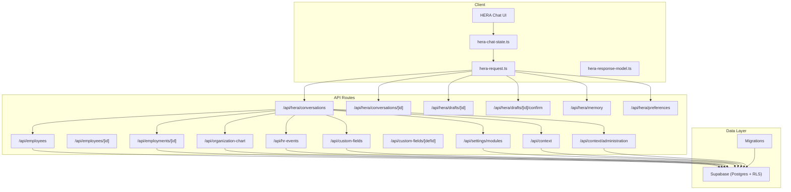
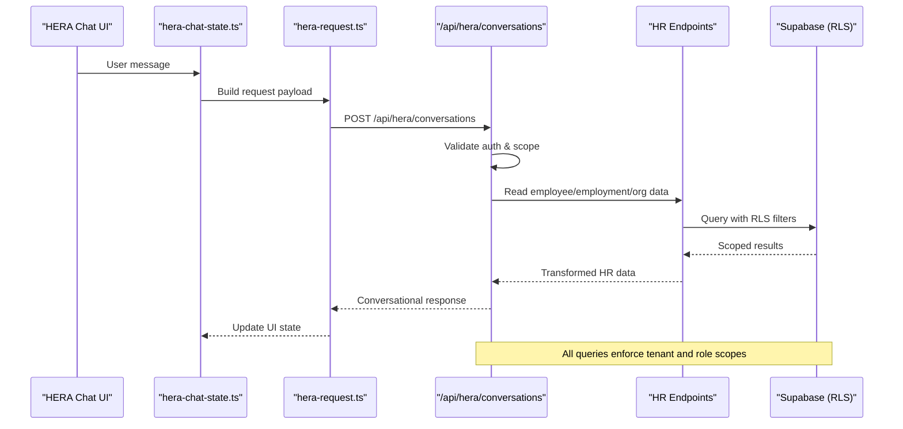
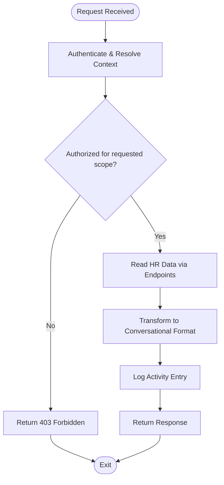
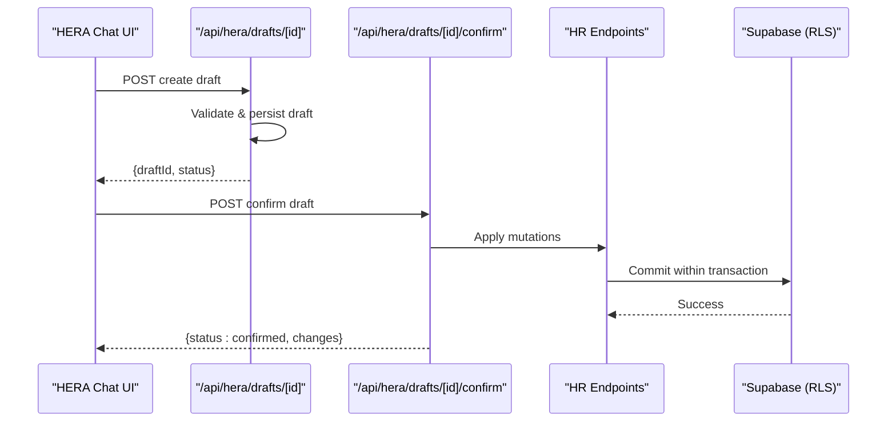
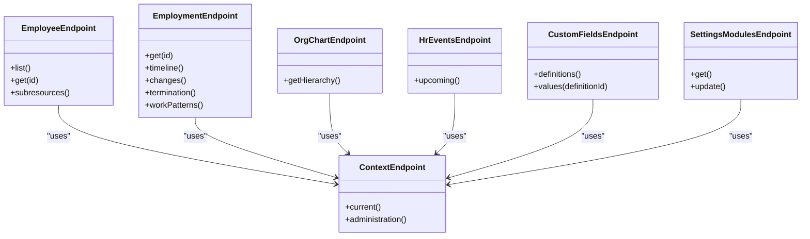
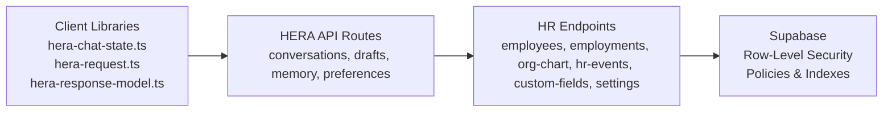

# Integration Layer & HR Data Access

<cite>
**Referenced Files in This Document**
- [apps/hr-suite/app/api/hera/conversations/route.ts](file://apps/hr-suite/app/api/hera/conversations/route.ts)
- [apps/hr-suite/app/api/hera/conversations/[conversationId]/route.ts](file://apps/hr-suite/app/api/hera/conversations/[conversationId]/route.ts)
- [apps/hr-suite/app/api/hera/drafts/[draftId]/route.ts](file://apps/hr-suite/app/api/hera/drafts/[draftId]/route.ts)
- [apps/hr-suite/app/api/hera/drafts/[draftId]/confirm/route.ts](file://apps/hr-suite/app/api/hera/drafts/[draftId]/confirm/route.ts)
- [apps/hr-suite/app/api/hera/memory/route.ts](file://apps/hr-suite/app/api/hera/memory/route.ts)
- [apps/hr-suite/app/api/hera/preferences/route.ts](file://apps/hr-suite/app/api/hera/preferences/route.ts)
- [apps/hr-suite/components/hera/hera-chat-state.ts](file://apps/hr-suite/components/hera/hera-chat-state.ts)
- [apps/hr-suite/components/hera/hera-request.ts](file://apps/hr-suite/components/hera/hera-request.ts)
- [apps/hr-suite/components/hera/hera-response-model.ts](file://apps/hr-suite/components/hera/hera-response-model.ts)
- [apps/hr-suite/lib/hera/index.ts](file://apps/hr-suite/lib/hera/index.ts)
- [apps/hr-suite/app/api/employees/route.ts](file://apps/hr-suite/app/api/employees/route.ts)
- [apps/hr-suite/app/api/employees/[employeeId]/route.ts](file://apps/hr-suite/app/api/employees/[employeeId]/route.ts)
- [apps/hr-suite/app/api/employments/[employmentId]/route.ts](file://apps/hr-suite/app/api/employments/[employmentId]/route.ts)
- [apps/hr-suite/app/api/organization-chart/route.ts](file://apps/hr-suite/app/api/organization-chart/route.ts)
- [apps/hr-suite/app/api/hr-events/route.ts](file://apps/hr-suite/app/api/hr-events/route.ts)
- [apps/hr-suite/app/api/custom-fields/route.ts](file://apps/hr-suite/app/api/custom-fields/route.ts)
- [apps/hr-suite/app/api/custom-fields/[definitionId]/route.ts](file://apps/hr-suite/app/api/custom-fields/[definitionId]/route.ts)
- [apps/hr-suite/app/api/settings/modules/route.ts](file://apps/hr-suite/app/api/settings/modules/route.ts)
- [apps/hr-suite/app/api/context/route.ts](file://apps/hr-suite/app/api/context/route.ts)
- [apps/hr-suite/app/api/context/administration/route.ts](file://apps/hr-suite/app/api/context/administration/route.ts)
- [apps/hr-suite/supabase/migrations/20260722192500_skip_holidays_in_leave_requests.sql](file://apps/hr-suite/supabase/migrations/20260722192500_skip_holidays_in_leave_requests.sql)
- [apps/hr-suite/supabase/migrations/20260724112407_add_role_assignment_scope.sql](file://apps/hr-suite/supabase/migrations/20260724112407_add_role_assignment_scope.sql)
- [apps/hr-suite/supabase/migrations/20260724160000_add_employee_activity_entries.sql](file://apps/hr-suite/supabase/migrations/20260724160000_add_employee_activity_entries.sql)
- [apps/hr-suite/supabase/migrations/20260724172716_harden_employee_activity_entries.sql](file://apps/hr-suite/supabase/migrations/20260724172716_harden_employee_activity_entries.sql)
</cite>

## Table of Contents
1. [Introduction](#introduction)
2. [Project Structure](#project-structure)
3. [Core Components](#core-components)
4. [Architecture Overview](#architecture-overview)
5. [Detailed Component Analysis](#detailed-component-analysis)
6. [Dependency Analysis](#dependency-analysis)
7. [Performance Considerations](#performance-considerations)
8. [Troubleshooting Guide](#troubleshooting-guide)
9. [Conclusion](#conclusion)
10. [Appendices](#appendices)

## Introduction
This document explains HERA’s integration layer that connects the AI assistant to LiquidHR’s HR data and business logic. It covers how HERA reads employee, employment, organization, and other HR entities through secure API endpoints; how scope-based access control ensures users only see authorized data; how raw HR data is transformed into conversational formats; and how write operations are executed safely via an action execution system. It also provides guidance for extending HERA with new data sources, implementing custom business logic handlers, integrating external systems, and maintaining security, audit logging, and robust error handling.

## Project Structure
HERA integrates primarily through Next.js App Router API routes under apps/hr-suite/app/api/hera and related HR endpoints. The client-side chat state and request/response models live in components/hera and lib/hera. Database schemas and policies are managed via Supabase migrations.

**Diagram sources**
- [apps/hr-suite/app/api/hera/conversations/route.ts](file://apps/hr-suite/app/api/hera/conversations/route.ts)
- [apps/hr-suite/app/api/hera/conversations/[conversationId]/route.ts](file://apps/hr-suite/app/api/hera/conversations/[conversationId]/route.ts)
- [apps/hr-suite/app/api/hera/drafts/[draftId]/route.ts](file://apps/hr-suite/app/api/hera/drafts/[draftId]/route.ts)
- [apps/hr-suite/app/api/hera/drafts/[draftId]/confirm/route.ts](file://apps/hr-suite/app/api/hera/drafts/[draftId]/confirm/route.ts)
- [apps/hr-suite/app/api/hera/memory/route.ts](file://apps/hr-suite/app/api/hera/memory/route.ts)
- [apps/hr-suite/app/api/hera/preferences/route.ts](file://apps/hr-suite/app/api/hera/preferences/route.ts)
- [apps/hr-suite/app/api/employees/route.ts](file://apps/hr-suite/app/api/employees/route.ts)
- [apps/hr-suite/app/api/employees/[employeeId]/route.ts](file://apps/hr-suite/app/api/employees/[employeeId]/route.ts)
- [apps/hr-suite/app/api/employments/[employmentId]/route.ts](file://apps/hr-suite/app/api/employments/[employmentId]/route.ts)
- [apps/hr-suite/app/api/organization-chart/route.ts](file://apps/hr-suite/app/api/organization-chart/route.ts)
- [apps/hr-suite/app/api/hr-events/route.ts](file://apps/hr-suite/app/api/hr-events/route.ts)
- [apps/hr-suite/app/api/custom-fields/route.ts](file://apps/hr-suite/app/api/custom-fields/route.ts)
- [apps/hr-suite/app/api/custom-fields/[definitionId]/route.ts](file://apps/hr-suite/app/api/custom-fields/[definitionId]/route.ts)
- [apps/hr-suite/app/api/settings/modules/route.ts](file://apps/hr-suite/app/api/settings/modules/route.ts)
- [apps/hr-suite/app/api/context/route.ts](file://apps/hr-suite/app/api/context/route.ts)
- [apps/hr-suite/app/api/context/administration/route.ts](file://apps/hr-suite/app/api/context/administration/route.ts)
- [apps/hr-suite/supabase/migrations/20260724160000_add_employee_activity_entries.sql](file://apps/hr-suite/supabase/migrations/20260724160000_add_employee_activity_entries.sql)

**Section sources**
- [apps/hr-suite/app/api/hera/conversations/route.ts](file://apps/hr-suite/app/api/hera/conversations/route.ts)
- [apps/hr-suite/app/api/hera/conversations/[conversationId]/route.ts](file://apps/hr-suite/app/api/hera/conversations/[conversationId]/route.ts)
- [apps/hr-suite/app/api/hera/drafts/[draftId]/route.ts](file://apps/hr-suite/app/api/hera/drafts/[draftId]/route.ts)
- [apps/hr-suite/app/api/hera/drafts/[draftId]/confirm/route.ts](file://apps/hr-suite/app/api/hera/drafts/[draftId]/confirm/route.ts)
- [apps/hr-suite/app/api/hera/memory/route.ts](file://apps/hr-suite/app/api/hera/memory/route.ts)
- [apps/hr-suite/app/api/hera/preferences/route.ts](file://apps/hr-suite/app/api/hera/preferences/route.ts)
- [apps/hr-suite/components/hera/hera-chat-state.ts](file://apps/hr-suite/components/hera/hera-chat-state.ts)
- [apps/hr-suite/components/hera/hera-request.ts](file://apps/hr-suite/components/hera/hera-request.ts)
- [apps/hr-suite/components/hera/hera-response-model.ts](file://apps/hr-suite/components/hera/hera-response-model.ts)
- [apps/hr-suite/lib/hera/index.ts](file://apps/hr-suite/lib/hera/index.ts)

## Core Components
- Conversations API: Manages conversation lifecycle and orchestrates read/write actions against HR endpoints.
- Drafts API: Creates and confirms draft changes before committing to HR data.
- Memory and Preferences: Stores agent memory and user preferences scoped per tenant and user.
- Client State and Request Handling: Encapsulates chat state, request building, and response modeling for consistent UX.
- HR Endpoints: Provide secure, scope-aware access to employees, employments, organization chart, events, custom fields, and settings.

Key responsibilities:
- Authentication and authorization enforcement at route boundaries.
- Scope filtering based on role assignments and administration context.
- Data transformation from HR domain models to conversational payloads.
- Safe mutation pipeline with drafts, confirmations, and audit logs.

**Section sources**
- [apps/hr-suite/app/api/hera/conversations/route.ts](file://apps/hr-suite/app/api/hera/conversations/route.ts)
- [apps/hr-suite/app/api/hera/drafts/[draftId]/route.ts](file://apps/hr-suite/app/api/hera/drafts/[draftId]/route.ts)
- [apps/hr-suite/app/api/hera/drafts/[draftId]/confirm/route.ts](file://apps/hr-suite/app/api/hera/drafts/[draftId]/confirm/route.ts)
- [apps/hr-suite/app/api/hera/memory/route.ts](file://apps/hr-suite/app/api/hera/memory/route.ts)
- [apps/hr-suite/app/api/hera/preferences/route.ts](file://apps/hr-suite/app/api/hera/preferences/route.ts)
- [apps/hr-suite/components/hera/hera-chat-state.ts](file://apps/hr-suite/components/hera/hera-chat-state.ts)
- [apps/hr-suite/components/hera/hera-request.ts](file://apps/hr-suite/components/hera/hera-request.ts)
- [apps/hr-suite/components/hera/hera-response-model.ts](file://apps/hr-suite/components/hera/hera-response-model.ts)
- [apps/hr-suite/lib/hera/index.ts](file://apps/hr-suite/lib/hera/index.ts)

## Architecture Overview
The integration layer follows a layered architecture:
- Client Layer: React components manage chat state and build requests.
- API Layer: Next.js routes handle authentication, authorization, validation, orchestration, and persistence.
- Data Layer: Supabase Postgres enforces row-level security and policies for multi-tenant isolation and scope-based access.

**Diagram sources**
- [apps/hr-suite/components/hera/hera-chat-state.ts](file://apps/hr-suite/components/hera/hera-chat-state.ts)
- [apps/hr-suite/components/hera/hera-request.ts](file://apps/hr-suite/components/hera/hera-request.ts)
- [apps/hr-suite/app/api/hera/conversations/route.ts](file://apps/hr-suite/app/api/hera/conversations/route.ts)
- [apps/hr-suite/app/api/employees/route.ts](file://apps/hr-suite/app/api/employees/route.ts)
- [apps/hr-suite/app/api/employments/[employmentId]/route.ts](file://apps/hr-suite/app/api/employments/[employmentId]/route.ts)
- [apps/hr-suite/app/api/organization-chart/route.ts](file://apps/hr-suite/app/api/organization-chart/route.ts)
- [apps/hr-suite/app/api/hr-events/route.ts](file://apps/hr-suite/app/api/hr-events/route.ts)

## Detailed Component Analysis

### Conversations API
Purpose:
- Accepts user prompts and orchestrates retrieval of HR data and optional write actions.
- Enforces authentication and scope checks before any data access.
- Coordinates transformations to produce conversational responses.

Flow highlights:
- Validates request and extracts user context (tenant, roles).
- Resolves required HR resources (employees, employments, org chart).
- Applies scope filters and returns structured data suitable for LLM consumption.
- Logs activity entries for auditability.

**Diagram sources**
- [apps/hr-suite/app/api/hera/conversations/route.ts](file://apps/hr-suite/app/api/hera/conversations/route.ts)
- [apps/hr-suite/app/api/hr-events/route.ts](file://apps/hr-suite/app/api/hr-events/route.ts)
- [apps/hr-suite/supabase/migrations/20260724160000_add_employee_activity_entries.sql](file://apps/hr-suite/supabase/migrations/20260724160000_add_employee_activity_entries.sql)

**Section sources**
- [apps/hr-suite/app/api/hera/conversations/route.ts](file://apps/hr-suite/app/api/hera/conversations/route.ts)
- [apps/hr-suite/app/api/hr-events/route.ts](file://apps/hr-suite/app/api/hr-events/route.ts)
- [apps/hr-suite/supabase/migrations/20260724160000_add_employee_activity_entries.sql](file://apps/hr-suite/supabase/migrations/20260724160000_add_employee_activity_entries.sql)

### Drafts and Confirmation Flow
Purpose:
- Enables safe write operations by creating drafts first, then confirming them after review or additional validation.

Sequence:
- Create draft with proposed changes.
- Optionally preview or validate draft.
- Confirm draft to commit changes atomically.
- Log confirmation for audit trail.

**Diagram sources**
- [apps/hr-suite/app/api/hera/drafts/[draftId]/route.ts](file://apps/hr-suite/app/api/hera/drafts/[draftId]/route.ts)
- [apps/hr-suite/app/api/hera/drafts/[draftId]/confirm/route.ts](file://apps/hr-suite/app/api/hera/drafts/[draftId]/confirm/route.ts)

**Section sources**
- [apps/hr-suite/app/api/hera/drafts/[draftId]/route.ts](file://apps/hr-suite/app/api/hera/drafts/[draftId]/route.ts)
- [apps/hr-suite/app/api/hera/drafts/[draftId]/confirm/route.ts](file://apps/hr-suite/app/api/hera/drafts/[draftId]/confirm/route.ts)

### Memory and Preferences
Purpose:
- Persist agent memory and user preferences scoped to tenant and user.
- Ensure isolation across tenants and enforce read/write permissions.

Key behaviors:
- GET/POST/PUT/PATCH endpoints for memory and preferences.
- Validation and sanitization of inputs.
- Logging of preference updates for traceability.

**Section sources**
- [apps/hr-suite/app/api/hera/memory/route.ts](file://apps/hr-suite/app/api/hera/memory/route.ts)
- [apps/hr-suite/app/api/hera/preferences/route.ts](file://apps/hr-suite/app/api/hera/preferences/route.ts)

### Client-Side Chat State and Request Handling
Purpose:
- Manage chat state transitions, queue messages, and build standardized requests.
- Model responses consistently for UI rendering.

Responsibilities:
- Serialize prompts and tool calls.
- Handle streaming or batched responses.
- Map server errors to user-friendly messages.

**Section sources**
- [apps/hr-suite/components/hera/hera-chat-state.ts](file://apps/hr-suite/components/hera/hera-chat-state.ts)
- [apps/hr-suite/components/hera/hera-request.ts](file://apps/hr-suite/components/hera/hera-request.ts)
- [apps/hr-suite/components/hera/hera-response-model.ts](file://apps/hr-suite/components/hera/hera-response-model.ts)
- [apps/hr-suite/lib/hera/index.ts](file://apps/hr-suite/lib/hera/index.ts)

### HR Endpoints and Scope-Based Access Control
Endpoints covered:
- Employees: list, detail, subresources.
- Employments: timeline, changes, termination, work patterns.
- Organization Chart: hierarchical structure.
- HR Events: upcoming events and anniversaries.
- Custom Fields: definitions and values.
- Settings: module toggles and configurations.
- Context: current administration and user context.

Scope enforcement:
- Role assignment scope ensures users can only access data within their permitted organizations, departments, or job groups.
- Row-level security policies filter results at the database level.
- Context endpoints provide resolved tenant and administration boundaries for downstream queries.

**Diagram sources**
- [apps/hr-suite/app/api/employees/route.ts](file://apps/hr-suite/app/api/employees/route.ts)
- [apps/hr-suite/app/api/employees/[employeeId]/route.ts](file://apps/hr-suite/app/api/employees/[employeeId]/route.ts)
- [apps/hr-suite/app/api/employments/[employmentId]/route.ts](file://apps/hr-suite/app/api/employments/[employmentId]/route.ts)
- [apps/hr-suite/app/api/organization-chart/route.ts](file://apps/hr-suite/app/api/organization-chart/route.ts)
- [apps/hr-suite/app/api/hr-events/route.ts](file://apps/hr-suite/app/api/hr-events/route.ts)
- [apps/hr-suite/app/api/custom-fields/route.ts](file://apps/hr-suite/app/api/custom-fields/route.ts)
- [apps/hr-suite/app/api/custom-fields/[definitionId]/route.ts](file://apps/hr-suite/app/api/custom-fields/[definitionId]/route.ts)
- [apps/hr-suite/app/api/settings/modules/route.ts](file://apps/hr-suite/app/api/settings/modules/route.ts)
- [apps/hr-suite/app/api/context/route.ts](file://apps/hr-suite/app/api/context/route.ts)
- [apps/hr-suite/app/api/context/administration/route.ts](file://apps/hr-suite/app/api/context/administration/route.ts)

**Section sources**
- [apps/hr-suite/app/api/employees/route.ts](file://apps/hr-suite/app/api/employees/route.ts)
- [apps/hr-suite/app/api/employees/[employeeId]/route.ts](file://apps/hr-suite/app/api/employees/[employeeId]/route.ts)
- [apps/hr-suite/app/api/employments/[employmentId]/route.ts](file://apps/hr-suite/app/api/employments/[employmentId]/route.ts)
- [apps/hr-suite/app/api/organization-chart/route.ts](file://apps/hr-suite/app/api/organization-chart/route.ts)
- [apps/hr-suite/app/api/hr-events/route.ts](file://apps/hr-suite/app/api/hr-events/route.ts)
- [apps/hr-suite/app/api/custom-fields/route.ts](file://apps/hr-suite/app/api/custom-fields/route.ts)
- [apps/hr-suite/app/api/custom-fields/[definitionId]/route.ts](file://apps/hr-suite/app/api/custom-fields/[definitionId]/route.ts)
- [apps/hr-suite/app/api/settings/modules/route.ts](file://apps/hr-suite/app/api/settings/modules/route.ts)
- [apps/hr-suite/app/api/context/route.ts](file://apps/hr-suite/app/api/context/route.ts)
- [apps/hr-suite/app/api/context/administration/route.ts](file://apps/hr-suite/app/api/context/administration/route.ts)

## Dependency Analysis
HERA depends on:
- Client libraries for chat state and request modeling.
- HR endpoints for data access and business logic.
- Supabase for persistence and policy enforcement.

**Diagram sources**
- [apps/hr-suite/components/hera/hera-chat-state.ts](file://apps/hr-suite/components/hera/hera-chat-state.ts)
- [apps/hr-suite/components/hera/hera-request.ts](file://apps/hr-suite/components/hera/hera-request.ts)
- [apps/hr-suite/components/hera/hera-response-model.ts](file://apps/hr-suite/components/hera/hera-response-model.ts)
- [apps/hr-suite/app/api/hera/conversations/route.ts](file://apps/hr-suite/app/api/hera/conversations/route.ts)
- [apps/hr-suite/app/api/employees/route.ts](file://apps/hr-suite/app/api/employees/route.ts)
- [apps/hr-suite/app/api/employments/[employmentId]/route.ts](file://apps/hr-suite/app/api/employments/[employmentId]/route.ts)
- [apps/hr-suite/app/api/organization-chart/route.ts](file://apps/hr-suite/app/api/organization-chart/route.ts)
- [apps/hr-suite/app/api/hr-events/route.ts](file://apps/hr-suite/app/api/hr-events/route.ts)
- [apps/hr-suite/app/api/custom-fields/route.ts](file://apps/hr-suite/app/api/custom-fields/route.ts)
- [apps/hr-suite/app/api/settings/modules/route.ts](file://apps/hr-suite/app/api/settings/modules/route.ts)

**Section sources**
- [apps/hr-suite/components/hera/hera-chat-state.ts](file://apps/hr-suite/components/hera/hera-chat-state.ts)
- [apps/hr-suite/components/hera/hera-request.ts](file://apps/hr-suite/components/hera/hera-request.ts)
- [apps/hr-suite/components/hera/hera-response-model.ts](file://apps/hr-suite/components/hera/hera-response-model.ts)
- [apps/hr-suite/app/api/hera/conversations/route.ts](file://apps/hr-suite/app/api/hera/conversations/route.ts)
- [apps/hr-suite/app/api/employees/route.ts](file://apps/hr-suite/app/api/employees/route.ts)
- [apps/hr-suite/app/api/employments/[employmentId]/route.ts](file://apps/hr-suite/app/api/employments/[employmentId]/route.ts)
- [apps/hr-suite/app/api/organization-chart/route.ts](file://apps/hr-suite/app/api/organization-chart/route.ts)
- [apps/hr-suite/app/api/hr-events/route.ts](file://apps/hr-suite/app/api/hr-events/route.ts)
- [apps/hr-suite/app/api/custom-fields/route.ts](file://apps/hr-suite/app/api/custom-fields/route.ts)
- [apps/hr-suite/app/api/settings/modules/route.ts](file://apps/hr-suite/app/api/settings/modules/route.ts)

## Performance Considerations
- Prefer minimal payloads: select only necessary fields for conversational responses.
- Cache frequently accessed master data (e.g., settings modules) where appropriate.
- Use indexes defined in migrations for common query patterns (e.g., role assignment scope, employee foreign keys).
- Batch related reads when possible to reduce round-trips.
- Stream large responses if supported by client libraries.

[No sources needed since this section provides general guidance]

## Troubleshooting Guide
Common issues and resolutions:
- Authorization failures: Verify role assignment scope and administration context; ensure RLS policies allow access.
- Missing data: Check tenant isolation and employee/employment associations; confirm foreign key integrity.
- Draft confirmation errors: Validate draft schema and business rules; inspect audit logs for failed mutations.
- Slow queries: Review indexes and query plans; avoid N+1 queries by batching or using joins.

Audit logging:
- Employee activity entries capture user actions and system events for traceability.
- Harden logging to prevent sensitive data leakage while retaining actionable details.

**Section sources**
- [apps/hr-suite/supabase/migrations/20260724160000_add_employee_activity_entries.sql](file://apps/hr-suite/supabase/migrations/20260724160000_add_employee_activity_entries.sql)
- [apps/hr-suite/supabase/migrations/20260724172716_harden_employee_activity_entries.sql](file://apps/hr-suite/supabase/migrations/20260724172716_harden_employee_activity_entries.sql)

## Conclusion
HERA’s integration layer provides a secure, scalable bridge between the AI assistant and LiquidHR’s HR data. Through strict scope-based access control, robust data transformation, and a safe mutation pipeline with drafts and audit logging, it enables reliable conversational interactions over sensitive HR information. Extending HERA involves adding new HR endpoints, enforcing scope via RLS, transforming data for conversational use, and integrating external systems through well-defined API contracts.

[No sources needed since this section summarizes without analyzing specific files]

## Appendices

### Extending HERA with New Data Sources
Steps:
- Implement a new HR endpoint under apps/hr-suite/app/api/<domain>/route.ts.
- Enforce authentication and scope checks at the route boundary.
- Add Supabase policies to restrict access by tenant and role.
- Integrate the endpoint into HERA conversations for read operations or drafts for write operations.
- Add client-side request handling and response modeling if needed.

[No sources needed since this section provides general guidance]

### Implementing Custom Business Logic Handlers
Guidelines:
- Keep business logic in dedicated services or functions invoked by API routes.
- Validate inputs thoroughly and return structured error responses.
- Use transactions for multi-step writes to maintain consistency.
- Emit events or logs for critical business actions.

[No sources needed since this section provides general guidance]

### Integrating External Systems
Approach:
- Define clear API contracts for external integrations.
- Use webhooks or polling depending on latency requirements.
- Secure integrations with tokens or mutual TLS.
- Monitor and log integration health and errors.

[No sources needed since this section provides general guidance]

### Security Measures
- Authentication enforced at API routes.
- Role assignment scope limits data visibility.
- Row-level security policies isolate tenants and users.
- Audit logging captures actions and changes.

**Section sources**
- [apps/hr-suite/supabase/migrations/20260724112407_add_role_assignment_scope.sql](file://apps/hr-suite/supabase/migrations/20260724112407_add_role_assignment_scope.sql)
- [apps/hr-suite/supabase/migrations/20260724160000_add_employee_activity_entries.sql](file://apps/hr-suite/supabase/migrations/20260724160000_add_employee_activity_entries.sql)
- [apps/hr-suite/supabase/migrations/20260724172716_harden_employee_activity_entries.sql](file://apps/hr-suite/supabase/migrations/20260724172716_harden_employee_activity_entries.sql)

### Error Handling Patterns
- Return consistent error shapes with codes and messages.
- Distinguish client errors (validation) from server errors (unexpected).
- Log errors with contextual metadata (user, tenant, scope).
- Surface user-friendly messages in the UI.

[No sources needed since this section provides general guidance]