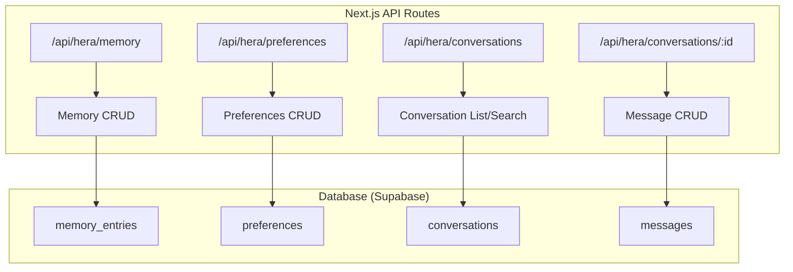
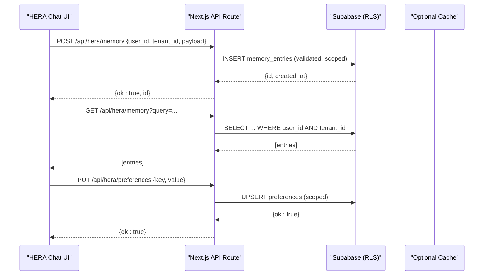
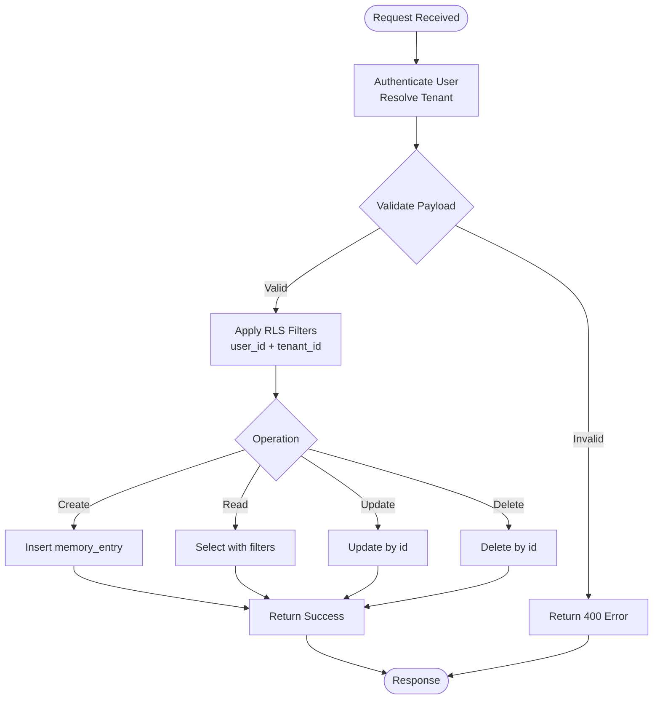
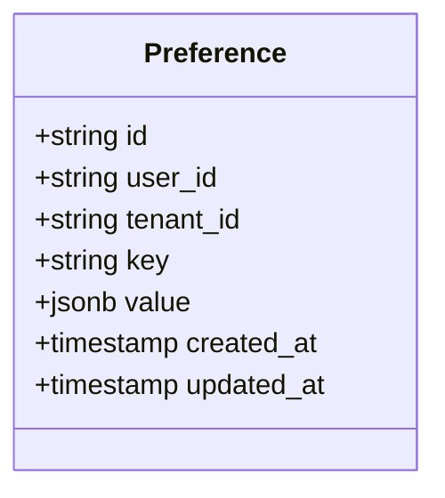
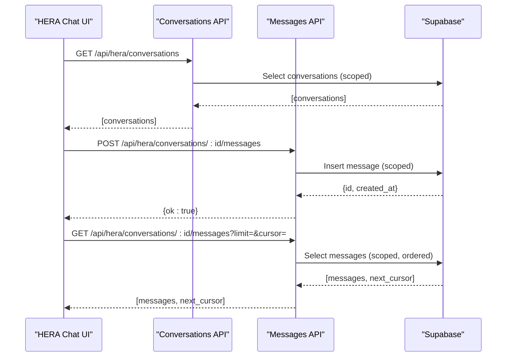
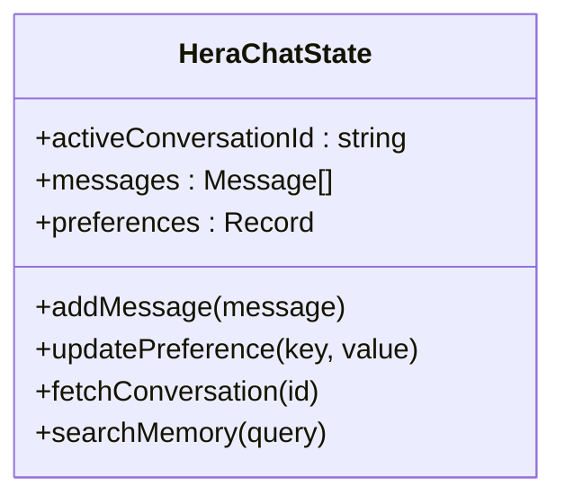
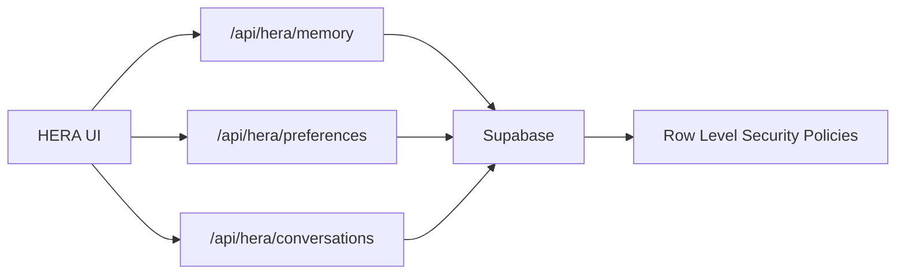

# Memory System & Preferences Management

<cite>
**Referenced Files in This Document**
- [apps/hr-suite/app/api/hera/memory/route.ts](file://apps/hr-suite/app/api/hera/memory/route.ts)
- [apps/hr-suite/app/api/hera/memory/route.test.ts](file://apps/hr-suite/app/api/hera/memory/route.test.ts)
- [apps/hr-suite/app/api/hera/preferences/route.ts](file://apps/hr-suite/app/api/hera/preferences/route.ts)
- [apps/hr-suite/app/api/hera/preferences/route.test.ts](file://apps/hr-suite/app/api/hera/preferences/route.test.ts)
- [apps/hr-suite/app/api/hera/conversations/route.ts](file://apps/hr-suite/app/api/hera/conversations/route.ts)
- [apps/hr-suite/app/api/hera/conversations/[conversationId]/route.ts](file://apps/hr-suite/app/api/hera/conversations/[conversationId]/route.ts)
- [apps/hr-suite/components/hera/hera-chat-state.ts](file://apps/hr-suite/components/hera/hera-chat-state.ts)
- [apps/hr-suite/components/hera/hera-chat.tsx](file://apps/hr-suite/components/hera/hera-chat.tsx)
- [apps/hr-suite/lib/hera/index.ts](file://apps/hr-suite/lib/hera/index.ts)
- [supabase/migrations/20260717100000_harden_hera_memory_and_preferences.sql](file://supabase/migrations/20260717100000_harden_hera_memory_and_preferences.sql)
- [supabase/migrations/20260717100500_index_hera_preferences.sql](file://supabase/migrations/20260717100500_index_hera_preferences.sql)
- [supabase/migrations/20260717101000_add_hera_message_metadata.sql](file://supabase/migrations/20260717101000_add_hera_message_metadata.sql)
- [supabase/tests/user_preferences_isolation.sql](file://supabase/tests/user_preferences_isolation.sql)
- [supabase/tests/hera_ai_agent.sql](file://supabase/tests/hera_ai_agent.sql)
</cite>

## Table of Contents
1. [Introduction](#introduction)
2. [Project Structure](#project-structure)
3. [Core Components](#core-components)
4. [Architecture Overview](#architecture-overview)
5. [Detailed Component Analysis](#detailed-component-analysis)
6. [Dependency Analysis](#dependency-analysis)
7. [Performance Considerations](#performance-considerations)
8. [Troubleshooting Guide](#troubleshooting-guide)
9. [Conclusion](#conclusion)
10. [Appendices](#appendices)

## Introduction
This document explains HERA’s memory system and preferences management within LiquidHR. It covers how conversation history is stored, retrieved, and managed across sessions; how user preferences and AI behavior configurations are persisted; the data models for memory entries, conversation metadata, and preference structures; and the API endpoints for memory CRUD, preference management, and conversation search. It also addresses data retention policies, privacy considerations, and tenant isolation for multi-tenant environments.

## Project Structure
HERA-related functionality is implemented as Next.js App Router API routes under apps/hr-suite/app/api/hera, with supporting UI components in apps/hr-suite/components/hera and database schema changes under supabase/migrations. Tests validate isolation and correctness.

**Diagram sources**
- [apps/hr-suite/app/api/hera/memory/route.ts](file://apps/hr-suite/app/api/hera/memory/route.ts)
- [apps/hr-suite/app/api/hera/preferences/route.ts](file://apps/hr-suite/app/api/hera/preferences/route.ts)
- [apps/hr-suite/app/api/hera/conversations/route.ts](file://apps/hr-suite/app/api/hera/conversations/route.ts)
- [apps/hr-suite/app/api/hera/conversations/[conversationId]/route.ts](file://apps/hr-suite/app/api/hera/conversations/[conversationId]/route.ts)
- [supabase/migrations/20260717100000_harden_hera_memory_and_preferences.sql](file://supabase/migrations/20260717100000_harden_hera_memory_and_preferences.sql)
- [supabase/migrations/20260717101000_add_hera_message_metadata.sql](file://supabase/migrations/20260717101000_add_hera_message_metadata.sql)

**Section sources**
- [apps/hr-suite/app/api/hera/memory/route.ts](file://apps/hr-suite/app/api/hera/memory/route.ts)
- [apps/hr-suite/app/api/hera/preferences/route.ts](file://apps/hr-suite/app/api/hera/preferences/route.ts)
- [apps/hr-suite/app/api/hera/conversations/route.ts](file://apps/hr-suite/app/api/hera/conversations/route.ts)
- [apps/hr-suite/app/api/hera/conversations/[conversationId]/route.ts](file://apps/hr-suite/app/api/hera/conversations/[conversationId]/route.ts)

## Core Components
- Memory API: Provides create, list, update, delete, and search operations for memory entries scoped to a user and tenant.
- Preferences API: Provides get/set/delete operations for user preferences, including AI behavior and personalization options.
- Conversations API: Manages conversation metadata and message lifecycle, enabling context retrieval and search.
- Client State: Frontend state for chat interactions that coordinates requests to the above APIs.

Key responsibilities:
- Enforce tenant and user scoping on all writes and reads.
- Validate inputs and return consistent error responses.
- Persist structured JSON payloads for memory and preferences.
- Index frequently queried fields for performance.

**Section sources**
- [apps/hr-suite/app/api/hera/memory/route.ts](file://apps/hr-suite/app/api/hera/memory/route.ts)
- [apps/hr-suite/app/api/hera/preferences/route.ts](file://apps/hr-suite/app/api/hera/preferences/route.ts)
- [apps/hr-suite/app/api/hera/conversations/route.ts](file://apps/hr-suite/app/api/hera/conversations/route.ts)
- [apps/hr-suite/app/api/hera/conversations/[conversationId]/route.ts](file://apps/hr-suite/app/api/hera/conversations/[conversationId]/route.ts)
- [apps/hr-suite/components/hera/hera-chat-state.ts](file://apps/hr-suite/components/hera/hera-chat-state.ts)

## Architecture Overview
The architecture follows a clear separation between client-side state, Next.js API routes, and Supabase-backed storage. All endpoints enforce authentication and tenant isolation via Row Level Security (RLS). Memory and preferences are stored as JSON documents with typed schemas enforced by migrations and tests.

**Diagram sources**
- [apps/hr-suite/app/api/hera/memory/route.ts](file://apps/hr-suite/app/api/hera/memory/route.ts)
- [apps/hr-suite/app/api/hera/preferences/route.ts](file://apps/hr-suite/app/api/hera/preferences/route.ts)
- [supabase/migrations/20260717100000_harden_hera_memory_and_preferences.sql](file://supabase/migrations/20260717100000_harden_hera_memory_and_preferences.sql)

## Detailed Component Analysis

### Memory API
- Endpoints:
  - POST /api/hera/memory: Create a memory entry for the authenticated user and tenant.
  - GET /api/hera/memory: List or search memory entries by query parameters (e.g., tags, date range, keywords).
  - PATCH /api/hera/memory/{id}: Update an existing memory entry.
  - DELETE /api/hera/memory/{id}: Delete a memory entry.
- Data model highlights:
  - Each memory entry includes user_id, tenant_id, payload (JSON), timestamps, and optional metadata like tags or categories.
  - Search supports filtering by text content and metadata fields.
- Validation and security:
  - Input validation ensures required fields and safe JSON shapes.
  - RLS enforces user and tenant scoping on all queries and mutations.
- Performance:
  - Indexes on user_id, tenant_id, and common filter columns improve query speed.
  - Pagination recommended for large result sets.

**Diagram sources**
- [apps/hr-suite/app/api/hera/memory/route.ts](file://apps/hr-suite/app/api/hera/memory/route.ts)
- [supabase/migrations/20260717100000_harden_hera_memory_and_preferences.sql](file://supabase/migrations/20260717100000_harden_hera_memory_and_preferences.sql)

**Section sources**
- [apps/hr-suite/app/api/hera/memory/route.ts](file://apps/hr-suite/app/api/hera/memory/route.ts)
- [apps/hr-suite/app/api/hera/memory/route.test.ts](file://apps/hr-suite/app/api/hera/memory/route.test.ts)
- [supabase/migrations/20260717100000_harden_hera_memory_and_preferences.sql](file://supabase/migrations/20260717100000_harden_hera_memory_and_preferences.sql)

### Preferences API
- Endpoints:
  - GET /api/hera/preferences: Retrieve current user preferences.
  - PUT /api/hera/preferences: Upsert a preference key-value pair.
  - DELETE /api/hera/preferences/{key}: Remove a preference.
- Data model highlights:
  - Preferences are stored per user and tenant with a unique key and JSON value.
  - Supports nested settings for AI behavior (e.g., tone, verbosity) and personalization (e.g., theme, language).
- Validation and security:
  - Key format and value constraints enforced at the API layer.
  - RLS ensures only the owning user can read/write their preferences within the same tenant.
- Performance:
  - Dedicated index on user_id and key accelerates lookups.

**Diagram sources**
- [apps/hr-suite/app/api/hera/preferences/route.ts](file://apps/hr-suite/app/api/hera/preferences/route.ts)
- [supabase/migrations/20260717100000_harden_hera_memory_and_preferences.sql](file://supabase/migrations/20260717100000_harden_hera_memory_and_preferences.sql)
- [supabase/migrations/20260717100500_index_hera_preferences.sql](file://supabase/migrations/20260717100500_index_hera_preferences.sql)

**Section sources**
- [apps/hr-suite/app/api/hera/preferences/route.ts](file://apps/hr-suite/app/api/hera/preferences/route.ts)
- [apps/hr-suite/app/api/hera/preferences/route.test.ts](file://apps/hr-suite/app/api/hera/preferences/route.test.ts)
- [supabase/migrations/20260717100500_index_hera_preferences.sql](file://supabase/migrations/20260717100500_index_hera_preferences.sql)

### Conversations API
- Endpoints:
  - GET /api/hera/conversations: List conversations for the authenticated user and tenant.
  - GET /api/hera/conversations/{conversationId}: Retrieve conversation metadata.
  - POST /api/hera/conversations/{conversationId}/messages: Append a message.
  - GET /api/hera/conversations/{conversationId}/messages: Fetch messages with pagination and optional filters.
  - DELETE /api/hera/conversations/{conversationId}: Archive or delete a conversation.
- Data model highlights:
  - Conversations store metadata such as title, status, and last activity timestamp.
  - Messages include role (user/assistant/system), content, and optional metadata (tool calls, citations).
- Search and retrieval:
  - Full-text search over message content and conversation titles where supported.
  - Cursor-based pagination for efficient loading of long histories.

**Diagram sources**
- [apps/hr-suite/app/api/hera/conversations/route.ts](file://apps/hr-suite/app/api/hera/conversations/route.ts)
- [apps/hr-suite/app/api/hera/conversations/[conversationId]/route.ts](file://apps/hr-suite/app/api/hera/conversations/[conversationId]/route.ts)
- [supabase/migrations/20260717101000_add_hera_message_metadata.sql](file://supabase/migrations/20260717101000_add_hera_message_metadata.sql)

**Section sources**
- [apps/hr-suite/app/api/hera/conversations/route.ts](file://apps/hr-suite/app/api/hera/conversations/route.ts)
- [apps/hr-suite/app/api/hera/conversations/[conversationId]/route.ts](file://apps/hr-suite/app/api/hera/conversations/[conversationId]/route.ts)
- [supabase/migrations/20260717101000_add_hera_message_metadata.sql](file://supabase/migrations/20260717101000_add_hera_message_metadata.sql)

### Client-Side Chat State
- Responsibilities:
  - Maintain local state for active conversations and pending messages.
  - Coordinate API calls for memory and preferences updates during chat flows.
  - Provide optimistic updates and rollback on errors.
- Integration points:
  - Calls to memory and preferences endpoints to persist context and settings.
  - Subscription patterns for real-time updates if enabled.

**Diagram sources**
- [apps/hr-suite/components/hera/hera-chat-state.ts](file://apps/hr-suite/components/hera/hera-chat-state.ts)
- [apps/hr-suite/components/hera/hera-chat.tsx](file://apps/hr-suite/components/hera/hera-chat.tsx)

**Section sources**
- [apps/hr-suite/components/hera/hera-chat-state.ts](file://apps/hr-suite/components/hera/hera-chat-state.ts)
- [apps/hr-suite/components/hera/hera-chat.tsx](file://apps/hr-suite/components/hera/hera-chat.tsx)

## Dependency Analysis
- API routes depend on Supabase client configuration and environment variables.
- Database schema relies on migrations for tables, indexes, and RLS policies.
- Tests ensure isolation and correct scoping for users and tenants.

**Diagram sources**
- [apps/hr-suite/app/api/hera/memory/route.ts](file://apps/hr-suite/app/api/hera/memory/route.ts)
- [apps/hr-suite/app/api/hera/preferences/route.ts](file://apps/hr-suite/app/api/hera/preferences/route.ts)
- [apps/hr-suite/app/api/hera/conversations/route.ts](file://apps/hr-suite/app/api/hera/conversations/route.ts)
- [supabase/migrations/20260717100000_harden_hera_memory_and_preferences.sql](file://supabase/migrations/20260717100000_harden_hera_memory_and_preferences.sql)

**Section sources**
- [supabase/tests/user_preferences_isolation.sql](file://supabase/tests/user_preferences_isolation.sql)
- [supabase/tests/hera_ai_agent.sql](file://supabase/tests/hera_ai_agent.sql)

## Performance Considerations
- Use pagination and cursors for conversation messages and memory lists.
- Leverage indexes on user_id, tenant_id, and frequently filtered fields.
- Avoid heavy JSON transformations in hot paths; precompute summaries when possible.
- Cache frequent reads (e.g., preferences) at the edge or application layer with appropriate invalidation.

[No sources needed since this section provides general guidance]

## Troubleshooting Guide
Common issues and resolutions:
- Authentication failures: Ensure valid session tokens and correct tenant resolution.
- Permission denied: Verify RLS policies allow access for the current user and tenant.
- Validation errors: Check input schemas for required fields and types.
- Slow queries: Inspect indexes and consider query optimization or caching.

Relevant validations and tests:
- Memory route tests confirm CRUD operations and scoping.
- Preferences route tests verify upsert and deletion behaviors.
- Isolation tests ensure tenant boundaries are respected.

**Section sources**
- [apps/hr-suite/app/api/hera/memory/route.test.ts](file://apps/hr-suite/app/api/hera/memory/route.test.ts)
- [apps/hr-suite/app/api/hera/preferences/route.test.ts](file://apps/hr-suite/app/api/hera/preferences/route.test.ts)
- [supabase/tests/user_preferences_isolation.sql](file://supabase/tests/user_preferences_isolation.sql)

## Conclusion
HERA’s memory and preferences systems provide robust, secure, and scalable support for conversation history and user settings. The design emphasizes tenant isolation, strong validation, and performance-oriented indexing. By following the documented APIs and data models, developers can implement custom memory storage strategies, manage conversation context effectively, and persist user preferences reliably.

[No sources needed since this section summarizes without analyzing specific files]

## Appendices

### Data Models Summary
- Memory Entry:
  - Fields: id, user_id, tenant_id, payload (JSON), tags/categories, created_at, updated_at.
  - Operations: Create, Read, Update, Delete, Search.
- Preference:
  - Fields: id, user_id, tenant_id, key (unique per user+tenant), value (JSON), created_at, updated_at.
  - Operations: Get, Upsert, Delete.
- Conversation:
  - Fields: id, user_id, tenant_id, title, status, last_activity_at, created_at, updated_at.
- Message:
  - Fields: id, conversation_id, role, content, metadata (JSON), created_at.

**Section sources**
- [supabase/migrations/20260717100000_harden_hera_memory_and_preferences.sql](file://supabase/migrations/20260717100000_harden_hera_memory_and_preferences.sql)
- [supabase/migrations/20260717101000_add_hera_message_metadata.sql](file://supabase/migrations/20260717101000_add_hera_message_metadata.sql)

### Privacy and Retention
- Data retention:
  - Implement configurable retention policies for memory entries and conversation messages.
  - Support archival and soft-delete workflows for compliance.
- Privacy considerations:
  - Minimize sensitive data in memory payloads.
  - Encrypt sensitive preferences at rest where required.
  - Audit access logs for high-sensitivity operations.

[No sources needed since this section provides general guidance]

### Multi-Tenant Isolation
- Enforcement:
  - All queries and mutations must include user_id and tenant_id filters.
  - RLS policies restrict cross-tenant access.
- Testing:
  - Use isolation tests to assert tenant boundaries and user scoping.

**Section sources**
- [supabase/tests/user_preferences_isolation.sql](file://supabase/tests/user_preferences_isolation.sql)
- [supabase/tests/hera_ai_agent.sql](file://supabase/tests/hera_ai_agent.sql)