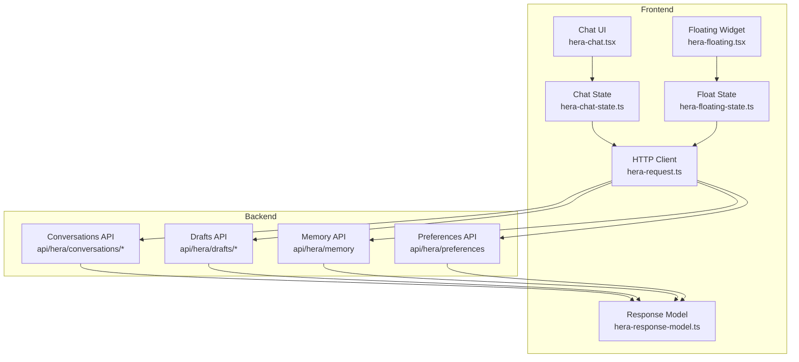
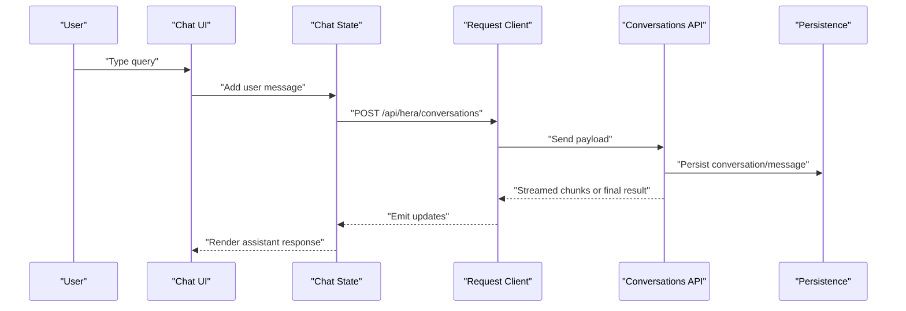
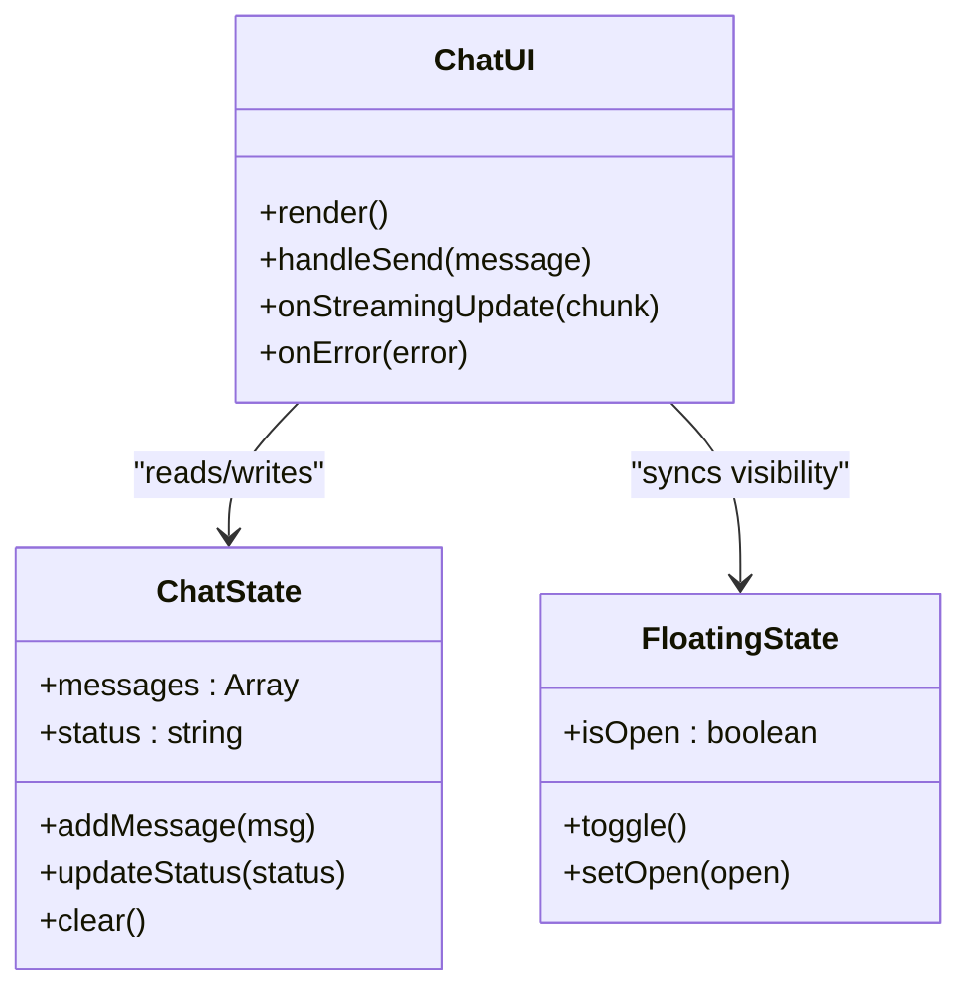
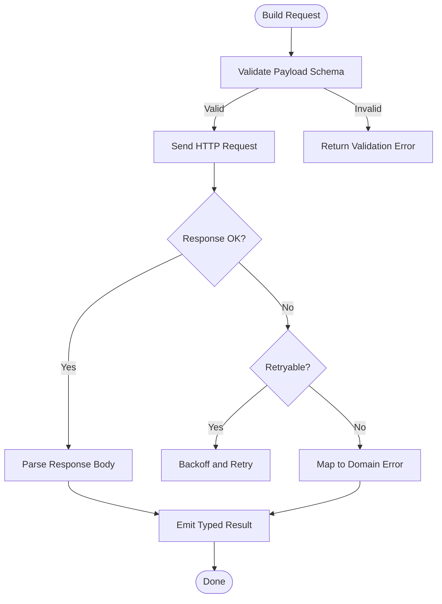
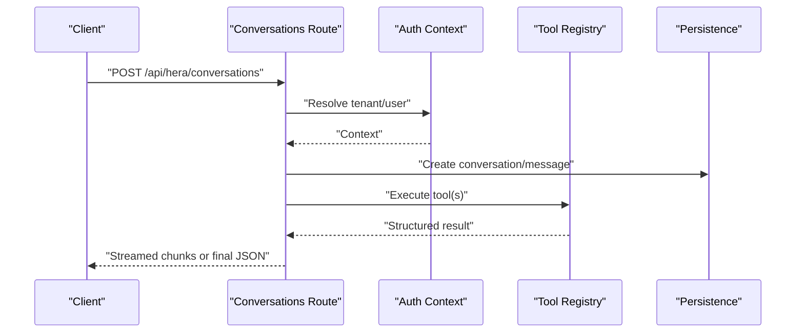
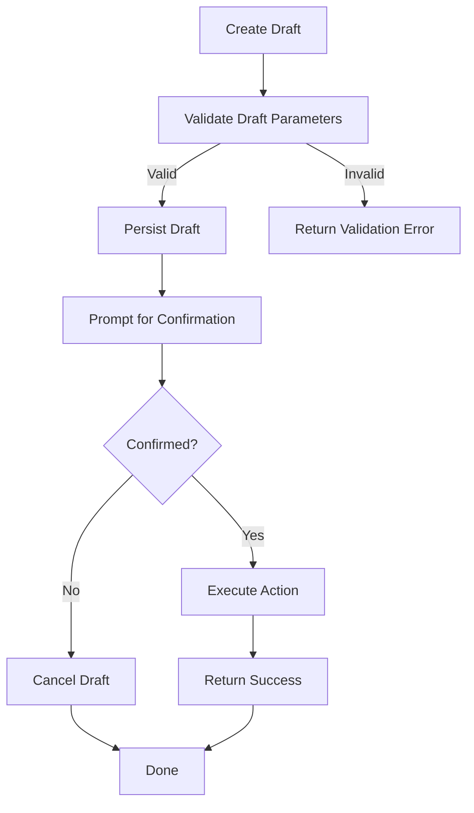
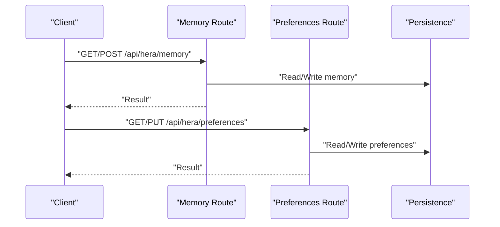
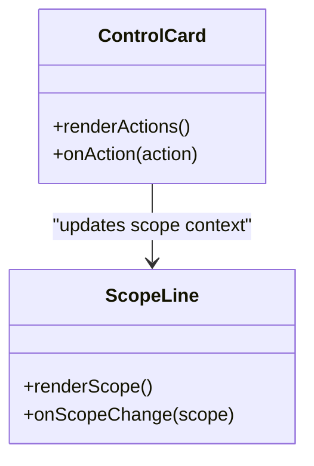
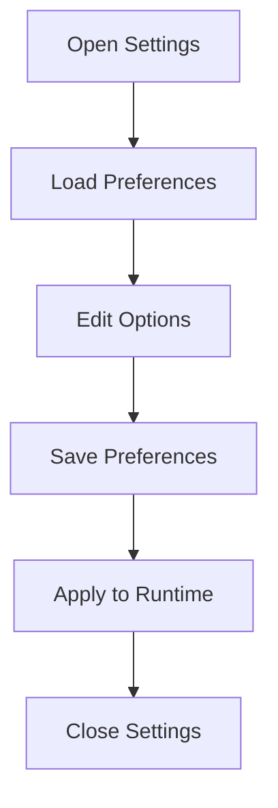
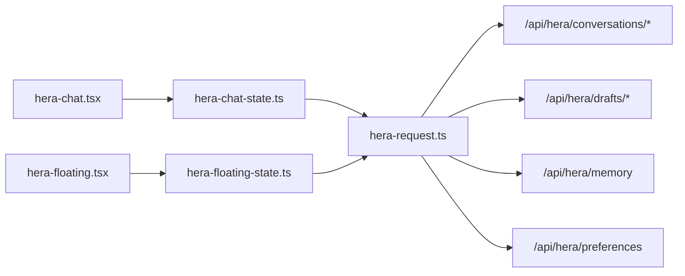

# Tool Execution Model & Natural Language Processing

<cite>
**Referenced Files in This Document**
- [hera-chat.tsx](file://apps/hr-suite/components/hera/hera-chat.tsx)
- [hera-chat-state.ts](file://apps/hr-suite/components/hera/hera-chat-state.ts)
- [hera-floating.tsx](file://apps/hr-suite/components/hera/hera-floating.tsx)
- [hera-floating-state.ts](file://apps/hr-suite/components/hera/hera-floating-state.ts)
- [hera-request.ts](file://apps/hr-suite/components/hera/hera-request.ts)
- [hera-response-model.ts](file://apps/hr-suite/components/hera/hera-response-model.ts)
- [hera-control-card.tsx](file://apps/hr-suite/components/hera/hera-control-card.tsx)
- [hera-scope-line.tsx](file://apps/hr-suite/components/hera/hera-scope-line.tsx)
- [hera-settings.tsx](file://apps/hr-suite/components/hera/hera-settings.tsx)
- [route.ts](file://apps/hr-suite/app/api/hera/conversations/route.ts)
- [route.ts](file://apps/hr-suite/app/api/hera/conversations/[conversationId]/route.ts)
- [route.ts](file://apps/hr-suite/app/api/hera/drafts/[draftId]/route.ts)
- [route.ts](file://apps/hr-suite/app/api/hera/memory/route.ts)
- [route.ts](file://apps/hr-suite/app/api/hera/preferences/route.ts)
- [page.tsx](file://apps/hr-suite/app/(dashboard)/hera/page.tsx)
- [HERA_AI_AGENT.md](file://docs/requirements/chatbot/HERA_AI_AGENT.md)
- [HR_CHATBOT_AGENT.md](file://docs/requirements/chatbot/HR_CHATBOT_AGENT.md)
- [HR_CHATBOT_LEES_EN_SCHRIJFTOOLS.md](file://docs/requirements/chatbot/HR_CHATBOT_LEES_EN_SCHRIJFTOOLS.md)
- [HR_CHATBOT_TRANSACTIONELE_TOOLS.md](file://docs/requirements/chatbot/HR_CHATBOT_TRANSACTIONELE_TOOLS.md)
</cite>

## Table of Contents
1. [Introduction](#introduction)
2. [Project Structure](#project-structure)
3. [Core Components](#core-components)
4. [Architecture Overview](#architecture-overview)
5. [Detailed Component Analysis](#detailed-component-analysis)
6. [Dependency Analysis](#dependency-analysis)
7. [Performance Considerations](#performance-considerations)
8. [Troubleshooting Guide](#troubleshooting-guide)
9. [Conclusion](#conclusion)
10. [Appendices](#appendices)

## Introduction
This document explains HERA’s tool execution model and natural language processing capabilities within the HR Suite application. It covers how user queries are parsed, how intended actions are identified, and how requests are dispatched to tools. It also documents the tool registration system, parameter extraction, response formatting, request/response lifecycle, error handling strategies, validation mechanisms, AI model integration, prompt engineering patterns, safety measures, performance considerations, and caching strategies for frequently used operations.

## Project Structure
HERA spans both frontend components and backend API routes:
- Frontend chat UI and state management live under components/hera.
- Backend endpoints for conversations, drafts, memory, and preferences live under app/api/hera.
- Requirements and design docs describe agent behavior, tools, and safety constraints.

**Diagram sources**
- [hera-chat.tsx](file://apps/hr-suite/components/hera/hera-chat.tsx)
- [hera-chat-state.ts](file://apps/hr-suite/components/hera/hera-chat-state.ts)
- [hera-floating.tsx](file://apps/hr-suite/components/hera/hera-floating.tsx)
- [hera-floating-state.ts](file://apps/hr-suite/components/hera/hera-floating-state.ts)
- [hera-request.ts](file://apps/hr-suite/components/hera/hera-request.ts)
- [hera-response-model.ts](file://apps/hr-suite/components/hera/hera-response-model.ts)
- [route.ts](file://apps/hr-suite/app/api/hera/conversations/route.ts)
- [route.ts](file://apps/hr-suite/app/api/hera/conversations/[conversationId]/route.ts)
- [route.ts](file://apps/hr-suite/app/api/hera/drafts/[draftId]/route.ts)
- [route.ts](file://apps/hr-suite/app/api/hera/memory/route.ts)
- [route.ts](file://apps/hr-suite/app/api/hera/preferences/route.ts)

**Section sources**
- [page.tsx](file://apps/hr-suite/app/(dashboard)/hera/page.tsx)
- [HERA_AI_AGENT.md](file://docs/requirements/chatbot/HERA_AI_AGENT.md)
- [HR_CHATBOT_AGENT.md](file://docs/requirements/chatbot/HR_CHATBOT_AGENT.md)

## Core Components
- Chat UI and orchestration: The chat interface manages message history, streaming responses, and user interactions.
- Floating widget: A compact entry point that opens the chat and shares state with the main page.
- Request client: Encapsulates HTTP calls to HERA APIs with retries, timeouts, and error normalization.
- Response model: Defines typed structures for tool outputs and conversation messages.
- Backend routes: Handle conversation persistence, draft creation/confirmation, memory read/write, and user preferences.

Key responsibilities:
- Parse natural language input into structured intents.
- Validate parameters against tool schemas.
- Execute tools safely with authorization checks.
- Stream or return results consistently.

**Section sources**
- [hera-chat.tsx](file://apps/hr-suite/components/hera/hera-chat.tsx)
- [hera-chat-state.ts](file://apps/hr-suite/components/hera/hera-chat-state.ts)
- [hera-floating.tsx](file://apps/hr-suite/components/hera/hera-floating.tsx)
- [hera-floating-state.ts](file://apps/hr-suite/components/hera/hera-floating-state.ts)
- [hera-request.ts](file://apps/hr-suite/components/hera/hera-request.ts)
- [hera-response-model.ts](file://apps/hr-suite/components/hera/hera-response-model.ts)

## Architecture Overview
The HERA architecture follows a clear separation between UI, state, networking, and server-side routing. The chat UI composes messages and orchestrates flows; the request client communicates with backend endpoints; backend routes implement tool execution logic and persist state.

**Diagram sources**
- [hera-chat.tsx](file://apps/hr-suite/components/hera/hera-chat.tsx)
- [hera-chat-state.ts](file://apps/hr-suite/components/hera/hera-chat-state.ts)
- [hera-request.ts](file://apps/hr-suite/components/hera/hera-request.ts)
- [route.ts](file://apps/hr-suite/app/api/hera/conversations/route.ts)

## Detailed Component Analysis

### Chat UI and State Orchestration
- Manages conversation lifecycle: creating sessions, appending messages, handling streaming updates, and rendering tool call artifacts.
- Coordinates with floating state to keep UI consistent across contexts.
- Implements retry/backoff on transient network failures and surfaces errors to users.

**Diagram sources**
- [hera-chat.tsx](file://apps/hr-suite/components/hera/hera-chat.tsx)
- [hera-chat-state.ts](file://apps/hr-suite/components/hera/hera-chat-state.ts)
- [hera-floating.tsx](file://apps/hr-suite/components/hera/hera-floating.tsx)
- [hera-floating-state.ts](file://apps/hr-suite/components/hera/hera-floating-state.ts)

**Section sources**
- [hera-chat.tsx](file://apps/hr-suite/components/hera/hera-chat.tsx)
- [hera-chat-state.ts](file://apps/hr-suite/components/hera/hera-chat-state.ts)
- [hera-floating.tsx](file://apps/hr-suite/components/hera/hera-floating.tsx)
- [hera-floating-state.ts](file://apps/hr-suite/components/hera/hera-floating-state.ts)

### Request Client and Response Model
- Normalizes HTTP responses, handles timeouts, retries, and error mapping.
- Enforces content-type expectations and parses JSON streams when applicable.
- Provides typed helpers for building payloads and interpreting tool results.

**Diagram sources**
- [hera-request.ts](file://apps/hr-suite/components/hera/hera-request.ts)
- [hera-response-model.ts](file://apps/hr-suite/components/hera/hera-response-model.ts)

**Section sources**
- [hera-request.ts](file://apps/hr-suite/components/hera/hera-request.ts)
- [hera-response-model.ts](file://apps/hr-suite/components/hera/hera-response-model.ts)

### Backend Conversations API
- Accepts new messages, persists them, and returns streamed or batched responses.
- Applies authorization checks based on tenant and role context.
- Integrates with memory and preferences services to enrich context.

**Diagram sources**
- [route.ts](file://apps/hr-suite/app/api/hera/conversations/route.ts)
- [route.ts](file://apps/hr-suite/app/api/hera/conversations/[conversationId]/route.ts)

**Section sources**
- [route.ts](file://apps/hr-suite/app/api/hera/conversations/route.ts)
- [route.ts](file://apps/hr-suite/app/api/hera/conversations/[conversationId]/route.ts)

### Drafts API (Confirmation Workflow)
- Supports drafting actions that require explicit confirmation before execution.
- Validates draft payloads and enforces safety gates.
- Returns confirmation prompts and tracks draft state until confirmed.

**Diagram sources**
- [route.ts](file://apps/hr-suite/app/api/hera/drafts/[draftId]/route.ts)

**Section sources**
- [route.ts](file://apps/hr-suite/app/api/hera/drafts/[draftId]/route.ts)

### Memory and Preferences APIs
- Memory API provides read/write access to contextual data used by tools.
- Preferences API stores per-user settings influencing tool behavior and output formatting.

**Diagram sources**
- [route.ts](file://apps/hr-suite/app/api/hera/memory/route.ts)
- [route.ts](file://apps/hr-suite/app/api/hera/preferences/route.ts)

**Section sources**
- [route.ts](file://apps/hr-suite/app/api/hera/memory/route.ts)
- [route.ts](file://apps/hr-suite/app/api/hera/preferences/route.ts)

### Control Card and Scope Line UI
- Control card exposes quick actions and toggles relevant to HERA features.
- Scope line displays current operational scope (e.g., tenant, department) to inform tool resolution.

**Diagram sources**
- [hera-control-card.tsx](file://apps/hr-suite/components/hera/hera-control-card.tsx)
- [hera-scope-line.tsx](file://apps/hr-suite/components/hera/hera-scope-line.tsx)

**Section sources**
- [hera-control-card.tsx](file://apps/hr-suite/components/hera/hera-control-card.tsx)
- [hera-scope-line.tsx](file://apps/hr-suite/components/hera/hera-scope-line.tsx)

### Settings UI
- Allows configuration of HERA-related options such as model selection, safety thresholds, and feature flags.

**Diagram sources**
- [hera-settings.tsx](file://apps/hr-suite/components/hera/hera-settings.tsx)

**Section sources**
- [hera-settings.tsx](file://apps/hr-suite/components/hera/hera-settings.tsx)

## Dependency Analysis
The following diagram shows key dependencies between frontend modules and backend endpoints.

**Diagram sources**
- [hera-chat.tsx](file://apps/hr-suite/components/hera/hera-chat.tsx)
- [hera-chat-state.ts](file://apps/hr-suite/components/hera/hera-chat-state.ts)
- [hera-floating.tsx](file://apps/hr-suite/components/hera/hera-floating.tsx)
- [hera-floating-state.ts](file://apps/hr-suite/components/hera/hera-floating-state.ts)
- [hera-request.ts](file://apps/hr-suite/components/hera/hera-request.ts)
- [route.ts](file://apps/hr-suite/app/api/hera/conversations/route.ts)
- [route.ts](file://apps/hr-suite/app/api/hera/drafts/[draftId]/route.ts)
- [route.ts](file://apps/hr-suite/app/api/hera/memory/route.ts)
- [route.ts](file://apps/hr-suite/app/api/hera/preferences/route.ts)

**Section sources**
- [hera-chat.tsx](file://apps/hr-suite/components/hera/hera-chat.tsx)
- [hera-chat-state.ts](file://apps/hr-suite/components/hera/hera-chat-state.ts)
- [hera-floating.tsx](file://apps/hr-suite/components/hera/hera-floating.tsx)
- [hera-floating-state.ts](file://apps/hr-suite/components/hera/hera-floating-state.ts)
- [hera-request.ts](file://apps/hr-suite/components/hera/hera-request.ts)
- [route.ts](file://apps/hr-suite/app/api/hera/conversations/route.ts)
- [route.ts](file://apps/hr-suite/app/api/hera/drafts/[draftId]/route.ts)
- [route.ts](file://apps/hr-suite/app/api/hera/memory/route.ts)
- [route.ts](file://apps/hr-suite/app/api/hera/preferences/route.ts)

## Performance Considerations
- Streaming responses: Prefer chunked responses for long-running tool executions to improve perceived latency.
- Caching strategies: Cache frequent reads (e.g., master data lookups) at the API layer with short TTLs; invalidate on mutations.
- Debouncing inputs: Avoid excessive requests during rapid typing by debouncing search-like queries.
- Connection pooling: Reuse HTTP connections and minimize handshake overhead.
- Batch operations: Group multiple small reads into single requests where possible.
- Pagination and limits: Enforce sensible defaults for list operations to prevent large payloads.

[No sources needed since this section provides general guidance]

## Troubleshooting Guide
Common issues and resolutions:
- Network errors: Check connectivity, timeouts, and retry policies in the request client.
- Validation failures: Ensure payloads match expected schemas; inspect error messages returned by the API.
- Authorization errors: Verify tenant and user context; confirm permissions for requested tools.
- Streaming interruptions: Implement reconnection logic and partial message recovery.
- Draft confirmation loops: Ensure confirmation prompts are displayed and state transitions are handled correctly.

**Section sources**
- [hera-request.ts](file://apps/hr-suite/components/hera/hera-request.ts)
- [route.ts](file://apps/hr-suite/app/api/hera/conversations/route.ts)
- [route.ts](file://apps/hr-suite/app/api/hera/drafts/[draftId]/route.ts)

## Conclusion
HERA integrates a robust tool execution model with natural language processing through a clear separation of concerns: UI components manage interaction, state coordinates flows, the request client handles networking, and backend routes enforce safety, validation, and persistence. By adhering to the documented patterns for tool registration, parameter extraction, response formatting, and error handling, developers can extend HERA with custom tools and multi-step workflows while maintaining performance and security.

[No sources needed since this section summarizes without analyzing specific files]

## Appendices

### Creating Custom Tools
- Define tool metadata: name, description, parameters schema, and safety level.
- Implement parameter extraction from natural language using the AI agent’s parsing capabilities.
- Register the tool with the backend registry so it is discoverable by the conversation handler.
- Provide response formatting rules to ensure consistent outputs.

**Section sources**
- [HR_CHATBOT_LEES_EN_SCHRIJFTOOLS.md](file://docs/requirements/chatbot/HR_CHATBOT_LEES_EN_SCHRIJFTOOLS.md)
- [HR_CHATBOT_TRANSACTIONELE_TOOLS.md](file://docs/requirements/chatbot/HR_CHATBOT_TRANSACTIONELE_TOOLS.md)

### Multi-Step Workflows
- Use drafts to stage complex actions requiring confirmation.
- Chain tool calls with intermediate validations and state checkpoints.
- Stream progress updates to the UI for transparency.

**Section sources**
- [route.ts](file://apps/hr-suite/app/api/hera/drafts/[draftId]/route.ts)
- [HERA_AI_AGENT.md](file://docs/requirements/chatbot/HERA_AI_AGENT.md)

### Safety Measures
- Enforce authorization checks at every tool boundary.
- Require explicit confirmation for destructive operations via drafts.
- Limit tool exposure based on roles and tenant context.

**Section sources**
- [HR_CHATBOT_AGENT.md](file://docs/requirements/chatbot/HR_CHATBOT_AGENT.md)
- [HERA_AI_AGENT.md](file://docs/requirements/chatbot/HERA_AI_AGENT.md)

### AI Model Integration and Prompt Engineering
- Configure model selection and safety thresholds via preferences.
- Use structured prompts to extract intents and parameters reliably.
- Maintain context windows efficiently by summarizing prior turns when necessary.

**Section sources**
- [hera-settings.tsx](file://apps/hr-suite/components/hera/hera-settings.tsx)
- [HR_CHATBOT_AGENT.md](file://docs/requirements/chatbot/HR_CHATBOT_AGENT.md)