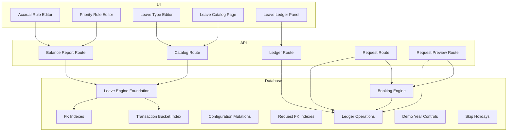
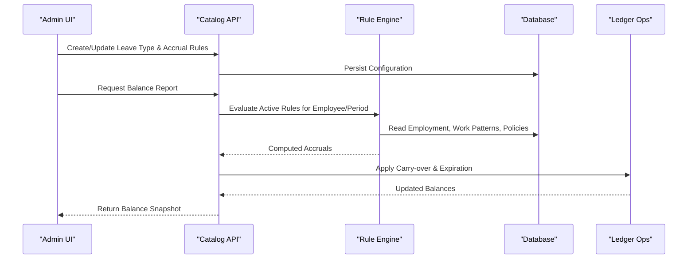
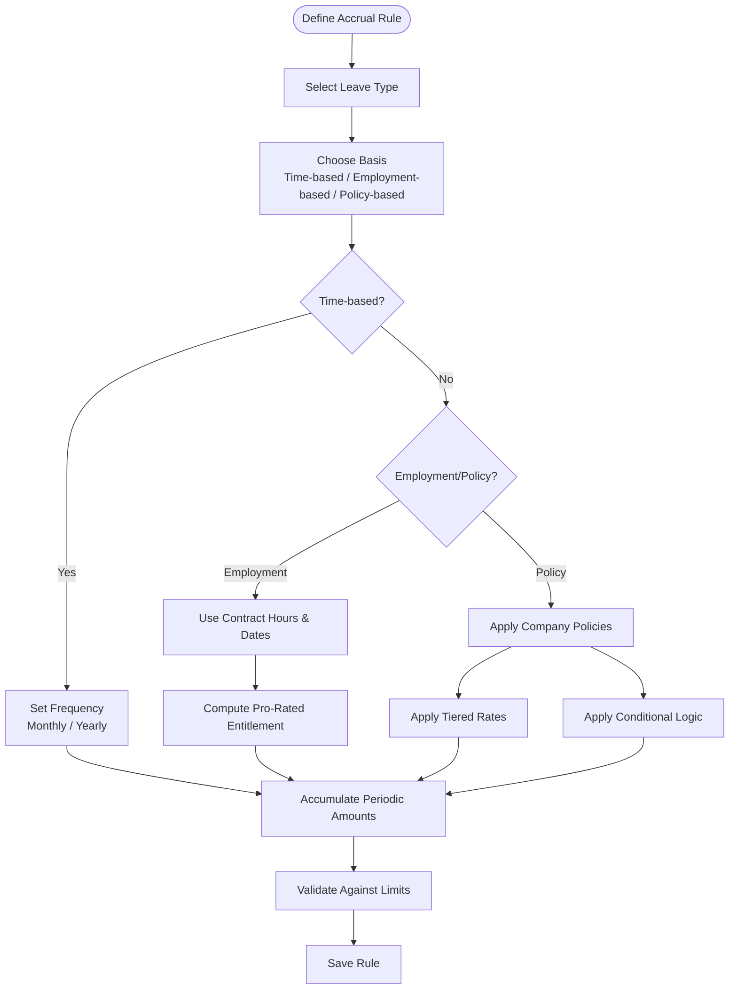
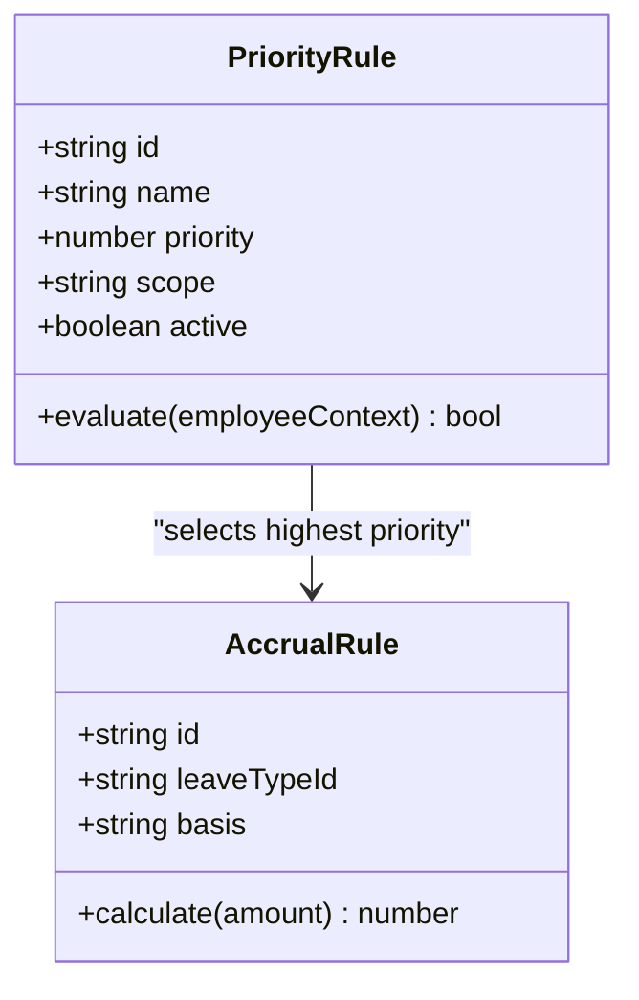
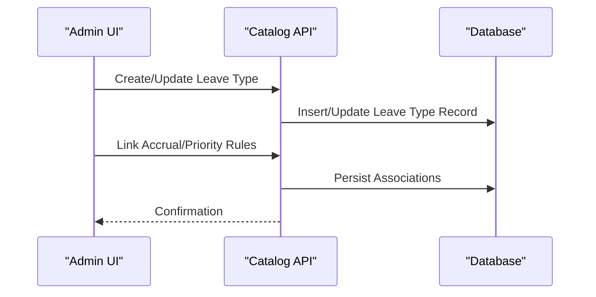
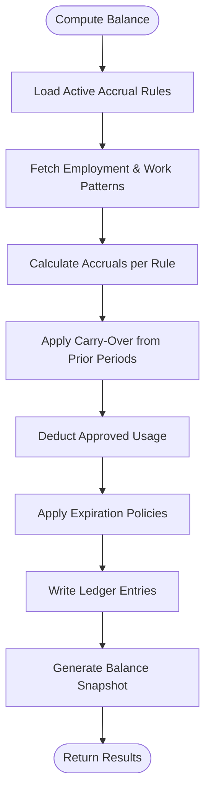
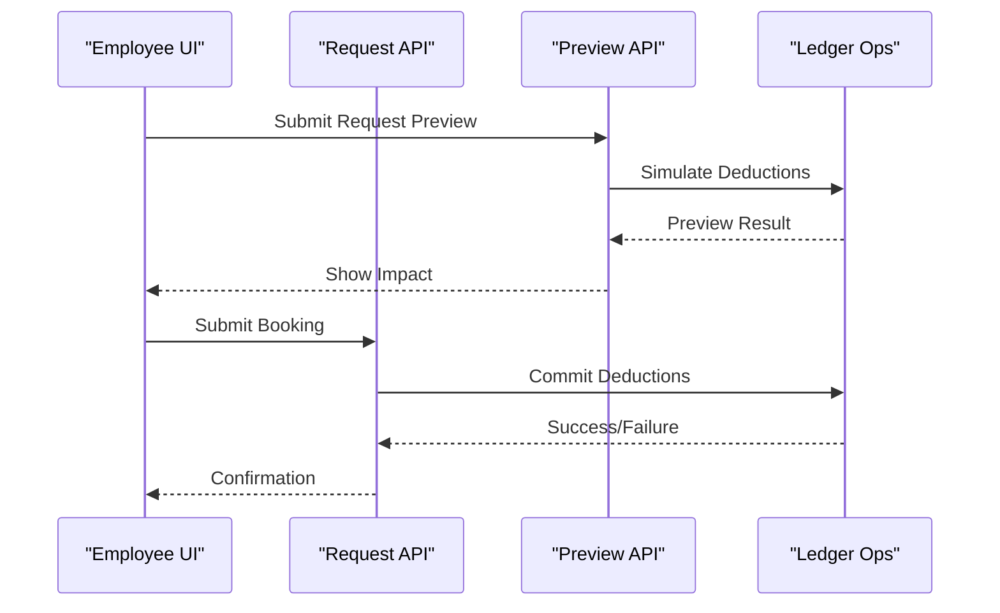
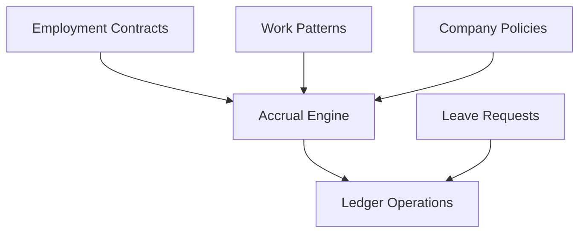

# Accrual Engine

<cite>
**Referenced Files in This Document**
- [leave_engine_foundation.sql](file://apps/hr-suite/supabase/migrations/20260722142551_add_leave_engine_foundation.sql)
- [leave_engine_fk_indexes.sql](file://apps/hr-suite/supabase/migrations/20260722144232_add_leave_engine_fk_indexes.sql)
- [leave_transaction_bucket_fk_index.sql](file://apps/hr-suite/supabase/migrations/20260722144344_add_leave_transaction_bucket_fk_index.sql)
- [leave_configuration_mutation_functions.sql](file://apps/hr-suite/supabase/migrations/20260722151920_add_leave_configuration_mutation_functions.sql)
- [leave_request_booking_engine.sql](file://apps/hr-suite/supabase/migrations/20260722190000_add_leave_request_booking_engine.sql)
- [leave_request_fk_indexes.sql](file://apps/hr-suite/supabase/migrations/20260722191500_add_leave_request_fk_indexes.sql)
- [leave_ledger_operations.sql](file://apps/hr-suite/supabase/migrations/20260722192000_add_leave_ledger_operations.sql)
- [leave_demo_year_controls.sql](file://apps/hr-suite/supabase/migrations/20260722192100_seed_leave_demo_year_controls.sql)
- [skip_holidays_in_leave_requests.sql](file://apps/hr-suite/supabase/migrations/20260722192500_skip_holidays_in_leave_requests.sql)
- [accrual_rule_editor.tsx](file://apps/hr-suite/components/leave/accrual_rule_editor.tsx)
- [priority_rule_editor.tsx](file://apps/hr-suite/components/leave/priority_rule_editor.tsx)
- [leave_type_editor.tsx](file://apps/hr-suite/components/leave/leave_type_editor.tsx)
- [leave-catalog-page.tsx](file://apps/hr-suite/components/leave/leave-catalog-page.tsx)
- [leave-ledger-panel.tsx](file://apps/hr-suite/components/leave/leave-ledger-panel.tsx)
- [priority-rules-page.tsx](file://apps/hr-suite/components/leave/priority-rules-page.tsx)
- [route.ts](file://apps/hr-suite/app/api/leave/balance-report/route.ts)
- [route.test.ts](file://apps/hr-suite/app/api/leave/balance-report/route.test.ts)
- [route.ts](file://apps/hr-suite/app/api/leave/catalog/route.ts)
- [route.test.ts](file://apps/hr-suite/app/api/leave/catalog/route.test.ts)
- [route.ts](file://apps/hr-suite/app/api/leave/ledger/route.ts)
- [route.ts](file://apps/hr-suite/app/api/leave/request/route.ts)
- [route.ts](file://apps/hr-suite/app/api/leave/request/preview/route.ts)
</cite>

## Table of Contents
1. [Introduction](#introduction)
2. [Project Structure](#project-structure)
3. [Core Components](#core-components)
4. [Architecture Overview](#architecture-overview)
5. [Detailed Component Analysis](#detailed-component-analysis)
6. [Dependency Analysis](#dependency-analysis)
7. [Performance Considerations](#performance-considerations)
8. [Troubleshooting Guide](#troubleshooting-guide)
9. [Conclusion](#conclusion)
10. [Appendices](#appendices)

## Introduction
This document explains the Accrual Engine that calculates and manages leave entitlements in LiquidHR. It covers how accrual rules are defined via the rule editor, time-based accruals (monthly/yearly), employment-driven calculations, policy-driven adjustments, balance calculation algorithms, carry-over and expiration policies, and integrations with employment contracts, work patterns, and company policies. Practical examples illustrate pro-rated entitlements, tiered accrual rates, and conditional accruals based on performance or tenure. Edge cases such as mid-year changes, part-time workers, and international regulations are addressed.

## Project Structure
The Accrual Engine spans UI components for configuration, API routes for operations, and database migrations defining schemas, indexes, and stored procedures. Key areas:
- UI: Leave catalog, accrual rule editor, priority rule editor, ledger panel.
- API: Balance report, catalog management, ledger queries, request booking and preview.
- Database: Foundation schema, indexes, mutation functions, ledger operations, demo seeds.

**Diagram sources**
- [accrual_rule_editor.tsx](file://apps/hr-suite/components/leave/accrual_rule_editor.tsx)
- [priority_rule_editor.tsx](file://apps/hr-suite/components/leave/priority_rule_editor.tsx)
- [leave_type_editor.tsx](file://apps/hr-suite/components/leave/leave_type_editor.tsx)
- [leave-catalog-page.tsx](file://apps/hr-suite/components/leave/leave-catalog-page.tsx)
- [leave-ledger-panel.tsx](file://apps/hr-suite/components/leave/leave-ledger-panel.tsx)
- [route.ts](file://apps/hr-suite/app/api/leave/balance-report/route.ts)
- [route.ts](file://apps/hr-suite/app/api/leave/catalog/route.ts)
- [route.ts](file://apps/hr-suite/app/api/leave/ledger/route.ts)
- [route.ts](file://apps/hr-suite/app/api/leave/request/route.ts)
- [route.ts](file://apps/hr-suite/app/api/leave/request/preview/route.ts)
- [leave_engine_foundation.sql](file://apps/hr-suite/supabase/migrations/20260722142551_add_leave_engine_foundation.sql)
- [leave_engine_fk_indexes.sql](file://apps/hr-suite/supabase/migrations/20260722144232_add_leave_engine_fk_indexes.sql)
- [leave_transaction_bucket_fk_index.sql](file://apps/hr-suite/supabase/migrations/20260722144344_add_leave_transaction_bucket_fk_index.sql)
- [leave_configuration_mutation_functions.sql](file://apps/hr-suite/supabase/migrations/20260722151920_add_leave_configuration_mutation_functions.sql)
- [leave_request_booking_engine.sql](file://apps/hr-suite/supabase/migrations/20260722190000_add_leave_request_booking_engine.sql)
- [leave_request_fk_indexes.sql](file://apps/hr-suite/supabase/migrations/20260722191500_add_leave_request_fk_indexes.sql)
- [leave_ledger_operations.sql](file://apps/hr-suite/supabase/migrations/20260722192000_add_leave_ledger_operations.sql)
- [leave_demo_year_controls.sql](file://apps/hr-suite/supabase/migrations/20260722192100_seed_leave_demo_year_controls.sql)
- [skip_holidays_in_leave_requests.sql](file://apps/hr-suite/supabase/migrations/20260722192500_skip_holidays_in_leave_requests.sql)

**Section sources**
- [leave_engine_foundation.sql](file://apps/hr-suite/supabase/migrations/20260722142551_add_leave_engine_foundation.sql)
- [leave_configuration_mutation_functions.sql](file://apps/hr-suite/supabase/migrations/20260722151920_add_leave_configuration_mutation_functions.sql)
- [leave_request_booking_engine.sql](file://apps/hr-suite/supabase/migrations/20260722190000_add_leave_request_booking_engine.sql)
- [leave_ledger_operations.sql](file://apps/hr-suite/supabase/migrations/20260722192000_add_leave_ledger_operations.sql)
- [accrual_rule_editor.tsx](file://apps/hr-suite/components/leave/accrual_rule_editor.tsx)
- [priority_rule_editor.tsx](file://apps/hr-suite/components/leave/priority_rule_editor.tsx)
- [leave_type_editor.tsx](file://apps/hr-suite/components/leave/leave_type_editor.tsx)
- [leave-catalog-page.tsx](file://apps/hr-suite/components/leave/leave-catalog-page.tsx)
- [leave-ledger-panel.tsx](file://apps/hr-suite/components/leave/leave-ledger-panel.tsx)
- [route.ts](file://apps/hr-suite/app/api/leave/balance-report/route.ts)
- [route.ts](file://apps/hr-suite/app/api/leave/catalog/route.ts)
- [route.ts](file://apps/hr-suite/app/api/leave/ledger/route.ts)
- [route.ts](file://apps/hr-suite/app/api/leave/request/route.ts)
- [route.ts](file://apps/hr-suite/app/api/leave/request/preview/route.ts)

## Core Components
- Accrual Rule Editor: Defines accrual logic per leave type and employee context. Supports time-based accruals (monthly/yearly), employment-based calculations (full-time/part-time, contract hours), and policy-driven adjustments (pro-rating, tiers, conditions).
- Priority Rule Editor: Determines which accrual rules apply when multiple rules match an employee at a given time.
- Leave Type Editor: Configures leave categories, units, and default behaviors.
- Catalog Management: Centralizes leave types and associated accrual configurations.
- Ledger Panel: Displays transaction history and balances across buckets and periods.
- API Routes: Expose endpoints for balance reports, catalog CRUD, ledger queries, and request booking/preview.

Key responsibilities:
- Rule evaluation engine computes accrual amounts based on configured rules and current employment/work pattern state.
- Balance calculation aggregates accruals, deductions, carry-overs, and expirations into bucketed ledgers.
- Integration points connect to employment contracts, work patterns, holidays, and company policies.

**Section sources**
- [accrual_rule_editor.tsx](file://apps/hr-suite/components/leave/accrual_rule_editor.tsx)
- [priority_rule_editor.tsx](file://apps/hr-suite/components/leave/priority_rule_editor.tsx)
- [leave_type_editor.tsx](file://apps/hr-suite/components/leave/leave_type_editor.tsx)
- [leave-catalog-page.tsx](file://apps/hr-suite/components/leave/leave-catalog-page.tsx)
- [leave-ledger-panel.tsx](file://apps/hr-suite/components/leave/leave-ledger-panel.tsx)
- [route.ts](file://apps/hr-suite/app/api/leave/balance-report/route.ts)
- [route.ts](file://apps/hr-suite/app/api/leave/catalog/route.ts)
- [route.ts](file://apps/hr-suite/app/api/leave/ledger/route.ts)
- [route.ts](file://apps/hr-suite/app/api/leave/request/route.ts)
- [route.ts](file://apps/hr-suite/app/api/leave/request/preview/route.ts)

## Architecture Overview
The Accrual Engine is composed of three layers:
- UI Layer: Editors and panels for configuring leave types, accrual rules, and priority rules; viewing balances and transactions.
- API Layer: Endpoints for reading/writing catalog data, computing balances, querying ledgers, and processing leave requests.
- Data Layer: Schema definitions, indexes, mutation functions, and ledger operations ensuring consistent and performant storage and computation.

**Diagram sources**
- [leave-catalog-page.tsx](file://apps/hr-suite/components/leave/leave-catalog-page.tsx)
- [accrual_rule_editor.tsx](file://apps/hr-suite/components/leave/accrual_rule_editor.tsx)
- [priority_rule_editor.tsx](file://apps/hr-suite/components/leave/priority_rule_editor.tsx)
- [route.ts](file://apps/hr-suite/app/api/leave/balance-report/route.ts)
- [leave_engine_foundation.sql](file://apps/hr-suite/supabase/migrations/20260722142551_add_leave_engine_foundation.sql)
- [leave_configuration_mutation_functions.sql](file://apps/hr-suite/supabase/migrations/20260722151920_add_leave_configuration_mutation_functions.sql)
- [leave_ledger_operations.sql](file://apps/hr-suite/supabase/migrations/20260722192000_add_leave_ledger_operations.sql)

## Detailed Component Analysis

### Accrual Rule Editor
Purpose:
- Define accrual rules tied to leave types and employee contexts.
- Support time-based accruals (monthly/yearly), employment-based calculations (contract hours, full-time equivalent), and policy-driven adjustments (pro-rating, tiers, conditions).

Key capabilities:
- Time-based accruals: Configure periodic accrual amounts or percentages over months/years.
- Employment-based calculations: Use employment start/end dates, work patterns, and full-time equivalents to compute proportional entitlements.
- Policy-driven adjustments: Apply company policies such as pro-rated entitlements for mid-year hires, tiered rates by tenure/performance, and conditional accruals.

Example scenarios:
- Pro-rated entitlements: For employees joining mid-year, accrue proportionally based on days employed within the period.
- Tiered accrual rates: Increase annual entitlement after certain tenure thresholds.
- Conditional accruals: Adjust accruals based on performance tags or specific job roles.

**Diagram sources**
- [accrual_rule_editor.tsx](file://apps/hr-suite/components/leave/accrual_rule_editor.tsx)

**Section sources**
- [accrual_rule_editor.tsx](file://apps/hr-suite/components/leave/accrual_rule_editor.tsx)

### Priority Rule Editor
Purpose:
- Resolve conflicts when multiple accrual rules match an employee at a given time.
- Ensure deterministic selection of the applicable rule set.

Key capabilities:
- Priority ordering: Assign explicit priorities to rules.
- Scope matching: Match rules by department, job role, tenure bands, performance tags.
- Temporal resolution: Apply different rules across employment periods.

**Diagram sources**
- [priority_rule_editor.tsx](file://apps/hr-suite/components/leave/priority_rule_editor.tsx)

**Section sources**
- [priority_rule_editor.tsx](file://apps/hr-suite/components/leave/priority_rule_editor.tsx)

### Leave Type Editor and Catalog
Purpose:
- Configure leave categories, units, and defaults.
- Manage accrual rule associations and visibility.

Key capabilities:
- Define leave types (e.g., vacation, sick, parental).
- Associate accrual rules and priority rules.
- Control availability and reporting behavior.

**Diagram sources**
- [leave_type_editor.tsx](file://apps/hr-suite/components/leave/leave_type_editor.tsx)
- [leave-catalog-page.tsx](file://apps/hr-suite/components/leave/leave-catalog-page.tsx)
- [route.ts](file://apps/hr-suite/app/api/leave/catalog/route.ts)

**Section sources**
- [leave_type_editor.tsx](file://apps/hr-suite/components/leave/leave_type_editor.tsx)
- [leave-catalog-page.tsx](file://apps/hr-suite/components/leave/leave-catalog-page.tsx)
- [route.ts](file://apps/hr-suite/app/api/leave/catalog/route.ts)

### Ledger Panel and Balance Calculation
Purpose:
- Display transaction history and balances across buckets and periods.
- Aggregate accruals, deductions, carry-overs, and expirations.

Key capabilities:
- Bucketed accounting: Separate balances by year/period and bucket type.
- Transaction ledger: Immutable records of accruals and usage.
- Balance snapshots: Summarize available, used, carried-over, and expired amounts.

**Diagram sources**
- [leave-ledger-panel.tsx](file://apps/hr-suite/components/leave/leave-ledger-panel.tsx)
- [leave_ledger_operations.sql](file://apps/hr-suite/supabase/migrations/20260722192000_add_leave_ledger_operations.sql)
- [route.ts](file://apps/hr-suite/app/api/leave/balance-report/route.ts)

**Section sources**
- [leave-ledger-panel.tsx](file://apps/hr-suite/components/leave/leave-ledger-panel.tsx)
- [leave_ledger_operations.sql](file://apps/hr-suite/supabase/migrations/20260722192000_add_leave_ledger_operations.sql)
- [route.ts](file://apps/hr-suite/app/api/leave/balance-report/route.ts)

### Leave Request Booking and Preview
Purpose:
- Process leave requests against available balances.
- Provide previews to validate impact before booking.

Key capabilities:
- Validation: Check sufficient balance, holiday skipping, and policy constraints.
- Booking: Commit ledger entries upon approval.
- Preview: Simulate booking without side effects.

**Diagram sources**
- [route.ts](file://apps/hr-suite/app/api/leave/request/route.ts)
- [route.ts](file://apps/hr-suite/app/api/leave/request/preview/route.ts)
- [leave_request_booking_engine.sql](file://apps/hr-suite/supabase/migrations/20260722190000_add_leave_request_booking_engine.sql)
- [leave_ledger_operations.sql](file://apps/hr-suite/supabase/migrations/20260722192000_add_leave_ledger_operations.sql)

**Section sources**
- [route.ts](file://apps/hr-suite/app/api/leave/request/route.ts)
- [route.ts](file://apps/hr-suite/app/api/leave/request/preview/route.ts)
- [leave_request_booking_engine.sql](file://apps/hr-suite/supabase/migrations/20260722190000_add_leave_request_booking_engine.sql)
- [leave_ledger_operations.sql](file://apps/hr-suite/supabase/migrations/20260722192000_add_leave_ledger_operations.sql)

## Dependency Analysis
The Accrual Engine depends on:
- Employment data: Contracts, start/end dates, work patterns, full-time equivalents.
- Work patterns: Weekly schedules affecting accrual calculations.
- Company policies: Holiday calendars, carry-over limits, expiration rules.
- Database schema and indexes: Ensuring efficient queries and mutations.

**Diagram sources**
- [leave_engine_foundation.sql](file://apps/hr-suite/supabase/migrations/20260722142551_add_leave_engine_foundation.sql)
- [leave_configuration_mutation_functions.sql](file://apps/hr-suite/supabase/migrations/20260722151920_add_leave_configuration_mutation_functions.sql)
- [leave_ledger_operations.sql](file://apps/hr-suite/supabase/migrations/20260722192000_add_leave_ledger_operations.sql)
- [leave_request_booking_engine.sql](file://apps/hr-suite/supabase/migrations/20260722190000_add_leave_request_booking_engine.sql)

**Section sources**
- [leave_engine_foundation.sql](file://apps/hr-suite/supabase/migrations/20260722142551_add_leave_engine_foundation.sql)
- [leave_configuration_mutation_functions.sql](file://apps/hr-suite/supabase/migrations/20260722151920_add_leave_configuration_mutation_functions.sql)
- [leave_ledger_operations.sql](file://apps/hr-suite/supabase/migrations/20260722192000_add_leave_ledger_operations.sql)
- [leave_request_booking_engine.sql](file://apps/hr-suite/supabase/migrations/20260722190000_add_leave_request_booking_engine.sql)

## Performance Considerations
- Indexing: Foreign key indexes and transaction bucket indexes optimize query performance for balance reports and ledger operations.
- Mutation functions: Encapsulated database functions reduce round-trips and ensure consistency during accrual updates.
- Bucketed accounting: Separating balances by period reduces contention and improves snapshot generation speed.
- Holiday skipping: Precomputed holiday calendars minimize recalculations during request processing.

Recommendations:
- Leverage existing indexes for frequent queries (balance reports, ledger lookups).
- Batch accrual computations where possible to avoid excessive writes.
- Cache frequently accessed policy and configuration data at the API layer.

**Section sources**
- [leave_engine_fk_indexes.sql](file://apps/hr-suite/supabase/migrations/20260722144232_add_leave_engine_fk_indexes.sql)
- [leave_transaction_bucket_fk_index.sql](file://apps/hr-suite/supabase/migrations/20260722144344_add_leave_transaction_bucket_fk_index.sql)
- [leave_configuration_mutation_functions.sql](file://apps/hr-suite/supabase/migrations/20260722151920_add_leave_configuration_mutation_functions.sql)
- [leave_ledger_operations.sql](file://apps/hr-suite/supabase/migrations/20260722192000_add_leave_ledger_operations.sql)
- [skip_holidays_in_leave_requests.sql](file://apps/hr-suite/supabase/migrations/20260722192500_skip_holidays_in_leave_requests.sql)

## Troubleshooting Guide
Common issues and resolutions:
- Incorrect accrual amounts: Verify rule configuration, employment dates, and work pattern settings.
- Missing balances: Check ledger entries and ensure carry-over and expiration policies are applied correctly.
- Request failures: Confirm sufficient balance and policy compliance; review preview results.
- Performance bottlenecks: Inspect indexes and consider batching accrual computations.

Debugging steps:
- Use balance report endpoint to inspect computed accruals and balances.
- Review ledger panel for transaction history and anomalies.
- Validate priority rule ordering when multiple rules apply.

**Section sources**
- [route.ts](file://apps/hr-suite/app/api/leave/balance-report/route.ts)
- [leave-ledger-panel.tsx](file://apps/hr-suite/components/leave/leave-ledger-panel.tsx)
- [priority_rule_editor.tsx](file://apps/hr-suite/components/leave/priority_rule_editor.tsx)

## Conclusion
The Accrual Engine provides a robust framework for calculating and managing leave entitlements through configurable rules, integrated employment data, and comprehensive ledger operations. By supporting time-based, employment-based, and policy-driven accruals, it accommodates complex scenarios like pro-rated entitlements, tiered rates, and conditional accruals. Proper configuration and monitoring ensure accurate balances and compliant leave management across diverse employment contexts and international regulations.

## Appendices
- Example configurations:
  - Pro-rated entitlements: Configure monthly accruals scaled by employment duration within the period.
  - Tiered accrual rates: Define tenure bands with increasing annual entitlements.
  - Conditional accruals: Apply performance or role-based adjustments via policy rules.
- Edge cases:
  - Mid-year employment changes: Recalculate accruals based on updated contract dates.
  - Part-time workers: Scale accruals by full-time equivalent derived from work patterns.
  - International regulations: Incorporate local holiday calendars and legal requirements into policy configurations.

[No sources needed since this section summarizes without analyzing specific files]