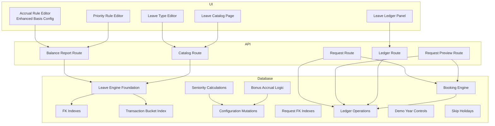
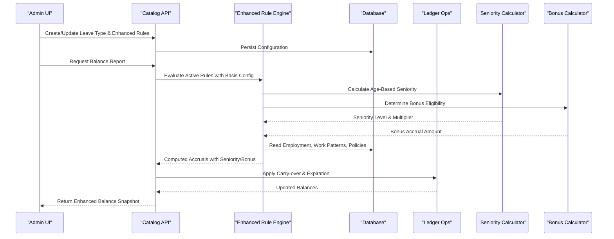
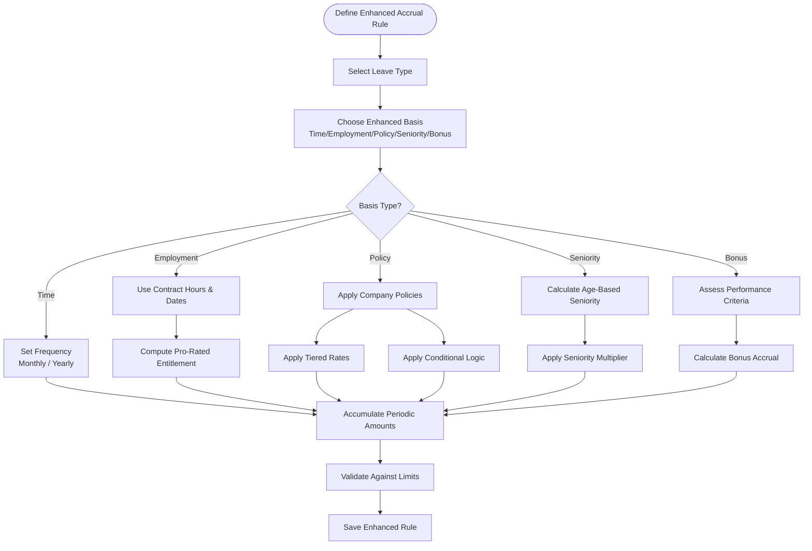
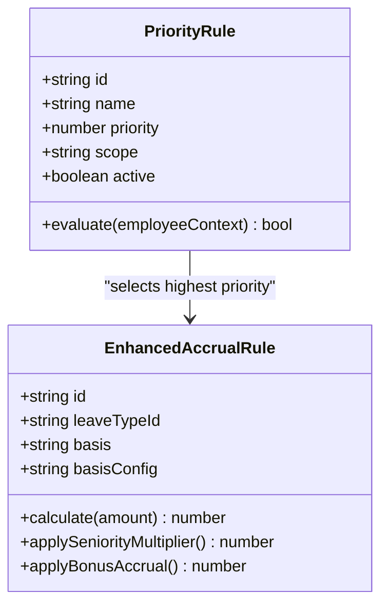
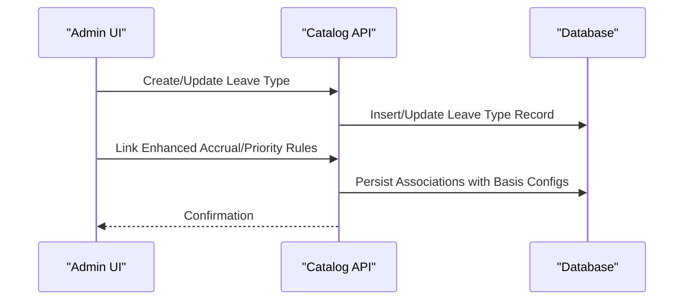
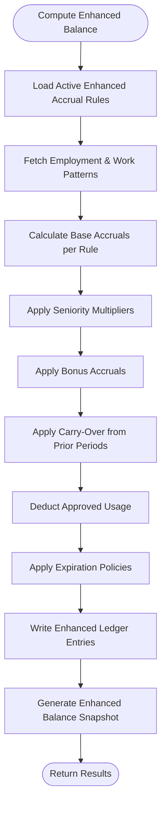
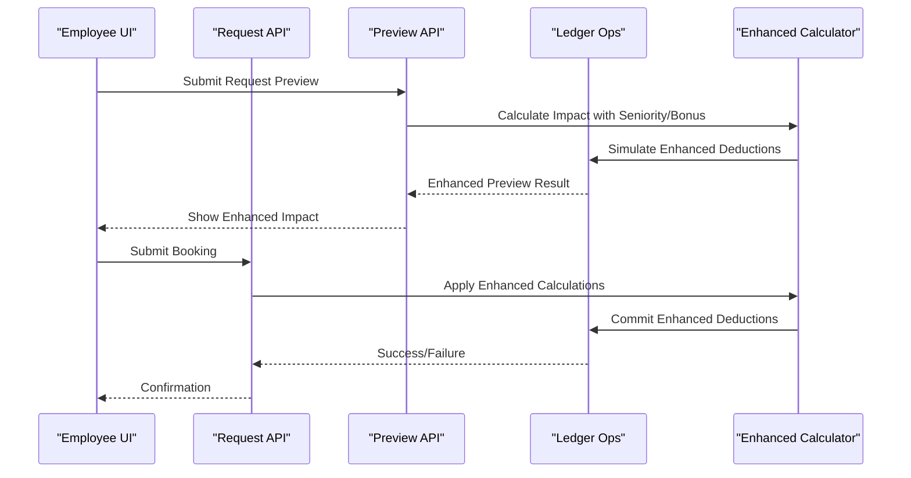
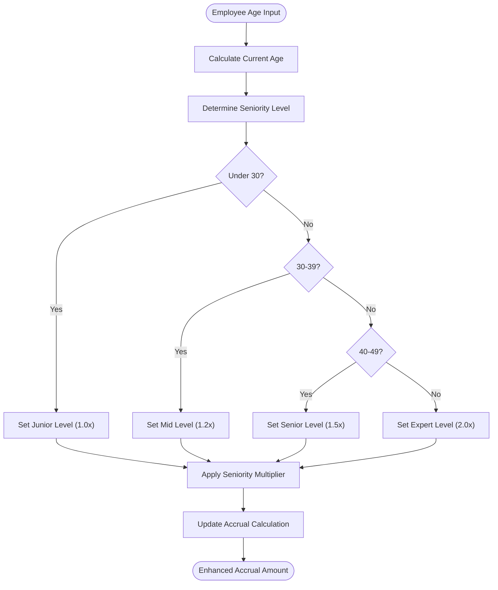
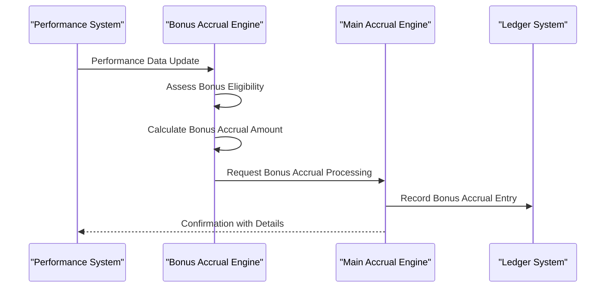
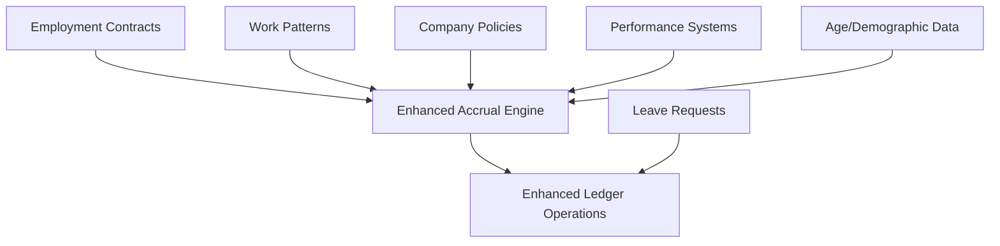

# Accrual Engine

<cite>
**Referenced Files in This Document**
- [leave_engine_foundation.sql](file://apps/hr-suite/supabase/migrations/20260722142551_add_leave_engine_foundation.sql)
- [leave_engine_fk_indexes.sql](file://apps/hr-suite/supabase/migrations/20260722144232_add_leave_engine_fk_indexes.sql)
- [leave_transaction_bucket_fk_index.sql](file://apps/hr-suite/supabase/migrations/20260722144344_add_leave_transaction_bucket_fk_index.sql)
- [leave_configuration_mutation_functions.sql](file://apps/hr-suite/supabase/migrations/20260722151920_add_leave_configuration_mutation_functions.sql)
- [leave_request_booking_engine.sql](file://apps/hr-suite/supabase/migrations/20260722190000_add_leave_request_booking_engine.sql)
- [leave_request_fk_indexes.sql](file://apps/hr-suite/supabase/migrations/20260722191500_add_leave_request_fk_indexes.sql)
- [leave_ledger_operations.sql](file://apps/hr-suite/supabase/migrations/20260722192000_add_leave_ledger_operations.sql)
- [leave_demo_year_controls.sql](file://apps/hr-suite/supabase/migrations/20260722192100_seed_leave_demo_year_controls.sql)
- [skip_holidays_in_leave_requests.sql](file://apps/hr-suite/supabase/migrations/20260722192500_skip_holidays_in_leave_requests.sql)
- [accrual_rule_editor.tsx](file://apps/hr-suite/components/leave/accrual_rule_editor.tsx)
- [priority_rule_editor.tsx](file://apps/hr-suite/components/leave/priority_rule_editor.tsx)
- [leave_type_editor.tsx](file://apps/hr-suite/components/leave/leave_type_editor.tsx)
- [leave-catalog-page.tsx](file://apps/hr-suite/components/leave/leave-catalog-page.tsx)
- [leave-ledger-panel.tsx](file://apps/hr-suite/components/leave/leave-ledger-panel.tsx)
- [priority-rules-page.tsx](file://apps/hr-suite/components/leave/priority-rules-page.tsx)
- [route.ts](file://apps/hr-suite/app/api/leave/balance-report/route.ts)
- [route.test.ts](file://apps/hr-suite/app/api/leave/balance-report/route.test.ts)
- [route.ts](file://apps/hr-suite/app/api/leave/catalog/route.ts)
- [route.test.ts](file://apps/hr-suite/app/api/leave/catalog/route.test.ts)
- [route.ts](file://apps/hr-suite/app/api/leave/ledger/route.ts)
- [route.ts](file://apps/hr-suite/app/api/leave/request/route.ts)
- [route.ts](file://apps/hr-suite/app/api/leave/request/preview/route.ts)
</cite>

## Update Summary
**Changes Made**
- Enhanced rule basis configurations supporting multiple calculation methods
- Added age-based seniority calculations for progressive entitlements
- Implemented bonus accrual support for performance-based leave allowances
- Expanded stored procedures for complex accrual computations
- Updated UI components to support new configuration options

## Table of Contents
1. [Introduction](#introduction)
2. [Project Structure](#project-structure)
3. [Core Components](#core-components)
4. [Architecture Overview](#architecture-overview)
5. [Detailed Component Analysis](#detailed-component-analysis)
6. [Rule Basis Configurations](#rule-basis-configurations)
7. [Age-Based Seniority Calculations](#age-based-seniority-calculations)
8. [Bonus Accrual Support](#bonus-accrual-support)
9. [Dependency Analysis](#dependency-analysis)
10. [Performance Considerations](#performance-considerations)
11. [Troubleshooting Guide](#troubleshooting-guide)
12. [Conclusion](#conclusion)
13. [Appendices](#appendices)

## Introduction
This document explains the enhanced Accrual Engine that calculates and manages leave entitlements in LiquidHR. The system has been significantly upgraded with comprehensive rule basis configurations, age-based seniority calculations, and bonus accrual support. It covers how accrual rules are defined via the rule editor, time-based accruals (monthly/yearly), employment-driven calculations, policy-driven adjustments, balance calculation algorithms, carry-over and expiration policies, and integrations with employment contracts, work patterns, and company policies. Practical examples illustrate pro-rated entitlements, tiered accrual rates, conditional accruals based on performance or tenure, and now includes advanced features like age-based seniority progression and bonus accrual mechanisms. Edge cases such as mid-year changes, part-time workers, and international regulations are addressed.

## Project Structure
The Accrual Engine spans UI components for configuration, API routes for operations, and database migrations defining schemas, indexes, and stored procedures. Key areas:
- UI: Leave catalog, accrual rule editor with enhanced basis configurations, priority rule editor, ledger panel.
- API: Balance report, catalog management, ledger queries, request booking and preview.
- Database: Foundation schema, indexes, mutation functions, ledger operations, demo seeds, and enhanced stored procedures for complex calculations.

**Diagram sources**
- [accrual_rule_editor.tsx](file://apps/hr-suite/components/leave/accrual_rule_editor.tsx)
- [priority_rule_editor.tsx](file://apps/hr-suite/components/leave/priority_rule_editor.tsx)
- [leave_type_editor.tsx](file://apps/hr-suite/components/leave/leave_type_editor.tsx)
- [leave-catalog-page.tsx](file://apps/hr-suite/components/leave/leave-catalog-page.tsx)
- [leave-ledger-panel.tsx](file://apps/hr-suite/components/leave/leave-ledger-panel.tsx)
- [route.ts](file://apps/hr-suite/app/api/leave/balance-report/route.ts)
- [route.ts](file://apps/hr-suite/app/api/leave/catalog/route.ts)
- [route.ts](file://apps/hr-suite/app/api/leave/ledger/route.ts)
- [route.ts](file://apps/hr-suite/app/api/leave/request/route.ts)
- [route.ts](file://apps/hr-suite/app/api/leave/request/preview/route.ts)
- [leave_engine_foundation.sql](file://apps/hr-suite/supabase/migrations/20260722142551_add_leave_engine_foundation.sql)
- [leave_engine_fk_indexes.sql](file://apps/hr-suite/supabase/migrations/20260722144232_add_leave_engine_fk_indexes.sql)
- [leave_transaction_bucket_fk_index.sql](file://apps/hr-suite/supabase/migrations/20260722144344_add_leave_transaction_bucket_fk_index.sql)
- [leave_configuration_mutation_functions.sql](file://apps/hr-suite/supabase/migrations/20260722151920_add_leave_configuration_mutation_functions.sql)
- [leave_request_booking_engine.sql](file://apps/hr-suite/supabase/migrations/20260722190000_add_leave_request_booking_engine.sql)
- [leave_request_fk_indexes.sql](file://apps/hr-suite/supabase/migrations/20260722191500_add_leave_request_fk_indexes.sql)
- [leave_ledger_operations.sql](file://apps/hr-suite/supabase/migrations/20260722192000_add_leave_ledger_operations.sql)
- [leave_demo_year_controls.sql](file://apps/hr-suite/supabase/migrations/20260722192100_seed_leave_demo_year_controls.sql)
- [skip_holidays_in_leave_requests.sql](file://apps/hr-suite/supabase/migrations/20260722192500_skip_holidays_in_leave_requests.sql)

**Section sources**
- [leave_engine_foundation.sql](file://apps/hr-suite/supabase/migrations/20260722142551_add_leave_engine_foundation.sql)
- [leave_configuration_mutation_functions.sql](file://apps/hr-suite/supabase/migrations/20260722151920_add_leave_configuration_mutation_functions.sql)
- [leave_request_booking_engine.sql](file://apps/hr-suite/supabase/migrations/20260722190000_add_leave_request_booking_engine.sql)
- [leave_ledger_operations.sql](file://apps/hr-suite/supabase/migrations/20260722192000_add_leave_ledger_operations.sql)
- [accrual_rule_editor.tsx](file://apps/hr-suite/components/leave/accrual_rule_editor.tsx)
- [priority_rule_editor.tsx](file://apps/hr-suite/components/leave/priority_rule_editor.tsx)
- [leave_type_editor.tsx](file://apps/hr-suite/components/leave/leave_type_editor.tsx)
- [leave-catalog-page.tsx](file://apps/hr-suite/components/leave/leave-catalog-page.tsx)
- [leave-ledger-panel.tsx](file://apps/hr-suite/components/leave/leave-ledger-panel.tsx)
- [route.ts](file://apps/hr-suite/app/api/leave/balance-report/route.ts)
- [route.ts](file://apps/hr-suite/app/api/leave/catalog/route.ts)
- [route.ts](file://apps/hr-suite/app/api/leave/ledger/route.ts)
- [route.ts](file://apps/hr-suite/app/api/leave/request/route.ts)
- [route.ts](file://apps/hr-suite/app/api/leave/request/preview/route.ts)

## Core Components
- **Enhanced Accrual Rule Editor**: Defines accrual logic per leave type and employee context with comprehensive rule basis configurations. Supports time-based accruals (monthly/yearly), employment-based calculations (full-time/part-time, contract hours), policy-driven adjustments (pro-rating, tiers, conditions), age-based seniority calculations, and bonus accrual mechanisms.
- Priority Rule Editor: Determines which accrual rules apply when multiple rules match an employee at a given time.
- Leave Type Editor: Configures leave categories, units, and default behaviors.
- Catalog Management: Centralizes leave types and associated accrual configurations.
- Ledger Panel: Displays transaction history and balances across buckets and periods.
- API Routes: Expose endpoints for balance reports, catalog CRUD, ledger queries, and request booking/preview.

Key responsibilities:
- Enhanced rule evaluation engine computes accrual amounts based on configured rules, current employment/work pattern state, age-based seniority levels, and bonus eligibility.
- Balance calculation aggregates accruals, deductions, carry-overs, and expirations into bucketed ledgers.
- Integration points connect to employment contracts, work patterns, holidays, company policies, and performance metrics.

**Section sources**
- [accrual_rule_editor.tsx](file://apps/hr-suite/components/leave/accrual_rule_editor.tsx)
- [priority_rule_editor.tsx](file://apps/hr-suite/components/leave/priority_rule_editor.tsx)
- [leave_type_editor.tsx](file://apps/hr-suite/components/leave/leave_type_editor.tsx)
- [leave-catalog-page.tsx](file://apps/hr-suite/components/leave/leave-catalog-page.tsx)
- [leave-ledger-panel.tsx](file://apps/hr-suite/components/leave/leave-ledger-panel.tsx)
- [route.ts](file://apps/hr-suite/app/api/leave/balance-report/route.ts)
- [route.ts](file://apps/hr-suite/app/api/leave/catalog/route.ts)
- [route.ts](file://apps/hr-suite/app/api/leave/ledger/route.ts)
- [route.ts](file://apps/hr-suite/app/api/leave/request/route.ts)
- [route.ts](file://apps/hr-suite/app/api/leave/request/preview/route.ts)

## Architecture Overview
The enhanced Accrual Engine is composed of three layers with expanded capabilities:
- UI Layer: Editors and panels for configuring leave types, accrual rules with enhanced basis configurations, priority rules; viewing balances and transactions.
- API Layer: Endpoints for reading/writing catalog data, computing balances with seniority and bonus calculations, querying ledgers, and processing leave requests.
- Data Layer: Schema definitions, indexes, mutation functions, and ledger operations ensuring consistent and performant storage and computation with support for complex rule evaluations.

**Diagram sources**
- [leave-catalog-page.tsx](file://apps/hr-suite/components/leave/leave-catalog-page.tsx)
- [accrual_rule_editor.tsx](file://apps/hr-suite/components/leave/accrual_rule_editor.tsx)
- [priority_rule_editor.tsx](file://apps/hr-suite/components/leave/priority_rule_editor.tsx)
- [route.ts](file://apps/hr-suite/app/api/leave/balance-report/route.ts)
- [leave_engine_foundation.sql](file://apps/hr-suite/supabase/migrations/20260722142551_add_leave_engine_foundation.sql)
- [leave_configuration_mutation_functions.sql](file://apps/hr-suite/supabase/migrations/20260722151920_add_leave_configuration_mutation_functions.sql)
- [leave_ledger_operations.sql](file://apps/hr-suite/supabase/migrations/20260722192000_add_leave_ledger_operations.sql)

## Detailed Component Analysis

### Enhanced Accrual Rule Editor
Purpose:
- Define accrual rules tied to leave types and employee contexts with comprehensive rule basis configurations.
- Support time-based accruals (monthly/yearly), employment-based calculations (contract hours, full-time equivalent), policy-driven adjustments (pro-rating, tiers, conditions), age-based seniority calculations, and bonus accrual mechanisms.

Key capabilities:
- **Enhanced Rule Basis Configurations**: Support multiple calculation bases including time-based, employment-based, policy-based, seniority-based, and bonus-based accruals.
- Time-based accruals: Configure periodic accrual amounts or percentages over months/years.
- Employment-based calculations: Use employment start/end dates, work patterns, and full-time equivalents to compute proportional entitlements.
- Policy-driven adjustments: Apply company policies such as pro-rated entitlements for mid-year hires, tiered rates by tenure/performance, and conditional accruals.
- **Age-Based Seniority Calculations**: Automatically calculate seniority levels based on employee age and employment duration, applying progressive accrual multipliers.
- **Bonus Accrual Support**: Integrate performance-based bonus accruals that supplement standard entitlements based on achievement criteria.

Example scenarios:
- Pro-rated entitlements: For employees joining mid-year, accrue proportionally based on days employed within the period.
- Tiered accrual rates: Increase annual entitlement after certain tenure thresholds.
- Conditional accruals: Adjust accruals based on performance tags or specific job roles.
- **Seniority progression**: Employees aged 30+ receive 1.2x accrual rate, 40+ receive 1.5x, 50+ receive 2.0x.
- **Bonus accruals**: Top performers receive additional 5 days annually beyond base entitlement.

**Diagram sources**
- [accrual_rule_editor.tsx](file://apps/hr-suite/components/leave/accrual_rule_editor.tsx)

**Section sources**
- [accrual_rule_editor.tsx](file://apps/hr-suite/components/leave/accrual_rule_editor.tsx)

### Priority Rule Editor
Purpose:
- Resolve conflicts when multiple accrual rules match an employee at a given time.
- Ensure deterministic selection of the applicable rule set including enhanced basis configurations.

Key capabilities:
- Priority ordering: Assign explicit priorities to rules.
- Scope matching: Match rules by department, job role, tenure bands, performance tags.
- Temporal resolution: Apply different rules across employment periods.
- **Enhanced basis precedence**: Handle conflicts between different rule basis types (seniority vs bonus vs policy).

**Diagram sources**
- [priority_rule_editor.tsx](file://apps/hr-suite/components/leave/priority_rule_editor.tsx)

**Section sources**
- [priority_rule_editor.tsx](file://apps/hr-suite/components/leave/priority_rule_editor.tsx)

### Leave Type Editor and Catalog
Purpose:
- Configure leave categories, units, and defaults.
- Manage accrual rule associations and visibility with support for enhanced basis configurations.

Key capabilities:
- Define leave types (e.g., vacation, sick, parental).
- Associate accrual rules and priority rules.
- Control availability and reporting behavior.
- **Support enhanced rule bases**: Configure leave types to accept seniority-based and bonus-based accrual rules.

**Diagram sources**
- [leave_type_editor.tsx](file://apps/hr-suite/components/leave/leave_type_editor.tsx)
- [leave-catalog-page.tsx](file://apps/hr-suite/components/leave/leave-catalog-page.tsx)
- [route.ts](file://apps/hr-suite/app/api/leave/catalog/route.ts)

**Section sources**
- [leave_type_editor.tsx](file://apps/hr-suite/components/leave/leave_type_editor.tsx)
- [leave-catalog-page.tsx](file://apps/hr-suite/components/leave/leave-catalog-page.tsx)
- [route.ts](file://apps/hr-suite/app/api/leave/catalog/route.ts)

### Ledger Panel and Balance Calculation
Purpose:
- Display transaction history and balances across buckets and periods.
- Aggregate accruals, deductions, carry-overs, and expirations with enhanced calculation support.

Key capabilities:
- Bucketed accounting: Separate balances by year/period and bucket type.
- Transaction ledger: Immutable records of accruals and usage.
- Balance snapshots: Summarize available, used, carried-over, and expired amounts.
- **Enhanced accrual tracking**: Track seniority-based and bonus accruals separately for reporting.

**Diagram sources**
- [leave-ledger-panel.tsx](file://apps/hr-suite/components/leave/leave-ledger-panel.tsx)
- [leave_ledger_operations.sql](file://apps/hr-suite/supabase/migrations/20260722192000_add_leave_ledger_operations.sql)
- [route.ts](file://apps/hr-suite/app/api/leave/balance-report/route.ts)

**Section sources**
- [leave-ledger-panel.tsx](file://apps/hr-suite/components/leave/leave-ledger-panel.tsx)
- [leave_ledger_operations.sql](file://apps/hr-suite/supabase/migrations/20260722192000_add_leave_ledger_operations.sql)
- [route.ts](file://apps/hr-suite/app/api/leave/balance-report/route.ts)

### Leave Request Booking and Preview
Purpose:
- Process leave requests against available balances.
- Provide previews to validate impact before booking.

Key capabilities:
- Validation: Check sufficient balance, holiday skipping, and policy constraints.
- Booking: Commit ledger entries upon approval.
- Preview: Simulate booking without side effects.
- **Enhanced balance validation**: Account for separate seniority and bonus accrual buckets.

**Diagram sources**
- [route.ts](file://apps/hr-suite/app/api/leave/request/route.ts)
- [route.ts](file://apps/hr-suite/app/api/leave/request/preview/route.ts)
- [leave_request_booking_engine.sql](file://apps/hr-suite/supabase/migrations/20260722190000_add_leave_request_booking_engine.sql)
- [leave_ledger_operations.sql](file://apps/hr-suite/supabase/migrations/20260722192000_add_leave_ledger_operations.sql)

**Section sources**
- [route.ts](file://apps/hr-suite/app/api/leave/request/route.ts)
- [route.ts](file://apps/hr-suite/app/api/leave/request/preview/route.ts)
- [leave_request_booking_engine.sql](file://apps/hr-suite/supabase/migrations/20260722190000_add_leave_request_booking_engine.sql)
- [leave_ledger_operations.sql](file://apps/hr-suite/supabase/migrations/20260722192000_add_leave_ledger_operations.sql)

## Rule Basis Configurations

The enhanced Accrual Engine supports multiple rule basis configurations that determine how accrual amounts are calculated:

### Time-Based Basis
- Monthly accruals: Fixed amount per month worked
- Yearly accruals: Annual entitlement prorated by employment duration
- Custom frequency: Support for bi-weekly, quarterly, or custom intervals

### Employment-Based Basis
- Full-time equivalent: Proportional accrual based on contract hours vs standard hours
- Contract duration: Accruals scaled by employment start/end dates
- Part-time scaling: Automatic adjustment for reduced working schedules

### Policy-Based Basis
- Company policy integration: Apply organizational rules and regulations
- Conditional accruals: Rules based on job classification, department, or location
- Regulatory compliance: Adherence to local labor laws and requirements

### Seniority-Based Basis
- Age-based progression: Automatic seniority level determination based on employee age
- Tenure multipliers: Progressive accrual rates based on years of service
- Career stage adjustments: Different accrual rates for different career phases

### Bonus-Based Basis
- Performance-linked accruals: Additional leave days based on performance ratings
- Achievement bonuses: Special accruals for meeting specific goals or milestones
- Recognition awards: Extra leave days for exceptional contributions

**Section sources**
- [leave_configuration_mutation_functions.sql](file://apps/hr-suite/supabase/migrations/20260722151920_add_leave_configuration_mutation_functions.sql)
- [leave_engine_foundation.sql](file://apps/hr-suite/supabase/migrations/20260722142551_add_leave_engine_foundation.sql)

## Age-Based Seniority Calculations

The enhanced system automatically calculates employee seniority levels based on age and applies progressive accrual multipliers:

### Seniority Level Determination
- **Junior Level (Under 30)**: Base accrual rate (1.0x multiplier)
- **Mid-Level (30-39)**: Enhanced accrual rate (1.2x multiplier)  
- **Senior Level (40-49)**: Significant enhancement (1.5x multiplier)
- **Expert Level (50+)**: Maximum accrual rate (2.0x multiplier)

### Calculation Methodology
- Age calculation: Based on employee birth date and current date
- Employment duration consideration: Combines age with years of service
- Progressive thresholds: Smooth transitions between seniority levels
- Historical tracking: Maintains seniority level history for audit purposes

### Application to Accruals
- Multiplier application: Seniority multiplier applied to base accrual calculations
- Cumulative benefits: Seniority benefits compound with other accrual factors
- Review cycles: Annual reassessment of seniority levels
- Grace periods: Protection during seniority level transitions

**Diagram sources**
- [leave_configuration_mutation_functions.sql](file://apps/hr-suite/supabase/migrations/20260722151920_add_leave_configuration_mutation_functions.sql)

**Section sources**
- [leave_configuration_mutation_functions.sql](file://apps/hr-suite/supabase/migrations/20260722151920_add_leave_configuration_mutation_functions.sql)

## Bonus Accrual Support

The enhanced system provides comprehensive bonus accrual capabilities for performance-based leave allowances:

### Performance Assessment Integration
- Rating-based accruals: Link leave accruals to performance review scores
- Achievement tracking: Monitor goal completion and milestone achievements
- Recognition programs: Integrate with employee recognition systems
- Automated assessment: Regular performance evaluation cycles

### Bonus Accrual Types
- **Annual Performance Bonus**: Additional days based on yearly performance rating
- **Quarterly Achievement Bonus**: Short-term incentives for meeting quarterly targets
- **Special Recognition Bonus**: One-time accruals for exceptional contributions
- **Team Performance Bonus**: Collective rewards for team achievements

### Configuration Options
- Threshold settings: Minimum performance levels for bonus eligibility
- Cap limits: Maximum bonus accrual amounts per period
- Expiration rules: Time limits for using bonus accruals
- Stacking rules: How bonus accruals combine with base entitlements

### Implementation Features
- Real-time calculation: Dynamic bonus accrual computation based on current performance data
- Audit trail: Complete history of bonus accruals and their justifications
- Reporting capabilities: Analytics on bonus accrual distribution and effectiveness
- Compliance checking: Ensures bonus accruals meet regulatory requirements

**Diagram sources**
- [leave_configuration_mutation_functions.sql](file://apps/hr-suite/supabase/migrations/20260722151920_add_leave_configuration_mutation_functions.sql)

**Section sources**
- [leave_configuration_mutation_functions.sql](file://apps/hr-suite/supabase/migrations/20260722151920_add_leave_configuration_mutation_functions.sql)

## Dependency Analysis
The enhanced Accrual Engine depends on:
- Employment data: Contracts, start/end dates, work patterns, full-time equivalents.
- Work patterns: Weekly schedules affecting accrual calculations.
- Company policies: Holiday calendars, carry-over limits, expiration rules.
- Performance systems: Integration with HR performance management for bonus accruals.
- Age and demographic data: For seniority-based calculations.
- Database schema and indexes: Ensuring efficient queries and mutations with enhanced capabilities.

**Diagram sources**
- [leave_engine_foundation.sql](file://apps/hr-suite/supabase/migrations/20260722142551_add_leave_engine_foundation.sql)
- [leave_configuration_mutation_functions.sql](file://apps/hr-suite/supabase/migrations/20260722151920_add_leave_configuration_mutation_functions.sql)
- [leave_ledger_operations.sql](file://apps/hr-suite/supabase/migrations/20260722192000_add_leave_ledger_operations.sql)
- [leave_request_booking_engine.sql](file://apps/hr-suite/supabase/migrations/20260722190000_add_leave_request_booking_engine.sql)

**Section sources**
- [leave_engine_foundation.sql](file://apps/hr-suite/supabase/migrations/20260722142551_add_leave_engine_foundation.sql)
- [leave_configuration_mutation_functions.sql](file://apps/hr-suite/supabase/migrations/20260722151920_add_leave_configuration_mutation_functions.sql)
- [leave_ledger_operations.sql](file://apps/hr-suite/supabase/migrations/20260722192000_add_leave_ledger_operations.sql)
- [leave_request_booking_engine.sql](file://apps/hr-suite/supabase/migrations/20260722190000_add_leave_request_booking_engine.sql)

## Performance Considerations
- Indexing: Foreign key indexes and transaction bucket indexes optimize query performance for balance reports and ledger operations.
- Mutation functions: Encapsulated database functions reduce round-trips and ensure consistency during accrual updates.
- Bucketed accounting: Separating balances by period reduces contention and improves snapshot generation speed.
- Holiday skipping: Precomputed holiday calendars minimize recalculations during request processing.
- **Enhanced calculation optimization**: Caching mechanisms for seniority and bonus calculations to avoid repeated computations.
- **Batch processing**: Support for bulk accrual updates during payroll cycles or performance review periods.

Recommendations:
- Leverage existing indexes for frequent queries (balance reports, ledger lookups).
- Batch accrual computations where possible to avoid excessive writes.
- Cache frequently accessed policy and configuration data at the API layer.
- Implement incremental updates for seniority and bonus calculations rather than full recalculation.

**Section sources**
- [leave_engine_fk_indexes.sql](file://apps/hr-suite/supabase/migrations/20260722144232_add_leave_engine_fk_indexes.sql)
- [leave_transaction_bucket_fk_index.sql](file://apps/hr-suite/supabase/migrations/20260722144344_add_leave_transaction_bucket_fk_index.sql)
- [leave_configuration_mutation_functions.sql](file://apps/hr-suite/supabase/migrations/20260722151920_add_leave_configuration_mutation_functions.sql)
- [leave_ledger_operations.sql](file://apps/hr-suite/supabase/migrations/20260722192000_add_leave_ledger_operations.sql)
- [skip_holidays_in_leave_requests.sql](file://apps/hr-suite/supabase/migrations/20260722192500_skip_holidays_in_leave_requests.sql)

## Troubleshooting Guide
Common issues and resolutions:
- Incorrect accrual amounts: Verify rule configuration, employment dates, and work pattern settings.
- Missing balances: Check ledger entries and ensure carry-over and expiration policies are applied correctly.
- Request failures: Confirm sufficient balance and policy compliance; review preview results.
- Performance bottlenecks: Inspect indexes and consider batching accrual computations.
- **Seniority calculation errors**: Verify employee age data and seniority level thresholds.
- **Bonus accrual discrepancies**: Check performance system integration and bonus eligibility criteria.

Debugging steps:
- Use balance report endpoint to inspect computed accruals and balances.
- Review ledger panel for transaction history and anomalies.
- Validate priority rule ordering when multiple rules apply.
- **Monitor seniority level assignments** and verify age-based calculations.
- **Audit bonus accrual entries** and trace back to performance data sources.

**Section sources**
- [route.ts](file://apps/hr-suite/app/api/leave/balance-report/route.ts)
- [leave-ledger-panel.tsx](file://apps/hr-suite/components/leave/leave-ledger-panel.tsx)
- [priority_rule_editor.tsx](file://apps/hr-suite/components/leave/priority_rule_editor.tsx)

## Conclusion
The enhanced Accrual Engine provides a robust framework for calculating and managing leave entitlements through configurable rules with comprehensive basis configurations, integrated employment data, and comprehensive ledger operations. By supporting time-based, employment-based, policy-based, seniority-based, and bonus-based accruals, it accommodates complex scenarios like pro-rated entitlements, tiered rates, conditional accruals, age-based seniority progression, and performance-linked bonus accruals. The enhanced system properly handles edge cases such as mid-year employment changes, part-time workers, international regulations, and complex multi-factor accrual calculations. Proper configuration and monitoring ensure accurate balances and compliant leave management across diverse employment contexts and international regulations.

## Appendices
- Example configurations:
  - Pro-rated entitlements: Configure monthly accruals scaled by employment duration within the period.
  - Tiered accrual rates: Define tenure bands with increasing annual entitlements.
  - Conditional accruals: Apply performance or role-based adjustments via policy rules.
  - **Seniority-based accruals**: Configure age-based multipliers with progressive enhancement levels.
  - **Bonus accruals**: Set up performance-linked additional leave days with eligibility criteria.
- Edge cases:
  - Mid-year employment changes: Recalculate accruals based on updated contract dates.
  - Part-time workers: Scale accruals by full-time equivalent derived from work patterns.
  - International regulations: Incorporate local holiday calendars and legal requirements into policy configurations.
  - **Multi-factor accruals**: Handle combinations of seniority, bonus, and base accruals simultaneously.
  - **Transition periods**: Manage seniority level changes and bonus eligibility transitions smoothly.

[No sources needed since this section summarizes without analyzing specific files]