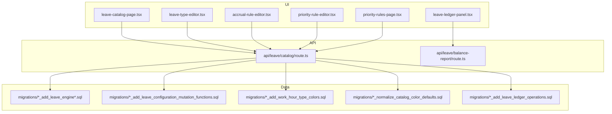
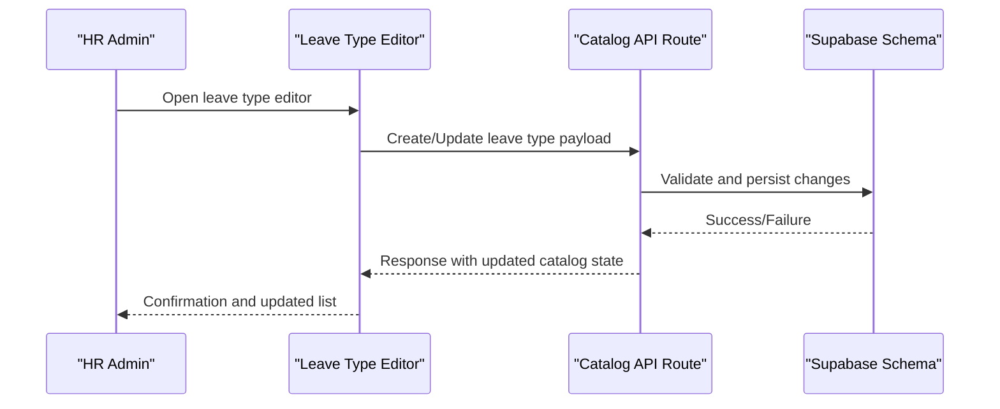
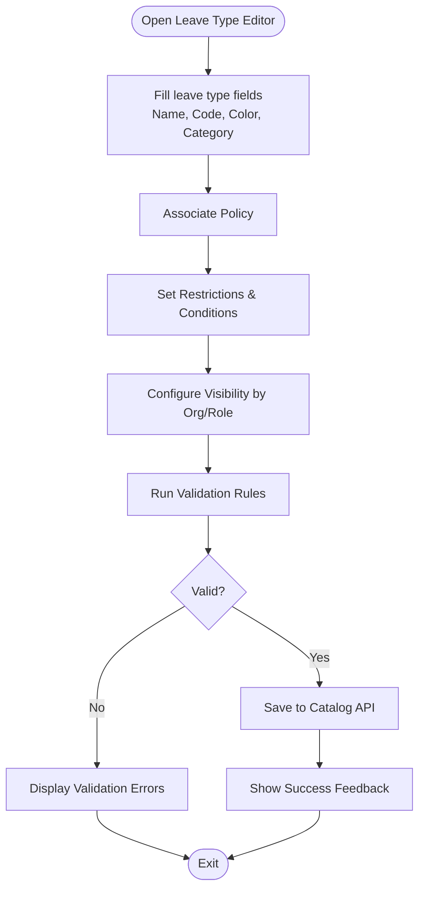
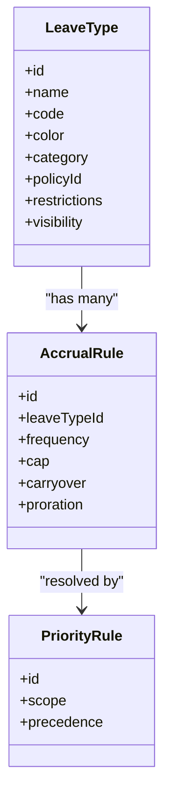
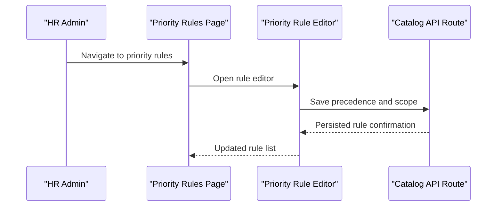
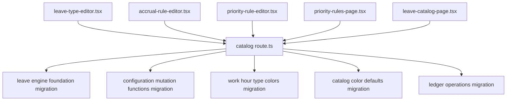

# Leave Catalog Management

<cite>
**Referenced Files in This Document**
- [leave-catalog-page.tsx](file://apps/hr-suite/components/leave/leave-catalog-page.tsx)
- [leave-type-editor.tsx](file://apps/hr-suite/components/leave/leave-type-editor.tsx)
- [accrual-rule-editor.tsx](file://apps/hr-suite/components/leave/accrual-rule-editor.tsx)
- [priority-rule-editor.tsx](file://apps/hr-suite/components/leave/priority-rule-editor.tsx)
- [priority-rules-page.tsx](file://apps/hr-suite/components/leave/priority-rules-page.tsx)
- [route.ts](file://apps/hr-suite/app/api/leave/catalog/route.ts)
- [route.test.ts](file://apps/hr-suite/app/api/leave/catalog/route.test.ts)
- [leave.json](file://apps/hr-suite/messages/en/leave.json)
- [validation.json](file://apps/hr-suite/messages/en/validation.json)
- [20260722142551_add_leave_engine_foundation.sql](file://apps/hr-suite/supabase/migrations/20260722142551_add_leave_engine_foundation.sql)
- [20260722144232_add_leave_engine_fk_indexes.sql](file://apps/hr-suite/supabase/migrations/20260722144232_add_leave_engine_fk_indexes.sql)
- [20260722144344_add_leave_transaction_bucket_fk_index.sql](file://apps/hr-suite/supabase/migrations/20260722144344_add_leave_transaction_bucket_fk_index.sql)
- [20260722151920_add_leave_configuration_mutation_functions.sql](file://apps/hr-suite/supabase/migrations/20260722151920_add_leave_configuration_mutation_functions.sql)
- [20260722173000_add_work_hour_type_colors.sql](file://apps/hr-suite/supabase/migrations/20260722173000_add_work_hour_type_colors.sql)
- [20260722173100_normalize_catalog_color_defaults.sql](file://apps/hr-suite/supabase/migrations/20260722173100_normalize_catalog_color defaults.sql)
- [20260722190000_add_leave_request_booking_engine.sql](file://apps/hr-suite/supabase/migrations/20260722190000_add_leave_request_booking_engine.sql)
- [20260722190500_seed_leave_demo_linda.sql](file://apps/hr-suite/supabase/migrations/20260722190500_seed_leave_demo_linda.sql)
- [20260722191500_add_leave_request_fk_indexes.sql](file://apps/hr-suite/supabase/migrations/20260722191500_add_leave_request_fk_indexes.sql)
- [20260722192000_add_leave_ledger_operations.sql](file://apps/hr-suite/supabase/migrations/20260722192000_add_leave_ledger_operations.sql)
- [20260722192100_seed_leave_demo_year_controls.sql](file://apps/hr-suite/supabase/migrations/20260722192100_seed_leave_demo_year_controls.sql)
- [20260722192500_skip_holidays_in_leave_requests.sql](file://apps/hr-suite/supabase/migrations/20260722192500_skip_holidays_in_leave_requests.sql)
- [leave-ledger-panel.tsx](file://apps/hr-suite/components/leave/leave-ledger-panel.tsx)
- [balance-report/route.ts](file://apps/hr-suite/app/api/leave/balance-report/route.ts)
- [balance-report/route.test.ts](file://apps/hr-suite/app/api/leave/balance-report/route.test.ts)
</cite>

## Table of Contents
1. [Introduction](#introduction)
2. [Project Structure](#project-structure)
3. [Core Components](#core-components)
4. [Architecture Overview](#architecture-overview)
5. [Detailed Component Analysis](#detailed-component-analysis)
6. [Dependency Analysis](#dependency-analysis)
7. [Performance Considerations](#performance-considerations)
8. [Troubleshooting Guide](#troubleshooting-guide)
9. [Conclusion](#conclusion)
10. [Appendices](#appendices)

## Introduction
This document explains the Leave Catalog Management system, focusing on how to define and configure leave types (e.g., vacation, sick leave, parental leave), associate policies, set color coding, and manage visibility by organization or role. It also covers validation rules, inheritance mechanisms, relationships with accrual rules and approval workflows, reporting categories, and best practices for large organizations.

## Project Structure
Leave catalog functionality spans UI components, API routes, localization messages, and database migrations:
- UI components for catalog management and editing live under the leave components directory.
- API endpoints expose catalog CRUD operations and related services.
- Localization files provide user-facing labels and validation messages.
- Database migrations define the schema for leave engine, configuration mutations, colors, and ledger operations.

**Diagram sources**
- [leave-catalog-page.tsx](file://apps/hr-suite/components/leave/leave-catalog-page.tsx)
- [leave-type-editor.tsx](file://apps/hr-suite/components/leave/leave-type-editor.tsx)
- [accrual-rule-editor.tsx](file://apps/hr-suite/components/leave/accrual-rule-editor.tsx)
- [priority-rule-editor.tsx](file://apps/hr-suite/components/leave/priority-rule-editor.tsx)
- [priority-rules-page.tsx](file://apps/hr-suite/components/leave/priority-rules-page.tsx)
- [route.ts](file://apps/hr-suite/app/api/leave/catalog/route.ts)
- [balance-report/route.ts](file://apps/hr-suite/app/api/leave/balance-report/route.ts)
- [20260722142551_add_leave_engine_foundation.sql](file://apps/hr-suite/supabase/migrations/20260722142551_add_leave_engine_foundation.sql)
- [20260722151920_add_leave_configuration_mutation_functions.sql](file://apps/hr-suite/supabase/migrations/20260722151920_add_leave_configuration_mutation_functions.sql)
- [20260722173000_add_work_hour_type_colors.sql](file://apps/hr-suite/supabase/migrations/20260722173000_add_work_hour_type_colors.sql)
- [20260722173100_normalize_catalog_color_defaults.sql](file://apps/hr-suite/supabase/migrations/20260722173100_normalize_catalog_color_defaults.sql)
- [20260722192000_add_leave_ledger_operations.sql](file://apps/hr-suite/supabase/migrations/20260722192000_add_leave_ledger_operations.sql)

**Section sources**
- [leave-catalog-page.tsx](file://apps/hr-suite/components/leave/leave-catalog-page.tsx)
- [leave-type-editor.tsx](file://apps/hr-suite/components/leave/leave-type-editor.tsx)
- [accrual-rule-editor.tsx](file://apps/hr-suite/components/leave/accrual-rule-editor.tsx)
- [priority-rule-editor.tsx](file://apps/hr-suite/components/leave/priority-rule-editor.tsx)
- [priority-rules-page.tsx](file://apps/hr-suite/components/leave/priority-rules-page.tsx)
- [route.ts](file://apps/hr-suite/app/api/leave/catalog/route.ts)
- [balance-report/route.ts](file://apps/hr-suite/app/api/leave/balance-report/route.ts)
- [20260722142551_add_leave_engine_foundation.sql](file://apps/hr-suite/supabase/migrations/20260722142551_add_leave_engine_foundation.sql)
- [20260722151920_add_leave_configuration_mutation_functions.sql](file://apps/hr-suite/supabase/migrations/20260722151920_add_leave_configuration_mutation_functions.sql)
- [20260722173000_add_work_hour_type_colors.sql](file://apps/hr-suite/supabase/migrations/20260722173000_add_work_hour_type_colors.sql)
- [20260722173100_normalize_catalog_color_defaults.sql](file://apps/hr-suite/supabase/migrations/20260722173100_normalize_catalog_color_defaults.sql)
- [20260722192000_add_leave_ledger_operations.sql](file://apps/hr-suite/supabase/migrations/20260722192000_add_leave_ledger_operations.sql)

## Core Components
- Leave Catalog Page: Entry point for browsing and managing leave types and related configurations.
- Leave Type Editor: Interface to create/edit leave type properties, color, policy associations, restrictions, and visibility settings.
- Accrual Rule Editor: Configures accrual logic tied to leave types (e.g., annual accruals, caps).
- Priority Rules: Define precedence when multiple accrual or deduction rules apply.
- API Catalog Route: Exposes endpoints for catalog CRUD and validation.
- Balance Report API: Aggregates leave balances for reporting and dashboards.

Key responsibilities:
- Centralized definition of leave types with consistent metadata (name, code, color, category).
- Association with accrual rules and priority rules.
- Validation and persistence via API routes backed by Supabase migrations.
- Reporting integration through balance report endpoints.

**Section sources**
- [leave-catalog-page.tsx](file://apps/hr-suite/components/leave/leave-catalog-page.tsx)
- [leave-type-editor.tsx](file://apps/hr-suite/components/leave/leave-type-editor.tsx)
- [accrual-rule-editor.tsx](file://apps/hr-suite/components/leave/accrual-rule-editor.tsx)
- [priority-rule-editor.tsx](file://apps/hr-suite/components/leave/priority-rule-editor.tsx)
- [priority-rules-page.tsx](file://apps/hr-suite/components/leave/priority-rules-page.tsx)
- [route.ts](file://apps/hr-suite/app/api/leave/catalog/route.ts)
- [balance-report/route.ts](file://apps/hr-suite/app/api/leave/balance-report/route.ts)

## Architecture Overview
The Leave Catalog Management follows a layered architecture:
- UI layer: React components for catalog and editor interfaces.
- API layer: Next.js route handlers for data operations and validations.
- Data layer: Supabase schema and functions defined via migrations.

**Diagram sources**
- [leave-type-editor.tsx](file://apps/hr-suite/components/leave/leave-type-editor.tsx)
- [route.ts](file://apps/hr-suite/app/api/leave/catalog/route.ts)
- [20260722142551_add_leave_engine_foundation.sql](file://apps/hr-suite/supabase/migrations/20260722142551_add_leave_engine_foundation.sql)

## Detailed Component Analysis

### Leave Type Editor
Purpose:
- Define leave type attributes such as name, code, description, color, category, and policy association.
- Configure restrictions (e.g., minimum notice, maximum consecutive days) and conditions (e.g., eligibility based on employment status).
- Manage visibility by organization or role to control who can see or use the leave type.

Validation:
- Enforces required fields and format constraints.
- Uses localized validation messages for consistent UX across languages.

Inheritance:
- Supports inheriting default behaviors from parent policies or global catalogs where applicable.

**Diagram sources**
- [leave-type-editor.tsx](file://apps/hr-suite/components/leave/leave-type-editor.tsx)
- [validation.json](file://apps/hr-suite/messages/en/validation.json)

**Section sources**
- [leave-type-editor.tsx](file://apps/hr-suite/components/leave/leave-type-editor.tsx)
- [validation.json](file://apps/hr-suite/messages/en/validation.json)

### Accrual Rule Editor
Purpose:
- Associate accrual rules with leave types to calculate entitlements over time.
- Define accrual frequency, caps, carryover rules, and proration logic.

Relationships:
- Each leave type can be linked to one or more accrual rules.
- Priority rules determine which rule applies when conflicts arise.

**Diagram sources**
- [accrual-rule-editor.tsx](file://apps/hr-suite/components/leave/accrual-rule-editor.tsx)
- [priority-rule-editor.tsx](file://apps/hr-suite/components/leave/priority-rule-editor.tsx)

**Section sources**
- [accrual-rule-editor.tsx](file://apps/hr-suite/components/leave/accrual-rule-editor.tsx)
- [priority-rule-editor.tsx](file://apps/hr-suite/components/leave/priority-rule-editor.tsx)

### Priority Rules Management
Purpose:
- Define precedence among accrual and deduction rules.
- Scope rules by organization, department, or role to ensure correct application.

Workflow:
- Create and edit priority rules.
- Assign precedence values to resolve conflicts deterministically.

**Diagram sources**
- [priority-rules-page.tsx](file://apps/hr-suite/components/leave/priority-rules-page.tsx)
- [priority-rule-editor.tsx](file://apps/hr-suite/components/leave/priority-rule-editor.tsx)
- [route.ts](file://apps/hr-suite/app/api/leave/catalog/route.ts)

**Section sources**
- [priority-rules-page.tsx](file://apps/hr-suite/components/leave/priority-rules-page.tsx)
- [priority-rule-editor.tsx](file://apps/hr-suite/components/leave/priority-rule-editor.tsx)
- [route.ts](file://apps/hr-suite/app/api/leave/catalog/route.ts)

### API Catalog Route
Responsibilities:
- Handle CRUD operations for leave types and related configurations.
- Validate payloads using centralized validation rules.
- Persist changes to the database via Supabase functions.

Integration:
- Consumes localized messages for error and success feedback.
- Returns structured responses consumed by UI components.

**Section sources**
- [route.ts](file://apps/hr-suite/app/api/leave/catalog/route.ts)
- [route.test.ts](file://apps/hr-suite/app/api/leave/catalog/route.test.ts)
- [leave.json](file://apps/hr-suite/messages/en/leave.json)
- [validation.json](file://apps/hr-suite/messages/en/validation.json)

### Balance Report API
Purpose:
- Aggregate leave balances per employee and leave type.
- Support reporting dashboards and analytics.

Usage:
- Called by HR dashboards and insights modules.
- Provides filtered results by date range, organization, and leave type.

**Section sources**
- [balance-report/route.ts](file://apps/hr-suite/app/api/leave/balance-report/route.ts)
- [balance-report/route.test.ts](file://apps/hr-suite/app/api/leave/balance-report/route.test.ts)

### Ledger Panel
Purpose:
- Display detailed transaction history for leave balances.
- Show accruals, deductions, adjustments, and approvals.

Integration:
- Pulls data from ledger operations defined in migrations.
- Supports filtering and export capabilities.

**Section sources**
- [leave-ledger-panel.tsx](file://apps/hr-suite/components/leave/leave-ledger-panel.tsx)
- [20260722192000_add_leave_ledger_operations.sql](file://apps/hr-suite/supabase/migrations/20260722192000_add_leave_ledger_operations.sql)

## Dependency Analysis
Component dependencies:
- UI components depend on API routes for data operations.
- API routes depend on database schema and functions defined in migrations.
- Localization files provide messages used across UI and API layers.

**Diagram sources**
- [leave-type-editor.tsx](file://apps/hr-suite/components/leave/leave-type-editor.tsx)
- [accrual-rule-editor.tsx](file://apps/hr-suite/components/leave/accrual-rule-editor.tsx)
- [priority-rule-editor.tsx](file://apps/hr-suite/components/leave/priority-rule-editor.tsx)
- [priority-rules-page.tsx](file://apps/hr-suite/components/leave/priority-rules-page.tsx)
- [leave-catalog-page.tsx](file://apps/hr-suite/components/leave/leave-catalog-page.tsx)
- [route.ts](file://apps/hr-suite/app/api/leave/catalog/route.ts)
- [20260722142551_add_leave_engine_foundation.sql](file://apps/hr-suite/supabase/migrations/20260722142551_add_leave_engine_foundation.sql)
- [20260722151920_add_leave_configuration_mutation_functions.sql](file://apps/hr-suite/supabase/migrations/20260722151920_add_leave_configuration_mutation_functions.sql)
- [20260722173000_add_work_hour_type_colors.sql](file://apps/hr-suite/supabase/migrations/20260722173000_add_work_hour_type_colors.sql)
- [20260722173100_normalize_catalog_color_defaults.sql](file://apps/hr-suite/supabase/migrations/20260722173100_normalize_catalog_color_defaults.sql)
- [20260722192000_add_leave_ledger_operations.sql](file://apps/hr-suite/supabase/migrations/20260722192000_add_leave_ledger_operations.sql)

**Section sources**
- [route.ts](file://apps/hr-suite/app/api/leave/catalog/route.ts)
- [20260722142551_add_leave_engine_foundation.sql](file://apps/hr-suite/supabase/migrations/20260722142551_add_leave_engine_foundation.sql)
- [20260722151920_add_leave_configuration_mutation_functions.sql](file://apps/hr-suite/supabase/migrations/20260722151920_add_leave_configuration_mutation_functions.sql)
- [20260722173000_add_work_hour_type_colors.sql](file://apps/hr-suite/supabase/migrations/20260722173000_add_work_hour_type_colors.sql)
- [20260722173100_normalize_catalog_color_defaults.sql](file://apps/hr-suite/supabase/migrations/20260722173100_normalize_catalog_color_defaults.sql)
- [20260722192000_add_leave_ledger_operations.sql](file://apps/hr-suite/supabase/migrations/20260722192000_add_leave_ledger_operations.sql)

## Performance Considerations
- Minimize API calls by batching updates in the UI where possible.
- Use indexes provided by migrations for faster queries on foreign keys and common filters.
- Cache frequently accessed catalog entries at the UI level to reduce repeated fetches.
- Optimize balance report queries by limiting date ranges and applying filters early.

[No sources needed since this section provides general guidance]

## Troubleshooting Guide
Common issues:
- Validation errors: Check localized validation messages and ensure all required fields are filled correctly.
- Persistence failures: Verify API route responses and database constraints enforced by migrations.
- Visibility not applied: Confirm organization and role scoping in the leave type editor.

Debugging steps:
- Inspect network requests to the catalog API route.
- Review error logs and response payloads.
- Validate schema constraints using migration definitions.

**Section sources**
- [validation.json](file://apps/hr-suite/messages/en/validation.json)
- [route.ts](file://apps/hr-suite/app/api/leave/catalog/route.ts)
- [20260722142551_add_leave_engine_foundation.sql](file://apps/hr-suite/supabase/migrations/20260722142551_add_leave_engine_foundation.sql)

## Conclusion
The Leave Catalog Management system provides a robust framework for defining leave types, associating accrual and priority rules, and ensuring compliance through validation and visibility controls. By leveraging the UI editors, API routes, and database schema, organizations can maintain accurate and adaptable leave policies aligned with local labor laws and operational needs.

[No sources needed since this section summarizes without analyzing specific files]

## Appendices

### Practical Examples
- Setting up a new leave type:
  - Open the leave type editor, fill in name, code, color, and category.
  - Associate a policy and set restrictions (e.g., minimum notice, max consecutive days).
  - Configure visibility by organization or role.
  - Save and verify via the catalog page.

- Configuring accrual rules:
  - Link an accrual rule to the leave type.
  - Define frequency, cap, carryover, and proration.
  - Assign priority rules to resolve conflicts.

- Managing visibility and compliance:
  - Restrict access to sensitive leave types by role.
  - Ensure color coding aligns with organizational standards.
  - Validate against local labor law requirements using restriction fields.

[No sources needed since this section provides general guidance]