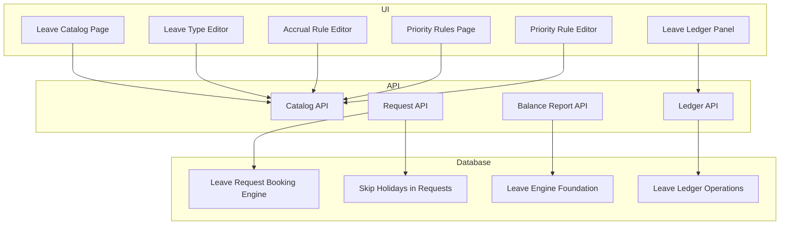
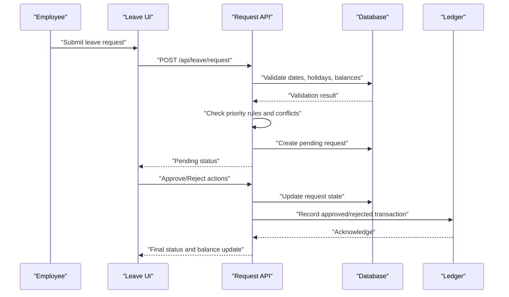
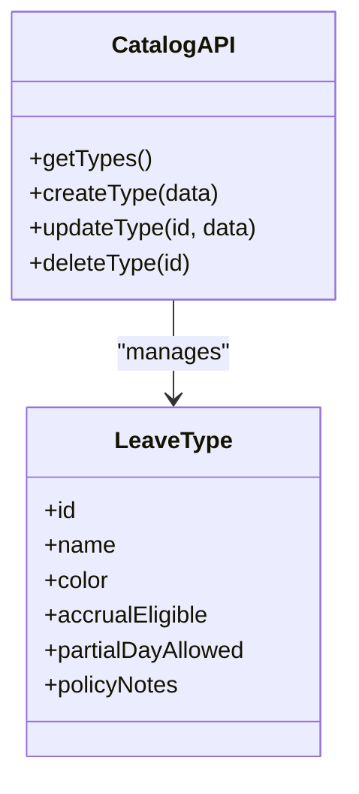
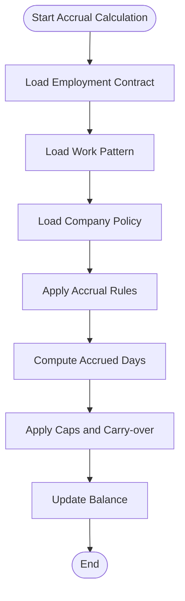
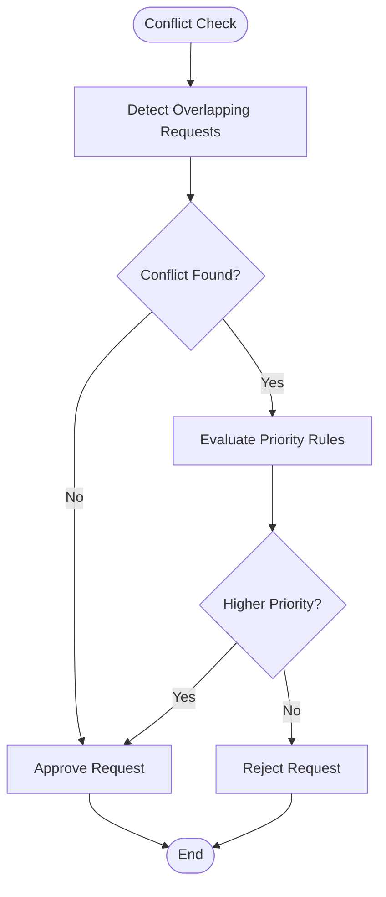
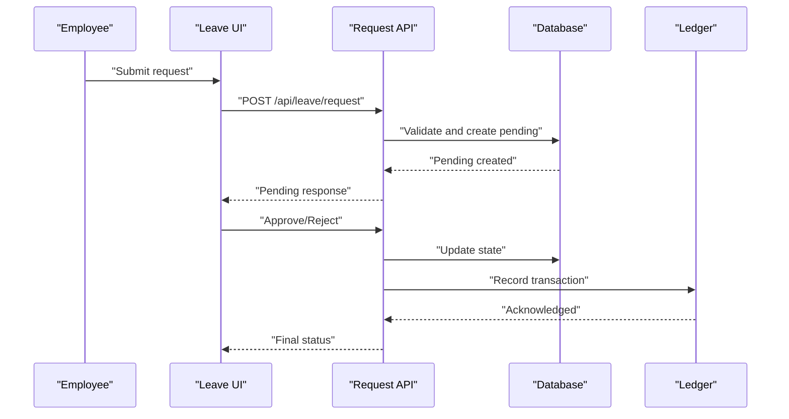
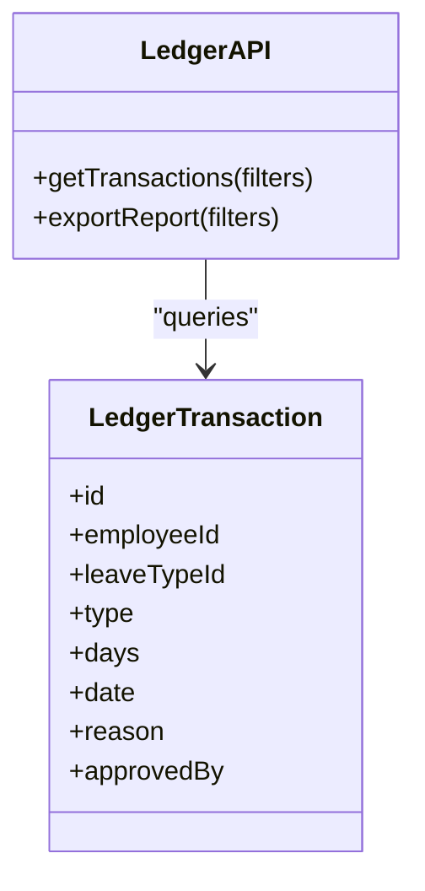
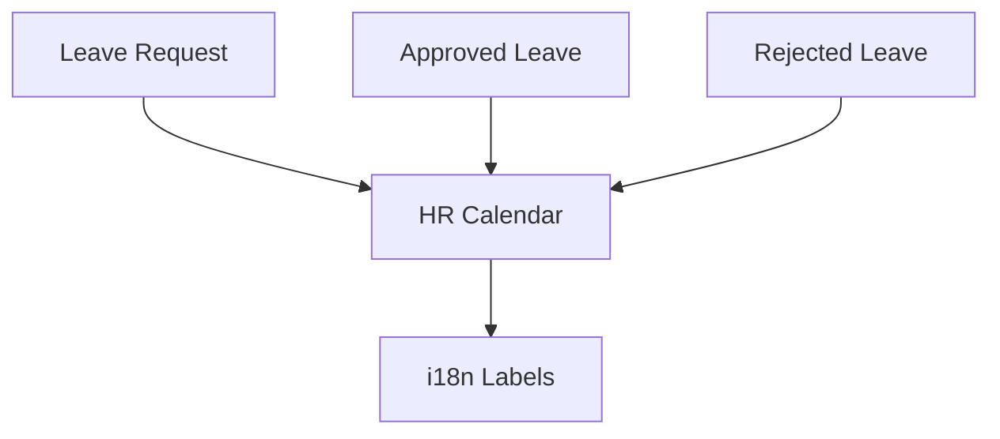
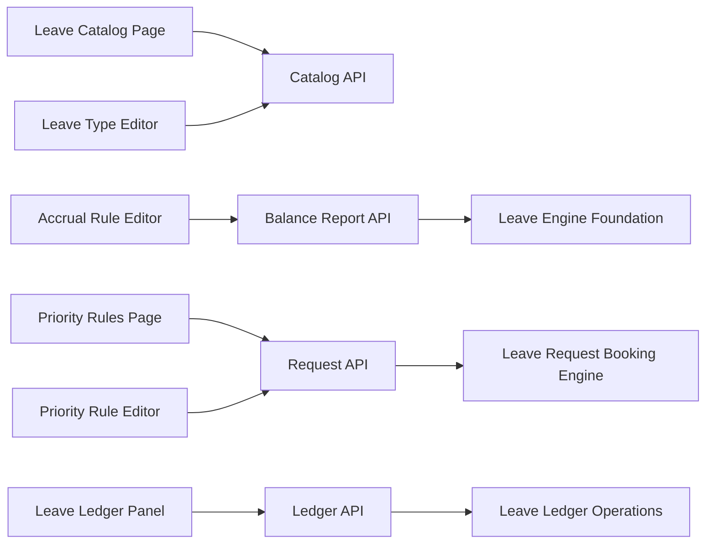

# Leave Management

<cite>
**Referenced Files in This Document**
- [leave-catalog-page.tsx](file://apps/hr-suite/components/leave/leave-catalog-page.tsx)
- [leave-type-editor.tsx](file://apps/hr-suite/components/leave/leave-type-editor.tsx)
- [accrual-rule-editor.tsx](file://apps/hr-suite/components/leave/accrual-rule-editor.tsx)
- [priority-rule-editor.tsx](file://apps/hr-suite/components/leave/priority-rule-editor.tsx)
- [priority-rules-page.tsx](file://apps/hr-suite/components/leave/priority-rules-page.tsx)
- [leave-ledger-panel.tsx](file://apps/hr-suite/components/leave/leave-ledger-panel.tsx)
- [route.ts](file://apps/hr-suite/app/api/leave/catalog/route.ts)
- [route.ts](file://apps/hr-suite/app/api/leave/request/route.ts)
- [route.ts](file://apps/hr-suite/app/api/leave/balance-report/route.ts)
- [route.ts](file://apps/hr-suite/app/api/leave/ledger/route.ts)
- [20260722142551_add_leave_engine_foundation.sql](file://apps/hr-suite/supabase/migrations/20260722142551_add_leave_engine_foundation.sql)
- [20260722190000_add_leave_request_booking_engine.sql](file://apps/hr-suite/supabase/migrations/20260722190000_add_leave_request_booking_engine.sql)
- [20260722192000_add_leave_ledger_operations.sql](file://apps/hr-suite/supabase/migrations/20260722192000_add_leave_ledger_operations.sql)
- [20260722192500_skip_holidays_in_leave_requests.sql](file://apps/hr-suite/supabase/migrations/20260722192500_skip_holidays_in_leave_requests.sql)
- [hr-calendar.json](file://apps/hr-suite/messages/en/hrCalendar.json)
- [leave.json](file://apps/hr-suite/messages/en/leave.json)
</cite>

## Table of Contents
1. [Introduction](#introduction)
2. [Project Structure](#project-structure)
3. [Core Components](#core-components)
4. [Architecture Overview](#architecture-overview)
5. [Detailed Component Analysis](#detailed-component-analysis)
6. [Dependency Analysis](#dependency-analysis)
7. [Performance Considerations](#performance-considerations)
8. [Troubleshooting Guide](#troubleshooting-guide)
9. [Conclusion](#conclusion)
10. [Appendices](#appendices)

## Introduction
This document explains LiquidHR’s Leave Management system, covering the end-to-end leave request lifecycle, multi-level approval chains, conflict detection and priority rules, accrual engine behavior tied to employment contracts and work patterns, leave catalog management, HR calendar integration, ledger-based transaction tracking, audit trails, reporting, compliance considerations, and international leave regulations support. It is designed for both technical and non-technical readers, with progressive detail and visual diagrams mapping to actual code and database structures.

## Project Structure
Leave Management spans UI components, API routes, and database migrations:
- UI components manage leave types, accrual rules, priority rules, and the ledger view.
- API routes expose endpoints for catalog operations, leave requests, balance reports, and ledger queries.
- Database migrations define the schema for leave catalogs, requests, booking engine, and ledger operations.

**Diagram sources**
- [leave-catalog-page.tsx](file://apps/hr-suite/components/leave/leave-catalog-page.tsx)
- [leave-type-editor.tsx](file://apps/hr-suite/components/leave/leave-type-editor.tsx)
- [accrual-rule-editor.tsx](file://apps/hr-suite/components/leave/accrual-rule-editor.tsx)
- [priority-rules-page.tsx](file://apps/hr-suite/components/leave/priority-rules-page.tsx)
- [priority-rule-editor.tsx](file://apps/hr-suite/components/leave/priority-rule-editor.tsx)
- [leave-ledger-panel.tsx](file://apps/hr-suite/components/leave/leave-ledger-panel.tsx)
- [route.ts](file://apps/hr-suite/app/api/leave/catalog/route.ts)
- [route.ts](file://apps/hr-suite/app/api/leave/request/route.ts)
- [route.ts](file://apps/hr-suite/app/api/leave/balance-report/route.ts)
- [route.ts](file://apps/hr-suite/app/api/leave/ledger/route.ts)
- [20260722142551_add_leave_engine_foundation.sql](file://apps/hr-suite/supabase/migrations/20260722142551_add_leave_engine_foundation.sql)
- [20260722190000_add_leave_request_booking_engine.sql](file://apps/hr-suite/supabase/migrations/20260722190000_add_leave_request_booking_engine.sql)
- [20260722192000_add_leave_ledger_operations.sql](file://apps/hr-suite/supabase/migrations/20260722192000_add_leave_ledger_operations.sql)
- [20260722192500_skip_holidays_in_leave_requests.sql](file://apps/hr-suite/supabase/migrations/20260722192500_skip_holidays_in_leave_requests.sql)

**Section sources**
- [leave-catalog-page.tsx](file://apps/hr-suite/components/leave/leave-catalog-page.tsx)
- [leave-type-editor.tsx](file://apps/hr-suite/components/leave/leave-type-editor.tsx)
- [accrual-rule-editor.tsx](file://apps/hr-suite/components/leave/accrual-rule-editor.tsx)
- [priority-rules-page.tsx](file://apps/hr-suite/components/leave/priority-rules-page.tsx)
- [priority-rule-editor.tsx](file://apps/hr-suite/components/leave/priority-rule-editor.tsx)
- [leave-ledger-panel.tsx](file://apps/hr-suite/components/leave/leave-ledger-panel.tsx)
- [route.ts](file://apps/hr-suite/app/api/leave/catalog/route.ts)
- [route.ts](file://apps/hr-suite/app/api/leave/request/route.ts)
- [route.ts](file://apps/hr-suite/app/api/leave/balance-report/route.ts)
- [route.ts](file://apps/hr-suite/app/api/leave/ledger/route.ts)
- [20260722142551_add_leave_engine_foundation.sql](file://apps/hr-suite/supabase/migrations/20260722142551_add_leave_engine_foundation.sql)
- [20260722190000_add_leave_request_booking_engine.sql](file://apps/hr-suite/supabase/migrations/20260722190000_add_leave_request_booking_engine.sql)
- [20260722192000_add_leave_ledger_operations.sql](file://apps/hr-suite/supabase/migrations/20260722192000_add_leave_ledger_operations.sql)
- [20260722192500_skip_holidays_in_leave_requests.sql](file://apps/hr-suite/supabase/migrations/20260722192500_skip_holidays_in_leave_requests.sql)

## Core Components
- Leave Catalog: Defines available leave types and their policies (e.g., accrual eligibility, partial-day support, color coding).
- Accrual Rules: Configures how leave balances are built over time based on employment contracts, work patterns, and company policy.
- Priority Rules: Resolves conflicts when multiple leave requests overlap by assigning precedence.
- Request Lifecycle: Submission, validation, approval workflow, booking, and ledger updates.
- Ledger: Immutable record of all leave transactions, enabling audit trails and reporting.

Key responsibilities:
- Catalog API manages CRUD for leave types and related settings.
- Request API orchestrates validation, conflict checks, approvals, and booking.
- Balance Report API computes current balances using accrual rules and historical transactions.
- Ledger API exposes transaction history for auditing and analytics.

**Section sources**
- [route.ts](file://apps/hr-suite/app/api/leave/catalog/route.ts)
- [route.ts](file://apps/hr-suite/app/api/leave/request/route.ts)
- [route.ts](file://apps/hr-suite/app/api/leave/balance-report/route.ts)
- [route.ts](file://apps/hr-suite/app/api/leave/ledger/route.ts)

## Architecture Overview
The Leave Management architecture integrates UI, API, and database layers with clear separation of concerns:
- UI components provide configuration and operational views.
- API routes implement business logic and orchestrate workflows.
- Database migrations define core entities and operations.

**Diagram sources**
- [route.ts](file://apps/hr-suite/app/api/leave/request/route.ts)
- [20260722190000_add_leave_request_booking_engine.sql](file://apps/hr-suite/supabase/migrations/20260722190000_add_leave_request_booking_engine.sql)
- [20260722192000_add_leave_ledger_operations.sql](file://apps/hr-suite/supabase/migrations/20260722192000_add_leave_ledger_operations.sql)

## Detailed Component Analysis

### Leave Catalog Management
- Purpose: Define leave types, colors, and policy flags such as accrual eligibility and partial-day support.
- UI: Catalog page and type editor allow creating, editing, and organizing leave types.
- API: Catalog route provides endpoints to manage leave types and associated metadata.

**Diagram sources**
- [leave-catalog-page.tsx](file://apps/hr-suite/components/leave/leave-catalog-page.tsx)
- [leave-type-editor.tsx](file://apps/hr-suite/components/leave/leave-type-editor.tsx)
- [route.ts](file://apps/hr-suite/app/api/leave/catalog/route.ts)

**Section sources**
- [leave-catalog-page.tsx](file://apps/hr-suite/components/leave/leave-catalog-page.tsx)
- [leave-type-editor.tsx](file://apps/hr-suite/components/leave/leave-type-editor.tsx)
- [route.ts](file://apps/hr-suite/app/api/leave/catalog/route.ts)

### Accrual Engine
- Purpose: Calculate leave balances based on employment contracts, work patterns, and company policies.
- Configuration: Accrual rule editor defines accrual schedules, caps, carry-over rules, and proration logic.
- Computation: Balance report API uses accrual rules and historical ledger entries to compute current balances.

**Diagram sources**
- [accrual-rule-editor.tsx](file://apps/hr-suite/components/leave/accrual-rule-editor.tsx)
- [route.ts](file://apps/hr-suite/app/api/leave/balance-report/route.ts)
- [20260722142551_add_leave_engine_foundation.sql](file://apps/hr-suite/supabase/migrations/20260722142551_add_leave_engine_foundation.sql)

**Section sources**
- [accrual-rule-editor.tsx](file://apps/hr-suite/components/leave/accrual-rule-editor.tsx)
- [route.ts](file://apps/hr-suite/app/api/leave/balance-report/route.ts)
- [20260722142551_add_leave_engine_foundation.sql](file://apps/hr-suite/supabase/migrations/20260722142551_add_leave_engine_foundation.sql)

### Priority Rules and Conflict Detection
- Purpose: Resolve overlapping leave requests by assigning precedence based on configured rules.
- UI: Priority rules page and editor allow defining conditions and order of precedence.
- Logic: Request API evaluates conflicts and applies priority rules before approving or rejecting.

**Diagram sources**
- [priority-rules-page.tsx](file://apps/hr-suite/components/leave/priority-rules-page.tsx)
- [priority-rule-editor.tsx](file://apps/hr-suite/components/leave/priority-rule-editor.tsx)
- [route.ts](file://apps/hr-suite/app/api/leave/request/route.ts)

**Section sources**
- [priority-rules-page.tsx](file://apps/hr-suite/components/leave/priority-rules-page.tsx)
- [priority-rule-editor.tsx](file://apps/hr-suite/components/leave/priority-rule-editor.tsx)
- [route.ts](file://apps/hr-suite/app/api/leave/request/route.ts)

### Leave Request Lifecycle
- Submission: Employee submits a leave request via UI; API validates dates, holidays, and balances.
- Approval Workflow: Multi-level approvals can be enforced; request transitions through states until final decision.
- Booking and Ledger: Approved requests are booked and recorded in the ledger; rejected requests log reasons.

**Diagram sources**
- [route.ts](file://apps/hr-suite/app/api/leave/request/route.ts)
- [20260722190000_add_leave_request_booking_engine.sql](file://apps/hr-suite/supabase/migrations/20260722190000_add_leave_request_booking_engine.sql)
- [20260722192000_add_leave_ledger_operations.sql](file://apps/hr-suite/supabase/migrations/20260722192000_add_leave_ledger_operations.sql)

**Section sources**
- [route.ts](file://apps/hr-suite/app/api/leave/request/route.ts)
- [20260722190000_add_leave_request_booking_engine.sql](file://apps/hr-suite/supabase/migrations/20260722190000_add_leave_request_booking_engine.sql)
- [20260722192000_add_leave_ledger_operations.sql](file://apps/hr-suite/supabase/migrations/20260722192000_add_leave_ledger_operations.sql)

### Ledger System and Audit Trails
- Purpose: Maintain an immutable ledger of leave transactions for auditing and reporting.
- UI: Ledger panel displays transaction history and supports filtering.
- API: Ledger route exposes endpoints to query transactions and generate reports.

**Diagram sources**
- [leave-ledger-panel.tsx](file://apps/hr-suite/components/leave/leave-ledger-panel.tsx)
- [route.ts](file://apps/hr-suite/app/api/leave/ledger/route.ts)
- [20260722192000_add_leave_ledger_operations.sql](file://apps/hr-suite/supabase/migrations/20260722192000_add_leave_ledger_operations.sql)

**Section sources**
- [leave-ledger-panel.tsx](file://apps/hr-suite/components/leave/leave-ledger-panel.tsx)
- [route.ts](file://apps/hr-suite/app/api/leave/ledger/route.ts)
- [20260722192000_add_leave_ledger_operations.sql](file://apps/hr-suite/supabase/migrations/20260722192000_add_leave_ledger_operations.sql)

### HR Calendar Integration
- Purpose: Integrate leave events with the HR calendar to visualize absences and plan coverage.
- Data: Leave requests and approvals are reflected in calendar views.
- Localization: Messages include calendar-related labels for internationalization.

**Diagram sources**
- [hr-calendar.json](file://apps/hr-suite/messages/en/hrCalendar.json)

**Section sources**
- [hr-calendar.json](file://apps/hr-suite/messages/en/hrCalendar.json)

## Dependency Analysis
Leave Management components depend on each other and on shared infrastructure:
- UI components call API routes for operations.
- API routes rely on database schemas defined in migrations.
- Ledger operations depend on request lifecycle outcomes.

**Diagram sources**
- [leave-catalog-page.tsx](file://apps/hr-suite/components/leave/leave-catalog-page.tsx)
- [leave-type-editor.tsx](file://apps/hr-suite/components/leave/leave-type-editor.tsx)
- [accrual-rule-editor.tsx](file://apps/hr-suite/components/leave/accrual-rule-editor.tsx)
- [priority-rules-page.tsx](file://apps/hr-suite/components/leave/priority-rules-page.tsx)
- [priority-rule-editor.tsx](file://apps/hr-suite/components/leave/priority-rule-editor.tsx)
- [leave-ledger-panel.tsx](file://apps/hr-suite/components/leave/leave-ledger-panel.tsx)
- [route.ts](file://apps/hr-suite/app/api/leave/catalog/route.ts)
- [route.ts](file://apps/hr-suite/app/api/leave/request/route.ts)
- [route.ts](file://apps/hr-suite/app/api/leave/balance-report/route.ts)
- [route.ts](file://apps/hr-suite/app/api/leave/ledger/route.ts)
- [20260722142551_add_leave_engine_foundation.sql](file://apps/hr-suite/supabase/migrations/20260722142551_add_leave_engine_foundation.sql)
- [20260722190000_add_leave_request_booking_engine.sql](file://apps/hr-suite/supabase/migrations/20260722190000_add_leave_request_booking_engine.sql)
- [20260722192000_add_leave_ledger_operations.sql](file://apps/hr-suite/supabase/migrations/20260722192000_add_leave_ledger_operations.sql)

**Section sources**
- [leave-catalog-page.tsx](file://apps/hr-suite/components/leave/leave-catalog-page.tsx)
- [leave-type-editor.tsx](file://apps/hr-suite/components/leave/leave-type-editor.tsx)
- [accrual-rule-editor.tsx](file://apps/hr-suite/components/leave/accrual-rule-editor.tsx)
- [priority-rules-page.tsx](file://apps/hr-suite/components/leave/priority-rules-page.tsx)
- [priority-rule-editor.tsx](file://apps/hr-suite/components/leave/priority-rule-editor.tsx)
- [leave-ledger-panel.tsx](file://apps/hr-suite/components/leave/leave-ledger-panel.tsx)
- [route.ts](file://apps/hr-suite/app/api/leave/catalog/route.ts)
- [route.ts](file://apps/hr-suite/app/api/leave/request/route.ts)
- [route.ts](file://apps/hr-suite/app/api/leave/balance-report/route.ts)
- [route.ts](file://apps/hr-suite/app/api/leave/ledger/route.ts)
- [20260722142551_add_leave_engine_foundation.sql](file://apps/hr-suite/supabase/migrations/20260722142551_add_leave_engine_foundation.sql)
- [20260722190000_add_leave_request_booking_engine.sql](file://apps/hr-suite/supabase/migrations/20260722190000_add_leave_request_booking_engine.sql)
- [20260722192000_add_leave_ledger_operations.sql](file://apps/hr-suite/supabase/migrations/20260722192000_add_leave_ledger_operations.sql)

## Performance Considerations
- Indexing: Ensure foreign keys and frequently queried fields (employeeId, leaveTypeId, date ranges) are indexed for fast ledger and balance queries.
- Caching: Cache computed balances for short periods to reduce repeated accrual calculations.
- Pagination: Implement pagination for ledger queries to handle large datasets efficiently.
- Holiday Skipping: Use holiday skipping logic to avoid unnecessary date computations during request validation.

[No sources needed since this section provides general guidance]

## Troubleshooting Guide
Common issues and resolutions:
- Validation Errors: Check holiday configurations and work patterns if requests fail date validation.
- Balance Mismatches: Review accrual rules and ledger transactions to reconcile discrepancies.
- Approval Delays: Verify multi-level approval chain configuration and ensure approvers have correct permissions.
- Ledger Gaps: Confirm that approved/rejected requests trigger ledger entries and that export functions capture full history.

**Section sources**
- [20260722192500_skip_holidays_in_leave_requests.sql](file://apps/hr-suite/supabase/migrations/20260722192500_skip_holidays_in_leave_requests.sql)
- [20260722192000_add_leave_ledger_operations.sql](file://apps/hr-suite/supabase/migrations/20260722192000_add_leave_ledger_operations.sql)

## Conclusion
LiquidHR’s Leave Management system provides a robust framework for managing leave requests, accruals, priorities, and audits. The modular architecture enables flexible configuration and scalable performance. By integrating with the HR calendar and supporting internationalization, it meets diverse organizational needs while maintaining compliance and transparency.

[No sources needed since this section summarizes without analyzing specific files]

## Appendices

### Practical Examples
- Configure Leave Types: Use the leave type editor to set accrual eligibility and partial-day support.
- Set Up Accrual Rules: Define accrual schedules and caps in the accrual rule editor.
- Manage Balances: Use the balance report API to compute and display current balances.
- Handle Edge Cases: Ensure holiday skipping is enabled to avoid incorrect day counts.

**Section sources**
- [leave-type-editor.tsx](file://apps/hr-suite/components/leave/leave-type-editor.tsx)
- [accrual-rule-editor.tsx](file://apps/hr-suite/components/leave/accrual-rule-editor.tsx)
- [route.ts](file://apps/hr-suite/app/api/leave/balance-report/route.ts)
- [20260722192500_skip_holidays_in_leave_requests.sql](file://apps/hr-suite/supabase/migrations/20260722192500_skip_holidays_in_leave_requests.sql)

### Compliance and International Regulations
- Localize labels and messages for different regions.
- Enforce policy flags per leave type to comply with regional regulations.
- Maintain audit trails via ledger for regulatory reporting.

**Section sources**
- [leave.json](file://apps/hr-suite/messages/en/leave.json)
- [hr-calendar.json](file://apps/hr-suite/messages/en/hrCalendar.json)
- [20260722192000_add_leave_ledger_operations.sql](file://apps/hr-suite/supabase/migrations/20260722192000_add_leave_ledger_operations.sql)