# Leave Request Workflow

<cite>
**Referenced Files in This Document**
- [leave-request-route.ts](file://apps/hr-suite/app/api/leave/request/route.ts)
- [leave-preview-route.ts](file://apps/hr-suite/app/api/leave/request/preview/route.ts)
- [leave-balance-report-route.ts](file://apps/hr-suite/app/api/leave/balance-report/route.ts)
- [leave-catalog-route.ts](file://apps/hr-suite/app/api/leave/catalog/route.ts)
- [leave-ledger-route.ts](file://apps/hr-suite/app/api/leave/ledger/route.ts)
- [leave-engine-foundation.sql](file://apps/hr-suite/supabase/migrations/20260722142551_add_leave_engine_foundation.sql)
- [leave-engine-fk-indexes.sql](file://apps/hr-suite/supabase/migrations/20260722144232_add_leave_engine_fk_indexes.sql)
- [leave-transaction-bucket-index.sql](file://apps/hr-suite/supabase/migrations/20260722144344_add_leave_transaction_bucket_fk_index.sql)
- [leave-config-mutations.sql](file://apps/hr-suite/supabase/migrations/20260722151920_add_leave_configuration_mutation_functions.sql)
- [leave-request-booking-engine.sql](file://apps/hr-suite/supabase/migrations/20260722190000_add_leave_request_booking_engine.sql)
- [leave-demo-linda.sql](file://apps/hr-suite/supabase/migrations/20260722190500_seed_leave_demo_linda.sql)
- [leave-request-fk-indexes.sql](file://apps/hr-suite/supabase/migrations/20260722191500_add_leave_request_fk_indexes.sql)
- [leave-ledger-operations.sql](file://apps/hr-suite/supabase/migrations/20260722192000_add_leave_ledger_operations.sql)
- [skip-holidays-in-leave-requests.sql](file://apps/hr-suite/supabase/migrations/20260722192500_skip_holidays_in_leave_requests.sql)
- [leave.json](file://apps/hr-suite/messages/en/leave.json)
- [hr-calendar-page-size-select.tsx](file://apps/hr-suite/components/hr-calendar/hr-calendar-page-size-select.tsx)
- [hr-month-calendar.tsx](file://apps/hr-suite/components/hr-calendar/hr-month-calendar.tsx)
- [leave-request-dialog.tsx](file://apps/hr-suite/components/hr-calendar/leave-request-dialog.tsx)
- [leave-catalog-page.tsx](file://apps/hr-suite/components/leave/leave-catalog-page.tsx)
- [leave-ledger-panel.tsx](file://apps/hr-suite/components/leave/leave-ledger-panel.tsx)
- [leave-type-editor.tsx](file://apps/hr-suite/components/leave/leave-type-editor.tsx)
- [priority-rule-editor.tsx](file://apps/hr-suite/components/leave/priority-rule-editor.tsx)
- [priority-rules-page.tsx](file://apps/hr-suite/components/leave/priority-rules-page.tsx)
- [work-pattern-panel.tsx](file://apps/hr-suite/components/employment/work-pattern-panel.tsx)
- [employment-time-map.tsx](file://apps/hr-suite/components/employment/employment-time-map.tsx)
</cite>

## Table of Contents
1. [Introduction](#introduction)
2. [Project Structure](#project-structure)
3. [Core Components](#core-components)
4. [Architecture Overview](#architecture-overview)
5. [Detailed Component Analysis](#detailed-component-analysis)
6. [Dependency Analysis](#dependency-analysis)
7. [Performance Considerations](#performance-considerations)
8. [Troubleshooting Guide](#troubleshooting-guide)
9. [Conclusion](#conclusion)
10. [Appendices](#appendices)

## Introduction
This document explains the Leave Request Workflow in LiquidHR, covering the full lifecycle from submission to approval/rejection and final booking. It details multi-level approval chain configuration, conflict detection algorithms, automatic validation against leave balances and policies, request preview, cancellation processes, status tracking, partial day handling, recurring patterns, and custom approval workflows. It also documents integration with employment contracts, work patterns, and organizational hierarchy for automated routing.

## Project Structure
The Leave Request Workflow spans API routes, UI components, and database migrations:
- API layer exposes endpoints for creating requests, previewing them, fetching catalogs, balance reports, and ledger operations.
- UI provides calendars, dialogs, and panels for employees and HR to create, review, and manage leave requests.
- Database schema and functions implement the leave engine, request booking, ledger operations, and indexes for performance.

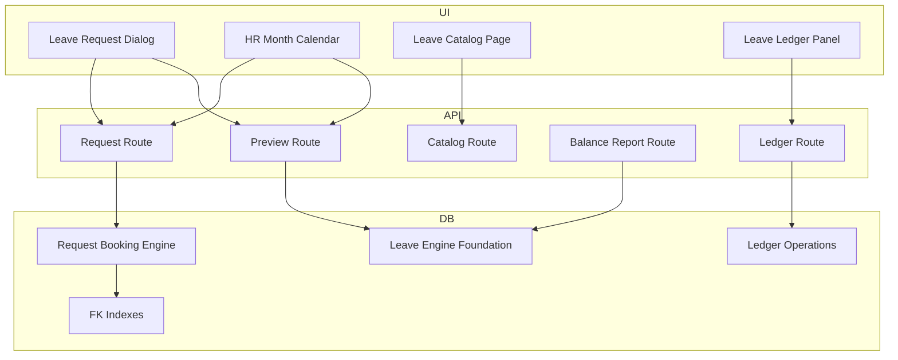

**Diagram sources**
- [leave-request-route.ts](file://apps/hr-suite/app/api/leave/request/route.ts)
- [leave-preview-route.ts](file://apps/hr-suite/app/api/leave/request/preview/route.ts)
- [leave-catalog-route.ts](file://apps/hr-suite/app/api/leave/catalog/route.ts)
- [leave-balance-report-route.ts](file://apps/hr-suite/app/api/leave/balance-report/route.ts)
- [leave-ledger-route.ts](file://apps/hr-suite/app/api/leave/ledger/route.ts)
- [leave-engine-foundation.sql](file://apps/hr-suite/supabase/migrations/20260722142551_add_leave_engine_foundation.sql)
- [leave-request-booking-engine.sql](file://apps/hr-suite/supabase/migrations/20260722190000_add_leave_request_booking_engine.sql)
- [leave-ledger-operations.sql](file://apps/hr-suite/supabase/migrations/20260722192000_add_leave_ledger_operations.sql)
- [leave-engine-fk-indexes.sql](file://apps/hr-suite/supabase/migrations/20260722144232_add_leave_engine_fk_indexes.sql)
- [leave-transaction-bucket-index.sql](file://apps/hr-suite/supabase/migrations/20260722144344_add_leave_transaction_bucket_fk_index.sql)

**Section sources**
- [leave-request-route.ts](file://apps/hr-suite/app/api/leave/request/route.ts)
- [leave-preview-route.ts](file://apps/hr-suite/app/api/leave/request/preview/route.ts)
- [leave-catalog-route.ts](file://apps/hr-suite/app/api/leave/catalog/route.ts)
- [leave-balance-report-route.ts](file://apps/hr-suite/app/api/leave/balance-report/route.ts)
- [leave-ledger-route.ts](file://apps/hr-suite/app/api/leave/ledger/route.ts)
- [leave-engine-foundation.sql](file://apps/hr-suite/supabase/migrations/20260722142551_add_leave_engine_foundation.sql)
- [leave-request-booking-engine.sql](file://apps/hr-suite/supabase/migrations/20260722190000_add_leave_request_booking_engine.sql)
- [leave-ledger-operations.sql](file://apps/hr-suite/supabase/migrations/20260722192000_add_leave_ledger_operations.sql)

## Core Components
- Leave Request API: Creates and manages leave requests, integrates with preview and booking engines.
- Preview API: Validates rules, detects conflicts, computes estimated deductions, and returns a structured preview.
- Catalog API: Provides available leave types and policy metadata.
- Balance Report API: Computes current balances per employee and leave type.
- Ledger API: Records and queries ledger entries for auditability and reporting.
- UI Components: Calendar, dialog, catalog page, and ledger panel support creation, preview, and management flows.

Key responsibilities:
- Validation against policies (e.g., minimum notice, max days, accrual rules).
- Conflict detection across overlapping periods and team coverage constraints.
- Multi-level approval routing based on organizational hierarchy and custom chains.
- Automatic deduction from balances upon booking; rollback on rejection/cancellation.

**Section sources**
- [leave-request-route.ts](file://apps/hr-suite/app/api/leave/request/route.ts)
- [leave-preview-route.ts](file://apps/hr-suite/app/api/leave/request/preview/route.ts)
- [leave-catalog-route.ts](file://apps/hr-suite/app/api/leave/catalog/route.ts)
- [leave-balance-report-route.ts](file://apps/hr-suite/app/api/leave/balance-report/route.ts)
- [leave-ledger-route.ts](file://apps/hr-suite/app/api/leave/ledger/route.ts)
- [leave-engine-foundation.sql](file://apps/hr-suite/supabase/migrations/20260722142551_add_leave_engine_foundation.sql)
- [leave-request-booking-engine.sql](file://apps/hr-suite/supabase/migrations/20260722190000_add_leave_request_booking_engine.sql)
- [leave-ledger-operations.sql](file://apps/hr-suite/supabase/migrations/20260722192000_add_leave_ledger_operations.sql)

## Architecture Overview
The workflow follows a layered architecture:
- UI triggers actions via API routes.
- API routes orchestrate validation, preview, approval routing, and booking.
- Database functions enforce integrity, compute balances, and record ledger entries.

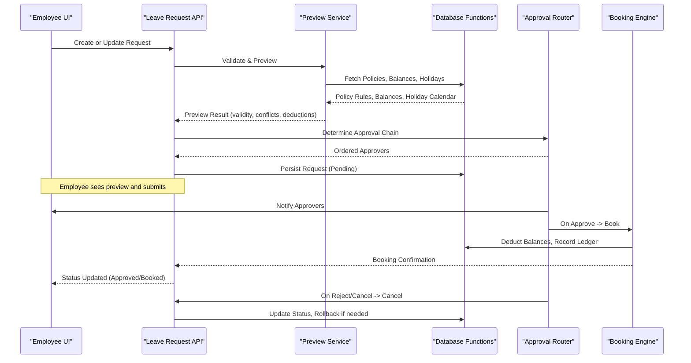

**Diagram sources**
- [leave-request-route.ts](file://apps/hr-suite/app/api/leave/request/route.ts)
- [leave-preview-route.ts](file://apps/hr-suite/app/api/leave/request/preview/route.ts)
- [leave-request-booking-engine.sql](file://apps/hr-suite/supabase/migrations/20260722190000_add_leave_request_booking_engine.sql)
- [leave-ledger-operations.sql](file://apps/hr-suite/supabase/migrations/20260722192000_add_leave_ledger_operations.sql)

## Detailed Component Analysis

### Leave Request Lifecycle
- Submission: Employee selects dates, leave type, and optional notes. Partial days can be specified. Recurring patterns are supported where configured.
- Preview: System validates policies, checks balances, detects conflicts, and returns a detailed preview including estimated deductions and any warnings.
- Approval Routing: Based on organizational hierarchy and custom chains, the system determines approvers and their order.
- Decision: Approver approves or rejects. Approved requests proceed to booking; rejected ones are finalized with status updates.
- Booking: Upon approval, balances are deducted and ledger entries recorded. Requests become visible in calendars and reports.
- Cancellation: Employees can cancel pending requests; HR may cancel approved but unbooked requests depending on policy.

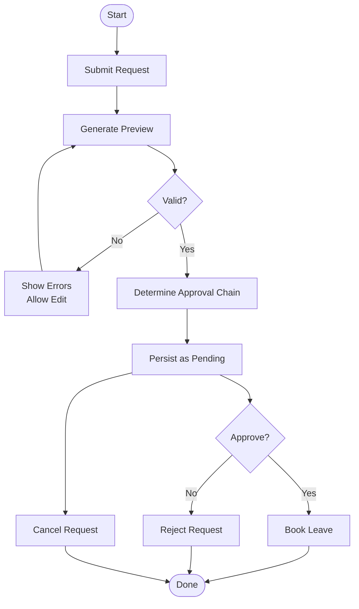

**Diagram sources**
- [leave-request-route.ts](file://apps/hr-suite/app/api/leave/request/route.ts)
- [leave-preview-route.ts](file://apps/hr-suite/app/api/leave/request/preview/route.ts)
- [leave-request-booking-engine.sql](file://apps/hr-suite/supabase/migrations/20260722190000_add_leave_request_booking_engine.sql)

**Section sources**
- [leave-request-route.ts](file://apps/hr-suite/app/api/leave/request/route.ts)
- [leave-preview-route.ts](file://apps/hr-suite/app/api/leave/request/preview/route.ts)
- [leave-request-booking-engine.sql](file://apps/hr-suite/supabase/migrations/20260722190000_add_leave_request_booking_engine.sql)

### Multi-Level Approval Chain Configuration
- Hierarchy-based routing uses manager relationships from organization data.
- Custom chains allow additional approvers or parallel approvals.
- Priority rules influence which approvers are selected when multiple candidates exist.
- The system supports escalation and fallback approvers.

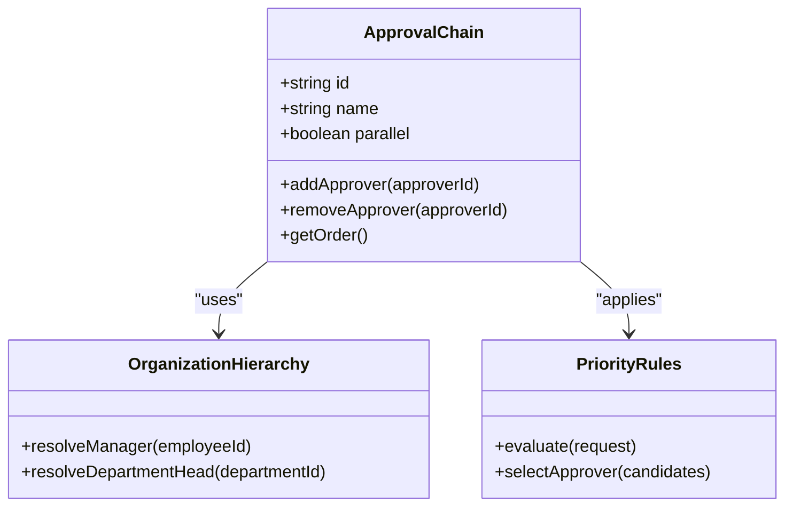

**Diagram sources**
- [priority-rule-editor.tsx](file://apps/hr-suite/components/leave/priority-rule-editor.tsx)
- [priority-rules-page.tsx](file://apps/hr-suite/components/leave/priority-rules-page.tsx)
- [leave-engine-foundation.sql](file://apps/hr-suite/supabase/migrations/20260722142551_add_leave_engine_foundation.sql)

**Section sources**
- [priority-rule-editor.tsx](file://apps/hr-suite/components/leave/priority-rule-editor.tsx)
- [priority-rules-page.tsx](file://apps/hr-suite/components/leave/priority-rules-page.tsx)
- [leave-engine-foundation.sql](file://apps/hr-suite/supabase/migrations/20260722142551_add_leave_engine_foundation.sql)

### Conflict Detection Algorithms
- Overlap detection: Checks for existing approved or booked requests within the same period.
- Coverage constraints: Ensures minimum staffing levels are maintained by department or role.
- Work pattern alignment: Aligns requested days with employee’s work schedule and holidays.
- Partial day conflicts: Detects overlaps at half-day granularity when applicable.

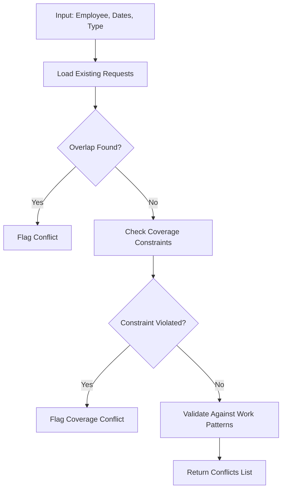

**Diagram sources**
- [leave-preview-route.ts](file://apps/hr-suite/app/api/leave/request/preview/route.ts)
- [skip-holidays-in-leave-requests.sql](file://apps/hr-suite/supabase/migrations/20260722192500_skip_holidays_in_leave_requests.sql)
- [leave-engine-foundation.sql](file://apps/hr-suite/supabase/migrations/20260722142551_add_leave_engine_foundation.sql)

**Section sources**
- [leave-preview-route.ts](file://apps/hr-suite/app/api/leave/request/preview/route.ts)
- [skip-holidays-in-leave-requests.sql](file://apps/hr-suite/supabase/migrations/20260722192500_skip_holidays_in_leave_requests.sql)
- [leave-engine-foundation.sql](file://apps/hr-suite/supabase/migrations/20260722142551_add_leave_engine_foundation.sql)

### Automatic Validation Against Balances and Policies
- Balance checks: Uses current balances per employee and leave type to ensure sufficient entitlement.
- Policy rules: Enforces minimum notice, maximum consecutive days, blackout periods, and accrual rules.
- Accrual priority: Applies priority rules to determine which balances are consumed first.
- Real-time preview: Shows estimated deductions and potential shortfalls before submission.

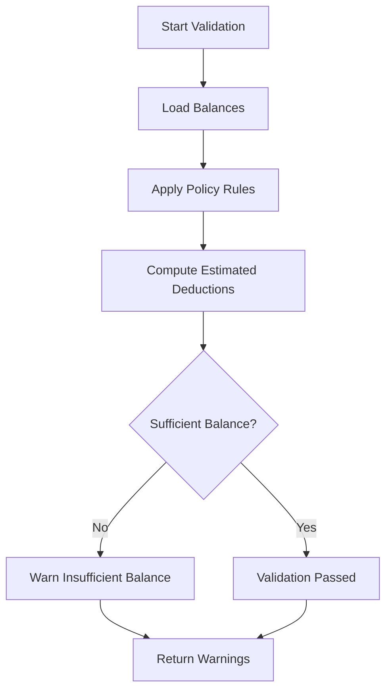

**Diagram sources**
- [leave-balance-report-route.ts](file://apps/hr-suite/app/api/leave/balance-report/route.ts)
- [leave-preview-route.ts](file://apps/hr-suite/app/api/leave/request/preview/route.ts)
- [leave-engine-foundation.sql](file://apps/hr-suite/supabase/migrations/20260722142551_add_leave_engine_foundation.sql)

**Section sources**
- [leave-balance-report-route.ts](file://apps/hr-suite/app/api/leave/balance-report/route.ts)
- [leave-preview-route.ts](file://apps/hr-suite/app/api/leave/request/preview/route.ts)
- [leave-engine-foundation.sql](file://apps/hr-suite/supabase/migrations/20260722142551_add_leave_engine_foundation.sql)

### Request Preview Functionality
- Preview endpoint returns validity, conflicts, estimated deductions, and suggested adjustments.
- Supports partial day previews and recurring pattern previews.
- Integrates holiday calendar to exclude non-working days automatically.

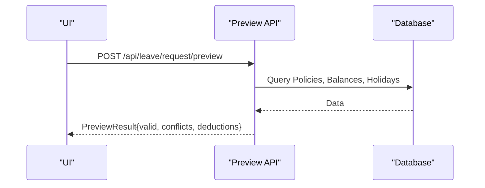

**Diagram sources**
- [leave-preview-route.ts](file://apps/hr-suite/app/api/leave/request/preview/route.ts)
- [leave-engine-foundation.sql](file://apps/hr-suite/supabase/migrations/20260722142551_add_leave_engine_foundation.sql)

**Section sources**
- [leave-preview-route.ts](file://apps/hr-suite/app/api/leave/request/preview/route.ts)
- [leave-engine-foundation.sql](file://apps/hr-suite/supabase/migrations/20260722142551_add_leave_engine_foundation.sql)

### Cancellation Processes
- Employee cancellation: Allowed while request is pending; updates status and prevents booking.
- HR cancellation: Can cancel approved but unbooked requests under certain conditions.
- Rollback logic: If partially booked, ensures consistent state and ledger integrity.

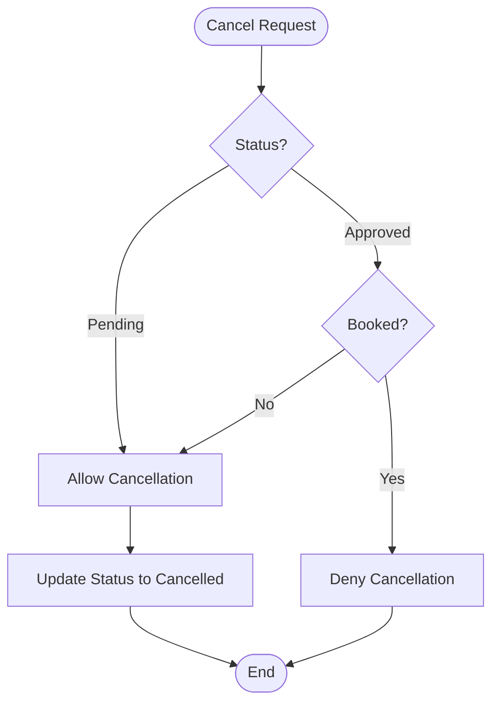

**Diagram sources**
- [leave-request-route.ts](file://apps/hr-suite/app/api/leave/request/route.ts)
- [leave-ledger-operations.sql](file://apps/hr-suite/supabase/migrations/20260722192000_add_leave_ledger_operations.sql)

**Section sources**
- [leave-request-route.ts](file://apps/hr-suite/app/api/leave/request/route.ts)
- [leave-ledger-operations.sql](file://apps/hr-suite/supabase/migrations/20260722192000_add_leave_ledger_operations.sql)

### Status Tracking
- States include Draft, Pending, Approved, Rejected, Booked, Cancelled.
- Transitions enforced by API and database functions.
- Audit trail via ledger entries for all state changes.

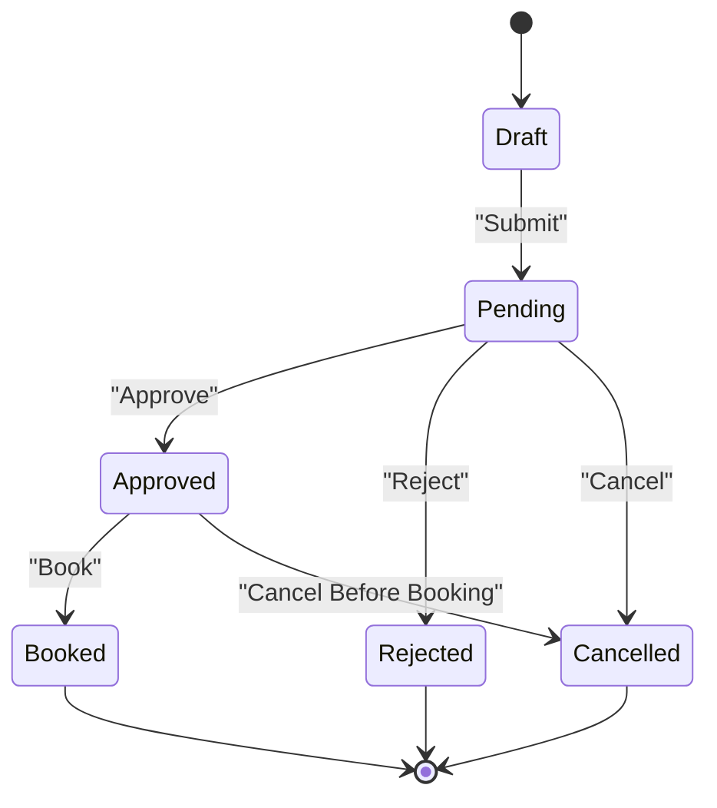

**Diagram sources**
- [leave-request-booking-engine.sql](file://apps/hr-suite/supabase/migrations/20260722190000_add_leave_request_booking_engine.sql)
- [leave-ledger-operations.sql](file://apps/hr-suite/supabase/migrations/20260722192000_add_leave_ledger_operations.sql)

**Section sources**
- [leave-request-booking-engine.sql](file://apps/hr-suite/supabase/migrations/20260722190000_add_leave_request_booking_engine.sql)
- [leave-ledger-operations.sql](file://apps/hr-suite/supabase/migrations/20260722192000_add_leave_ledger_operations.sql)

### Practical Examples
- Creating a leave request: Use the Leave Request Dialog to select dates, type, and submit. Preview shows validity and conflicts.
- Handling partial day requests: Specify morning/afternoon segments; preview calculates half-day deductions.
- Managing recurring leave patterns: Configure recurrence in the request form; preview includes future occurrences.
- Implementing custom approval workflows: Define chains and priority rules; system routes accordingly.

**Section sources**
- [leave-request-dialog.tsx](file://apps/hr-suite/components/hr-calendar/leave-request-dialog.tsx)
- [leave-catalog-page.tsx](file://apps/hr-suite/components/leave/leave-catalog-page.tsx)
- [leave-type-editor.tsx](file://apps/hr-suite/components/leave/leave-type-editor.tsx)
- [priority-rule-editor.tsx](file://apps/hr-suite/components/leave/priority-rule-editor.tsx)

### Integration with Employment Contracts, Work Patterns, and Organizational Hierarchy
- Employment contracts define entitlements and accrual rules applied during validation.
- Work patterns align requested days with scheduled working days and holidays.
- Organizational hierarchy drives approval routing and coverage checks.

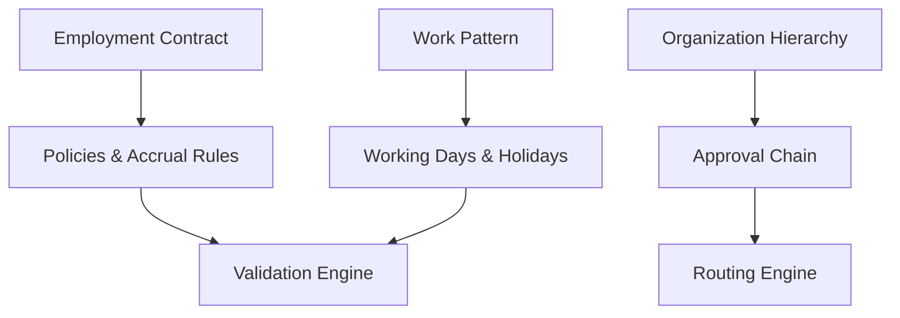

**Diagram sources**
- [work-pattern-panel.tsx](file://apps/hr-suite/components/employment/work-pattern-panel.tsx)
- [employment-time-map.tsx](file://apps/hr-suite/components/employment/employment-time-map.tsx)
- [leave-engine-foundation.sql](file://apps/hr-suite/supabase/migrations/20260722142551_add_leave_engine_foundation.sql)

**Section sources**
- [work-pattern-panel.tsx](file://apps/hr-suite/components/employment/work-pattern-panel.tsx)
- [employment-time-map.tsx](file://apps/hr-suite/components/employment/employment-time-map.tsx)
- [leave-engine-foundation.sql](file://apps/hr-suite/supabase/migrations/20260722142551_add_leave_engine_foundation.sql)

## Dependency Analysis
The Leave Request Workflow depends on:
- UI components for user interactions.
- API routes for business logic orchestration.
- Database functions for integrity, calculations, and auditing.

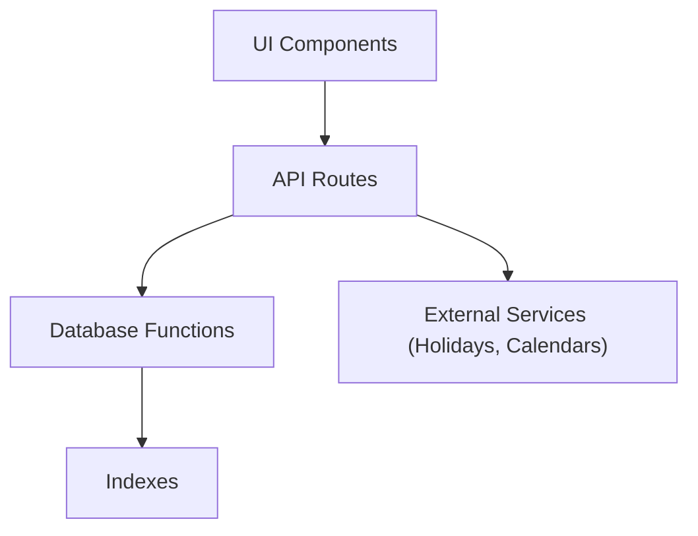

**Diagram sources**
- [leave-request-route.ts](file://apps/hr-suite/app/api/leave/request/route.ts)
- [leave-preview-route.ts](file://apps/hr-suite/app/api/leave/request/preview/route.ts)
- [leave-engine-fk-indexes.sql](file://apps/hr-suite/supabase/migrations/20260722144232_add_leave_engine_fk_indexes.sql)
- [leave-transaction-bucket-index.sql](file://apps/hr-suite/supabase/migrations/20260722144344_add_leave_transaction_bucket_fk_index.sql)

**Section sources**
- [leave-request-route.ts](file://apps/hr-suite/app/api/leave/request/route.ts)
- [leave-preview-route.ts](file://apps/hr-suite/app/api/leave/request/preview/route.ts)
- [leave-engine-fk-indexes.sql](file://apps/hr-suite/supabase/migrations/20260722144232_add_leave_engine_fk_indexes.sql)
- [leave-transaction-bucket-index.sql](file://apps/hr-suite/supabase/migrations/20260722144344_add_leave_transaction_bucket_fk_index.sql)

## Performance Considerations
- Indexing: Foreign key indexes and bucket indexes optimize query performance for large datasets.
- Caching: Consider caching policy and balance results for frequent reads.
- Batch operations: For recurring requests, batch processing reduces overhead.
- Ledger efficiency: Ensure ledger operations are atomic and minimal to maintain throughput.

[No sources needed since this section provides general guidance]

## Troubleshooting Guide
Common issues and resolutions:
- Validation failures: Review policy rules and balances; adjust request parameters.
- Conflicts detected: Resolve overlapping requests or adjust coverage constraints.
- Approval routing errors: Verify organizational hierarchy and custom chains.
- Booking failures: Check ledger integrity and rollback states.

**Section sources**
- [leave-preview-route.ts](file://apps/hr-suite/app/api/leave/request/preview/route.ts)
- [leave-ledger-operations.sql](file://apps/hr-suite/supabase/migrations/20260722192000_add_leave_ledger_operations.sql)

## Conclusion
The Leave Request Workflow in LiquidHR provides a robust, configurable system for managing leave from submission to booking. It integrates closely with employment contracts, work patterns, and organizational hierarchy to ensure accurate validation, efficient approval routing, and reliable booking. The modular architecture supports customization and scalability, making it suitable for diverse organizational needs.

[No sources needed since this section summarizes without analyzing specific files]

## Appendices
- Messages and localization: See leave.json for i18n keys related to leave functionality.
- Demo data: Seed scripts provide sample data for testing leave scenarios.

**Section sources**
- [leave.json](file://apps/hr-suite/messages/en/leave.json)
- [leave-demo-linda.sql](file://apps/hr-suite/supabase/migrations/20260722190500_seed_leave_demo_linda.sql)