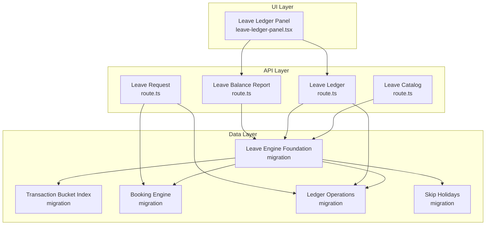
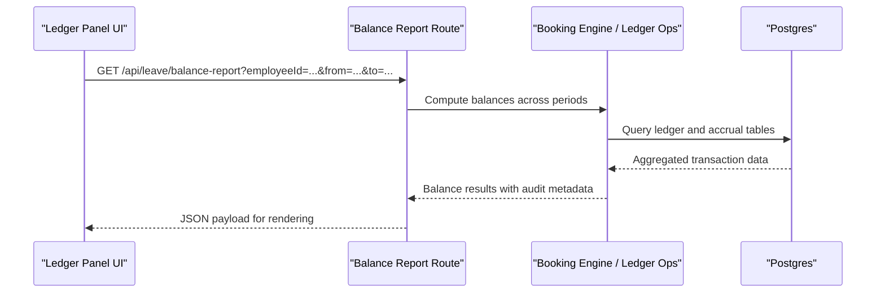
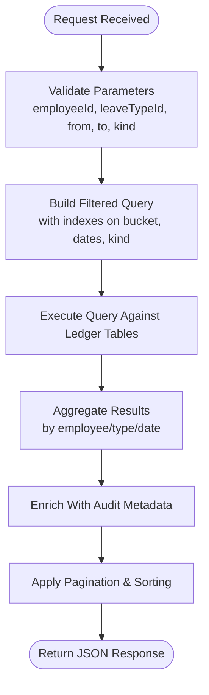
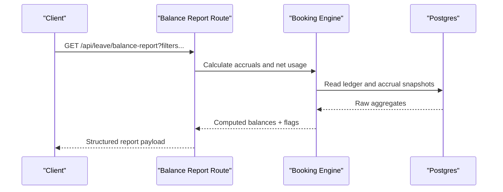
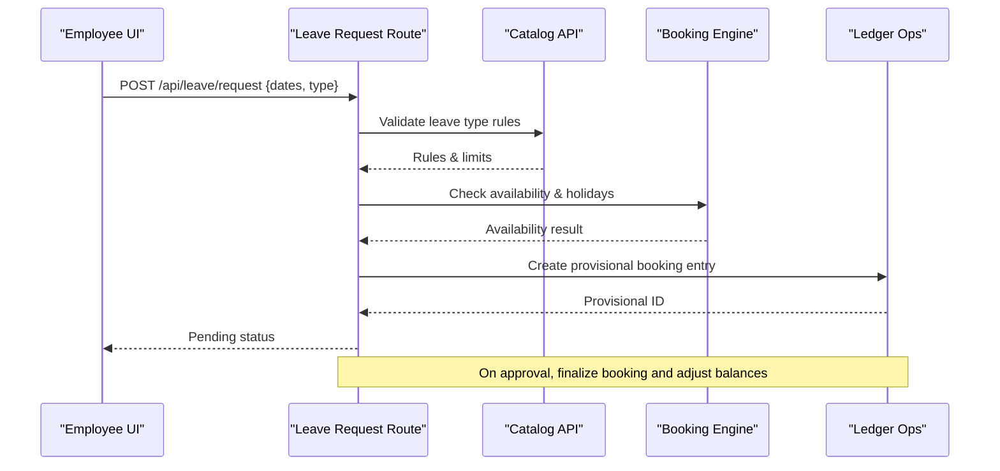
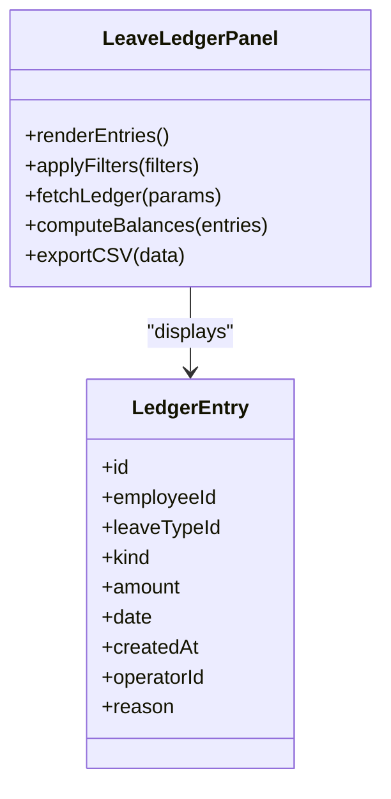
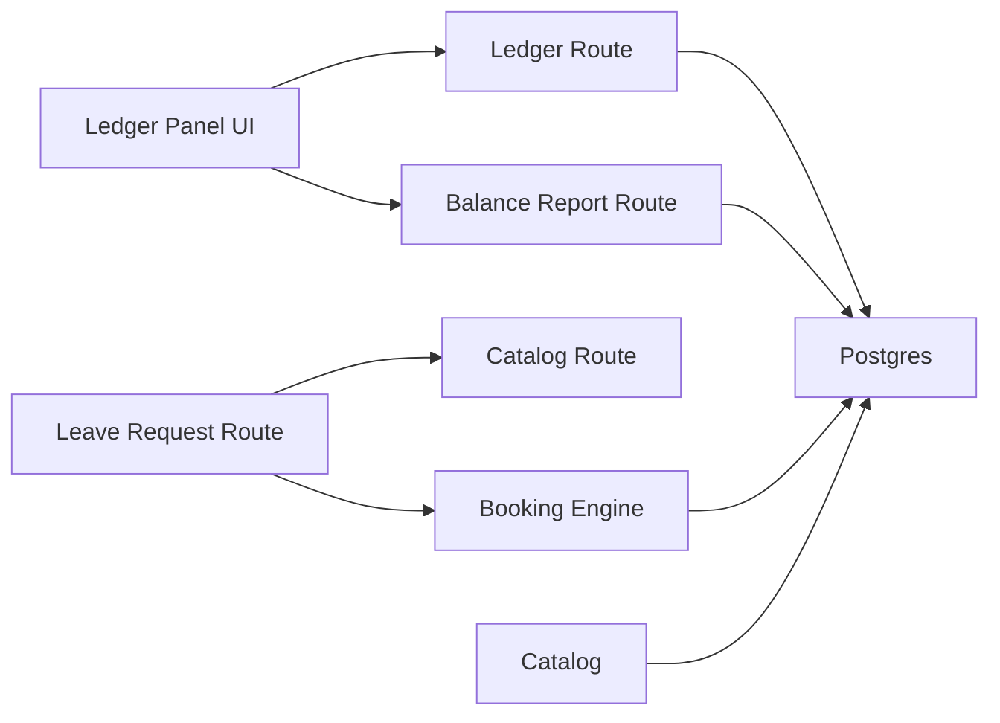

# Ledger and Reporting

<cite>
**Referenced Files in This Document**
- [apps/hr-suite/app/api/leave/balance-report/route.ts](file://apps/hr-suite/app/api/leave/balance-report/route.ts)
- [apps/hr-suite/app/api/leave/ledger/route.ts](file://apps/hr-suite/app/api/leave/ledger/route.ts)
- [apps/hr-suite/app/api/leave/request/route.ts](file://apps/hr-suite/app/api/leave/request/route.ts)
- [apps/hr-suite/app/api/leave/catalog/route.ts](file://apps/hr-suite/app/api/leave/catalog/route.ts)
- [apps/hr-suite/components/leave/leave-ledger-panel.tsx](file://apps/hr-suite/components/leave/leave-ledger-panel.tsx)
- [apps/hr-suite/lib/leave/index.ts](file://apps/hr-suite/lib/leave/index.ts)
- [supabase/migrations/20260722142551_add_leave_engine_foundation.sql](file://supabase/migrations/20260722142551_add_leave_engine_foundation.sql)
- [supabase/migrations/20260722144344_add_leave_transaction_bucket_fk_index.sql](file://supabase/migrations/20260722144344_add_leave_transaction_bucket_fk_index.sql)
- [supabase/migrations/20260722190000_add_leave_request_booking_engine.sql](file://supabase/migrations/20260722190000_add_leave_request_booking_engine.sql)
- [supabase/migrations/20260722192000_add_leave_ledger_operations.sql](file://supabase/migrations/20260722192000_add_leave_ledger_operations.sql)
- [supabase/migrations/20260722192500_skip_holidays_in_leave_requests.sql](file://supabase/migrations/20260722192500_skip_holidays_in_leave_requests.sql)
</cite>

## Table of Contents
1. Introduction
2. Project Structure
3. Core Components
4. Architecture Overview
5. Detailed Component Analysis
6. Dependency Analysis
7. Performance Considerations
8. Troubleshooting Guide
9. Conclusion

## Introduction
This document explains the Leave Ledger and Reporting system that records all leave transactions and generates comprehensive reports. It covers the ledger structure for bookings, adjustments, corrections, and reversals with full audit trails; reporting capabilities including balance reports, usage analytics, compliance summaries, and export functionality; real-time balance updates; historical data access; and integration points with HR analytics. Practical examples are provided for generating custom reports, analyzing leave patterns, identifying compliance issues, and exporting data for payroll processing. Data retention policies, audit requirements, and performance optimization strategies for large datasets are also addressed.

## Project Structure
The Leave Ledger and Reporting system spans API routes, UI components, and database migrations:
- API routes expose endpoints for ledger queries, balance reports, leave requests, and catalog management.
- The ledger panel component renders transactional history and balances for employees.
- Database migrations define the core schema, indexes, and operations for leave engine, booking engine, ledger operations, and holiday handling.

**Diagram sources**
- [apps/hr-suite/app/api/leave/balance-report/route.ts](file://apps/hr-suite/app/api/leave/balance-report/route.ts)
- [apps/hr-suite/app/api/leave/ledger/route.ts](file://apps/hr-suite/app/api/leave/ledger/route.ts)
- [apps/hr-suite/app/api/leave/request/route.ts](file://apps/hr-suite/app/api/leave/request/route.ts)
- [apps/hr-suite/app/api/leave/catalog/route.ts](file://apps/hr-suite/app/api/leave/catalog/route.ts)
- [apps/hr-suite/components/leave/leave-ledger-panel.tsx](file://apps/hr-suite/components/leave/leave-ledger-panel.tsx)
- [supabase/migrations/20260722142551_add_leave_engine_foundation.sql](file://supabase/migrations/20260722142551_add_leave_engine_foundation.sql)
- [supabase/migrations/20260722144344_add_leave_transaction_bucket_fk_index.sql](file://supabase/migrations/20260722144344_add_leave_transaction_bucket_fk_index.sql)
- [supabase/migrations/20260722190000_add_leave_request_booking_engine.sql](file://supabase/migrations/20260722190000_add_leave_request_booking_engine.sql)
- [supabase/migrations/20260722192000_add_leave_ledger_operations.sql](file://supabase/migrations/20260722192000_add_leave_ledger_operations.sql)
- [supabase/migrations/20260722192500_skip_holidays_in_leave_requests.sql](file://supabase/migrations/20260722192500_skip_holidays_in_leave_requests.sql)

**Section sources**
- [apps/hr-suite/app/api/leave/balance-report/route.ts](file://apps/hr-suite/app/api/leave/balance-report/route.ts)
- [apps/hr-suite/app/api/leave/ledger/route.ts](file://apps/hr-suite/app/api/leave/ledger/route.ts)
- [apps/hr-suite/app/api/leave/request/route.ts](file://apps/hr-suite/app/api/leave/request/route.ts)
- [apps/hr-suite/app/api/leave/catalog/route.ts](file://apps/hr-suite/app/api/leave/catalog/route.ts)
- [apps/hr-suite/components/leave/leave-ledger-panel.tsx](file://apps/hr-suite/components/leave/leave-ledger-panel.tsx)
- [supabase/migrations/20260722142551_add_leave_engine_foundation.sql](file://supabase/migrations/20260722142551_add_leave_engine_foundation.sql)
- [supabase/migrations/20260722144344_add_leave_transaction_bucket_fk_index.sql](file://supabase/migrations/20260722144344_add_leave_transaction_bucket_fk_index.sql)
- [supabase/migrations/20260722190000_add_leave_request_booking_engine.sql](file://supabase/migrations/20260722190000_add_leave_request_booking_engine.sql)
- [supabase/migrations/20260722192000_add_leave_ledger_operations.sql](file://supabase/migrations/20260722192000_add_leave_ledger_operations.sql)
- [supabase/migrations/20260722192500_skip_holidays_in_leave_requests.sql](file://supabase/migrations/20260722192500_skip_holidays_in_leave_requests.sql)

## Core Components
- Ledger API route: Provides read access to leave transactions, supports filtering by employee, type, date range, and operation kind (booking, adjustment, correction, reversal). Returns an auditable ledger view with timestamps and operator context.
- Balance Report API route: Computes current and historical balances per employee and leave type, aggregating accruals, bookings, adjustments, corrections, and reversals within a specified period.
- Leave Request API route: Orchestrates leave request creation, validation against rules and holidays, and triggers booking engine operations that write to the ledger.
- Catalog API route: Manages leave types and related configuration used by the booking engine and reporting.
- Ledger Panel UI: Displays ledger entries and computed balances for selected employees, enabling drill-down into transaction details and audit information.

Key responsibilities:
- Immutable ledger entries with full audit trail (who, when, why).
- Real-time balance computation from ledger state.
- Compliance checks via catalog and booking engine rules.
- Exportable report payloads for downstream systems.

**Section sources**
- [apps/hr-suite/app/api/leave/ledger/route.ts](file://apps/hr-suite/app/api/leave/ledger/route.ts)
- [apps/hr-suite/app/api/leave/balance-report/route.ts](file://apps/hr-suite/app/api/leave/balance-report/route.ts)
- [apps/hr-suite/app/api/leave/request/route.ts](file://apps/hr-suite/app/api/leave/request/route.ts)
- [apps/hr-suite/app/api/leave/catalog/route.ts](file://apps/hr-suite/app/api/leave/catalog/route.ts)
- [apps/hr-suite/components/leave/leave-ledger-panel.tsx](file://apps/hr-suite/components/leave/leave-ledger-panel.tsx)

## Architecture Overview
The system follows a layered architecture:
- Presentation layer: Ledger panel UI consumes API endpoints to render ledger entries and balances.
- API layer: Next.js API routes handle requests, enforce authorization, validate inputs, and delegate to domain logic.
- Domain layer: Booking engine and ledger operations implement business rules, compute balances, and ensure consistency.
- Data layer: Supabase Postgres stores leave entities, transactions, and indexes optimized for reporting queries.

**Diagram sources**
- [apps/hr-suite/app/api/leave/balance-report/route.ts](file://apps/hr-suite/app/api/leave/balance-report/route.ts)
- [supabase/migrations/20260722190000_add_leave_request_booking_engine.sql](file://supabase/migrations/20260722190000_add_leave_request_booking_engine.sql)
- [supabase/migrations/20260722192000_add_leave_ledger_operations.sql](file://supabase/migrations/20260722192000_add_leave_ledger_operations.sql)

## Detailed Component Analysis

### Ledger API Route
Responsibilities:
- Retrieve ledger entries filtered by employee, leave type, date range, and operation kind.
- Return immutable entries with audit fields (created_at, updated_at, operator_id, reason, reference_id).
- Support pagination and sorting for large datasets.

Operational kinds:
- Booking: Records approved leave requests.
- Adjustment: Manual changes to balances or allocations.
- Correction: Fixes erroneous entries without deleting history.
- Reversal: Cancels previous entries while preserving audit trail.

**Diagram sources**
- [apps/hr-suite/app/api/leave/ledger/route.ts](file://apps/hr-suite/app/api/leave/ledger/route.ts)
- [supabase/migrations/20260722144344_add_leave_transaction_bucket_fk_index.sql](file://supabase/migrations/20260722144344_add_leave_transaction_bucket_fk_index.sql)

**Section sources**
- [apps/hr-suite/app/api/leave/ledger/route.ts](file://apps/hr-suite/app/api/leave/ledger/route.ts)
- [supabase/migrations/20260722144344_add_leave_transaction_bucket_fk_index.sql](file://supabase/migrations/20260722144344_add_leave_transaction_bucket_fk_index.sql)

### Balance Report API Route
Responsibilities:
- Compute current and historical balances per employee and leave type.
- Summarize accruals, bookings, adjustments, corrections, and reversals over requested periods.
- Provide breakdowns by month/quarter/year and compliance flags.

Report outputs:
- Current balance snapshot.
- Periodic usage totals.
- Compliance indicators (e.g., negative balances, policy violations).
- Export-ready dataset.

**Diagram sources**
- [apps/hr-suite/app/api/leave/balance-report/route.ts](file://apps/hr-suite/app/api/leave/balance-report/route.ts)
- [supabase/migrations/20260722190000_add_leave_request_booking_engine.sql](file://supabase/migrations/20260722190000_add_leave_request_booking_engine.sql)

**Section sources**
- [apps/hr-suite/app/api/leave/balance-report/route.ts](file://apps/hr-suite/app/api/leave/balance-report/route.ts)
- [supabase/migrations/20260722190000_add_leave_request_booking_engine.sql](file://supabase/migrations/20260722190000_add_leave_request_booking_engine.sql)

### Leave Request API Route
Responsibilities:
- Accept new leave requests with validation against catalog rules and holidays.
- Trigger booking engine to create ledger entries upon approval workflow.
- Ensure idempotency and consistent state transitions.

Workflow highlights:
- Pre-approval: Validate availability and policy constraints.
- Approval: Create booking entry and update balances.
- Post-approval: Emit events for analytics and notifications.

**Diagram sources**
- [apps/hr-suite/app/api/leave/request/route.ts](file://apps/hr-suite/app/api/leave/request/route.ts)
- [apps/hr-suite/app/api/leave/catalog/route.ts](file://apps/hr-suite/app/api/leave/catalog/route.ts)
- [supabase/migrations/20260722190000_add_leave_request_booking_engine.sql](file://supabase/migrations/20260722190000_add_leave_request_booking_engine.sql)
- [supabase/migrations/20260722192500_skip_holidays_in_leave_requests.sql](file://supabase/migrations/20260722192500_skip_holidays_in_leave_requests.sql)

**Section sources**
- [apps/hr-suite/app/api/leave/request/route.ts](file://apps/hr-suite/app/api/leave/request/route.ts)
- [apps/hr-suite/app/api/leave/catalog/route.ts](file://apps/hr-suite/app/api/leave/catalog/route.ts)
- [supabase/migrations/20260722190000_add_leave_request_booking_engine.sql](file://supabase/migrations/20260722190000_add_leave_request_booking_engine.sql)
- [supabase/migrations/20260722192500_skip_holidays_in_leave_requests.sql](file://supabase/migrations/20260722192500_skip_holidays_in_leave_requests.sql)

### Ledger Panel UI Component
Responsibilities:
- Render ledger entries with filters and pagination.
- Display computed balances and audit metadata.
- Enable drill-down into individual transactions and their reasons.

User interactions:
- Select employee and leave type.
- Apply date range and operation kind filters.
- Export filtered ledger data for analysis or payroll.

**Diagram sources**
- [apps/hr-suite/components/leave/leave-ledger-panel.tsx](file://apps/hr-suite/components/leave/leave-ledger-panel.tsx)

**Section sources**
- [apps/hr-suite/components/leave/leave-ledger-panel.tsx](file://apps/hr-suite/components/leave/leave-ledger-panel.tsx)

## Dependency Analysis
Core dependencies:
- API routes depend on domain logic implemented in booking engine and ledger operations.
- UI depends on API responses for rendering and user actions.
- Database schema is defined by migrations; indexes optimize query performance for reporting.

**Diagram sources**
- [apps/hr-suite/app/api/leave/ledger/route.ts](file://apps/hr-suite/app/api/leave/ledger/route.ts)
- [apps/hr-suite/app/api/leave/balance-report/route.ts](file://apps/hr-suite/app/api/leave/balance-report/route.ts)
- [apps/hr-suite/app/api/leave/request/route.ts](file://apps/hr-suite/app/api/leave/request/route.ts)
- [apps/hr-suite/app/api/leave/catalog/route.ts](file://apps/hr-suite/app/api/leave/catalog/route.ts)
- [supabase/migrations/20260722142551_add_leave_engine_foundation.sql](file://supabase/migrations/20260722142551_add_leave_engine_foundation.sql)

**Section sources**
- [apps/hr-suite/app/api/leave/ledger/route.ts](file://apps/hr-suite/app/api/leave/ledger/route.ts)
- [apps/hr-suite/app/api/leave/balance-report/route.ts](file://apps/hr-suite/app/api/leave/balance-report/route.ts)
- [apps/hr-suite/app/api/leave/request/route.ts](file://apps/hr-suite/app/api/leave/request/route.ts)
- [apps/hr-suite/app/api/leave/catalog/route.ts](file://apps/hr-suite/app/api/leave/catalog/route.ts)
- [supabase/migrations/20260722142551_add_leave_engine_foundation.sql](file://supabase/migrations/20260722142551_add_leave_engine_foundation.sql)

## Performance Considerations
Optimization strategies:
- Use indexed columns for frequent filters (employeeId, leaveTypeId, date ranges, operation kind).
- Implement server-side pagination and cursor-based navigation for large ledgers.
- Cache frequently accessed balance snapshots where appropriate, with invalidation on mutations.
- Batch aggregation queries to reduce round-trips and leverage database-level computations.
- Avoid N+1 queries by joining necessary tables and selecting only required fields.

Data retention and archival:
- Retain immutable ledger entries indefinitely for audit compliance.
- Archive historical snapshots periodically to maintain query performance.
- Partition large tables by date or tenant to improve maintenance and query efficiency.

[No sources needed since this section provides general guidance]

## Troubleshooting Guide
Common issues and resolutions:
- Missing indexes causing slow ledger queries: Verify existence of transaction bucket and date indexes; add missing indexes as per migration definitions.
- Incorrect holiday skipping: Ensure holiday rules are applied during request validation and booking calculations.
- Inconsistent balances: Confirm that adjustments, corrections, and reversals are recorded with proper signs and references; reconcile using ledger audit trail.
- Authorization failures: Validate role-based access controls for ledger and report endpoints.

Audit and compliance checks:
- Review operator_id and reason fields for each ledger entry to trace changes.
- Generate compliance summaries highlighting negative balances, policy breaches, and overdue approvals.

**Section sources**
- [supabase/migrations/20260722144344_add_leave_transaction_bucket_fk_index.sql](file://supabase/migrations/20260722144344_add_leave_transaction_bucket_fk_index.sql)
- [supabase/migrations/20260722192500_skip_holidays_in_leave_requests.sql](file://supabase/migrations/20260722192500_skip_holidays_in_leave_requests.sql)
- [supabase/migrations/20260722192000_add_leave_ledger_operations.sql](file://supabase/migrations/20260722192000_add_leave_ledger_operations.sql)

## Conclusion
The Leave Ledger and Reporting system provides a robust foundation for tracking leave transactions with full auditability, accurate balance computation, and comprehensive reporting. By leveraging indexed schemas, immutable ledger entries, and clear API boundaries, it supports real-time insights, compliance monitoring, and export workflows for payroll and analytics. Proper performance tuning and data retention policies ensure scalability and regulatory adherence.

[No sources needed since this section summarizes without analyzing specific files]