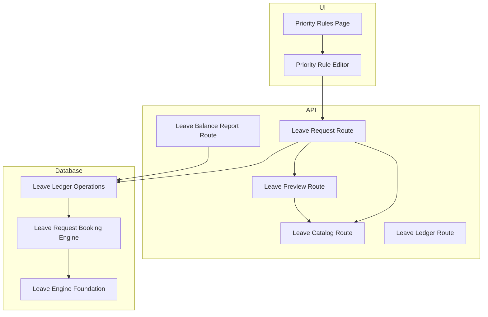
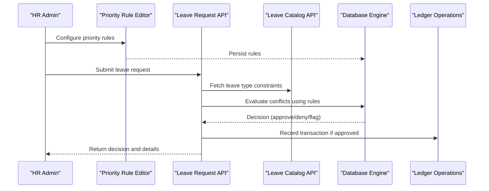
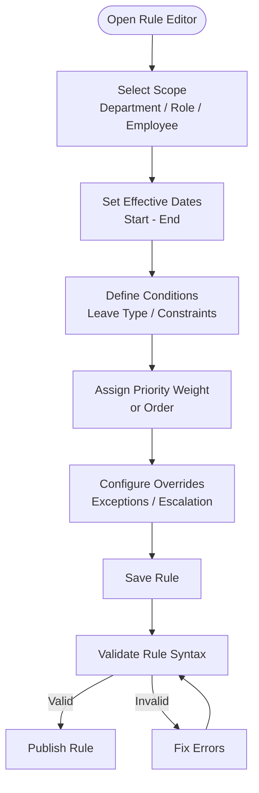
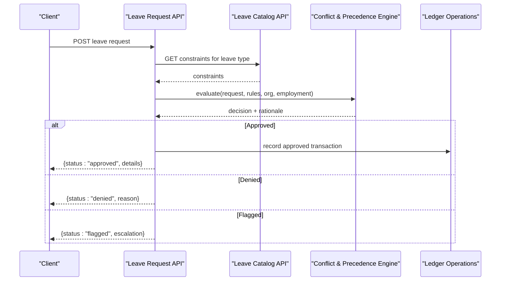
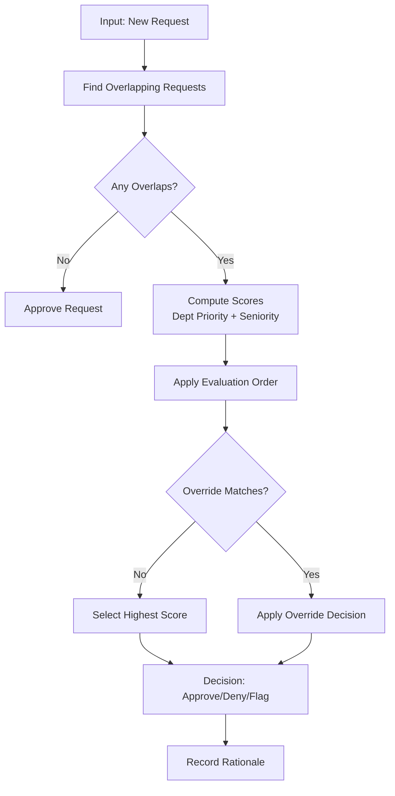
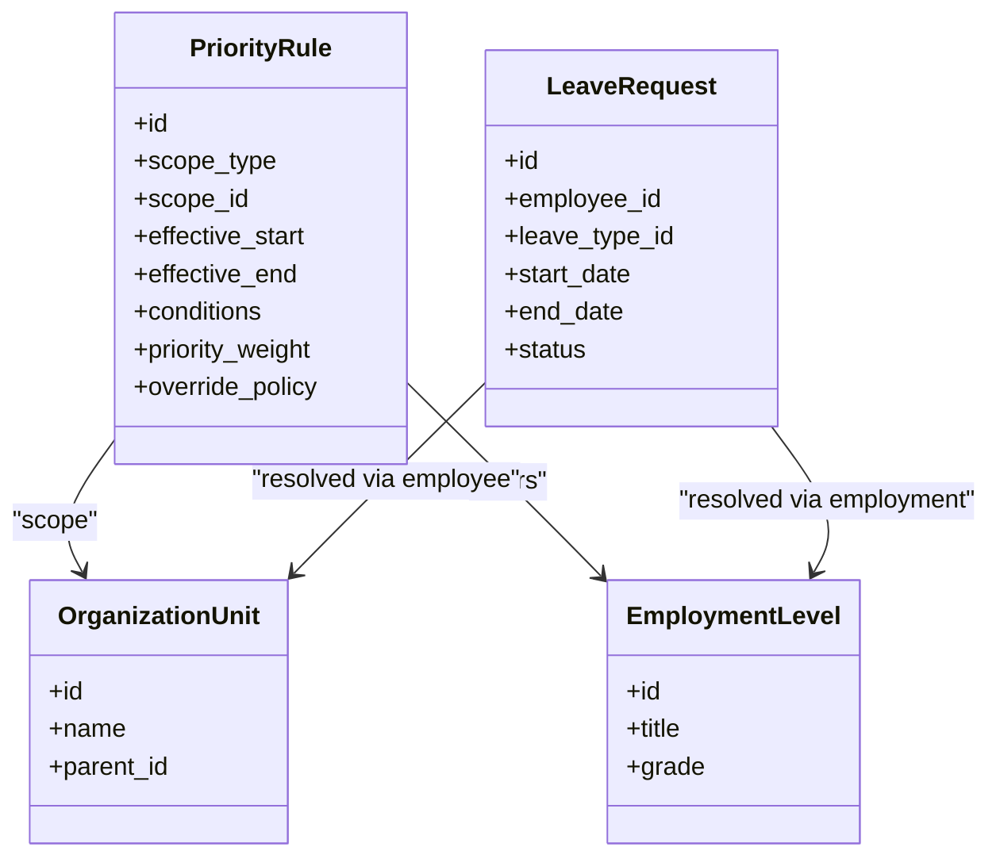
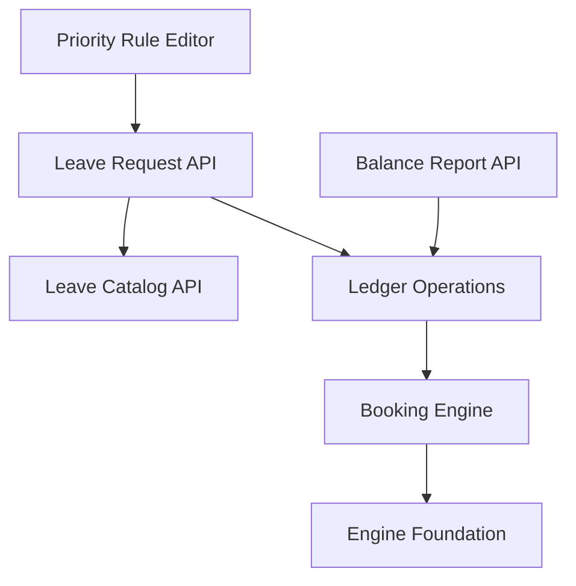

# Priority Rules System

<cite>
**Referenced Files in This Document**
- [priority-rules-page.tsx](file://apps/hr-suite/app/settings/leave-accrual/priority-rules/page.tsx)
- [priority-rule-editor.tsx](file://apps/hr-suite/components/leave/priority-rule-editor.tsx)
- [leave-request-route.ts](file://apps/hr-suite/app/api/leave/request/route.ts)
- [leave-preview-route.ts](file://apps/hr-suite/app/api/leave/request/preview/route.ts)
- [leave-engine-foundation.sql](file://apps/hr-suite/supabase/migrations/20260722142551_add_leave_engine_foundation.sql)
- [leave-request-booking-engine.sql](file://apps/hr-suite/supabase/migrations/20260722190000_add_leave_request_booking_engine.sql)
- [leave-ledger-operations.sql](file://apps/hr-suite/supabase/migrations/20260722192000_add_leave_ledger_operations.sql)
- [leave-balance-report-route.ts](file://apps/hr-suite/app/api/leave/balance-report/route.ts)
- [leave-catalog-route.ts](file://apps/hr-suite/app/api/leave/catalog/route.ts)
- [leave-ledger-route.ts](file://apps/hr-suite/app/api/leave/ledger/route.ts)
</cite>

## Table of Contents
1. [Introduction](#introduction)
2. [Project Structure](#project-structure)
3. [Core Components](#core-components)
4. [Architecture Overview](#architecture-overview)
5. [Detailed Component Analysis](#detailed-component-analysis)
6. [Dependency Analysis](#dependency-analysis)
7. [Performance Considerations](#performance-considerations)
8. [Troubleshooting Guide](#troubleshooting-guide)
9. [Conclusion](#conclusion)

## Introduction
This document explains the Priority Rules System that resolves conflicting leave requests and determines approval precedence. It covers how priority rules are configured via the rule editor, how date-based conflicts are detected and resolved, how departmental priorities and employee seniority influence decisions, and how overrides and custom business logic integrate with organizational structure and employment levels. It also provides practical examples, edge case handling, and performance optimization guidance for large organizations.

## Project Structure
The Priority Rules System spans UI components, API routes, and database migrations:
- UI configuration: pages and editors for managing priority rules
- API endpoints: request submission, preview, catalog, ledger, and balance reporting
- Database schema and operations: leave engine foundation, booking engine, and ledger operations

**Diagram sources**
- [priority-rules-page.tsx](file://apps/hr-suite/app/settings/leave-accrual/priority-rules/page.tsx)
- [priority-rule-editor.tsx](file://apps/hr-suite/components/leave/priority-rule-editor.tsx)
- [leave-request-route.ts](file://apps/hr-suite/app/api/leave/request/route.ts)
- [leave-preview-route.ts](file://apps/hr-suite/app/api/leave/request/preview/route.ts)
- [leave-catalog-route.ts](file://apps/hr-suite/app/api/leave/catalog/route.ts)
- [leave-ledger-route.ts](file://apps/hr-suite/app/api/leave/ledger/route.ts)
- [leave-balance-report-route.ts](file://apps/hr-suite/app/api/leave/balance-report/route.ts)
- [leave-engine-foundation.sql](file://apps/hr-suite/supabase/migrations/20260722142551_add_leave_engine_foundation.sql)
- [leave-request-booking-engine.sql](file://apps/hr-suite/supabase/migrations/20260722190000_add_leave_request_booking_engine.sql)
- [leave-ledger-operations.sql](file://apps/hr-suite/supabase/migrations/20260722192000_add_leave_ledger_operations.sql)

**Section sources**
- [priority-rules-page.tsx](file://apps/hr-suite/app/settings/leave-accrual/priority-rules/page.tsx)
- [priority-rule-editor.tsx](file://apps/hr-suite/components/leave/priority-rule-editor.tsx)
- [leave-request-route.ts](file://apps/hr-suite/app/api/leave/request/route.ts)
- [leave-preview-route.ts](file://apps/hr-suite/app/api/leave/request/preview/route.ts)
- [leave-catalog-route.ts](file://apps/hr-suite/app/api/leave/catalog/route.ts)
- [leave-ledger-route.ts](file://apps/hr-suite/app/api/leave/ledger/route.ts)
- [leave-balance-report-route.ts](file://apps/hr-suite/app/api/leave/balance-report/route.ts)
- [leave-engine-foundation.sql](file://apps/hr-suite/supabase/migrations/20260722142551_add_leave_engine_foundation.sql)
- [leave-request-booking-engine.sql](file://apps/hr-suite/supabase/migrations/20260722190000_add_leave_request_booking_engine.sql)
- [leave-ledger-operations.sql](file://apps/hr-suite/supabase/migrations/20260722192000_add_leave_ledger_operations.sql)

## Core Components
- Priority Rules Page: Lists and manages priority rules for leave conflict resolution.
- Priority Rule Editor: Configures rule conditions (date ranges, departments, roles), evaluation order, and override behavior.
- Leave Request API: Submits new leave requests, evaluates conflicts against active rules, and returns decisions or previews.
- Leave Preview API: Simulates outcomes without persisting changes to validate rule effects.
- Leave Catalog API: Provides available leave types and their constraints used by rule evaluation.
- Leave Ledger API: Records approved/denied transactions and supports auditability.
- Leave Balance Report API: Aggregates balances and usage to inform rule decisions.
- Database Migrations: Define core tables, indexes, and stored procedures for leave engine, booking, and ledger operations.

Key responsibilities:
- Rule configuration and persistence
- Conflict detection across overlapping dates
- Precedence calculation using departmental and seniority factors
- Override mechanisms for special cases
- Integration with organization and employment data

**Section sources**
- [priority-rules-page.tsx](file://apps/hr-suite/app/settings/leave-accrual/priority-rules/page.tsx)
- [priority-rule-editor.tsx](file://apps/hr-suite/components/leave/priority-rule-editor.tsx)
- [leave-request-route.ts](file://apps/hr-suite/app/api/leave/request/route.ts)
- [leave-preview-route.ts](file://apps/hr-suite/app/api/leave/request/preview/route.ts)
- [leave-catalog-route.ts](file://apps/hr-suite/app/api/leave/catalog/route.ts)
- [leave-ledger-route.ts](file://apps/hr-suite/app/api/leave/ledger/route.ts)
- [leave-balance-report-route.ts](file://apps/hr-suite/app/api/leave/balance-report/route.ts)
- [leave-engine-foundation.sql](file://apps/hr-suite/supabase/migrations/20260722142551_add_leave_engine_foundation.sql)
- [leave-request-booking-engine.sql](file://apps/hr-suite/supabase/migrations/20260722190000_add_leave_request_booking_engine.sql)
- [leave-ledger-operations.sql](file://apps/hr-suite/supabase/migrations/20260722192000_add_leave_ledger_operations.sql)

## Architecture Overview
The system follows a layered architecture:
- UI Layer: Configuration and user interactions for priority rules
- API Layer: Request handling, validation, rule evaluation orchestration, and responses
- Data Layer: Persistent storage for rules, leave requests, catalogs, and ledger entries
- Engine Layer: Stored procedures and functions implementing conflict detection and precedence resolution

**Diagram sources**
- [priority-rule-editor.tsx](file://apps/hr-suite/components/leave/priority-rule-editor.tsx)
- [leave-request-route.ts](file://apps/hr-suite/app/api/leave/request/route.ts)
- [leave-catalog-route.ts](file://apps/hr-suite/app/api/leave/catalog/route.ts)
- [leave-engine-foundation.sql](file://apps/hr-suite/supabase/migrations/20260722142551_add_leave_engine_foundation.sql)
- [leave-ledger-operations.sql](file://apps/hr-suite/supabase/migrations/20260722192000_add_leave_ledger_operations.sql)

## Detailed Component Analysis

### Priority Rule Editor
The editor allows administrators to define rules that determine precedence when multiple leave requests overlap. Key capabilities include:
- Date-based conflict detection: specify effective periods and overlapping windows
- Departmental priorities: assign weights or precedence per department or team
- Employee seniority considerations: factor in tenure, role level, or employment status
- Evaluation order: configure rule sequence to ensure deterministic outcomes
- Override mechanisms: allow exceptions for specific employees, roles, or scenarios

**Diagram sources**
- [priority-rule-editor.tsx](file://apps/hr-suite/components/leave/priority-rule-editor.tsx)

**Section sources**
- [priority-rule-editor.tsx](file://apps/hr-suite/components/leave/priority-rule-editor.tsx)

### Leave Request Submission and Evaluation
When a leave request is submitted, the system performs:
- Validation against leave catalog constraints
- Conflict detection with existing requests over overlapping dates
- Rule evaluation in configured order to compute precedence
- Application of overrides and escalation paths
- Recording of decision and optional ledger entry

**Diagram sources**
- [leave-request-route.ts](file://apps/hr-suite/app/api/leave/request/route.ts)
- [leave-catalog-route.ts](file://apps/hr-suite/app/api/leave/catalog/route.ts)
- [leave-engine-foundation.sql](file://apps/hr-suite/supabase/migrations/20260722142551_add_leave_engine_foundation.sql)
- [leave-ledger-operations.sql](file://apps/hr-suite/supabase/migrations/20260722192000_add_leave_ledger_operations.sql)

**Section sources**
- [leave-request-route.ts](file://apps/hr-suite/app/api/leave/request/route.ts)
- [leave-catalog-route.ts](file://apps/hr-suite/app/api/leave/catalog/route.ts)
- [leave-engine-foundation.sql](file://apps/hr-suite/supabase/migrations/20260722142551_add_leave_engine_foundation.sql)
- [leave-ledger-operations.sql](file://apps/hr-suite/supabase/migrations/20260722192000_add_leave_ledger_operations.sql)

### Conflict Resolution Algorithm
The algorithm identifies overlapping requests and applies precedence based on configured rules:
- Detect overlaps between requested date ranges
- Score candidates using departmental priority and seniority factors
- Apply evaluation order to break ties deterministically
- Enforce overrides for exceptional cases
- Produce final decision with explanatory rationale

**Diagram sources**
- [leave-engine-foundation.sql](file://apps/hr-suite/supabase/migrations/20260722142551_add_leave_engine_foundation.sql)
- [leave-request-booking-engine.sql](file://apps/hr-suite/supabase/migrations/20260722190000_add_leave_request_booking_engine.sql)

**Section sources**
- [leave-engine-foundation.sql](file://apps/hr-suite/supabase/migrations/20260722142551_add_leave_engine_foundation.sql)
- [leave-request-booking-engine.sql](file://apps/hr-suite/supabase/migrations/20260722190000_add_leave_request_booking_engine.sql)

### Integration with Organization and Employment
Rules can reference:
- Organizational units (departments, teams)
- Employment levels (roles, job grades)
- Custom attributes (tenure, classification)
Integration points:
- Catalog constraints for leave types
- Ledger entries for historical context
- Balance reports for capacity planning

**Diagram sources**
- [leave-engine-foundation.sql](file://apps/hr-suite/supabase/migrations/20260722142551_add_leave_engine_foundation.sql)
- [leave-request-booking-engine.sql](file://apps/hr-suite/supabase/migrations/20260722190000_add_leave_request_booking_engine.sql)

**Section sources**
- [leave-engine-foundation.sql](file://apps/hr-suite/supabase/migrations/20260722142551_add_leave_engine_foundation.sql)
- [leave-request-booking-engine.sql](file://apps/hr-suite/supabase/migrations/20260722190000_add_leave_request_booking_engine.sql)

### Practical Examples
- Setting up a hierarchy:
  - Create a rule for “Critical Departments” with highest priority during peak periods
  - Add a rule for “Senior Employees” to get precedence over junior staff within same department
  - Define an override for “Executive Team” to bypass standard limits
- Handling overlapping requests:
  - Two employees from different departments request the same dates
  - System scores based on department priority and seniority; highest score wins
  - If tied, evaluation order decides; override can force exception
- Custom priority logic:
  - Use employment level to weight decisions
  - Incorporate custom fields (e.g., project criticality) into scoring

[No sources needed since this section provides conceptual examples]

## Dependency Analysis
The Priority Rules System depends on:
- UI components for configuration
- API routes for request processing and previews
- Database schema and stored procedures for engine logic
- Catalog and ledger services for constraints and auditing

**Diagram sources**
- [priority-rule-editor.tsx](file://apps/hr-suite/components/leave/priority-rule-editor.tsx)
- [leave-request-route.ts](file://apps/hr-suite/app/api/leave/request/route.ts)
- [leave-catalog-route.ts](file://apps/hr-suite/app/api/leave/catalog/route.ts)
- [leave-ledger-route.ts](file://apps/hr-suite/app/api/leave/ledger/route.ts)
- [leave-balance-report-route.ts](file://apps/hr-suite/app/api/leave/balance-report/route.ts)
- [leave-engine-foundation.sql](file://apps/hr-suite/supabase/migrations/20260722142551_add_leave_engine_foundation.sql)
- [leave-request-booking-engine.sql](file://apps/hr-suite/supabase/migrations/20260722190000_add_leave_request_booking_engine.sql)
- [leave-ledger-operations.sql](file://apps/hr-suite/supabase/migrations/20260722192000_add_leave_ledger_operations.sql)

**Section sources**
- [priority-rule-editor.tsx](file://apps/hr-suite/components/leave/priority-rule-editor.tsx)
- [leave-request-route.ts](file://apps/hr-suite/app/api/leave/request/route.ts)
- [leave-catalog-route.ts](file://apps/hr-suite/app/api/leave/catalog/route.ts)
- [leave-ledger-route.ts](file://apps/hr-suite/app/api/leave/ledger/route.ts)
- [leave-balance-report-route.ts](file://apps/hr-suite/app/api/leave/balance-report/route.ts)
- [leave-engine-foundation.sql](file://apps/hr-suite/supabase/migrations/20260722142551_add_leave_engine_foundation.sql)
- [leave-request-booking-engine.sql](file://apps/hr-suite/supabase/migrations/20260722190000_add_leave_request_booking_engine.sql)
- [leave-ledger-operations.sql](file://apps/hr-suite/supabase/migrations/20260722192000_add_leave_ledger_operations.sql)

## Performance Considerations
- Indexing strategies: Ensure foreign keys and frequently queried columns (dates, employee IDs, department IDs) are indexed
- Query optimization: Use efficient joins and avoid full table scans during conflict detection
- Rule caching: Cache active rules and catalog constraints to reduce repeated lookups
- Batch processing: For bulk submissions, process in batches to avoid timeouts
- Ledger efficiency: Streamline recording operations and use asynchronous writes where appropriate

[No sources needed since this section provides general guidance]

## Troubleshooting Guide
Common issues and resolutions:
- Conflicting decisions: Review rule evaluation order and override settings
- Unexpected denials: Check catalog constraints and balance availability
- Slow response times: Analyze query plans and add missing indexes
- Inconsistent results: Verify effective date ranges and scope definitions
- Audit gaps: Confirm ledger entries are recorded for all decisions

Diagnostic steps:
- Use preview API to simulate outcomes before submission
- Inspect ledger entries for historical context
- Validate rule syntax and scopes in the editor
- Cross-check organization and employment data integrity

**Section sources**
- [leave-preview-route.ts](file://apps/hr-suite/app/api/leave/request/preview/route.ts)
- [leave-ledger-route.ts](file://apps/hr-suite/app/api/leave/ledger/route.ts)
- [leave-balance-report-route.ts](file://apps/hr-suite/app/api/leave/balance-report/route.ts)
- [priority-rule-editor.tsx](file://apps/hr-suite/components/leave/priority-rule-editor.tsx)

## Conclusion
The Priority Rules System provides a robust framework for resolving conflicting leave requests through configurable rules, clear evaluation order, and flexible overrides. By integrating with organizational structure and employment levels, it ensures fair and consistent decisions. Proper configuration, performance tuning, and troubleshooting practices enable reliable operation at scale.

[No sources needed since this section summarizes without analyzing specific files]